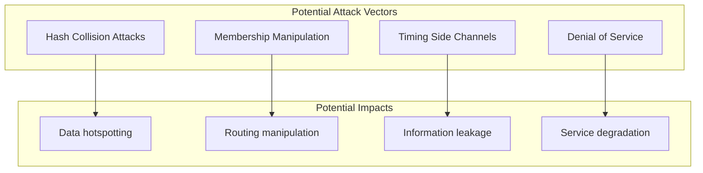
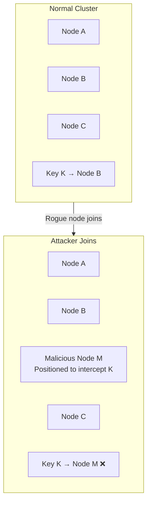

# Security Considerations

[← Back to Index](./00-index.md)

---

## Overview

Consistent hashing is an algorithm, not a system, so security concerns are narrower than full system designs. However, there are important security considerations around hash functions, membership integrity, and potential attack vectors.

---

## Threat Model

### Attack Surface



---

## Threat 1: Hash Collision Attacks

### Description

An attacker who can control key names could craft keys that all hash to the same position, overwhelming a single node.

```
┌─────────────────────────────────────────────────────────────────────┐
│  HASH COLLISION ATTACK                                               │
├─────────────────────────────────────────────────────────────────────┤
│                                                                      │
│  Normal Operation:                                                   │
│    key "user:123"    → hash: 0x3A7B... → Node A                    │
│    key "user:456"    → hash: 0x8C2D... → Node B                    │
│    key "user:789"    → hash: 0x1E5F... → Node C                    │
│                                                                      │
│  Attack:                                                             │
│    Attacker crafts keys that all hash to similar positions:         │
│    key "AAA..."      → hash: 0x3A7B... → Node A                    │
│    key "AAB..."      → hash: 0x3A7C... → Node A                    │
│    key "AAC..."      → hash: 0x3A7D... → Node A                    │
│    ... thousands more                                                │
│                                                                      │
│  Result: Node A overwhelmed, service degraded                        │
│                                                                      │
└─────────────────────────────────────────────────────────────────────┘
```

### Mitigations

| Mitigation | Description | Trade-off |
|------------|-------------|-----------|
| **Keyed Hash (HMAC)** | Hash = HMAC(secret, key) | Requires secret distribution |
| **Random Seed per Instance** | Hash = H(key \|\| seed) | Different routing per client |
| **SipHash** | Designed to resist hash flooding | Slightly slower |
| **Bounded Loads** | Overflow to next node | Added complexity |
| **Rate Limiting** | Limit operations per client | May affect legitimate users |

### Keyed Hash Implementation

```
ALGORITHM SecureHash(key: String, secret: Bytes) → UInt64:
    // Use keyed hash to prevent attacker-controlled collisions

    // Option 1: HMAC
    hmac = HMAC_SHA256(secret, key)
    RETURN TruncateTo64Bits(hmac)

    // Option 2: SipHash (designed for hash tables)
    RETURN SipHash_2_4(secret, key)

    // Option 3: Random prefix
    salted = secret + key
    RETURN xxHash64(salted)

    // Note: All clients must share the same secret
    // Secret should be rotated periodically
```

---

## Threat 2: Membership Manipulation

### Description

An attacker who can add rogue nodes to the cluster could:
- Route traffic through malicious nodes
- Intercept or modify data
- Create targeted hotspots



### Mitigations

```
┌─────────────────────────────────────────────────────────────────────┐
│  MEMBERSHIP SECURITY                                                 │
├─────────────────────────────────────────────────────────────────────┤
│                                                                      │
│  1. Authenticated Membership                                         │
│  ────────────────────────────                                        │
│     - Nodes must present valid credentials to join                  │
│     - mTLS with certificate validation                              │
│     - Pre-shared keys or tokens                                     │
│                                                                      │
│  2. Membership Approval                                              │
│  ───────────────────────                                             │
│     - Explicit approval required for new nodes                      │
│     - Admin consent before adding to ring                           │
│     - Audit log of membership changes                               │
│                                                                      │
│  3. Signed Gossip Messages                                           │
│  ──────────────────────────                                          │
│     - All membership updates cryptographically signed               │
│     - Prevents spoofed join/leave messages                          │
│     - Example: node_join_msg + signature(private_key)               │
│                                                                      │
│  4. Position Constraints                                             │
│  ────────────────────────                                            │
│     - Nodes cannot choose their ring positions                      │
│     - Positions derived from verified node identity                 │
│     - pos = Hash(node_certificate) prevents positioning attacks     │
│                                                                      │
└─────────────────────────────────────────────────────────────────────┘
```

### Secure Node Join Protocol

```
ALGORITHM SecureNodeJoin(newNode):

    // Step 1: Authenticate node identity
    IF NOT VerifyCertificate(newNode.certificate):
        REJECT "Invalid certificate"

    IF NOT IsApprovedNode(newNode.id):
        REJECT "Node not in approved list"

    // Step 2: Verify node can prove private key ownership
    challenge = GenerateRandomChallenge()
    response = newNode.Sign(challenge)
    IF NOT Verify(response, newNode.publicKey):
        REJECT "Failed challenge"

    // Step 3: Derive position from certificate (not node-chosen)
    positions = []
    FOR i FROM 0 TO vnodeCount - 1:
        pos = Hash(newNode.certificateFingerprint + i)
        positions.append(pos)

    // Step 4: Add to ring with audit
    Ring.AddNode(newNode, positions)
    AuditLog.Record("node_join", newNode.id, admin, timestamp)

    // Step 5: Notify cluster with signed message
    joinMsg = SignMessage({
        event: "join",
        nodeId: newNode.id,
        positions: positions,
        certificate: newNode.certificate
    }, ClusterPrivateKey)

    Gossip.Broadcast(joinMsg)
```

---

## Threat 3: Timing Side Channels

### Description

Variations in lookup time could leak information about:
- Which node owns a key
- Ring structure
- Key existence

```
┌─────────────────────────────────────────────────────────────────────┐
│  TIMING ATTACK SCENARIO                                              │
├─────────────────────────────────────────────────────────────────────┤
│                                                                      │
│  Attacker measures response time for different keys:                │
│                                                                      │
│  Key "secret_data_1" → 1.2ms (Node A, fast)                        │
│  Key "secret_data_2" → 5.8ms (Node B, slow)                        │
│  Key "secret_data_3" → 1.3ms (Node A, fast)                        │
│                                                                      │
│  Inference: Keys 1 and 3 are on the same node (Node A)             │
│  Further probing could reveal ring structure                        │
│                                                                      │
│  Risk Level: LOW (usually not a significant concern)                │
│  When it matters: Multi-tenant systems with sensitive data          │
│                                                                      │
└─────────────────────────────────────────────────────────────────────┘
```

### Mitigations

| Mitigation | Description | Effectiveness |
|------------|-------------|---------------|
| **Constant-time lookup** | Pad all lookups to same duration | High |
| **Response jitter** | Add random delay | Medium |
| **Proxy layer** | Hide node identity from client | High |
| **Encrypt node identity** | Return opaque node references | Medium |

---

## Threat 4: Denial of Service

### Description

Attacks that degrade consistent hashing performance or availability.

### Attack Vectors

| Attack | Description | Mitigation |
|--------|-------------|------------|
| **Gossip Flooding** | Spam membership messages | Rate limit gossip, authenticate messages |
| **Ring Churn** | Rapid join/leave cycles | Cooldown periods, approval required |
| **Hash Computation** | Submit complex keys | Input validation, timeouts |
| **Memory Exhaustion** | Add many virtual nodes | Limit vnodes per node |

### Rate Limiting for Membership Changes

```
ALGORITHM RateLimitedMembershipChange(event):

    // Global rate limit on membership changes
    IF MembershipChangeCount(last: 1 minute) > 10:
        REJECT "Too many membership changes"

    // Per-node cooldown
    IF event.type == "join":
        lastLeave = GetLastLeaveTime(event.nodeId)
        IF Now() - lastLeave < 5 minutes:
            REJECT "Node in cooldown period"

    // Require quorum for changes
    IF NOT HasQuorumApproval(event):
        REJECT "Insufficient approval"

    ProcessMembershipChange(event)
```

---

## Security Best Practices

### Hash Function Security

| Recommendation | Reason |
|----------------|--------|
| Use SipHash or keyed xxHash | Resistant to hash flooding |
| Rotate hash keys periodically | Limits attack window |
| Avoid MD5 for security-sensitive contexts | Cryptographically broken |
| Use 64-bit+ hashes | Lower collision probability |

### Membership Security

| Recommendation | Reason |
|----------------|--------|
| Require mTLS for node communication | Prevents impersonation |
| Derive positions from certificates | Prevents positioning attacks |
| Sign all gossip messages | Prevents spoofing |
| Maintain audit log | Forensics and compliance |
| Require explicit approval for joins | Prevents unauthorized nodes |

### Operational Security

| Recommendation | Reason |
|----------------|--------|
| Monitor ring distribution | Detect anomalies |
| Alert on rapid membership changes | Detect attacks |
| Rate limit membership operations | Prevent churn attacks |
| Validate key inputs | Prevent hash attack crafting |

---

## Compliance Considerations

While consistent hashing itself is typically not directly subject to compliance, systems using it may have requirements:

### Data Residency

```
┌─────────────────────────────────────────────────────────────────────┐
│  DATA RESIDENCY WITH CONSISTENT HASHING                              │
├─────────────────────────────────────────────────────────────────────┤
│                                                                      │
│  Requirement: EU data must stay in EU region                        │
│                                                                      │
│  Solutions:                                                          │
│                                                                      │
│  1. Separate Rings per Region                                        │
│     EU Ring: [EU-Node-1, EU-Node-2, EU-Node-3]                      │
│     US Ring: [US-Node-1, US-Node-2, US-Node-3]                      │
│     Route by data classification, not just key hash                 │
│                                                                      │
│  2. Zone-Aware Placement with Constraints                            │
│     When selecting replicas, ONLY pick nodes in allowed zones       │
│     GetReplicas(key, n=3, allowedZones=["eu-west-1", "eu-central"]) │
│                                                                      │
│  3. Key Prefix Routing                                               │
│     Keys starting with "eu:" route to EU ring                       │
│     Keys starting with "us:" route to US ring                       │
│                                                                      │
└─────────────────────────────────────────────────────────────────────┘
```

### Audit Requirements

| Requirement | Implementation |
|-------------|----------------|
| Log all membership changes | Audit log with timestamps, actors |
| Track data movement | Log key migrations with before/after |
| Immutable audit trail | Append-only log, hash chain |
| Retention | Keep logs for required period |

---

## Security Checklist

| Category | Item | Status |
|----------|------|--------|
| **Hash Function** | Using keyed or cryptographic hash | ☐ |
| | Hash keys stored securely | ☐ |
| | Key rotation process defined | ☐ |
| **Membership** | Node authentication required | ☐ |
| | Positions derived from identity | ☐ |
| | Gossip messages signed | ☐ |
| | Membership change audit log | ☐ |
| **Operations** | Rate limiting on membership | ☐ |
| | Monitoring for anomalies | ☐ |
| | Input validation on keys | ☐ |
| **Compliance** | Data residency constraints (if needed) | ☐ |
| | Audit trail for data movement | ☐ |
