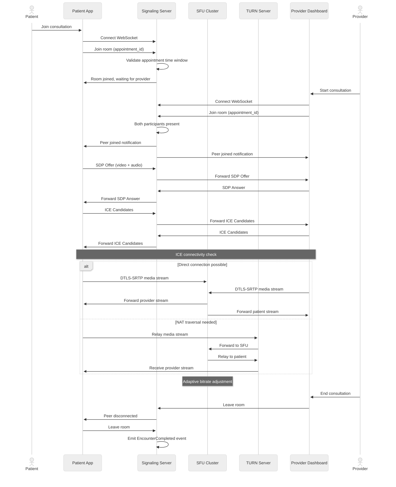
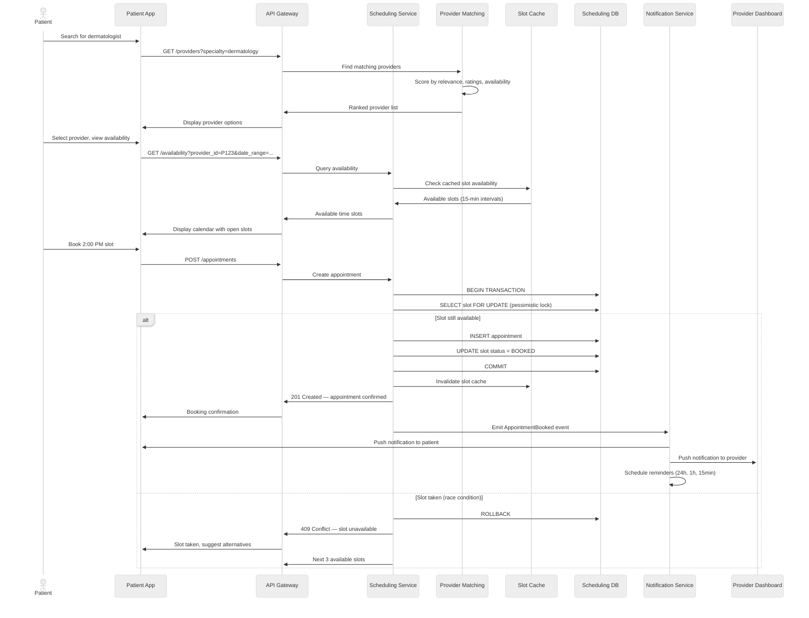
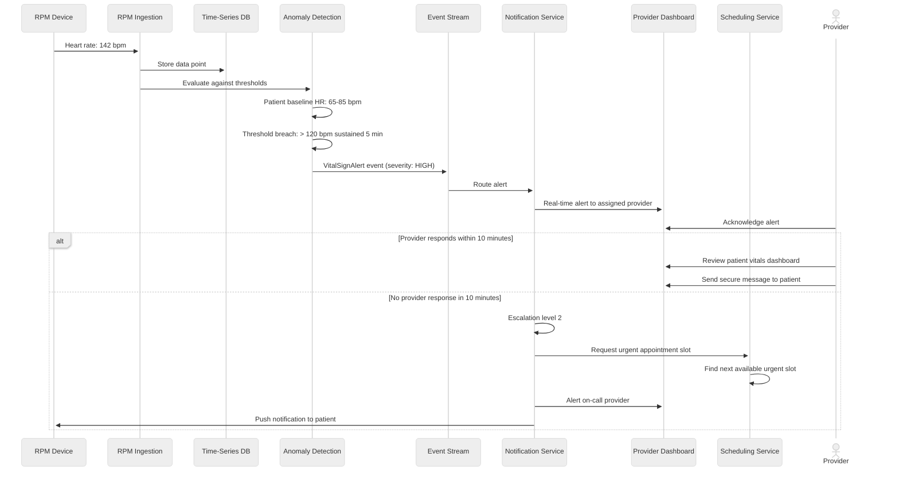

# High-Level Design — Telemedicine Platform

---

## 1. System Architecture

```mermaid
---
config:
  theme: neutral
  look: neo
---
flowchart TB
    subgraph Clients["Client Layer"]
        PA[Patient App<br/>Web + Mobile]
        PD[Provider Dashboard<br/>Web + Desktop]
        AD[Admin Portal]
        RPM_D[RPM Devices<br/>Wearables]
    end

    subgraph Edge["Edge Layer"]
        CDN[CDN / Static Assets]
        TURN[TURN/STUN Servers]
        LB[Load Balancer]
    end

    subgraph Gateway["API Gateway Layer"]
        GW[API Gateway<br/>Auth + Rate Limit]
        FHIR_GW[FHIR Gateway<br/>External EHR Access]
    end

    subgraph Video["Video Infrastructure"]
        SIG[Signaling Server<br/>WebSocket]
        SFU1[SFU Cluster<br/>Region A]
        SFU2[SFU Cluster<br/>Region B]
        REC[Recording Service]
    end

    subgraph Core["Core Services"]
        AUTH[Auth Service<br/>OAuth 2.0 + MFA]
        SCHED[Scheduling Service]
        ENC[Encounter Service]
        PAT[Patient Service]
        PROV[Provider Service]
        PRESC[E-Prescribe Service]
        BILL[Billing Service]
        NOTIFY[Notification Service]
        RPM_S[RPM Ingestion Service]
        DOC[Document Service]
    end

    subgraph AI["AI/ML Layer"]
        TRIAGE[Triage Engine]
        MATCH[Provider Matching]
        NOSHOW[No-Show Predictor]
        ANOMALY[RPM Anomaly Detection]
    end

    subgraph Data["Data Layer"]
        PG[(Primary DB<br/>Patient + Encounter)]
        SCHED_DB[(Scheduling DB<br/>Appointments)]
        TS[(Time-Series DB<br/>RPM + Metrics)]
        DOC_DB[(Document Store<br/>Clinical Docs)]
        CACHE[(Distributed Cache<br/>Sessions + Slots)]
        OBJ[(Object Storage<br/>Recordings + Images)]
        AUDIT[(Audit Log Store<br/>Immutable)]
        SEARCH[(Search Index<br/>Patient Lookup)]
    end

    subgraph Messaging["Event Backbone"]
        STREAM[Event Stream<br/>Ordered Topics]
        DLQ[Dead Letter Queue]
    end

    subgraph External["External Integrations"]
        EHR_EXT[External EHR Systems]
        PHARM[Pharmacy Networks]
        PAYER[Insurance Payers]
        LAB[Lab Systems]
        HIE[Health Information Exchange]
    end

    PA --> CDN
    PA --> LB
    PA --> TURN
    PD --> LB
    AD --> LB
    RPM_D --> LB

    LB --> GW
    GW --> AUTH
    GW --> SCHED
    GW --> ENC
    GW --> PAT
    GW --> PROV
    GW --> PRESC
    GW --> BILL
    GW --> RPM_S
    GW --> DOC

    FHIR_GW --> EHR_EXT
    FHIR_GW --> HIE

    PA --> SIG
    PD --> SIG
    SIG --> SFU1
    SIG --> SFU2
    SFU1 --> REC
    SFU2 --> REC

    SCHED --> MATCH
    SCHED --> NOSHOW
    RPM_S --> ANOMALY
    PAT --> TRIAGE

    AUTH --> CACHE
    PAT --> PG
    ENC --> PG
    PROV --> PG
    SCHED --> SCHED_DB
    SCHED --> CACHE
    RPM_S --> TS
    DOC --> DOC_DB
    REC --> OBJ
    DOC --> OBJ
    BILL --> PG
    PRESC --> PG
    NOTIFY --> STREAM

    ENC --> STREAM
    SCHED --> STREAM
    RPM_S --> STREAM
    BILL --> STREAM
    STREAM --> NOTIFY
    STREAM --> AUDIT
    STREAM --> DLQ

    PRESC --> PHARM
    BILL --> PAYER
    ENC --> LAB
    PAT --> SEARCH

    classDef client fill:#e1f5fe,stroke:#01579b,stroke-width:2px
    classDef edge fill:#fce4ec,stroke:#b71c1c,stroke-width:2px
    classDef gateway fill:#fff3e0,stroke:#e65100,stroke-width:2px
    classDef video fill:#e8eaf6,stroke:#283593,stroke-width:2px
    classDef service fill:#e8f5e9,stroke:#2e7d32,stroke-width:2px
    classDef ai fill:#fff8e1,stroke:#f57f17,stroke-width:2px
    classDef data fill:#f3e5f5,stroke:#6a1b9a,stroke-width:2px
    classDef messaging fill:#e0f7fa,stroke:#00695c,stroke-width:2px
    classDef external fill:#efebe9,stroke:#4e342e,stroke-width:2px

    class PA,PD,AD,RPM_D client
    class CDN,TURN,LB edge
    class GW,FHIR_GW gateway
    class SIG,SFU1,SFU2,REC video
    class AUTH,SCHED,ENC,PAT,PROV,PRESC,BILL,NOTIFY,RPM_S,DOC service
    class TRIAGE,MATCH,NOSHOW,ANOMALY ai
    class PG,SCHED_DB,TS,DOC_DB,CACHE,OBJ,AUDIT,SEARCH data
    class STREAM,DLQ messaging
    class EHR_EXT,PHARM,PAYER,LAB,HIE external
```



---

## 2. Architectural Layers

### Layer 1: Client and Edge

The client layer comprises three distinct applications — a patient-facing app (web + mobile), a provider dashboard (web + desktop), and an administrative portal. Each client connects through a CDN for static assets and a load balancer for API traffic. Video media takes a separate path through TURN/STUN servers for NAT traversal, ensuring connectivity even behind restrictive firewalls. RPM devices connect through a lightweight IoT ingestion endpoint optimized for high-frequency, low-payload messages.

### Layer 2: API Gateway

The API gateway enforces authentication, rate limiting, and request routing. It validates OAuth 2.0 tokens, enforces tenant isolation in multi-tenant deployments, and applies request throttling per client type (patient apps get different limits than provider dashboards). A separate FHIR gateway handles external EHR integration traffic with SMART on FHIR authorization scopes and HL7 FHIR R4 content negotiation.

### Layer 3: Video Infrastructure

The video layer operates independently from the REST API layer due to its unique latency and bandwidth requirements. The signaling server maintains WebSocket connections for session negotiation (SDP offer/answer, ICE candidates). SFU clusters in multiple regions handle media routing — each SFU receives a participant's media stream once and selectively forwards it to other participants. A recording service taps into SFU output streams for consented session recording.

### Layer 4: Core Services

Ten microservices handle domain-specific logic:

| Service | Responsibility | Primary Data Store |
|---|---|---|
| **Auth Service** | Authentication, MFA, token management, session control | Cache + Primary DB |
| **Patient Service** | Patient profiles, demographics, consent, medical history | Primary DB |
| **Provider Service** | Provider profiles, credentials, availability, specialties | Primary DB |
| **Scheduling Service** | Appointment CRUD, availability calculation, conflict detection | Scheduling DB + Cache |
| **Encounter Service** | Clinical session management, documentation, diagnosis coding | Primary DB |
| **E-Prescribe Service** | Prescription creation, formulary check, pharmacy transmission | Primary DB |
| **Billing Service** | Claim generation, eligibility verification, payment processing | Primary DB |
| **RPM Ingestion Service** | Vital sign ingestion, threshold checking, trend computation | Time-Series DB |
| **Document Service** | Clinical document storage, retrieval, CDA generation | Document Store + Object Storage |
| **Notification Service** | Multi-channel notifications (push, SMS, email, in-app) | Event Stream |

### Layer 5: AI/ML Services

AI services operate as stateless inference endpoints consumed by core services:

- **Triage Engine**: Classifies patient symptoms into urgency levels using NLP on intake questionnaires
- **Provider Matching**: Ranks available providers by relevance to the patient's condition, preferences, and historical outcomes
- **No-Show Predictor**: Estimates cancellation probability per appointment for dynamic overbooking decisions
- **RPM Anomaly Detection**: Identifies deviations from patient-specific baselines in continuous vital sign streams

### Layer 6: Data Layer

The data layer uses polyglot persistence — each data type stored in the optimal engine:

- **Relational DB**: Patient demographics, encounters, prescriptions, billing — ACID transactions required
- **Scheduling DB**: Separate relational store optimized for range queries on time slots and provider availability
- **Time-Series DB**: RPM vital signs and video quality metrics — optimized for append-heavy, time-range queries
- **Document Store**: Clinical documents, consent records, CDA documents — schema-flexible
- **Distributed Cache**: Session state, scheduling slot availability, provider online status — low-latency reads
- **Object Storage**: Encrypted recordings, medical images, uploaded documents — durable, cost-effective
- **Audit Log Store**: Append-only, immutable storage for HIPAA audit trail — write-once, read-many
- **Search Index**: Patient and provider lookup with PHI-aware field-level encryption

### Layer 7: Event Backbone

An event streaming platform provides asynchronous communication between services. Domain events (AppointmentBooked, EncounterCompleted, PrescriptionSent, VitalSignAlert) flow through ordered topics. Every event is persisted to the audit log store for HIPAA compliance. A dead letter queue captures failed event processing for retry and investigation.

---

## 3. Core Data Flows

### 3.1 Video Consultation Flow



### 3.2 Appointment Scheduling Flow



### 3.3 RPM Alert Escalation Flow



---

## 4. Key Architectural Decisions

### Decision 1: SFU Over MCU for Video Routing

| Aspect | Detail |
|---|---|
| **Decision** | Use Selective Forwarding Unit (SFU) instead of Multipoint Control Unit (MCU) for video routing |
| **Context** | Telemedicine video requires low latency and clinical-grade quality; most sessions are 1:1 with occasional multi-party |
| **Rationale** | SFU forwards encrypted streams without transcoding, preserving end-to-end encryption and reducing server CPU by 10x vs. MCU. SFU latency is 50-100ms lower than MCU since no decode/encode cycle occurs. For 1:1 consultations, SFU overhead is minimal |
| **Trade-off** | Client-side bandwidth increases with multi-party (each participant downloads N-1 streams). For 4-party consults, client needs 3x download bandwidth |
| **Mitigation** | Implement simulcast (each sender publishes multiple quality layers) so the SFU can forward lower-quality streams to bandwidth-constrained participants. Limit multi-party sessions to 6 participants |

### Decision 2: Separate Scheduling Database

| Aspect | Detail |
|---|---|
| **Decision** | Dedicated relational database for scheduling rather than sharing the primary patient/encounter database |
| **Context** | Scheduling has unique access patterns: heavy range queries on time slots, high-frequency availability checks, and strict serializability for double-booking prevention |
| **Rationale** | Isolating scheduling data prevents hot-path availability queries from competing with clinical data writes. Enables independent scaling and optimization (covering indexes on provider_id + time_range) |
| **Trade-off** | Cross-database joins are not possible; encounter-appointment correlation requires application-level joins |
| **Mitigation** | Denormalize appointment summary into encounter records via domain events. Cache frequently accessed appointment data in the distributed cache |

### Decision 3: Event-Driven PHI Audit Trail

| Aspect | Detail |
|---|---|
| **Decision** | All PHI access events flow through the event backbone to an append-only audit store rather than relying on database-level audit triggers |
| **Context** | HIPAA requires comprehensive audit trails of all PHI access; database triggers create tight coupling and performance overhead |
| **Rationale** | Event-driven audit decouples audit logging from the hot path, supports cross-service audit aggregation, and enables immutable storage with cryptographic integrity verification |
| **Trade-off** | Audit events are eventually consistent — there is a brief window where an access has occurred but the audit record has not yet been written |
| **Mitigation** | Use synchronous audit logging for high-sensitivity operations (PHI bulk export, record deletion). Async audit for routine read operations with sub-second propagation SLO |

### Decision 4: Polyglot Persistence

| Aspect | Detail |
|---|---|
| **Decision** | Use specialized data stores for different data types rather than a single unified database |
| **Context** | Telemedicine data spans relational (patients, appointments), time-series (vitals), documents (clinical notes), binary (recordings), and search (patient lookup) |
| **Rationale** | Each data type has fundamentally different access patterns, retention policies, and scaling characteristics. A time-series DB handles 500M RPM data points/day far more efficiently than a relational DB |
| **Trade-off** | Operational complexity increases with each additional data store; cross-store queries require application-level orchestration |
| **Mitigation** | Standardize on a small set of well-understood stores. Use the event backbone to maintain materialized views for cross-domain queries. Invest in a unified observability layer across all stores |

### Decision 5: FHIR-Native Internal Data Model

| Aspect | Detail |
|---|---|
| **Decision** | Model internal clinical data structures to align with HL7 FHIR R4 resources rather than proprietary schemas |
| **Context** | The 21st Century Cures Act mandates interoperability; FHIR is the standard for health data exchange |
| **Rationale** | FHIR-aligned internal models eliminate costly transformation layers for EHR integration, simplify data export for patient access, and leverage the extensive FHIR ecosystem of validation and terminology tools |
| **Trade-off** | FHIR resources can be verbose and don't always map cleanly to UI requirements; some internal optimizations (denormalization) conflict with FHIR's normalized structure |
| **Mitigation** | Use FHIR as the canonical model for storage and exchange, but create optimized read projections (CQRS pattern) for UI-facing queries. Internal services communicate using compact event formats |

---

## 5. Inter-Service Communication

### Synchronous Communication

Services use REST over HTTPS for request-response patterns where the caller needs an immediate result:

- **Scheduling → Provider Service**: Real-time availability check
- **Encounter → E-Prescribe**: Formulary validation during prescription creation
- **API Gateway → Auth Service**: Token validation on every request
- **Billing → Payer Integration**: Real-time eligibility verification

### Asynchronous Communication

Event-driven messaging for operations that don't require immediate response:

- **Encounter Service → Notification Service**: Send after-visit summary
- **RPM Ingestion → Anomaly Detection**: Process vital sign streams
- **Scheduling Service → Billing Service**: Generate pre-visit billing estimate
- **Any Service → Audit Store**: PHI access logging

### Saga Pattern for Multi-Service Transactions

Complex workflows span multiple services and use choreography-based sagas:

```
Appointment Booking Saga:
  1. Scheduling Service: Reserve time slot (compensating: release slot)
  2. Billing Service: Verify insurance eligibility (compensating: cancel pre-auth)
  3. Notification Service: Send confirmation (compensating: send cancellation)
  4. EHR Service: Create placeholder encounter (compensating: delete encounter)

If step 2 fails (insurance declined):
  → Compensate step 1 (release slot)
  → Notify patient of insurance issue
  → Suggest self-pay option
```

---

## 6. Deployment Topology

```
Region A (Primary)                          Region B (DR + Overflow)
┌─────────────────────────────┐            ┌─────────────────────────────┐
│  ┌───────────┐ ┌──────────┐ │            │  ┌───────────┐ ┌──────────┐ │
│  │ SFU Pool  │ │ API Pods │ │            │  │ SFU Pool  │ │ API Pods │ │
│  │ (50 nodes)│ │ (auto)   │ │            │  │ (25 nodes)│ │ (auto)   │ │
│  └───────────┘ └──────────┘ │            │  └───────────┘ └──────────┘ │
│  ┌───────────┐ ┌──────────┐ │            │  ┌───────────┐ ┌──────────┐ │
│  │ Primary DB│ │ Cache    │ │  ──sync──▶ │  │ Replica DB│ │ Cache    │ │
│  │ (Leader)  │ │ Cluster  │ │            │  │ (Follower)│ │ Cluster  │ │
│  └───────────┘ └──────────┘ │            │  └───────────┘ └──────────┘ │
│  ┌───────────┐ ┌──────────┐ │            │  ┌───────────┐ ┌──────────┐ │
│  │ Event     │ │ Object   │ │  ──sync──▶ │  │ Event     │ │ Object   │ │
│  │ Stream    │ │ Storage  │ │            │  │ Stream    │ │ Storage  │ │
│  └───────────┘ └──────────┘ │            │  └───────────┘ └──────────┘ │
└─────────────────────────────┘            └─────────────────────────────┘

SFU Routing: Geo-DNS routes patients to nearest SFU cluster
API Routing: Active-passive with automatic failover
Data Replication: Synchronous for PHI, async for analytics
```

---

*Previous: [Requirements & Estimations ←](./01-requirements-and-estimations.md) | Next: [Low-Level Design →](./03-low-level-design.md)*
