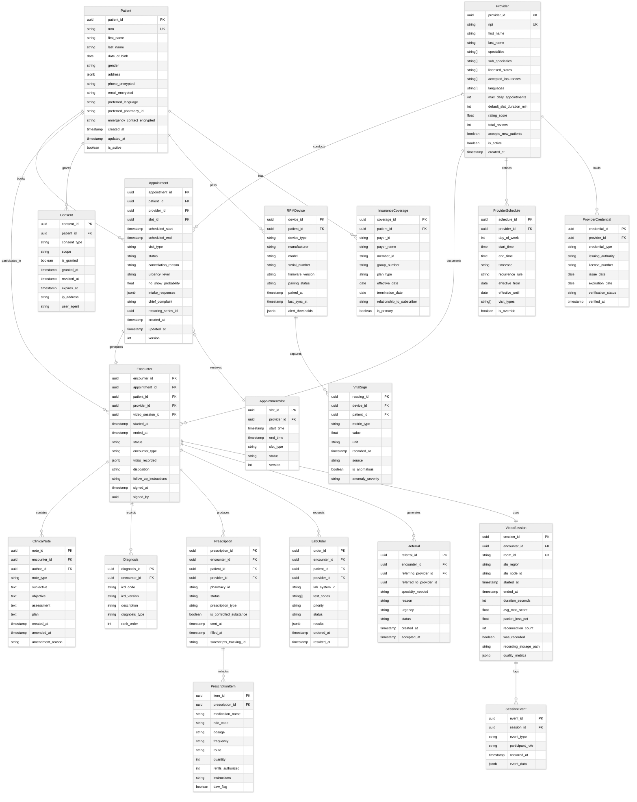

# Low-Level Design — Telemedicine Platform

---

## 1. Data Model



### Data Model Invariants

1. **Appointment slot uniqueness**: A slot can be assigned to at most one active appointment (enforced via optimistic locking with version column)
2. **Encounter lifecycle**: An encounter can only transition through: CREATED → IN_PROGRESS → DOCUMENTING → SIGNED → AMENDED
3. **Prescription immutability**: Once sent to pharmacy network, prescription records are append-only (amendments create new records)
4. **Consent precedence**: PHI access checks must verify active consent before any data retrieval
5. **Audit completeness**: Every write to a PHI-containing table generates an audit event before the transaction commits

---

## 2. API Design

### 2.1 Appointment APIs

```
POST   /api/v1/appointments
GET    /api/v1/appointments/{appointment_id}
PATCH  /api/v1/appointments/{appointment_id}
DELETE /api/v1/appointments/{appointment_id}
GET    /api/v1/appointments?patient_id={id}&status={status}&from={date}&to={date}

GET    /api/v1/providers/{provider_id}/availability
         ?from={datetime}&to={datetime}&visit_type={type}&duration={minutes}

POST   /api/v1/appointments/{appointment_id}/reschedule
POST   /api/v1/appointments/{appointment_id}/cancel
POST   /api/v1/appointments/{appointment_id}/checkin
```

**Create Appointment — Request:**
```json
{
  "patient_id": "pat_a1b2c3d4",
  "provider_id": "prov_e5f6g7h8",
  "slot_id": "slot_i9j0k1l2",
  "visit_type": "FOLLOW_UP",
  "chief_complaint": "Follow-up on skin rash treatment",
  "urgency_level": "ROUTINE",
  "intake_responses": {
    "current_medications": ["topical corticosteroid"],
    "symptom_duration": "2 weeks",
    "symptom_severity": "improving"
  }
}
```

**Create Appointment — Response (201 Created):**
```json
{
  "appointment_id": "apt_m3n4o5p6",
  "patient_id": "pat_a1b2c3d4",
  "provider_id": "prov_e5f6g7h8",
  "scheduled_start": "2026-03-15T14:00:00Z",
  "scheduled_end": "2026-03-15T14:15:00Z",
  "visit_type": "FOLLOW_UP",
  "status": "CONFIRMED",
  "video_room_url": "/consult/room/apt_m3n4o5p6",
  "reminders": [
    {"channel": "push", "scheduled_at": "2026-03-14T14:00:00Z"},
    {"channel": "sms", "scheduled_at": "2026-03-15T13:00:00Z"},
    {"channel": "push", "scheduled_at": "2026-03-15T13:45:00Z"}
  ]
}
```

### 2.2 Video Session APIs

```
POST   /api/v1/video/sessions
         → Creates a video room and returns signaling server URL

GET    /api/v1/video/sessions/{session_id}
         → Returns session status, participants, quality metrics

POST   /api/v1/video/sessions/{session_id}/join
         → Returns ICE servers, room token, SFU endpoint

POST   /api/v1/video/sessions/{session_id}/leave
DELETE /api/v1/video/sessions/{session_id}

POST   /api/v1/video/sessions/{session_id}/recording/start
POST   /api/v1/video/sessions/{session_id}/recording/stop

GET    /api/v1/video/sessions/{session_id}/quality
         → Real-time quality metrics (MOS, packet loss, jitter)
```

**Join Session — Response:**
```json
{
  "session_id": "vs_q7r8s9t0",
  "room_id": "room_apt_m3n4o5p6",
  "signaling_url": "wss://sig.example.com/ws",
  "room_token": "eyJ...<JWT with room permissions>",
  "ice_servers": [
    {"urls": ["stun:stun.example.com:3478"]},
    {
      "urls": ["turn:turn-us-east.example.com:443?transport=tcp"],
      "username": "session_credential",
      "credential": "ephemeral_password",
      "credentialType": "password"
    }
  ],
  "sfu_endpoint": "sfu-us-east-1.example.com",
  "participant_config": {
    "max_video_bitrate_kbps": 2500,
    "simulcast_layers": [
      {"rid": "f", "maxBitrate": 2500000, "maxFramerate": 30},
      {"rid": "h", "maxBitrate": 500000, "maxFramerate": 15},
      {"rid": "q", "maxBitrate": 150000, "maxFramerate": 7}
    ]
  }
}
```

### 2.3 Encounter and Clinical APIs

```
POST   /api/v1/encounters
GET    /api/v1/encounters/{encounter_id}
PATCH  /api/v1/encounters/{encounter_id}
POST   /api/v1/encounters/{encounter_id}/sign

POST   /api/v1/encounters/{encounter_id}/notes
GET    /api/v1/encounters/{encounter_id}/notes
PATCH  /api/v1/encounters/{encounter_id}/notes/{note_id}
POST   /api/v1/encounters/{encounter_id}/notes/{note_id}/amend

POST   /api/v1/encounters/{encounter_id}/diagnoses
POST   /api/v1/encounters/{encounter_id}/prescriptions
POST   /api/v1/encounters/{encounter_id}/lab-orders
POST   /api/v1/encounters/{encounter_id}/referrals

GET    /api/v1/patients/{patient_id}/timeline
         ?from={date}&to={date}&types={encounter,rpm,message}
```

**Create Prescription — Request:**
```json
{
  "encounter_id": "enc_u1v2w3x4",
  "pharmacy_id": "pharm_y5z6a7b8",
  "items": [
    {
      "medication_name": "Amoxicillin",
      "ndc_code": "0093-4160-01",
      "dosage": "500mg",
      "frequency": "three times daily",
      "route": "oral",
      "quantity": 30,
      "refills_authorized": 0,
      "instructions": "Take with food. Complete full course.",
      "daw_flag": false
    }
  ]
}
```

### 2.4 RPM APIs

```
POST   /api/v1/rpm/readings          (batch ingestion endpoint)
GET    /api/v1/rpm/patients/{patient_id}/vitals
         ?metric={heart_rate}&from={datetime}&to={datetime}&granularity={1m|5m|1h|1d}

GET    /api/v1/rpm/patients/{patient_id}/alerts
         ?status={active|acknowledged|resolved}

POST   /api/v1/rpm/patients/{patient_id}/alerts/{alert_id}/acknowledge
PUT    /api/v1/rpm/patients/{patient_id}/thresholds

GET    /api/v1/rpm/devices?patient_id={id}
POST   /api/v1/rpm/devices/pair
DELETE /api/v1/rpm/devices/{device_id}
```

**Batch Vital Sign Ingestion — Request:**
```json
{
  "device_id": "dev_c9d0e1f2",
  "readings": [
    {
      "metric_type": "HEART_RATE",
      "value": 78.0,
      "unit": "bpm",
      "recorded_at": "2026-03-09T10:30:00Z"
    },
    {
      "metric_type": "BLOOD_OXYGEN",
      "value": 97.5,
      "unit": "percent",
      "recorded_at": "2026-03-09T10:30:00Z"
    },
    {
      "metric_type": "BLOOD_PRESSURE_SYSTOLIC",
      "value": 128.0,
      "unit": "mmHg",
      "recorded_at": "2026-03-09T10:30:00Z"
    }
  ]
}
```

### 2.5 FHIR Interoperability APIs

```
GET    /fhir/r4/Patient/{id}
GET    /fhir/r4/Patient?identifier={mrn}
GET    /fhir/r4/Encounter?patient={id}&date={range}
GET    /fhir/r4/Observation?patient={id}&category={vital-signs}
GET    /fhir/r4/MedicationRequest?patient={id}&status={active}
GET    /fhir/r4/Condition?patient={id}
GET    /fhir/r4/DocumentReference?patient={id}

POST   /fhir/r4/Bundle              (transaction bundle for batch operations)
GET    /fhir/r4/$export             (bulk data export — async)
```

---

## 3. Core Algorithms

### 3.1 Provider Matching Algorithm

```
ALGORITHM MatchProviders(patient, condition, preferences)

INPUT:
  patient          — patient profile with location, insurance, language, history
  condition        — chief complaint and symptom classification
  preferences      — scheduling window, gender preference, rating threshold

OUTPUT:
  ranked_providers — ordered list of providers with match scores

PROCEDURE:
  1. FILTER eligible providers:
     a. specialty MATCHES condition.required_specialty
     b. licensed_states CONTAINS patient.state
     c. accepted_insurances CONTAINS patient.insurance_plan
     d. is_active = TRUE AND accepts_new_patients = TRUE
     e. has_availability_in(preferences.date_range) = TRUE

  2. FOR EACH eligible provider:
     score = 0.0

     // Specialty relevance (0-30 points)
     IF provider.sub_specialties INTERSECTS condition.relevant_sub_specialties
       score += 30
     ELSE
       score += 15  // general specialty match

     // Language match (0-15 points)
     IF provider.languages CONTAINS patient.preferred_language
       score += 15
     ELSE IF provider.languages CONTAINS "English"
       score += 5

     // Availability alignment (0-20 points)
     available_slots = get_slots(provider, preferences.date_range)
     preferred_slots = filter_by_time_preference(available_slots, preferences)
     score += MIN(20, preferred_slots.count * 4)

     // Historical quality (0-20 points)
     score += provider.rating_score / 5.0 * 15
     IF provider.total_reviews > 100
       score += 5  // confidence bonus for well-reviewed providers

     // Continuity of care (0-15 points)
     IF patient has prior encounters with provider
       recent_encounter = most_recent_encounter(patient, provider)
       days_since = days_between(now, recent_encounter.date)
       IF days_since < 90
         score += 15  // strong continuity
       ELSE IF days_since < 365
         score += 10  // moderate continuity

     provider.match_score = score

  3. SORT eligible_providers BY match_score DESCENDING

  4. RETURN top 10 providers with scores and available slots
```

### 3.2 Appointment Slot Optimization Algorithm

```
ALGORITHM OptimizeScheduleSlots(provider, date, visit_requests)

INPUT:
  provider       — provider profile with schedule template
  date           — target scheduling date
  visit_requests — queue of pending appointment requests with type and urgency

OUTPUT:
  optimized_schedule — slot assignments that maximize utilization and urgency coverage

PROCEDURE:
  1. LOAD provider schedule template for date
     base_slots = generate_base_slots(provider.schedule, date)
     // e.g., 9:00-17:00 in 15-min increments = 32 base slots

  2. CLASSIFY visit requests by type:
     urgent_queue    = filter(visit_requests, urgency IN ["EMERGENT", "URGENT"])
     routine_queue   = filter(visit_requests, urgency = "ROUTINE")
     followup_queue  = filter(visit_requests, urgency = "FOLLOW_UP")

  3. CALCULATE dynamic slot durations:
     FOR EACH request IN visit_requests:
       base_duration = VISIT_TYPE_DURATION[request.visit_type]
       // Adjust based on provider's historical overrun
       provider_overrun = get_avg_overrun(provider, request.visit_type)
       request.estimated_duration = base_duration + provider_overrun * 0.5

  4. RESERVE urgent slots first:
     urgent_reserved = CEIL(base_slots.count * 0.10)  // 10% for urgent
     FOR i = 1 TO urgent_reserved:
       mark_slot(base_slots[i * 3], "URGENT_RESERVED")  // spread throughout day

  5. APPLY no-show overbooking:
     FOR EACH slot IN base_slots:
       IF slot is assigned:
         no_show_prob = predict_no_show(slot.appointment)
         IF no_show_prob > 0.30:
           mark_slot_as_overbook_eligible(slot)
           // Allow one additional booking at this time

  6. ASSIGN requests to slots using priority scheduling:
     // Priority: EMERGENT > URGENT > ROUTINE with early preferred > FOLLOW_UP
     sorted_requests = sort_by_priority(urgent_queue + routine_queue + followup_queue)

     FOR EACH request IN sorted_requests:
       compatible_slots = filter_slots(base_slots,
         duration >= request.estimated_duration,
         status IN ["AVAILABLE", "OVERBOOK_ELIGIBLE"],
         time IN request.preferred_window)

       IF compatible_slots is not empty:
         best_slot = select_slot_minimize_fragmentation(compatible_slots)
         assign(request, best_slot)
       ELSE:
         add_to_waitlist(request)

  7. OPTIMIZE buffer time:
     FOR EACH consecutive pair (slot_a, slot_b) IN assigned_slots:
       IF slot_a.visit_type = "NEW_PATIENT" OR slot_a.estimated_duration > 20 min:
         insert_buffer(slot_a, slot_b, duration = 5 min)

  8. RETURN optimized_schedule with assignments and waitlist
```

### 3.3 Video Session Routing Algorithm

```
ALGORITHM RouteVideoSession(patient, provider, session_config)

INPUT:
  patient        — patient client info (IP, region, network type)
  provider       — provider client info (IP, region, network type)
  session_config — video quality requirements, recording enabled

OUTPUT:
  routing_plan   — SFU assignment, TURN allocation, quality settings

PROCEDURE:
  1. DETERMINE client regions:
     patient_region  = geolocate(patient.ip_address)
     provider_region = geolocate(provider.ip_address)

  2. SELECT optimal SFU cluster:
     candidate_sfus = get_active_sfu_clusters()

     FOR EACH sfu IN candidate_sfus:
       sfu.patient_latency  = estimate_latency(patient_region, sfu.region)
       sfu.provider_latency = estimate_latency(provider_region, sfu.region)
       sfu.total_latency    = sfu.patient_latency + sfu.provider_latency
       sfu.load_score       = sfu.current_sessions / sfu.max_capacity
       sfu.health_score     = get_health_score(sfu)  // 0.0 to 1.0

       // Weighted routing score (lower is better)
       sfu.routing_score = (sfu.total_latency * 0.5)
                         + (sfu.load_score * 100 * 0.3)
                         + ((1 - sfu.health_score) * 100 * 0.2)

     selected_sfu = MIN(candidate_sfus, BY routing_score)

     // Verify selected SFU has capacity headroom
     IF selected_sfu.load_score > 0.85:
       trigger_scale_up(selected_sfu.cluster)
       // Still use it but alert operations

  3. DETERMINE TURN relay necessity:
     patient_nat_type  = detect_nat_type(patient.network_info)
     provider_nat_type = detect_nat_type(provider.network_info)

     needs_turn = FALSE
     IF patient_nat_type = "SYMMETRIC" OR provider_nat_type = "SYMMETRIC":
       needs_turn = TRUE
     IF patient.network_type = "CORPORATE_FIREWALL":
       needs_turn = TRUE

     IF needs_turn:
       turn_server = select_nearest_turn(patient_region, provider_region)
       allocate_turn_credentials(turn_server, session_ttl = 2 hours)

  4. CONFIGURE quality parameters:
     min_bandwidth = MIN(patient.estimated_bandwidth, provider.estimated_bandwidth)

     IF min_bandwidth >= 2500 kbps:
       quality_profile = "HD_1080P"
       simulcast_layers = [1080p, 540p, 180p]
     ELSE IF min_bandwidth >= 1000 kbps:
       quality_profile = "HD_720P"
       simulcast_layers = [720p, 360p, 180p]
     ELSE IF min_bandwidth >= 500 kbps:
       quality_profile = "SD_480P"
       simulcast_layers = [480p, 180p]
     ELSE:
       quality_profile = "AUDIO_PRIORITY"
       simulcast_layers = [180p]  // minimal video + full audio

  5. IF session_config.recording_enabled:
     recording_node = select_recording_node(selected_sfu.cluster)
     configure_recording_tap(selected_sfu, recording_node)

  6. RETURN routing_plan = {
       sfu_endpoint: selected_sfu.endpoint,
       sfu_region: selected_sfu.region,
       turn_servers: turn_config OR null,
       quality_profile: quality_profile,
       simulcast_layers: simulcast_layers,
       recording_node: recording_node OR null,
       estimated_latency: selected_sfu.total_latency
     }
```

### 3.4 RPM Anomaly Detection Algorithm

```
ALGORITHM DetectVitalSignAnomaly(patient_id, new_reading)

INPUT:
  patient_id  — patient identifier
  new_reading — { metric_type, value, unit, recorded_at }

OUTPUT:
  anomaly_result — { is_anomalous, severity, recommended_action }

PROCEDURE:
  1. LOAD patient context:
     thresholds   = get_alert_thresholds(patient_id, new_reading.metric_type)
     baseline     = get_rolling_baseline(patient_id, new_reading.metric_type, window = 14 days)
     recent_data  = get_recent_readings(patient_id, new_reading.metric_type, window = 1 hour)
     medications  = get_active_medications(patient_id)

  2. CHECK absolute threshold breach:
     IF new_reading.value > thresholds.critical_high
        OR new_reading.value < thresholds.critical_low:
       RETURN { is_anomalous: TRUE, severity: "CRITICAL",
                recommended_action: "IMMEDIATE_PROVIDER_ALERT" }

     IF new_reading.value > thresholds.warning_high
        OR new_reading.value < thresholds.warning_low:
       threshold_breach = "WARNING"
     ELSE:
       threshold_breach = NONE

  3. CHECK rate of change:
     IF recent_data.count >= 3:
       slope = linear_regression_slope(recent_data)
       // Rapid change detection
       rate_of_change = ABS(slope) / baseline.mean

       IF rate_of_change > 0.20:  // >20% change per hour
         rate_alert = "HIGH"
       ELSE IF rate_of_change > 0.10:
         rate_alert = "MODERATE"
       ELSE:
         rate_alert = NONE

  4. CHECK statistical deviation:
     z_score = (new_reading.value - baseline.mean) / baseline.std_dev

     IF ABS(z_score) > 3.0:
       statistical_alert = "HIGH"
     ELSE IF ABS(z_score) > 2.0:
       statistical_alert = "MODERATE"
     ELSE:
       statistical_alert = NONE

  5. CHECK sustained deviation:
     sustained_window = recent_data.last(15 minutes)
     IF ALL readings IN sustained_window exceed thresholds.warning_high
        OR ALL readings IN sustained_window below thresholds.warning_low:
       sustained_alert = "HIGH"
     ELSE:
       sustained_alert = NONE

  6. AGGREGATE alerts into severity:
     alerts = [threshold_breach, rate_alert, statistical_alert, sustained_alert]
     high_count = count(alerts, value = "HIGH")
     moderate_count = count(alerts, value = "MODERATE")

     IF high_count >= 2 OR (high_count >= 1 AND sustained_alert = "HIGH"):
       severity = "CRITICAL"
       action = "IMMEDIATE_PROVIDER_ALERT"
     ELSE IF high_count >= 1 OR moderate_count >= 2:
       severity = "HIGH"
       action = "PROVIDER_NOTIFICATION"
     ELSE IF moderate_count >= 1 OR threshold_breach = "WARNING":
       severity = "MODERATE"
       action = "ADD_TO_REVIEW_QUEUE"
     ELSE:
       severity = "NORMAL"
       action = "LOG_ONLY"

  7. MEDICATION context adjustment:
     // Some medications cause expected vital sign changes
     IF medication_causes_expected_change(medications, new_reading.metric_type):
       IF severity IN ["MODERATE", "HIGH"]:
         severity = downgrade_one_level(severity)
         action = append_note(action, "medication context noted")

  8. RETURN anomaly_result = {
       is_anomalous: severity != "NORMAL",
       severity: severity,
       recommended_action: action,
       contributing_factors: alerts,
       patient_baseline: baseline,
       z_score: z_score
     }
```

### 3.5 No-Show Prediction Algorithm

```
ALGORITHM PredictNoShow(appointment)

INPUT:
  appointment — appointment details with patient and scheduling context

OUTPUT:
  probability — float 0.0 to 1.0 indicating no-show likelihood

PROCEDURE:
  1. EXTRACT features:
     patient = get_patient(appointment.patient_id)
     history = get_appointment_history(patient.id, last_12_months)

     features = {
       // Patient history features
       historical_no_show_rate:  count_no_shows(history) / MAX(history.count, 1),
       total_past_appointments:  history.count,
       days_since_last_visit:    days_between(now, last_completed(history)),

       // Appointment features
       lead_time_days:           days_between(appointment.created_at, appointment.scheduled_start),
       is_follow_up:             appointment.visit_type = "FOLLOW_UP",
       is_first_visit:           history.count = 0,
       day_of_week:              appointment.scheduled_start.day_of_week,
       hour_of_day:              appointment.scheduled_start.hour,
       is_weekend:               day_of_week IN [6, 7],

       // Engagement features
       confirmed_via_reminder:   check_reminder_confirmation(appointment.id),
       used_patient_portal_7d:   check_portal_activity(patient.id, 7 days),

       // External features
       weather_severity:         get_weather_forecast(patient.location, appointment.date),
       is_holiday_adjacent:      check_holiday_proximity(appointment.date, window = 1 day)
     }

  2. APPLY scoring model:
     // Logistic regression with learned weights
     base_score = 0.15  // population baseline no-show rate

     // Historical behavior (strongest signal)
     IF features.total_past_appointments >= 3:
       base_score = features.historical_no_show_rate * 0.60 + base_score * 0.40

     // Adjustment factors
     adjustments = 0.0

     IF features.lead_time_days > 14:
       adjustments += 0.08  // long lead time increases no-show
     IF features.lead_time_days > 30:
       adjustments += 0.05

     IF features.confirmed_via_reminder:
       adjustments -= 0.12  // confirmation reduces no-show significantly

     IF features.is_follow_up AND features.days_since_last_visit < 30:
       adjustments -= 0.05  // recent care engagement reduces no-show

     IF features.is_first_visit:
       adjustments += 0.10  // new patients have higher no-show rates

     IF NOT features.used_patient_portal_7d:
       adjustments += 0.04  // low engagement signal

     IF features.hour_of_day < 9 OR features.hour_of_day > 16:
       adjustments += 0.03  // off-hours slightly higher

     probability = CLAMP(base_score + adjustments, 0.02, 0.95)

  3. RETURN probability
```

### 3.6 Waiting Room Queue Management

```
ALGORITHM ManageWaitingRoom(provider_id)

INPUT:
  provider_id — provider whose waiting room to manage

OUTPUT:
  queue_state — ordered list of waiting patients with estimated wait times

PROCEDURE:
  1. LOAD current state:
     active_session = get_active_session(provider_id)
     waiting_patients = get_checked_in_patients(provider_id, status = "WAITING")
     upcoming_appointments = get_upcoming_appointments(provider_id, window = 2 hours)

  2. ESTIMATE current session remaining time:
     IF active_session exists:
       elapsed = now - active_session.started_at
       visit_type = active_session.appointment.visit_type
       avg_duration = get_avg_duration(provider_id, visit_type)
       estimated_remaining = MAX(0, avg_duration - elapsed)
     ELSE:
       estimated_remaining = 0

  3. ORDER waiting patients:
     FOR EACH patient IN waiting_patients:
       patient.priority_score = calculate_queue_priority(patient)

     FUNCTION calculate_queue_priority(patient):
       score = 0
       // Appointment time priority (earlier appointment = higher priority)
       minutes_past_scheduled = (now - patient.appointment.scheduled_start) / 60
       score += minutes_past_scheduled * 10

       // Urgency boost
       IF patient.appointment.urgency_level = "URGENT":
         score += 100
       ELSE IF patient.appointment.urgency_level = "SEMI_URGENT":
         score += 50

       // Wait time fairness
       wait_minutes = (now - patient.checked_in_at) / 60
       score += wait_minutes * 5

       RETURN score

     SORT waiting_patients BY priority_score DESCENDING

  4. CALCULATE estimated wait times:
     cumulative_wait = estimated_remaining
     FOR EACH patient IN waiting_patients (ordered):
       patient.estimated_wait = cumulative_wait
       patient.estimated_start = now + cumulative_wait
       visit_duration = get_avg_duration(provider_id, patient.appointment.visit_type)
       cumulative_wait += visit_duration

  5. DETECT and handle delays:
     FOR EACH patient IN waiting_patients:
       IF patient.estimated_wait > 30 minutes:
         notify_patient(patient, "extended_wait",
           estimated_wait = patient.estimated_wait)
       IF patient.estimated_wait > 45 minutes:
         offer_reschedule_or_provider_transfer(patient)

  6. RETURN queue_state = {
       provider_id: provider_id,
       active_session: { patient_id, elapsed, estimated_remaining },
       queue: waiting_patients.map(p => {
         patient_id, position, estimated_wait, estimated_start, urgency
       }),
       provider_running_late: estimated_remaining > avg_duration * 1.2,
       next_available: now + cumulative_wait
     }
```

---

## 4. Event Schema Design

### Event Envelope

```json
{
  "event_id": "evt_unique_id",
  "event_type": "telemedicine.appointment.booked",
  "version": "1.0",
  "source": "scheduling-service",
  "timestamp": "2026-03-09T10:30:00.000Z",
  "correlation_id": "req_abc123",
  "tenant_id": "tenant_health_system_a",
  "data": { },
  "metadata": {
    "contains_phi": true,
    "phi_fields": ["patient_id", "chief_complaint"],
    "audit_classification": "PHI_ACCESS"
  }
}
```

### Event Type Hierarchy

```
telemedicine.
├── appointment.
│   ├── booked
│   ├── rescheduled
│   ├── cancelled
│   ├── checked_in
│   ├── no_show
│   └── reminder_sent
├── encounter.
│   ├── started
│   ├── ended
│   ├── note_signed
│   └── amended
├── video.
│   ├── session_created
│   ├── participant_joined
│   ├── participant_left
│   ├── quality_degraded
│   ├── recording_started
│   └── recording_completed
├── prescription.
│   ├── created
│   ├── sent_to_pharmacy
│   ├── filled
│   └── denied
├── rpm.
│   ├── reading_ingested
│   ├── threshold_breached
│   ├── anomaly_detected
│   └── alert_acknowledged
├── billing.
│   ├── claim_submitted
│   ├── claim_adjudicated
│   └── payment_received
└── phi_access.
    ├── record_viewed
    ├── record_exported
    └── record_shared
```

---

## 5. FHIR Resource Mapping

### Internal Model → FHIR R4 Resource Mapping

| Internal Entity | FHIR Resource | Key Fields Mapped |
|---|---|---|
| Patient | Patient | identifier, name, telecom, address, birthDate |
| Provider | Practitioner + PractitionerRole | identifier (NPI), name, specialty, location |
| Appointment | Appointment | status, serviceType, participant, start, end |
| Encounter | Encounter | status, class (virtual), period, reasonCode |
| ClinicalNote | DocumentReference + Composition | type (LOINC), content, author, date |
| Diagnosis | Condition | code (ICD-10), clinicalStatus, onsetDateTime |
| Prescription | MedicationRequest | medication, dosageInstruction, dispenseRequest |
| LabOrder | ServiceRequest | code (LOINC), requester, specimen |
| VitalSign | Observation | code (LOINC), value, effectiveDateTime, device |
| Consent | Consent | status, scope, category, provision |
| InsuranceCoverage | Coverage | identifier, type, beneficiary, period |

---

*Previous: [High-Level Design ←](./02-high-level-design.md) | Next: [Deep Dive & Bottlenecks →](./04-deep-dive-and-bottlenecks.md)*
