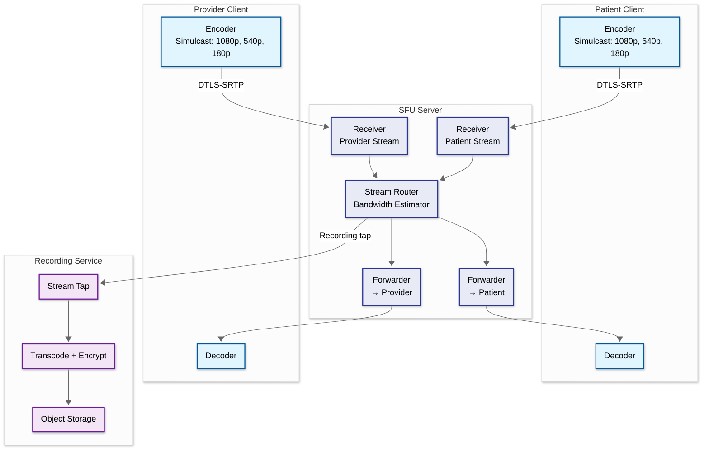

# Deep Dive & Bottlenecks — Telemedicine Platform

---

## 1. Video Infrastructure Deep Dive

### 1.1 SFU Architecture and Media Routing

The Selective Forwarding Unit (SFU) is the core of the video infrastructure. Unlike MCUs that decode, mix, and re-encode streams, SFUs simply receive encrypted media packets and selectively forward them to other participants — preserving end-to-end encryption and reducing server CPU by an order of magnitude.



**Simulcast Strategy for Clinical Quality:**

Each sender publishes three simulcast layers simultaneously:
- **Full resolution (f)**: 1080p at 30fps, 2.5 Mbps — used when bandwidth permits for clinical examination
- **Half resolution (h)**: 540p at 15fps, 500 Kbps — fallback for moderate bandwidth constraints
- **Quarter resolution (q)**: 180p at 7fps, 150 Kbps — extreme fallback, maintains visual contact

The SFU's bandwidth estimator continuously monitors receiver-side available bandwidth using REMB (Receiver Estimated Maximum Bitrate) and TWCC (Transport-Wide Congestion Control) feedback. When it detects congestion, it switches the forwarded layer to a lower resolution within one keyframe interval (~2 seconds) — seamlessly to the user.

**Clinical Video Optimization:**

Standard consumer video conferencing optimizes for "good enough" quality. Telemedicine requires clinical-grade fidelity:
- Dermatology examinations need consistent color reproduction and high resolution
- Psychiatry sessions need stable frame rate for reading facial micro-expressions
- Physical therapy needs wide-angle with smooth motion rendering

The platform implements visit-type-specific quality profiles that bias the bandwidth estimator toward resolution (for dermatology) or frame rate (for physical therapy) depending on the clinical context.

### 1.2 Cascading SFU for Multi-Region Deployment

A single SFU server handles ~500 concurrent sessions. For a platform with 100K concurrent sessions, a single SFU cluster is insufficient. The cascading SFU architecture connects SFU nodes across regions:

```
Patient (US West) ──→ SFU-West ←──cascade──→ SFU-East ←── Provider (US East)
                      (region A)              (region B)

Cascade link: Server-to-server DTLS-SRTP tunnel
Added latency: ~20-40ms per cascade hop
Max cascade depth: 2 hops (to keep total added latency < 80ms)
```

**Cascade routing rules:**
1. If patient and provider are in the same region → single SFU, no cascade
2. If in adjacent regions → one cascade hop through the nearest SFU pair
3. If on different continents → cascade through an intermediate SFU in a low-latency hub
4. Never cascade through more than 2 hops — instead, select a single mid-point SFU

### 1.3 Session Reconnection and Resilience

Network disruptions are common, especially for patients on mobile networks. The reconnection strategy:

1. **ICE restart**: On temporary network change (Wi-Fi → cellular), the client initiates an ICE restart to re-establish connectivity without recreating the session. The SFU buffers 2 seconds of media to smooth the transition.

2. **SFU failover**: If an SFU node fails, the signaling server detects the loss (via heartbeat timeout) and redirects both participants to a backup SFU node. Target: reconnection within 5 seconds.

3. **Graceful degradation**: If bandwidth drops below 300 Kbps, the system:
   - Switches to audio-only mode with a notification to both participants
   - Continues capturing video locally for potential upload after bandwidth recovers
   - Offers to switch to phone bridge as ultimate fallback

4. **Session state preservation**: All session metadata (start time, consent status, recording flag) is stored in the distributed cache with 2-hour TTL, so reconnection to a new SFU node preserves session context.

---

## 2. Scheduling Engine Deep Dive

### 2.1 Conflict Detection and Double-Booking Prevention

Scheduling is a concurrency-critical subsystem. Two patients booking the same slot simultaneously must be handled without double-booking:

**Optimistic Concurrency Control:**

```
PROCEDURE BookAppointment(patient_id, slot_id, appointment_details)

  1. BEGIN TRANSACTION (serializable isolation)

  2. SELECT slot_id, status, version FROM appointment_slots
     WHERE slot_id = slot_id
     FOR UPDATE  -- pessimistic row lock within optimistic application flow

  3. IF slot.status != "AVAILABLE":
     ROLLBACK
     RETURN Error("Slot no longer available")

  4. IF slot.version != expected_version:
     ROLLBACK
     RETURN Error("Concurrent modification detected")

  5. UPDATE appointment_slots
     SET status = "BOOKED", version = version + 1
     WHERE slot_id = slot_id

  6. INSERT INTO appointments (...)
     VALUES (patient_id, provider_id, slot_id, ...)

  7. COMMIT

  8. INVALIDATE cache key: availability:{provider_id}:{date}

  9. EMIT event: AppointmentBooked
```

**Why `SELECT FOR UPDATE` + version column:**
- `FOR UPDATE` acquires a row-level lock preventing concurrent transactions from reading stale state
- The version column provides an additional application-level safeguard against lost updates
- Serializable isolation prevents phantom reads where a new slot appears between check and insert

### 2.2 Availability Calculation and Caching

Provider availability calculation is the highest-traffic query in the scheduling system (~500 queries/second at peak):

```
PROCEDURE CalculateAvailability(provider_id, date_range, visit_type)

  1. CHECK cache first:
     cache_key = availability:{provider_id}:{date_range}:{visit_type}
     cached = cache.get(cache_key)
     IF cached AND cached.ttl > 0:
       RETURN cached.slots

  2. LOAD provider schedule:
     templates = SELECT * FROM provider_schedules
       WHERE provider_id = provider_id
       AND effective_from <= date_range.end
       AND (effective_until IS NULL OR effective_until >= date_range.start)

  3. GENERATE base slots from templates:
     FOR EACH day IN date_range:
       applicable_template = find_template(templates, day)
       IF applicable_template.is_override:
         use override (vacation, sick day, conference)
       ELSE:
         generate_slots(applicable_template, day, visit_type)

  4. SUBTRACT booked appointments:
     booked = SELECT scheduled_start, scheduled_end FROM appointments
       WHERE provider_id = provider_id
       AND status IN ("CONFIRMED", "CHECKED_IN", "IN_PROGRESS")
       AND scheduled_start BETWEEN date_range.start AND date_range.end

     FOR EACH slot IN generated_slots:
       IF any booked appointment overlaps slot:
         mark_slot_as_unavailable(slot)

  5. APPLY visit-type duration filtering:
     required_duration = VISIT_TYPE_DURATION[visit_type]
     filtered_slots = filter(slots, consecutive_available_minutes >= required_duration)

  6. CACHE result:
     cache.set(cache_key, filtered_slots, ttl = 30 seconds)
     // Short TTL because availability changes frequently during peak booking

  7. RETURN filtered_slots
```

**Cache invalidation strategy:**
- On appointment booked/cancelled: invalidate `availability:{provider_id}:*` (prefix invalidation)
- On schedule template change: invalidate all dates affected
- TTL-based expiry: 30 seconds maximum staleness (acceptable because the booking transaction still validates atomically)

### 2.3 Overbooking and No-Show Compensation

With a 15-25% no-show rate, providers lose significant capacity. The platform implements intelligent overbooking:

**Overbooking Decision Logic:**
```
FOR EACH time slot with a confirmed appointment:
  no_show_prob = PredictNoShow(appointment)

  IF no_show_prob > 0.35 AND slot.overbook_count < 1:
    Allow one additional appointment at this time
    Mark as "OVERBOOKED" in scheduling view
    Adjust provider's schedule display to show overlap

  IF no_show_prob > 0.50 AND slot.overbook_count < 2:
    Allow second overbook (aggressive, used during high-demand periods only)

  Provider dashboard shows:
    - Primary appointment with no-show probability indicator
    - Overbooked appointment with "(backup)" label
    - Visual indicator of potential schedule crunch if both show up

  WHEN both patients check in for same slot:
    1. See first-arrived patient first
    2. Move second patient to next available slot (typically 15 min)
    3. Auto-notify second patient of brief additional wait
```

---

## 3. PHI Data Pipeline Deep Dive

### 3.1 PHI Segmentation Architecture

The platform segments Protected Health Information (PHI) across multiple boundaries to limit breach blast radius:

```
┌──────────────────────────────────────────────────────┐
│  Layer 1: Identity Data (most sensitive)             │
│  ┌────────────────────────────────────────────┐      │
│  │ Patient name, SSN, DOB, address, phone     │      │
│  │ → Encrypted with Tenant Key A              │      │
│  │ → Separate database schema: identity_store  │      │
│  └────────────────────────────────────────────┘      │
│                                                       │
│  Layer 2: Clinical Data (sensitive)                   │
│  ┌────────────────────────────────────────────┐      │
│  │ Diagnoses, prescriptions, notes, vitals    │      │
│  │ → Encrypted with Tenant Key B              │      │
│  │ → Linked via pseudonymized patient_token   │      │
│  │ → Separate database schema: clinical_store  │      │
│  └────────────────────────────────────────────┘      │
│                                                       │
│  Layer 3: Operational Data (low sensitivity)          │
│  ┌────────────────────────────────────────────┐      │
│  │ Appointment times, session metadata, billing│      │
│  │ → Standard encryption at rest              │      │
│  │ → Linked via appointment_id (not patient)  │      │
│  │ → Separate database schema: operations_store│      │
│  └────────────────────────────────────────────┘      │
└──────────────────────────────────────────────────────┘

Joining layers requires:
  1. Authenticated request with valid session token
  2. Role-based access check (provider role can join L1+L2, billing role gets L1+L3)
  3. Minimum necessary check (service declares which PHI fields it needs)
  4. Audit log entry generated before data is returned
```

### 3.2 De-identification Pipeline

For analytics, research, and ML training, PHI must be de-identified per HIPAA Safe Harbor or Expert Determination methods:

```
PROCEDURE DeidentifyRecord(patient_record, method)

  IF method = "SAFE_HARBOR":
    // Remove all 18 HIPAA identifiers
    remove: name, address (below state level), dates (below year),
            phone, fax, email, SSN, MRN, insurance ID,
            account numbers, certificate numbers, VIN, device IDs,
            URLs, IP addresses, biometric identifiers, photos,
            any unique identifying number

    // Date shifting (consistent per patient)
    date_shift = hash(patient_record.patient_token + salt) MOD 365
    shift all dates by date_shift days

    // Age generalization
    IF patient_record.age > 89:
      set age = "90+"

  ELSE IF method = "EXPERT_DETERMINATION":
    // Statistical de-identification with k-anonymity (k≥5)
    generalize: age → age_bracket (5-year), zip → first_3_digits
    suppress: rare conditions (prevalence < 0.1% in dataset)
    add_noise: continuous values ± random within 5% of range

  RETURN de_identified_record
```

### 3.3 Audit Trail Implementation

Every PHI access generates an immutable audit record:

```json
{
  "audit_id": "aud_001",
  "timestamp": "2026-03-09T10:30:00.000Z",
  "actor": {
    "user_id": "prov_e5f6g7h8",
    "role": "PROVIDER",
    "session_id": "sess_abc123",
    "ip_address": "10.0.1.50",
    "device_fingerprint": "d3v1c3"
  },
  "action": "READ",
  "resource": {
    "type": "PATIENT_RECORD",
    "patient_id": "pat_a1b2c3d4",
    "fields_accessed": ["name", "dob", "medications", "diagnoses"],
    "phi_classification": "FULL_IDENTITY_PLUS_CLINICAL"
  },
  "context": {
    "encounter_id": "enc_u1v2w3x4",
    "access_reason": "ACTIVE_CONSULTATION",
    "consent_id": "con_xyz789"
  },
  "result": "ALLOWED",
  "hash_chain": "sha256(previous_audit_hash + this_record)"
}
```

**Hash chain integrity**: Each audit record includes a SHA-256 hash of the previous record concatenated with the current record, creating a tamper-evident chain. Any modification to a historical record breaks the chain, detectable during compliance audits.

---

## 4. Bottleneck Analysis

| # | Bottleneck | Severity | Impact | Mitigation |
|---|---|---|---|---|
| 1 | **SFU server CPU saturation** | High | Video quality degrades for all sessions on the node | Auto-scale SFU pool at 70% CPU; implement session draining for graceful scale-down |
| 2 | **Scheduling DB hot spot during peak booking** | High | Increased booking failures and latency | Partition slots by provider_id; use cache-aside pattern for availability reads |
| 3 | **TURN server bandwidth costs** | Medium | 10% of sessions require TURN; each adds 3 Mbps relay cost | Implement TURN-over-TCP on port 443 to bypass firewalls; invest in better NAT traversal |
| 4 | **Audit log write amplification** | Medium | Every PHI access generates an audit event; high-volume providers trigger cascading writes | Batch audit writes with 1-second micro-batching; use append-only log-structured storage |
| 5 | **RPM ingestion spikes** | Medium | Wearable devices sync in bursts (morning check-in); 10x spike over baseline | Pre-provision ingestion capacity for known spike patterns; use event stream as write buffer |
| 6 | **EHR integration latency variance** | Medium | External EHR FHIR endpoints have 100ms-5s response times | Circuit breaker with fallback to cached last-known data; async sync with retry |
| 7 | **Prescription network (Surescripts) throttling** | Low | External network imposes rate limits and has variable latency (2-15s) | Queue prescriptions with priority ordering; implement store-and-forward with status polling |
| 8 | **Search index PHI re-encryption lag** | Low | Key rotation requires re-encryption of search index fields; during rotation, search may return stale results | Dual-read during rotation (old key + new key); schedule rotations during low-traffic windows |

---

## 5. Failure Modes and Recovery

### 5.1 Critical Failure Scenarios

| Scenario | Detection | Impact | Recovery |
|---|---|---|---|
| **SFU cluster outage** | Heartbeat failure + signaling disconnect | Active video sessions in that region drop | Auto-failover to DR region SFU; clients reconnect via ICE restart within 5s |
| **Scheduling DB leader failure** | Replication lag spike + connection errors | New bookings fail; availability queries stale | Promote read replica to leader (< 30s); replay write-ahead log for consistency |
| **Event stream partition loss** | Consumer lag alert + missing events | Audit trail gaps; notifications delayed | Replay from last committed offset; audit reconciliation job fills gaps |
| **Cache cluster failure** | Connection timeout + miss rate spike | Availability queries hit DB directly; 10x DB load | Fallback to DB reads with circuit breaker; cache warms on recovery in ~5 min |
| **Recording service failure** | Storage write errors + pipeline stall | Session recordings lost for active consultations | Record locally on SFU node as fallback; upload when recording service recovers |
| **Authentication service failure** | Token validation failures across platform | All authenticated operations fail | JWT validation via cached public keys (stateless fallback); auth service restart < 60s |

### 5.2 Data Corruption Recovery

```
PROCEDURE RecoverFromDataCorruption(affected_scope)

  1. DETECT corruption:
     - Hash chain verification failure in audit logs
     - Referential integrity check failure in scheduled jobs
     - Patient record checksum mismatch

  2. ISOLATE affected data:
     - Mark affected patient records as "UNDER_REVIEW"
     - Block writes to corrupted partitions
     - Redirect reads to last known-good replica

  3. DETERMINE corruption boundary:
     - Identify first corrupted record via binary search on hash chain
     - Trace corruption source through event log correlation
     - Assess blast radius: how many patient records affected

  4. RESTORE from immutable sources:
     - Event log is the source of truth (append-only, replicated)
     - Rebuild materialized state by replaying events from last known-good checkpoint
     - Validate restored data against audit trail

  5. NOTIFY compliance:
     - If PHI integrity compromised: initiate HIPAA breach assessment
     - Document timeline, affected records, and remediation
     - If > 500 patients affected: prepare OCR notification within 60 days

  6. POST-MORTEM:
     - Root cause analysis
     - Add integrity check at the point of failure
     - Strengthen hash chain verification frequency
```

---

## 6. Performance Optimization Strategies

### 6.1 Video Quality Optimization

| Strategy | Implementation | Benefit |
|---|---|---|
| **Simulcast with SVC** | Encode 3 quality layers; SFU forwards appropriate layer based on receiver bandwidth | 40% bandwidth reduction vs. single-quality stream |
| **Adaptive jitter buffer** | Dynamic buffer size (20-200ms) based on network stability | Reduces audio glitches by 60% on mobile networks |
| **Keyframe request throttling** | Limit PLI (Picture Loss Indication) requests to 1 per 3 seconds | Prevents keyframe storms that spike bandwidth |
| **Temporal layer switching** | Drop B-frames before I/P frames during congestion | Maintains resolution at reduced frame rate |

### 6.2 Scheduling Performance Optimization

| Strategy | Implementation | Benefit |
|---|---|---|
| **Availability pre-computation** | Background job computes next 7 days of availability every 5 minutes | Reduces real-time computation for 80% of queries |
| **Covering index** | Composite index on (provider_id, scheduled_start, status) | Eliminates table scan for availability queries |
| **Batch slot generation** | Generate 30 days of slots weekly rather than on-demand | Reduces write contention during peak booking |
| **Connection pooling** | Separate read and write connection pools for scheduling DB | Read queries don't block on write transaction locks |

### 6.3 RPM Ingestion Optimization

| Strategy | Implementation | Benefit |
|---|---|---|
| **Batch ingestion** | Devices buffer readings and send in batches of 10-50 | 90% reduction in connection overhead |
| **Write-ahead buffer** | Event stream buffers ingestion spikes before writing to time-series DB | Smooths 10x spikes to 2x sustained writes |
| **Downsampling** | Store raw data for 7 days, downsample to 1-min averages for 30 days, 5-min for 1 year | 95% storage reduction for historical data |
| **Edge anomaly pre-filter** | Basic threshold check on device before sending | Reduces server-side processing by 70% for normal readings |

---

*Previous: [Low-Level Design ←](./03-low-level-design.md) | Next: [Scalability & Reliability →](./05-scalability-and-reliability.md)*
