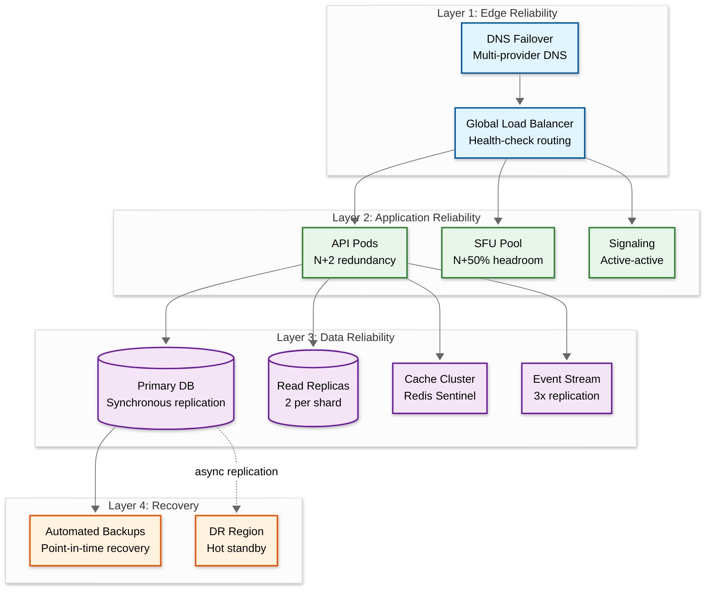

# Scalability & Reliability — Telemedicine Platform

---

## 1. Scaling Strategy

### 1.1 Scaling Dimensions

| Dimension | Current Scale | Target Scale | Scaling Approach |
|---|---|---|---|
| **Video sessions** | 25K concurrent | 500K concurrent | Horizontal SFU pool with geo-distributed clusters |
| **API throughput** | 10K QPS | 100K QPS | Stateless service pods with auto-scaling |
| **Scheduling DB** | 1M appointments/day | 10M appointments/day | Partition by provider_id with read replicas |
| **RPM ingestion** | 500M readings/day | 5B readings/day | Time-series DB with tiered storage + stream buffering |
| **Patient records** | 50M patients | 500M patients | Horizontal sharding by patient_id hash |
| **Audit log volume** | 1B events/day | 10B events/day | Append-only log-structured store with compaction |
| **Object storage** | 17 TB/day writes | 170 TB/day writes | Distributed object storage with lifecycle policies |

### 1.2 Video Infrastructure Scaling

The video layer has the most challenging scaling profile — each session consumes dedicated bandwidth and SFU CPU:

```
SFU Scaling Model:

  Per-server capacity:
    CPU-bound: ~500 sessions (forwarding encrypted packets)
    Bandwidth-bound: ~2.5 Gbps per server (500 × 5 Mbps bidirectional)

  Cluster sizing formula:
    required_servers = CEIL(peak_concurrent_sessions / 500) × 1.5 (headroom)

  Example at 100K concurrent:
    = CEIL(100,000 / 500) × 1.5
    = 200 × 1.5
    = 300 SFU servers across all regions

  Regional distribution (based on user geography):
    US East:    35% → 105 servers
    US West:    25% → 75 servers
    Europe:     20% → 60 servers
    Asia-Pac:   15% → 45 servers
    Other:       5% → 15 servers
```

**SFU Auto-Scaling Strategy:**

```
PROCEDURE AutoScaleSFU(cluster)

  // Metrics-driven scaling
  current_load = cluster.total_sessions / cluster.total_capacity
  session_growth_rate = sessions_added_last_5_min / 5  // per minute

  // Predictive scaling: provision for projected load 10 minutes ahead
  projected_load = current_load + (session_growth_rate × 10 / cluster.total_capacity)

  IF projected_load > 0.70:
    scale_target = CEIL(cluster.total_sessions / 0.50)  // target 50% utilization
    new_servers = scale_target - cluster.server_count
    launch_sfu_servers(cluster.region, new_servers)
    // New servers warm up in ~60 seconds (pre-baked container images)

  IF current_load < 0.30 AND cluster.server_count > cluster.min_servers:
    // Scale down — but drain sessions first
    excess_servers = cluster.server_count - CEIL(cluster.total_sessions / 0.50)
    FOR EACH server IN select_drain_candidates(excess_servers):
      server.accept_new_sessions = FALSE
      // Sessions naturally end (avg 15 min); server drains in ~20 min
      WHEN server.active_sessions = 0:
        terminate_server(server)
```

### 1.3 Database Scaling Strategy

**Patient Data — Horizontal Sharding:**

```
Sharding key: patient_id (UUID hash-based)
Number of shards: 64 (expandable to 256 via virtual sharding)

Shard assignment:
  shard_id = consistent_hash(patient_id) MOD 64

Why patient_id:
  - All patient-centric queries (encounters, prescriptions, RPM) are colocated
  - No cross-shard joins needed for single-patient operations
  - Even distribution due to UUID randomness

Cross-patient queries (analytics, population health):
  - Routed to read replicas with scatter-gather pattern
  - Materialized views updated via event stream for common aggregations
```

**Scheduling Data — Time-Range Partitioning:**

```
Partition strategy: Range partition by scheduled_start

  Current month:   "hot" partition — SSD storage, 3 read replicas
  Next 3 months:   "warm" partition — SSD storage, 2 read replicas
  Past 6 months:   "cool" partition — standard storage, 1 read replica
  Older:           "archive" partition — compressed, object storage

Why time-range:
  - 95% of scheduling queries are for future dates
  - Historical data accessed rarely (billing reconciliation, audits)
  - Natural partition pruning — query for "next week" only scans 1 partition
```

**RPM Time-Series Data — Tiered Storage:**

```
Tier 1: Raw data (1-second resolution)
  Retention: 7 days
  Storage: In-memory + SSD
  Access: Real-time dashboards, anomaly detection

Tier 2: Downsampled (1-minute averages)
  Retention: 90 days
  Storage: SSD
  Access: Trend analysis, provider review dashboards

Tier 3: Aggregated (hourly summaries)
  Retention: 2 years
  Storage: Standard disk
  Access: Longitudinal studies, chronic care management

Tier 4: Statistical summaries (daily min/max/mean/p50/p95)
  Retention: 7 years (HIPAA minimum)
  Storage: Compressed object storage
  Access: Compliance audits, research
```

### 1.4 Caching Strategy

| Cache Layer | Data | TTL | Invalidation |
|---|---|---|---|
| **CDN cache** | Static assets, patient education content | 24 hours | Deploy-triggered purge |
| **API response cache** | Provider profiles, specialty lists | 5 minutes | Write-through on profile update |
| **Availability cache** | Provider slot availability | 30 seconds | Event-driven invalidation on booking/cancel |
| **Session cache** | Active video session state, auth tokens | 2 hours | Explicit delete on session end |
| **RPM threshold cache** | Patient alert thresholds | 1 hour | Write-through on threshold change |
| **FHIR resource cache** | Recently accessed patient FHIR resources | 5 minutes | Versioned ETag-based invalidation |

---

## 2. Reliability Engineering

### 2.1 Availability Architecture



### 2.2 Replication Strategy

| Data Type | Replication Mode | Replicas | Consistency |
|---|---|---|---|
| Patient records (PHI) | Synchronous | 3 (primary + 2 replicas) | Strong — no acknowledged write lost |
| Scheduling data | Synchronous | 3 | Strong — prevents double-booking |
| Video session metadata | Asynchronous | 2 | Eventual — session quality metrics can lag |
| RPM time-series | Asynchronous | 2 | Eventual — brief gaps acceptable |
| Audit logs | Synchronous | 3 | Strong — tamper-evident chain requires completeness |
| Event stream | Synchronous (within cluster) | 3 | Strong — at-least-once delivery guarantee |
| Object storage (recordings) | Asynchronous cross-region | 2 regions | Eventual — DR copy within 15 minutes |

### 2.3 Circuit Breaker Configuration

| Integration | Failure Threshold | Timeout | Fallback |
|---|---|---|---|
| **External EHR** | 5 failures in 30s | 5s per request | Serve cached last-known data; queue sync for retry |
| **Pharmacy network** | 3 failures in 60s | 15s per request | Queue prescription; notify provider of delay |
| **Insurance payer** | 5 failures in 30s | 10s per request | Allow appointment with "eligibility pending" status |
| **Lab systems** | 3 failures in 60s | 10s per request | Queue lab order; provider can manually fax as fallback |
| **TURN servers** | 2 failures per session | 3s per attempt | Try alternate TURN server; if all fail, suggest direct connection or phone |

### 2.4 Graceful Degradation Modes

```
Mode 0: NORMAL
  All services operational
  Full feature set available

Mode 1: DEGRADED_AI
  Trigger: AI/ML services unhealthy
  Impact: Provider matching falls back to simple specialty + availability filter
          No-show prediction disabled (no overbooking)
          RPM anomaly detection uses threshold-only (no ML model)
  Patient experience: Minimal impact; scheduling slightly less optimized

Mode 2: DEGRADED_EXTERNAL
  Trigger: External integrations (EHR, pharmacy, insurance) unhealthy
  Impact: Prescriptions queued for later transmission
          Insurance eligibility shown as "pending"
          EHR sync delayed
  Patient experience: Can still consult; post-visit actions delayed

Mode 3: VIDEO_ONLY
  Trigger: Non-video services degraded
  Impact: Scheduling disabled (existing appointments only)
          Documentation in offline mode (sync later)
          Billing deferred
  Patient experience: Active consultations continue; new bookings unavailable

Mode 4: EMERGENCY
  Trigger: Major infrastructure failure
  Impact: Read-only for patient records
          No new appointments or encounters
          Video maintains active sessions only (no new sessions)
          Emergency contact information accessible
  Patient experience: Redirect to phone-based triage
```

---

## 3. Disaster Recovery

### 3.1 DR Architecture

```
Primary Region (Active)                    DR Region (Hot Standby)
┌─────────────────────────┐               ┌─────────────────────────┐
│                         │               │                         │
│  API + Services (active)│               │  API + Services (warm)  │
│  SFU Pool (serving)     │               │  SFU Pool (minimal)     │
│  DB Leader (writes)     │──sync RPL───▶ │  DB Follower (reads)    │
│  Cache (active)         │               │  Cache (cold)           │
│  Event Stream (active)  │──async RPL──▶ │  Event Stream (replay)  │
│  Object Storage (write) │──async RPL──▶ │  Object Storage (copy)  │
│                         │               │                         │
└─────────────────────────┘               └─────────────────────────┘

Failover trigger: Automated (health check failure for 60s) or manual
Failover time target: < 5 minutes for API, < 15 minutes for full video
```

### 3.2 Recovery Objectives

| Scenario | RPO | RTO | Strategy |
|---|---|---|---|
| **Single DB node failure** | 0 (sync replication) | < 30 seconds | Automatic failover to replica |
| **Single SFU node failure** | N/A (stateless) | < 5 seconds | ICE restart to another SFU |
| **Primary region failure** | < 30 seconds | < 5 minutes | DNS failover to DR region |
| **Event stream partition loss** | 0 (3x replication) | < 1 minute | Automatic leader election |
| **Cache cluster failure** | N/A (rebuilt from DB) | < 5 minutes | Cache warming from DB queries |
| **Object storage failure** | < 15 minutes (async) | < 30 minutes | Redirect to DR region copy |
| **Full platform compromise** | < 1 hour | < 4 hours | Restore from encrypted backups in isolated environment |

### 3.3 Failover Procedure

```
PROCEDURE RegionalFailover(failed_region, dr_region)

  1. DETECT failure:
     - Health check monitor reports primary region unhealthy for 60 seconds
     - Verify failure is regional (not monitoring false positive)
     - Automated: proceed if 3+ independent health checkers agree
     - Manual: on-call engineer confirms via separate network path

  2. STOP writes to primary:
     - Set primary DB to read-only (prevent split-brain)
     - Fence primary event stream producers

  3. PROMOTE DR region:
     a. Promote DB follower to leader
        - Verify replication caught up (check LSN)
        - If replication lag > 0: accept data loss within RPO tolerance
     b. Start event stream consumers in DR region
     c. Scale up API pods in DR region (warm → active)
     d. Scale up SFU pool (minimal → production capacity)
     e. Warm cache from promoted DB (background, 2-3 minutes)

  4. REDIRECT traffic:
     a. Update DNS to point to DR region load balancer (TTL = 60s)
     b. Update SFU geo-routing to prefer DR region
     c. Send push notification to active clients: "Brief service interruption, reconnecting..."

  5. VERIFY:
     - Run synthetic transaction tests against DR region
     - Verify video session establishment works
     - Check scheduling operations complete successfully
     - Validate audit log chain continuity

  6. COMMUNICATE:
     - Status page update: "Operating from secondary region"
     - Internal alert: failover timestamp, data loss assessment
     - If PHI impact suspected: trigger HIPAA incident response

  7. POST-FAILOVER:
     - Diagnose and repair primary region
     - Plan failback during maintenance window
     - Reconcile any data divergence between regions
```

### 3.4 Split-Brain Prevention

```
PROCEDURE PreventSplitBrain()

  Mechanism 1: Fencing tokens
    - Every write operation includes a monotonically increasing fencing token
    - Storage layer rejects writes with stale fencing tokens
    - On leader promotion, new leader gets a higher-epoch fencing token

  Mechanism 2: Distributed lock with TTL
    - Only one region holds the "primary" lock at any time
    - Lock TTL = 30 seconds; leader must renew every 10 seconds
    - If leader fails to renew, lock expires and DR can acquire it

  Mechanism 3: External arbiter
    - Third region (or managed service) acts as arbiter
    - Arbiter votes on which region should be primary
    - Requires arbiter + one region to agree (quorum of 2 out of 3)
    - Prevents both regions from believing they are primary

  Mechanism 4: Write-ahead log sequence verification
    - On failover, DR region checks its WAL sequence against primary's last known sequence
    - If gap detected: apply missing transactions from event stream replay
    - If event stream also has gap: flag for manual reconciliation (rare)
```

---

## 4. Capacity Planning

### 4.1 Growth Projections

| Metric | Year 1 | Year 2 | Year 3 | Year 5 |
|---|---|---|---|---|
| Registered patients | 50M | 85M | 140M | 300M |
| Daily consultations | 1M | 2.5M | 5M | 12M |
| Peak concurrent video | 25K | 65K | 130K | 300K |
| RPM connected devices | 10M | 25M | 60M | 150M |
| Storage (cumulative) | 6 PB | 20 PB | 50 PB | 150 PB |
| SFU servers (peak) | 75 | 200 | 400 | 900 |
| API servers (peak) | 50 | 130 | 260 | 600 |

### 4.2 Scaling Milestones

| Milestone | Trigger | Actions Required |
|---|---|---|
| **100K concurrent video** | SFU pool > 200 servers | Implement cascading SFU; add 3rd region |
| **100M patients** | Primary DB shard count limits | Expand to 128 shards; add cross-shard query coordinator |
| **1B RPM readings/day** | Time-series DB write throughput | Add sharded time-series cluster; increase batch size |
| **50M API calls/hour** | API gateway throughput | Add API gateway replicas; implement regional API routing |
| **50 PB storage** | Object storage cost optimization | Implement intelligent tiering; increase cold storage ratio |

### 4.3 Load Testing Strategy

| Test Type | Scenario | Target | Frequency |
|---|---|---|---|
| **Steady state** | Normal daily traffic pattern | Validate baseline performance | Weekly |
| **Peak simulation** | 3x average traffic (flu season) | Confirm auto-scaling triggers correctly | Monthly |
| **Surge test** | 10x spike in 5 minutes (news event) | Verify system doesn't collapse; graceful degradation | Quarterly |
| **Soak test** | Sustained peak for 24 hours | Detect memory leaks, connection pool exhaustion | Monthly |
| **Video stress** | 10K concurrent sessions per SFU cluster | Validate SFU capacity assumptions | Quarterly |
| **Failover drill** | Simulate primary region failure | Validate DR procedure within RTO targets | Quarterly |

---

## 5. Backpressure and Flow Control

### 5.1 Backpressure Mechanisms

```
Layer 1: API Gateway
  - Rate limiting per client: 100 req/s for patients, 500 req/s for providers
  - Adaptive rate limiting: reduce limits by 50% when backend latency > p99 SLO
  - Priority queuing: video signaling and active session requests get priority

Layer 2: Service Level
  - Bulkhead pattern: separate thread pools for video, scheduling, and RPM
  - Video signaling: dedicated connection pool, never shared with REST API
  - Scheduling writes: bounded queue (1000 requests); reject with 503 + Retry-After

Layer 3: Event Stream
  - Consumer lag monitoring: if lag > 10,000 events, alert and scale consumers
  - Partition-based parallelism: scale consumers to match partition count
  - Dead letter queue: after 3 retries, move to DLQ for manual investigation

Layer 4: Database
  - Connection pool limits: max 100 connections per service per shard
  - Query timeout: 5s for reads, 10s for writes (kill long-running queries)
  - Read replica routing: analytics queries routed to read replicas only
```

### 5.2 Traffic Shaping for Multi-Tenant

```
Tenant isolation:
  - Each tenant (hospital network, clinic) gets a resource quota:
    Video sessions: max N concurrent (based on contract)
    API calls: max M per second
    Storage: max S GB per month

  - Noisy neighbor prevention:
    IF tenant.current_usage > 0.90 × tenant.quota:
      throttle_tenant(tenant, reduction = 20%)
      alert_account_team(tenant, "approaching limit")

    IF tenant.current_usage > tenant.quota:
      reject_new_sessions(tenant)
      allow_active_sessions_to_complete()

  - Fair scheduling:
    Weighted fair queue across tenants
    Large tenants get proportionally more capacity but cannot starve small tenants
    Emergency/urgent appointments bypass tenant quotas
```

---

*Previous: [Deep Dive & Bottlenecks ←](./04-deep-dive-and-bottlenecks.md) | Next: [Security & Compliance →](./06-security-and-compliance.md)*
