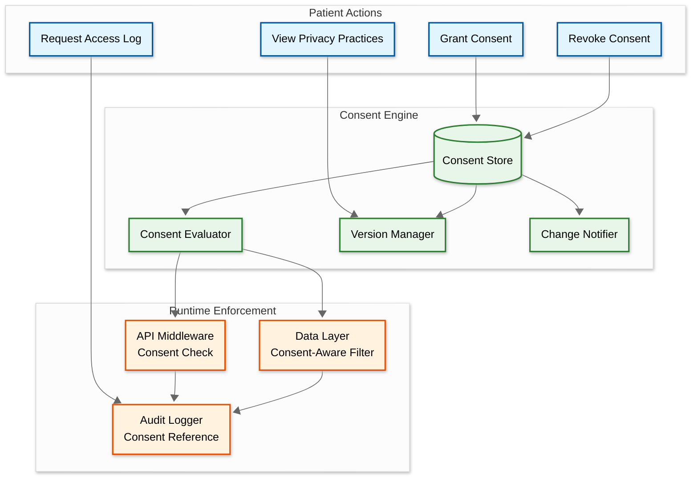

# Security & Compliance — Telemedicine Platform

---

## 1. Threat Model

### 1.1 Threat Actors

| Actor | Motivation | Capability | Primary Targets |
|---|---|---|---|
| **External attacker** | Financial gain (PHI sells for $250-$1000/record on dark web) | Automated scanning, phishing, credential stuffing | Patient database, authentication system |
| **Insider threat (employee)** | Curiosity, financial gain, grudge | Legitimate system access, knowledge of internal architecture | Patient records, audit log tampering |
| **Compromised provider account** | Stolen credentials via phishing | Full clinical access for the provider's patients | Prescription system (opioid diversion), patient data |
| **Nation-state actor** | Intelligence gathering, disruption | Advanced persistent threats, zero-day exploits | Infrastructure, bulk patient data exfiltration |
| **Malicious patient** | Identity fraud, prescription fraud | Application-level attacks, social engineering | Identity verification, e-prescribe system |
| **Third-party integration** | Supply chain compromise | API access within BAA scope | EHR data, pharmacy network, billing data |

### 1.2 STRIDE Analysis

| Threat | Attack Vector | Telemedicine-Specific Risk | Countermeasure |
|---|---|---|---|
| **Spoofing** | Fake provider account, session hijacking | Impersonating a licensed physician to prescribe controlled substances | NPI verification, credential checking, MFA enforcement, session binding |
| **Tampering** | Modifying clinical records, prescription alteration | Changing medication dosage or diagnosis after encounter signing | Immutable audit trail, signed encounter documents, hash chain verification |
| **Repudiation** | Denying a clinical action or prescription | Provider claims they didn't write a prescription; patient claims they didn't consent | Cryptographically signed actions, comprehensive audit logs, consent receipts |
| **Information Disclosure** | PHI breach via API, recording exfiltration | Patient health information leaked; video recordings exposed | PHI segmentation, encryption at rest/transit, field-level access control |
| **Denial of Service** | SFU flooding, API overwhelm | Disruption during critical consultations | Rate limiting, DDoS protection, SFU capacity headroom, priority queuing |
| **Elevation of Privilege** | Patient accessing provider features, cross-tenant data access | Patient viewing other patients' records; tenant data leakage | RBAC + ABAC enforcement, tenant isolation, zero-trust service mesh |

---

## 2. Security Architecture

### 2.1 Defense in Depth

```
Layer 1: Network Perimeter
├── DDoS mitigation (volumetric + application layer)
├── Web Application Firewall (WAF) with healthcare-specific rules
├── TLS 1.3 termination at edge (no TLS < 1.2 allowed)
└── IP reputation filtering + geo-blocking for admin endpoints

Layer 2: Transport Security
├── Mutual TLS between all internal services (service mesh)
├── DTLS-SRTP for all video/audio media streams
├── Certificate pinning for mobile applications
└── TURN server credentials: ephemeral (2-hour TTL), per-session

Layer 3: API Security
├── OAuth 2.0 + PKCE for patient/provider authentication
├── SMART on FHIR scopes for external EHR access
├── API key + IP allowlist for server-to-server integrations
├── Request signing for prescription and billing operations
└── Rate limiting: per-user, per-tenant, per-endpoint

Layer 4: Application Security
├── Input validation on all API parameters (strict schemas)
├── Output encoding to prevent XSS in clinical note rendering
├── Parameterized queries (no dynamic SQL construction)
├── Content Security Policy headers for web applications
└── Subresource Integrity (SRI) for third-party scripts

Layer 5: Data Security
├── AES-256 encryption at rest for all PHI
├── Customer-managed encryption keys per tenant
├── Field-level encryption for high-sensitivity fields (SSN, DOB)
├── Tokenization for insurance and payment card numbers
└── Automatic data masking in non-production environments

Layer 6: Infrastructure Security
├── Immutable container images with vulnerability scanning
├── Network policies restricting pod-to-pod communication
├── Secrets management via external vault (no secrets in code/config)
├── Automated security patching pipeline
└── Privileged access management for infrastructure operators
```

### 2.2 Authentication Framework

**Patient Authentication:**
```
Standard flow:
  1. Email/phone + password → initial authentication
  2. MFA: SMS OTP or authenticator app (TOTP)
  3. Biometric (optional): Face ID / fingerprint on mobile
  4. Session token: JWT with 1-hour expiry, refresh token with 7-day expiry
  5. Re-authentication: Required for PHI export, consent changes, and payment

Risk-based step-up:
  IF new_device OR new_location OR high_risk_action:
    Require MFA even if recent authentication exists
```

**Provider Authentication:**
```
Enhanced flow (EPCS-capable):
  1. Username/password + MFA (mandatory, not optional)
  2. Identity proofing: credential verification against NPI registry
  3. Hardware token or FIDO2 security key (required for EPCS)
  4. Session binding: IP + device fingerprint + user agent
  5. Session timeout: 15 minutes idle, 8 hours maximum

Controlled substance prescribing:
  Requires two-factor authentication at time of signing:
    Factor 1: Something you know (password/PIN)
    Factor 2: Something you have (hardware token) OR something you are (biometric)
  Per DEA EPCS requirements (21 CFR Part 1311)
```

**Inter-Service Authentication:**
```
Mutual TLS with service identity:
  - Each service has a unique X.509 certificate
  - Certificates issued by internal CA, rotated every 24 hours
  - Service mesh sidecar handles TLS handshake transparently
  - Authorization: service-to-service policy (Service A can call Service B on specific endpoints)
```

### 2.3 Authorization Model

```
RBAC Base Roles:
  PATIENT          — Access own records, book appointments, view RPM data
  PROVIDER         — Access assigned patient records, prescribe, document
  NURSE            — View patient records, document vitals, manage queue
  ADMIN            — Manage providers, view analytics, configure system
  BILLING_STAFF    — Access billing data, insurance info (no clinical notes)
  COMPLIANCE_OFFICER — Access audit logs, run compliance reports
  SYSTEM_ADMIN     — Infrastructure access (no patient data)

ABAC Attributes (layered on top of RBAC):
  patient_consent_scope    — Which providers/purposes this patient has consented to
  provider_specialty       — Restricts which conditions a provider can treat
  provider_licensed_states — Restricts consultations to licensed jurisdictions
  tenant_id                — Strict tenant boundary; no cross-tenant data access
  encounter_relationship   — Provider must have active/recent encounter to access PHI
  time_of_access           — Some data restricted to business hours only

Minimum Necessary Enforcement:
  Each API endpoint declares its PHI field requirements:
    /api/v1/encounters/{id}/summary  → requires: [patient_name, diagnosis_code, medication_names]
    /api/v1/billing/claims/{id}      → requires: [patient_name, dob, insurance_id, cpt_codes]
    /api/v1/rpm/alerts/{id}          → requires: [patient_token, vital_type, vital_value]

  The data layer returns ONLY the declared fields, not the full record.
  Audit log captures: who accessed what fields, through which endpoint, for what purpose.
```

---

## 3. HIPAA Compliance Framework

### 3.1 HIPAA Privacy Rule Controls

| Requirement | Implementation |
|---|---|
| **Minimum necessary** | Field-level access control; each service declares PHI fields needed |
| **Patient access rights** | Patient portal with full record download (FHIR-based) within 30 days |
| **Accounting of disclosures** | Disclosure log tracking every external share of PHI |
| **Notice of privacy practices** | Digital consent capture with versioned NPP documents |
| **Individual authorization** | Granular consent management: per provider, per purpose, with revocation |
| **De-identification** | Safe Harbor method for analytics; Expert Determination for research |
| **Business Associate Agreements** | Programmatic BAA enforcement: no data flows to integrations without signed BAA |

### 3.2 HIPAA Security Rule Controls

| Safeguard Category | Control | Implementation Detail |
|---|---|---|
| **Administrative** | Workforce training | Annual HIPAA training with phishing simulation; role-specific training for clinical staff |
| **Administrative** | Access management | Provisioning/de-provisioning tied to HR system; quarterly access reviews |
| **Administrative** | Incident response | Documented plan with 60-day breach notification timeline; tabletop exercises quarterly |
| **Administrative** | Risk assessment | Annual risk assessment; continuous vulnerability scanning |
| **Physical** | Facility access | Data center access via biometric + badge; visitor logs maintained |
| **Physical** | Workstation security | Screen lock after 5 min inactivity; encrypted drives; remote wipe capability |
| **Technical** | Access control | Unique user IDs, role-based access, automatic session timeout |
| **Technical** | Audit controls | Immutable audit trail with hash chain; 7-year retention |
| **Technical** | Integrity controls | Checksums on PHI records; database triggers prevent unauthorized modification |
| **Technical** | Transmission security | TLS 1.3 for REST, DTLS-SRTP for media, certificate pinning for mobile |

### 3.3 HITECH Act Compliance

| Requirement | Implementation |
|---|---|
| **Breach notification (individual)** | Automated notification pipeline: detect → assess → notify within 60 days |
| **Breach notification (HHS)** | < 500 individuals: annual report to HHS. ≥ 500: notify within 60 days + media notification |
| **Breach risk assessment** | 4-factor risk assessment: nature of PHI, unauthorized person, actual access, mitigation |
| **Penalty tiers** | Technical controls mapped to avoid "willful neglect" tier ($50K-$1.5M per violation) |
| **Encryption safe harbor** | PHI encrypted with AES-256 → breach of encrypted data is NOT a reportable breach |

### 3.4 Consent Management System



**Consent Granularity:**

```
consent_record = {
  patient_id: "pat_a1b2c3d4",
  consent_type: "TREATMENT",           // TREATMENT, PAYMENT, OPERATIONS, RESEARCH, MARKETING
  scope: "SPECIFIC_PROVIDER",           // ALL, SPECIFIC_PROVIDER, SPECIFIC_PURPOSE
  granted_to: "prov_e5f6g7h8",
  data_categories: ["DEMOGRAPHICS", "DIAGNOSES", "MEDICATIONS"],  // specific PHI categories
  purpose: "Ongoing dermatology care",
  is_granted: true,
  granted_at: "2026-03-09T10:00:00Z",
  expires_at: "2027-03-09T10:00:00Z",  // 1-year default, renewable
  revocable: true,
  version: 3                            // consent can be updated (narrowed or broadened)
}
```

---

## 4. Video-Specific Security

### 4.1 End-to-End Encryption for Video

```
WebRTC Security Stack:

  Layer 1: DTLS (Datagram Transport Layer Security)
    - Key exchange between client and SFU
    - Establishes SRTP master key
    - Certificate fingerprint verified via SDP offer/answer

  Layer 2: SRTP (Secure Real-time Transport Protocol)
    - Encrypts media packets (audio + video)
    - AES-128-CM cipher with HMAC-SHA1 authentication
    - Per-packet encryption — no buffering needed

  Layer 3: Insertable Streams (optional E2EE)
    - For maximum security: additional encryption layer on top of SRTP
    - Key exchange via SFrame (Secure Frames) protocol
    - SFU cannot decrypt media content (truly end-to-end)
    - Trade-off: recording service cannot record E2EE content
    - Used for: sensitive psychiatric sessions, VIP patients

  Signaling security:
    - WebSocket over TLS 1.3
    - SDP messages (session descriptions) encrypted in transit
    - Room tokens: short-lived JWTs (15-min expiry) with room-specific claims
```

### 4.2 Recording Security

```
Recording pipeline security:

  1. Consent verification:
     - Both patient AND provider must consent before recording starts
     - Consent captured via in-session UI prompt with timestamp
     - Recording button disabled until consent confirmed

  2. Recording capture:
     - SFU taps media streams (not E2EE sessions)
     - Raw media encrypted immediately at the recording node
     - Encryption key: per-session, derived from tenant master key

  3. Storage:
     - Encrypted recording uploaded to object storage
     - Storage-level encryption (AES-256) + application-level encryption
     - Dual encryption: even storage admin cannot access content

  4. Access control:
     - Access requires: provider role + active encounter + patient consent
     - Download generates audit log entry
     - Sharing: via secure, time-limited signed URL (expires in 1 hour)

  5. Retention:
     - Default: 7 years (HIPAA minimum for medical records)
     - Configurable per tenant and state regulation
     - Automated deletion with verification after retention period
     - Deletion audit log entry (proof of destruction)
```

---

## 5. Data Retention and Destruction

### 5.1 Retention Policy Matrix

| Data Type | Minimum Retention | Maximum Retention | Destruction Method |
|---|---|---|---|
| Medical records (encounters, notes) | 7 years from last encounter | 10 years (adults); age 21 + 7 years (minors) | Cryptographic erasure (delete encryption key) |
| Prescriptions | 7 years | 10 years | Cryptographic erasure |
| Video recordings | 7 years | 10 years | Secure file deletion + storage verification |
| Audit logs | 7 years | Indefinite (compliance choice) | Archive to immutable cold storage |
| RPM raw data | 7 days (raw) | 7 years (aggregated) | Automated tiered deletion |
| Patient consent records | Life of patient + 7 years | Indefinite | Archive only (never delete) |
| De-identified research data | N/A (no PHI) | Per research protocol | Standard deletion |
| Payment card data | Per PCI-DSS (varies) | 3 years for disputes | Tokenization; delete tokens |

### 5.2 Cryptographic Erasure

```
PROCEDURE CryptographicErasure(data_scope)

  // Instead of overwriting every byte (slow, expensive at PB scale),
  // destroy the encryption key — rendering data permanently unreadable

  1. IDENTIFY encryption keys covering data_scope
     keys = get_encryption_keys(data_scope)

  2. VERIFY data_scope has passed retention period
     FOR EACH record IN data_scope:
       IF record.retention_expiry > now:
         ABORT("Retention period not met for record " + record.id)

  3. BACKUP key metadata (for audit proof)
     log_key_destruction(keys, reason, authorized_by)

  4. DESTROY keys:
     FOR EACH key IN keys:
       key_vault.schedule_destruction(key, grace_period = 30 days)
       // 30-day grace period allows cancellation if destruction was erroneous

  5. AFTER grace period:
     key_vault.permanently_destroy(key)
     // Key material is overwritten with zeros in hardware security module

  6. GENERATE destruction certificate:
     certificate = {
       data_scope, key_ids, destruction_timestamp,
       authorized_by, verification_hash
     }
     store_in_audit_log(certificate)
```

---

## 6. Incident Response

### 6.1 Security Incident Classification

| Severity | Examples | Response Time | Notification |
|---|---|---|---|
| **P0 — Critical** | Active PHI breach, ransomware, compromised provider account prescribing | Immediate (< 15 min) | CISO + Legal + CEO + external counsel |
| **P1 — High** | Attempted PHI exfiltration (blocked), failed brute-force on provider accounts | < 1 hour | Security team + CISO |
| **P2 — Medium** | Unauthorized PHI access by authorized user (curiosity), vulnerability discovery | < 4 hours | Security team + compliance officer |
| **P3 — Low** | Policy violation (weak password), non-PHI security event | < 24 hours | Security team |

### 6.2 Breach Response Workflow

```
PROCEDURE BreachResponse(incident)

  Phase 1: Contain (0-4 hours)
    - Isolate affected systems
    - Revoke compromised credentials
    - Block malicious IP addresses/sessions
    - Preserve forensic evidence (memory dumps, logs)

  Phase 2: Assess (4-48 hours)
    - Determine scope: how many patient records affected
    - Identify PHI types exposed (names, diagnoses, SSNs, etc.)
    - Assess: was data encrypted? (HITECH encryption safe harbor)
    - Conduct 4-factor risk assessment per HITECH:
      a. Nature and extent of PHI involved
      b. Unauthorized person who accessed/used PHI
      c. Whether PHI was actually acquired or viewed
      d. Extent of mitigation applied

  Phase 3: Notify (within 60 days of discovery)
    IF risk assessment indicates significant risk of harm:
      - Individual notification: written notice to affected patients
      - HHS notification: via HHS breach portal
      - IF ≥ 500 individuals in a state: media notification
      - IF ≥ 500 individuals total: notify HHS within 60 days
      - IF < 500 individuals: log for annual HHS report

  Phase 4: Remediate (ongoing)
    - Patch vulnerability that enabled breach
    - Implement additional controls
    - Update risk assessment
    - Conduct post-incident review
    - Update incident response plan based on lessons learned
```

---

## 7. Compliance Automation

### 7.1 Continuous Compliance Monitoring

| Check | Frequency | Automated Action |
|---|---|---|
| Encryption key rotation | Every 90 days | Auto-rotate; alert if key age > 80 days |
| Access review | Quarterly | Generate access report; flag dormant accounts |
| PHI access anomaly | Real-time | Alert on unusual access patterns (e.g., provider accessing 100+ records/hour) |
| BAA expiration tracking | Weekly | Alert 60 days before BAA expiration |
| Audit log integrity | Hourly | Verify hash chain; alert on any break |
| Vulnerability scan | Daily | Automated scan; critical findings create incident tickets |
| Penetration test | Annually | Third-party engagement; findings tracked to remediation |
| HIPAA training completion | Annually | Auto-enroll; restrict system access for overdue staff |

### 7.2 Automated PHI Discovery

```
PROCEDURE ScanForUnprotectedPHI()

  // Regularly scan all data stores for unprotected PHI

  1. SCAN databases:
     FOR EACH column IN all_tables:
       IF column_name MATCHES phi_patterns (ssn, dob, name, phone, email, mrn):
         IF NOT encrypted(column):
           ALERT("Unencrypted PHI candidate: " + table + "." + column)

  2. SCAN log files:
     FOR EACH log_entry IN application_logs:
       IF regex_match(log_entry, PHI_PATTERNS):
         ALERT("PHI detected in application log: " + log_source)
         RECOMMEND: "Add field to logging blocklist"

  3. SCAN object storage:
     FOR EACH file IN unencrypted_buckets:
       IF file_type IN [csv, json, xlsx]:
         sample = read_first_1000_rows(file)
         IF contains_phi_patterns(sample):
           ALERT("Potential PHI in unencrypted storage: " + file_path)

  4. SCAN search indexes:
     Verify field-level encryption on all PHI-classified fields
     Alert on any PHI field stored in plaintext in search index
```

---

*Previous: [Scalability & Reliability ←](./05-scalability-and-reliability.md) | Next: [Observability →](./07-observability.md)*
