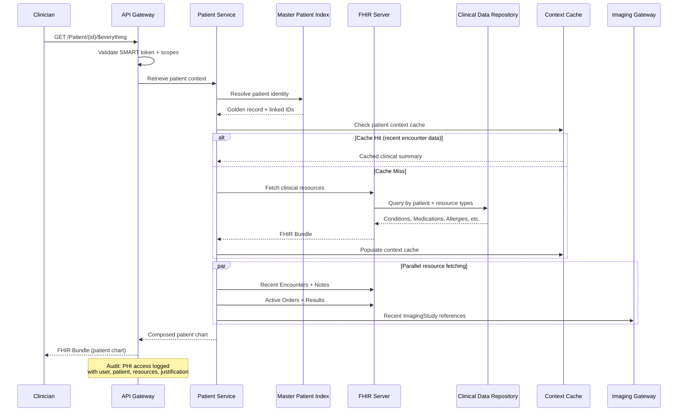
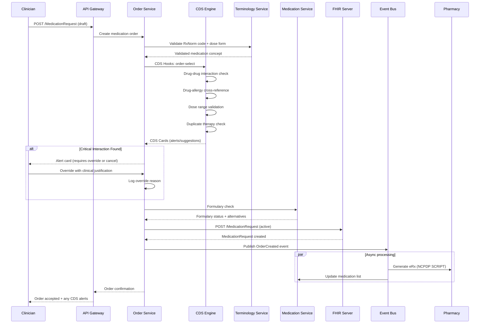

# High-Level Design — Cloud-Native EHR Platform

## 1. System Architecture

```mermaid
flowchart TB
    subgraph Clients["Client Layer"]
        CW[Clinician<br/>Workstation]
        MP[Mobile Provider<br/>App]
        PP[Patient Portal]
        TA[Third-Party<br/>SMART Apps]
    end

    subgraph Gateway["API Gateway Layer"]
        FGW[FHIR API Gateway<br/>SMART Auth · Rate Limiting]
        HIE[HIE Gateway<br/>TEFCA · Direct · C-CDA]
    end

    subgraph Clinical["Clinical Services"]
        direction TB
        subgraph PatientDomain["Patient Domain"]
            PAT[Patient Service]
            MPI[Master Patient<br/>Index]
            CON[Consent<br/>Service]
        end
        subgraph EncounterDomain["Encounter Domain"]
            ENC[Encounter<br/>Service]
            DOC[Clinical Document<br/>Service]
            NTE[Note / Template<br/>Service]
        end
        subgraph OrderDomain["Order Domain"]
            ORD[Order Entry<br/>Service]
            RES[Results<br/>Service]
            RX[Medication<br/>Service]
        end
        subgraph CareDomain["Care Coordination"]
            CPN[Care Plan<br/>Service]
            REF[Referral<br/>Service]
            SCH[Scheduling<br/>Service]
        end
    end

    subgraph Intelligence["Clinical Intelligence Layer"]
        CDS[Clinical Decision<br/>Support Engine]
        NLP[Clinical NLP<br/>Engine]
        PRD[Predictive<br/>Models]
        AMB[Ambient<br/>Documentation]
    end

    subgraph Platform["Platform Services"]
        FHIR[FHIR Server<br/>R4/R5 Conformant]
        TERM[Terminology<br/>Service]
        IMG[Imaging<br/>Gateway]
        PHR[Public Health<br/>Reporting]
    end

    subgraph Data["Data Layer"]
        CDR[(Clinical Data<br/>Repository)]
        BLOB[(Document &<br/>Image Store)]
        CACHE[(Distributed Cache<br/>Patient Context)]
        DWH[(Analytics<br/>Data Warehouse)]
    end

    subgraph Infra["Infrastructure"]
        EVT[Event Streaming<br/>Platform]
        AUD[PHI Audit<br/>Log Service]
        IDM[Identity &<br/>Access Mgmt]
    end

    CW & MP & PP & TA --> FGW
    FGW --> PAT & ENC & ORD & CPN
    FGW --> FHIR
    HIE --> FHIR & MPI

    PAT --> MPI & CON
    ENC --> DOC & NTE
    ORD --> RES & RX & CDS
    CPN --> REF & SCH

    FHIR --> CDR & CACHE
    DOC --> BLOB
    IMG --> BLOB
    RX --> TERM
    ORD --> TERM

    ORD --> EVT
    ENC --> EVT
    EVT --> CDS & NLP & PRD & PHR & AUD & DWH

    FGW --> IDM
    HIE --> IDM

    classDef client fill:#e1f5fe,stroke:#01579b,stroke-width:2px
    classDef api fill:#fff3e0,stroke:#e65100,stroke-width:2px
    classDef service fill:#e8f5e9,stroke:#2e7d32,stroke-width:2px
    classDef ai fill:#fce4ec,stroke:#b71c1c,stroke-width:2px
    classDef platform fill:#f3e5f5,stroke:#6a1b9a,stroke-width:2px
    classDef data fill:#f3e5f5,stroke:#6a1b9a,stroke-width:2px
    classDef cache fill:#fffde7,stroke:#f57f17,stroke-width:2px
    classDef queue fill:#e0f7fa,stroke:#00695c,stroke-width:2px

    class CW,MP,PP,TA client
    class FGW,HIE api
    class PAT,MPI,CON,ENC,DOC,NTE,ORD,RES,RX,CPN,REF,SCH service
    class CDS,NLP,PRD,AMB ai
    class FHIR,TERM,IMG,PHR platform
    class CDR,DWH data
    class BLOB,CACHE cache
    class EVT,AUD,IDM queue
```



---

## 2. Architectural Layers

### 2.1 Channel and API Gateway Layer

The gateway layer serves as the single entry point for all clinical traffic — clinician workstations, mobile devices, patient portals, third-party SMART apps, and health information exchange partners.

**FHIR API Gateway** handles:
- SMART on FHIR OAuth 2.0 token validation (launch context, scopes)
- FHIR-aware request routing (resource type, operation, search parameters)
- Rate limiting per client application, per user, per facility
- Request/response FHIR validation (structure definitions, profiles)
- API versioning (FHIR R4 and R5 concurrent support)

**HIE Gateway** adds:
- TEFCA Qualified Health Information Network (QHIN) connectivity
- C-CDA document generation and consumption
- Patient discovery (IHE PDQm / XCPD)
- Document query and retrieve (IHE MHD / XCA)
- ADT notification dispatch (HL7v2 ADT for legacy, FHIR Subscription for modern)

### 2.2 Clinical Services Layer

Services are organized by **clinical bounded contexts** following domain-driven design:

| Domain | Services | Responsibility |
|---|---|---|
| **Patient** | Patient, MPI, Consent | Patient identity, demographics, matching, consent directives |
| **Encounter** | Encounter, Document, Note/Template | Visit management, clinical documentation, note templates |
| **Order** | Order Entry, Results, Medication | CPOE, result management, medication lifecycle |
| **Care Coordination** | Care Plan, Referral, Scheduling | Longitudinal care plans, referrals, appointment management |
| **Imaging** | Imaging Gateway | DICOM storage, DICOMweb retrieval, FHIR ImagingStudy linking |

Each service:
- Exposes FHIR-compliant APIs for its resource types
- Publishes clinical events to the event backbone
- Maintains its own data within the shared clinical data repository (logical isolation)
- Scales independently based on clinical workflow demand

### 2.3 Clinical Intelligence Layer

Intelligence services operate in two modes:

**Synchronous (inline with clinical workflow):** Drug interaction checks and CDS Hooks services execute within the order entry workflow. When a clinician selects a medication, the CDS engine evaluates interactions and returns alert cards within 500ms.

**Asynchronous (event-driven):** Clinical NLP processes free-text notes to extract structured data (diagnoses, medications, allergies). Predictive models score sepsis risk, readmission probability, and deterioration risk from streaming vital sign and lab data.

### 2.4 Data Layer (FHIR-Native + CQRS)

```
┌─────────────────────────────────────────────────┐
│                  Write Path                      │
│                                                  │
│  Clinical Event → FHIR Validate → Store Resource │
│                         │                        │
│              ┌──────────┴────────────┐           │
│              │  Clinical Data        │           │
│              │  Repository           │           │
│              │  (FHIR-Native Store)  │           │
│              └──────────┬────────────┘           │
│                         │                        │
│           ┌─────────────┼─────────────┐          │
│           ▼             ▼             ▼          │
│     Patient Context  Analytics    PHI Audit      │
│     Cache            Projection   Trail          │
│           │             │             │          │
│           ▼             ▼             ▼          │
│       Cache Store   Data Warehouse  Audit DB     │
│                                                  │
│                  Read Path                        │
│  Chart Load → Cache → CDR → Composed Response    │
└─────────────────────────────────────────────────┘
```

**Write path:** All clinical data flows through the FHIR Server, which validates resources against profiles, enforces referential integrity, and persists to the Clinical Data Repository. Write events are published to the event backbone for downstream processing.

**Read path:** Patient chart retrieval assembles data from multiple sources — cached patient context for the most recent encounter data, the CDR for historical records, and the document/image store for clinical documents and DICOM images. FHIR search operations execute against indexed data in the CDR.

---

## 3. Core Data Flows

### 3.1 Patient Chart Retrieval Flow



### 3.2 Medication Order with CDS Flow



### 3.3 Health Information Exchange Flow

```
1. Receiving facility initiates patient query via TEFCA
2. HIE Gateway receives IHE XCPD patient discovery request
3. MPI performs patient matching against local index
4. If match found with sufficient confidence (> 0.85):
   a. Consent Service verifies patient has not opted out
   b. FHIR Server gathers requested clinical data
   c. Document Service generates C-CDA or FHIR Bundle
   d. Apply minimum necessary filtering (remove non-requested data)
   e. Encrypt and transmit via TEFCA transport
5. If no match or low confidence:
   a. Return "no records found" (do not disclose existence)
6. Audit: Log all HIE exchange events with source, destination,
   patient, data categories exchanged, and legal basis
```

---

## 4. Key Architectural Decisions

### 4.1 FHIR-Native Storage vs. FHIR Facade

| Decision | FHIR-native data storage — clinical data stored as FHIR resources, not translated at boundaries |
|---|---|
| **Context** | EHR systems historically use proprietary schemas and translate to FHIR at API boundaries |
| **Decision** | Store clinical data in FHIR resource format in the CDR; FHIR search parameters map to database indexes |
| **Rationale** | Eliminates translation layer bugs, enables native FHIR search, ensures interoperability by default |
| **Trade-off** | FHIR resources may not be optimal for all query patterns; schema rigidity for custom clinical workflows |
| **Mitigation** | Use FHIR extensions for custom data; build specialized indexes for complex clinical queries; use profiles to constrain resources |

### 4.2 Patient-Based Partitioning

| Decision | Partition clinical data by patient ID for horizontal scaling |
|---|---|
| **Context** | Need to distribute 50M+ patient records while maintaining per-patient data locality |
| **Decision** | Consistent hashing on patient ID determines data placement; all resources for a patient co-located |
| **Rationale** | Patient chart retrieval (most common operation) requires no cross-partition joins |
| **Trade-off** | Cross-patient queries (population health, facility-level reports) require scatter-gather |
| **Mitigation** | Analytics projection in data warehouse handles cross-patient queries; Bulk FHIR for population-level extraction |

### 4.3 CDS Hooks for Clinical Decision Support

| Decision | Use CDS Hooks specification for all clinical decision support integration |
|---|---|
| **Context** | CDS must be extensible, updateable, and support both internal and third-party knowledge sources |
| **Decision** | All CDS operates through CDS Hooks API; EHR invokes hooks at defined workflow points |
| **Rationale** | Standards-based, enables third-party CDS services, decouples clinical knowledge from EHR code |
| **Trade-off** | HTTP round-trip latency for each CDS invocation; must manage multiple CDS service registrations |
| **Mitigation** | Local CDS cache for common scenarios; async pre-fetch for patient-view hooks; timeout with graceful degradation |

### 4.4 Event-Driven Clinical Workflow

| Decision | Publish all clinical state changes as events for downstream processing |
|---|---|
| **Context** | Multiple systems need to react to clinical events (CDS, public health reporting, analytics, audit) |
| **Decision** | Every FHIR resource create/update publishes an event; consumers subscribe to relevant event types |
| **Rationale** | Decouples clinical services from downstream processing; enables real-time analytics and surveillance |
| **Trade-off** | Eventual consistency for event consumers; event ordering guarantees needed per patient |
| **Mitigation** | Per-patient event ordering via patient-keyed partitions; idempotent event consumers; sequence numbers |

### 4.5 Consent-Aware Data Access

| Decision | Evaluate consent directives at the data access layer, not the application layer |
|---|---|
| **Context** | Patients may restrict sharing of specific data categories (mental health, substance abuse, HIV) |
| **Decision** | The FHIR Server applies consent-based filtering to all query results before returning to the caller |
| **Rationale** | Ensures consistent consent enforcement regardless of which application queries the data |
| **Trade-off** | Added latency for consent evaluation on every query; complexity in consent policy management |
| **Mitigation** | Cache active consent directives per patient; fast-path for unrestricted patients (majority); consent override for emergencies |

---

## 5. Inter-Service Communication

### 5.1 Communication Patterns

| Pattern | Usage | Example |
|---|---|---|
| **Synchronous (FHIR REST)** | Clinical data reads, order entry, patient search | GET /Patient, POST /MedicationRequest |
| **Synchronous (CDS Hooks)** | Real-time clinical decision support | order-select, patient-view hooks |
| **Asynchronous (events)** | Cross-service state propagation | OrderCreated → pharmacy, OrderCreated → CDS for monitoring |
| **Asynchronous (FHIR Subscription)** | External system notifications | ADT notifications, result delivery |
| **Bulk async** | Population health, research, reporting | Bulk FHIR $export operations |

### 5.2 Clinical Event Types

```
PatientEvent
  ├── PatientRegistered { demographics, facility, MRN }
  ├── PatientMerged { surviving_id, deprecated_id, merge_reason }
  └── PatientUpdated { changed_fields, previous_values }

EncounterEvent
  ├── EncounterStarted { patient_id, type, facility, provider }
  ├── EncounterUpdated { status_change, location_transfer }
  └── EncounterDischarged { discharge_disposition, follow_up }

OrderEvent
  ├── OrderCreated { order_type, patient_id, provider, items }
  ├── OrderModified { changes, clinical_justification }
  ├── OrderCanceled { reason, canceling_provider }
  └── ResultReceived { order_id, results, abnormal_flags }

MedicationEvent
  ├── MedicationPrescribed { medication, dose, route, frequency }
  ├── MedicationDispensed { pharmacy, quantity, days_supply }
  └── MedicationAdministered { dose_given, route, site, time }

ClinicalAlert
  ├── CriticalResult { lab_id, value, critical_range }
  ├── SepsisAlert { patient_id, risk_score, contributing_factors }
  └── CDSOverride { alert_type, override_reason, provider }
```

---

## 6. Deployment Topology

### 6.1 Multi-Region Active-Passive

```
Primary Region (Active)              DR Region (Warm Standby)
┌──────────────────────┐            ┌──────────────────────┐
│ API Gateway Cluster  │            │ API Gateway Cluster   │
│ Clinical Services    │            │ Clinical Services     │
│ FHIR Server (Active) │──async───►│ FHIR Server (Replica) │
│ CDR (Primary)        │  <1min    │ CDR (Replica)         │
│ Imaging Store        │──async───►│ Imaging Store         │
│ Audit Log (Primary)  │──sync────►│ Audit Log (Replica)   │
└──────────────────────┘            └──────────────────────┘

Regional Data Residency:
  - Patient PHI remains within jurisdictional boundaries
  - DR region in same regulatory jurisdiction
  - Cross-region replication encrypted with AES-256
  - Failover requires compliance officer approval (non-emergency)
```

### 6.2 Environment Strategy

| Environment | Purpose | Data |
|---|---|---|
| **Production** | Live clinical operations | Real PHI, full HIPAA controls |
| **Pre-Production** | Final validation before release | De-identified PHI subset, full HIPAA controls |
| **Staging** | Integration testing | Synthetic patient data matching production patterns |
| **Development** | Developer experimentation | Synthetic data, mocked external services |
| **Sandbox** | SMART app developer testing | Open FHIR sandbox with synthetic patients |

---

*Next: [Low-Level Design ->](./03-low-level-design.md)*
