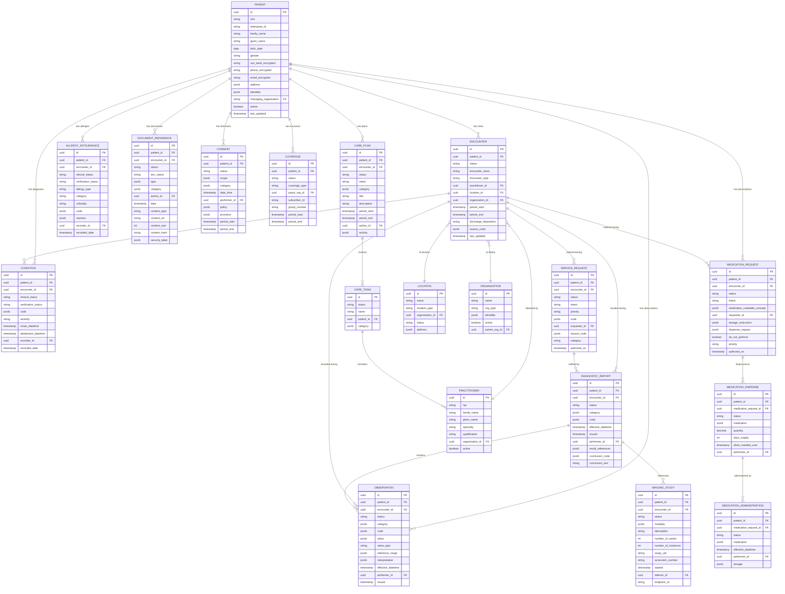

# Low-Level Design — Cloud-Native EHR Platform

## 1. Data Model

### 1.1 Core FHIR Resource Relationship Diagram



### 1.2 Patient Identity Model (MPI)

The Master Patient Index maintains the golden record and cross-references for patient identity resolution.

**MPI Record Schema:**

```
MPIRecord:
  enterprise_id: UUID                  // System-wide unique patient ID
  golden_record:
    family_name: STRING
    given_names: LIST<STRING>
    birth_date: DATE
    gender: STRING
    ssn_last4_hash: STRING             // Hashed, not stored in clear
    phone_numbers: LIST<STRING>        // Encrypted
    addresses: LIST<Address>           // Encrypted
    mother_maiden_name_hash: STRING    // Hashed
  facility_identifiers:
    - facility_id: UUID
      mrn: STRING
      assigning_authority: STRING
      status: ENUM (ACTIVE, MERGED, INACTIVE)
      linked_at: TIMESTAMP
  linked_records:
    - linked_enterprise_id: UUID
      link_type: ENUM (DUPLICATE, RELATED, REPLACED_BY)
      confidence_score: DECIMAL
      linked_by: ENUM (ALGORITHM, MANUAL)
      linked_at: TIMESTAMP
  match_vectors:
    name_phonetic: STRING              // Double Metaphone encoding
    name_normalized: STRING            // Lowercase, stripped special chars
    birth_date_components: MAP         // year, month, day for partial matching
  created_at: TIMESTAMP
  updated_at: TIMESTAMP
  version: BIGINT
```

**MPI Invariants:**
1. One enterprise_id per unique real-world person
2. Multiple facility MRNs can link to one enterprise_id
3. Merges create a REPLACED_BY link; merged ID becomes inactive
4. Unmerge preserves full merge history for audit
5. Golden record fields are consensus values from linked records

### 1.3 PHI Audit Event Model

```
PHIAuditEvent:
  audit_id: UUID
  timestamp: TIMESTAMP (microsecond precision)
  event_type: ENUM (
    PHI_ACCESS, PHI_CREATE, PHI_UPDATE, PHI_DELETE,
    PHI_EXPORT, PHI_PRINT, PHI_TRANSMIT,
    BREAK_THE_GLASS, CONSENT_OVERRIDE,
    LOGIN, LOGOUT, AUTH_FAILURE
  )
  actor:
    user_id: UUID
    user_role: STRING                  // Physician, Nurse, Admin, etc.
    npi: STRING                        // National Provider Identifier
    facility_id: UUID
    ip_address: STRING
    device_id: STRING
    session_id: UUID
  patient:
    patient_id: UUID
    mrn: STRING
    facility: UUID
  resource:
    resource_type: STRING              // Patient, Observation, etc.
    resource_id: UUID
    resource_version: STRING
  access_context:
    purpose: ENUM (TREATMENT, PAYMENT, OPERATIONS, RESEARCH, EMERGENCY)
    encounter_id: UUID                 // Links access to clinical encounter
    care_team_member: BOOLEAN          // Was accessor on patient's care team?
    department: STRING
    justification: STRING              // Required for break-the-glass
  outcome:
    result: ENUM (SUCCESS, FAILURE, DENIED)
    resources_accessed: INT
    data_categories: LIST<STRING>      // demographics, labs, notes, etc.
  integrity_hash: STRING               // HMAC chain for tamper detection
```

---

## 2. API Design

### 2.1 FHIR RESTful API

```
# Patient Operations
GET    /fhir/Patient/{id}                       # Read patient
GET    /fhir/Patient?name=Smith&birthdate=1980  # Search patients
POST   /fhir/Patient                            # Create patient
PUT    /fhir/Patient/{id}                       # Update patient
GET    /fhir/Patient/{id}/_history              # Version history
GET    /fhir/Patient/{id}/$everything           # All data for patient

# Encounter Operations
GET    /fhir/Encounter?patient={id}&status=in-progress
POST   /fhir/Encounter                          # Start encounter
PUT    /fhir/Encounter/{id}                     # Update encounter
GET    /fhir/Encounter/{id}/$everything          # All encounter data

# Clinical Documentation
POST   /fhir/Observation                        # Record vital sign / lab result
GET    /fhir/Observation?patient={id}&category=vital-signs&date=ge2026-01-01
POST   /fhir/Condition                          # Add diagnosis
GET    /fhir/Condition?patient={id}&clinical-status=active
POST   /fhir/DocumentReference                  # Upload clinical document
GET    /fhir/DocumentReference?patient={id}&type=clinical-note

# Order Entry
POST   /fhir/MedicationRequest                  # Prescribe medication
GET    /fhir/MedicationRequest?patient={id}&status=active
POST   /fhir/ServiceRequest                     # Order lab/imaging
GET    /fhir/DiagnosticReport?patient={id}&category=LAB

# Bulk Operations
GET    /fhir/$export?_type=Patient,Condition,Observation  # Bulk export
GET    /fhir/Group/{id}/$export                            # Group export
```

**Example: Patient Search Response**

```
GET /fhir/Patient?name=Smith&birthdate=1980-06-15

Response 200:
{
  "resourceType": "Bundle",
  "type": "searchset",
  "total": 2,
  "entry": [
    {
      "resource": {
        "resourceType": "Patient",
        "id": "pat-uuid-001",
        "identifier": [
          {
            "system": "urn:facility:mercy-general",
            "value": "MRN-12345"
          }
        ],
        "name": [
          {
            "family": "Smith",
            "given": ["John", "Robert"]
          }
        ],
        "birthDate": "1980-06-15",
        "gender": "male",
        "telecom": [
          {
            "system": "phone",
            "value": "***-***-4567"
          }
        ]
      },
      "search": {
        "mode": "match",
        "score": 0.98
      }
    }
  ]
}
```

### 2.2 CDS Hooks API

```
# CDS Service Discovery
GET    /cds-services                              # List available CDS services

# Hook Invocation
POST   /cds-services/drug-interactions            # order-select hook
POST   /cds-services/sepsis-screening             # patient-view hook
POST   /cds-services/care-gap-alerts              # encounter-start hook

# Feedback
POST   /cds-services/{id}/feedback                # Report on card outcome
```

**Example: CDS Hook Request (order-select)**

```
POST /cds-services/drug-interactions

Request:
{
  "hookInstance": "hook-uuid",
  "hook": "order-select",
  "fhirServer": "https://ehr.example.com/fhir",
  "context": {
    "userId": "Practitioner/pract-uuid",
    "patientId": "Patient/pat-uuid-001",
    "encounterId": "Encounter/enc-uuid",
    "draftOrders": {
      "resourceType": "Bundle",
      "entry": [
        {
          "resource": {
            "resourceType": "MedicationRequest",
            "medicationCodeableConcept": {
              "coding": [{
                "system": "http://www.nlm.nih.gov/research/umls/rxnorm",
                "code": "197361",
                "display": "Warfarin 5mg tablet"
              }]
            }
          }
        }
      ]
    }
  },
  "prefetch": {
    "activeMedications": {
      "resourceType": "Bundle",
      "entry": [...]
    },
    "allergies": {
      "resourceType": "Bundle",
      "entry": [...]
    }
  }
}

Response 200:
{
  "cards": [
    {
      "uuid": "card-uuid",
      "summary": "Potential drug interaction: Warfarin + Aspirin",
      "detail": "Concurrent use increases risk of bleeding. Consider monitoring INR more frequently.",
      "indicator": "warning",
      "source": {
        "label": "Drug Interaction Knowledge Base",
        "url": "https://cds.example.com/interactions/warfarin-aspirin"
      },
      "suggestions": [
        {
          "label": "Add INR monitoring order",
          "actions": [
            {
              "type": "create",
              "resource": {
                "resourceType": "ServiceRequest",
                "code": {
                  "coding": [{
                    "system": "http://loinc.org",
                    "code": "6301-6",
                    "display": "INR in Platelet poor plasma"
                  }]
                }
              }
            }
          ]
        }
      ],
      "overrideReasons": [
        { "code": "clinical-override", "display": "Benefit outweighs risk" },
        { "code": "patient-informed", "display": "Patient informed of risk" }
      ]
    }
  ]
}
```

### 2.3 SMART on FHIR App Launch

```
SMART Launch Sequence:

1. App Launch (EHR Launch or Standalone)
   GET /authorize?
     response_type=code&
     client_id=smart-app-001&
     redirect_uri=https://app.example.com/callback&
     scope=patient/Patient.read patient/Observation.read launch&
     state=random-state&
     aud=https://ehr.example.com/fhir

2. Authorization Code Exchange
   POST /token
     grant_type=authorization_code&
     code=auth-code-xyz&
     redirect_uri=https://app.example.com/callback&
     client_id=smart-app-001

3. Token Response (with FHIR context)
   {
     "access_token": "eyJ...",
     "token_type": "Bearer",
     "expires_in": 3600,
     "scope": "patient/Patient.read patient/Observation.read",
     "patient": "pat-uuid-001",
     "encounter": "enc-uuid-001",
     "fhirUser": "Practitioner/pract-uuid"
   }

4. App Makes FHIR Calls with Token
   GET /fhir/Patient/pat-uuid-001
   Authorization: Bearer eyJ...
```

### 2.4 Patient Match Operation

```
POST /fhir/Patient/$match

Request:
{
  "resourceType": "Parameters",
  "parameter": [
    {
      "name": "resource",
      "resource": {
        "resourceType": "Patient",
        "name": [{ "family": "Smith", "given": ["John"] }],
        "birthDate": "1980-06-15",
        "gender": "male",
        "telecom": [{ "system": "phone", "value": "555-123-4567" }]
      }
    },
    { "name": "onlyCertainMatches", "valueBoolean": false },
    { "name": "count", "valueInteger": 5 }
  ]
}

Response 200:
{
  "resourceType": "Bundle",
  "type": "searchset",
  "entry": [
    {
      "resource": { "resourceType": "Patient", "id": "pat-uuid-001", ... },
      "search": { "score": 0.95, "extension": [
        { "url": "match-grade", "valueCode": "probable" }
      ]}
    },
    {
      "resource": { "resourceType": "Patient", "id": "pat-uuid-042", ... },
      "search": { "score": 0.72, "extension": [
        { "url": "match-grade", "valueCode": "possible" }
      ]}
    }
  ]
}
```

---

## 3. Core Algorithms

### 3.1 Patient Matching Algorithm

```
ALGORITHM MatchPatient(incoming_patient):
    // Step 1: Generate candidate set via blocking
    candidates = SET()

    // Block 1: Exact DOB + first 3 chars of last name
    block1 = INDEX_LOOKUP(
        dob = incoming_patient.birth_date,
        name_prefix = incoming_patient.family_name[0:3].upper()
    )
    candidates.ADD_ALL(block1)

    // Block 2: Phonetic encoding of name + birth year
    phonetic = DOUBLE_METAPHONE(incoming_patient.family_name)
    block2 = INDEX_LOOKUP(
        name_phonetic = phonetic,
        birth_year = incoming_patient.birth_date.year
    )
    candidates.ADD_ALL(block2)

    // Block 3: Phone number (last 4 digits) + gender
    IF incoming_patient.phone IS NOT NULL:
        phone_suffix = incoming_patient.phone[-4:]
        block3 = INDEX_LOOKUP(
            phone_last4 = phone_suffix,
            gender = incoming_patient.gender
        )
        candidates.ADD_ALL(block3)

    // Step 2: Score each candidate using probabilistic matching
    scored_candidates = []
    FOR EACH candidate IN DEDUPLICATE(candidates):
        score = 0.0
        weights = GET_FIELD_WEIGHTS()

        // Name comparison (Jaro-Winkler similarity)
        name_sim = JARO_WINKLER(
            NORMALIZE(incoming_patient.family_name),
            NORMALIZE(candidate.family_name)
        )
        score += name_sim * weights.family_name  // weight: 0.20

        given_sim = JARO_WINKLER(
            NORMALIZE(incoming_patient.given_name),
            NORMALIZE(candidate.given_name)
        )
        score += given_sim * weights.given_name  // weight: 0.10

        // Date of birth comparison
        IF incoming_patient.birth_date = candidate.birth_date:
            score += 1.0 * weights.birth_date    // weight: 0.25
        ELSE IF YEAR_MATCHES(incoming_patient, candidate):
            score += 0.3 * weights.birth_date    // Partial: transposed digits

        // Gender comparison
        IF incoming_patient.gender = candidate.gender:
            score += 1.0 * weights.gender         // weight: 0.05

        // Phone comparison
        IF PHONE_MATCH(incoming_patient.phone, candidate.phone):
            score += 1.0 * weights.phone           // weight: 0.15

        // Address comparison (fuzzy)
        IF incoming_patient.address IS NOT NULL AND candidate.address IS NOT NULL:
            addr_sim = ADDRESS_SIMILARITY(incoming_patient.address, candidate.address)
            score += addr_sim * weights.address    // weight: 0.10

        // SSN last 4 comparison
        IF SSN_LAST4_MATCH(incoming_patient, candidate):
            score += 1.0 * weights.ssn_last4       // weight: 0.15

        scored_candidates.ADD((candidate, score))

    // Step 3: Classify matches
    SORT scored_candidates BY score DESC

    results = []
    FOR EACH (candidate, score) IN scored_candidates:
        IF score >= AUTO_LINK_THRESHOLD (0.92):
            grade = "certain"
        ELSE IF score >= PROBABLE_THRESHOLD (0.80):
            grade = "probable"
        ELSE IF score >= POSSIBLE_THRESHOLD (0.65):
            grade = "possible"
        ELSE:
            CONTINUE  // Below threshold, skip

        results.ADD(MatchResult(
            patient = candidate,
            score = score,
            grade = grade
        ))

    // Step 4: Auto-link certain matches
    IF results[0].grade = "certain" AND results.length = 1:
        AUTO_LINK(incoming_patient, results[0].patient)
        LOG_MATCH_DECISION("AUTO_LINKED", incoming_patient, results[0])
    ELSE IF results[0].grade = "probable":
        QUEUE_FOR_MANUAL_REVIEW(incoming_patient, results)

    RETURN results
```

### 3.2 Clinical Alert Rule Engine

```
ALGORITHM EvaluateCDSRules(context):
    // context: { patient, encounter, draft_orders, active_medications, allergies }

    alerts = []

    // Rule 1: Drug-Drug Interaction Check
    IF context.draft_orders IS NOT EMPTY:
        all_medications = context.active_medications + context.draft_orders
        FOR EACH pair IN COMBINATIONS(all_medications, 2):
            interaction = LOOKUP_INTERACTION(
                drug_a = pair[0].medication_code,
                drug_b = pair[1].medication_code
            )
            IF interaction IS NOT NULL:
                alerts.ADD(CDSCard(
                    summary = FORMAT("Interaction: {} + {}", pair[0].display, pair[1].display),
                    detail = interaction.description,
                    severity = interaction.severity,  // critical, serious, moderate
                    indicator = SEVERITY_TO_INDICATOR(interaction.severity),
                    source = interaction.evidence_source,
                    suggestions = interaction.alternatives
                ))

    // Rule 2: Drug-Allergy Cross-Reference
    FOR EACH order IN context.draft_orders:
        FOR EACH allergy IN context.allergies:
            IF ALLERGY_MATCHES_DRUG(allergy, order):
                alerts.ADD(CDSCard(
                    summary = FORMAT("Allergy alert: {} allergic to {}",
                        context.patient.name, allergy.substance),
                    indicator = CRITICALITY_TO_INDICATOR(allergy.criticality),
                    detail = FORMAT("Documented reaction: {}", allergy.reaction_description)
                ))

    // Rule 3: Dose Range Validation
    FOR EACH order IN context.draft_orders:
        IF order.resourceType = "MedicationRequest":
            dose_range = GET_DOSE_RANGE(
                medication = order.medication_code,
                route = order.route,
                age = CALCULATE_AGE(context.patient.birth_date),
                weight = GET_LATEST_WEIGHT(context.patient.id),
                renal_function = GET_LATEST_GFR(context.patient.id)
            )
            prescribed_dose = PARSE_DOSE(order.dosage_instruction)
            IF prescribed_dose > dose_range.max:
                alerts.ADD(CDSCard(
                    summary = FORMAT("Dose exceeds maximum: {} prescribed, {} max",
                        prescribed_dose, dose_range.max),
                    indicator = "critical"
                ))
            ELSE IF prescribed_dose < dose_range.min:
                alerts.ADD(CDSCard(
                    summary = FORMAT("Dose below therapeutic range"),
                    indicator = "warning"
                ))

    // Rule 4: Duplicate Order Detection
    FOR EACH order IN context.draft_orders:
        recent_orders = GET_RECENT_ORDERS(
            patient_id = context.patient.id,
            code = order.code,
            window = HOURS(24)
        )
        IF recent_orders IS NOT EMPTY:
            alerts.ADD(CDSCard(
                summary = "Possible duplicate order",
                detail = FORMAT("Similar order placed {} ago",
                    TIME_SINCE(recent_orders[0].authored_on)),
                indicator = "info"
            ))

    // Deduplicate and prioritize
    alerts = DEDUPLICATE(alerts, key=lambda a: a.summary)
    alerts = SORT(alerts, key=lambda a: SEVERITY_RANK(a.indicator), DESC)

    // Apply alert fatigue mitigation
    IF COUNT(alerts, indicator="info") > 3:
        alerts = FILTER(alerts, lambda a: a.indicator != "info" OR a.is_first_occurrence)

    RETURN alerts
```

### 3.3 Document Versioning Algorithm

```
ALGORITHM CreateDocumentVersion(document_reference, update_type):
    // update_type: AMENDMENT, ADDENDUM, CORRECTION, ATTESTATION

    current = LOAD_DOCUMENT(document_reference.id)

    // Step 1: Validate update is permitted
    IF current.doc_status = "final" AND update_type NOT IN [AMENDMENT, ADDENDUM]:
        RETURN ERROR("Final documents can only be amended or appended to")

    IF update_type = "CORRECTION":
        // Corrections require clinical privilege
        VALIDATE_PRIVILEGE(current_user, "DOCUMENT_CORRECTION")

    // Step 2: Create new version preserving original
    new_version = COPY(document_reference)
    new_version.id = current.id  // Same logical ID
    new_version.meta.versionId = current.meta.versionId + 1
    new_version.meta.lastUpdated = NOW()

    // Step 3: Capture provenance
    provenance = CREATE_PROVENANCE(
        target = new_version,
        agent = current_user,
        activity = update_type,
        recorded = NOW()
    )

    IF update_type = "AMENDMENT":
        new_version.doc_status = "amended"
        new_version.relatesTo = [{
            code: "replaces",
            target: REFERENCE(current.id, current.meta.versionId)
        }]
    ELSE IF update_type = "ADDENDUM":
        // Addendum is a new document that appends to original
        addendum = CREATE_NEW_DOCUMENT()
        addendum.relatesTo = [{
            code: "appends",
            target: REFERENCE(current.id)
        }]
        addendum.author = current_user
        addendum.date = NOW()
        STORE(addendum)
        STORE(PROVENANCE(addendum, "ADDENDUM"))
        RETURN addendum

    // Step 4: Store with version history intact
    STORE_VERSION(new_version)
    STORE(provenance)

    // Step 5: Emit event
    EMIT DocumentEvent("DocumentVersioned", new_version, update_type)

    // Step 6: Audit
    LOG_AUDIT(
        event_type = "PHI_UPDATE",
        resource_type = "DocumentReference",
        resource_id = new_version.id,
        previous_version = current.meta.versionId,
        new_version = new_version.meta.versionId,
        update_type = update_type,
        justification = document_reference.update_reason
    )

    RETURN new_version
```

### 3.4 Consent Evaluation Algorithm

```
ALGORITHM EvaluateConsent(accessor, patient_id, requested_resources):
    // Determines what data the accessor can see based on consent directives

    // Step 1: Load active consent directives
    consents = LOAD_CONSENTS(
        patient_id = patient_id,
        status = "active",
        period_includes = NOW()
    )

    // Step 2: Check for emergency override (break-the-glass)
    IF accessor.is_break_the_glass:
        LOG_AUDIT(
            event_type = "BREAK_THE_GLASS",
            actor = accessor,
            patient = patient_id,
            justification = accessor.emergency_justification
        )
        NOTIFY_PRIVACY_OFFICER(accessor, patient_id)
        RETURN ConsentDecision(
            permitted = requested_resources,  // All access granted
            denied = [],
            basis = "EMERGENCY_OVERRIDE"
        )

    // Step 3: Default policy (treatment, payment, operations = permitted)
    IF accessor.purpose IN ["TREATMENT", "PAYMENT", "OPERATIONS"]:
        default_permitted = TRUE
    ELSE:
        default_permitted = FALSE  // Research, marketing need explicit consent

    // Step 4: Apply consent provisions (restrictions and grants)
    permitted = []
    denied = []

    FOR EACH resource IN requested_resources:
        resource_decision = default_permitted

        FOR EACH consent IN consents:
            FOR EACH provision IN consent.provision:
                IF PROVISION_APPLIES(provision, resource, accessor):
                    IF provision.type = "deny":
                        resource_decision = FALSE
                        // Check for specific restrictions
                        // e.g., 42 CFR Part 2 (substance abuse records)
                        // e.g., State mental health protections
                    ELSE IF provision.type = "permit":
                        resource_decision = TRUE

        IF resource_decision:
            permitted.ADD(resource)
        ELSE:
            denied.ADD(resource)

    // Step 5: Apply minimum necessary standard
    IF accessor.purpose != "TREATMENT":
        permitted = APPLY_MINIMUM_NECESSARY(permitted, accessor.role)

    RETURN ConsentDecision(
        permitted = permitted,
        denied = denied,
        basis = "CONSENT_EVALUATION",
        consents_evaluated = consents.ids
    )


FUNCTION PROVISION_APPLIES(provision, resource, accessor):
    // Check if this consent provision applies to this resource + accessor
    matches = TRUE

    IF provision.actor_role IS NOT NULL:
        matches = matches AND accessor.role IN provision.actor_role

    IF provision.data_class IS NOT NULL:
        resource_class = CLASSIFY_RESOURCE(resource)
        matches = matches AND resource_class IN provision.data_class

    IF provision.security_label IS NOT NULL:
        resource_labels = GET_SECURITY_LABELS(resource)
        matches = matches AND ANY(label IN provision.security_label FOR label IN resource_labels)

    IF provision.period IS NOT NULL:
        matches = matches AND NOW() WITHIN provision.period

    RETURN matches
```

### 3.5 Patient Chart Assembly Algorithm

```
ALGORITHM AssemblePatientChart(patient_id, requesting_context):
    // requesting_context: { user, encounter_id, purpose, requested_sections }

    // Step 1: Resolve patient identity
    golden_record = MPI.Resolve(patient_id)
    all_patient_ids = golden_record.get_all_linked_ids()

    // Step 2: Evaluate consent
    consent_decision = EVALUATE_CONSENT(
        requesting_context.user, patient_id, requesting_context.requested_sections
    )

    // Step 3: Check cache for recent chart assembly
    cache_key = HASH(patient_id, requesting_context.requested_sections)
    cached = CACHE.GET(cache_key)
    IF cached IS NOT NULL AND cached.age < SECONDS(30):
        RETURN APPLY_CONSENT_FILTER(cached.chart, consent_decision)

    // Step 4: Parallel fetch across resource types
    chart = PatientChart()

    PARALLEL:
        chart.demographics = FHIR.Read("Patient", patient_id)

        chart.problems = FHIR.Search("Condition",
            patient = all_patient_ids,
            clinical_status = "active,recurrence,relapse"
        )

        chart.medications = FHIR.Search("MedicationRequest",
            patient = all_patient_ids,
            status = "active,on-hold"
        )

        chart.allergies = FHIR.Search("AllergyIntolerance",
            patient = all_patient_ids,
            clinical_status = "active"
        )

        chart.recent_encounters = FHIR.Search("Encounter",
            patient = all_patient_ids,
            date = "ge" + MONTHS_AGO(6),
            _sort = "-date",
            _count = 20
        )

        chart.recent_results = FHIR.Search("DiagnosticReport",
            patient = all_patient_ids,
            date = "ge" + MONTHS_AGO(3),
            _sort = "-date",
            _count = 50
        )

        chart.vitals = FHIR.Search("Observation",
            patient = all_patient_ids,
            category = "vital-signs",
            date = "ge" + MONTHS_AGO(1),
            _sort = "-date"
        )

        chart.care_plans = FHIR.Search("CarePlan",
            patient = all_patient_ids,
            status = "active"
        )

        chart.immunizations = FHIR.Search("Immunization",
            patient = all_patient_ids,
            _sort = "-date"
        )

    // Step 5: Apply consent filtering
    filtered_chart = APPLY_CONSENT_FILTER(chart, consent_decision)

    // Step 6: Cache assembled chart
    CACHE.SET(cache_key, filtered_chart, TTL = SECONDS(30))

    // Step 7: Audit chart access
    LOG_AUDIT(
        event_type = "PHI_ACCESS",
        actor = requesting_context.user,
        patient = patient_id,
        resources_accessed = COUNT_RESOURCES(filtered_chart),
        data_categories = EXTRACT_CATEGORIES(filtered_chart),
        purpose = requesting_context.purpose,
        encounter = requesting_context.encounter_id
    )

    RETURN filtered_chart
```

---

## 4. Event Schema Design

### 4.1 Clinical Event Envelope

```
ClinicalEventEnvelope:
  event_id: UUID
  event_type: STRING                // Fully qualified: clinical.encounter.started
  resource_type: STRING             // FHIR resource type
  resource_id: UUID
  patient_id: UUID                  // For patient-keyed partitioning
  facility_id: UUID
  timestamp: TIMESTAMP (UTC)
  actor_id: UUID                    // User or system that triggered
  version: INT                      // Schema version
  fhir_resource: BYTES              // Serialized FHIR resource (optional)
  change_summary:                   // What changed
    operation: ENUM (CREATE, UPDATE, DELETE)
    changed_fields: LIST<STRING>
    previous_values: MAP<STRING, ANY>
  correlation_id: UUID              // Links related events
  metadata: MAP<STRING, STRING>
```

### 4.2 FHIR Subscription Model

```
FHIR Subscription (R5 Topic-Based):

SubscriptionTopic: "encounter-discharge"
  resource: Encounter
  filter:
    - field: status
      value: finished
  notification_shape:
    - resource: Encounter
    - include: Encounter:patient
    - include: Encounter:participant

Subscription:
  topic: "encounter-discharge"
  channel:
    type: rest-hook
    endpoint: "https://hie.example.com/notifications"
    header: "Authorization: Bearer {token}"
  filter:
    - field: Encounter.serviceProvider
      value: "Organization/mercy-general"
  payload_content: "full-resource"
  heartbeat_period: 60
```

---

*Next: [Deep Dive & Bottlenecks ->](./04-deep-dive-and-bottlenecks.md)*
