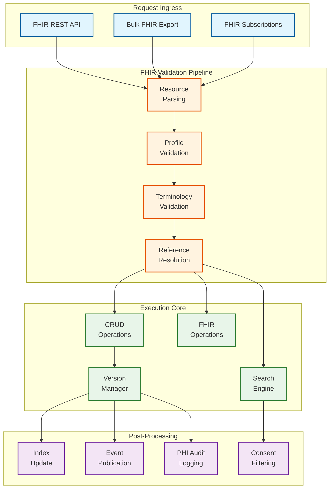
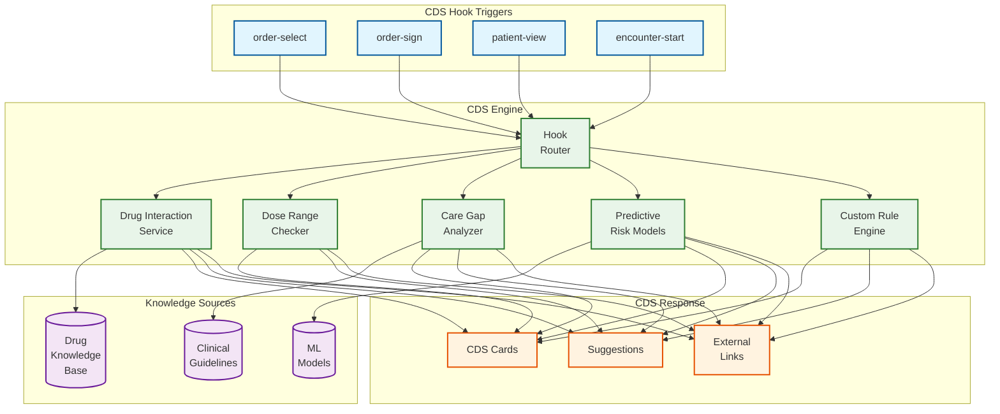

# Deep Dive & Bottlenecks — Cloud-Native EHR Platform

## 1. Deep Dive: FHIR Server and Resource Resolution

### 1.1 Architecture of the FHIR Server

The FHIR Server is the central hub through which all clinical data flows. Every read, write, search, and operation passes through it, making its design critical to overall system performance and correctness.



### 1.2 FHIR Search Engine Design

FHIR search is the most complex and performance-critical capability. The FHIR specification defines hundreds of search parameters across resource types, including chained searches, reverse includes, and composite parameters.

**Search Parameter Index Strategy:**

```
Index Types by Search Parameter:

Token Parameters (code, status, identifier):
  - B-tree index on (system, code) tuples
  - Supports exact match and system-qualified search
  - Example: Observation?code=http://loinc.org|85354-9

Date Parameters (date, period):
  - B-tree index on date ranges
  - Supports eq, ne, lt, gt, le, ge, sa, eb prefixes
  - Example: Encounter?date=ge2026-01-01&date=le2026-03-01

Reference Parameters (patient, subject, encounter):
  - B-tree index on reference target (resource type + ID)
  - Supports chained search via join
  - Example: Observation?patient.name=Smith

String Parameters (name, address):
  - Trigram index for prefix and contains matching
  - Phonetic index (Double Metaphone) for name search
  - Example: Patient?name:contains=smi

Composite Parameters (code-value-quantity):
  - Composite index on multiple fields
  - Example: Observation?code-value-quantity=http://loinc.org|8480-6$gt140
```

**Search Execution Pipeline:**

```
ALGORITHM ExecuteFHIRSearch(resource_type, search_params):
    // Step 1: Parse and validate search parameters
    parsed = PARSE_SEARCH_PARAMS(resource_type, search_params)
    VALIDATE_PARAMS(parsed, resource_type.search_parameter_definitions)

    // Step 2: Build query plan
    query_plan = QUERY_OPTIMIZER.Plan(parsed)
    // Optimizer selects indexes, determines join order,
    // estimates selectivity for each parameter

    // Step 3: Execute with patient-partition routing
    IF parsed.has_patient_parameter:
        partition = RESOLVE_PARTITION(parsed.patient_id)
        results = EXECUTE_ON_PARTITION(partition, query_plan)
    ELSE:
        // Scatter-gather across all partitions
        results = PARALLEL_EXECUTE(ALL_PARTITIONS, query_plan)
        results = MERGE_AND_SORT(results)

    // Step 4: Apply _include and _revinclude
    IF parsed.includes IS NOT EMPTY:
        FOR EACH include IN parsed.includes:
            included_resources = RESOLVE_REFERENCES(results, include)
            results.ADD_INCLUDED(included_resources)

    // Step 5: Apply consent filtering
    results = CONSENT_FILTER(results, current_user, current_purpose)

    // Step 6: Apply paging
    results = APPLY_PAGING(results, parsed._count, parsed._offset)

    // Step 7: Build FHIR Bundle response
    bundle = BUILD_SEARCH_BUNDLE(results, total_count)

    RETURN bundle
```

### 1.3 Resource Versioning and History

Every FHIR resource maintains a complete version history:

```
Version Storage Model:
  resource_id: UUID (logical ID, stable across versions)
  version_id: INT (monotonically increasing)
  resource_type: STRING
  content: JSONB (full FHIR resource)
  meta:
    versionId: STRING
    lastUpdated: TIMESTAMP
    source: STRING (provenance URI)
    profile: LIST<STRING>
    security: LIST<Coding>
    tag: LIST<Coding>
  patient_id: UUID (for partitioning)
  is_current: BOOLEAN (only latest version is TRUE)
  is_deleted: BOOLEAN (soft delete marker)

Queries:
  Current version: WHERE resource_id = X AND is_current = TRUE
  Specific version: WHERE resource_id = X AND version_id = Y
  History: WHERE resource_id = X ORDER BY version_id DESC
```

---

## 2. Deep Dive: Master Patient Index (MPI)

### 2.1 Patient Matching Pipeline

The MPI is the most operationally critical component because patient misidentification directly causes clinical harm — wrong medications, missed allergies, incorrect diagnoses.

```
Patient Matching Pipeline:

                    New Patient Record
                          │
                          ▼
                ┌─────────────────┐
                │    Blocking     │  Generate candidate set
                │    Stage        │  (reduce N² to manageable)
                └────────┬────────┘
                         │
                    Candidate Set (100-2000 records)
                         │
                         ▼
                ┌─────────────────┐
                │  Probabilistic  │  Score each candidate
                │  Scoring        │  (Jaro-Winkler, phonetic, etc.)
                └────────┬────────┘
                         │
                    Scored Candidates
                         │
                         ▼
                ┌─────────────────┐
                │  Referential    │  Cross-reference against
                │  Matching       │  curated demographic database
                └────────┬────────┘
                         │
                         ▼
                ┌─────────────────┐
                │  Classification │  Certain / Probable / Possible
                │  & Decision     │
                └────────┬────────┘
                         │
              ┌──────────┼──────────┐
              ▼          ▼          ▼
         Auto-Link   Manual     New Record
         (certain)   Review     (no match)
                    (probable)
```

### 2.2 Blocking Strategy for Scale

At 50M patients, comparing every new record against all existing records is infeasible. Blocking reduces the comparison space:

```
Blocking Rules (applied in parallel, union of results):

Rule 1: DOB + Name Prefix
  Key: CONCAT(birth_date, family_name[0:3].upper())
  Expected block size: 5-50 records
  Recall: 85% (misses DOB typos)

Rule 2: Phonetic Name + Birth Year
  Key: CONCAT(DOUBLE_METAPHONE(family_name), birth_year)
  Expected block size: 20-200 records
  Recall: 90% (catches name spelling variations)

Rule 3: Phone Last 4 + Gender
  Key: CONCAT(phone[-4:], gender)
  Expected block size: 50-500 records
  Recall: 70% (phones change; catches name changes)

Rule 4: SSN Last 4 + Birth Year (when available)
  Key: CONCAT(ssn_last4_hash, birth_year)
  Expected block size: 1-5 records
  Recall: 95% (highly discriminating)

Combined recall (union): > 98%
Average candidate set size: 500-2000 records
```

### 2.3 Duplicate Rate Management

With 1-in-5 records being duplicates (per ONC data), proactive duplicate detection is essential:

```
Duplicate Detection Strategies:

1. Real-Time (at registration):
   - Match algorithm runs on every new registration
   - Auto-link if confidence > 0.92
   - Queue for review if confidence 0.65-0.92
   - Create new record if confidence < 0.65

2. Batch (nightly):
   - Run all-pairs matching within each blocking group
   - Use more expensive algorithms (edit distance, address parsing)
   - Generate potential duplicate work queue for morning review

3. Cross-Facility (on HIE query):
   - When external system queries patient, match against local index
   - If match found, optionally link records across organizations
   - Requires patient consent for cross-organizational linking

4. Referential (periodic):
   - Compare patient demographics against curated reference database
   - Reference data resolves ambiguity when internal matching is uncertain
   - Particularly effective for name changes, address updates
```

---

## 3. Deep Dive: Clinical Document Storage at Scale

### 3.1 Document Storage Architecture

Clinical documents range from small structured FHIR resources (1-10 KB) to large DICOM imaging studies (100 MB - 5 GB). A tiered storage approach is essential.

```
Document Storage Tiers:

Tier 1: FHIR Resources (hot)
  Storage: Document database optimized for JSON
  Size: 0.5-50 KB per resource
  Access: Sub-second retrieval
  Indexes: Full FHIR search parameter indexing
  Retention: Online for 7+ years

Tier 2: Clinical Documents (warm)
  Storage: Object storage with metadata index
  Types: C-CDA, PDF, scanned documents
  Size: 50 KB - 5 MB per document
  Access: < 2 second retrieval
  Indexes: Document type, patient, date, author
  Retention: 7-10 years online, then archive

Tier 3: Medical Imaging (cold path for old studies)
  Storage: Tiered object storage
  Types: DICOM instances (CT, MRI, X-ray, ultrasound)
  Size: 50 MB - 5 GB per study
  Access: < 10 seconds for metadata, streaming for pixels
  Indexes: Study UID, accession number, modality, date
  Retention: Hot (2 years), warm (5 years), archive (10+ years)

Tier 4: Archive
  Storage: Archive-class object storage
  Access: Minutes to hours retrieval
  Content: Aged-off documents and studies
  Encryption: AES-256 at rest
  Integrity: Checksum verification on retrieval
```

### 3.2 DICOMweb Integration

```
DICOMweb Service Architecture:

WADO-RS (Retrieve):
  GET /dicomweb/studies/{studyUID}
  GET /dicomweb/studies/{studyUID}/series/{seriesUID}
  GET /dicomweb/studies/{studyUID}/series/{seriesUID}/instances/{instanceUID}
  GET /dicomweb/studies/{studyUID}/rendered  // Server-side rendering

STOW-RS (Store):
  POST /dicomweb/studies  // Store new study

QIDO-RS (Query):
  GET /dicomweb/studies?PatientID={mrn}&StudyDate={date}

FHIR-DICOM Bridge:
  ImagingStudy FHIR resource references DICOM study via study UID
  Enables unified clinical view: FHIR chart + linked imaging

  ImagingStudy.endpoint → DICOMweb endpoint URL
  ImagingStudy.series.uid → DICOM series UID
  ImagingStudy.series.instance.uid → DICOM instance UID
```

---

## 4. Deep Dive: Clinical Decision Support Engine

### 4.1 CDS Architecture



### 4.2 Alert Fatigue Mitigation

Alert fatigue is the #1 CDS adoption barrier. Clinicians override 90-95% of drug interaction alerts, indicating excessive noise.

```
Alert Fatigue Mitigation Strategies:

1. Severity-Based Suppression:
   - Show all critical/contraindicated interactions
   - Suppress moderate interactions for established medication combos
   - Never suppress critical allergy cross-references

2. Context-Aware Filtering:
   - Suppress alerts for medications already in patient's active list
     (provider already managing this combination)
   - Only show alerts for the newly ordered medication
   - Specialty-aware: oncology providers see fewer dose-range alerts

3. Override Learning:
   - Track override rates per alert type
   - If override rate > 95% across providers for a specific alert:
     Flag for pharmacy committee review
   - Do NOT auto-suppress — committee decides

4. Interruptive vs. Non-Interruptive:
   - Critical: Hard stop, requires documented override reason
   - Serious: Soft stop, requires acknowledgment
   - Moderate: Information panel, no workflow interruption
   - Low: Available on hover, never interrupts

5. Tiered Presentation:
   - Maximum 3 interruptive alerts per order session
   - Remaining alerts available via "View all alerts" link
   - Prioritized by clinical severity, not alphabetical order
```

---

## 5. Deep Dive: PHI Access Audit Trail

### 5.1 Audit Architecture

Every access to Protected Health Information (PHI) must be logged for HIPAA compliance. At 50M patients with 500K concurrent users, this generates billions of audit events daily.

```
Audit Event Pipeline:

Clinical Request
      │
      ▼
┌──────────────┐
│ Application  │  ← Captures: who, what resource, when
│ Interceptor  │
└──────┬───────┘
       │
       ▼
┌──────────────┐
│ Async Audit  │  ← Non-blocking: audit must not slow clinical workflow
│ Buffer       │
└──────┬───────┘
       │
       ▼
┌──────────────┐
│ Audit Event  │  ← Enrichment: care team membership, encounter context
│ Enricher     │
└──────┬───────┘
       │
       ▼
┌──────────────┐
│ Audit Store  │  ← Append-only, WORM compliance, encrypted
│ (Immutable)  │
└──────┬───────┘
       │
  ┌────┼────────┐
  ▼    ▼        ▼
Anomaly  Compliance  Real-Time
Detect.  Reports     Dashboard
```

### 5.2 Access Anomaly Detection

```
Anomaly Detection Rules:

Rule 1: Snooping Detection
  Trigger: User accesses records of patients NOT in their care team
           AND NOT on their unit/department schedule
  Action: Flag for privacy officer review
  Exceptions: Consultations, on-call coverage (must document reason)

Rule 2: Excessive Record Access
  Trigger: User accesses > 50 unique patient records in 1 hour
           (adjusted per role: registration staff have higher threshold)
  Action: Real-time alert to privacy officer

Rule 3: VIP/Celebrity Record Access
  Trigger: Any access to flagged VIP patient records
  Action: Immediate notification to privacy officer + patient advocate

Rule 4: After-Hours Access
  Trigger: Non-emergency access outside scheduled shift hours
  Action: Flag for next-day review

Rule 5: Terminated Employee Access
  Trigger: Access attempt from deactivated account
  Action: Immediate block + security alert

Rule 6: Bulk Export Anomaly
  Trigger: FHIR $export or bulk download exceeding normal patterns
  Action: Require supervisor approval for download > 1000 records
```

---

## 6. Bottleneck Analysis

### 6.1 Identified Bottlenecks

| # | Bottleneck | Impact | Severity |
|---|---|---|---|
| B1 | Patient chart assembly latency (multi-resource fetch) | Slow chart load frustrates clinicians, impacts care delivery | **Critical** |
| B2 | FHIR search across non-patient-partitioned resource types | Cross-partition scatter-gather for population health queries | **High** |
| B3 | Patient matching at scale (50M records) | Blocking + scoring pipeline latency during registration | **High** |
| B4 | CDS evaluation latency during order entry | Alert delays disrupt order entry workflow | **Medium** |
| B5 | Audit log write throughput (billions/day) | Back-pressure on clinical operations if audit pipeline saturates | **High** |
| B6 | Medical imaging retrieval (multi-GB studies) | Large DICOM study download times impact radiology workflow | **Medium** |
| B7 | FHIR Subscription notification fan-out | High-volume event notification to many subscribers | **Medium** |
| B8 | Terminology validation overhead | Every code must validate against SNOMED/LOINC/RxNorm | **Low** |

### 6.2 Mitigation Strategies

**B1: Patient Chart Assembly Latency**
- Patient context cache: pre-assemble active patient charts for scheduled encounters
- Parallel FHIR fetch: all resource types retrieved concurrently
- Progressive loading: show demographics + problems + meds immediately; load results and history async
- FHIR $everything operation with server-side assembly optimization
- CDR co-locates all patient data on same partition for single-node fetch

**B2: Cross-Partition FHIR Search**
- Analytics projection in data warehouse handles population-level queries
- Bulk FHIR $export for research and quality measurement (async, not real-time)
- Pre-built population health indexes updated asynchronously
- Materialized views for common cross-patient queries (quality measures, registry)

**B3: Patient Matching at Scale**
- In-memory blocking indexes (DOB, phonetic name) refreshed incrementally
- Tiered matching: fast exact match first, probabilistic only for ambiguous cases
- Pre-computed match vectors (phonetic codes, normalized names) stored with patient records
- Bloom filter pre-check eliminates 90%+ of non-matches before expensive scoring

**B4: CDS Evaluation Latency**
- Pre-fetch patient context before CDS hook invocation
- Cache drug interaction results for common medication combinations
- Parallel CDS service invocation (drug interactions, dose check, duplicates concurrently)
- Circuit breaker: skip non-critical CDS services after 500ms; return available cards

**B5: Audit Log Write Throughput**
- Async buffered writes: audit events buffered in-memory (max 5s), batch-flushed
- Separate audit storage system from clinical data (no contention)
- Audit log partitioned by date (daily partitions, easy retention management)
- Write-ahead log with group commit for throughput optimization

**B6: Medical Imaging Retrieval**
- Progressive DICOM loading: key images first, then full study on demand
- DICOMweb streaming: chunk-based delivery for large studies
- Regional CDN for frequently accessed studies
- Lossy/lossless compression options for web viewing vs. diagnostic quality

**B7: FHIR Subscription Notification Fan-Out**
- Topic-based subscriptions reduce redundant processing
- Batch notifications for high-volume events (lab results)
- Per-subscriber rate limiting and backpressure
- Priority queue: critical results notifications before routine ADT

**B8: Terminology Validation Overhead**
- In-memory terminology cache for active code systems (SNOMED, LOINC, RxNorm)
- Incremental cache updates on terminology version releases
- Validate only user-entered codes; trust internally generated codes
- Async validation for non-critical fields; sync only for order codes

---

## 7. Failure Modes and Recovery

### 7.1 Critical Failure Scenarios

| Failure | Detection | Recovery | Impact |
|---|---|---|---|
| CDR primary node failure | Heartbeat timeout (< 10s) | Automated failover to synchronous replica | Brief read-only period (< 30s) |
| FHIR server pod crash | Health check failure | Container orchestration restarts pod | Requests rerouted to healthy pods; no data loss |
| MPI service failure | Circuit breaker trip | Fall back to facility-local MRN lookup | Cross-facility matching unavailable |
| CDS engine failure | Timeout on CDS Hooks call | Orders proceed without CDS alerts; log gap | Reduced clinical decision support |
| Audit pipeline failure | Consumer lag exceeding threshold | Queue buffers audit events; replay on recovery | Audit events delayed but not lost |
| Imaging gateway failure | DICOMweb request timeout | Fall back to direct PACS access (if available) | Image retrieval degraded |

### 7.2 Clinical Safety During System Downtime

```
Downtime Protocol:

Mode 1: PARTIAL DEGRADATION
  - FHIR reads available but writes delayed
  - CDS may be unavailable; clinicians use clinical judgment
  - Audit events queued for later processing
  - Patients CAN be seen; document on paper if needed

Mode 2: READ-ONLY MODE
  - Patient charts viewable from cached data
  - No new orders, notes, or updates possible
  - Emergency orders via phone + paper backup
  - Estimated duration displayed to all users

Mode 3: FULL DOWNTIME
  - Paper-based downtime procedures activated
  - Downtime reports (pre-printed patient summaries) distributed
  - After recovery: manual data entry of paper documentation
  - Reconciliation process for orders placed during downtime

Critical: Clinical systems MUST have documented downtime procedures.
The EHR being down does NOT mean patient care stops.
```

---

*Next: [Scalability & Reliability ->](./05-scalability-and-reliability.md)*
