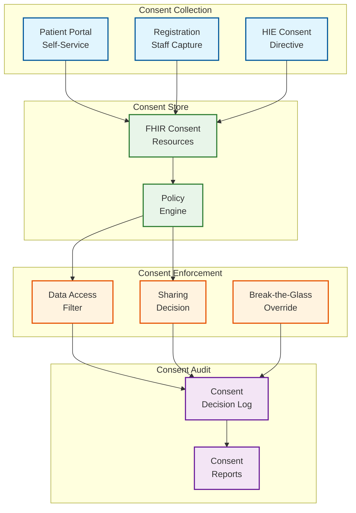

# Security & Compliance — Cloud-Native EHR Platform

## 1. Threat Model

### 1.1 Threat Actors

| Actor | Motivation | Capability | Primary Targets |
|---|---|---|---|
| **External attackers** | Data theft (PHI sells for 10-50x credit card data), ransomware | Sophisticated tools, social engineering, phishing | Clinical endpoints, patient portals, PHI databases |
| **Nation-state actors** | Espionage, healthcare disruption | Advanced persistent threats, zero-days | Infrastructure, encryption keys, research data |
| **Insider threats (malicious)** | Curiosity (celebrity records), financial gain | Direct system access, clinical role privileges | Patient records, prescription data, VIP charts |
| **Insider threats (accidental)** | Negligence, lack of training | Misconfigured access, shared credentials | PHI exposure via email, unsecured devices |
| **Business associates** | Data harvesting beyond contract scope | Legitimate but scoped data access | Bulk data exports, analytics feeds |
| **Ransomware operators** | Extortion | Encryption of clinical systems, data exfiltration | CDR, imaging storage, backup systems |

### 1.2 STRIDE Threat Analysis

| Threat | Component | Attack Vector | Mitigation |
|---|---|---|---|
| **Spoofing** | FHIR API Gateway | Token theft, session hijack | SMART on FHIR OAuth 2.0, short-lived tokens, device binding |
| **Tampering** | Clinical Data Repository | PHI modification, record alteration | Version history, cryptographic checksums, WORM audit log |
| **Repudiation** | Clinical Documentation | Deny authoring a clinical note | Digital signatures, attestation workflow, immutable audit trail |
| **Info Disclosure** | All data stores | SQL injection, API over-fetching | Input validation, consent-based filtering, field-level encryption |
| **Denial of Service** | FHIR API Gateway | Volumetric attack, resource exhaustion | Rate limiting, auto-scaling, DDoS mitigation |
| **Elevation of Privilege** | Authorization layer | RBAC bypass, cross-patient access | Context-aware RBAC, care team verification, break-the-glass audit |

---

## 2. Security Architecture

### 2.1 Defense in Depth

```
Layer 1: Network Perimeter
  ├── DDoS mitigation (volumetric + application layer)
  ├── Web application firewall (FHIR-aware rules)
  ├── IP reputation filtering
  └── VPN/private connectivity for clinical facilities

Layer 2: Transport Security
  ├── TLS 1.3 for all external connections
  ├── Mutual TLS (mTLS) for service-to-service
  ├── Certificate pinning for mobile clinical apps
  └── Perfect forward secrecy

Layer 3: API Security
  ├── SMART on FHIR OAuth 2.0 + OpenID Connect
  ├── Scope-based access control (patient/*.read, etc.)
  ├── FHIR-aware input validation (resource structure, references)
  ├── Rate limiting per app, per user, per facility
  └── Request signing for SMART backend services

Layer 4: Application Security
  ├── Clinical role-based access control with care team context
  ├── Consent-based data filtering at FHIR Server layer
  ├── Break-the-glass workflow with mandatory justification
  ├── Minimum necessary enforcement for non-treatment access
  └── Secure coding practices (OWASP Healthcare Top 10)

Layer 5: Data Security
  ├── AES-256 encryption at rest for all PHI
  ├── Field-level encryption for SSN, financial data
  ├── De-identification pipeline (Safe Harbor / Expert Determination)
  ├── Data masking in non-production environments
  └── Cryptographic integrity verification for clinical data

Layer 6: Infrastructure Security
  ├── Container image scanning and signing
  ├── Pod security policies (no privilege escalation)
  ├── Network policies (micro-segmentation, zero-trust)
  ├── Secret management (HSM-backed for encryption keys)
  └── Immutable infrastructure (no shell access to production)
```

### 2.2 Authentication Framework

**Clinical User Authentication:**

```
Clinical SSO Flow:
  1. User launches EHR application from clinical workstation
  2. Application redirects to identity provider (SAML 2.0 / OIDC)
  3. IdP authenticates via:
     - Enterprise credentials (Active Directory)
     - MFA: proximity badge tap + PIN
     - Optional: biometric (fingerprint for controlled substance prescribing)
  4. IdP returns assertion with:
     - User identity (NPI, employee ID)
     - Roles (physician, nurse, admin, etc.)
     - Facility context
     - Session timeout: 8 hours (shift-aligned)
  5. Context-sensitive re-authentication:
     - Prescribing controlled substances: re-authenticate within 5 min
     - Accessing restricted records: prompt for justification
     - Break-the-glass: additional MFA + documented emergency reason

Clinical Workstation Features:
  - Tap-and-go badge reader for fast user switching
  - Auto-lock after 5 minutes of inactivity (HIPAA requirement)
  - Proximity-based session management (badge must remain near workstation)
  - Shared workstation support (multiple users, single device)
```

**SMART on FHIR App Authentication:**

```
SMART App Launch:
  1. EHR launches SMART app in embedded frame or new window
  2. Launch context provided: patient, encounter, practitioner
  3. App requests OAuth 2.0 authorization with specific scopes:
     - patient/Observation.read (read patient vitals)
     - patient/MedicationRequest.write (create orders)
     - user/Patient.read (access based on user context)
  4. Authorization server validates:
     - App is registered and approved
     - Requested scopes are within app's approved scope set
     - User has clinical privileges for requested operations
  5. Access token issued with:
     - Scoped permissions
     - Patient context (launch binding)
     - Expiry: 1 hour (configurable per app risk tier)
  6. App makes FHIR API calls with access token
  7. Every API call validated against token scopes
```

### 2.3 Authorization Model

```
Clinical RBAC with Context:

Role Hierarchy:
  Attending Physician
    ├── Read/write all clinical data for assigned patients
    ├── Prescribe medications including controlled substances
    ├── Order any test/procedure
    └── Attest clinical documents

  Resident/Fellow
    ├── Read/write clinical data for assigned patients
    ├── Prescribe medications (co-signature required for some)
    ├── Order tests/procedures
    └── Draft clinical documents (require attending attestation)

  Registered Nurse
    ├── Read clinical data for unit patients
    ├── Document vitals, assessments, medication administration
    ├── Cannot prescribe medications
    └── Cannot finalize diagnostic orders

  Medical Assistant
    ├── Read demographics, vitals, allergies
    ├── Document vitals, update demographics
    ├── Cannot read clinical notes or results
    └── Cannot place orders

  Registration/Billing
    ├── Read/write demographics, insurance
    ├── Cannot read clinical data (notes, results, diagnoses)
    └── View encounter metadata only

Context-Aware Access Rules:

Rule: "Care team access"
  User MUST be on patient's care team OR same clinical department
  UNLESS break-the-glass is invoked
  → Enforced on every PHI access

Rule: "Department restriction"
  Behavioral health records (42 CFR Part 2):
    Only behavioral health providers can access
    Requires explicit patient consent for sharing
  → Enforced at resource security label level

Rule: "Facility restriction"
  User at Facility A cannot access records originating from Facility B
  UNLESS patient has consented to cross-facility sharing
  OR records were explicitly shared for continuity of care
  → Enforced at organization-scoped access level
```

---

## 3. HIPAA/HITECH Compliance

### 3.1 HIPAA Security Rule Implementation

| Safeguard | Requirement | Implementation |
|---|---|---|
| **Access Control** (§164.312(a)) | Unique user identification, emergency access, automatic logoff | Unique user IDs, break-the-glass workflow, 5-min auto-lock |
| **Audit Controls** (§164.312(b)) | Record and examine activity in information systems | Immutable PHI audit trail, 7-year retention, anomaly detection |
| **Integrity** (§164.312(c)) | Protect PHI from improper alteration or destruction | Version history, checksums, WORM storage for audit trail |
| **Authentication** (§164.312(d)) | Verify identity of persons seeking access to PHI | MFA, badge + PIN, biometric for EPCS |
| **Transmission Security** (§164.312(e)) | Guard against unauthorized access during transmission | TLS 1.3, mTLS, encrypted FHIR API transport |

### 3.2 HIPAA Privacy Rule Implementation

```
Minimum Necessary Standard:
  For Treatment: Full clinical record available (minimum necessary does not apply)
  For Payment: Only diagnosis codes, procedure codes, dates of service
  For Operations: Aggregated/de-identified where possible
  For Research: IRB-approved protocol with specific data elements defined
  For Public Health: Defined by public health authority requirements

Implementation:
  - Each API scope maps to a data access level
  - FHIR resource access filtered by purpose-of-use header
  - Non-treatment access automatically applies minimum necessary filter
  - Filter rules configurable per resource type and purpose:

    Purpose=PAYMENT:
      Patient: demographics only (no clinical data)
      Encounter: dates, types, provider (no notes)
      Condition: ICD-10 codes only
      Procedure: CPT codes only

    Purpose=RESEARCH:
      All resources: de-identified per Safe Harbor method
      18 identifiers removed or generalized
      Dates: shifted by random offset (consistent per patient)
```

### 3.3 ONC Cures Act / Information Blocking

```
Anti-Information-Blocking Requirements:

1. Patient Access API:
   - Must provide FHIR R4 API for patient access to their data
   - USCDI v3 data set must be available
   - No special effort, fees, or barriers for patient access
   - Response within 1 business day for electronic access

2. Provider Access:
   - Must respond to TEFCA queries within 48 hours
   - Cannot deny legitimate treatment-related data requests
   - Must support both query-based and document-based exchange

3. Permitted Exceptions (NOT information blocking):
   - Privacy exception: patient has opted out of sharing
   - Security exception: sharing would create security risk
   - Infeasibility exception: technically impossible to fulfill
   - Content and manner exception: data available in alternative format

4. Technical Implementation:
   - All USCDI data elements mapped to FHIR resources
   - Patient-facing FHIR API with SMART on FHIR auth
   - Health app directory for patient app authorization
   - No proprietary format lock-in for exported data
```

---

## 4. Consent Management

### 4.1 Consent Architecture



### 4.2 Consent Directive Types

```
Consent Categories:

1. General Treatment Consent
   Scope: Sharing within treating organization
   Default: Opt-in (assumed for treatment)
   Granularity: Organization-level

2. Health Information Exchange Consent
   Scope: Sharing with external organizations via HIE/TEFCA
   Default: Varies by state (opt-in vs. opt-out)
   Granularity: Per-organization or blanket

3. Sensitive Data Restrictions
   Scope: Specific data categories with heightened protections
   Categories:
     - Substance abuse (42 CFR Part 2): Requires explicit written consent
     - Mental health: State-specific protections
     - HIV/STI: State-specific disclosure restrictions
     - Genetic information (GINA): Cannot share with employers/insurers
     - Reproductive health: Enhanced protections in some states
   Granularity: Per-data-category, per-recipient

4. Research Consent
   Scope: Use of clinical data for research purposes
   Requirements: IRB approval, informed consent document
   Granularity: Per-study, specific data elements, time-limited

5. Patient Right to Restrict
   Scope: Patient requests restriction on specific disclosures
   HIPAA: Must agree to restrict if patient pays out-of-pocket
   Granularity: Per-encounter, per-condition, per-recipient
```

### 4.3 Break-the-Glass Emergency Access

```
Break-the-Glass Workflow:

Trigger: Clinical user attempts to access patient record outside
         normal access permissions (not on care team, restricted data)

Step 1: System displays warning
  "You are not authorized to access this patient's record.
   If you have a clinical emergency, you may override this restriction."

Step 2: User selects emergency reason
  - Active emergency treatment
  - On-call coverage for absent provider
  - Urgent consultation request
  - Other (free text justification required)

Step 3: User provides additional verification
  - Re-enter credentials (badge tap + PIN)
  - Acknowledge: "This access will be audited and reviewed"

Step 4: System grants time-limited access
  - Duration: 4 hours (configurable)
  - Scope: Full clinical record for the patient
  - All access during this window specially flagged in audit trail

Step 5: Post-access review (mandatory)
  - Privacy officer reviews ALL break-the-glass events within 24 hours
  - Reviewer validates clinical justification
  - Unjustified access → disciplinary action
  - All review decisions logged

Step 6: Patient notification (per institutional policy)
  - Some institutions notify patients of break-the-glass access
  - Accounting of disclosures includes break-the-glass events
```

---

## 5. Data Protection

### 5.1 PHI Encryption Strategy

```
Encryption Key Hierarchy:

Master Key (MK)
  ├── Stored in HSM, never exported
  ├── Split into custodian shares (3-of-5 quorum)
  └── Used only to wrap Tenant Encryption Keys

Tenant Encryption Keys (TEK)
  ├── Per-facility/organization encryption key
  ├── Wrapped by Master Key
  ├── Rotated every 90 days
  └── Used to wrap Data Encryption Keys

Data Encryption Keys (DEK)
  ├── Per-data-class encryption key
  ├── Wrapped by TEK
  ├── Rotated every 24 hours
  ├── Classes: clinical_data, audit_log, imaging, demographics
  └── Used for actual PHI encryption

Field-Level Encryption:
  - SSN: encrypted with dedicated key, searchable via HMAC index
  - Financial data: encrypted with dedicated key
  - Genetic data: encrypted with patient-specific key (crypto-shredding ready)
```

### 5.2 De-Identification Pipeline

```
De-Identification Methods:

Safe Harbor Method (18 identifiers removed):
  1. Names → removed
  2. Geographic data → state only (if population > 20K)
  3. Dates → year only (if age > 89, generalize to "90+")
  4. Phone numbers → removed
  5. Fax numbers → removed
  6. Email addresses → removed
  7. SSN → removed
  8. MRN → replaced with random ID
  9. Health plan numbers → removed
  10. Account numbers → removed
  11. Certificate/license numbers → removed
  12. Vehicle identifiers → removed
  13. Device identifiers → removed
  14. URLs → removed
  15. IP addresses → removed
  16. Biometric identifiers → removed
  17. Full-face photos → removed
  18. Any other unique identifier → removed

Date Shifting:
  - Generate random offset per patient (-180 to +180 days)
  - Apply consistently to all dates for that patient
  - Preserves relative time intervals within patient's data
  - Store offset mapping separately with restricted access

Expert Determination:
  - Statistical/scientific approach to verify re-identification risk < threshold
  - Used for research datasets requiring more granular data than Safe Harbor allows
  - Requires qualified expert certification
```

---

## 6. Incident Response

### 6.1 PHI Breach Response

| Phase | Timeline | Actions |
|---|---|---|
| **Detection** | Immediate | Automated anomaly detection, user reports, security alerts |
| **Containment** | < 1 hour | Isolate affected systems, revoke compromised credentials |
| **Assessment** | < 24 hours | Determine scope: how many patients, what PHI elements |
| **Notification** | Per HIPAA | HHS: < 60 days; individuals: < 60 days; media: if > 500 affected |
| **Remediation** | Ongoing | Patch vulnerability, enhance controls, retrain staff |
| **Post-Incident** | < 30 days | Root cause analysis, corrective action plan |

### 6.2 HIPAA Breach Notification Requirements

```
Breach Notification Decision Tree:

1. Was PHI accessed/acquired/used/disclosed impermissibly?
   NO → Not a breach; document and close
   YES → Continue

2. Does an exception apply?
   a. Unintentional access by workforce member in good faith
   b. Inadvertent disclosure to authorized person at same organization
   c. Recipient unable to retain the information
   If YES → Not a reportable breach
   If NO → Continue

3. Risk assessment (4 factors):
   a. Nature and extent of PHI involved (clinical data? identifiers?)
   b. Unauthorized person who used/received PHI
   c. Was PHI actually acquired or viewed?
   d. Extent to which risk has been mitigated

4. If risk assessment indicates low probability of compromise:
   → Document assessment; no notification required

5. If breach confirmed:
   → Notify affected individuals within 60 days
   → Notify HHS:
      < 500 individuals: annual log submission
      >= 500 individuals: within 60 days + media notification
   → Document all notification activities
```

---

## 7. Regulatory Compliance Matrix

| Regulation | Scope | Key Requirements | System Impact |
|---|---|---|---|
| **HIPAA Security Rule** | All PHI | Access controls, audit, encryption, integrity | Core security architecture |
| **HIPAA Privacy Rule** | All PHI | Minimum necessary, consent, patient rights | Consent engine, access filtering |
| **HITECH Act** | All EHR | Meaningful Use, breach notification | Interoperability APIs, audit trail |
| **ONC Cures Act** | All EHR | Anti-information blocking, USCDI | FHIR Patient Access API |
| **42 CFR Part 2** | Substance abuse data | Explicit consent for any disclosure | Segmented data with consent gate |
| **State Privacy Laws** | Varies | Mental health, HIV, reproductive health | Configurable per-state consent rules |
| **GINA** | Genetic data | Cannot share with employers/insurers | Genetic data segmentation |
| **FERPA** | Student health records | Parental consent for minors in schools | Age-based consent logic |

---

*Next: [Observability ->](./07-observability.md)*
