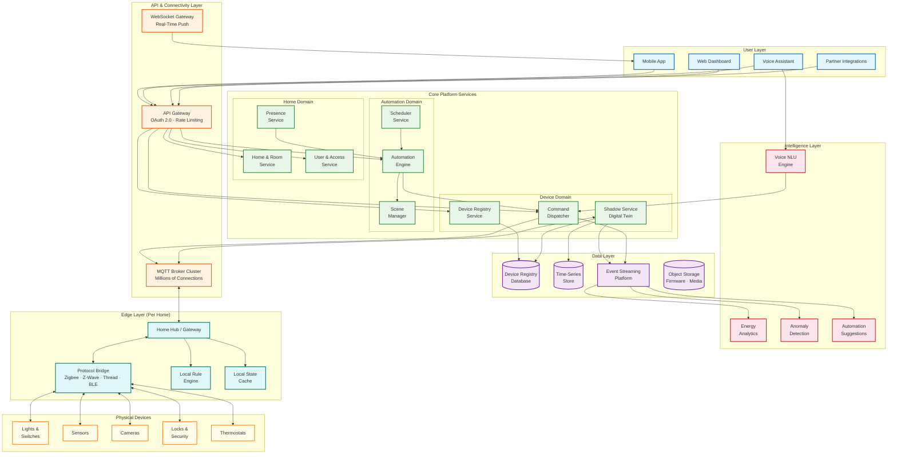
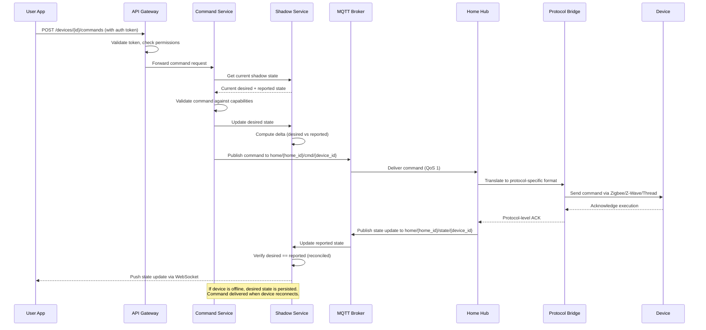
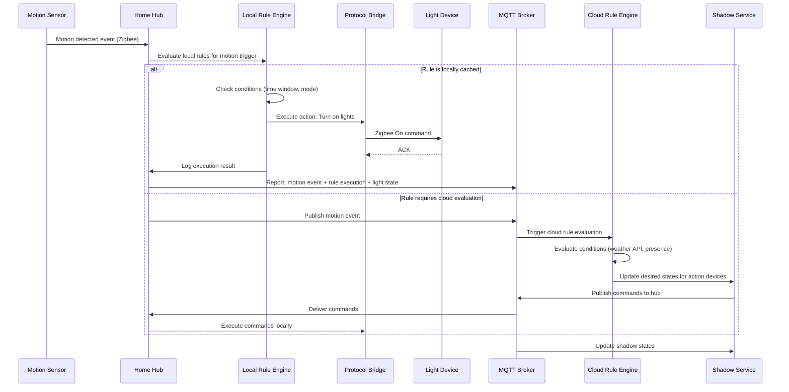
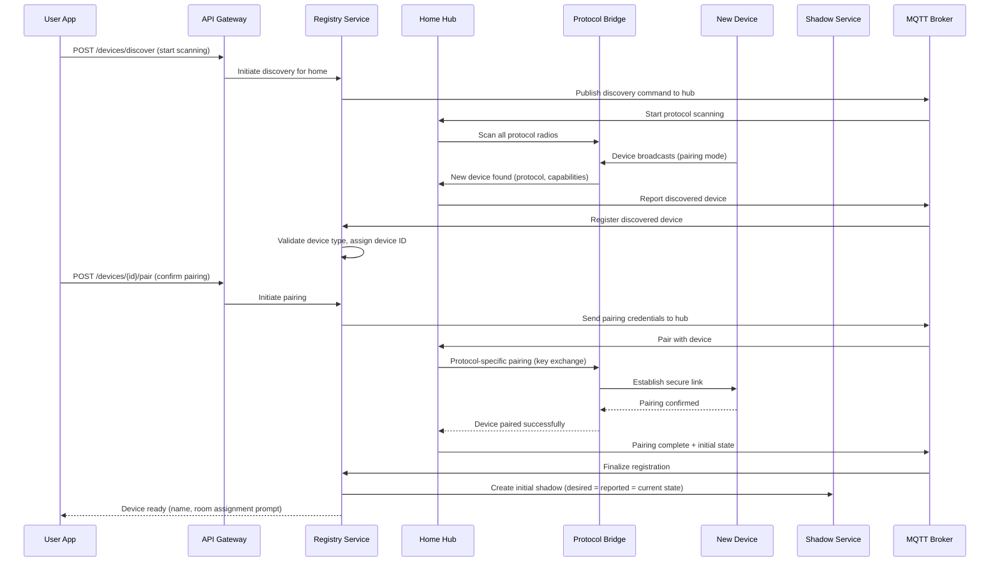

# High-Level Design — Smart Home Platform

## 1. System Architecture



---

## 2. Architectural Layers

### 2.1 User and API Layer

The user layer provides multiple interaction surfaces:

**API Gateway** handles:
- OAuth 2.0 token validation with home-scoped permissions
- Rate limiting per user, per home, per API endpoint
- Request routing to appropriate microservices
- WebSocket upgrade for real-time state streaming
- Partner API access with OAuth client credentials

**MQTT Broker Cluster** handles:
- Persistent connections from all home hubs (~80M connections)
- Direct connections from Wi-Fi devices (~400M connections)
- Topic-based message routing (home/device/telemetry, home/device/command)
- Quality of Service levels (QoS 0 for telemetry, QoS 1 for commands)
- Last Will and Testament (LWT) for device disconnect detection
- Retained messages for latest device state

**WebSocket Gateway** handles:
- Real-time device state push to mobile apps
- Live automation execution status
- Camera live-view streaming session management

### 2.2 Core Platform Services

Services are organized by **bounded contexts**:

| Domain | Services | Responsibility |
|---|---|---|
| **Device** | Registry, Shadow, Command Dispatcher | Device lifecycle, digital twin, command delivery |
| **Automation** | Engine, Scene Manager, Scheduler | Rule evaluation, scene coordination, time-based triggers |
| **Home** | Home/Room, User/Access, Presence | Home structure, user permissions, occupancy tracking |

Each service:
- Owns its data (database-per-service pattern)
- Communicates via events for cross-domain workflows
- Exposes synchronous APIs for query operations
- Scales independently based on its specific load patterns

### 2.3 Intelligence Layer

Intelligence services operate asynchronously, consuming event streams:

**Voice NLU Engine:** Processes voice commands through intent recognition → entity resolution → command generation pipeline. Maintains per-home device vocabulary for accurate entity resolution (distinguishing "living room light" from "bedroom light").

**Energy Analytics:** Aggregates energy consumption data across devices, generates usage reports, identifies optimization opportunities, and interfaces with utility demand-response programs.

**Anomaly Detection:** Monitors device behavior patterns for anomalies (device offline longer than usual, unusual sensor readings, potential security breaches). Triggers notifications and safety responses.

**Automation Suggestions:** Analyzes user behavior patterns (same devices controlled at same times) and suggests automations. Uses collaborative filtering across opt-in homes for popular automation templates.

### 2.4 Edge Layer (Per Home)

The edge layer is the most architecturally distinctive component:

```
┌──────────────────────────────────────────────┐
│                Home Hub                       │
│                                               │
│  ┌─────────────┐  ┌──────────────────────┐   │
│  │ Protocol     │  │ Local Rule Engine    │   │
│  │ Bridge       │  │ (cached rules from   │   │
│  │              │  │  cloud compilation)  │   │
│  │ ┌─────────┐  │  └──────────────────────┘   │
│  │ │ Zigbee  │  │                             │
│  │ │ Radio   │  │  ┌──────────────────────┐   │
│  │ ├─────────┤  │  │ Local State Cache    │   │
│  │ │ Z-Wave  │  │  │ (device shadows,     │   │
│  │ │ Radio   │  │  │  recent events)      │   │
│  │ ├─────────┤  │  └──────────────────────┘   │
│  │ │ Thread  │  │                             │
│  │ │ Radio   │  │  ┌──────────────────────┐   │
│  │ ├─────────┤  │  │ MQTT Client          │   │
│  │ │ BLE     │  │  │ (cloud sync,         │   │
│  │ │ Radio   │  │  │  command relay)      │   │
│  │ └─────────┘  │  └──────────────────────┘   │
│  └─────────────┘                              │
│                                               │
│  ┌──────────────────────────────────────────┐ │
│  │ Device Manager (pairing, firmware, health)│ │
│  └──────────────────────────────────────────┘ │
└──────────────────────────────────────────────┘
```

**Protocol Bridge:** Translates between protocol-specific device messages (Zigbee ZCL clusters, Z-Wave command classes, Matter interaction model) and the platform's unified device capability model.

**Local Rule Engine:** Evaluates automation rules cached from the cloud. When internet is unavailable, all locally-evaluable rules continue to execute. Rules are compiled to a lightweight format optimized for constrained hardware.

**Local State Cache:** Maintains the latest shadow state for all paired devices. Enables sub-50ms local command execution without cloud round-trip.

**MQTT Client:** Manages the persistent connection to the cloud MQTT broker. Handles upstream telemetry batching, downstream command reception, and state synchronization with bi-directional conflict resolution.

---

## 3. Core Data Flows

### 3.1 Device Command Flow (Cloud Path)



### 3.2 Automation Rule Execution Flow



### 3.3 Device Onboarding Flow



### 3.4 Edge-Cloud State Synchronization

```
Synchronization Model:

Hub → Cloud (Upstream):
  1. Device generates state change event
  2. Hub updates local shadow cache immediately
  3. Hub evaluates local rules against new state
  4. Hub batches state updates (max 100ms window or 10 events)
  5. Hub publishes batch to MQTT broker
  6. Cloud shadow service updates shadow state
  7. Cloud rule engine evaluates cloud-only rules
  8. WebSocket gateway pushes update to subscribed apps

Cloud → Hub (Downstream):
  1. User sends command via app or voice
  2. Command service updates desired shadow state
  3. Command published to hub via MQTT
  4. Hub receives command and updates local shadow
  5. Hub translates and sends to device
  6. Device reports execution result
  7. Hub updates local shadow and reports to cloud

Conflict Resolution:
  - Device-reported state always wins over cloud-desired state
  - If desired != reported for > 30 seconds, mark as "unresponsive"
  - On hub reconnect after offline period:
    a. Hub sends all locally-queued state updates
    b. Cloud sends any pending desired state changes
    c. Last-writer-wins with device-reported as tiebreaker
    d. Full shadow reconciliation for devices touched during offline period
```

---

## 4. Key Architectural Decisions

### 4.1 Hybrid Edge-Cloud Execution

| Decision | Execute automation rules both locally on hub and in cloud |
|---|---|
| **Context** | Smart home must remain functional during internet outages; some rules need cloud-only data |
| **Decision** | Rules are compiled in the cloud and pushed to hub in an edge-executable format. Rules requiring only local device state run on hub. Rules needing cloud data (weather, geolocation) run in cloud |
| **Rationale** | Internet outages should not disable core home functionality. Local execution provides sub-50ms response. Cloud execution enables richer context |
| **Trade-off** | Dual execution environments increase complexity; rule state must be synchronized; edge hardware limits rule complexity |
| **Mitigation** | Rule compiler generates both cloud and edge variants; hub syncs rule execution logs on reconnect; edge rules are a subset of cloud rules |

### 4.2 MQTT as Primary Device Communication Protocol

| Decision | Use MQTT as the backbone for all device-cloud communication |
|---|---|
| **Context** | Need reliable, low-bandwidth bidirectional communication with millions of constrained devices |
| **Decision** | MQTT 5.0 with QoS 1 for commands (at-least-once), QoS 0 for telemetry, persistent sessions for offline devices |
| **Rationale** | MQTT is purpose-built for IoT: small packet overhead, pub/sub for event distribution, built-in offline queuing, keepalive-based presence detection |
| **Trade-off** | Persistent connections consume memory on broker side; topic-based routing is less flexible than service mesh patterns |
| **Mitigation** | Horizontally scaled broker cluster with home-affinity routing; shared subscriptions for cloud services consuming device events |

### 4.3 Device Shadow (Digital Twin) Pattern

| Decision | Maintain a cloud-resident digital twin for every device |
|---|---|
| **Context** | Devices are intermittently connected; commands must survive device offline periods; state must be queryable without polling devices |
| **Decision** | Shadow stores desired state, reported state, and metadata. Commands update desired; devices update reported. Delta drives reconciliation |
| **Rationale** | Decouples command issuers from devices; enables offline command queueing; provides queryable state without device polling; supports time-travel debugging |
| **Trade-off** | Additional storage and consistency complexity; shadow may be briefly stale after device state change |
| **Mitigation** | Hub reports state changes within 2s; shadow TTL triggers reconciliation check if no update received; eventual consistency is acceptable for non-safety use cases |

### 4.4 Capability-Based Device Abstraction

| Decision | Abstract devices by capabilities, not by protocol or manufacturer |
|---|---|
| **Context** | Must support devices across 6+ protocols with thousands of manufacturer variations |
| **Decision** | Every device is modeled as a set of standardized capabilities (on/off, brightness, color, temperature, motion, energy). Automation rules reference capabilities, not protocols |
| **Rationale** | Enables protocol-agnostic automations; simplifies rule authoring; supports device replacement without rule changes; aligns with Matter's cluster model |
| **Trade-off** | Lowest-common-denominator risk: advanced protocol-specific features may not map cleanly to generic capabilities |
| **Mitigation** | Support "extended capabilities" for protocol-specific features; capability versioning allows gradual enrichment; raw protocol access available via advanced API |

### 4.5 Home-Level Data Partitioning

| Decision | Partition all data by home ID |
|---|---|
| **Context** | Need strict tenant isolation, independent scaling, and data locality per household |
| **Decision** | Home ID is the primary partition key for device registry, shadow state, automation rules, event history, and MQTT topic routing |
| **Rationale** | All operations are scoped to a single home; eliminates cross-partition queries for normal operations; enables per-home encryption and access control |
| **Trade-off** | Cross-home analytics (energy benchmarking, automation suggestions) require scatter-gather; home size varies widely (5 devices to 200+) |
| **Mitigation** | Aggregated analytics use materialized views built from event streams; partition rebalancing for extremely large homes; virtual partitioning within a home for 200+ device installations |

---

## 5. Inter-Service Communication

### 5.1 Communication Patterns

| Pattern | Usage | Example |
|---|---|---|
| **Synchronous (REST)** | User-initiated actions requiring immediate response | Get device state, update device name, create automation rule |
| **Asynchronous (MQTT)** | Device-to-cloud and cloud-to-device communication | Telemetry uploads, command delivery, state sync |
| **Event streaming** | Cross-service state propagation and analytics | DeviceStateChanged → automation engine, analytics, anomaly detection |
| **WebSocket (push)** | Real-time user interface updates | Live device state in mobile app, automation execution status |

### 5.2 Command Delivery Guarantee

Device commands require special handling due to unreliable device connectivity:

```
DELIVERY: AtLeastOnce Command Delivery
  Step 1: Accept command, assign command_id, persist to command log
  Step 2: Update shadow desired state with command_id reference
  Step 3: Publish command to MQTT with QoS 1 (broker-level persistence)
  Step 4: Hub receives, ACKs MQTT delivery
  Step 5: Hub sends to device via protocol bridge
  Step 6: Device executes and reports new state
  Step 7: Hub reports execution result with command_id
  Step 8: Cloud matches reported state to command_id, marks command complete

  Timeout handling:
  - If no ACK from hub within 10s: retry via MQTT (max 3 retries)
  - If hub ACKs but device doesn't respond within 30s: mark as "pending"
  - If device offline: command remains in shadow desired state until device connects
  - If command expires (configurable TTL, default 1 hour): mark as "expired"

  Idempotency:
  - Commands include version counter
  - Device ignores commands with version <= already-executed version
  - Prevents duplicate execution on retry
```

---

## 6. Deployment Topology

### 6.1 Multi-Region Cloud Deployment

```
Region A (Primary)                  Region B (Secondary)
┌──────────────────────┐           ┌──────────────────────┐
│ MQTT Broker Cluster  │◄─────────►│ MQTT Broker Cluster  │
│ Core Services Pods   │           │ Core Services Pods   │
│ Device Registry (R/W)│──async───►│ Device Registry (R/O)│
│ Time-Series Store    │           │ Time-Series Store    │
│ Event Stream Cluster │           │ Event Stream Cluster │
└──────────────────────┘           └──────────────────────┘
         │                                    │
    Hubs in Region A                    Hubs in Region B
    connect here                        connect here

Global DNS: Routes hubs to nearest region
Failover: Hub reconnects to secondary region if primary unreachable
Data: Home-level partitioning with regional affinity
```

### 6.2 Hub Connectivity Model

```
Home Network Topology:

Internet ─── Router ─── Home Hub (Ethernet/Wi-Fi)
                │                │
                │         ┌──────┤──────────────┐
                │         │      │              │
                │     Zigbee   Z-Wave        Thread
                │      mesh    network       mesh
                │         │      │              │
                │      Lights  Locks        Sensors
                │      Sensors Switches     Lights
                │                           Blinds
                │
           Wi-Fi Devices
           (cameras, speakers,
            smart plugs)
```

---

*Next: [Low-Level Design →](./03-low-level-design.md)*
