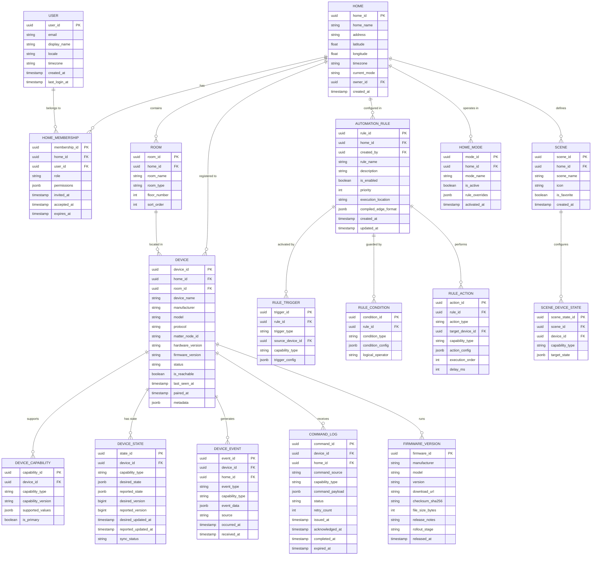

# Low-Level Design — Smart Home Platform

## 1. Data Model

### 1.1 Core Entity Relationship Diagram



### 1.2 Device Shadow Model

The shadow represents the digital twin of each device, separated by capability:

```
DeviceShadow:
  device_id: UUID
  home_id: UUID
  capabilities:
    - capability_type: "on_off"
      desired:
        is_on: BOOLEAN
        version: BIGINT
        updated_at: TIMESTAMP
        updated_by: STRING        // "user:uuid", "rule:uuid", "scene:uuid"
      reported:
        is_on: BOOLEAN
        version: BIGINT
        updated_at: TIMESTAMP
      delta:                      // Computed: desired - reported differences
        is_on: BOOLEAN
        since: TIMESTAMP          // How long the delta has existed
    - capability_type: "brightness"
      desired:
        level: INT (0-100)
        version: BIGINT
        updated_at: TIMESTAMP
      reported:
        level: INT (0-100)
        version: BIGINT
        updated_at: TIMESTAMP
      delta: NULL                 // NULL when desired == reported
    - capability_type: "color_temperature"
      desired:
        temperature_k: INT (2700-6500)
      reported:
        temperature_k: INT
  metadata:
    is_reachable: BOOLEAN
    last_seen_at: TIMESTAMP
    connection_type: STRING       // "zigbee", "zwave", "matter", "wifi"
    signal_strength: INT          // Protocol-specific RSSI
    battery_level: INT            // NULL for mains-powered
    firmware_version: STRING
```

**Shadow Invariants:**
1. Every capability has independent desired/reported state
2. `version` is monotonically increasing per capability per device
3. `delta` is automatically computed and cleared when desired == reported
4. Shadow is the single source of truth for device state in the cloud
5. Hub maintains a local copy synchronized via MQTT

### 1.3 Automation Rule Compiled Format

Rules are compiled from the user-friendly definition into an edge-executable format:

```
CompiledRule:
  rule_id: UUID
  home_id: UUID
  priority: INT                   // Lower number = higher priority
  execution_location: ENUM        // LOCAL, CLOUD, HYBRID

  triggers:
    - type: "device_state_change"
      device_id: UUID
      capability: "motion"
      field: "is_detected"
      value: TRUE

  conditions:
    operator: "AND"
    clauses:
      - type: "time_window"
        after: "sunset"           // Resolved to local time daily
        before: "23:00"
      - type: "device_state"
        device_id: UUID
        capability: "on_off"
        field: "is_on"
        value: FALSE              // Only if light is currently off
      - type: "home_mode"
        mode: "HOME"              // Only when someone is home

  actions:
    - type: "device_command"
      device_id: UUID
      capability: "brightness"
      command: "set_level"
      params: { "level": 70 }
      delay_ms: 0
    - type: "device_command"
      device_id: UUID
      capability: "brightness"
      command: "set_level"
      params: { "level": 0 }
      delay_ms: 300000            // Turn off after 5 minutes

  conflict_group: "living_room_lights"  // Used for conflict detection
  ttl_seconds: 86400              // Rule re-sync interval
```

---

## 2. API Design

### 2.1 Device Management APIs

```
POST   /v1/homes/{home_id}/devices/discover      # Start device discovery
GET    /v1/homes/{home_id}/devices                # List all devices
GET    /v1/homes/{home_id}/devices/{device_id}    # Get device details
PATCH  /v1/homes/{home_id}/devices/{device_id}    # Update device (name, room)
DELETE /v1/homes/{home_id}/devices/{device_id}    # Remove device
POST   /v1/homes/{home_id}/devices/{device_id}/pair    # Pair discovered device
POST   /v1/homes/{home_id}/devices/{device_id}/identify # Flash/beep device
```

**Example: Get Device Response**

```
GET /v1/homes/{home_id}/devices/{device_id}

Response 200:
{
  "device_id": "dev-uuid",
  "home_id": "home-uuid",
  "room": {
    "room_id": "room-uuid",
    "room_name": "Living Room"
  },
  "device_name": "Floor Lamp",
  "manufacturer": "Acme Lighting",
  "model": "SmartBulb Pro",
  "protocol": "zigbee",
  "firmware_version": "2.4.1",
  "is_reachable": true,
  "last_seen_at": "2026-03-09T14:30:00Z",
  "capabilities": [
    {
      "type": "on_off",
      "state": {
        "desired": { "is_on": true },
        "reported": { "is_on": true },
        "in_sync": true
      }
    },
    {
      "type": "brightness",
      "supported_range": { "min": 0, "max": 100 },
      "state": {
        "desired": { "level": 70 },
        "reported": { "level": 70 },
        "in_sync": true
      }
    },
    {
      "type": "color_temperature",
      "supported_range": { "min": 2700, "max": 6500 },
      "state": {
        "desired": { "temperature_k": 3000 },
        "reported": { "temperature_k": 3000 },
        "in_sync": true
      }
    }
  ],
  "battery_level": null,
  "signal_strength": -45
}
```

### 2.2 Device Command APIs

```
POST   /v1/homes/{home_id}/devices/{device_id}/commands   # Send command
GET    /v1/homes/{home_id}/devices/{device_id}/commands/{cmd_id}  # Get command status
POST   /v1/homes/{home_id}/groups/{group_id}/commands      # Send group command
```

**Example: Send Command Request**

```
POST /v1/homes/{home_id}/devices/{device_id}/commands

Request:
{
  "idempotency_key": "cmd-20260309-001",
  "capability": "brightness",
  "command": "set_level",
  "params": {
    "level": 50,
    "transition_ms": 1000
  }
}

Response 202:
{
  "command_id": "cmd-uuid",
  "status": "DISPATCHED",
  "device_id": "dev-uuid",
  "dispatched_at": "2026-03-09T14:30:00Z",
  "expected_completion_ms": 2000
}
```

### 2.3 Shadow State APIs

```
GET    /v1/homes/{home_id}/devices/{device_id}/shadow       # Get full shadow
GET    /v1/homes/{home_id}/devices/{device_id}/shadow/desired   # Get desired state
GET    /v1/homes/{home_id}/devices/{device_id}/shadow/reported  # Get reported state
GET    /v1/homes/{home_id}/devices/{device_id}/shadow/delta     # Get delta only
PATCH  /v1/homes/{home_id}/devices/{device_id}/shadow/desired   # Update desired state
```

### 2.4 Automation Rule APIs

```
POST   /v1/homes/{home_id}/automations              # Create automation rule
GET    /v1/homes/{home_id}/automations               # List all rules
GET    /v1/homes/{home_id}/automations/{rule_id}     # Get rule details
PUT    /v1/homes/{home_id}/automations/{rule_id}     # Update rule
DELETE /v1/homes/{home_id}/automations/{rule_id}     # Delete rule
POST   /v1/homes/{home_id}/automations/{rule_id}/enable   # Enable rule
POST   /v1/homes/{home_id}/automations/{rule_id}/disable  # Disable rule
POST   /v1/homes/{home_id}/automations/{rule_id}/test     # Dry-run rule
GET    /v1/homes/{home_id}/automations/{rule_id}/history   # Execution history
```

**Example: Create Automation Rule**

```
POST /v1/homes/{home_id}/automations

Request:
{
  "rule_name": "Motion Lights - Living Room",
  "triggers": [
    {
      "type": "device_state_change",
      "device_id": "motion-sensor-uuid",
      "capability": "motion",
      "field": "is_detected",
      "value": true
    }
  ],
  "conditions": [
    {
      "type": "time_window",
      "after": "sunset",
      "before": "23:00"
    },
    {
      "type": "home_mode",
      "mode": "HOME"
    }
  ],
  "actions": [
    {
      "type": "device_command",
      "device_id": "floor-lamp-uuid",
      "capability": "brightness",
      "command": "set_level",
      "params": { "level": 70 }
    }
  ],
  "priority": 50
}

Response 201:
{
  "rule_id": "rule-uuid",
  "status": "ACTIVE",
  "execution_location": "LOCAL",
  "conflicts": [],
  "created_at": "2026-03-09T14:30:00Z"
}
```

### 2.5 Scene APIs

```
POST   /v1/homes/{home_id}/scenes                   # Create scene
GET    /v1/homes/{home_id}/scenes                    # List scenes
POST   /v1/homes/{home_id}/scenes/{scene_id}/activate    # Activate scene
POST   /v1/homes/{home_id}/scenes/{scene_id}/capture     # Capture current state as scene
```

### 2.6 MQTT Topic Structure

```
Topic Hierarchy:

Upstream (Device → Cloud):
  home/{home_id}/device/{device_id}/state           # Device state reports
  home/{home_id}/device/{device_id}/event           # Device events (motion, door open)
  home/{home_id}/hub/telemetry                      # Hub health metrics
  home/{home_id}/hub/rule-execution                 # Local rule execution logs

Downstream (Cloud → Device):
  home/{home_id}/device/{device_id}/command          # Device commands
  home/{home_id}/device/{device_id}/config           # Device configuration updates
  home/{home_id}/hub/rules                           # Rule sync (compiled rules)
  home/{home_id}/hub/firmware                        # Firmware update notifications

System:
  $SYS/home/{home_id}/hub/connected                  # Hub connection status (LWT)
  $SYS/home/{home_id}/device/{device_id}/connected   # Wi-Fi device connection status
```

### 2.7 WebSocket API

```
WebSocket Connection:
  URL: wss://api.platform.example/v1/homes/{home_id}/stream
  Auth: Bearer token in initial handshake

Client → Server Messages:
  { "type": "subscribe", "topics": ["device_state", "automation_events"] }
  { "type": "unsubscribe", "topics": ["automation_events"] }

Server → Client Messages:
  {
    "type": "device_state_changed",
    "device_id": "dev-uuid",
    "capability": "brightness",
    "state": { "level": 70 },
    "changed_by": "automation:rule-uuid",
    "timestamp": "2026-03-09T14:30:00.123Z"
  }
  {
    "type": "automation_executed",
    "rule_id": "rule-uuid",
    "rule_name": "Motion Lights",
    "trigger": "motion detected",
    "actions_count": 2,
    "status": "completed",
    "timestamp": "2026-03-09T14:30:00.456Z"
  }
```

---

## 3. Core Algorithms

### 3.1 Automation Rule Evaluation Algorithm

```
ALGORITHM EvaluateRule(rule, trigger_event):
    // Step 1: Verify trigger matches
    trigger_matched = FALSE
    FOR EACH trigger IN rule.triggers:
        IF MatchesTrigger(trigger, trigger_event):
            trigger_matched = TRUE
            BREAK

    IF NOT trigger_matched:
        RETURN SKIPPED

    // Step 2: Evaluate all conditions
    FOR EACH condition IN rule.conditions:
        result = EvaluateCondition(condition)

        IF condition.type = "time_window":
            result = IsWithinTimeWindow(condition.after, condition.before, home.timezone)
        ELSE IF condition.type = "device_state":
            device_state = GetDeviceState(condition.device_id, condition.capability)
            result = (device_state[condition.field] == condition.value)
        ELSE IF condition.type = "home_mode":
            result = (GetCurrentMode(rule.home_id) == condition.mode)
        ELSE IF condition.type = "sun_position":
            result = IsSunPosition(condition.position, home.latitude, home.longitude)

        IF rule.conditions.logical_operator = "AND" AND NOT result:
            RETURN CONDITION_NOT_MET
        IF rule.conditions.logical_operator = "OR" AND result:
            BREAK  // At least one condition met

    // Step 3: Check for conflicts
    conflicts = CheckConflicts(rule, rule.actions)
    IF conflicts IS NOT EMPTY:
        resolved_actions = ResolveConflicts(rule, conflicts)
    ELSE:
        resolved_actions = rule.actions

    // Step 4: Execute actions in order
    FOR EACH action IN resolved_actions (SORTED BY execution_order):
        IF action.delay_ms > 0:
            SCHEDULE_DELAYED(action, action.delay_ms)
            CONTINUE

        IF action.type = "device_command":
            result = DispatchCommand(
                device_id = action.device_id,
                capability = action.capability,
                command = action.command,
                params = action.params,
                source = "automation:" + rule.rule_id
            )
        ELSE IF action.type = "scene_activate":
            result = ActivateScene(action.scene_id)
        ELSE IF action.type = "notification":
            result = SendNotification(action.notification_config)

        LOG_EXECUTION(rule.rule_id, action, result)

    RETURN EXECUTED
```

### 3.2 Conflict Resolution Algorithm

```
ALGORITHM ResolveConflicts(incoming_rule, pending_actions):
    // Multiple rules may target the same device/capability simultaneously

    FOR EACH action IN pending_actions:
        device_id = action.target_device_id
        capability = action.capability_type

        // Find all active rules targeting same device + capability
        competing_rules = GetActiveRulesForTarget(device_id, capability)

        IF competing_rules.length <= 1:
            CONTINUE  // No conflict

        // Sort by priority (lower number = higher priority)
        competing_rules.SORT_BY(priority ASC)

        // Safety rules always win
        safety_rules = competing_rules.FILTER(r => r.is_safety_rule)
        IF safety_rules IS NOT EMPTY:
            winning_rule = safety_rules[0]  // Highest priority safety rule
        ELSE:
            winning_rule = competing_rules[0]  // Highest priority normal rule

        IF winning_rule.rule_id != incoming_rule.rule_id:
            // This rule lost the conflict
            LOG_CONFLICT(
                winner = winning_rule.rule_id,
                loser = incoming_rule.rule_id,
                device = device_id,
                capability = capability
            )
            REMOVE action FROM pending_actions

    RETURN pending_actions


ALGORITHM CheckConflicts(new_rule, existing_rules):
    // Called during rule creation to warn user of potential conflicts

    conflicts = []
    new_targets = EXTRACT_TARGETS(new_rule)  // Set of (device_id, capability)

    FOR EACH existing IN existing_rules:
        IF NOT existing.is_enabled:
            CONTINUE

        existing_targets = EXTRACT_TARGETS(existing)
        overlap = new_targets INTERSECT existing_targets

        IF overlap IS NOT EMPTY:
            // Check if triggers could fire simultaneously
            trigger_overlap = CanTriggerSimultaneously(new_rule.triggers, existing.triggers)

            IF trigger_overlap:
                conflicts.ADD({
                    conflicting_rule: existing,
                    overlapping_targets: overlap,
                    resolution: new_rule.priority < existing.priority
                        ? "new_rule_wins" : "existing_rule_wins"
                })

    RETURN conflicts
```

### 3.3 Device Shadow Reconciliation Algorithm

```
ALGORITHM ReconcileShadow(device_id, reported_update):
    shadow = LOAD_SHADOW(device_id)

    FOR EACH capability IN reported_update.capabilities:
        current_desired = shadow.capabilities[capability.type].desired
        current_reported = shadow.capabilities[capability.type].reported
        new_reported = capability.state

        // Step 1: Update reported state
        IF new_reported.version <= current_reported.version:
            SKIP  // Stale update (out-of-order delivery)
            CONTINUE

        shadow.capabilities[capability.type].reported = new_reported
        shadow.capabilities[capability.type].reported.updated_at = NOW()

        // Step 2: Compute delta
        IF current_desired.state == new_reported.state:
            shadow.capabilities[capability.type].delta = NULL
            // Desired state achieved — clear any pending command
            MARK_COMMAND_COMPLETED(device_id, capability.type)
        ELSE:
            shadow.capabilities[capability.type].delta = {
                fields: DIFF(current_desired.state, new_reported.state),
                since: shadow.capabilities[capability.type].delta?.since OR NOW()
            }

        // Step 3: Check for stale delta
        IF shadow.capabilities[capability.type].delta IS NOT NULL:
            delta_age = NOW() - shadow.capabilities[capability.type].delta.since

            IF delta_age > STALE_THRESHOLD (30 seconds):
                // Device is not responding to desired state
                EMIT Event("DeviceUnresponsive", device_id, capability.type)

                IF delta_age > RECONCILIATION_THRESHOLD (5 minutes):
                    // Re-send command
                    RETRY_COMMAND(device_id, capability.type, current_desired)

    // Step 4: Update reachability
    shadow.metadata.is_reachable = TRUE
    shadow.metadata.last_seen_at = NOW()

    // Step 5: Persist and notify
    SAVE_SHADOW(shadow)
    EMIT Event("DeviceStateChanged", device_id, reported_update)
    PUSH_WEBSOCKET(shadow.home_id, "device_state_changed", device_id)


ALGORITHM HandleDeviceReconnect(device_id):
    shadow = LOAD_SHADOW(device_id)

    // Check for pending desired states that weren't delivered while offline
    FOR EACH capability IN shadow.capabilities:
        IF capability.delta IS NOT NULL:
            // There's a desired state the device hasn't achieved
            RE_SEND_COMMAND(device_id, capability.type, capability.desired)

    // Request full state report from device
    SEND_STATE_REPORT_REQUEST(device_id)
```

### 3.4 Protocol Translation Algorithm

```
ALGORITHM TranslateCommand(unified_command, device):
    // Convert capability-based command to protocol-specific format

    protocol = device.protocol
    capability = unified_command.capability
    command = unified_command.command
    params = unified_command.params

    IF protocol = "ZIGBEE":
        zcl_cluster = CAPABILITY_TO_ZCL_CLUSTER[capability]
        zcl_command = COMMAND_TO_ZCL_COMMAND[command]
        zcl_payload = FormatZCLPayload(zcl_command, params)

        RETURN ZigbeeFrame(
            destination = device.zigbee_address,
            cluster_id = zcl_cluster,
            command_id = zcl_command,
            payload = zcl_payload,
            profile_id = 0x0104  // Home Automation
        )

    ELSE IF protocol = "ZWAVE":
        command_class = CAPABILITY_TO_ZWAVE_CC[capability]
        zwave_cmd = COMMAND_TO_ZWAVE_CMD[command]
        zwave_payload = FormatZWavePayload(zwave_cmd, params)

        RETURN ZWaveFrame(
            node_id = device.zwave_node_id,
            command_class = command_class,
            command = zwave_cmd,
            payload = zwave_payload
        )

    ELSE IF protocol = "MATTER":
        cluster = CAPABILITY_TO_MATTER_CLUSTER[capability]
        matter_command = COMMAND_TO_MATTER_CMD[command]

        RETURN MatterInteraction(
            node_id = device.matter_node_id,
            endpoint = device.matter_endpoint,
            cluster_id = cluster,
            command_id = matter_command,
            fields = params
        )

    ELSE IF protocol = "WIFI":
        // Wi-Fi devices use REST/CoAP API
        endpoint = device.api_endpoint
        method = COMMAND_TO_HTTP_METHOD[command]
        body = FormatDeviceAPIPayload(command, params)

        RETURN HTTPRequest(
            url = endpoint + COMMAND_TO_PATH[command],
            method = method,
            body = body,
            auth = device.api_token
        )


CAPABILITY_TO_ZCL_CLUSTER:
  "on_off"            → 0x0006 (On/Off)
  "brightness"        → 0x0008 (Level Control)
  "color_temperature" → 0x0300 (Color Control)
  "temperature"       → 0x0402 (Temperature Measurement)
  "humidity"          → 0x0405 (Relative Humidity)
  "motion"            → 0x0406 (Occupancy Sensing)
  "door_lock"         → 0x0101 (Door Lock)
  "thermostat"        → 0x0201 (Thermostat)
  "energy_metering"   → 0x0702 (Metering)

CAPABILITY_TO_MATTER_CLUSTER:
  "on_off"            → 0x0006 (On/Off)
  "brightness"        → 0x0008 (Level Control)
  "color_temperature" → 0x0300 (Color Control)
  "temperature"       → 0x0402 (Temperature Measurement)
  "door_lock"         → 0x0101 (Door Lock)
  "thermostat"        → 0x0201 (Thermostat)
```

### 3.5 Rule Compilation for Edge Execution

```
ALGORITHM CompileRuleForEdge(rule):
    // Determine if rule can execute locally on hub

    requires_cloud = FALSE

    // Check triggers
    FOR EACH trigger IN rule.triggers:
        IF trigger.type IN ["geolocation", "weather", "calendar"]:
            requires_cloud = TRUE

    // Check conditions
    FOR EACH condition IN rule.conditions:
        IF condition.type IN ["weather", "external_api", "complex_ml"]:
            requires_cloud = TRUE
        IF condition.type = "time_window" AND condition.uses_sunset_sunrise:
            // Can be resolved locally if hub has lat/long
            IF hub.has_location:
                PRECOMPUTE sunrise/sunset for next 7 days
            ELSE:
                requires_cloud = TRUE

    // Check actions
    FOR EACH action IN rule.actions:
        IF action.type IN ["notification", "email", "external_webhook"]:
            requires_cloud = TRUE  // For the notification part; device action still local

    IF requires_cloud:
        rule.execution_location = "HYBRID"
        // Compile edge portion (device triggers + device actions)
        // Cloud handles conditions requiring external data
        edge_rule = ExtractEdgePortion(rule)
        cloud_rule = ExtractCloudPortion(rule)
        RETURN (edge_rule, cloud_rule)
    ELSE:
        rule.execution_location = "LOCAL"
        edge_rule = SerializeForEdge(rule)
        RETURN (edge_rule, NULL)


ALGORITHM SerializeForEdge(rule):
    // Convert to compact binary format for constrained hub

    compiled = {
        rule_id: rule.rule_id,
        priority: rule.priority,
        triggers: CompactTriggers(rule.triggers),
        conditions: CompactConditions(rule.conditions),
        actions: CompactActions(rule.actions),
        size_bytes: 0  // Computed after serialization
    }

    // Validate edge constraints
    ASSERT compiled.size_bytes < MAX_EDGE_RULE_SIZE (4 KB)
    ASSERT compiled.conditions.length < MAX_CONDITIONS (10)
    ASSERT compiled.actions.length < MAX_ACTIONS (20)

    RETURN compiled
```

---

## 4. Device Capability Schema

### 4.1 Standard Capabilities

```
Capability Definitions:

on_off:
  commands: [turn_on, turn_off, toggle]
  state: { is_on: BOOLEAN }
  events: [switched_on, switched_off]

brightness:
  commands: [set_level, increase, decrease]
  state: { level: INT (0-100) }
  params: { transition_ms: INT }  // Optional smooth transition

color_temperature:
  commands: [set_temperature]
  state: { temperature_k: INT (2700-6500) }
  params: { transition_ms: INT }

color_rgb:
  commands: [set_color]
  state: { hue: INT (0-360), saturation: INT (0-100), value: INT (0-100) }
  params: { transition_ms: INT }

motion:
  commands: []  // Read-only sensor
  state: { is_detected: BOOLEAN }
  events: [motion_detected, motion_cleared]
  config: { sensitivity: ENUM (low, medium, high), timeout_seconds: INT }

temperature:
  commands: []  // Read-only sensor
  state: { temperature_c: FLOAT, temperature_f: FLOAT }
  events: [temperature_changed]
  config: { report_interval_seconds: INT, report_threshold_c: FLOAT }

door_lock:
  commands: [lock, unlock]
  state: { is_locked: BOOLEAN, lock_state: ENUM (locked, unlocked, jammed, unknown) }
  events: [locked, unlocked, jammed, tamper_detected]
  constraints: { requires_pin: BOOLEAN }

thermostat:
  commands: [set_temperature, set_mode, set_fan_mode]
  state: {
    current_temperature_c: FLOAT,
    target_temperature_c: FLOAT,
    mode: ENUM (heat, cool, auto, off),
    fan_mode: ENUM (auto, on, circulate),
    hvac_state: ENUM (heating, cooling, idle, fan_only)
  }

energy_metering:
  commands: []  // Read-only
  state: {
    current_power_w: FLOAT,
    total_energy_kwh: FLOAT,
    voltage_v: FLOAT,
    current_a: FLOAT
  }
  events: [power_threshold_exceeded]

camera:
  commands: [start_stream, stop_stream, capture_snapshot]
  state: {
    is_streaming: BOOLEAN,
    privacy_mode: BOOLEAN,
    night_vision: ENUM (auto, on, off)
  }
  events: [motion_detected, person_detected, sound_detected]

window_covering:
  commands: [open, close, set_position]
  state: { position_pct: INT (0-100), is_moving: BOOLEAN }
  params: { tilt_pct: INT }
```

---

*Next: [Deep Dive & Bottlenecks →](./04-deep-dive-and-bottlenecks.md)*
