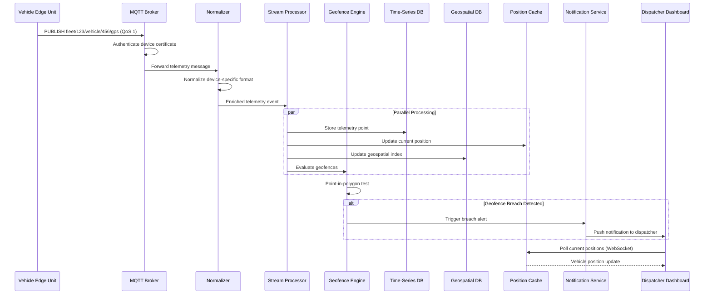

# High-Level Design — Fleet Management System

## 1. System Architecture

```mermaid
flowchart TB
    subgraph Vehicles["Vehicle Layer"]
        EDGE[Edge Compute Unit<br/>Telemetry Buffer · Local Geofence]
        OBD[OBD-II / CAN Bus<br/>Adapter]
        GPS[GPS/GNSS<br/>Receiver]
        SENS[Sensors<br/>Accelerometer · Temp · TPMS]
    end

    subgraph Gateway["Vehicle Gateway Layer"]
        MQTT[MQTT Broker Cluster<br/>TLS · Device Auth · QoS]
        NORM[Telemetry Normalizer<br/>Protocol Translation]
    end

    subgraph Ingestion["Stream Processing Layer"]
        INGEST[Ingestion Pipeline<br/>Enrichment · Dedup · Validation]
        GEOFENCE[Geofence Evaluation<br/>Engine]
        CEP[Complex Event<br/>Processing]
    end

    subgraph CoreServices["Core Services"]
        direction TB
        subgraph TrackingDomain["Tracking Domain"]
            TRACK[Vehicle Tracking<br/>Service]
            LOC[Location Query<br/>Service]
            HIST[Trip History<br/>Service]
        end
        subgraph RouteDomain["Route & Dispatch Domain"]
            ROUTE[Route Optimization<br/>Engine]
            DISPATCH[Dispatch<br/>Service]
            ETA[ETA Prediction<br/>Service]
        end
        subgraph FleetDomain["Fleet Operations Domain"]
            DRIVER[Driver Management<br/>Service]
            MAINT[Maintenance<br/>Service]
            FUEL[Fuel Management<br/>Service]
        end
        subgraph ComplianceDomain["Compliance Domain"]
            ELD[ELD / HOS<br/>Service]
            IFTA[IFTA Reporting<br/>Service]
            DVIR[DVIR / Inspection<br/>Service]
        end
    end

    subgraph Intelligence["AI/ML Layer"]
        PRED[Predictive Maintenance<br/>Engine]
        BEHAV[Driver Behavior<br/>Scoring]
        DEMAND[Demand Forecasting<br/>Engine]
    end

    subgraph Data["Data Layer"]
        TSDB[(Time-Series DB<br/>Telemetry Store)]
        GEODB[(Geospatial DB<br/>Location Index)]
        RELDB[(Relational DB<br/>Fleet · Driver · Job)]
        CACHE[(Distributed Cache<br/>Current Positions)]
        LAKE[(Data Lake<br/>Historical Analytics)]
    end

    subgraph Infra["Infrastructure"]
        STREAM[Event Streaming<br/>Platform]
        NOTIFY[Notification<br/>Service]
        SCHED[Job Scheduler]
    end

    subgraph Clients["Client Layer"]
        WEB[Dispatcher<br/>Dashboard]
        MOB[Driver Mobile<br/>App]
        CUST[Customer<br/>Tracking Portal]
        API[Partner<br/>API]
    end

    GPS & OBD & SENS --> EDGE
    EDGE --> MQTT
    MQTT --> NORM --> INGEST
    INGEST --> GEOFENCE & CEP
    INGEST --> STREAM
    STREAM --> TRACK & ELD & FUEL & PRED & BEHAV
    GEOFENCE --> NOTIFY
    CEP --> NOTIFY
    TRACK --> CACHE & TSDB & GEODB
    LOC --> CACHE & GEODB
    ROUTE --> GEODB
    DISPATCH --> ROUTE & DRIVER & LOC
    ETA --> TRACK & ROUTE
    ELD --> RELDB
    MAINT --> PRED & RELDB
    DRIVER --> BEHAV & RELDB
    SCHED --> ROUTE & IFTA & MAINT
    HIST --> TSDB & LAKE

    WEB & MOB & CUST & API --> LOC & DISPATCH & ELD & HIST

    classDef vehicle fill:#e1f5fe,stroke:#01579b,stroke-width:2px
    classDef gateway fill:#fff3e0,stroke:#e65100,stroke-width:2px
    classDef stream fill:#e0f7fa,stroke:#00695c,stroke-width:2px
    classDef service fill:#e8f5e9,stroke:#2e7d32,stroke-width:2px
    classDef ai fill:#fce4ec,stroke:#b71c1c,stroke-width:2px
    classDef data fill:#f3e5f5,stroke:#6a1b9a,stroke-width:2px
    classDef cache fill:#fffde7,stroke:#f57f17,stroke-width:2px
    classDef infra fill:#e0f7fa,stroke:#00695c,stroke-width:2px
    classDef client fill:#e1f5fe,stroke:#01579b,stroke-width:2px

    class EDGE,OBD,GPS,SENS vehicle
    class MQTT,NORM gateway
    class INGEST,GEOFENCE,CEP stream
    class TRACK,LOC,HIST,ROUTE,DISPATCH,ETA,DRIVER,MAINT,FUEL,ELD,IFTA,DVIR service
    class PRED,BEHAV,DEMAND ai
    class TSDB,GEODB,RELDB,LAKE data
    class CACHE cache
    class STREAM,NOTIFY,SCHED infra
    class WEB,MOB,CUST,API client
```



---

## 2. Architectural Layers

### 2.1 Vehicle and Edge Layer

The vehicle layer represents the physical fleet—each vehicle equipped with a telematics unit that aggregates data from multiple onboard sources.

**Edge Compute Unit** handles:
- GPS/GNSS position acquisition from multi-constellation receivers
- OBD-II/CAN bus data collection via standardized diagnostic ports
- Sensor fusion: combining GPS, accelerometer, and engine data into coherent events
- Local telemetry buffering during connectivity loss (store-and-forward)
- On-device geofence evaluation for latency-critical zones
- Data compression and batching to minimize cellular bandwidth usage
- Local HOS timer enforcement for ELD compliance during offline periods

**Adaptive Telemetry Strategy:**
```
Vehicle State → Reporting Interval:
  Engine OFF, stationary     → Every 300 seconds (heartbeat)
  Engine ON, stationary      → Every 60 seconds (idle monitoring)
  Engine ON, moving < 30mph  → Every 15 seconds (urban driving)
  Engine ON, moving > 30mph  → Every 5 seconds (highway driving)
  Harsh event detected       → Immediate burst (100Hz for 5 seconds)
  Entering geofence zone     → Every 2 seconds (precision tracking)
```

### 2.2 Vehicle Gateway Layer

The MQTT broker cluster serves as the single entry point for all vehicle telemetry, handling hundreds of thousands of concurrent device connections.

**MQTT Broker Cluster** handles:
- Device authentication via X.509 client certificates
- TLS 1.3 encryption for all vehicle-to-cloud communication
- QoS level management (QoS 0 for GPS, QoS 1 for telemetry, QoS 2 for compliance events)
- Topic-based routing: `fleet/{fleet_id}/vehicle/{vehicle_id}/{data_type}`
- Connection state tracking (Last Will and Testament for disconnect detection)
- Horizontal scaling via topic-based partitioning across broker nodes
- Protocol translation for legacy devices (CoAP, HTTP polling, proprietary protocols)

**Telemetry Normalizer** handles:
- Manufacturer-specific protocol translation (100+ device types)
- Data format normalization to canonical telemetry schema
- Unit conversion (metric ↔ imperial, coordinate format standardization)
- Basic validation (range checks, timestamp sanity, GPS coordinate bounds)

### 2.3 Stream Processing Layer

The stream processing layer operates on the continuous flow of telemetry events, performing real-time enrichment, geofence evaluation, and complex event detection.

**Ingestion Pipeline:**
- Deduplication using device-provided sequence numbers
- Timestamp reconciliation (device time vs. server time, handling clock drift)
- Telemetry enrichment: reverse geocoding, speed limit lookup, weather overlay
- Data quality scoring and outlier filtering (GPS jump detection)
- Fan-out to downstream consumers via event streaming platform

**Geofence Evaluation Engine:**
- Loads relevant geofences via geospatial index lookup (R-tree/S2)
- Performs point-in-polygon tests for candidate geofences
- Maintains per-vehicle geofence state (inside/outside) for entry/exit detection
- Generates geofence events: ENTER, EXIT, DWELL_EXCEEDED, SPEED_VIOLATION

**Complex Event Processing (CEP):**
- Multi-event pattern detection across time windows
- Examples: "3 harsh braking events within 5 minutes" → fatigue alert
- "Vehicle stationary > 15 minutes with engine running" → excessive idle alert
- "Fuel level drop > 10% without corresponding distance" → fuel theft alert

### 2.4 Core Services Layer

Services are organized by bounded contexts following domain-driven design:

| Domain | Services | Responsibility |
|---|---|---|
| **Tracking** | Vehicle Tracking, Location Query, Trip History | Real-time position, spatial queries, historical routes |
| **Route & Dispatch** | Route Optimizer, Dispatch, ETA Prediction | Routing algorithms, job assignment, arrival prediction |
| **Fleet Operations** | Driver Management, Maintenance, Fuel | Driver profiles, vehicle health, fuel analytics |
| **Compliance** | ELD/HOS, IFTA, DVIR | Regulatory compliance recording and reporting |

Each service:
- Owns its data store (database-per-service pattern)
- Communicates via events for cross-domain workflows
- Exposes gRPC for inter-service communication and REST for external APIs
- Maintains independent deployment and horizontal scaling

### 2.5 AI/ML Intelligence Layer

**Predictive Maintenance Engine:**
- Consumes engine telemetry streams (RPM patterns, temperature trends, vibration signatures)
- ML models trained on historical failure data to predict component failures 2–4 weeks ahead
- Outputs maintenance recommendations with confidence scores and urgency levels

**Driver Behavior Scoring:**
- Processes accelerometer events, speed data, and driving patterns
- Calculates composite safety scores across dimensions: speed compliance, harsh events, cornering, idle time
- Feeds coaching recommendations to driver mobile app

**Demand Forecasting:**
- Predicts delivery/service demand by geography and time period
- Informs fleet positioning and driver scheduling decisions
- Integrates weather, events, and seasonal patterns

---

## 3. Core Data Flows

### 3.1 Real-Time Telemetry Ingestion Flow



### 3.2 Route Optimization Flow

```mermaid
sequenceDiagram
    participant D as Dispatcher
    participant API as API Gateway
    participant RS as Route Service
    participant OPT as Optimization Engine
    participant GD as Geospatial DB
    participant TF as Traffic Feed
    participant WX as Weather Service
    participant DIS as Dispatch Service
    participant DR as Driver App

    D->>API: POST /routes/optimize (jobs, vehicles, constraints)
    API->>RS: Forward optimization request

    RS->>GD: Fetch road network distances (origin-dest matrix)
    RS->>TF: Fetch current/predicted traffic
    RS->>WX: Fetch weather conditions

    RS->>OPT: Solve VRPTW instance
    OPT->>OPT: Build distance/time matrix
    OPT->>OPT: Run metaheuristic solver
    OPT->>OPT: Apply constraint validation

    loop Iterative Improvement (time-boxed)
        OPT->>OPT: Generate neighbor solution
        OPT->>OPT: Evaluate objective function
        OPT->>OPT: Accept/reject per cooling schedule
    end

    OPT-->>RS: Optimized route plan
    RS-->>API: Route assignments per vehicle
    API-->>D: Route plan with KPIs

    D->>DIS: Approve and dispatch routes
    DIS->>DR: Push route to driver app (per vehicle)
    DR-->>DIS: Acknowledge route receipt
```

### 3.3 ELD/HOS Compliance Flow

```
1. Vehicle engine starts → Edge unit detects engine-on via OBD-II
2. ELD service receives ENGINE_ON event
3. Driver authenticates on mobile app / in-cab display
4. Duty status automatically transitions to "Driving" when vehicle speed > 5 mph
5. HOS timer starts counting against:
   a. 11-hour driving limit
   b. 14-hour on-duty window
   c. 60/70-hour weekly limit
6. At 30-minute break requirement threshold → alert driver
7. Driver stops vehicle → status transitions to "On-Duty Not Driving"
8. Driver manually selects "Off Duty" or "Sleeper Berth"
9. All status changes recorded with:
   - Timestamp (synchronized to GPS time)
   - Vehicle location (lat/lon + address)
   - Engine hours and odometer reading
   - Annotation/comment (optional)
10. Records synced to cloud in real-time (QoS 2)
11. During connectivity loss → buffered on edge, synced on reconnect
12. Roadside inspection → data transferred via Bluetooth/web service
```

---

## 4. Key Architectural Decisions

### 4.1 MQTT for Vehicle-to-Cloud Communication

| Decision | MQTT as primary vehicle communication protocol |
|---|---|
| **Context** | Need reliable, low-bandwidth communication with hundreds of thousands of intermittently connected vehicles |
| **Decision** | MQTT with QoS levels: QoS 0 for high-frequency GPS, QoS 1 for standard telemetry, QoS 2 for compliance events |
| **Rationale** | MQTT is designed for constrained IoT environments: small packet overhead (2-byte header), built-in session persistence, Last Will and Testament for disconnect detection, and native support for pub/sub patterns |
| **Trade-off** | Less suitable for request-response patterns; requires separate channel for commands to vehicles |
| **Mitigation** | Use MQTT for telemetry ingestion (vehicle → cloud) and command dispatch (cloud → vehicle); REST/gRPC for all service-to-service and client-to-service communication |

### 4.2 Time-Series Database for Telemetry Storage

| Decision | Purpose-built time-series database for all telemetry data |
|---|---|
| **Context** | High-frequency insert workload (1M+ events/sec), time-range queries dominate, data naturally ages out |
| **Decision** | Time-series database with automated downsampling and tiered retention |
| **Rationale** | 10–100x better write throughput vs. relational DB for time-stamped append workloads; built-in retention policies, continuous aggregation, and compression reduce storage costs by 90%+ |
| **Trade-off** | Limited join capabilities; not suitable for transactional fleet/driver data |
| **Mitigation** | Use relational DB for fleet/driver/job entities; join fleet context at query time or via enrichment at ingestion |

### 4.3 Geohash-Based Partitioning for Location Data

| Decision | Partition location data by geohash prefix for spatial locality |
|---|---|
| **Context** | Location queries are inherently spatial: "vehicles near point X" or "vehicles within polygon P" |
| **Decision** | Geohash-based partitioning (precision level 4-5) to co-locate spatially proximate vehicles |
| **Rationale** | Spatial queries hit fewer partitions; range scans on geohash prefixes efficiently cover geographic areas; natural load distribution for geographically dispersed fleets |
| **Trade-off** | Geohash edge effects at tile boundaries; uneven partition sizes for fleets concentrated in specific regions |
| **Mitigation** | Query adjacent geohash tiles for boundary cases; dynamic partition splitting for hotspot regions (e.g., major metropolitan areas) |

### 4.4 Edge-First Architecture for Compliance

| Decision | ELD/HOS compliance logic runs on vehicle edge unit, synced to cloud |
|---|---|
| **Context** | FMCSA mandates continuous, tamper-resistant recording of driving time regardless of connectivity |
| **Decision** | Edge unit maintains authoritative HOS state; cloud is a replica for fleet visibility and reporting |
| **Rationale** | Connectivity gaps cannot cause compliance violations; edge unit enforces HOS rules locally; roadside inspections can access data directly from device |
| **Trade-off** | Dual-state management (edge + cloud); conflict resolution for manual edits; device tamper protection |
| **Mitigation** | Event-sourced sync protocol with vector clocks; cryptographic signing of all records on device; cloud validates and flags discrepancies |

### 4.5 Metaheuristic Route Optimization Over Exact Solvers

| Decision | Use metaheuristic algorithms (simulated annealing, genetic algorithms) for route optimization |
|---|---|
| **Context** | VRPTW is NP-hard; exact solvers cannot handle 50+ stops in acceptable time |
| **Decision** | Metaheuristic solver with configurable time budget (5s–60s); provide best-found solution at timeout |
| **Rationale** | Metaheuristics find solutions within 2–5% of optimal in seconds; exact methods may take hours for the same problem size |
| **Trade-off** | No guarantee of optimality; solution quality varies between runs; harder to explain results |
| **Mitigation** | Run multiple solver strategies in parallel, return best; cache and reuse good solutions as starting points; provide solution quality score relative to lower bound |

---

## 5. Inter-Service Communication

### 5.1 Communication Patterns

| Pattern | Usage | Example |
|---|---|---|
| **MQTT pub/sub** | Vehicle-to-cloud telemetry streaming | GPS updates, engine diagnostics, driver events |
| **Event streaming** | Cross-service async state propagation | TelemetryReceived → geofence eval, tracking update, analytics |
| **gRPC (sync)** | Low-latency inter-service calls | Location query for dispatch, ETA calculation |
| **REST (sync)** | External APIs and client-facing endpoints | Fleet dashboard, partner integrations, driver mobile app |
| **WebSocket** | Real-time push to client displays | Live map updates, alert notifications |

### 5.2 Key Event Flows

```
Telemetry Events (high volume):
  VehiclePositionUpdated    → Tracking, Geofence, Cache, Time-Series Store
  EngineDataReceived        → Maintenance Predictor, Fuel Calculator
  HarshEventDetected        → Driver Scoring, Alert Service, Trip History

Business Events (medium volume):
  GeofenceBreached          → Alert Service, Trip History, Compliance
  JobAssigned               → Driver App, Route Service, ETA Service
  JobCompleted              → Billing, Analytics, Customer Notification
  RouteDeviated             → Dispatch Dashboard, Re-optimization Trigger

Compliance Events (critical, exactly-once):
  DutyStatusChanged         → ELD Service, HOS Calculator, Fleet Dashboard
  DVIRSubmitted             → Maintenance Service, Compliance Archive
  HOSViolationDetected      → Alert Service, Compliance Dashboard, Driver App
```

---

## 6. Deployment Topology

### 6.1 Multi-Region Active-Active

```
Region A (US-East)                     Region B (US-West)
┌────────────────────────────┐        ┌────────────────────────────┐
│ MQTT Broker Cluster        │◄──────►│ MQTT Broker Cluster        │
│ Stream Processing Cluster  │        │ Stream Processing Cluster  │
│ Core Services Pods         │        │ Core Services Pods         │
│ Time-Series DB (Primary)   │──sync─►│ Time-Series DB (Replica)   │
│ Geospatial DB (Primary)    │──sync─►│ Geospatial DB (Replica)    │
│ Relational DB (Leader)     │──sync─►│ Relational DB (Follower)   │
│ Route Optimization Workers │        │ Route Optimization Workers │
│ ML Model Serving           │        │ ML Model Serving           │
└────────────────────────────┘        └────────────────────────────┘
           │                                     │
           ▼                                     ▼
    Vehicle Assignment:                   Vehicle Assignment:
    Vehicles east of Mississippi     Vehicles west of Mississippi
    connect to Region A              connect to Region B

Global Services:
  - DNS-based geo-routing for vehicle MQTT connections
  - CDN for static map tiles and driver app assets
  - Cross-region event replication for fleet-wide views
```

### 6.2 Edge Deployment

```
Per-Vehicle Edge Unit:
┌──────────────────────────────────────┐
│  GPS/GNSS Receiver                   │
│  OBD-II / CAN Bus Interface         │
│  Sensor Hub (accel, temp, TPMS)     │
│  ┌──────────────────────────────┐   │
│  │  Edge Runtime                 │   │
│  │  ├── Telemetry Collector     │   │
│  │  ├── Local Geofence Engine   │   │
│  │  ├── HOS State Machine       │   │
│  │  ├── Store-and-Forward Buffer│   │
│  │  │   (encrypted, 72hr buffer)│   │
│  │  ├── Data Compressor         │   │
│  │  └── OTA Update Manager      │   │
│  └──────────────────────────────┘   │
│  Cellular Modem (4G/5G + fallback)  │
│  Secure Element (certificate store) │
└──────────────────────────────────────┘
```

---

*Next: [Low-Level Design →](./03-low-level-design.md)*
