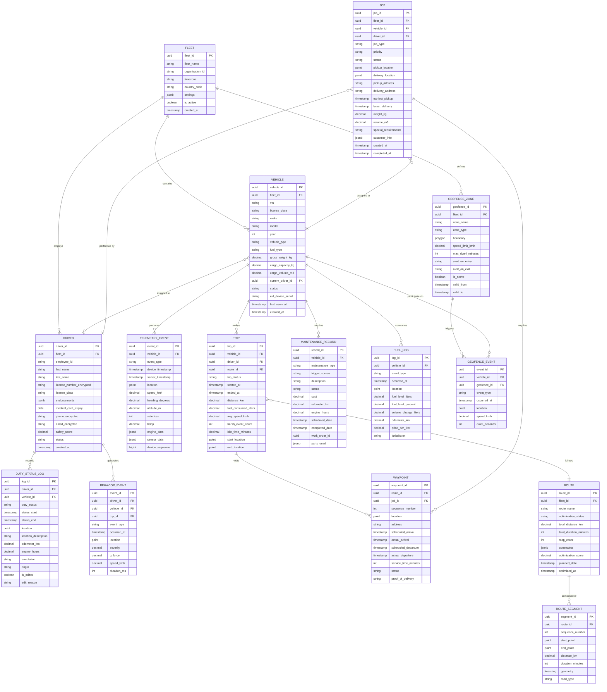

# Low-Level Design — Fleet Management System

## 1. Data Model

### 1.1 Core Entity Relationship Diagram



### 1.2 Time-Series Telemetry Schema

The telemetry data is stored in a purpose-built time-series database optimized for high-frequency writes and time-range queries.

**GPS Position Series:**
```
Table: vehicle_positions
  Partition key: vehicle_id
  Sort key: timestamp
  Fields:
    vehicle_id:     UUID
    timestamp:      TIMESTAMP (microsecond precision)
    latitude:       DOUBLE
    longitude:      DOUBLE
    altitude_m:     FLOAT
    speed_kmh:      FLOAT
    heading_deg:    FLOAT
    accuracy_m:     FLOAT
    satellites:     SMALLINT
    hdop:           FLOAT
    source:         ENUM (GPS, GLONASS, GALILEO, DEAD_RECKONING)
    geohash:        STRING(12)

  Retention policies:
    Raw data: 90 days
    1-minute aggregation: 1 year
    5-minute aggregation: 3 years
    15-minute aggregation: 7 years (compliance)

  Continuous aggregation (1-minute):
    avg_speed, max_speed, distance_traveled,
    start_location, end_location, sample_count
```

**Engine Diagnostics Series:**
```
Table: engine_telemetry
  Partition key: vehicle_id
  Sort key: timestamp
  Fields:
    vehicle_id:         UUID
    timestamp:          TIMESTAMP
    rpm:                INT
    coolant_temp_c:     FLOAT
    oil_pressure_kpa:   FLOAT
    fuel_level_pct:     FLOAT
    battery_voltage:    FLOAT
    throttle_pct:       FLOAT
    engine_load_pct:    FLOAT
    intake_temp_c:      FLOAT
    exhaust_temp_c:     FLOAT
    turbo_boost_kpa:    FLOAT
    dtc_codes:          STRING[]
    odometer_km:        DOUBLE
    engine_hours:       DOUBLE

  Retention: Same tiered policy as positions
```

### 1.3 Geospatial Index Structure

```
Current Vehicle Positions (hot cache):
  Data structure: In-memory geospatial index (R-tree or S2 cell index)
  Key: vehicle_id
  Value: {lat, lon, speed, heading, timestamp, fleet_id, driver_id, status}
  Update frequency: Every GPS update (5-60 second intervals)
  Eviction: Vehicles not seen for > 24 hours moved to cold storage

Geofence Index:
  Data structure: R-tree spatial index on geofence bounding boxes
  Entries: Geofence ID → polygon boundary + metadata
  Operations:
    - Range query: Find all geofences whose bounding box intersects with a point
    - Containment: Point-in-polygon test for candidate geofences
  Update frequency: On geofence create/modify/delete (low frequency)

Geohash Grid Index:
  Purpose: Partition-level routing and nearest-vehicle queries
  Precision: Level 5 (~4.9km × 4.9km cells)
  Structure: geohash_prefix → list of vehicle IDs in cell
  Operations:
    - Nearest vehicle: Expand from center cell outward until k vehicles found
    - Area query: Collect all cells overlapping query polygon
```

---

## 2. API Design

### 2.1 Vehicle Tracking APIs

```
GET    /v1/vehicles/{vehicle_id}/position          # Current position
GET    /v1/vehicles/{vehicle_id}/trail              # Historical breadcrumb trail
GET    /v1/fleets/{fleet_id}/vehicles/positions     # All vehicle positions in fleet
GET    /v1/vehicles/nearby                          # Nearest vehicles to a point
POST   /v1/vehicles/{vehicle_id}/command            # Send command to vehicle
```

**Example: Get Current Position Response**
```
GET /v1/vehicles/{vehicle_id}/position

Response 200:
{
  "vehicle_id": "veh-uuid",
  "position": {
    "latitude": 40.7128,
    "longitude": -74.0060,
    "altitude_m": 15.2,
    "accuracy_m": 2.5,
    "heading_deg": 245.0,
    "speed_kmh": 55.3
  },
  "timestamp": "2026-03-09T14:30:02.453Z",
  "age_seconds": 1.8,
  "address": "123 Broadway, New York, NY 10006",
  "geofences": [
    {"geofence_id": "geo-uuid", "name": "Manhattan Zone", "entered_at": "2026-03-09T13:45:00Z"}
  ],
  "driver": {
    "driver_id": "drv-uuid",
    "name": "J. Smith",
    "duty_status": "DRIVING"
  },
  "trip": {
    "trip_id": "trip-uuid",
    "next_stop": "456 5th Ave, New York, NY",
    "eta_minutes": 12
  }
}
```

**Example: Nearby Vehicle Query**
```
GET /v1/vehicles/nearby?lat=40.7128&lon=-74.0060&radius_km=5&limit=10&status=available

Response 200:
{
  "vehicles": [
    {
      "vehicle_id": "veh-uuid-1",
      "distance_km": 0.8,
      "position": {"latitude": 40.7180, "longitude": -74.0010},
      "speed_kmh": 0,
      "driver": {"name": "A. Johnson", "duty_status": "ON_DUTY"},
      "vehicle_type": "VAN",
      "cargo_available_kg": 800
    }
  ],
  "total_found": 1,
  "search_radius_km": 5
}
```

### 2.2 Route Optimization APIs

```
POST   /v1/routes/optimize                          # Submit optimization request
GET    /v1/routes/{route_id}                        # Get route details
GET    /v1/routes/{route_id}/status                 # Optimization progress
PATCH  /v1/routes/{route_id}                        # Modify route (resequence, add/remove stops)
POST   /v1/routes/{route_id}/dispatch               # Dispatch route to driver
```

**Example: Route Optimization Request**
```
POST /v1/routes/optimize

Request:
{
  "fleet_id": "fleet-uuid",
  "optimization_objective": "MINIMIZE_DISTANCE",
  "date": "2026-03-10",
  "vehicles": [
    {
      "vehicle_id": "veh-uuid-1",
      "start_location": {"lat": 40.7128, "lon": -74.0060},
      "end_location": {"lat": 40.7128, "lon": -74.0060},
      "capacity_kg": 1000,
      "capacity_m3": 8.0,
      "shift_start": "08:00",
      "shift_end": "18:00",
      "break_required": {"after_minutes": 240, "duration_minutes": 30}
    }
  ],
  "jobs": [
    {
      "job_id": "job-uuid-1",
      "location": {"lat": 40.7580, "lon": -73.9855},
      "address": "Times Square, New York",
      "time_window": {"earliest": "09:00", "latest": "12:00"},
      "service_time_minutes": 15,
      "weight_kg": 50,
      "volume_m3": 0.5,
      "priority": "HIGH"
    }
  ],
  "settings": {
    "max_solve_time_seconds": 30,
    "traffic_model": "PREDICTIVE",
    "avoid_tolls": false
  }
}

Response 202:
{
  "route_id": "route-uuid",
  "status": "OPTIMIZING",
  "estimated_completion_seconds": 15,
  "poll_url": "/v1/routes/route-uuid/status"
}
```

### 2.3 Geofence APIs

```
POST   /v1/geofences                               # Create geofence
GET    /v1/geofences/{geofence_id}                 # Get geofence details
PUT    /v1/geofences/{geofence_id}                 # Update geofence
DELETE /v1/geofences/{geofence_id}                 # Delete geofence
GET    /v1/fleets/{fleet_id}/geofences             # List fleet geofences
GET    /v1/geofences/{geofence_id}/vehicles        # Vehicles currently inside
GET    /v1/geofences/{geofence_id}/events          # Entry/exit event history
```

**Example: Create Geofence**
```
POST /v1/geofences

Request:
{
  "fleet_id": "fleet-uuid",
  "name": "Downtown Depot",
  "type": "DEPOT",
  "boundary": {
    "type": "Polygon",
    "coordinates": [[
      [-74.0060, 40.7128],
      [-74.0050, 40.7128],
      [-74.0050, 40.7140],
      [-74.0060, 40.7140],
      [-74.0060, 40.7128]
    ]]
  },
  "rules": {
    "alert_on_entry": true,
    "alert_on_exit": true,
    "max_dwell_minutes": 120,
    "speed_limit_kmh": 15,
    "active_hours": {"start": "06:00", "end": "22:00"}
  }
}
```

### 2.4 ELD/HOS APIs

```
GET    /v1/drivers/{driver_id}/hos                  # Current HOS status
GET    /v1/drivers/{driver_id}/logs                 # Duty status logs (RODS)
POST   /v1/drivers/{driver_id}/duty-status          # Manual duty status change
GET    /v1/drivers/{driver_id}/hos/violations       # HOS violation history
POST   /v1/drivers/{driver_id}/logs/export          # Export for DOT inspection
GET    /v1/fleets/{fleet_id}/hos/summary            # Fleet HOS overview
```

**Example: Current HOS Status Response**
```
GET /v1/drivers/{driver_id}/hos

Response 200:
{
  "driver_id": "drv-uuid",
  "current_status": "DRIVING",
  "status_since": "2026-03-09T13:00:00Z",
  "vehicle_id": "veh-uuid",
  "cycle_type": "US_70_HOUR_8_DAY",
  "clocks": {
    "driving_remaining_minutes": 382,
    "on_duty_window_remaining_minutes": 512,
    "cycle_remaining_minutes": 2840,
    "break_required_in_minutes": 142
  },
  "violations": [],
  "today_summary": {
    "driving_minutes": 278,
    "on_duty_minutes": 348,
    "off_duty_minutes": 172,
    "sleeper_berth_minutes": 0
  }
}
```

### 2.5 Telemetry Ingestion Protocol (MQTT)

```
Topic Structure:
  fleet/{fleet_id}/vehicle/{vehicle_id}/gps         # GPS position updates
  fleet/{fleet_id}/vehicle/{vehicle_id}/engine       # Engine diagnostics
  fleet/{fleet_id}/vehicle/{vehicle_id}/events       # Discrete events (harsh brake, etc.)
  fleet/{fleet_id}/vehicle/{vehicle_id}/eld          # ELD/compliance events
  fleet/{fleet_id}/vehicle/{vehicle_id}/status       # Device status/health

  cloud/vehicle/{vehicle_id}/commands                # Cloud-to-vehicle commands
  cloud/vehicle/{vehicle_id}/config                  # Configuration updates
  cloud/vehicle/{vehicle_id}/ota                     # OTA firmware updates

QoS Levels:
  GPS position:     QoS 0 (at most once — acceptable to lose occasional updates)
  Engine telemetry:  QoS 1 (at least once — dedup at ingestion layer)
  ELD events:       QoS 2 (exactly once — compliance-critical)
  Commands:         QoS 1 (at least once — idempotent command handling)

Message Format (GPS):
{
  "seq": 485721,
  "ts": 1741527002453,
  "lat": 40.712800,
  "lon": -74.006000,
  "alt": 15.2,
  "spd": 55.3,
  "hdg": 245.0,
  "sat": 12,
  "hdop": 0.8,
  "src": "GPS"
}
```

---

## 3. Core Algorithms

### 3.1 Vehicle Routing Problem with Time Windows (VRPTW)

```
ALGORITHM SolveVRPTW(vehicles, jobs, constraints, time_budget):
    // VRPTW is NP-hard — use metaheuristic approach

    // Step 1: Build distance/time matrix
    n = LENGTH(jobs) + LENGTH(vehicles) * 2  // jobs + depot departures/returns
    distance_matrix = COMPUTE_DISTANCE_MATRIX(all_locations, traffic_model)
    time_matrix = COMPUTE_TIME_MATRIX(all_locations, traffic_model)

    // Step 2: Generate initial feasible solution using insertion heuristic
    solution = CONSTRUCT_INITIAL_SOLUTION(vehicles, jobs, distance_matrix, time_matrix)

    FUNCTION CONSTRUCT_INITIAL_SOLUTION(vehicles, jobs, dist, time):
        unassigned = COPY(jobs)
        routes = {v.id: [v.start_depot] FOR v IN vehicles}

        // Sort jobs by urgency (tightest time window first)
        SORT unassigned BY (latest_delivery - earliest_pickup) ASC

        FOR EACH job IN unassigned:
            best_vehicle = NULL
            best_position = NULL
            best_cost = INFINITY

            FOR EACH vehicle IN vehicles:
                FOR EACH position IN VALID_POSITIONS(routes[vehicle.id]):
                    cost = INSERTION_COST(routes[vehicle.id], position, job, dist, time)
                    IF cost < best_cost AND IS_FEASIBLE(routes[vehicle.id], position, job, constraints):
                        best_vehicle = vehicle
                        best_position = position
                        best_cost = cost

            IF best_vehicle IS NOT NULL:
                INSERT(routes[best_vehicle.id], best_position, job)
            ELSE:
                ADD_TO_UNSERVICED(job)  // No feasible insertion found

        RETURN Solution(routes, unassigned)

    // Step 3: Improve via simulated annealing
    best_solution = solution
    current = solution
    temperature = INITIAL_TEMPERATURE
    start_time = NOW()

    WHILE (NOW() - start_time) < time_budget:
        // Generate neighbor via random perturbation
        neighbor = GENERATE_NEIGHBOR(current)

        delta = EVALUATE(neighbor) - EVALUATE(current)

        IF delta < 0:  // Better solution
            current = neighbor
            IF EVALUATE(neighbor) < EVALUATE(best_solution):
                best_solution = neighbor
        ELSE:
            // Accept worse solution with probability e^(-delta/temperature)
            IF RANDOM() < EXP(-delta / temperature):
                current = neighbor

        temperature = temperature * COOLING_RATE

    RETURN best_solution

    FUNCTION GENERATE_NEIGHBOR(solution):
        // Apply random move operator
        operator = RANDOM_CHOICE([
            RELOCATE_SINGLE,    // Move one job to different position/vehicle
            RELOCATE_BLOCK,     // Move consecutive jobs block
            SWAP_WITHIN,        // Swap two jobs within same route
            SWAP_BETWEEN,       // Swap jobs between different routes
            OR_OPT,             // Remove and reinsert segment
            TWO_OPT_STAR        // Exchange route tails between vehicles
        ])
        RETURN APPLY_OPERATOR(operator, solution)

    FUNCTION IS_FEASIBLE(route, position, job, constraints):
        // Check all constraints
        VALIDATE job.weight_kg fits in remaining vehicle capacity
        VALIDATE arrival_at_position within job.time_window
        VALIDATE total_route_duration within driver.shift_duration
        VALIDATE driver has required certifications for job
        VALIDATE no HOS violations would result
        RETURN all validations pass

    FUNCTION EVALUATE(solution):
        // Multi-objective evaluation
        total_distance = SUM(route_distance FOR route IN solution.routes)
        time_window_violations = COUNT_TW_VIOLATIONS(solution)
        unserviced_penalty = LENGTH(solution.unassigned) * LARGE_PENALTY
        balance_penalty = STDDEV(route_durations) * BALANCE_WEIGHT

        RETURN total_distance + time_window_violations * TW_PENALTY
               + unserviced_penalty + balance_penalty
```

### 3.2 Geofence Point-in-Polygon Evaluation

```
ALGORITHM EvaluateGeofences(vehicle_id, position):
    // Step 1: Find candidate geofences using spatial index
    geohash = COMPUTE_GEOHASH(position.lat, position.lon, precision=6)
    bounding_box = EXPAND_POINT(position, buffer=100m)
    candidates = SPATIAL_INDEX.Query(bounding_box)

    // Step 2: Get vehicle's current geofence state
    current_state = GEOFENCE_STATE_CACHE.Get(vehicle_id)
    // current_state: {geofence_id → {inside: bool, entered_at: timestamp}}

    events = []

    // Step 3: Test each candidate geofence
    FOR EACH geofence IN candidates:
        IF NOT geofence.is_active:
            CONTINUE
        IF geofence.active_hours AND NOT IN_ACTIVE_HOURS(geofence, NOW()):
            CONTINUE

        is_inside = POINT_IN_POLYGON(position, geofence.boundary)
        was_inside = current_state.get(geofence.id, {inside: false}).inside

        IF is_inside AND NOT was_inside:
            // ENTRY event
            events.ADD(GeofenceEvent(
                type = "ENTER",
                vehicle_id = vehicle_id,
                geofence_id = geofence.id,
                location = position,
                timestamp = NOW()
            ))
            current_state[geofence.id] = {inside: true, entered_at: NOW()}

            IF geofence.speed_limit_kmh AND position.speed > geofence.speed_limit_kmh:
                events.ADD(GeofenceEvent(type="SPEED_VIOLATION", ...))

        ELSE IF NOT is_inside AND was_inside:
            // EXIT event
            dwell = NOW() - current_state[geofence.id].entered_at
            events.ADD(GeofenceEvent(
                type = "EXIT",
                vehicle_id = vehicle_id,
                geofence_id = geofence.id,
                dwell_seconds = dwell.total_seconds(),
                timestamp = NOW()
            ))
            DELETE current_state[geofence.id]

        ELSE IF is_inside AND was_inside:
            // Check dwell time threshold
            dwell = NOW() - current_state[geofence.id].entered_at
            IF geofence.max_dwell_minutes AND dwell > geofence.max_dwell_minutes * 60:
                IF NOT current_state[geofence.id].dwell_alerted:
                    events.ADD(GeofenceEvent(type="DWELL_EXCEEDED", ...))
                    current_state[geofence.id].dwell_alerted = true

            // Check speed within zone
            IF geofence.speed_limit_kmh AND position.speed > geofence.speed_limit_kmh:
                events.ADD(GeofenceEvent(type="SPEED_VIOLATION", ...))

    // Step 4: Check for geofences we were in but are no longer candidates
    // (vehicle moved far enough that geofence is no longer in bounding box)
    FOR EACH gf_id IN current_state.keys():
        IF gf_id NOT IN candidates.ids():
            events.ADD(GeofenceEvent(type="EXIT", geofence_id=gf_id, ...))
            DELETE current_state[gf_id]

    // Step 5: Update state and publish events
    GEOFENCE_STATE_CACHE.Set(vehicle_id, current_state)
    FOR EACH event IN events:
        PUBLISH(event_stream, event)

    RETURN events


FUNCTION POINT_IN_POLYGON(point, polygon):
    // Ray casting algorithm — O(n) where n = number of polygon vertices
    x, y = point.lon, point.lat
    vertices = polygon.coordinates
    n = LENGTH(vertices)
    inside = false

    j = n - 1
    FOR i = 0 TO n - 1:
        xi, yi = vertices[i].lon, vertices[i].lat
        xj, yj = vertices[j].lon, vertices[j].lat

        IF ((yi > y) != (yj > y)) AND
           (x < (xj - xi) * (y - yi) / (yj - yi) + xi):
            inside = NOT inside

        j = i

    RETURN inside
```

### 3.3 ETA Prediction Algorithm

```
ALGORITHM PredictETA(vehicle_id, destination):
    // Step 1: Get current vehicle state
    vehicle = GET_CURRENT_POSITION(vehicle_id)
    remaining_stops = GET_REMAINING_STOPS(vehicle.active_route)

    // Step 2: Calculate remaining route segments
    total_remaining_time = 0
    current_position = vehicle.position

    FOR EACH stop IN remaining_stops:
        IF stop.location == destination:
            // This is our target — include travel time to here
            segment_time = ESTIMATE_TRAVEL_TIME(
                current_position,
                stop.location,
                departure_time = NOW() + total_remaining_time
            )
            total_remaining_time += segment_time
            BREAK

        // Travel to this stop
        segment_time = ESTIMATE_TRAVEL_TIME(
            current_position,
            stop.location,
            departure_time = NOW() + total_remaining_time
        )
        total_remaining_time += segment_time

        // Service time at this stop
        total_remaining_time += stop.service_time_minutes * 60

        current_position = stop.location

    // Step 3: Apply ML-based adjustment factor
    // Trained on historical actual vs. predicted times
    features = {
        day_of_week: TODAY.day_of_week,
        hour_of_day: NOW.hour,
        weather_condition: GET_WEATHER(vehicle.position),
        vehicle_type: vehicle.type,
        driver_id: vehicle.driver_id,
        route_complexity: LENGTH(remaining_stops),
        historical_accuracy: GET_DRIVER_PUNCTUALITY(vehicle.driver_id)
    }

    adjustment_factor = ML_MODEL.Predict(features)
    // Factor typically 0.85–1.25 (actual is 85%–125% of base estimate)

    adjusted_time = total_remaining_time * adjustment_factor

    // Step 4: Calculate confidence interval
    std_dev = HISTORICAL_STD_DEV(features)
    eta_low = NOW() + adjusted_time - 1.96 * std_dev
    eta_high = NOW() + adjusted_time + 1.96 * std_dev

    RETURN ETAPrediction(
        estimated_arrival = NOW() + adjusted_time,
        confidence_interval_95 = (eta_low, eta_high),
        remaining_distance_km = total_remaining_distance,
        remaining_stops = LENGTH(remaining_stops_to_dest)
    )


FUNCTION ESTIMATE_TRAVEL_TIME(origin, destination, departure_time):
    // Use road network with time-dependent edge weights
    base_time = ROAD_NETWORK.ShortestTime(origin, destination)

    // Apply time-of-day traffic factor
    traffic_factor = TRAFFIC_MODEL.GetFactor(
        origin, destination, departure_time
    )
    // Factor: 1.0 = free flow, 2.0 = heavy congestion

    RETURN base_time * traffic_factor
```

### 3.4 GPS Noise Filtering (Kalman Filter)

```
ALGORITHM FilterGPSPosition(raw_measurement, previous_state):
    // Extended Kalman Filter for GPS position smoothing
    // State vector: [latitude, longitude, speed, heading]

    // Step 1: Prediction step (based on previous state and motion model)
    dt = raw_measurement.timestamp - previous_state.timestamp

    predicted_lat = previous_state.lat +
        previous_state.speed * COS(previous_state.heading) * dt / EARTH_RADIUS
    predicted_lon = previous_state.lon +
        previous_state.speed * SIN(previous_state.heading) * dt /
        (EARTH_RADIUS * COS(previous_state.lat))
    predicted_speed = previous_state.speed  // Constant velocity model
    predicted_heading = previous_state.heading

    predicted_state = [predicted_lat, predicted_lon, predicted_speed, predicted_heading]

    // Step 2: Update prediction covariance
    P_predicted = F * previous_state.P * F_transpose + Q
    // Q = process noise (accounts for acceleration, turns)

    // Step 3: Compute Kalman gain
    measurement_noise_R = DIAGONAL_MATRIX(
        raw_measurement.accuracy_m / EARTH_RADIUS,  // lat noise
        raw_measurement.accuracy_m / EARTH_RADIUS,  // lon noise
        2.0,                                          // speed noise (m/s)
        5.0                                           // heading noise (degrees)
    )

    K = P_predicted * H_transpose * INVERSE(H * P_predicted * H_transpose + measurement_noise_R)

    // Step 4: Update state with measurement
    measurement = [raw_measurement.lat, raw_measurement.lon,
                   raw_measurement.speed, raw_measurement.heading]
    innovation = measurement - H * predicted_state

    updated_state = predicted_state + K * innovation
    updated_P = (I - K * H) * P_predicted

    // Step 5: Outlier detection (GPS jump)
    mahalanobis_distance = SQRT(innovation_transpose * INVERSE(S) * innovation)
    IF mahalanobis_distance > CHI_SQUARED_THRESHOLD_95:
        // Measurement is likely an outlier — use prediction only
        RETURN KalmanState(
            lat = predicted_state[0],
            lon = predicted_state[1],
            speed = predicted_state[2],
            heading = predicted_state[3],
            P = P_predicted,
            timestamp = raw_measurement.timestamp,
            quality = "PREDICTED"
        )

    RETURN KalmanState(
        lat = updated_state[0],
        lon = updated_state[1],
        speed = updated_state[2],
        heading = updated_state[3],
        P = updated_P,
        timestamp = raw_measurement.timestamp,
        quality = "FILTERED"
    )
```

### 3.5 Predictive Maintenance Algorithm

```
ALGORITHM PredictMaintenanceNeeds(vehicle_id):
    // Step 1: Collect feature windows from telemetry
    telemetry_30d = QUERY_TIMESERIES(
        vehicle_id,
        metrics = [rpm, coolant_temp, oil_pressure, battery_voltage,
                   fuel_consumption_rate, engine_load, vibration_rms],
        window = LAST_30_DAYS,
        aggregation = HOURLY_STATS  // mean, max, std, percentiles
    )

    // Step 2: Compute derived features
    features = {}

    // Engine health indicators
    features.avg_coolant_temp_trend = LINEAR_REGRESSION_SLOPE(
        telemetry_30d.coolant_temp.daily_avg)
    features.oil_pressure_decline = PERCENTAGE_CHANGE(
        telemetry_30d.oil_pressure.weekly_avg, first_week, last_week)
    features.battery_voltage_min = MIN(telemetry_30d.battery_voltage)
    features.rpm_variability = MEAN(telemetry_30d.rpm.hourly_std)

    // Usage patterns
    features.daily_engine_hours = MEAN(telemetry_30d.daily_engine_hours)
    features.harsh_event_frequency = COUNT(harsh_events_30d) / 30
    features.idle_percentage = telemetry_30d.idle_time / telemetry_30d.total_time

    // Vehicle context
    features.odometer_km = GET_CURRENT_ODOMETER(vehicle_id)
    features.km_since_last_service = features.odometer_km - GET_LAST_SERVICE_ODOMETER(vehicle_id)
    features.vehicle_age_years = VEHICLE_AGE(vehicle_id)
    features.vehicle_type = GET_VEHICLE_TYPE(vehicle_id)

    // Step 3: Run predictions for each component
    components = [ENGINE, TRANSMISSION, BRAKES, BATTERY, TIRES,
                  COOLANT_SYSTEM, EXHAUST, ALTERNATOR]

    predictions = []
    FOR EACH component IN components:
        model = LOAD_MODEL("maintenance_" + component)
        result = model.predict(features)

        predictions.ADD(MaintenancePrediction(
            component = component,
            failure_probability_30d = result.probability,
            estimated_remaining_life_km = result.remaining_km,
            estimated_remaining_days = result.remaining_days,
            confidence = result.confidence,
            contributing_factors = result.feature_importances[:5],
            recommended_action = CLASSIFY_ACTION(result.probability, component),
            urgency = CLASSIFY_URGENCY(result.probability, result.remaining_days)
        ))

    // Step 4: Generate maintenance schedule
    SORT predictions BY urgency DESC
    FOR EACH prediction IN predictions WHERE prediction.urgency IN ["CRITICAL", "HIGH"]:
        CREATE_WORK_ORDER(
            vehicle_id = vehicle_id,
            component = prediction.component,
            priority = prediction.urgency,
            scheduled_before = NOW() + prediction.estimated_remaining_days * 0.7,
            description = FORMAT_RECOMMENDATION(prediction)
        )

    RETURN predictions
```

---

## 4. Event Schema Design

### 4.1 Core Event Types

```
Event Hierarchy:

VehicleTelemetryEvent
  ├── PositionUpdated { lat, lon, speed, heading, altitude, accuracy, satellites }
  ├── EngineDataReceived { rpm, coolant_temp, fuel_level, oil_pressure, dtc_codes }
  ├── HarshEventDetected { event_type, g_force, speed, duration_ms }
  ├── FuelLevelChanged { previous_level, new_level, change_liters, event_type }
  └── DeviceHealthReport { battery_voltage, signal_strength, firmware_version }

TripEvent
  ├── TripStarted { vehicle_id, driver_id, start_location, start_odometer }
  ├── TripWaypointReached { waypoint_id, arrival_time, location }
  ├── TripRouteDeviated { expected_path, actual_location, deviation_meters }
  └── TripEnded { end_location, distance_km, duration_min, fuel_used }

GeofenceEvent
  ├── GeofenceEntered { vehicle_id, geofence_id, location, speed }
  ├── GeofenceExited { vehicle_id, geofence_id, dwell_seconds }
  ├── DwellTimeExceeded { vehicle_id, geofence_id, dwell_seconds, threshold }
  └── SpeedViolation { vehicle_id, geofence_id, speed, limit }

ComplianceEvent
  ├── DutyStatusChanged { driver_id, old_status, new_status, location, odometer }
  ├── HOSViolationDetected { driver_id, violation_type, details }
  ├── DVIRSubmitted { vehicle_id, driver_id, defects, condition }
  └── ELDMalfunctionDetected { vehicle_id, malfunction_type }

DispatchEvent
  ├── JobCreated { job_id, pickup, delivery, time_window, requirements }
  ├── JobAssigned { job_id, vehicle_id, driver_id, estimated_arrival }
  ├── JobStatusUpdated { job_id, status, location, timestamp }
  └── JobCompleted { job_id, proof_of_delivery, actual_times }

MaintenanceEvent
  ├── MaintenanceAlertRaised { vehicle_id, component, urgency, prediction }
  ├── WorkOrderCreated { work_order_id, vehicle_id, scheduled_date }
  └── MaintenanceCompleted { work_order_id, parts_used, cost }
```

### 4.2 Event Envelope

```
TelemetryEventEnvelope:
  event_id:          UUID
  event_type:        STRING
  vehicle_id:        UUID
  fleet_id:          UUID
  driver_id:         UUID (nullable)
  device_timestamp:  TIMESTAMP (from vehicle clock)
  server_timestamp:  TIMESTAMP (server receipt time)
  device_sequence:   BIGINT (monotonic per device)
  location:          POINT (lat, lon)
  payload:           BYTES
  metadata:          MAP<STRING, STRING>
  quality_score:     FLOAT (0.0-1.0, data quality assessment)
```

---

*Next: [Deep Dive & Bottlenecks →](./04-deep-dive-and-bottlenecks.md)*
