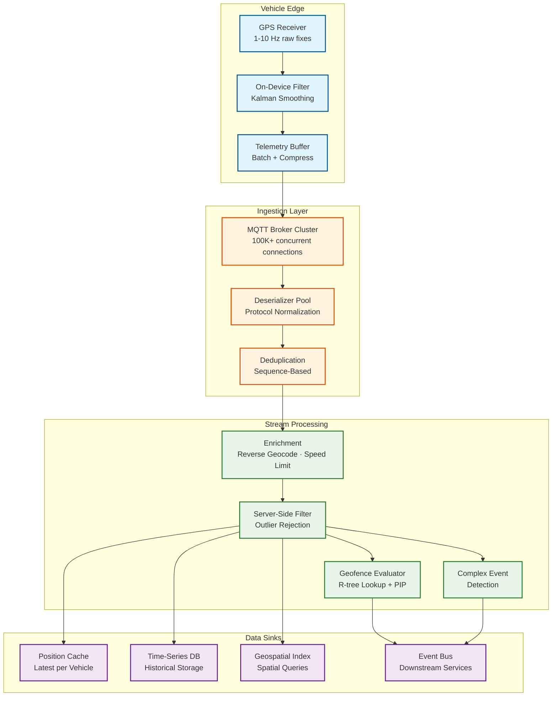
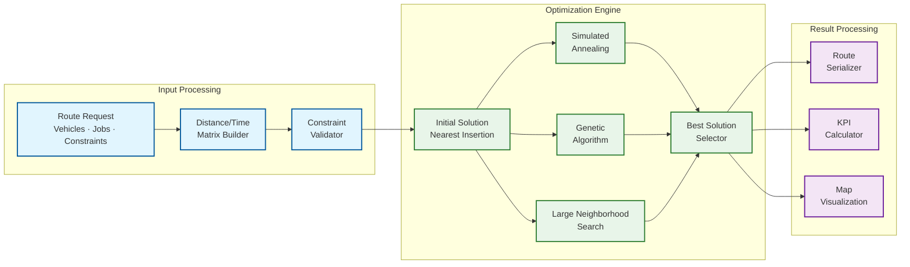

# Deep Dive & Bottlenecks — Fleet Management System

## 1. Deep Dive: Real-Time GPS Tracking at Scale

### 1.1 The GPS Data Pipeline

Processing 100,000+ GPS updates per second with sub-3-second end-to-end latency requires a carefully staged pipeline that balances throughput with processing depth.



### 1.2 Latency Budget Breakdown

Every GPS update must traverse the full pipeline within the 3-second latency target:

```
Component                          p50 Latency    p99 Latency
─────────────────────────────────────────────────────────────
Vehicle GPS fix → edge buffer      50ms            150ms
Edge batching + compression        100ms           500ms
Cellular network transit           200ms           800ms
MQTT broker receive + route        5ms             20ms
Deserialize + normalize            2ms             10ms
Deduplication check                1ms             5ms
Enrichment (reverse geocode)       10ms            50ms
Kalman filter                      1ms             3ms
Geofence evaluation                5ms             25ms
Cache update                       1ms             5ms
Time-series write                  5ms             30ms
─────────────────────────────────────────────────────────────
Total                              380ms           1,598ms
Budget remaining (3s target)       2,620ms         1,402ms
```

The cellular network transit is the dominant latency contributor and the least controllable. The architecture builds in 1.4+ seconds of headroom at p99 to absorb cellular variability.

### 1.3 MQTT Broker Scaling

The MQTT broker cluster must handle 500,000+ persistent connections, each publishing at 0.1–1 message per second:

**Connection Distribution:**
- Each broker node handles ~50,000 connections (memory-bound: ~2KB per connection)
- 10+ broker nodes for a 500K-vehicle fleet
- Topic-based partitioning: vehicles assigned to specific broker nodes based on `HASH(vehicle_id) MOD num_brokers`
- Session persistence enables clean reconnection without message loss

**Scaling Challenges:**
- Connection storms after network outages (50K+ vehicles reconnecting simultaneously)
- Mitigation: Exponential backoff with jitter built into vehicle firmware
- Connection draining during broker node maintenance (graceful handoff to other nodes)

### 1.4 GPS Data Quality Issues

| Issue | Cause | Impact | Mitigation |
|---|---|---|---|
| **Multipath errors** | Signal reflection off buildings | 10–50m position jumps | Kalman filter with acceleration model |
| **Cold start delay** | GPS receiver acquiring satellites | First fix up to 30 seconds | Use last known position + cell tower triangulation |
| **Tunnel/garage loss** | No satellite visibility | Gaps in tracking | Dead reckoning via IMU + odometer |
| **Spoofing** | Deliberate false GPS signals | Incorrect positions | Cross-validate with cell tower position + speed plausibility |
| **Time drift** | Device clock not synced | Out-of-order events | Server-side timestamp reconciliation; reject > 60s drift |

---

## 2. Deep Dive: Route Optimization Engine

### 2.1 Problem Complexity

The Vehicle Routing Problem with Time Windows (VRPTW) encompasses several NP-hard sub-problems:

| Problem Variant | Constraints | Complexity |
|---|---|---|
| **Basic VRP** | Minimize distance with vehicle capacity | NP-hard |
| **VRPTW** | + customer time windows | NP-hard |
| **VRPTW + Breaks** | + driver break/rest requirements | NP-hard |
| **Multi-Depot VRPTW** | + vehicles from different depots | NP-hard |
| **VRPTW + Pickup-Delivery** | + paired pickup and delivery locations | NP-hard |
| **Dynamic VRPTW** | + real-time new orders and disruptions | NP-hard (online) |

For a fleet with 200 stops and 20 vehicles, the search space is approximately 200! / (20!)^10 ≈ 10^200 possible solutions—far beyond exhaustive search.

### 2.2 Solver Architecture



**Multi-Strategy Parallel Solving:**
The system runs multiple optimization strategies in parallel (simulated annealing, genetic algorithm, large neighborhood search), each with different random seeds and parameter configurations. After the time budget expires, the best solution across all strategies is returned. This approach:
- Reduces variance in solution quality
- Exploits different search landscape characteristics
- Provides more consistent results than any single strategy

### 2.3 Distance Matrix Pre-Computation

The distance/time matrix is often the bottleneck in route optimization:

```
For n stops, the matrix has n² entries:
  50 stops:  2,500 entries  → ~0.5s to compute
  100 stops: 10,000 entries → ~2s to compute
  200 stops: 40,000 entries → ~8s to compute

Optimization strategies:
1. Cache frequently-used origin-destination pairs
2. Pre-compute distance matrices for common depot-to-zone combinations
3. Use Euclidean distance for initial solution, refine with road network
4. Compute matrix asynchronously while building initial solution
5. Use time-dependent matrices (traffic varies by departure time)
```

### 2.4 Incremental Re-Optimization

Full re-optimization is expensive. For dynamic updates (new order, traffic incident, vehicle breakdown), incremental approaches are faster:

```
ALGORITHM IncrementalReoptimize(current_solution, change_event):
    CASE change_event.type:
        NEW_ORDER:
            // Try cheapest insertion into existing routes
            best = FIND_CHEAPEST_INSERTION(current_solution, change_event.order)
            IF best.cost_increase < THRESHOLD:
                RETURN APPLY_INSERTION(current_solution, best)
            ELSE:
                // New order too expensive to insert — re-optimize affected routes
                affected_routes = GET_NEARBY_ROUTES(change_event.order.location)
                RETURN PARTIAL_REOPTIMIZE(current_solution, affected_routes, time_budget=5s)

        VEHICLE_BREAKDOWN:
            // Redistribute stops from broken vehicle to others
            orphan_stops = REMOVE_VEHICLE_ROUTE(current_solution, change_event.vehicle_id)
            RETURN REINSERT_STOPS(current_solution, orphan_stops, time_budget=10s)

        TRAFFIC_INCIDENT:
            // Recalculate affected route segments
            UPDATE_EDGE_WEIGHTS(change_event.affected_roads)
            affected_vehicles = FIND_VEHICLES_ON_AFFECTED_ROADS(change_event)
            FOR EACH vehicle IN affected_vehicles:
                RECALCULATE_REMAINING_ROUTE(vehicle, avoiding=change_event.affected_roads)
```

---

## 3. Deep Dive: Geofence Evaluation at Scale

### 3.1 Scaling Challenge

With 1M active geofences and 100K GPS updates/sec, naive evaluation (test every update against every geofence) would require 100 billion point-in-polygon tests per second—clearly impractical.

**Solution: Multi-Level Spatial Filtering**

```
Level 1: Geohash Grid Filter
  - Divide world into geohash cells (precision 5: ~4.9km × 4.9km)
  - Pre-compute which geofences overlap which cells
  - On GPS update, look up cell → get candidate geofences
  - Reduces candidates from 1M to ~10–50 per update

Level 2: Bounding Box Filter
  - Each geofence has a pre-computed axis-aligned bounding box
  - Quick rectangle containment test (4 comparisons)
  - Reduces candidates by another 50–80%

Level 3: Point-in-Polygon Test
  - Ray casting algorithm for remaining candidates
  - O(v) where v = number of polygon vertices
  - Average polygon: 8 vertices → 8 comparisons

Total work per GPS update:
  Level 1: 1 hash lookup + 10–50 candidates
  Level 2: 10–50 bounding box tests → 2–10 survivors
  Level 3: 2–10 PIP tests × 8 vertices = 16–80 comparisons
  Total: ~100 operations per update vs. 1M × 8 = 8M for naive approach
  Speedup: ~80,000x
```

### 3.2 Geofence State Management

Each vehicle maintains a geofence state (which geofences it is currently inside). This state must be:
- **Fast to read/write**: Stored in distributed cache with vehicle_id as key
- **Consistent across reprocessing**: Deterministic entry/exit detection
- **Recoverable after failure**: Rebuilt from recent GPS history

**State Consistency Challenge:**
GPS updates may arrive out of order. A vehicle's state might show "inside geofence" based on update N, but update N-1 (arriving late) shows it was actually outside. The system handles this by:
1. Processing updates in device-sequence order (not server-arrival order)
2. Maintaining a small buffer (5-second window) for reordering
3. Emitting corrective events if state changes retroactively

### 3.3 Complex Polygon Performance

For geofences with many vertices (complex depot boundaries, city district outlines):

| Polygon Vertices | PIP Time (ray casting) | PIP Time (with spatial index on edges) |
|---|---|---|
| 8 (simple) | ~0.5μs | ~0.5μs (index overhead not worth it) |
| 50 (moderate) | ~3μs | ~1.5μs |
| 200 (complex) | ~12μs | ~3μs |
| 1000 (city boundary) | ~60μs | ~5μs |

For complex polygons (> 50 vertices), an R-tree index on the polygon's edges accelerates the ray casting algorithm from O(n) to O(log n) per test.

---

## 4. Deep Dive: Telemetry Data Pipeline

### 4.1 Data Volume and Compression

Raw telemetry generates enormous data volumes. Compression and downsampling are critical:

```
Raw GPS data rate per vehicle:
  10-second interval × 80 bytes = 8 bytes/sec
  Per day (12 hours operating): 345,600 bytes ≈ 338 KB

Fleet-wide (500K vehicles):
  338 KB × 500K = 169 GB/day raw GPS alone
  + Engine data: ~100 GB/day
  + Sensors: ~50 GB/day
  Total raw: ~319 GB/day

Compression strategy:
  1. Delta encoding: Store only changes from previous reading
     GPS: Full precision 80 bytes → delta 20 bytes (75% reduction)
  2. Quantization: Reduce decimal precision where appropriate
     Latitude/longitude: 7 decimal places → 4 bytes each
  3. Batch compression: gzip batches of 100 readings
     Additional 60% reduction
  4. Downsampling for historical data:
     Raw (90 days) → 1-min avg (1 year) → 5-min avg (7 years)
     Storage reduction: 90% for 1-year data, 98% for 7-year data

Effective storage with all strategies:
  ~50 GB/day (vs. 319 GB raw) = 84% reduction
  Annual: ~18 TB (vs. 116 TB raw)
```

### 4.2 Time-Series Database Optimization

**Write Path Optimization:**
- Batch inserts: Accumulate 1-second micro-batches before writing
- Write-ahead log with async flush (acceptable: lose up to 1 second on crash)
- Partition by vehicle_id + time_range (monthly chunks)
- Pre-allocated chunks to avoid write amplification

**Read Path Optimization:**
- Continuous aggregation: Pre-compute 1-minute, 5-minute, 1-hour rollups
- Query routing: Direct queries to appropriate aggregation level based on time range
  - Last 1 hour → raw data
  - Last 24 hours → 1-minute aggregation
  - Last 30 days → 5-minute aggregation
  - Last year → 1-hour aggregation
- Result caching: Cache recent trip summaries and common dashboard queries
- Materialized views for fleet-wide KPIs (updated every 5 minutes)

### 4.3 Telemetry Normalization Challenge

Supporting 100+ device manufacturers means handling 100+ different data formats:

```
Device Adapter Architecture:
┌─────────────────────────────────────────────┐
│ Raw Telemetry Message (device-specific)     │
└───────────────┬─────────────────────────────┘
                │
         ┌──────┴──────┐
         │ Router      │  Determine device type from topic/header
         └──────┬──────┘
                │
    ┌───────────┼───────────┬────────────┐
    ▼           ▼           ▼            ▼
┌────────┐ ┌────────┐ ┌────────┐ ┌────────────┐
│Adapter │ │Adapter │ │Adapter │ │  Generic   │
│Type A  │ │Type B  │ │Type C  │ │  Fallback  │
└────┬───┘ └────┬───┘ └────┬───┘ └─────┬──────┘
     │          │          │            │
     └──────────┴──────────┴────────────┘
                │
         ┌──────┴──────┐
         │ Canonical   │  Unified telemetry schema
         │ Telemetry   │
         │ Event       │
         └─────────────┘

Each adapter handles:
  - Binary protocol decoding
  - Unit conversion (mph → km/h, °F → °C, gallons → liters)
  - Coordinate format normalization (DMS → decimal degrees)
  - Timestamp parsing and timezone handling
  - Missing field inference (derive speed from position delta if not reported)
```

---

## 5. Deep Dive: Predictive Maintenance

### 5.1 Feature Engineering from Telemetry

The predictive maintenance model transforms raw sensor time-series into predictive features:

**Feature Categories:**

| Category | Features | Window |
|---|---|---|
| **Trend indicators** | Coolant temp slope, oil pressure decline rate, battery voltage trend | 30-day linear regression |
| **Statistical summaries** | Mean, std, min, max, percentiles of engine RPM, load, vibration | 7-day and 30-day windows |
| **Anomaly counts** | DTC code frequency, out-of-range sensor readings, sudden drops | Rolling 14-day count |
| **Usage patterns** | Daily engine hours, idle percentage, harsh event frequency | 30-day averages |
| **Vehicle context** | Odometer, age, km since last service, vehicle type, climate zone | Static + computed |

### 5.2 Model Performance Characteristics

| Component | Precision | Recall | Lead Time | Model Type |
|---|---|---|---|---|
| **Battery failure** | 85% | 90% | 14 days | Gradient boosted trees |
| **Brake pad wear** | 80% | 88% | 21 days | Random forest regression |
| **Engine overheating** | 78% | 85% | 7 days | LSTM on temperature series |
| **Tire blowout risk** | 72% | 80% | 10 days | Anomaly detection ensemble |
| **Transmission issues** | 70% | 75% | 14 days | Gradient boosted trees |

The precision-recall trade-off is calibrated toward higher recall (fewer missed failures) because the cost of an unexpected breakdown (tow truck, missed deliveries, safety risk) far exceeds the cost of unnecessary inspection.

---

## 6. Bottleneck Analysis

### 6.1 Identified Bottlenecks

| Bottleneck | Symptom | Root Cause | Severity |
|---|---|---|---|
| **MQTT broker memory** | Connection rejections during peaks | Each persistent session consumes memory for undelivered messages | High |
| **Geospatial index updates** | Increased nearest-vehicle query latency | Write contention on R-tree during high-frequency position updates | High |
| **Route optimization compute** | Morning planning queue backlog | Computationally intensive; all fleets plan routes at same time | Medium |
| **Time-series write throughput** | Increased ingestion lag | Write amplification during compaction cycles | Medium |
| **Reverse geocoding** | Enrichment pipeline latency spike | External geocoding service rate limits or latency | Medium |
| **Cross-region data replication** | Stale position data in secondary region | Network latency between regions for position cache sync | Low |

### 6.2 Mitigation Strategies

**MQTT Memory Pressure:**
- Limit per-session pending message queue (drop oldest GPS updates — last position is most relevant)
- Use QoS 0 for GPS (no acknowledgment, no session persistence)
- Implement session eviction for vehicles not seen for 24+ hours
- Shared subscriptions to distribute processing across consumer instances

**Geospatial Index Write Contention:**
- Separate read index from write index (double-buffering)
- Batch position updates: Collect 100ms of updates, apply as single index rebuild
- Use geohash-based approach for nearest-vehicle: simpler to update than R-tree
- Shard spatial index by region (vehicles in different geographic areas on different index shards)

**Route Optimization Morning Spike:**
- Pre-warm optimization workers before 6 AM
- Stagger fleet planning times (incentivize off-peak planning)
- Cache and reuse yesterday's route as starting point for today's optimization
- Offer "approximate" plans in < 5 seconds with option to refine to < 60 seconds

**Time-Series Write Amplification:**
- Schedule compaction during low-traffic hours (2–5 AM)
- Use write-optimized storage engine (LSM-tree based)
- Separate ingestion partition from query partition
- Buffer writes in memory, flush at 1-second intervals

**Reverse Geocoding Bottleneck:**
- Cache reverse geocoding results (most vehicles travel same roads repeatedly)
- Use local geocoding dataset for coarse resolution (city-level)
- Make reverse geocoding asynchronous — don't block the ingestion pipeline
- Fallback to geohash-based area names if geocoding service is unavailable

---

*Next: [Scalability & Reliability →](./05-scalability-and-reliability.md)*
