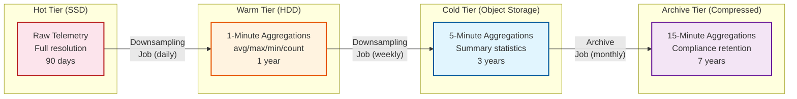

# Scalability & Reliability — Fleet Management System

## 1. Scaling Strategy

### 1.1 Scaling Dimensions

| Dimension | Approach | Trigger |
|---|---|---|
| **Connected vehicles** | Horizontal MQTT broker scaling + stream processor partitions | Vehicle count exceeds 80% of broker capacity |
| **Telemetry throughput** | Add stream processing partitions; scale time-series write nodes | Ingestion lag > 2 seconds at p99 |
| **Geofence count** | Shard geospatial index by region; increase evaluation workers | Geofence evaluation latency > 100ms at p99 |
| **Route optimization demand** | Auto-scale compute workers; pre-warm before morning peak | Optimization queue depth > 50 |
| **Geographic expansion** | Add regional deployment; route vehicles to nearest region | New operating region > 1000km from existing |
| **Historical storage** | Tiered storage with automated downsampling and archival | Hot storage exceeds 80% capacity |

### 1.2 Partitioning Strategies

**Telemetry Data: Vehicle-Based Partitioning**

```
Partition Assignment:
  partition_id = HASH(vehicle_id) MOD num_partitions

Properties:
  - All telemetry for a vehicle lands on the same partition
  - Time-range queries for a single vehicle hit one partition
  - Partition count: start at 128, scale to 512, 2048 as fleet grows
  - Rebalancing: consistent hashing with virtual nodes

Partition Sizing Target:
  - Max 5,000 vehicles per partition
  - Max 10,000 writes/sec per partition
  - Max 50 GB hot telemetry per partition
```

**Location Data: Geo-Based Partitioning**

```
Partition Assignment:
  partition_id = GEOHASH_PREFIX(latitude, longitude, precision=3)

Properties:
  - Spatial queries (nearby vehicles) hit 1-9 partitions (center + neighbors)
  - Fleets concentrated in one area hit the same partition (pro for locality)
  - Uneven distribution (NYC partition much larger than rural Montana)

Hotspot Mitigation:
  - Sub-partition dense areas at higher geohash precision
  - geohash "dr5r" (Manhattan) → split into "dr5r0" through "dr5rz"
  - Monitor partition sizes; auto-split when >10K vehicles per cell
```

**Compliance Data: Fleet-Based Partitioning**

```
Partition Assignment:
  partition_id = HASH(fleet_id) MOD num_partitions

Properties:
  - All compliance data for a fleet is co-located
  - Fleet-level reports require no cross-partition queries
  - Strong consistency within partition for ELD records
  - 6-month retention with automatic archival
```

### 1.3 Service-Level Scaling

| Service | Scaling Pattern | Min Instances | Auto-Scale Trigger |
|---|---|---|---|
| **MQTT Broker** | Horizontal, connection-balanced | 6 (3 per region) | Connections > 80% capacity per node |
| **Telemetry Normalizer** | Horizontal, stateless | 4 per region | CPU > 70% or queue depth > 1000 |
| **Stream Processor** | Partition-aligned, stateful | 1 per partition | Consumer lag > 5 seconds |
| **Geofence Evaluator** | Horizontal with shared spatial index | 4 per region | Evaluation latency p99 > 100ms |
| **Route Optimizer** | Horizontal, compute-intensive | 10 per region | Queue wait time > 30 seconds |
| **Tracking API** | Horizontal, stateless, cache-backed | 4 per region | API latency p99 > 500ms |
| **ELD/HOS Service** | Horizontal, strong consistency | 4 per region | Write latency > 200ms |
| **Dispatch Service** | Horizontal, stateless | 3 per region | Request rate > 80% capacity |

### 1.4 MQTT Broker Cluster Scaling

```
Scaling Approach: Topic-Based Partitioning

Vehicle → Broker Assignment:
  broker_id = CONSISTENT_HASH(vehicle_id, broker_ring)

Benefits:
  - Adding/removing broker nodes only affects ~1/N vehicles
  - Session state migrates with vehicle assignment
  - Load balanced by vehicle count (not message rate)

Scaling Event (add broker node):
  1. New broker joins cluster ring
  2. ~1/N vehicles gradually reconnect to new broker (during next reconnect cycle)
  3. No immediate disruption — vehicles reconnect naturally on next cellular hiccup
  4. Force drain: Publish disconnect to reassigned vehicles after 1 hour if not moved

Connection Storm Protection:
  After regional network outage, 100K+ vehicles reconnect simultaneously:
  1. Broker implements connection rate limiting (1000 new connections/sec per node)
  2. Vehicles implement exponential backoff: retry after random(1s, 2^attempt * 1s, max 300s)
  3. Priority admission: ELD/compliance connections accepted before standard telemetry
  4. Stale session cleanup: Evict sessions > 72 hours old to free memory
```

---

## 2. Caching Strategy

### 2.1 Cache Tiers

| Tier | Store | Data | TTL | Hit Rate |
|---|---|---|---|---|
| **L1: In-Process** | Local memory per service instance | Recent API responses, config | 5 seconds | ~40% |
| **L2: Distributed Cache** | Cache cluster | Current vehicle positions, driver HOS, route plans | 30 seconds – 5 minutes | ~85% |
| **L3: Geospatial Cache** | Spatial data structure in memory | Vehicle positions indexed for spatial queries | Real-time (continuous updates) | ~95% |
| **L4: Read Replicas** | Database read replicas | Fleet profiles, vehicle master data, geofence definitions | Eventually consistent | ~99% |

### 2.2 Current Position Cache

The most frequently accessed data in the system is the current position of vehicles.

```
Cache Design:
  Key: vehicle_id
  Value: {
    lat, lon, speed, heading, timestamp,
    fleet_id, driver_id, status,
    geohash, address_cached, trip_id
  }
  Size: ~500 bytes per vehicle
  Total: 500K vehicles × 500 bytes = 250 MB (fits in single cache node with room to spare)

  Update pattern: Write-through on every GPS update
  Read pattern: Random access by vehicle_id + spatial scan for nearby queries
  Eviction: None (cache is small enough to hold entire active fleet)
  Staleness: Positions > 5 minutes old are flagged as "stale" in API responses
```

### 2.3 Route and Distance Matrix Cache

```
Distance Matrix Cache:
  Key: HASH(origin_geohash_4, dest_geohash_4, time_bucket_30min)
  Value: {distance_km, duration_minutes, confidence}
  TTL: 30 minutes (traffic conditions change)
  Size: 50K common O-D pairs × 200 bytes = 10 MB

Route Cache:
  Key: route_id
  Value: Full route plan (stops, sequences, ETAs, geometry)
  TTL: Until explicitly invalidated (route change or EOD)
  Size: Average 10 KB per route × 50K active routes = 500 MB

Geofence Definition Cache:
  Key: geofence_id (also indexed by geohash for spatial lookup)
  Value: Polygon boundary + rules + metadata
  TTL: Until modified (low change frequency)
  Size: Average 1 KB per geofence × 1M geofences = 1 GB
```

---

## 3. Reliability Patterns

### 3.1 Edge-Cloud Resilience

The most unique reliability challenge in fleet management is handling vehicle connectivity loss gracefully.

```
Edge Store-and-Forward Protocol:

NORMAL MODE (connected):
  Vehicle → Telemetry → MQTT → Cloud (real-time)
  Cloud → Acknowledgment → Vehicle
  Buffer: Empty (all data delivered)

DISCONNECTED MODE (no connectivity):
  Vehicle → Telemetry → Local Buffer (encrypted)
  Buffer capacity: 72 hours of telemetry (~50 MB per vehicle)
  Priority queue: ELD events > Alerts > GPS > Engine data
  Compression: gzip batch every 1000 events

RECONNECTION MODE:
  1. Vehicle detects connectivity restored
  2. Send MQTT CONNECT with clean_session=false (resume session)
  3. Broker delivers any queued cloud→vehicle messages
  4. Vehicle starts draining buffer:
     a. Send buffered events in chronological order
     b. Tag each event with "buffered: true" + original device timestamp
     c. Interleave with real-time events (priority to real-time)
     d. Respect bandwidth throttle (don't overwhelm ingestion)
  5. Server-side dedup: Use (vehicle_id, device_sequence) for idempotency
  6. Buffer fully drained → back to NORMAL MODE

Compliance Guarantee:
  - ELD events use QoS 2 (exactly-once delivery)
  - Buffer is persisted to flash storage (survives power loss)
  - Cryptographic signature on buffered events (tamper-evident)
  - Buffer overflow policy: Keep newest GPS, but NEVER drop ELD events
```

### 3.2 Fault Tolerance Patterns

| Pattern | Applied To | Behavior |
|---|---|---|
| **Circuit Breaker** | Reverse geocoding, traffic API, weather service | Open after 5 failures in 30s; half-open after 60s; fallback to cached/default |
| **Bulkhead** | Route optimization workers | Separate thread pools for small (<20 stops) and large (>100 stops) optimizations; prevents large jobs from starving small ones |
| **Retry with Backoff** | Time-series writes, cache updates | 3 retries with exponential backoff (100ms, 400ms, 1600ms) |
| **Saga** | Multi-step dispatch (assign driver, update route, notify customer) | Compensating actions: unassign driver, revert route, cancel notification |
| **Dead Letter Queue** | Unparseable telemetry, failed enrichments | Store failed messages for manual review; don't block pipeline |
| **Graceful Degradation** | Route optimizer unavailable | Serve cached routes from previous day; show stale flag on dashboard |

### 3.3 Data Durability

| Data Type | Durability Strategy | RPO | RTO |
|---|---|---|---|
| **ELD/Compliance** | Synchronous replication + edge backup | 0 (zero data loss) | < 5 minutes |
| **Fleet/Driver/Job** | Synchronous replication across zones | 0 | < 5 minutes |
| **GPS telemetry** | Asynchronous replication; edge buffer as backup | < 60 seconds | < 15 minutes |
| **Route plans** | Cached on driver device + cloud | < 5 minutes | < 10 minutes (recompute) |
| **Analytics/derived** | Re-derivable from raw telemetry | N/A (recompute) | < 1 hour |

### 3.4 Disaster Recovery

```
Scenario: Complete Region Failure

Detection:
  - Health check failure from 3+ independent monitors
  - No telemetry received from any vehicle in region for > 60 seconds
  - Database replication lag exceeds 10 seconds

Automated Failover Sequence:
  1. DNS failover: Route all vehicle MQTT connections to surviving region (< 30 seconds)
  2. Vehicle reconnection: Vehicles detect disconnect, reconnect to new region (< 120 seconds)
  3. Promote read replicas in surviving region to primary
  4. Route optimization workers in surviving region absorb additional load
  5. Notify operations team for manual verification

Impact During Failover:
  - GPS updates: 30-120 second gap (vehicles buffer during reconnection)
  - Route optimization: Delayed by 1-2 minutes (queue redistribution)
  - ELD data: No loss (buffered on vehicle edge units)
  - Dashboard: Shows last-known positions; marks data as "recovering"

Recovery After Region Restored:
  1. Rebuild database replicas from surviving region
  2. Gradually migrate vehicles back to restored region
  3. Verify telemetry pipeline health
  4. Resume normal multi-region operation
```

---

## 4. Time-Series Data Lifecycle

### 4.1 Tiered Storage



### 4.2 Storage Cost Estimation

```
Tier comparison for 500K vehicles over retention period:

Hot (90 days):
  Raw: 50 GB/day × 90 days = 4.5 TB
  Cost: 4.5 TB × $0.10/GB/month = $450/month

Warm (1 year):
  1-min aggregation: ~500 MB/day × 365 days = 183 GB
  Cost: 183 GB × $0.03/GB/month = $5.49/month

Cold (3 years):
  5-min aggregation: ~100 MB/day × 1095 days = 110 GB
  Cost: 110 GB × $0.004/GB/month = $0.44/month

Archive (7 years):
  15-min aggregation: ~35 MB/day × 2555 days = 89 GB
  Cost: 89 GB × $0.001/GB/month = $0.09/month

Total monthly storage cost: ~$456/month for 500K vehicles
  = ~$0.0009/vehicle/month for 7-year retention
```

### 4.3 Query Routing

```
ALGORITHM RouteTimeSeriesQuery(vehicle_id, start_time, end_time, resolution):
    time_range = end_time - start_time

    IF resolution = "RAW" OR time_range < 6_HOURS:
        // Use hot tier with raw data
        RETURN QUERY_HOT_TIER(vehicle_id, start_time, end_time)

    IF resolution = "1_MINUTE" OR time_range < 7_DAYS:
        IF start_time > NOW() - 90_DAYS:
            RETURN QUERY_HOT_TIER_AGGREGATED(vehicle_id, start_time, end_time, "1min")
        ELSE:
            RETURN QUERY_WARM_TIER(vehicle_id, start_time, end_time)

    IF resolution = "5_MINUTE" OR time_range < 90_DAYS:
        RETURN QUERY_COLD_TIER(vehicle_id, start_time, end_time)

    // Long time ranges use archive tier
    RETURN QUERY_ARCHIVE_TIER(vehicle_id, start_time, end_time)
```

---

## 5. Load Testing Strategy

### 5.1 Load Test Scenarios

| Scenario | Parameters | Success Criteria |
|---|---|---|
| **Steady state** | 500K vehicles, 100K GPS/sec, 1M geofence evals/sec | p99 < 3s GPS processing, p99 < 100ms geofence |
| **Morning ramp** | 0 → 500K vehicles connecting over 2 hours | No connection rejections, ingestion lag < 5s during ramp |
| **Route optimization burst** | 50K route requests in 3-hour morning window | 95% complete within 60 seconds |
| **Network outage recovery** | 200K vehicles reconnecting in 5-minute window | All reconnected within 10 minutes, zero ELD data loss |
| **Region failover** | Kill one region, verify failover | Full service restoration in < 5 minutes |
| **Data backfill** | 200K vehicles drain 12-hour buffers simultaneously | Backfill completes in < 1 hour, real-time not impacted |

### 5.2 Chaos Engineering

| Experiment | Target | Expected Behavior |
|---|---|---|
| Kill MQTT broker node | MQTT cluster | Vehicles reconnect to other brokers within 30s |
| Spike geofence count 10x | Geofence evaluator | Graceful degradation; evaluate high-priority geofences first |
| Introduce 500ms network latency to time-series DB | Ingestion pipeline | Writes buffer in stream processor; catch up when latency resolves |
| Kill route optimization worker during solve | Route service | Job re-queued to another worker; customer sees slight delay |
| Corrupt GPS data (random coordinates) | Kalman filter | Outlier rejection; last valid position maintained |

---

*Next: [Security & Compliance →](./06-security-and-compliance.md)*
