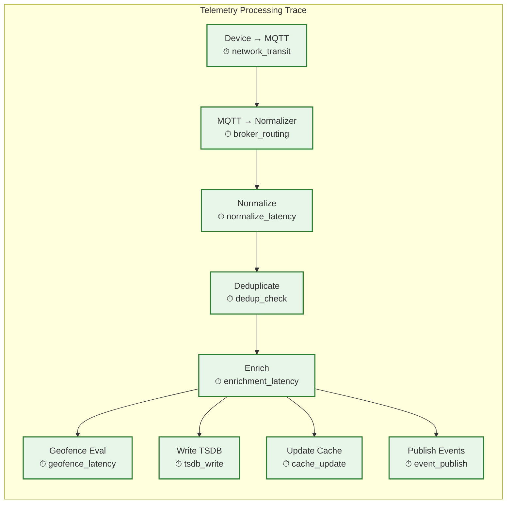

# Observability — Fleet Management System

## 1. Observability Strategy

Fleet management observability serves three masters: **operational excellence** (keep the platform running), **fleet operations visibility** (give fleet managers actionable data), and **regulatory compliance** (prove the system recorded data correctly). Metrics, logs, and traces must support all three perspectives—a missed GPS update is simultaneously an operational anomaly, a fleet visibility gap, and potentially a compliance issue.

### 1.1 Observability Pillars

| Pillar | Purpose | Retention | Access Control |
|---|---|---|---|
| **Metrics** | System health, capacity planning, SLO tracking | 2 years (aggregated: 5 years) | Operations + engineering |
| **Logs** | Event-level debugging, telemetry pipeline forensics | 90 days hot, 1 year archived | Engineering + support |
| **Traces** | Request-level latency analysis, pipeline stage timing | 30 days (sampled 10%), full for flagged events | Engineering |
| **Fleet Metrics** | Vehicle connectivity, telemetry health, driver compliance | 1 year real-time, 7 years aggregated | Fleet managers + operations |
| **Audit Trail** | Compliance proof, ELD record integrity, data access logs | 7 years (immutable) | Compliance + regulators |

---

## 2. Metrics

### 2.1 Golden Signals by Service

| Service | Latency | Traffic | Errors | Saturation |
|---|---|---|---|---|
| **MQTT Broker** | Connection time, message delivery delay | Connections/sec, messages/sec | Auth failures, delivery failures | Memory utilization, connection count vs. limit |
| **Telemetry Pipeline** | End-to-end ingestion latency (device → store) | Events/sec by type | Parse errors, dedup drops, enrichment failures | Stream processor lag, partition queue depth |
| **Geofence Engine** | Evaluation latency p50/p99 | Evaluations/sec, breach events/min | False positive rate, missed evaluations | Spatial index size, memory utilization |
| **Route Optimizer** | Solve time by problem size | Optimizations/min, stops/optimization | Infeasible problems, timeout rate | Worker CPU utilization, queue depth |
| **Tracking API** | Response time p50/p95/p99 | Requests/sec by endpoint | 4xx/5xx rate | Cache hit ratio, connection pool utilization |
| **ELD Service** | Record processing latency | Records/sec, status changes/min | Validation failures, sync errors | Storage utilization, replication lag |
| **Dispatch Service** | Assignment latency, ETA accuracy | Jobs dispatched/hour | Assignment failures, ETA errors >30% | Active jobs vs. available drivers ratio |

### 2.2 Telemetry Pipeline Metrics

```
Pipeline Health Metrics:
  fleet.mqtt.connections.active          {broker_node}           [gauge]
  fleet.mqtt.connections.rate            {broker_node, result}   [counter]
  fleet.mqtt.messages.received           {qos, data_type}        [counter]
  fleet.mqtt.messages.delivery_latency   {qos}                   [histogram]

  fleet.ingestion.events.processed       {event_type, source}    [counter]
  fleet.ingestion.events.dropped         {reason}                [counter]
  fleet.ingestion.latency                {stage}                 [histogram]
  fleet.ingestion.dedup.ratio            {}                      [gauge]
  fleet.ingestion.backpressure           {partition}             [gauge]

  fleet.timeseries.writes.rate           {table}                 [counter]
  fleet.timeseries.writes.latency        {table}                 [histogram]
  fleet.timeseries.compaction.duration   {}                      [histogram]
  fleet.timeseries.storage.bytes         {tier}                  [gauge]
```

### 2.3 Fleet Operations Metrics

```
Vehicle Health Metrics:
  fleet.vehicles.connected               {fleet_id, region}      [gauge]
  fleet.vehicles.reporting               {fleet_id}              [gauge]
  fleet.vehicles.stale                   {fleet_id}              [gauge]  // No update > 5 min
  fleet.vehicles.offline                 {fleet_id}              [gauge]  // No update > 1 hour
  fleet.vehicles.moving                  {fleet_id}              [gauge]
  fleet.vehicles.idling                  {fleet_id}              [gauge]

Driver Metrics:
  fleet.drivers.active                   {fleet_id}              [gauge]
  fleet.drivers.driving                  {fleet_id}              [gauge]
  fleet.drivers.hos_remaining            {fleet_id, clock_type}  [histogram]
  fleet.drivers.violations               {fleet_id, type}        [counter]
  fleet.drivers.safety_score             {fleet_id}              [histogram]

Geofence Metrics:
  fleet.geofence.evaluations             {fleet_id}              [counter]
  fleet.geofence.breaches                {fleet_id, zone_type}   [counter]
  fleet.geofence.latency                 {}                      [histogram]
  fleet.geofence.active_zones            {fleet_id}              [gauge]

Route Metrics:
  fleet.routes.optimized                 {fleet_id}              [counter]
  fleet.routes.solve_time                {stop_count_bucket}     [histogram]
  fleet.routes.quality_score             {fleet_id}              [histogram]
  fleet.routes.deviation_distance        {fleet_id}              [histogram]

Dispatch Metrics:
  fleet.dispatch.jobs.created            {fleet_id, type}        [counter]
  fleet.dispatch.jobs.completed          {fleet_id}              [counter]
  fleet.dispatch.jobs.on_time_pct        {fleet_id}              [gauge]
  fleet.dispatch.eta.accuracy            {fleet_id}              [histogram]
  fleet.dispatch.utilization             {fleet_id}              [gauge]
```

### 2.4 Key Business KPIs (Dashboard Rollups)

| KPI | Calculation | Target | Alert Threshold |
|---|---|---|---|
| **Fleet connectivity rate** | connected_vehicles / total_vehicles | > 98% | < 95% |
| **Telemetry freshness** | % of vehicles with update < 60s | > 99% | < 95% |
| **On-time delivery rate** | on_time_jobs / total_jobs | > 92% | < 85% |
| **HOS compliance rate** | drivers_without_violations / total_drivers | > 99% | < 97% |
| **Route adherence** | actual_distance / planned_distance | 95–105% | > 120% or < 80% |
| **Fuel efficiency** | fleet_avg_mpg vs. baseline | Within 5% of target | > 10% deviation |
| **Idle time percentage** | total_idle_time / total_engine_time | < 15% | > 25% |
| **Maintenance prediction accuracy** | predicted_failures_confirmed / total_predictions | > 75% | < 60% |

---

## 3. Logging

### 3.1 Log Categories

| Category | Content | Volume | Sensitivity |
|---|---|---|---|
| **Telemetry pipeline** | Parse errors, enrichment failures, quality issues | High (1000s/sec) | Low |
| **Geofence events** | Entry/exit/dwell/speed violations | Medium (100s/sec) | Medium (location data) |
| **Compliance events** | ELD records, HOS changes, DVIR submissions | Medium (10s/sec) | High (regulatory) |
| **API access** | Request/response logs, auth events | High (1000s/sec) | Medium (PII possible) |
| **System events** | Service health, scaling events, failovers | Low (10s/min) | Low |
| **Security events** | Auth failures, cert revocations, suspicious activity | Low (varies) | High |

### 3.2 Structured Log Format

```
{
  "timestamp": "2026-03-09T14:30:02.453Z",
  "level": "WARN",
  "service": "geofence-evaluator",
  "instance": "gfe-pod-3a2b",
  "trace_id": "abc123def456",
  "span_id": "789ghi",
  "fleet_id": "fleet-uuid",
  "vehicle_id": "veh-uuid",
  "event": "geofence_breach_detected",
  "geofence_id": "geo-uuid",
  "geofence_name": "Restricted Zone A",
  "breach_type": "ENTRY",
  "vehicle_speed_kmh": 45.2,
  "evaluation_latency_ms": 8.3,
  "metadata": {
    "driver_id": "drv-uuid",
    "trip_id": "trip-uuid"
  }
}
```

### 3.3 Log-Based Alerting Rules

| Rule | Condition | Severity | Action |
|---|---|---|---|
| **Mass disconnect** | > 100 vehicles disconnect within 1 minute (same broker) | P1 | Page on-call + check broker health |
| **Ingestion lag spike** | Stream processor lag > 30 seconds for > 2 minutes | P2 | Alert engineering + auto-scale consumers |
| **ELD sync failure** | > 10 ELD record sync failures from same vehicle | P2 | Alert fleet manager + investigate device |
| **GPS quality degradation** | > 5% of GPS updates failing quality checks in 5 minutes | P3 | Alert engineering + check pipeline |
| **Auth storm** | > 50 failed auth attempts from single IP in 1 minute | P2 | Auto-block IP + alert security |
| **Route optimizer timeout** | > 10% of optimization requests timing out | P3 | Scale up workers + alert engineering |

---

## 4. Distributed Tracing

### 4.1 Trace Points in Telemetry Pipeline



### 4.2 Sampling Strategy

| Traffic Type | Sampling Rate | Rationale |
|---|---|---|
| **GPS updates** | 0.1% (1 in 1000) | Extremely high volume; sample for performance analysis |
| **Geofence breaches** | 100% | Lower volume; every breach is operationally significant |
| **ELD/Compliance events** | 100% | Regulatory requirement — full traceability |
| **Route optimizations** | 100% | Lower volume; each optimization is expensive and important |
| **API requests (client)** | 10% | Moderate volume; balance observability vs. cost |
| **Error paths** | 100% | Always trace failures for root cause analysis |
| **High-latency events** | 100% (tail-triggered) | Auto-trace any event exceeding p95 latency threshold |

### 4.3 Cross-Layer Correlation

Unique to fleet management: a single vehicle event (GPS update) triggers processing across multiple layers, and operators need to trace from vehicle to dashboard:

```
Correlation IDs:

device_sequence: Monotonic ID from vehicle (ties to specific device transmission)
  → Carried through: MQTT → Normalizer → Stream Processor → TSDB → Cache

trace_id: Distributed tracing ID (generated at MQTT broker)
  → Carried through: All service-to-service calls for this event

vehicle_id + timestamp: Natural correlation key
  → Used for: Dashboard queries, fleet manager investigations
  → "Show me everything that happened to vehicle X at time T"

trip_id: Logical grouping key
  → Ties together: GPS trail + engine data + fuel data + HOS status + jobs
  → "Show me the complete picture of this trip"
```

---

## 5. Fleet Health Dashboard

### 5.1 Dashboard Layout

```
┌──────────────────────────────────────────────────────────┐
│ FLEET HEALTH OVERVIEW                         [Live] 🟢  │
├────────────────┬────────────────┬────────────────────────┤
│ Connected      │ Moving         │ Alerts (24h)           │
│ 487,234 / 500K │ 298,001 (61%) │ 🔴 12  🟡 89  🟢 1,247│
│ (97.4%)        │                │                        │
├────────────────┴────────────────┴────────────────────────┤
│                                                          │
│  TELEMETRY PIPELINE HEALTH                               │
│  ┌─────────────────────────────────────────────────┐    │
│  │ Ingestion Rate: ████████████████████░░ 87K/sec  │    │
│  │ Processing Lag:  2.1s (p50) / 4.8s (p99)       │    │
│  │ Geofence Evals:  892K/sec                       │    │
│  │ Drop Rate:       0.02%                          │    │
│  └─────────────────────────────────────────────────┘    │
│                                                          │
│  HOS COMPLIANCE                                          │
│  ┌─────────────────────────────────────────────────┐    │
│  │ Drivers at risk (< 30 min remaining):  47       │    │
│  │ Violations today:  3                             │    │
│  │ Compliance rate:  99.2%                          │    │
│  └─────────────────────────────────────────────────┘    │
│                                                          │
│  ROUTE PERFORMANCE                                       │
│  ┌─────────────────────────────────────────────────┐    │
│  │ Active routes: 12,847                            │    │
│  │ On-time rate:  93.1%                             │    │
│  │ Avg route efficiency: 94.7% (vs. optimal)       │    │
│  │ Re-optimizations today: 3,291                    │    │
│  └─────────────────────────────────────────────────┘    │
│                                                          │
│  MAINTENANCE PREDICTIONS                                 │
│  ┌─────────────────────────────────────────────────┐    │
│  │ Critical (next 7 days):  23 vehicles             │    │
│  │ Warning (next 30 days):  156 vehicles            │    │
│  │ Prediction accuracy (last 30 days): 81%          │    │
│  └─────────────────────────────────────────────────┘    │
│                                                          │
└──────────────────────────────────────────────────────────┘
```

### 5.2 Vehicle-Level Health View

Each vehicle has a health score derived from multiple signals:

```
Vehicle Health Score Calculation:

  connectivity_score = weight(0.20) × (
    time_since_last_update < 60s ? 1.0 :
    time_since_last_update < 300s ? 0.7 :
    time_since_last_update < 3600s ? 0.3 : 0.0
  )

  telemetry_quality = weight(0.15) × (
    gps_accuracy < 5m ? 1.0 :
    gps_accuracy < 15m ? 0.7 :
    gps_accuracy < 50m ? 0.3 : 0.0
  )

  engine_health = weight(0.25) × (
    no_dtc_codes ? 1.0 :
    only_minor_dtc ? 0.6 :
    major_dtc_present ? 0.2 : 0.0
  )

  maintenance_status = weight(0.20) × (
    all_services_current ? 1.0 :
    service_due_within_30_days ? 0.7 :
    service_overdue ? 0.3 : 0.0
  )

  driver_compliance = weight(0.20) × (
    no_violations_30d ? 1.0 :
    minor_violations_only ? 0.7 :
    major_violations ? 0.3 : 0.0
  )

  total_health = connectivity + telemetry_quality + engine_health
                + maintenance_status + driver_compliance

  Display: 🟢 > 0.8 | 🟡 0.5–0.8 | 🔴 < 0.5
```

---

## 6. Alerting

### 6.1 Alert Taxonomy

| Category | Alert | Severity | Recipients | Escalation |
|---|---|---|---|---|
| **Vehicle** | Unauthorized movement (after hours) | P1 | Fleet manager + security | → Fleet owner if unack'd 10 min |
| **Vehicle** | Tamper detection (device disconnect) | P1 | Fleet manager + security | → Fleet owner if unack'd 5 min |
| **Vehicle** | Predictive maintenance — critical | P2 | Maintenance manager | → Fleet manager if unack'd 24h |
| **Driver** | HOS violation imminent (< 15 min) | P2 | Driver + dispatcher | → Fleet manager if unack'd 5 min |
| **Driver** | Repeated harsh events (3 in 5 min) | P2 | Dispatcher + safety manager | Log for coaching review |
| **Geofence** | Unauthorized zone entry | P1–P3 (configurable) | Fleet manager | Configurable escalation |
| **Route** | Major route deviation (> 5km off plan) | P3 | Dispatcher | Log for review |
| **System** | Telemetry pipeline lag > 30s | P2 | Engineering on-call | → Engineering lead if > 5 min |
| **System** | MQTT broker connection saturation > 90% | P2 | Engineering on-call | Auto-scale + alert |

### 6.2 Alert Delivery Channels

| Channel | Use Case | Latency |
|---|---|---|
| **Push notification (mobile)** | Driver alerts (HOS, route changes) | < 3 seconds |
| **WebSocket (dashboard)** | Dispatcher real-time alerts | < 1 second |
| **SMS** | Critical fleet manager alerts (theft, tamper) | < 10 seconds |
| **Email** | Daily summaries, maintenance reports | Batched |
| **Webhook** | Partner/customer notifications (ETA updates) | < 5 seconds |
| **PagerDuty/Opsgenie** | Engineering on-call for system issues | < 30 seconds |

---

*Next: [Interview Guide →](./08-interview-guide.md)*
