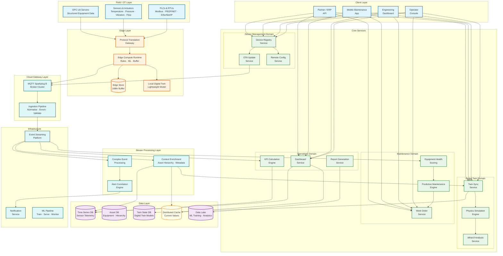
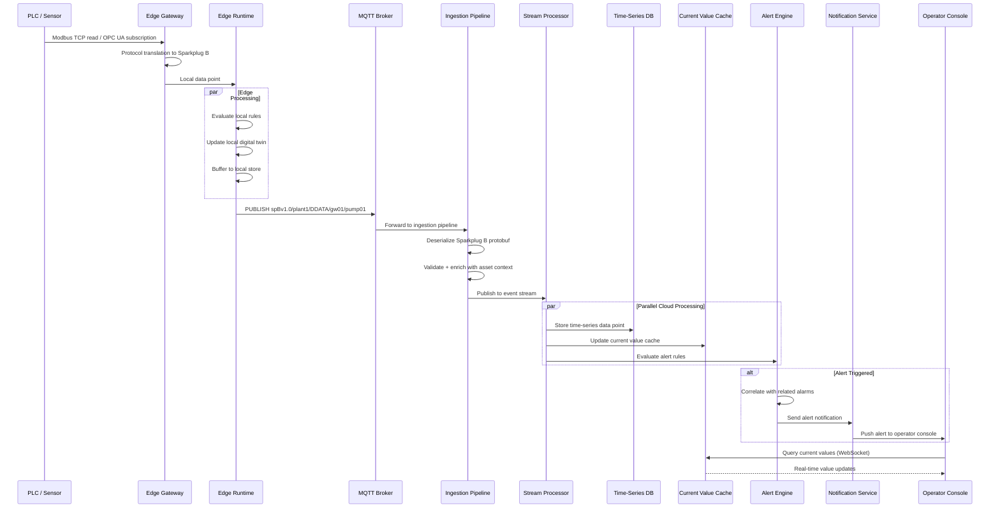
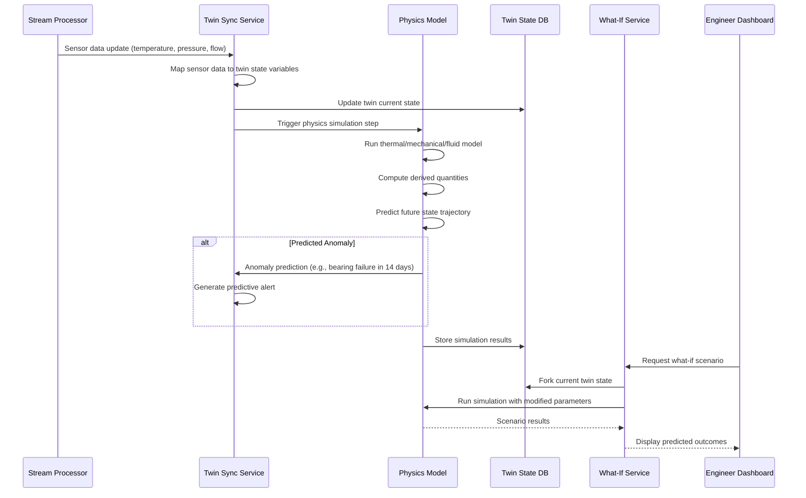

# High-Level Design — Industrial IoT Platform

## 1. System Architecture



---

## 2. Architectural Layers

### 2.1 Field / OT Layer

The field layer represents the physical plant floor—sensors, actuators, PLCs, and RTUs that directly interface with industrial processes.

**Physical Device Types:**
- **PLCs (Programmable Logic Controllers)**: Execute deterministic control logic; communicate via Modbus TCP/RTU, PROFINET, or EtherNet/IP
- **RTUs (Remote Terminal Units)**: Ruggedized controllers for remote sites; often communicate via serial Modbus or DNP3
- **Smart Sensors**: IP-connected sensors with built-in protocol stacks (MQTT, OPC UA); self-describing with metadata
- **Legacy Analog Sensors**: 4–20mA current loop sensors connected to PLC analog input modules
- **Actuators**: Valves, motors, drives receiving control commands from PLCs or edge controllers
- **OPC UA Servers**: Information model servers running on HMIs, DCS, or dedicated hardware; expose structured equipment data with semantic context

**Protocol Landscape:**
```
Protocol Hierarchy by Network Layer:

Level 0-1 (Field Devices → PLCs):
  4-20mA analog         → Point-to-point current loops
  HART                   → Hybrid analog + digital over same wiring
  Modbus RTU             → Serial RS-485, master-slave polling
  PROFIBUS               → Fieldbus, deterministic token passing
  Foundation Fieldbus    → Process automation, scheduled communication

Level 2 (PLCs → Control Network):
  Modbus TCP             → Ethernet-based, simple request-response
  PROFINET               → Industrial Ethernet, real-time capable
  EtherNet/IP            → CIP protocol over Ethernet
  OPC UA                 → Platform-independent, semantic data model

Level 3+ (Control → Enterprise/Cloud):
  OPC UA PubSub          → Publish-subscribe extension of OPC UA
  MQTT Sparkplug B       → Lightweight pub/sub with industrial semantics
  REST/gRPC              → Cloud-native service communication
```

### 2.2 Edge Layer

The edge layer bridges OT and IT, translating industrial protocols to cloud-native formats while providing local intelligence and resilience.

**Protocol Translation Gateway:**
- Connects to PLCs and OPC UA servers using native industrial protocols
- Translates data into MQTT Sparkplug B canonical format
- Handles protocol-specific timing: Modbus polling intervals, OPC UA subscriptions, PROFINET cycle times
- Maintains tag-to-asset mapping (PLC register addresses → meaningful sensor names)
- Performs unit conversion and engineering unit scaling (raw ADC counts → engineering values)

**Edge Compute Runtime:**
- Executes local rule engine for safety-critical alerting without cloud dependency
- Runs lightweight ML models for edge anomaly detection (vibration signature analysis, acoustic monitoring)
- Implements store-and-forward buffer with 168-hour retention on local SSD
- Manages Sparkplug B session state (birth/death certificates, sequence numbers)
- Supports containerized edge applications deployed and managed from cloud

**Local Digital Twin:**
- Lightweight physics model running on edge hardware
- Provides real-time equipment state estimation even during cloud disconnection
- Feeds local alert engine with derived values (calculated flow, heat transfer coefficients)
- Synchronizes with cloud twin on connectivity restoration

**Edge Gateway Hardware Profile:**
```
Typical Edge Gateway Specification:
  CPU:          4-8 core ARM/x86 (2-3 GHz)
  RAM:          8-32 GB
  Storage:      256 GB - 1 TB NVMe SSD
  Network:      2x Gigabit Ethernet, WiFi, optional 4G/5G cellular
  Serial:       2-4x RS-485/422 for Modbus RTU
  IO:           Digital/analog I/O for direct sensor connection
  OS:           Hardened embedded Linux with container runtime
  Security:     TPM 2.0, secure boot, encrypted storage
  Environment:  -40 to +70 C, DIN rail mount, fanless
  Power:        24VDC industrial power supply, UPS backup
```

### 2.3 Cloud Gateway Layer

The MQTT Sparkplug B broker cluster serves as the single entry point for all edge-to-cloud telemetry.

**MQTT Broker Cluster:**
- Handles tens of thousands of concurrent edge gateway connections
- Implements Sparkplug B specification: namespace awareness, birth/death certificate processing
- Topic structure: `spBv1.0/{group_id}/{message_type}/{edge_node_id}/{device_id}`
- QoS management: QoS 0 for high-frequency telemetry, QoS 1 for critical measurements, QoS 2 for commands
- Session persistence for edge gateways during temporary disconnections
- Horizontal scaling via topic-based partitioning across broker nodes

**Ingestion Pipeline:**
- Deserializes Sparkplug B protobuf payloads into canonical data points
- Validates data quality (range checks, timestamp sanity, stale data detection)
- Enriches data points with asset context from the asset hierarchy (site → area → unit → equipment → measurement)
- Deduplicates late-arriving data from store-and-forward buffer replay
- Routes data to appropriate downstream consumers via event streaming platform

### 2.4 Stream Processing Layer

**Complex Event Processing (CEP):**
- Evaluates configurable alert rules against streaming telemetry data
- Pattern-based detection across multiple signals and time windows
- Examples:
  - "Pump vibration > 10mm/s AND bearing temperature > 90C within 5 minutes" → Critical pump alert
  - "Compressor discharge pressure rising AND suction pressure dropping" → Compressor surge detection
  - "3 temperature sensors in same zone exceeding limit within 60 seconds" → Process upset detection

**Alert Correlation Engine:**
- Groups temporally and topologically related alerts into correlated incidents
- Applies alarm rationalization rules: suppresses downstream consequential alarms
- Reduces alarm volume by 80–90% through intelligent correlation
- Maintains alarm state machine: ACTIVE → ACKNOWLEDGED → CLEARED → RETURNED_TO_NORMAL

**Context Enrichment:**
- Attaches asset hierarchy metadata to every data point
- Resolves sensor IDs to human-readable names and engineering units
- Adds operational context: current production batch, operating mode, maintenance state
- Computes derived values: calculated flow rates, efficiency metrics, mass balances

### 2.5 Core Services Layer

Services organized by bounded contexts:

| Domain | Services | Responsibility |
|---|---|---|
| **Digital Twin** | Twin Sync, Physics Simulation, What-If Analysis | Real-time state synchronization, predictive simulation, scenario modeling |
| **Maintenance** | Predictive Maintenance, Work Order, Equipment Health | Failure prediction, maintenance scheduling, health scoring |
| **Device Management** | Device Registry, OTA Update, Remote Config | Device lifecycle, firmware management, configuration |
| **Operations** | Dashboard, Report Generation, KPI Calculation | Operator visibility, compliance reporting, performance metrics |

Each service:
- Owns its data store (database-per-service pattern)
- Communicates via events for cross-domain workflows
- Exposes gRPC for inter-service communication and REST for external APIs
- Maintains independent deployment and horizontal scaling

### 2.6 Data Layer

**Time-Series Database:**
- Purpose-built for high-throughput writes (millions of inserts/sec)
- Columnar compression optimized for sensor data patterns (delta-of-delta, gorilla encoding)
- Automated downsampling with continuous aggregation
- Tiered retention: raw → minute → hour → day aggregations with configurable policies

**Asset Database:**
- Hierarchical asset model: Enterprise → Site → Area → Unit → Equipment → Component → Measurement Point
- Stores equipment metadata, nameplate data, calibration records, maintenance history
- Supports ISA-95 equipment hierarchy standard

**Twin State Database:**
- Stores digital twin model definitions and current state vectors
- Optimized for frequent state updates (10–100 Hz per active twin)
- Supports versioned state for historical playback and what-if branching

**Distributed Cache:**
- In-memory cache of current values for all measurement points
- Powers real-time dashboards with sub-100ms query response
- Cache invalidation driven by streaming telemetry updates

**Data Lake:**
- Long-term storage for ML training data, historical analytics, and compliance archives
- Columnar format (Parquet) partitioned by site, date, and equipment type
- Feeds ML pipeline for model training and feature engineering

---

## 3. Core Data Flows

### 3.1 Sensor Telemetry Ingestion Flow



### 3.2 Digital Twin Synchronization Flow



### 3.3 OTA Firmware Update Flow

```
1. Engineer uploads new firmware image to OTA service
2. OTA service validates firmware signature against certificate chain
3. Engineer configures rollout policy:
   - Staged rollout: 5% → 25% → 50% → 100%
   - Rollout window: maintenance shift only (22:00–06:00)
   - Abort criteria: >2% failure rate in any stage
4. OTA service selects first cohort (5% of target devices)
5. For each device in cohort:
   a. Publish firmware manifest to device MQTT topic
   b. Device downloads firmware image from CDN (chunked, resumable)
   c. Device verifies firmware signature using TPM-stored root of trust
   d. Device applies update to inactive partition (A/B partition scheme)
   e. Device reboots to new partition
   f. Device runs self-test and reports health
   g. If self-test passes: confirm update, mark new partition active
   h. If self-test fails: rollback to previous partition, report failure
6. OTA service aggregates cohort results
7. If success rate > 98%: promote to next stage
8. If success rate < 98%: pause rollout, alert engineering team
9. After 100% rollout: monitor for 48 hours before declaring success
```

### 3.4 Predictive Maintenance Flow

```
1. ML pipeline scheduler triggers daily maintenance prediction job
2. Feature engineering service queries time-series DB:
   - 30-day rolling statistics for vibration, temperature, pressure, current
   - Trend slopes, variance changes, spectral features
   - Operating context: load profile, duty cycles, ambient conditions
3. Feature store assembles feature vectors per equipment instance
4. Model serving infrastructure runs prediction models:
   - Vibration-based bearing failure model (CNN on spectral features)
   - Thermal degradation model (regression on temperature trends)
   - Electrical fault model (current signature analysis)
5. Results scored against thresholds:
   - P(failure in 7 days) > 0.8 → CRITICAL work order
   - P(failure in 30 days) > 0.6 → HIGH work order
   - P(failure in 90 days) > 0.5 → PLANNED work order
6. Work order service creates maintenance tasks with:
   - Equipment ID, failure mode, confidence, recommended action
   - Suggested parts, estimated labor hours
   - Optimal maintenance window (minimize production impact)
7. Maintenance team receives notification in mobile app
8. After maintenance: feedback loop updates model training data
```

---

## 4. Key Architectural Decisions

### 4.1 MQTT Sparkplug B as the Unified Telemetry Protocol

| Decision | MQTT Sparkplug B as canonical edge-to-cloud protocol |
|---|---|
| **Context** | Need to unify data from 20+ industrial protocols into a single cloud ingestion format |
| **Decision** | Standardize on Sparkplug B at the edge gateway; all protocol translation happens at the edge |
| **Rationale** | Sparkplug B adds industrial semantics (birth/death certificates, report-by-exception, state awareness) to MQTT's lightweight pub/sub model; protobuf serialization reduces bandwidth by 60–80% vs. JSON; Eclipse Foundation open standard prevents vendor lock-in |
| **Trade-off** | Adds protocol translation latency at edge (1–5ms); not all OPC UA semantic richness survives translation |
| **Mitigation** | Keep OPC UA type information in Sparkplug B metric metadata; for latency-critical paths, allow OPC UA PubSub direct-to-cloud as alternative |

### 4.2 Edge-First Architecture for Safety and Resilience

| Decision | Safety-critical logic executes at the edge, not in the cloud |
|---|---|
| **Context** | Industrial processes require deterministic response times and must operate during cloud disconnection |
| **Decision** | Edge gateways run local rule engines and lightweight ML models; cloud is for analytics, optimization, and fleet management |
| **Rationale** | Cloud round-trip latency (50–500ms) is unacceptable for safety-critical decisions; connectivity cannot be guaranteed at remote sites; local processing satisfies ISA/IEC 62443 zone separation |
| **Trade-off** | Duplicated logic between edge and cloud; edge hardware costs increase; edge software lifecycle management complexity |
| **Mitigation** | Unified rule definition language deployed from cloud to edge; containerized edge applications managed by cloud orchestrator; edge hardware amortized over 10+ year lifecycle |

### 4.3 Time-Series Database for Telemetry Storage

| Decision | Purpose-built time-series database as the primary telemetry store |
|---|---|
| **Context** | Billions of data points per day with time-range queries as the dominant access pattern |
| **Decision** | TSDB with automated downsampling, tiered retention, and columnar compression |
| **Rationale** | 10–100x better write throughput vs. relational DB; 10x compression via delta-delta encoding; built-in continuous aggregation eliminates ETL complexity; retention policies automate data lifecycle |
| **Trade-off** | Limited join capabilities; separate database for asset metadata and configuration |
| **Mitigation** | Enrich data points with asset context at ingestion time; pre-joined materialized views for common queries; asset database for complex relationship queries |

### 4.4 Hierarchical Asset Model for Context

| Decision | ISA-95 compliant hierarchical asset model as the organizational backbone |
|---|---|
| **Context** | Sensors are meaningless without context; "Tag PT-4201" means nothing without knowing it's the discharge pressure on Pump P-4201 in Cooling Water Unit in Plant A |
| **Decision** | Implement ISA-95 equipment hierarchy (Enterprise → Site → Area → Unit → Equipment → Component → Measurement Point) as a first-class data structure |
| **Rationale** | Every data point, alert, and work order references the hierarchy; enables roll-up analytics (equipment → unit → site → enterprise); supports role-based access at every level |
| **Trade-off** | Hierarchy maintenance is a continuous effort; organizational changes require data migration; deep hierarchies slow some queries |
| **Mitigation** | Self-describing devices (OPC UA information models) auto-populate hierarchy; denormalize hierarchy path into time-series tags for fast filtering |

### 4.5 A/B Partition Scheme for OTA Updates

| Decision | Dual-partition firmware layout with automatic rollback |
|---|---|
| **Context** | Failed firmware updates on edge gateways can take entire facility sections offline |
| **Decision** | A/B partition scheme: update writes to inactive partition, boot to new partition, rollback if self-test fails |
| **Rationale** | Eliminates bricked devices from failed updates; rollback happens without cloud connectivity; proven pattern in embedded systems |
| **Trade-off** | Doubles flash storage requirement for OS/application partitions; boot process is more complex |
| **Mitigation** | Flash storage is inexpensive relative to edge gateway cost; bootloader validated and locked during manufacturing |

---

## 5. Inter-Service Communication

### 5.1 Communication Patterns

| Pattern | Usage | Example |
|---|---|---|
| **MQTT Sparkplug B** | Edge-to-cloud telemetry and commands | Sensor data ingestion, OTA update notifications, configuration pushes |
| **Event streaming** | Cross-service async data propagation | TelemetryReceived → alert evaluation, twin sync, TSDB storage |
| **gRPC (sync)** | Low-latency inter-service calls | Twin state query, device registry lookup, current value retrieval |
| **REST (sync)** | External APIs and client-facing endpoints | Dashboard data, partner integrations, mobile app backend |
| **WebSocket** | Real-time push to operator displays | Live value updates, alarm notifications, equipment status changes |
| **OPC UA PubSub** | High-frequency structured data to cloud | Direct OPC UA data for applications needing full information model |

### 5.2 Key Event Flows

```
Telemetry Events (very high volume):
  SensorValueReceived     → Time-Series Store, Current Value Cache, Alert Engine, Twin Sync
  DeviceBirthCertificate  → Device Registry, Asset Hierarchy, Dashboard
  DeviceDeathCertificate  → Alert Engine (device offline), Dashboard, Device Health

Alert Events (medium volume):
  ThresholdBreached       → Alert Correlation, Notification Service, Dashboard
  PatternDetected         → Alert Correlation, Incident Manager
  AlarmCorrelated         → Notification Service, Escalation Engine
  AlarmAcknowledged       → Alert State Store, Audit Log

Maintenance Events (low volume):
  FailurePredicted        → Work Order Service, Notification Service
  WorkOrderCreated        → Maintenance App, Scheduler, Parts Inventory
  MaintenanceCompleted    → Equipment Health, Model Feedback, Asset History

Device Management Events (low volume):
  FirmwareUpdateAvailable → OTA Service, Device Group Manager
  UpdateDeployed          → Device Health Monitor, Rollout Dashboard
  DeviceProvisioned       → Device Registry, Certificate Manager, Asset Hierarchy
```

---

## 6. Deployment Topology

### 6.1 Multi-Site Edge-Cloud Architecture

```
Cloud Region (Primary)                    Cloud Region (DR)
┌────────────────────────────────┐       ┌────────────────────────────────┐
│ MQTT Broker Cluster            │◄─────►│ MQTT Broker Cluster (standby)  │
│ Ingestion Pipeline (stream)    │       │ Ingestion Pipeline (stream)    │
│ Core Services (containers)     │       │ Core Services (containers)     │
│ Time-Series DB (primary)       │──sync─│ Time-Series DB (replica)       │
│ Asset DB (leader)              │──sync─│ Asset DB (follower)            │
│ Twin State DB (primary)        │──sync─│ Twin State DB (replica)        │
│ ML Model Serving               │       │ ML Model Serving               │
│ OTA Update CDN Origin          │       │ OTA Update CDN Origin          │
└────────────────────────────────┘       └────────────────────────────────┘
         │              │                            │
    ┌────┘              └────┐                       │
    ▼                        ▼                       ▼
┌──────────┐         ┌──────────┐            ┌──────────┐
│ Plant A  │         │ Plant B  │            │ Plant C  │
│ (Local)  │         │ (Remote) │            │ (Remote) │
│          │         │          │            │          │
│ 200 GWs  │         │ 100 GWs  │            │ 150 GWs  │
│ 100K     │         │ 50K      │            │ 75K      │
│ sensors  │         │ sensors  │            │ sensors  │
│ 50 Mbps  │         │ 10 Mbps  │            │ Satellite│
│ fiber    │         │ cellular │            │ 2 Mbps   │
└──────────┘         └──────────┘            └──────────┘
```

### 6.2 Per-Facility Edge Deployment

```
Per-Facility Edge Architecture:
┌────────────────────────────────────────────────────────────┐
│                    Plant Network                           │
│                                                            │
│  ┌──────────────┐  ┌──────────────┐  ┌──────────────┐    │
│  │ Zone: Safety  │  │ Zone: Control│  │ Zone: DMZ    │    │
│  │ SIL 2-3      │  │              │  │              │    │
│  │ ┌──────────┐ │  │ ┌──────────┐ │  │ ┌──────────┐ │    │
│  │ │Safety PLC│ │  │ │ PLC Rack │ │  │ │ Edge GW  │ │    │
│  │ │(isolated)│ │  │ │ + HMI    │ │  │ │ Cluster  │ │    │
│  │ └──────────┘ │  │ └──────────┘ │  │ │ (3 nodes)│ │    │
│  │              │  │              │  │ └──────────┘ │    │
│  │  Data Diode  │  │  Firewall   │  │  Firewall   │    │
│  │  (one-way →) │  │  (conduit)  │  │  (conduit)  │    │
│  └──────┬───────┘  └──────┬──────┘  └──────┬──────┘    │
│         │                 │                 │            │
│         └─────────────────┼─────────────────┘            │
│                           │                              │
│                    ┌──────┴──────┐                       │
│                    │ Aggregation │                       │
│                    │ Gateway     │                       │
│                    │ (MQTT + TLS)│                       │
│                    └──────┬──────┘                       │
│                           │                              │
└───────────────────────────┼──────────────────────────────┘
                            │
                     ┌──────┴──────┐
                     │  WAN Link   │
                     │ (encrypted) │
                     └──────┬──────┘
                            │
                     ┌──────┴──────┐
                     │ Cloud MQTT  │
                     │ Broker      │
                     └─────────────┘
```

---

*Next: [Low-Level Design ->](./03-low-level-design.md)*
