# Low-Level Design — Industrial IoT Platform

## 1. Data Model

### 1.1 Core Entity Relationship Diagram

```mermaid
erDiagram
    ENTERPRISE ||--o{ SITE : "contains"
    SITE ||--o{ AREA : "contains"
    AREA ||--o{ PROCESS_UNIT : "contains"
    PROCESS_UNIT ||--o{ EQUIPMENT : "contains"
    EQUIPMENT ||--o{ COMPONENT : "has"
    COMPONENT ||--o{ MEASUREMENT_POINT : "monitors"
    MEASUREMENT_POINT ||--o{ ALARM_CONFIG : "configured with"
    EQUIPMENT ||--o{ DIGITAL_TWIN : "represented by"
    EQUIPMENT ||--o{ MAINTENANCE_RECORD : "has"
    SITE ||--o{ EDGE_GATEWAY : "deployed at"
    EDGE_GATEWAY ||--o{ CONNECTED_DEVICE : "connects"
    CONNECTED_DEVICE ||--o{ MEASUREMENT_POINT : "provides"
    MEASUREMENT_POINT ||--o{ TELEMETRY_POINT : "produces"
    ALARM_CONFIG ||--o{ ALARM_EVENT : "generates"
    EQUIPMENT ||--o{ ALARM_EVENT : "experiences"

    ENTERPRISE {
        uuid enterprise_id PK
        string name
        string industry
        jsonb settings
        timestamp created_at
    }

    SITE {
        uuid site_id PK
        uuid enterprise_id FK
        string site_name
        string site_code
        string timezone
        string country_code
        point geo_location
        string connectivity_type
        boolean is_active
        timestamp created_at
    }

    AREA {
        uuid area_id PK
        uuid site_id FK
        string area_name
        string area_code
        string area_type
        int isa95_level
    }

    PROCESS_UNIT {
        uuid unit_id PK
        uuid area_id FK
        string unit_name
        string unit_code
        string process_type
        string operating_mode
    }

    EQUIPMENT {
        uuid equipment_id PK
        uuid unit_id FK
        string equipment_name
        string equipment_tag
        string equipment_type
        string manufacturer
        string model
        string serial_number
        date installation_date
        decimal design_life_years
        string criticality_rating
        jsonb nameplate_data
        string status
        timestamp last_maintenance
    }

    COMPONENT {
        uuid component_id PK
        uuid equipment_id FK
        string component_name
        string component_type
        string position
        decimal expected_life_hours
        decimal accumulated_hours
    }

    MEASUREMENT_POINT {
        uuid point_id PK
        uuid component_id FK
        uuid connected_device_id FK
        string tag_name
        string description
        string data_type
        string engineering_unit
        decimal range_low
        decimal range_high
        decimal deadband
        decimal scan_rate_ms
        string protocol_address
        boolean is_writable
        boolean is_active
        string hierarchy_path
    }

    ALARM_CONFIG {
        uuid alarm_id PK
        uuid point_id FK
        string alarm_type
        decimal high_high_limit
        decimal high_limit
        decimal low_limit
        decimal low_low_limit
        decimal rate_of_change_limit
        decimal deviation_setpoint
        decimal deviation_band
        int delay_seconds
        string severity
        string priority
        boolean is_enabled
        boolean is_shelved
        timestamp shelved_until
        string shelve_reason
    }

    DIGITAL_TWIN {
        uuid twin_id PK
        uuid equipment_id FK
        string model_type
        string model_version
        jsonb model_parameters
        jsonb current_state
        timestamp last_sync
        string sync_status
        decimal simulation_fidelity
    }

    EDGE_GATEWAY {
        uuid gateway_id PK
        uuid site_id FK
        string gateway_name
        string hardware_model
        string firmware_version
        string ip_address
        string sparkplug_node_id
        string status
        timestamp last_heartbeat
        decimal cpu_usage_pct
        decimal memory_usage_pct
        decimal storage_usage_pct
        decimal buffer_fill_pct
        int connected_device_count
        timestamp provisioned_at
    }

    CONNECTED_DEVICE {
        uuid device_id PK
        uuid gateway_id FK
        string device_name
        string device_type
        string protocol
        string protocol_address
        string sparkplug_device_id
        string firmware_version
        string status
        int point_count
        timestamp last_data_received
    }

    TELEMETRY_POINT {
        bigint point_id
        uuid measurement_point_id
        timestamp device_timestamp
        timestamp server_timestamp
        double value
        int quality_code
        bigint sequence_number
    }

    ALARM_EVENT {
        uuid event_id PK
        uuid alarm_id FK
        uuid equipment_id FK
        string alarm_state
        timestamp activated_at
        timestamp acknowledged_at
        timestamp cleared_at
        string acknowledged_by
        double trigger_value
        double limit_value
        string severity
        string priority
        uuid correlated_incident_id
    }

    MAINTENANCE_RECORD {
        uuid record_id PK
        uuid equipment_id FK
        string maintenance_type
        string trigger_source
        string description
        string status
        decimal cost
        decimal equipment_hours
        timestamp scheduled_date
        timestamp completed_date
        uuid work_order_id
        jsonb parts_used
        jsonb findings
        string performed_by
    }
```



### 1.2 Time-Series Telemetry Schema

The telemetry data is stored in a purpose-built time-series database optimized for billions of writes per day and time-range queries.

**Sensor Value Series:**
```
Table: sensor_values
  Partition key: measurement_point_id
  Sort key: device_timestamp
  Fields:
    measurement_point_id:  INTEGER (mapped from UUID for compression)
    device_timestamp:      TIMESTAMP (microsecond precision)
    server_timestamp:      TIMESTAMP (microsecond precision)
    value:                 DOUBLE
    quality:               SMALLINT (OPC UA quality codes: 0=Good, 64=Uncertain, 128=Bad)
    sequence_number:       BIGINT (per-device monotonic)

  Retention policies:
    Raw data: 90 days
    1-minute aggregation: 2 years
    15-minute aggregation: 10 years
    1-hour aggregation: 30 years (regulatory archives)

  Continuous aggregation (1-minute):
    avg_value, min_value, max_value, std_dev,
    first_value, last_value, sample_count,
    good_quality_pct, interpolated
```

**Equipment State Series:**
```
Table: equipment_state
  Partition key: equipment_id
  Sort key: timestamp
  Fields:
    equipment_id:       INTEGER
    timestamp:          TIMESTAMP
    operating_mode:     ENUM (RUNNING, IDLE, STANDBY, SHUTDOWN, MAINTENANCE, FAULT)
    load_percent:       FLOAT
    efficiency_percent: FLOAT
    runtime_hours:      DOUBLE
    cycle_count:        BIGINT
    state_metadata:     JSONB

  Retention: Same tiered policy as sensor values
```

**Alarm State History:**
```
Table: alarm_history
  Partition key: alarm_config_id
  Sort key: timestamp
  Fields:
    alarm_config_id:   INTEGER
    timestamp:         TIMESTAMP
    state:             ENUM (ACTIVE, ACKNOWLEDGED, CLEARED, SHELVED, SUPPRESSED)
    value_at_trigger:  DOUBLE
    limit_value:       DOUBLE
    operator_id:       STRING
    comment:           STRING

  Retention: 10 years (regulatory requirement)
```

### 1.3 Sparkplug B Message Schema

```
Sparkplug B Topic Namespace:
  spBv1.0/{group_id}/NBIRTH/{edge_node_id}        # Edge node comes online
  spBv1.0/{group_id}/NDEATH/{edge_node_id}        # Edge node goes offline
  spBv1.0/{group_id}/DBIRTH/{edge_node_id}/{device_id}  # Device comes online
  spBv1.0/{group_id}/DDEATH/{edge_node_id}/{device_id}  # Device goes offline
  spBv1.0/{group_id}/NDATA/{edge_node_id}         # Edge node data
  spBv1.0/{group_id}/DDATA/{edge_node_id}/{device_id}   # Device data
  spBv1.0/{group_id}/NCMD/{edge_node_id}          # Command to edge node
  spBv1.0/{group_id}/DCMD/{edge_node_id}/{device_id}    # Command to device

Sparkplug B Payload (Protobuf):
  Payload:
    timestamp:   UINT64   # Payload timestamp (ms since epoch)
    metrics:     REPEATED Metric
    seq:         UINT64   # Sequence number (0-255, wrapping)

  Metric:
    name:        STRING   # Metric name (e.g., "Temperature/Bearing_DE")
    alias:       UINT64   # Numeric alias (used after BIRTH for compression)
    timestamp:   UINT64   # Metric-level timestamp
    datatype:    UINT32   # Sparkplug data type enum
    value:       ONEOF    # Value (int, long, float, double, string, bytes, boolean)
    metadata:    MetaData # Engineering unit, description
    properties:  PropertySet  # Quality, deadband config, etc.

Example DDATA payload (after BIRTH established aliases):
  {
    "timestamp": 1741527002453,
    "seq": 42,
    "metrics": [
      {"alias": 1, "timestamp": 1741527002400, "datatype": 9, "doubleValue": 87.3},
      {"alias": 2, "timestamp": 1741527002410, "datatype": 9, "doubleValue": 342.1},
      {"alias": 3, "timestamp": 1741527002420, "datatype": 11, "booleanValue": true}
    ]
  }
```

---

## 2. API Design

### 2.1 Telemetry Query APIs

```
GET    /v1/points/{point_id}/current                    # Current value
GET    /v1/points/{point_id}/history                    # Historical values
GET    /v1/points/{point_id}/aggregation                # Aggregated values
POST   /v1/points/batch/current                         # Batch current values
POST   /v1/points/batch/history                         # Batch historical values
GET    /v1/equipment/{equipment_id}/values              # All current values for equipment
```

**Example: Get Current Value Response**
```
GET /v1/points/{point_id}/current

Response 200:
{
  "point_id": "pt-uuid",
  "tag_name": "PT-4201.PV",
  "description": "Pump P-4201 Discharge Pressure",
  "value": 342.7,
  "engineering_unit": "kPa",
  "quality": "GOOD",
  "timestamp": "2026-03-09T14:30:02.453Z",
  "age_seconds": 0.8,
  "hierarchy": {
    "site": "Plant Alpha",
    "area": "Cooling Water",
    "unit": "CW-04",
    "equipment": "Pump P-4201",
    "component": "Discharge",
    "measurement": "Pressure"
  },
  "alarms": {
    "high_high": {"limit": 500, "state": "NORMAL"},
    "high": {"limit": 400, "state": "NORMAL"},
    "low": {"limit": 200, "state": "NORMAL"},
    "low_low": {"limit": 100, "state": "NORMAL"}
  }
}
```

**Example: Historical Query**
```
GET /v1/points/{point_id}/history?start=2026-03-08T00:00:00Z&end=2026-03-09T00:00:00Z&aggregation=5m&function=avg

Response 200:
{
  "point_id": "pt-uuid",
  "tag_name": "PT-4201.PV",
  "start": "2026-03-08T00:00:00Z",
  "end": "2026-03-09T00:00:00Z",
  "aggregation": "5m",
  "function": "avg",
  "values": [
    {"timestamp": "2026-03-08T00:00:00Z", "value": 340.2, "quality": "GOOD", "count": 60},
    {"timestamp": "2026-03-08T00:05:00Z", "value": 341.8, "quality": "GOOD", "count": 58},
    {"timestamp": "2026-03-08T00:10:00Z", "value": 339.5, "quality": "UNCERTAIN", "count": 45}
  ],
  "statistics": {
    "min": 298.1,
    "max": 398.7,
    "avg": 342.3,
    "std_dev": 12.4,
    "total_points": 16542
  }
}
```

### 2.2 Alert and Alarm APIs

```
GET    /v1/alarms/active                                # All active alarms
GET    /v1/alarms/{alarm_id}                            # Alarm details
POST   /v1/alarms/{alarm_id}/acknowledge                # Acknowledge alarm
POST   /v1/alarms/{alarm_id}/shelve                     # Shelve alarm
GET    /v1/equipment/{equipment_id}/alarms              # Equipment alarm history
GET    /v1/sites/{site_id}/alarms/summary               # Site alarm summary
POST   /v1/alarms/configure                             # Configure alarm limits
```

**Example: Active Alarms Response**
```
GET /v1/alarms/active?site_id={site_id}&severity=critical,high

Response 200:
{
  "alarms": [
    {
      "alarm_id": "alm-uuid",
      "tag_name": "TT-4201.PV",
      "description": "Pump P-4201 Bearing DE Temperature HIGH",
      "severity": "HIGH",
      "priority": 2,
      "state": "ACTIVE_UNACKNOWLEDGED",
      "activated_at": "2026-03-09T14:28:15Z",
      "duration_seconds": 107,
      "current_value": 92.3,
      "limit": 85.0,
      "engineering_unit": "degC",
      "equipment": "Pump P-4201",
      "area": "Cooling Water",
      "correlated_incident_id": "inc-uuid",
      "related_alarms": 3,
      "suggested_action": "Check bearing lubrication; review vibration trend for last 7 days"
    }
  ],
  "summary": {
    "critical": 0,
    "high": 1,
    "medium": 12,
    "low": 34,
    "total_active": 47,
    "oldest_unacknowledged_minutes": 107
  }
}
```

### 2.3 Digital Twin APIs

```
GET    /v1/twins/{twin_id}/state                        # Current twin state
GET    /v1/twins/{twin_id}/prediction                   # Forward prediction
POST   /v1/twins/{twin_id}/what-if                      # What-if simulation
GET    /v1/twins/{twin_id}/history                      # Historical state
GET    /v1/equipment/{equipment_id}/twin                # Equipment's digital twin
POST   /v1/twins/{twin_id}/calibrate                    # Calibrate model
```

**Example: Twin State Response**
```
GET /v1/twins/{twin_id}/state

Response 200:
{
  "twin_id": "twin-uuid",
  "equipment_id": "equip-uuid",
  "equipment_tag": "P-4201",
  "model_type": "centrifugal_pump",
  "model_version": "2.3.1",
  "sync_status": "SYNCHRONIZED",
  "last_sync": "2026-03-09T14:30:01Z",
  "state": {
    "discharge_pressure_kpa": 342.7,
    "suction_pressure_kpa": 101.3,
    "flow_rate_m3h": 125.4,
    "motor_current_a": 87.2,
    "bearing_de_temp_c": 92.3,
    "bearing_nde_temp_c": 68.1,
    "vibration_de_mms": 4.2,
    "vibration_nde_mms": 2.1,
    "efficiency_pct": 78.3,
    "operating_point": "BEP_MINUS_15PCT"
  },
  "predictions": {
    "bearing_de_failure_probability_30d": 0.23,
    "estimated_remaining_life_hours": 4200,
    "next_recommended_maintenance": "2026-04-15",
    "efficiency_trend": "DECLINING_SLOWLY"
  },
  "anomalies": [
    {
      "type": "BEARING_TEMPERATURE_TREND",
      "severity": "WATCH",
      "description": "DE bearing temperature trending 0.3 degC/day upward for past 14 days",
      "detected_at": "2026-03-05T08:00:00Z"
    }
  ]
}
```

### 2.4 Device Management APIs

```
GET    /v1/gateways                                     # List all gateways
GET    /v1/gateways/{gateway_id}                        # Gateway details
GET    /v1/gateways/{gateway_id}/health                 # Gateway health metrics
POST   /v1/gateways/{gateway_id}/config                 # Push configuration
GET    /v1/devices                                      # List all devices
POST   /v1/devices/provision                            # Provision new device
DELETE /v1/devices/{device_id}                          # Decommission device
POST   /v1/ota/rollouts                                 # Create OTA rollout
GET    /v1/ota/rollouts/{rollout_id}                    # Rollout status
POST   /v1/ota/rollouts/{rollout_id}/pause              # Pause rollout
POST   /v1/ota/rollouts/{rollout_id}/resume             # Resume rollout
POST   /v1/ota/rollouts/{rollout_id}/rollback           # Rollback rollout
```

**Example: Create OTA Rollout**
```
POST /v1/ota/rollouts

Request:
{
  "name": "Gateway firmware v3.2.1 rollout",
  "firmware_id": "fw-uuid",
  "target": {
    "device_type": "EDGE_GATEWAY",
    "hardware_model": "GW-5000",
    "current_firmware": "<=3.1.x",
    "sites": ["site-uuid-1", "site-uuid-2"]
  },
  "strategy": {
    "type": "STAGED",
    "stages": [
      {"name": "Canary", "percentage": 5, "min_soak_hours": 24},
      {"name": "Early Adopter", "percentage": 25, "min_soak_hours": 48},
      {"name": "Majority", "percentage": 50, "min_soak_hours": 24},
      {"name": "Full", "percentage": 100, "min_soak_hours": 0}
    ],
    "maintenance_window": {"start": "22:00", "end": "06:00", "timezone": "UTC"},
    "abort_criteria": {
      "max_failure_rate_pct": 2,
      "max_rollback_count": 5,
      "health_check_timeout_minutes": 30
    }
  }
}

Response 202:
{
  "rollout_id": "rollout-uuid",
  "status": "SCHEDULED",
  "target_device_count": 850,
  "current_stage": "Canary",
  "next_deployment_window": "2026-03-09T22:00:00Z"
}
```

### 2.5 MQTT Command Protocol

```
Command Topics:
  spBv1.0/{group}/NCMD/{node_id}          # Command to edge node
  spBv1.0/{group}/DCMD/{node_id}/{dev_id} # Command to specific device

Command Types:
  1. Configuration Update:
     {"name": "Node Control/Rebirth", "value": true}
     → Forces device to re-publish BIRTH certificate

  2. Scan Rate Change:
     {"name": "Config/ScanRate", "value": 1000}
     → Change polling interval to 1000ms

  3. Deadband Update:
     {"name": "Config/Deadband/TT-4201", "value": 0.5}
     → Set deadband to 0.5 engineering units

  4. Firmware Update Trigger:
     {"name": "OTA/Update", "value": "{\"fw_id\":\"uuid\",\"url\":\"...\",\"sha256\":\"...\"}"}

  5. Write to Actuator:
     {"name": "Outputs/Valve-4201/Setpoint", "value": 75.0}
     → Write setpoint to control valve (requires authorization)

Command Authorization:
  - Read commands (rebirth, config query): Operator role
  - Config commands (scan rate, deadband): Engineer role
  - Write commands (actuator setpoints): Authorized Operator with two-person rule
  - OTA commands: Admin role with change management approval
```

---

## 3. Core Algorithms

### 3.1 Report-by-Exception with Deadband

```
ALGORITHM ReportByException(new_value, last_reported_value, config):
    // Sparkplug B report-by-exception implementation
    // Only transmit data when value changes beyond configured deadband

    // Step 1: Check absolute deadband
    IF ABS(new_value - last_reported_value) > config.deadband:
        RETURN SHOULD_REPORT

    // Step 2: Check percentage deadband (if configured)
    IF config.percent_deadband > 0:
        IF last_reported_value != 0:
            percent_change = ABS(new_value - last_reported_value) / ABS(last_reported_value) * 100
            IF percent_change > config.percent_deadband:
                RETURN SHOULD_REPORT

    // Step 3: Check maximum silence period
    // Even if value hasn't changed, report periodically to confirm sensor health
    time_since_last_report = NOW() - last_report_timestamp
    IF time_since_last_report > config.max_silence_seconds:
        RETURN SHOULD_REPORT  // Heartbeat report

    // Step 4: Check rate of change (if configured)
    IF config.rate_deadband > 0:
        rate = (new_value - previous_value) / (NOW() - previous_timestamp)
        IF ABS(rate) > config.rate_deadband:
            RETURN SHOULD_REPORT  // Fast-changing value

    RETURN SHOULD_NOT_REPORT


ALGORITHM EdgeGatewayPublishCycle(sensors, mqtt_client):
    // Main publish loop running on edge gateway

    FOR EACH sensor IN sensors:
        raw_value = READ_SENSOR(sensor)

        // Apply engineering unit conversion
        eng_value = sensor.scale_factor * raw_value + sensor.offset

        // Apply quality determination
        quality = DETERMINE_QUALITY(eng_value, sensor)
        IF eng_value < sensor.range_low OR eng_value > sensor.range_high:
            quality = BAD_OUT_OF_RANGE

        // Check if value should be reported
        report_decision = ReportByException(eng_value, sensor.last_reported, sensor.config)

        IF report_decision == SHOULD_REPORT:
            metric = SparkplugMetric(
                alias = sensor.sparkplug_alias,
                timestamp = GPS_SYNCHRONIZED_TIME(),
                value = eng_value,
                quality = quality
            )
            ADD_TO_BATCH(metric)
            sensor.last_reported = eng_value
            sensor.last_report_timestamp = NOW()

    IF BATCH_HAS_METRICS():
        payload = SparkplugPayload(
            timestamp = NOW(),
            seq = NEXT_SEQUENCE(),
            metrics = BATCH_METRICS()
        )
        mqtt_client.PUBLISH(
            topic = "spBv1.0/" + group + "/DDATA/" + node_id + "/" + device_id,
            payload = PROTOBUF_SERIALIZE(payload),
            qos = 1
        )
```

### 3.2 Alert Correlation Algorithm

```
ALGORITHM CorrelateAlerts(new_alarm, active_alarms, asset_topology):
    // Correlate incoming alarm with existing active alarms
    // Goal: group related alarms into incidents to reduce alarm fatigue

    // Step 1: Check temporal correlation
    // Alarms within a short time window are likely related
    temporal_candidates = []
    FOR EACH active IN active_alarms:
        time_delta = ABS(new_alarm.timestamp - active.timestamp)
        IF time_delta < TEMPORAL_WINDOW_SECONDS:  // typically 60-300 seconds
            temporal_candidates.ADD(active)

    // Step 2: Check topological correlation
    // Alarms on equipment in the same process path are likely related
    topological_candidates = []
    new_equipment = GET_EQUIPMENT(new_alarm.equipment_id)
    FOR EACH candidate IN temporal_candidates:
        cand_equipment = GET_EQUIPMENT(candidate.equipment_id)

        // Check if equipment shares process unit
        IF new_equipment.unit_id == cand_equipment.unit_id:
            topological_candidates.ADD(candidate, weight=0.8)

        // Check if equipment is upstream/downstream in process flow
        IF IS_PROCESS_CONNECTED(new_equipment, cand_equipment, asset_topology):
            topological_candidates.ADD(candidate, weight=0.9)

        // Check if equipment shares utility (cooling water, steam, power)
        IF SHARES_UTILITY(new_equipment, cand_equipment):
            topological_candidates.ADD(candidate, weight=0.6)

    // Step 3: Check causal correlation
    // Known cause-effect patterns from alarm rationalization database
    causal_candidates = []
    FOR EACH candidate IN topological_candidates:
        pattern = LOOKUP_CAUSAL_PATTERN(candidate.alarm_type, new_alarm.alarm_type)
        IF pattern IS NOT NULL:
            causal_candidates.ADD(candidate, pattern)

    // Step 4: Determine correlation result
    IF LENGTH(causal_candidates) > 0:
        // Strong correlation — this is a consequential alarm
        root_cause_alarm = SELECT_ROOT_CAUSE(causal_candidates)
        incident = GET_OR_CREATE_INCIDENT(root_cause_alarm)
        ADD_TO_INCIDENT(incident, new_alarm, relationship="CONSEQUENTIAL")
        new_alarm.suppressed = causal_candidates[0].pattern.suppress_consequential
        RETURN CorrelationResult(
            incident_id = incident.id,
            root_cause = root_cause_alarm,
            relationship = "CONSEQUENTIAL",
            confidence = causal_candidates[0].pattern.confidence
        )

    ELSE IF LENGTH(topological_candidates) > 0:
        // Moderate correlation — group into existing incident
        best_match = MAX(topological_candidates, key=weight)
        incident = GET_OR_CREATE_INCIDENT(best_match)
        ADD_TO_INCIDENT(incident, new_alarm, relationship="CORRELATED")
        RETURN CorrelationResult(
            incident_id = incident.id,
            relationship = "CORRELATED",
            confidence = best_match.weight
        )

    ELSE:
        // No correlation — new independent incident
        incident = CREATE_INCIDENT(
            root_alarm = new_alarm,
            severity = new_alarm.severity,
            equipment = new_equipment,
            description = FORMAT_INCIDENT_DESCRIPTION(new_alarm)
        )
        RETURN CorrelationResult(
            incident_id = incident.id,
            relationship = "ROOT_CAUSE",
            confidence = 1.0
        )
```

### 3.3 Digital Twin State Synchronization

```
ALGORITHM SyncDigitalTwin(twin, sensor_updates):
    // Synchronize digital twin state with real-time sensor data
    // Runs at twin update frequency (1-10 Hz)

    // Step 1: Map sensor data to twin state variables
    state_updates = {}
    FOR EACH update IN sensor_updates:
        mapping = TWIN_SENSOR_MAP.Get(twin.id, update.point_id)
        IF mapping IS NOT NULL:
            // Apply sensor fusion if multiple sensors map to same state variable
            IF mapping.fusion_type == "AVERAGE":
                state_updates[mapping.state_var] = WEIGHTED_AVERAGE(
                    current = twin.state[mapping.state_var],
                    measurement = update.value,
                    weight = mapping.sensor_weight
                )
            ELSE IF mapping.fusion_type == "KALMAN":
                state_updates[mapping.state_var] = KALMAN_UPDATE(
                    twin.kalman_state[mapping.state_var],
                    update.value,
                    mapping.measurement_noise
                )
            ELSE:
                state_updates[mapping.state_var] = update.value

    // Step 2: Update twin state
    FOR EACH (var_name, value) IN state_updates:
        twin.state[var_name] = value
        twin.state_timestamps[var_name] = NOW()

    // Step 3: Run physics model step
    dt = NOW() - twin.last_simulation_time
    IF dt >= twin.simulation_step_size:
        // Execute physics simulation
        derived_state = twin.physics_model.Step(twin.state, dt)

        // Update derived quantities
        FOR EACH (var_name, value) IN derived_state:
            twin.state[var_name] = value
            // Example derived: pump efficiency, heat transfer coefficient,
            // remaining useful life estimate

        twin.last_simulation_time = NOW()

    // Step 4: Check for anomalies
    anomalies = []
    FOR EACH (var_name, value) IN twin.state:
        expected = twin.physics_model.ExpectedValue(var_name, twin.state)
        IF expected IS NOT NULL:
            residual = ABS(value - expected)
            threshold = twin.anomaly_thresholds[var_name]
            IF residual > threshold:
                anomalies.ADD(Anomaly(
                    variable = var_name,
                    actual = value,
                    expected = expected,
                    residual = residual,
                    severity = CLASSIFY_SEVERITY(residual, threshold)
                ))

    // Step 5: Run forward prediction
    IF twin.prediction_enabled:
        future_state = twin.physics_model.Predict(
            twin.state, prediction_horizon = 24 * 3600  // 24 hours
        )
        twin.predictions = future_state

    // Step 6: Persist state
    TWIN_STATE_DB.Update(twin.id, twin.state, twin.predictions, anomalies)

    RETURN TwinSyncResult(
        twin_id = twin.id,
        state_variables_updated = LENGTH(state_updates),
        derived_variables_computed = LENGTH(derived_state),
        anomalies_detected = anomalies,
        sync_latency_ms = (NOW() - MIN(update.timestamp FOR update IN sensor_updates)) * 1000
    )
```

### 3.4 Predictive Maintenance Feature Engineering

```
ALGORITHM ComputeMaintenanceFeatures(equipment_id, component_type):
    // Extract maintenance-relevant features from time-series telemetry
    // Features designed for interpretability (gradient-boosted trees, not deep learning)

    // Step 1: Query relevant telemetry windows
    sensors = GET_SENSORS_FOR_COMPONENT(equipment_id, component_type)
    telemetry_30d = QUERY_TIMESERIES(sensors, window=LAST_30_DAYS, agg=HOURLY)
    telemetry_7d = QUERY_TIMESERIES(sensors, window=LAST_7_DAYS, agg=RAW)
    context = GET_EQUIPMENT_CONTEXT(equipment_id)

    features = {}

    // Step 2: Statistical features (per sensor, 30-day window)
    FOR EACH sensor IN sensors:
        prefix = sensor.measurement_type  // e.g., "vibration", "temperature"
        data = telemetry_30d[sensor.id]

        features[prefix + "_mean"] = MEAN(data)
        features[prefix + "_std"] = STD(data)
        features[prefix + "_max"] = MAX(data)
        features[prefix + "_min"] = MIN(data)
        features[prefix + "_range"] = MAX(data) - MIN(data)
        features[prefix + "_p95"] = PERCENTILE(data, 95)
        features[prefix + "_kurtosis"] = KURTOSIS(data)
        features[prefix + "_skewness"] = SKEWNESS(data)

    // Step 3: Trend features
    FOR EACH sensor IN sensors:
        prefix = sensor.measurement_type
        daily_avg = RESAMPLE(telemetry_30d[sensor.id], "1D", AGG=MEAN)

        features[prefix + "_trend_slope"] = LINEAR_REGRESSION_SLOPE(daily_avg)
        features[prefix + "_trend_r2"] = LINEAR_REGRESSION_R2(daily_avg)
        features[prefix + "_week_over_week_change"] = (
            MEAN(daily_avg[-7:]) - MEAN(daily_avg[-14:-7])
        ) / MEAN(daily_avg[-14:-7]) * 100

    // Step 4: Spectral features (for vibration sensors)
    FOR EACH sensor IN sensors WHERE sensor.type == "VIBRATION":
        raw_7d = telemetry_7d[sensor.id]
        spectrum = FFT(raw_7d)

        features["vib_dominant_frequency"] = DOMINANT_FREQ(spectrum)
        features["vib_harmonic_ratio"] = HARMONIC_ENERGY(spectrum) / TOTAL_ENERGY(spectrum)
        features["vib_rms"] = RMS(raw_7d)
        features["vib_crest_factor"] = PEAK(raw_7d) / RMS(raw_7d)
        features["vib_spectral_entropy"] = SPECTRAL_ENTROPY(spectrum)

    // Step 5: Operating context features
    features["runtime_hours_total"] = context.total_runtime_hours
    features["hours_since_last_maintenance"] = context.hours_since_maintenance
    features["starts_since_maintenance"] = context.starts_since_maintenance
    features["avg_load_pct_30d"] = MEAN(telemetry_30d["load_percent"])
    features["high_load_hours_30d"] = COUNT_HOURS(telemetry_30d["load_percent"] > 90)
    features["equipment_age_years"] = context.age_years
    features["duty_cycle_pct"] = context.runtime_hours_30d / (30 * 24) * 100

    // Step 6: Cross-sensor interaction features
    IF "temperature" IN sensors AND "vibration" IN sensors:
        features["temp_vib_correlation"] = CORRELATION(
            telemetry_30d["temperature"], telemetry_30d["vibration"]
        )

    IF "pressure" IN sensors AND "flow" IN sensors:
        features["pressure_flow_ratio_trend"] = LINEAR_REGRESSION_SLOPE(
            telemetry_30d["pressure"] / telemetry_30d["flow"]
        )

    RETURN features
```

### 3.5 OTA Update Safety Verification

```
ALGORITHM VerifyOTAUpdate(device, firmware_image):
    // Pre-update verification to prevent bricking edge gateways

    // Step 1: Verify firmware signature
    signature = firmware_image.signature
    certificate = firmware_image.signing_certificate
    IF NOT VERIFY_CHAIN_OF_TRUST(certificate, ROOT_CA):
        RETURN UpdateDecision(approved=false, reason="Invalid certificate chain")

    IF NOT VERIFY_SIGNATURE(firmware_image.binary, signature, certificate.public_key):
        RETURN UpdateDecision(approved=false, reason="Firmware signature verification failed")

    // Step 2: Check hardware compatibility
    IF firmware_image.target_hardware != device.hardware_model:
        RETURN UpdateDecision(approved=false, reason="Hardware model mismatch")

    IF firmware_image.min_hardware_revision > device.hardware_revision:
        RETURN UpdateDecision(approved=false, reason="Hardware revision too old")

    // Step 3: Check version compatibility
    IF NOT IS_UPGRADE_PATH_VALID(device.current_version, firmware_image.version):
        RETURN UpdateDecision(approved=false, reason="No valid upgrade path")

    // Step 4: Check device health before update
    IF device.buffer_fill_pct > 80:
        RETURN UpdateDecision(approved=false, reason="Store-forward buffer too full; drain first")

    IF device.cpu_usage_pct > 90:
        RETURN UpdateDecision(approved=false, reason="Device under heavy load")

    // Step 5: Check operational safety
    connected_sensors = GET_CONNECTED_SENSORS(device)
    critical_sensors = FILTER(connected_sensors, criticality="SAFETY_CRITICAL")
    IF LENGTH(critical_sensors) > 0:
        // Safety-critical sensors connected; require maintenance window
        IF NOT IN_MAINTENANCE_WINDOW():
            RETURN UpdateDecision(
                approved=false,
                reason="Safety-critical sensors connected; update only during maintenance window",
                retry_at=NEXT_MAINTENANCE_WINDOW()
            )

    // Step 6: Verify sufficient storage for A/B update
    required_space = firmware_image.size * 1.5  // Image + temporary space
    available_space = device.inactive_partition_space
    IF available_space < required_space:
        RETURN UpdateDecision(approved=false, reason="Insufficient partition space")

    RETURN UpdateDecision(
        approved=true,
        update_partition=device.inactive_partition,
        rollback_partition=device.active_partition,
        estimated_downtime_seconds=firmware_image.estimated_reboot_time,
        pre_update_checklist=[
            "Drain critical alarms from buffer",
            "Notify connected HMIs of pending gateway restart",
            "Save current configuration snapshot"
        ]
    )
```

---

## 4. Event Schema Design

### 4.1 Core Event Types

```
Event Hierarchy:

TelemetryEvent
  ├── SensorValueReceived { point_id, value, quality, timestamp, sequence }
  ├── EquipmentStateChanged { equipment_id, old_state, new_state, reason }
  ├── BatchStarted { unit_id, batch_id, recipe, start_time }
  └── BatchCompleted { unit_id, batch_id, yield, quality_metrics }

DeviceLifecycleEvent
  ├── DeviceBirthCertificate { node_id, device_id, metrics_list, timestamp }
  ├── DeviceDeathCertificate { node_id, device_id, timestamp }
  ├── DeviceProvisioned { device_id, gateway_id, certificate_thumbprint }
  ├── DeviceDecommissioned { device_id, reason, data_archived }
  └── FirmwareUpdated { device_id, old_version, new_version, update_duration }

AlarmEvent
  ├── AlarmActivated { alarm_id, equipment_id, value, limit, severity }
  ├── AlarmAcknowledged { alarm_id, operator_id, comment }
  ├── AlarmCleared { alarm_id, duration_seconds }
  ├── AlarmShelved { alarm_id, operator_id, reason, until }
  └── IncidentCorrelated { incident_id, alarm_ids, root_cause_id, confidence }

MaintenanceEvent
  ├── FailurePredicted { equipment_id, component, probability, estimated_rul }
  ├── WorkOrderCreated { work_order_id, equipment_id, priority, scheduled }
  ├── MaintenanceStarted { work_order_id, technician_id }
  └── MaintenanceCompleted { work_order_id, findings, parts_replaced }

TwinEvent
  ├── TwinStateSynced { twin_id, variables_updated, sync_latency_ms }
  ├── TwinAnomalyDetected { twin_id, variable, actual, expected, severity }
  ├── TwinPredictionUpdated { twin_id, prediction_type, horizon, result }
  └── TwinSimulationCompleted { twin_id, scenario_id, results }
```

### 4.2 Event Envelope

```
IIoTEventEnvelope:
  event_id:          UUID
  event_type:        STRING
  source_type:       ENUM (SENSOR, GATEWAY, SERVICE, OPERATOR, SYSTEM)
  source_id:         STRING
  site_id:           UUID
  equipment_id:      UUID (nullable)
  timestamp:         TIMESTAMP (event occurrence time)
  ingestion_time:    TIMESTAMP (cloud receipt time)
  hierarchy_path:    STRING (e.g., "PlantA/CoolingWater/CW04/P4201/BearingDE/Temperature")
  payload:           BYTES
  metadata:          MAP<STRING, STRING>
  quality:           ENUM (GOOD, UNCERTAIN, BAD)
  correlation_id:    UUID (for tracing related events)
```

---

*Next: [Deep Dive & Bottlenecks ->](./04-deep-dive-and-bottlenecks.md)*
