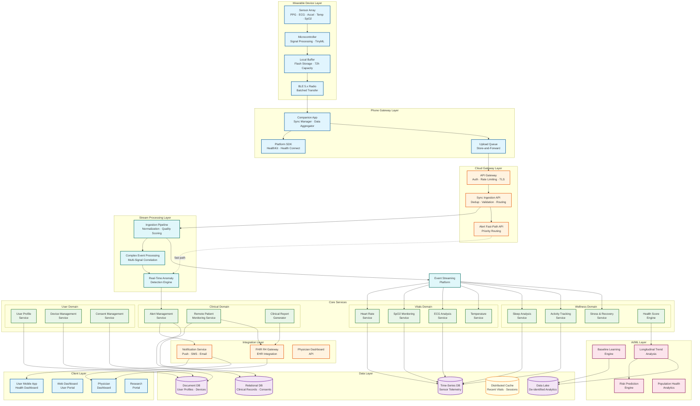
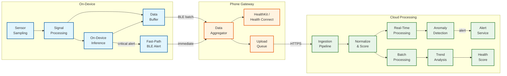
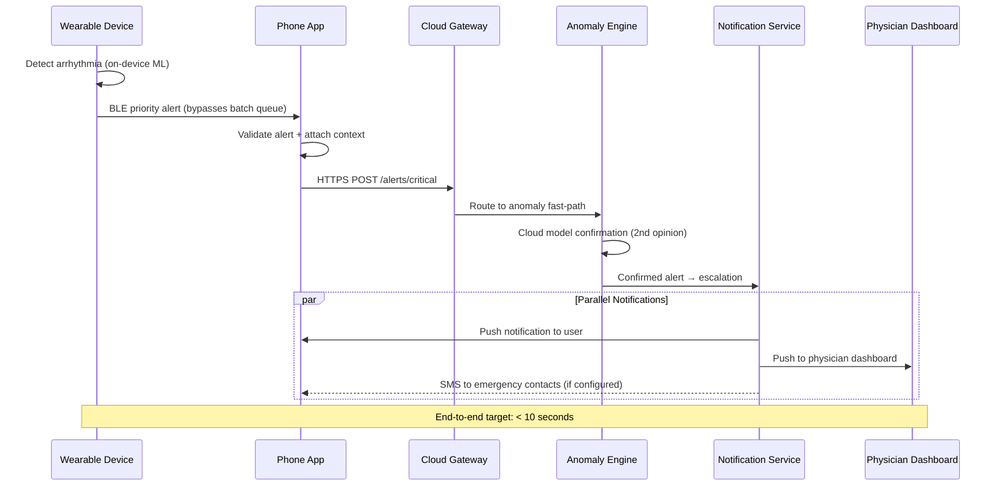
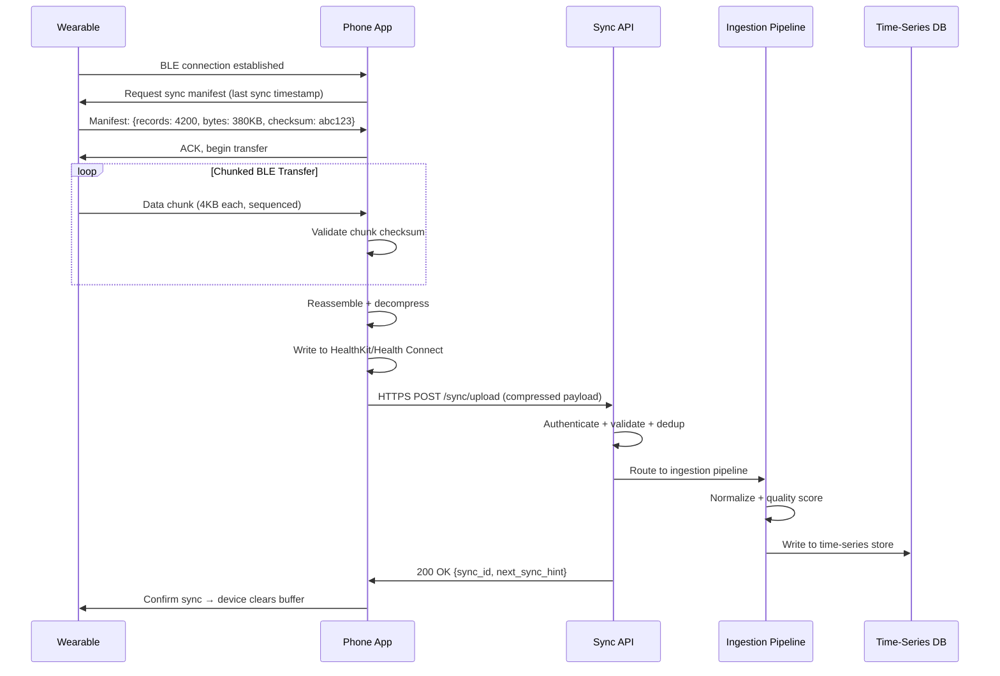
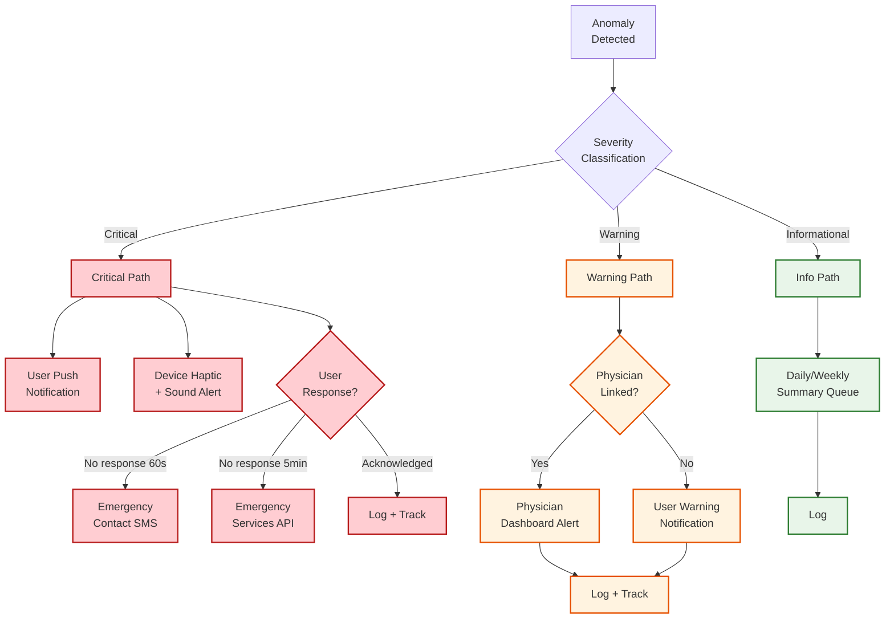
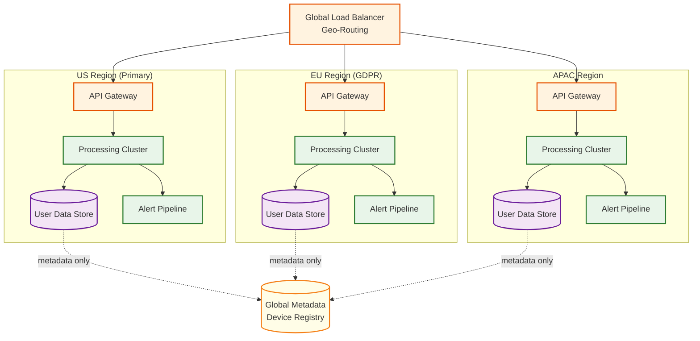

# High-Level Design — Wearable Health Monitoring Platform

## 1. System Architecture



---

## 2. Data Flow Architecture

### 2.1 Primary Data Flow: Sensor → Cloud → Insight



### 2.2 Critical Alert Fast Path



### 2.3 Data Sync Flow



---

## 3. Key Design Decisions

### 3.1 Phone-as-Gateway vs. Direct-to-Cloud

| Factor | Phone-as-Gateway | Direct-to-Cloud |
|---|---|---|
| **Power consumption** | Low — BLE is ~10x more efficient than Wi-Fi/cellular | High — requires on-device Wi-Fi/LTE radio |
| **Battery impact** | Minimal — leverages phone's existing radio | Significant — 2-5x battery drain increase |
| **Coverage** | Depends on phone proximity (BLE range ~30m) | Cellular coverage required |
| **Processing** | Phone provides secondary compute layer | All compute on device or cloud |
| **Latency** | Additional hop through phone | Direct connection, lower latency |
| **Cost** | No cellular modem needed on device | Requires embedded SIM + cellular modem |
| **Use case** | Consumer wearables (watch, band) | Medical-grade RPM devices |

**Decision:** Phone-as-gateway for consumer wearables (95% of devices); direct-to-cloud option for medical-grade RPM devices requiring continuous connectivity.

**Rationale:** BLE communication at ~10 mW vs. cellular at ~500 mW means 50x power efficiency. For a 300 mAh battery, this translates to 10+ days of battery life vs. ~2 days. The phone also provides a processing tier that offloads work from the constrained wearable hardware.

### 3.2 On-Device Inference vs. Cloud-Only Processing

| Factor | On-Device Inference | Cloud-Only Processing |
|---|---|---|
| **Alert latency** | < 500ms (no network dependency) | 5–30s (network + cloud processing) |
| **Privacy** | Raw signal never leaves device | All data transmitted to cloud |
| **Availability** | Works without phone/cloud | Requires connectivity for any analysis |
| **Model complexity** | Limited by MCU (256KB–2MB RAM) | Unlimited model size |
| **Accuracy** | Good for well-defined patterns | Higher accuracy with larger models |
| **Update frequency** | OTA firmware update (weeks/months) | Continuous model deployment |
| **Battery impact** | ~0.5 mW continuous inference | Zero on-device, but higher BLE/radio cost |

**Decision:** Hybrid approach — critical, time-sensitive detection (arrhythmia, fall) runs on-device; nuanced analysis (trend detection, subtle anomalies, health scoring) runs in cloud.

**Rationale:** Falls require sub-second response (to trigger emergency call); cloud round-trip cannot guarantee this. Meanwhile, longitudinal trend analysis requires weeks of data and population-scale models that don't fit on a wearable MCU.

### 3.3 Time-Series Storage Strategy

| Tier | Retention | Resolution | Storage Type | Access Pattern |
|---|---|---|---|---|
| **Hot** | 90 days | Full resolution (1 Hz HR, raw ECG) | SSD-backed time-series DB | Real-time dashboards, recent history |
| **Warm** | 1 year | 1-minute aggregates (min/max/avg/p50) | HDD-backed time-series DB | Weekly/monthly trend views |
| **Cold** | 5 years | 5-minute aggregates | Object storage with columnar format | Annual reports, research queries |
| **Archive** | 7+ years | 15-minute summaries | Compressed object storage | Regulatory compliance, legal |

**Decision:** Four-tier storage with automated continuous aggregation and tiered retention policies.

**Rationale:** A user's second-by-second heart rate from 3 years ago has no clinical value at full resolution, but the daily resting HR trend is invaluable for longitudinal analysis. Downsampling reduces storage costs by ~95% while preserving all analytically useful information.

### 3.4 Sensor Data Normalization Strategy

**Challenge:** 100+ wearable manufacturers produce heart rate data in different formats, sampling rates, units, and quality levels.

**Decision:** Canonical data model with device-specific adapter plugins.

```
Canonical Heart Rate Record:
{
  user_id:        "uuid",
  device_id:      "uuid",
  timestamp_ms:   1709942400000,
  heart_rate_bpm: 72,
  confidence:     0.95,        // 0.0-1.0 quality score
  source:         "ppg",       // ppg, ecg, manual
  context:        "resting",   // resting, active, sleep
  motion_level:   0.1,         // 0.0-1.0 motion intensity
  raw_rr_ms:      [833, 830, 835]  // Optional R-R intervals
}
```

Each device manufacturer implements an adapter that translates their proprietary format into this canonical schema. The confidence score is critical — it allows downstream analytics to weight high-quality readings more heavily and discard noise.

### 3.5 Alert Escalation Architecture



---

## 4. Component Interaction Patterns

### 4.1 Event-Driven Architecture

The platform uses an event streaming backbone for inter-service communication:

| Event | Producer | Consumers | Priority |
|---|---|---|---|
| `sensor.data.received` | Ingestion Pipeline | Vitals Services, Trend Engine | Normal |
| `alert.critical.detected` | Anomaly Engine | Alert Service, Notification Service | Critical |
| `alert.warning.detected` | Anomaly Engine | Alert Service, Trend Engine | High |
| `baseline.updated` | Baseline Engine | Anomaly Engine, Health Score | Normal |
| `sync.completed` | Sync API | Trend Engine, Activity Service | Normal |
| `device.registered` | Device Service | Profile Service, Consent Service | Normal |
| `consent.changed` | Consent Service | All data-accessing services | High |
| `ecg.recording.uploaded` | ECG Service | Clinical Report Generator, FHIR Gateway | High |

### 4.2 Service Communication Matrix

| Pattern | Use Case | Protocol |
|---|---|---|
| **Synchronous RPC** | User-facing API calls (get vitals, get trends) | gRPC with deadline propagation |
| **Async Event** | Sensor data processing, alert generation | Event streaming platform |
| **Pub/Sub** | Multi-consumer notifications (consent changes affect all services) | Event streaming with consumer groups |
| **Request-Reply** | Cloud-side anomaly confirmation (second opinion on device alert) | gRPC with 5s timeout |
| **Batch** | Daily health score computation, population analytics | Scheduled batch with data lake |

---

## 5. Deployment Architecture

### 5.1 Multi-Region Deployment



**Key Principle:** PHI data never crosses regional boundaries. EU user health data stays in the EU region. Only de-identified metadata (device registry, feature flags, ML model versions) replicates globally.

### 5.2 Capacity Planning by Region

| Region | Users | Daily Sync Volume | Alert Pipeline Capacity |
|---|---|---|---|
| **US** | 40M | 9.6 TB/day | 4,000 alerts/sec |
| **EU** | 30M | 7.2 TB/day | 3,000 alerts/sec |
| **APAC** | 20M | 4.8 TB/day | 2,000 alerts/sec |
| **Other** | 10M | 2.4 TB/day | 1,000 alerts/sec |

---

## 6. Technology Selection Rationale

| Decision | Choice | Why Not Alternatives |
|---|---|---|
| **Device-to-phone** | BLE 5.x | Wi-Fi (10x power), cellular (50x power, adds BOM cost) |
| **Phone-to-cloud** | HTTPS/2 with gRPC | MQTT (adds complexity, phone already has HTTP stack) |
| **Medical device-to-cloud** | MQTT with QoS 2 | HTTPS (no persistent connection for continuous monitoring) |
| **Stream processing** | Managed stream processing | Batch-only (unacceptable latency for alerts) |
| **Time-series storage** | Purpose-built TSDB | Relational DB (cannot handle write throughput at scale) |
| **Clinical integration** | FHIR R4 REST API | Custom API (EHR vendors mandate FHIR compliance) |
| **ML inference (device)** | INT8 quantized TinyML | Float32 models (exceed MCU memory constraints) |
| **ML inference (cloud)** | GPU-accelerated inference | CPU-only (ECG analysis latency unacceptable) |
| **Notification delivery** | Multi-channel (push + SMS + email) | Push-only (unreliable for critical health alerts) |

---

*Next: [Low-Level Design →](./03-low-level-design.md)*
