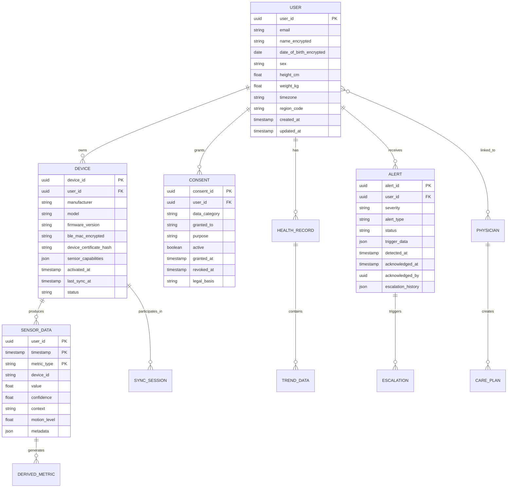

# Low-Level Design — Wearable Health Monitoring Platform

## 1. Data Models

### 1.1 Core Entity Relationship



### 1.2 Time-Series Data Schema

**Heart Rate Time-Series Table:**

| Column | Type | Description |
|---|---|---|
| `user_id` | UUID | Partition key |
| `timestamp` | TIMESTAMP | Nanosecond precision, sort key |
| `heart_rate_bpm` | SMALLINT | Heart rate in beats per minute |
| `confidence` | FLOAT | Signal quality score (0.0–1.0) |
| `source` | ENUM | `ppg`, `ecg`, `manual` |
| `context` | ENUM | `resting`, `active`, `sleep`, `recovery` |
| `motion_level` | FLOAT | Accelerometer-derived motion intensity |
| `device_id` | UUID | Source device identifier |
| `rr_intervals_ms` | ARRAY[INT] | Optional R-R intervals for HRV |

**Continuous Aggregation (Automatic Downsampling):**

```
-- 1-minute aggregates (created automatically)
heart_rate_1min:
  user_id, bucket_start (1 min),
  hr_min, hr_max, hr_avg, hr_p50,
  confidence_avg, sample_count,
  context_mode (most frequent context)

-- 1-hour aggregates
heart_rate_1hour:
  user_id, bucket_start (1 hour),
  hr_min, hr_max, hr_avg, hr_p50,
  resting_hr (min during low-motion periods),
  sample_count, confidence_avg

-- 1-day aggregates
heart_rate_1day:
  user_id, bucket_start (1 day),
  resting_hr, max_hr, avg_hr,
  hr_zones (time in each HR zone),
  hrv_rmssd_avg, hrv_sdnn_avg
```

### 1.3 ECG Recording Schema

| Column | Type | Description |
|---|---|---|
| `recording_id` | UUID | Primary key |
| `user_id` | UUID | Owner |
| `device_id` | UUID | Source device |
| `started_at` | TIMESTAMP | Recording start time |
| `duration_ms` | INT | Recording duration |
| `sampling_rate_hz` | INT | Typically 512 Hz |
| `lead_config` | ENUM | `single_lead_I`, `single_lead_II` |
| `samples` | BLOB | Compressed INT16 array of voltage samples |
| `signal_quality` | FLOAT | Overall recording quality score |
| `device_classification` | JSON | On-device ML result (e.g., `{afib_probability: 0.02}`) |
| `cloud_classification` | JSON | Cloud ML result (populated async) |
| `clinical_review_status` | ENUM | `pending`, `reviewed`, `flagged` |
| `reviewed_by` | UUID | Physician who reviewed (if applicable) |

### 1.4 Alert Schema

| Column | Type | Description |
|---|---|---|
| `alert_id` | UUID | Primary key |
| `user_id` | UUID | Alert recipient |
| `device_id` | UUID | Source device |
| `severity` | ENUM | `critical`, `warning`, `informational` |
| `alert_type` | ENUM | `arrhythmia`, `fall`, `spo2_low`, `hr_high`, `hr_low`, `temp_high`, `trend_change` |
| `status` | ENUM | `active`, `acknowledged`, `dismissed`, `escalated`, `resolved` |
| `detected_at` | TIMESTAMP | When anomaly was first detected |
| `trigger_data` | JSON | Sensor readings that triggered the alert |
| `confidence` | FLOAT | ML model confidence score |
| `on_device_classification` | JSON | Device-side classification result |
| `cloud_classification` | JSON | Cloud-side confirmation result |
| `acknowledged_at` | TIMESTAMP | When user acknowledged |
| `escalation_history` | JSON | Array of escalation steps taken |
| `resolution_notes` | TEXT | Clinical notes (if physician reviewed) |

---

## 2. API Contracts

### 2.1 Data Sync API

**Upload Sensor Data:**

```
POST /api/v1/sync/upload
Authorization: Bearer {user_token}
X-Device-ID: {device_uuid}
X-Sync-Session: {session_uuid}
Content-Type: application/octet-stream
Content-Encoding: gzip

Request Body: Compressed binary payload containing:
{
  "device_id": "uuid",
  "sync_session_id": "uuid",
  "last_sync_timestamp": 1709942400000,
  "payload_checksum": "sha256:abc123...",
  "records": [
    {
      "metric_type": "heart_rate",
      "timestamp_ms": 1709942401000,
      "value": 72,
      "confidence": 0.95,
      "context": "resting",
      "motion_level": 0.05
    },
    {
      "metric_type": "spo2",
      "timestamp_ms": 1709942460000,
      "value": 98,
      "confidence": 0.92
    }
  ],
  "ecg_recordings": [ ... ],
  "activity_summaries": [ ... ]
}

Response 200:
{
  "sync_id": "uuid",
  "records_accepted": 4200,
  "records_deduplicated": 12,
  "records_rejected": 3,
  "rejected_details": [
    {"index": 142, "reason": "timestamp_before_device_activation"}
  ],
  "next_sync_hint_seconds": 900,
  "firmware_update_available": false,
  "model_update_available": true,
  "model_update_url": "/api/v1/models/arrhythmia/v2.3"
}
```

### 2.2 Critical Alert API

**Submit Critical Alert (Fast Path):**

```
POST /api/v1/alerts/critical
Authorization: Bearer {user_token}
X-Priority: critical
X-Device-ID: {device_uuid}

Request Body:
{
  "alert_type": "arrhythmia_suspected",
  "detected_at_ms": 1709942401000,
  "device_classification": {
    "model_version": "afib_v2.1",
    "probability": 0.87,
    "heart_rate_bpm": 142,
    "rhythm_irregularity_score": 0.91
  },
  "context": {
    "activity_state": "resting",
    "motion_level": 0.02,
    "signal_quality": 0.94,
    "battery_percent": 67
  },
  "supporting_data": {
    "rr_intervals_ms": [612, 843, 521, 789, 634, 902, ...],
    "ppg_waveform_window": "base64_encoded_30s_ppg_data"
  }
}

Response 200:
{
  "alert_id": "uuid",
  "status": "received",
  "cloud_confirmation_pending": true,
  "estimated_confirmation_ms": 3000,
  "escalation_plan": "user_notification → 60s → emergency_contact → 300s → emergency_services"
}
```

### 2.3 Vitals Query API

**Get Recent Heart Rate:**

```
GET /api/v1/users/{user_id}/vitals/heart-rate
  ?start=2024-03-08T00:00:00Z
  &end=2024-03-09T00:00:00Z
  &resolution=1min
  &include_confidence=true
Authorization: Bearer {token}

Response 200:
{
  "user_id": "uuid",
  "metric": "heart_rate",
  "resolution": "1min",
  "timezone": "America/New_York",
  "data_points": [
    {
      "timestamp": "2024-03-08T00:00:00Z",
      "value": 62,
      "min": 58,
      "max": 67,
      "confidence_avg": 0.96,
      "sample_count": 58,
      "context": "sleep"
    },
    ...
  ],
  "summary": {
    "resting_hr": 58,
    "max_hr": 156,
    "avg_hr": 74,
    "total_samples": 82400,
    "coverage_percent": 95.3
  }
}
```

### 2.4 Health Score API

**Get Health Score:**

```
GET /api/v1/users/{user_id}/health-score
  ?date=2024-03-08
Authorization: Bearer {token}

Response 200:
{
  "user_id": "uuid",
  "date": "2024-03-08",
  "overall_score": 82,
  "components": {
    "cardiovascular": {
      "score": 85,
      "factors": {
        "resting_hr_trend": "stable",
        "hrv_trend": "improving",
        "recovery_hr": "good"
      }
    },
    "sleep": {
      "score": 74,
      "factors": {
        "duration_hours": 6.8,
        "deep_sleep_percent": 18,
        "sleep_efficiency": 0.89,
        "consistency": "moderate"
      }
    },
    "activity": {
      "score": 90,
      "factors": {
        "active_minutes": 45,
        "steps": 9200,
        "exercise_sessions": 1
      }
    },
    "recovery": {
      "score": 78,
      "factors": {
        "hrv_morning": 42,
        "resting_hr_deviation": "+2 bpm from baseline",
        "skin_temp_deviation": "+0.1°C"
      }
    }
  },
  "trend_7day": [80, 82, 79, 85, 81, 83, 82],
  "percentile_age_sex": 72,
  "insights": [
    "Your HRV has improved 12% this week, suggesting better recovery",
    "Sleep duration is below your 7.5-hour baseline"
  ]
}
```

### 2.5 FHIR Integration API

**Get Patient Observations (FHIR R4):**

```
GET /fhir/r4/Observation
  ?patient={fhir_patient_id}
  &category=vital-signs
  &code=8867-4  (heart rate LOINC code)
  &date=ge2024-03-01&date=le2024-03-08
  &_count=100
Authorization: Bearer {fhir_token}

Response 200 (FHIR Bundle):
{
  "resourceType": "Bundle",
  "type": "searchset",
  "total": 1440,
  "entry": [
    {
      "resource": {
        "resourceType": "Observation",
        "id": "obs-hr-20240308-001",
        "status": "final",
        "category": [{
          "coding": [{"system": "http://terminology.hl7.org/CodeSystem/observation-category", "code": "vital-signs"}]
        }],
        "code": {
          "coding": [{"system": "http://loinc.org", "code": "8867-4", "display": "Heart rate"}]
        },
        "subject": {"reference": "Patient/{fhir_patient_id}"},
        "effectiveDateTime": "2024-03-08T08:00:00Z",
        "valueQuantity": {
          "value": 72,
          "unit": "beats/minute",
          "system": "http://unitsofmeasure.org",
          "code": "/min"
        },
        "device": {"reference": "Device/{fhir_device_id}"}
      }
    }
  ]
}
```

### 2.6 Device Management API

**Register Device:**

```
POST /api/v1/devices/register
Authorization: Bearer {user_token}

Request Body:
{
  "manufacturer": "acme_health",
  "model": "health_band_pro",
  "serial_number_encrypted": "enc:abc123...",
  "firmware_version": "3.2.1",
  "sensor_capabilities": ["ppg", "ecg", "accelerometer", "spo2", "temperature"],
  "ble_mac_encrypted": "enc:AA:BB:CC:DD:EE:FF",
  "device_certificate": "-----BEGIN CERTIFICATE-----\n..."
}

Response 201:
{
  "device_id": "uuid",
  "activation_status": "active",
  "sync_config": {
    "default_interval_seconds": 900,
    "batch_size_max_kb": 512,
    "priority_alert_enabled": true,
    "sensor_profiles": {
      "normal": {"hr_rate": "1hz", "spo2_rate": "4_per_hour", "accel_rate": "50hz_summarized"},
      "clinical": {"hr_rate": "1hz", "spo2_rate": "continuous", "ecg_rate": "on_demand"},
      "battery_saver": {"hr_rate": "0.1hz", "spo2_rate": "1_per_hour", "accel_rate": "10hz_summarized"}
    }
  },
  "ml_models": {
    "arrhythmia": {"version": "2.1", "url": "/api/v1/models/arrhythmia/v2.1"},
    "fall_detection": {"version": "1.4", "url": "/api/v1/models/fall/v1.4"}
  }
}
```

---

## 3. Core Algorithms

### 3.1 On-Device Arrhythmia Detection (TinyML)

```
ALGORITHM OnDeviceArrhythmiaDetection(ppg_buffer, accel_buffer)
  // Step 1: Motion artifact assessment
  motion_energy = ComputeRMS(accel_buffer, window=3sec)
  IF motion_energy > MOTION_THRESHOLD THEN
    RETURN {detected: false, reason: "high_motion", confidence: 0}
  END IF

  // Step 2: Extract R-R intervals from PPG
  peaks = DetectPPGPeaks(ppg_buffer, sampling_rate=25Hz)
  rr_intervals = ComputeInterPeakIntervals(peaks)

  IF LENGTH(rr_intervals) < 10 THEN
    RETURN {detected: false, reason: "insufficient_beats", confidence: 0}
  END IF

  // Step 3: Irregularity features (runs on MCU)
  rmssd = ComputeRMSSD(rr_intervals)
  pnn50 = ComputePNN50(rr_intervals)
  entropy = ComputeSampleEntropy(rr_intervals, m=2, r=0.2)
  successive_diff_cv = StdDev(SuccessiveDifferences(rr_intervals)) / Mean(rr_intervals)

  // Step 4: TinyML inference (INT8 quantized neural network)
  features = [rmssd, pnn50, entropy, successive_diff_cv,
              Mean(rr_intervals), StdDev(rr_intervals),
              motion_energy, signal_quality]

  afib_probability = TinyMLInference(AFIB_MODEL_INT8, features)

  // Step 5: Decision with hysteresis
  IF afib_probability > 0.85 AND consecutive_detections >= 3 THEN
    TriggerCriticalAlert("arrhythmia_suspected", {
      probability: afib_probability,
      rr_intervals: rr_intervals,
      signal_quality: 1.0 - motion_energy,
      detection_window_seconds: 30
    })
    RETURN {detected: true, probability: afib_probability}
  END IF

  // Update consecutive detection counter
  IF afib_probability > 0.70 THEN
    consecutive_detections += 1
  ELSE
    consecutive_detections = 0
  END IF

  RETURN {detected: false, probability: afib_probability}
END ALGORITHM
```

### 3.2 Fall Detection Algorithm

```
ALGORITHM FallDetection(accel_stream, gyro_stream)
  // Continuous monitoring state machine
  STATE = MONITORING

  WHILE device_active DO
    accel = ReadAccelerometer()  // 50 Hz
    magnitude = Sqrt(accel.x² + accel.y² + accel.z²)

    SWITCH STATE:
      CASE MONITORING:
        // Phase 1: Free-fall detection (near-zero g)
        IF magnitude < FREE_FALL_THRESHOLD (0.4g) THEN
          free_fall_start = CurrentTimestamp()
          STATE = FREE_FALL_DETECTED
        END IF

      CASE FREE_FALL_DETECTED:
        free_fall_duration = CurrentTimestamp() - free_fall_start

        // Phase 2: Impact detection (high g spike)
        IF magnitude > IMPACT_THRESHOLD (3.0g) THEN
          impact_magnitude = magnitude
          impact_timestamp = CurrentTimestamp()
          STATE = IMPACT_DETECTED
        ELSE IF free_fall_duration > MAX_FREE_FALL_MS (1000) THEN
          STATE = MONITORING  // Too long for a fall
        END IF

      CASE IMPACT_DETECTED:
        // Phase 3: Post-impact immobility check
        post_impact_motion = CollectMotionWindow(duration=10sec)
        avg_motion = Mean(Abs(post_impact_motion - 1.0g))

        orientation_change = ComputeOrientationChange(
          pre_fall_orientation, current_orientation)

        IF avg_motion < IMMOBILITY_THRESHOLD (0.1g)
           AND orientation_change > 45_DEGREES THEN
          // High confidence fall with immobility
          fall_confidence = ComputeFallConfidence(
            free_fall_duration, impact_magnitude,
            avg_motion, orientation_change)

          TriggerFallAlert(fall_confidence, {
            free_fall_ms: free_fall_duration,
            impact_g: impact_magnitude,
            post_impact_motion: avg_motion,
            orientation_change_deg: orientation_change
          })

          STATE = AWAITING_USER_RESPONSE
        ELSE
          STATE = MONITORING  // Impact but user is moving → not a fall
        END IF

      CASE AWAITING_USER_RESPONSE:
        // Wait for user acknowledgment or auto-escalate
        IF UserRespondedWithin(60_SECONDS) THEN
          IF user_response == "I_FELL" THEN
            LogConfirmedFall()
          ELSE
            LogFalseAlarm()  // Feedback for model improvement
          END IF
          STATE = MONITORING
        ELSE
          // No response → escalate to emergency contacts
          EscalateToEmergencyContacts()
          STATE = EMERGENCY_ESCALATED
        END IF
    END SWITCH
  END WHILE
END ALGORITHM
```

### 3.3 Adaptive Duty Cycling (Battery-Aware Sampling)

```
ALGORITHM AdaptiveDutyCycling(battery_level, activity_state, clinical_mode)
  // Priority-based sensor scheduling

  // Clinical mode overrides all battery optimization
  IF clinical_mode == ACTIVE THEN
    RETURN CLINICAL_PROFILE  // Full-rate sampling, no power saving
  END IF

  // Determine base profile from battery level
  IF battery_level > 50% THEN
    base_profile = NORMAL
  ELSE IF battery_level > 20% THEN
    base_profile = CONSERVATIVE
  ELSE IF battery_level > 5% THEN
    base_profile = MINIMAL
  ELSE
    base_profile = CRITICAL_ONLY
  END IF

  // Apply activity-based modifications
  SWITCH activity_state:
    CASE SLEEPING:
      hr_rate = base_profile.sleep_hr_rate      // 1 Hz or lower
      accel_rate = base_profile.sleep_accel_rate // 10 Hz (sleep staging)
      spo2_rate = base_profile.sleep_spo2_rate   // Every 5 min
      ecg_enabled = false

    CASE RESTING:
      hr_rate = base_profile.rest_hr_rate        // 1 Hz
      accel_rate = 10  // Hz, minimal
      spo2_rate = base_profile.rest_spo2_rate    // Every 15 min
      ecg_enabled = true  // On-demand

    CASE ACTIVE_EXERCISE:
      hr_rate = MAX(base_profile.active_hr_rate, 1)  // At least 1 Hz
      accel_rate = 50  // Hz, full rate for activity classification
      spo2_rate = CONTINUOUS  // During exercise
      ecg_enabled = false  // Motion artifacts make ECG unreliable

    CASE STATIONARY_UNKNOWN:
      hr_rate = base_profile.default_hr_rate
      accel_rate = 25  // Hz, moderate
      spo2_rate = base_profile.default_spo2_rate
      ecg_enabled = true
  END SWITCH

  // Critical alerts always enabled regardless of battery
  fall_detection_enabled = true  // Cannot be disabled
  arrhythmia_detection_enabled = (battery_level > 3%)

  // BLE sync frequency adapts to battery
  IF battery_level > 30% THEN
    sync_interval = 15_MINUTES
  ELSE IF battery_level > 10% THEN
    sync_interval = 60_MINUTES
  ELSE
    sync_interval = ON_CRITICAL_ALERT_ONLY
  END IF

  RETURN SensorProfile(hr_rate, accel_rate, spo2_rate,
                        ecg_enabled, sync_interval,
                        fall_detection_enabled, arrhythmia_detection_enabled)
END ALGORITHM
```

### 3.4 Personalized Baseline Computation

```
ALGORITHM ComputePersonalizedBaseline(user_id, metric_type, window_days=14)
  // Fetch historical data with quality filtering
  raw_data = FetchTimeSeries(user_id, metric_type,
                             start=NOW - window_days, end=NOW)

  // Step 1: Filter by quality
  quality_data = FILTER(raw_data, WHERE confidence >= 0.8
                        AND motion_level < 0.3
                        AND context == "resting")

  IF COUNT(quality_data) < MIN_SAMPLES (100) THEN
    RETURN {baseline: POPULATION_DEFAULT, confidence: "low", source: "population"}
  END IF

  // Step 2: Remove outliers (Tukey's fences)
  q1 = Percentile(quality_data.values, 25)
  q3 = Percentile(quality_data.values, 75)
  iqr = q3 - q1
  lower_fence = q1 - 1.5 * iqr
  upper_fence = q3 + 1.5 * iqr
  filtered = FILTER(quality_data, WHERE value BETWEEN lower_fence AND upper_fence)

  // Step 3: Compute time-weighted baseline
  // Recent data weighted more heavily (exponential decay)
  decay_rate = 0.1  // per day
  weighted_sum = 0
  weight_total = 0
  FOR EACH point IN filtered DO
    days_ago = (NOW - point.timestamp) / ONE_DAY
    weight = Exp(-decay_rate * days_ago)
    weighted_sum += point.value * weight
    weight_total += weight
  END FOR
  baseline_value = weighted_sum / weight_total

  // Step 4: Compute normal range (personalized standard deviation)
  deviations = [Abs(p.value - baseline_value) FOR p IN filtered]
  personal_stddev = WeightedStdDev(deviations, same_weights)

  // Step 5: Trend detection (linear regression on daily averages)
  daily_avgs = GroupByDay(filtered, aggregate=Mean)
  trend_slope = LinearRegression(daily_avgs).slope
  trend_significant = Abs(trend_slope) > (personal_stddev * 0.05)

  RETURN {
    baseline: baseline_value,
    normal_range: [baseline_value - 2*personal_stddev,
                   baseline_value + 2*personal_stddev],
    stddev: personal_stddev,
    trend_slope: trend_slope,
    trend_direction: IF trend_slope > 0 THEN "rising" ELSE "falling",
    trend_significant: trend_significant,
    confidence: ComputeConfidence(COUNT(filtered), window_days),
    last_updated: NOW
  }
END ALGORITHM
```

### 3.5 Multi-Device Data Fusion

```
ALGORITHM MultiDeviceDataFusion(user_id, metric_type, time_window)
  // User may have multiple devices (watch + ring + chest strap)
  devices = GetActiveDevices(user_id)

  IF COUNT(devices) == 1 THEN
    RETURN FetchTimeSeries(user_id, metric_type, time_window, device=devices[0])
  END IF

  // Fetch data from all devices
  device_streams = {}
  FOR EACH device IN devices DO
    device_streams[device.id] = FetchTimeSeries(
      user_id, metric_type, time_window, device=device.id)
  END FOR

  // Determine device priority based on sensor quality for this metric
  device_priority = RankDevicesByMetricQuality(devices, metric_type)
  // e.g., chest strap > watch > ring for heart rate during exercise

  // Merge with confidence-weighted fusion
  fused_timeline = []
  FOR EACH timestamp IN UnionTimestamps(device_streams) DO
    readings = GetReadingsAtTimestamp(device_streams, timestamp, tolerance=2sec)

    IF COUNT(readings) == 1 THEN
      fused_timeline.APPEND(readings[0])
    ELSE
      // Multiple readings: weighted average by confidence × device_priority
      weighted_value = 0
      total_weight = 0
      FOR EACH reading IN readings DO
        weight = reading.confidence * device_priority[reading.device_id]
        weighted_value += reading.value * weight
        total_weight += weight
      END FOR

      fused_reading = {
        timestamp: timestamp,
        value: weighted_value / total_weight,
        confidence: MAX(r.confidence FOR r IN readings),
        source: "fused",
        contributing_devices: [r.device_id FOR r IN readings]
      }
      fused_timeline.APPEND(fused_reading)
    END IF
  END FOR

  RETURN fused_timeline
END ALGORITHM
```

---

## 4. Sync Protocol Design

### 4.1 BLE Sync State Machine

```mermaid
statechart-v2
    [*] --> Disconnected
    Disconnected --> Connecting : BLE scan finds paired device
    Connecting --> Connected : BLE connection established
    Connected --> Authenticating : Exchange session tokens
    Authenticating --> SyncReady : Auth verified
    Authenticating --> Disconnected : Auth failed
    SyncReady --> Transferring : Begin data transfer
    Transferring --> Transferring : Chunk ACK received
    Transferring --> SyncComplete : All chunks transferred
    Transferring --> SyncInterrupted : BLE disconnect
    SyncInterrupted --> Connecting : Auto-reconnect
    SyncComplete --> Verifying : Checksum validation
    Verifying --> Confirmed : Server confirms receipt
    Verifying --> Transferring : Checksum mismatch → retransmit
    Confirmed --> BufferCleared : Device clears synced data
    BufferCleared --> Idle : Sync cycle complete
    Idle --> SyncReady : Next sync interval
    Idle --> Disconnected : User moves out of range
```

### 4.2 Sync Conflict Resolution

```
ALGORITHM ResolveSyncConflict(server_data, incoming_data)
  // Conflicts arise when data arrives out of order or from multiple devices

  FOR EACH record IN incoming_data DO
    existing = LookupByKey(server_data,
                           user_id=record.user_id,
                           timestamp=record.timestamp,
                           metric_type=record.metric_type)

    IF existing IS NULL THEN
      // No conflict — insert
      INSERT(record)

    ELSE IF existing.device_id == record.device_id THEN
      // Same device, same timestamp — exact duplicate
      // Keep existing (idempotent), increment dedup counter
      IncrementDedupCounter(record)

    ELSE
      // Different device, same timestamp — multi-device conflict
      // Keep the reading with higher confidence
      IF record.confidence > existing.confidence THEN
        UPDATE(existing, record)
        ArchiveOverwritten(existing)
      ELSE
        ArchiveOverwritten(record)
      END IF
      // Also store as fused data point for multi-device users
      StoreFusedReading(existing, record)
    END IF
  END FOR
END ALGORITHM
```

---

## 5. On-Device Storage Layout

```
Flash Storage Layout (4 MB total):
┌─────────────────────────────────────────┐
│ Firmware + ML Models (1.5 MB)           │
│ ├── Application firmware (800 KB)       │
│ ├── Arrhythmia model INT8 (200 KB)      │
│ ├── Fall detection model INT8 (150 KB)  │
│ ├── Activity classifier INT8 (100 KB)   │
│ └── OTA staging area (250 KB)           │
├─────────────────────────────────────────┤
│ Sensor Data Buffer (2 MB circular)      │
│ ├── Priority ring: Critical alerts      │
│ │   (never overwritten, 128 KB)         │
│ ├── Clinical ring: ECG recordings       │
│ │   (FIFO, 512 KB)                      │
│ ├── Standard ring: HR, SpO2, temp       │
│ │   (circular, 1 MB)                    │
│ └── Activity ring: Accel summaries      │
│     (circular, 384 KB)                  │
├─────────────────────────────────────────┤
│ Device State (256 KB)                   │
│ ├── Sync manifest + cursors (64 KB)     │
│ ├── User preferences (32 KB)            │
│ ├── Baseline cache (64 KB)              │
│ └── Audit log (96 KB)                   │
├─────────────────────────────────────────┤
│ Reserved / Wear leveling (256 KB)       │
└─────────────────────────────────────────┘

Buffer eviction policy (when storage pressure):
1. NEVER evict: Priority ring (critical alerts)
2. Last evict: Clinical ring (ECG recordings)
3. Standard eviction: Downsample standard ring (keep every Nth sample)
4. First evict: Activity ring (reconstructable from cloud if synced)
```

---

*Next: [Deep Dive & Bottlenecks →](./04-deep-dive-and-bottlenecks.md)*
