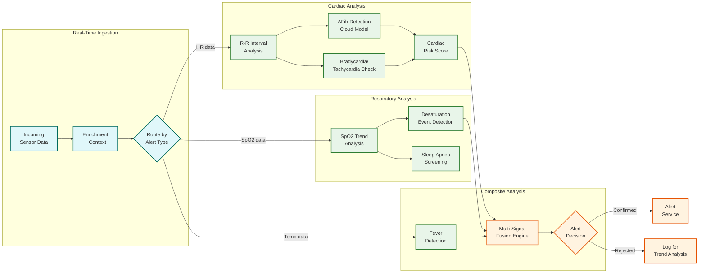

# Deep Dive & Bottlenecks — Wearable Health Monitoring Platform

## 1. Data Sync Engine Deep Dive

### 1.1 The Sync Challenge at Scale

The data sync engine is the platform's circulatory system—it must reliably transfer sensor data from 100M+ wearable devices through phone gateways to cloud storage, handling BLE instability, phone OS background restrictions, network variability, and massive concurrent sync storms during peak hours.

**Core Challenges:**
- **BLE fragility**: BLE connections drop frequently (phone moved out of range, interference, OS killed background app). A sync session must be resumable without re-transferring completed chunks.
- **Morning sync storm**: 70% of daily syncs cluster in two 3-hour windows (6–9 AM, 8–11 PM local time). With 24 time zones, the global peak is smoothed but regional peaks hit ~54 syncs/sec per zone.
- **Ordering guarantees**: Data may arrive out of order—overnight sleep data syncing in the morning while real-time heart rate data streams simultaneously.
- **Exactly-once semantics**: Duplicate data inflates storage and corrupts analytics (double-counted steps, averaged heart rate pulled toward duplicated values).

### 1.2 Sync Session Architecture

```
SYNC SESSION LIFECYCLE:

1. DISCOVERY
   Phone scans for paired wearable BLE advertisement
   Establishes BLE connection with encrypted link layer

2. HANDSHAKE
   Exchange sync manifest:
   - Device: {last_confirmed_sync_ts, pending_records_count, pending_bytes, buffer_pressure}
   - Phone: {last_known_sync_ts, available_upload_bandwidth, battery_status}

3. NEGOTIATION
   Determine transfer strategy:
   - Full sync: All data since last confirmed sync
   - Delta sync: Only new data since last partial sync
   - Priority sync: Critical alerts first, then clinical, then standard

4. CHUNKED TRANSFER
   Data transferred in 4 KB chunks with per-chunk CRC-16
   Each chunk ACKed before next sent
   Chunk sequence numbers enable resume after disconnection

5. PHONE-SIDE PROCESSING
   Decompress and validate complete payload
   Write to HealthKit/Health Connect (platform integration)
   Queue for cloud upload

6. CLOUD UPLOAD
   Compress payload (gzip, ~3:1 ratio)
   HTTPS POST to sync ingestion API
   Receive server-side dedup report

7. CONFIRMATION
   Phone sends confirmation to wearable
   Wearable marks synced data as evictable in circular buffer
```

### 1.3 Handling Phone OS Background Restrictions

Modern mobile operating systems aggressively limit background execution, which directly impacts sync reliability:

| OS Restriction | Impact | Mitigation |
|---|---|---|
| **iOS background app refresh** | App may have only 30s of background execution time | Use BLE background mode + BGTaskScheduler for extended sync |
| **Android Doze mode** | Network access restricted when phone idle | Use foreground service during active sync; leverage Health Connect background sync API |
| **Battery optimization** | OS may kill background sync process | Request battery optimization exemption; implement partial sync resume |
| **BLE background scanning** | Reduced scan frequency when app backgrounded | Use BLE peripheral advertisement (device advertises, phone listens) |

**Architectural Mitigation:** The sync protocol is designed to be interruptible and resumable at any point. Each 4 KB chunk is independently verified, so a sync interrupted at 60% completion resumes at chunk N+1, not from the beginning. The wearable device maintains a sync cursor (last confirmed chunk ID) that persists across BLE disconnections.

### 1.4 Deduplication Strategy

```
Three-layer deduplication:

Layer 1: Device-Side Sequence Numbers
  Each record stamped with monotonic device_sequence_id
  Phone tracks last received sequence per device
  Duplicate BLE transmissions detected by sequence overlap

Layer 2: Phone-Side Hash Check
  Phone maintains rolling hash window of last 10K records
  New records checked against window before queueing upload
  Catches duplicates from BLE retransmission + app restart

Layer 3: Server-Side Idempotency
  Composite dedup key: (user_id, device_id, metric_type, timestamp_ms)
  Ingestion pipeline checks key existence before write
  Upsert semantics: if key exists, compare confidence scores
  Higher confidence replaces lower; equal confidence keeps first
```

---

## 2. Anomaly Detection Engine Deep Dive

### 2.1 Two-Tier Detection Architecture

The anomaly detection system operates across two tiers with fundamentally different constraints:

**Tier 1: On-Device Detection (Latency-Critical)**
- Runs on microcontroller with 256 KB–2 MB RAM
- Models quantized to INT8 (200–300 KB model size)
- Detection latency: < 500ms
- Power budget: < 1 mW average
- Focus: high-confidence binary classification (arrhythmia: yes/no, fall: yes/no)

**Tier 2: Cloud Detection (Accuracy-Critical)**
- Runs on GPU-accelerated inference cluster
- Full-precision models (50–500 MB model size)
- Detection latency: 1–5 seconds
- No power constraint
- Focus: nuanced multi-class classification, trend analysis, context-aware scoring

### 2.2 On-Device Arrhythmia Detection Pipeline

```
PPG Signal Flow (25 Hz continuous):

Raw PPG → Bandpass Filter (0.5-8 Hz)
       → Motion Artifact Rejection (accelerometer gating)
       → Peak Detection (adaptive threshold)
       → R-R Interval Extraction
       → Feature Computation (sliding 30-second window):
           - RMSSD (root mean square of successive differences)
           - pNN50 (% of successive intervals > 50ms apart)
           - Sample Entropy
           - Coefficient of variation of successive differences
       → TinyML Inference (INT8 quantized NN)
       → Hysteresis Filter (3 consecutive positive detections required)
       → Alert Decision
```

**Motion Artifact Rejection Detail:**

PPG sensors measure blood volume changes by detecting light absorption. When the wrist moves, the sensor-skin interface shifts, creating artifacts that dwarf the physiological signal. The motion artifact rejection pipeline:

1. **Accelerometer gating**: Compute instantaneous motion energy from 3-axis accelerometer. If motion energy exceeds threshold, mark PPG readings as "low confidence" but don't discard—some motion patterns (walking) have periodic acceleration that can be modeled.

2. **Adaptive noise cancellation**: Use accelerometer signal as reference noise input. Apply Normalized Least Mean Squares (NLMS) adaptive filter to subtract motion-correlated components from PPG signal.

3. **Signal quality index (SQI)**: Compute per-beat SQI from:
   - Pulse amplitude consistency (beat-to-beat amplitude shouldn't vary > 30%)
   - Template matching (correlation of each beat with learned normal morphology)
   - Spectral analysis (cardiac frequency band should dominate)

4. **Confidence propagation**: Each heart rate reading carries its SQI as a confidence score. Downstream analytics weight high-SQI readings more heavily.

### 2.3 Cloud Anomaly Detection Pipeline



### 2.4 False Positive Management

Alert fatigue is the greatest threat to user trust and clinical utility. A platform generating too many false alerts will be muted and ignored—defeating the purpose.

**False Positive Reduction Strategies:**

| Strategy | Description | Impact |
|---|---|---|
| **Hysteresis filtering** | Require 3+ consecutive detections before alerting | Eliminates single-beat artifacts; reduces FP by ~60% |
| **Context-aware thresholds** | Different thresholds during exercise, sleep, post-meal | Prevents exercise-induced high HR from triggering resting-state alerts |
| **Personalized baselines** | Alert thresholds based on individual's 14-day baseline, not population norms | User with resting HR of 55 isn't alerted at 60 BPM |
| **Multi-signal confirmation** | Confirm single-sensor alerts with corroborating signals | SpO2 drop + elevated HR = higher confidence than SpO2 drop alone |
| **Temporal consistency** | Anomaly must persist for minimum duration (30s for HR, 60s for SpO2) | Eliminates transient artifacts from sensor adjustment |
| **Cloud second opinion** | On-device alert confirmed or overridden by more accurate cloud model | Cloud model can access 30-day context the device cannot |

**Target Metrics:**
- Critical alert precision: > 95% (< 5% false positive rate)
- Critical alert recall: > 98% (< 2% miss rate)
- Warning alert precision: > 80%
- User alert fatigue score: < 3 non-actionable alerts per week

---

## 3. Longitudinal Trend Analysis Deep Dive

### 3.1 The Trend Detection Challenge

Detecting clinically meaningful trends in physiological data is harder than real-time anomaly detection because:

1. **Signal-to-noise ratio**: A resting HR increase of 3 BPM over 2 weeks may indicate early heart failure—but daily HR varies ±5 BPM naturally. The trend is smaller than the noise.

2. **Confounding variables**: Sleep quality, exercise, alcohol, medication, stress, and seasonal changes all affect physiological metrics. A rising resting HR may reflect a training block, not a health issue.

3. **Missing data**: Users don't wear devices 24/7. Data gaps of hours or days create discontinuities that complicate trend analysis.

4. **Baseline drift**: Normal physiological values change with age, fitness level, medication changes, and seasons. The system must distinguish pathological trends from natural baseline drift.

### 3.2 Trend Analysis Pipeline

```
DAILY TREND COMPUTATION PIPELINE (runs per user after daily sync):

1. DATA AGGREGATION
   Aggregate day's sensor data into daily summaries:
   - Resting HR (minimum HR during low-motion resting periods)
   - HRV (RMSSD of clean nighttime R-R intervals)
   - SpO2 (mean nighttime SpO2, desaturation index)
   - Sleep (total time, efficiency, stage distribution)
   - Activity (active minutes, step count, exercise minutes)
   - Skin temperature (nighttime average, deviation from baseline)

2. QUALITY FILTERING
   For each metric, compute daily quality score:
   - Wear time coverage (target > 80% of expected wear hours)
   - Signal quality distribution (% of readings above SQI threshold)
   - Data point count (sufficient samples for statistical reliability)
   Days with quality below threshold flagged as "low confidence"

3. SEASONAL/CIRCADIAN ADJUSTMENT
   Remove known periodic components:
   - Circadian: Normalize to same time-of-day comparison window
   - Weekly: Account for workday vs. weekend activity differences
   - Seasonal: Apply seasonal adjustment curves from population models

4. TREND ESTIMATION
   Apply robust trend estimation (resistant to outliers):
   - Theil-Sen estimator (median of pairwise slopes)
   - Over 7-day, 14-day, 30-day, and 90-day windows
   - Bootstrap confidence intervals for trend significance

5. CHANGE POINT DETECTION
   Detect abrupt baseline shifts (vs. gradual trends):
   - CUSUM (Cumulative Sum Control Chart) algorithm
   - Detects shifts of 0.5σ or larger within 7-day window
   - Triggers investigation: medication change? illness? lifestyle change?

6. CLINICAL SIGNIFICANCE SCORING
   Map statistical trends to clinical significance:
   - Resting HR +5 BPM over 14 days + declining HRV → "cardiovascular concern"
   - SpO2 baseline -1.5% over 30 days → "respiratory concern"
   - Sleep efficiency -10% over 14 days → "sleep quality concern"
   Significance score combines statistical confidence + clinical impact
```

### 3.3 Health Score Computation

```
ALGORITHM ComputeHealthScore(user_id, date)
  // Composite score: 0-100, computed from four domains

  cardio = ComputeCardiovascularScore(user_id, date)
  // Inputs: resting HR vs. baseline, HRV trend, recovery HR, HR zones
  // Weight: 30%

  sleep = ComputeSleepScore(user_id, date)
  // Inputs: duration vs. target, efficiency, deep sleep %, consistency
  // Weight: 25%

  activity = ComputeActivityScore(user_id, date)
  // Inputs: active minutes vs. goal, step count, exercise sessions
  // Weight: 25%

  recovery = ComputeRecoveryScore(user_id, date)
  // Inputs: morning HRV, resting HR deviation, skin temp deviation
  // Weight: 20%

  raw_score = (cardio.score * 0.30 +
               sleep.score * 0.25 +
               activity.score * 0.25 +
               recovery.score * 0.20)

  // Normalize to 0-100 with population calibration
  normalized = CalibrateToPopulation(raw_score, user.age, user.sex)

  // Apply trend bonus/penalty (consistent improvement rewarded)
  trend_7day = ComputeTrend(user_id, "health_score", days=7)
  IF trend_7day.direction == "improving" AND trend_7day.significant THEN
    normalized = MIN(100, normalized + 2)  // Small bonus
  END IF

  RETURN {
    overall: ROUND(normalized),
    components: {cardio, sleep, activity, recovery},
    trend_7day: trend_7day,
    insights: GenerateInsights(cardio, sleep, activity, recovery)
  }
END ALGORITHM
```

---

## 4. Bottleneck Analysis

### 4.1 Sync Storm Bottleneck

**Problem:** Morning sync peak (6–9 AM local time) creates 3–5x sustained load on ingestion infrastructure. Globally distributed across time zones, but each regional cluster faces localized peaks.

**Impact:** Increased sync latency → longer time-to-insight → delayed health summaries → poor user experience.

**Mitigation:**

| Strategy | Description | Effectiveness |
|---|---|---|
| **Jittered sync windows** | Add ±5 min random jitter to default sync interval | Smooths peak by 20–30% |
| **Priority-based admission** | Clinical/RPM users get guaranteed capacity; wellness users queued during peak | Protects critical use cases |
| **Pre-scaling** | Auto-scale ingestion cluster 30 min before predicted regional peak | Eliminates cold-start latency |
| **Edge caching** | Cache recent vitals at CDN edge for read-heavy dashboard queries | Reduces backend read load during peak |
| **Sync scheduling** | App suggests optimal sync time based on predicted server load | Cooperative load spreading |

### 4.2 Time-Series Write Amplification

**Problem:** Each synced data point generates multiple writes: raw data → time-series DB, minute aggregate → continuous aggregation, daily aggregate → summary table, change event → event stream, HealthKit/Health Connect writeback → platform SDK.

**Write amplification factor:** ~5x (1 raw write → 5 total writes)

**At scale:** 60M syncs/day × 4,200 records/sync × 5 amplification = 1.26 trillion write operations/day.

**Mitigation:**
- **Batch writes**: Accumulate 1-second of data before flushing to time-series DB (amortize per-write overhead)
- **Async aggregation**: Continuous aggregation runs as background stream, not synchronous with ingestion
- **Write-ahead log**: Buffer writes in append-only WAL, batch-commit to TSDB every 100ms
- **Columnar compression**: Time-series data compresses 10–20x with delta encoding + LZ4

### 4.3 Multi-Device Correlation Complexity

**Problem:** Users with multiple wearables (watch + ring + chest strap) produce overlapping data streams that must be fused. Correlation requires matching timestamps across devices with different clocks, sampling rates, and quality profiles.

**Complexity:** O(D × N × log N) per user per sync, where D = number of devices, N = data points. For 3 devices × 86,400 seconds × log(86,400) ≈ 4.3M operations per user per day.

**Mitigation:**
- **Clock synchronization**: All devices sync clocks against phone's NTP-aligned time during BLE connection
- **Timestamp tolerance**: Allow ±2 second tolerance when matching readings across devices
- **Primary device election**: For each metric, designate one device as primary based on sensor quality ranking
- **Lazy fusion**: Only compute fused readings when user queries overlapping data; pre-compute for high-priority metrics (HR, SpO2)

### 4.4 Alert Pipeline Cold Path Risk

**Problem:** The critical alert pipeline must deliver notifications within 10 seconds end-to-end. If any component in the path is cold-started (scaled to zero during low-traffic periods), latency exceeds SLO.

**Critical path:** Device → Phone → API Gateway → Alert Fast-Path → Anomaly Engine → Notification Service → Push Delivery

**Mitigation:**
- **Always-warm policy**: Alert pipeline components never scale below minimum (always 2+ instances per region)
- **Dedicated infrastructure**: Alert pipeline runs on reserved capacity, not shared with batch processing
- **Circuit breaker**: If cloud confirmation takes > 5s, proceed with on-device classification alone
- **Multi-channel delivery**: Send push + SMS simultaneously for critical alerts (don't wait for push delivery confirmation before sending SMS)

### 4.5 ECG Analysis Compute Bottleneck

**Problem:** Cloud-side ECG analysis (12-lead-equivalent inference from single-lead recording) requires GPU-accelerated inference. Each 30-second recording takes ~2 seconds of GPU time. At 20M ECG recordings/day, this requires significant GPU capacity.

**Compute requirement:** 20M recordings × 2s GPU time = 40M GPU-seconds/day = ~463 GPU-hours/day

**Mitigation:**
- **Priority queuing**: Recordings flagged as abnormal by on-device model get priority GPU scheduling
- **Batch inference**: Accumulate ECG recordings into mini-batches of 32 for GPU throughput optimization
- **Model distillation**: Train smaller, faster models for initial screening; use full model only for flagged recordings
- **Result caching**: If user re-syncs same ECG recording, return cached result
- **Off-peak processing**: Non-urgent ECG analysis (routine checkups) deferred to off-peak GPU hours

### 4.6 Consent Propagation Latency

**Problem:** When a user revokes consent for data sharing (e.g., revokes physician access), the revocation must propagate to all services accessing that user's data. During propagation delay, unauthorized access may occur.

**Mitigation:**
- **Event-driven consent**: Consent changes published as high-priority events to all consuming services
- **Consent cache with TTL**: Services cache consent decisions with 60-second TTL; revocation takes effect within 60s
- **Deny-by-default**: If consent cache is stale or unavailable, deny access (fail-closed)
- **Audit trail**: All data access logged with consent state at time of access, enabling retroactive audit

---

## 5. Race Conditions and Edge Cases

### 5.1 Simultaneous Sync from Multiple Phones

**Scenario:** User's wearable device pairs with both their phone and tablet. Both attempt to sync the same data simultaneously.

**Risk:** Duplicate data ingestion, conflicting sync confirmations, buffer cleared prematurely.

**Solution:**
- Wearable accepts only one active sync session at a time (BLE connection exclusivity)
- Server-side dedup by (device_id, timestamp, metric_type) composite key
- Sync confirmation requires matching session_id—only the session that initiated the sync can confirm

### 5.2 Alert During Sync

**Scenario:** Device detects arrhythmia while a batch sync is in progress. The alert competes with batch data for BLE bandwidth.

**Solution:**
- Alert fast-path preempts batch transfer. BLE MTU is reserved for critical alert packet.
- Batch sync pauses, alert is transmitted, batch sync resumes.
- Alert also tagged as "pending_cloud_confirmation" and included in next batch as backup.

### 5.3 Firmware Update During Active Monitoring

**Scenario:** OTA firmware update downloads while device is actively monitoring and buffering sensor data.

**Solution:**
- OTA downloads are staged to reserved flash area (OTA staging zone in storage layout)
- Update is applied only during charging + idle state (user not exercising, no pending alerts)
- Sensor data collection continues during download; only pauses momentarily during firmware swap
- Watchdog timer reverts to previous firmware if new firmware fails to boot within 30 seconds

### 5.4 Clock Drift Between Device and Server

**Scenario:** Wearable device lacks NTP access. Its RTC drifts 1–5 seconds per day. After 7 days without sync, timestamps are off by up to 35 seconds.

**Solution:**
- Each sync session includes clock offset negotiation (device timestamp vs. phone NTP time)
- Server applies linear clock correction to all records in the sync payload
- Records tagged with `clock_correction_applied: true` and `correction_ms: N`
- If correction exceeds 60 seconds, records flagged for manual review

---

*Next: [Scalability & Reliability →](./05-scalability-and-reliability.md)*
