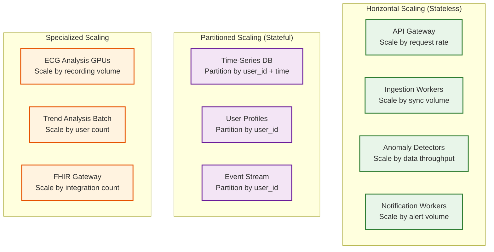
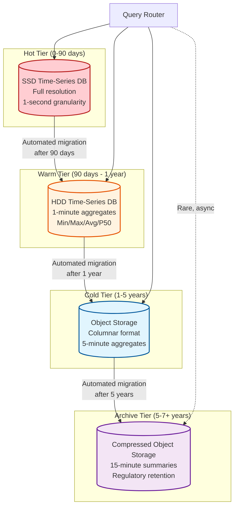
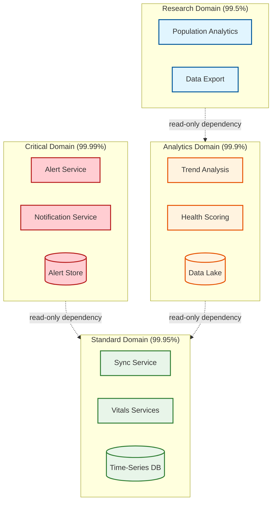

# Scalability & Reliability — Wearable Health Monitoring Platform

## 1. Scaling Strategy Overview

### 1.1 Scale Dimensions

| Dimension | Current Scale | 10x Scale | Key Scaling Lever |
|---|---|---|---|
| **Active devices** | 100M | 1B | User-based partitioning, regional sharding |
| **Daily syncs** | 60M | 600M | Horizontal ingestion scaling, sync jittering |
| **Data ingestion** | 24 TB/day | 240 TB/day | Stream processing parallelism, columnar compression |
| **Time-series writes** | 250B records/day | 2.5T records/day | Write batching, continuous aggregation |
| **Critical alerts** | 10K/day | 100K/day | Dedicated alert infrastructure, multi-region |
| **FHIR queries** | 10M/day | 100M/day | Read replicas, FHIR response caching |
| **Storage (5-year)** | 53 PB | 530 PB | Tiered storage, aggressive downsampling |

### 1.2 Scaling Architecture Principles



---

## 2. Data Ingestion Scaling

### 2.1 Ingestion Pipeline Architecture

```
                    ┌──────────────────────────────────────────┐
                    │           Global Load Balancer            │
                    │     (Geo-route to nearest region)         │
                    └────────────────┬─────────────────────────┘
                                     │
          ┌──────────────────────────┼──────────────────────────┐
          │                          │                          │
    ┌─────▼─────┐            ┌──────▼──────┐           ┌──────▼──────┐
    │  US-East   │            │   EU-West    │           │  APAC-East  │
    │  Ingestion │            │   Ingestion  │           │  Ingestion  │
    │  Cluster   │            │   Cluster    │           │  Cluster    │
    └─────┬─────┘            └──────┬──────┘           └──────┬──────┘
          │                          │                          │
    ┌─────▼─────┐            ┌──────▼──────┐           ┌──────▼──────┐
    │ Partitioned│            │ Partitioned  │           │ Partitioned │
    │ Event      │            │ Event        │           │ Event       │
    │ Stream     │            │ Stream       │           │ Stream      │
    │ (by        │            │ (by          │           │ (by         │
    │  user_id)  │            │  user_id)    │           │  user_id)   │
    └─────┬─────┘            └──────┬──────┘           └──────┬──────┘
          │                          │                          │
    ┌─────▼─────┐            ┌──────▼──────┐           ┌──────▼──────┐
    │ Processing │            │ Processing   │           │ Processing  │
    │ Workers    │            │ Workers      │           │ Workers     │
    │ (N pods)   │            │ (N pods)     │           │ (N pods)    │
    └───────────┘            └─────────────┘           └─────────────┘
```

### 2.2 Partition Strategy

**Event Stream Partitioning:**
- Partition key: `user_id`
- Rationale: Ensures all data for a single user is processed by the same consumer, enabling stateful operations (dedup, baseline comparison) without cross-partition coordination
- Partition count: 256 partitions per region (allows fine-grained consumer assignment)
- Rebalancing: Consumer group protocol handles partition reassignment during scaling events

**Time-Series Database Partitioning:**
- Primary partition: `user_id` hash (distributes users evenly across shards)
- Secondary partition: Time-based chunks (1-day chunks for hot data, 7-day chunks for warm)
- Shard count: 64 shards per region, each handling ~1.5M users
- Replication factor: 3 (one leader + two followers per shard)

### 2.3 Write Path Optimization

```
Write optimization pipeline:

1. CLIENT-SIDE BATCHING
   Phone app batches sensor data into 1 compressed payload per sync
   → Reduces HTTP connection overhead from thousands to one

2. INGESTION WORKER BATCHING
   Worker accumulates records for 100ms before flushing to stream
   → Amortizes per-message overhead in event stream

3. STREAM CONSUMER BATCHING
   Consumer reads in micro-batches of 500 records
   → Enables batch insert into time-series DB

4. TIME-SERIES DB BATCH INSERT
   Batch insert 500 records in single transaction
   → 50x faster than individual inserts

5. CONTINUOUS AGGREGATION
   TSDB automatically maintains materialized views for downsampled data
   → No separate aggregation pipeline needed

Net effect: 1 sync = 1 HTTP call = 1 stream batch = 1 TSDB batch insert
vs. naive: 4,200 HTTP calls = 4,200 stream messages = 4,200 DB inserts
```

### 2.4 Back-Pressure Handling

```
ALGORITHM HandleBackPressure(ingestion_queue_depth, processing_lag_seconds)

  IF processing_lag_seconds < 5 THEN
    // Normal operation
    rate_limit = NONE
    scale_action = NONE

  ELSE IF processing_lag_seconds < 30 THEN
    // Warning: scale up processing
    scale_action = SCALE_UP_PROCESSORS(+25%)
    rate_limit = NONE  // Don't reject yet

  ELSE IF processing_lag_seconds < 120 THEN
    // Overloaded: throttle non-critical traffic
    scale_action = SCALE_UP_PROCESSORS(+50%)
    rate_limit = THROTTLE_WELLNESS_SYNCS(delay_response_by=30s)
    // Critical alerts and RPM data always pass through

  ELSE
    // Emergency: shed load aggressively
    scale_action = SCALE_UP_PROCESSORS(+100%)
    rate_limit = REJECT_WELLNESS_SYNCS(return_429_retry_after=300)
    // Only critical alerts and clinical data accepted
    EmitIncidentAlert("ingestion_overload", lag=processing_lag_seconds)
  END IF

  RETURN {rate_limit, scale_action}
END ALGORITHM
```

---

## 3. Storage Scaling

### 3.1 Tiered Storage Architecture



### 3.2 Storage Cost Analysis

| Tier | Data Volume (100M users) | Storage Cost/GB/month | Monthly Cost | % of Total Cost |
|---|---|---|---|---|
| **Hot** (90 days, SSD) | 3.6 PB | $0.10 | $360K | 45% |
| **Warm** (1 year, HDD) | 2.1 PB (downsampled) | $0.03 | $63K | 8% |
| **Cold** (5 years, object) | 8.5 PB (downsampled) | $0.01 | $85K | 11% |
| **Archive** (7+ years) | 5.0 PB (compressed) | $0.004 | $20K | 3% |
| **Indexes + Metadata** | 4.0 PB | $0.07 | $280K | 35% |
| **Total** | ~23 PB | — | ~$808K/month | — |

**Without tiered storage:** Keeping all data at hot-tier pricing = $5.3M/month (6.5x more expensive)

### 3.3 Data Lifecycle Management

```
Per-user data lifecycle:

Day 0-90 (Hot):
  - Full resolution sensor data (1 Hz HR, raw ECG)
  - All derived metrics at full resolution
  - Instant query response (< 100ms)

Day 91-365 (Warm):
  - 1-minute aggregates (min, max, avg, p50)
  - ECG recordings preserved at full resolution (clinical data)
  - Original raw data deleted after successful aggregation verification
  - Query response < 500ms

Year 1-5 (Cold):
  - 5-minute aggregates
  - Daily summaries (resting HR, HRV, sleep scores)
  - ECG recordings preserved
  - Query response < 5s (async prefetch)

Year 5-7+ (Archive):
  - 15-minute summaries
  - Monthly/yearly health reports (pre-computed)
  - ECG recordings preserved (clinical retention mandate)
  - Query response: minutes (on-demand retrieval)

Data deletion triggers:
  - User account deletion: Cascade delete all tiers, verify cryptographic erasure
  - Consent revocation: Anonymize or delete per consent scope
  - Retention policy expiry: Automated deletion with audit trail
```

---

## 4. Alert Pipeline Reliability

### 4.1 Alert Delivery Guarantees

The critical alert pipeline has a 99.99% availability target (52.6 minutes/year downtime budget). This requires:

```
Critical Alert Pipeline — Redundancy Architecture:

PRIMARY PATH:
  Device → Phone → Cloud API → Anomaly Engine → Notification → User/Physician
  Latency target: < 10 seconds
  Expected availability: 99.95%

SECONDARY PATH (failover):
  Device → Phone → Local notification (no cloud)
  Latency: < 2 seconds
  Coverage: On-device detection only (no cloud confirmation)
  Activated when: Cloud unreachable for > 5 seconds

TERTIARY PATH (backup):
  Device → Direct BLE broadcast → Nearby paired device
  Coverage: Fall detection only
  Activated when: Phone unreachable (user may be separated from phone)

COMBINED AVAILABILITY:
  P(all paths fail) = (1 - 0.9995) × (1 - 0.999) × (1 - 0.95) = 0.0000025%
  Effective availability: 99.99975% (exceeds 99.99% target)
```

### 4.2 Alert Pipeline Fault Tolerance

| Failure Scenario | Detection | Recovery | Data Loss |
|---|---|---|---|
| **API Gateway outage** | Health check failure (5s) | Route to standby gateway | Zero — phone retries |
| **Anomaly Engine crash** | Consumer lag spike | Auto-restart, replay from stream offset | Zero — events replayed |
| **Notification service down** | Delivery failure callbacks | Retry queue with exponential backoff | Zero — alerts queued |
| **Push delivery failure** | Platform delivery report | Fallback to SMS within 30s | Zero — multi-channel |
| **Regional outage** | Cross-region health check | Geo-failover to nearest region | Near-zero — < 60s RPO |
| **Phone connectivity loss** | BLE connection maintained | On-device alert directly to user via haptic/buzzer | Zero — device alerts independently |

### 4.3 Exactly-Once Alert Delivery

```
Preventing duplicate alerts:

1. ALERT ID GENERATION
   alert_id = Hash(user_id + alert_type + detection_timestamp + device_id)
   → Same anomaly detection produces same alert_id (deterministic)

2. IDEMPOTENT ALERT CREATION
   AtomicCreateOrGet(alert_id)
   → If alert_id exists, return existing alert (no duplicate)

3. NOTIFICATION DEDUP
   notification_key = alert_id + channel (push/sms/email)
   → Each alert generates at most one notification per channel

4. USER-SIDE DEDUP
   Phone app deduplicates by alert_id before displaying
   → Handles race condition where cloud and phone both generate alerts
```

---

## 5. Fault Tolerance Design

### 5.1 Failure Domain Isolation



**Key principle:** Failures in analytics/research domains never propagate to critical alert delivery. The critical domain operates on dedicated infrastructure with independent data stores.

### 5.2 Circuit Breaker Configuration

| Service | Failure Threshold | Open Duration | Fallback Behavior |
|---|---|---|---|
| **Cloud anomaly confirmation** | 5 failures in 10s | 30s | Accept on-device classification |
| **FHIR gateway** | 10 failures in 60s | 120s | Queue FHIR data for retry |
| **Push notification** | 3 failures in 30s | 60s | Fallback to SMS delivery |
| **Trend analysis** | 20 failures in 60s | 300s | Serve cached previous scores |
| **ECG analysis GPU** | 5 failures in 30s | 120s | Queue for batch processing |

### 5.3 Data Durability Strategy

```
PHI data durability: 99.999999% (8 nines) target

Strategy:
1. WRITE-AHEAD LOG
   All ingested data written to distributed WAL before processing
   WAL replicated across 3 availability zones
   → Survives single-zone failure

2. SYNCHRONOUS REPLICATION
   Time-series DB: synchronous replication to 2 followers
   Write confirmed only after 2/3 replicas acknowledge
   → Zero data loss on single-node failure

3. CONTINUOUS BACKUP
   Point-in-time backup every 15 minutes to object storage
   Object storage: 3-way erasure coding across zones
   → Recovery within 15 minutes of any failure

4. CROSS-REGION BACKUP
   Daily encrypted backup to separate region
   → Survives entire region failure

5. IMMUTABLE AUDIT LOG
   All PHI access and modifications logged to append-only store
   Log itself replicated and backed up independently
   → Compliance verification possible even after primary failure
```

---

## 6. Disaster Recovery

### 6.1 Recovery Objectives

| Scenario | RTO (Recovery Time) | RPO (Recovery Point) |
|---|---|---|
| **Single node failure** | 0 (automatic failover) | 0 (synchronous replication) |
| **Availability zone failure** | < 5 minutes | 0 (cross-zone replication) |
| **Regional failure** | < 30 minutes | < 15 minutes (async cross-region backup) |
| **Data corruption (logical)** | < 4 hours | Point-in-time recovery to any 15-min mark |
| **Complete platform compromise** | < 24 hours | < 1 hour (encrypted offsite backup) |

### 6.2 Regional Failover Procedure

```
REGIONAL FAILOVER PROTOCOL:

1. DETECTION (0-2 minutes)
   - Cross-region health probes detect region unresponsive
   - Three consecutive failures from 3 probe locations → confirmed

2. DNS FAILOVER (2-5 minutes)
   - Global load balancer removes failed region from DNS
   - TTL: 60 seconds (most clients redirect within 2 minutes)

3. TRAFFIC REROUTE (5-10 minutes)
   - Affected users routed to nearest healthy region
   - Phone apps retry with exponential backoff, discover new endpoint

4. DATA RECOVERY (10-30 minutes)
   - Restore from latest cross-region backup (< 15 min old)
   - Apply WAL from surviving replicas to close gap
   - User data available for reads within 30 minutes

5. SYNC RECONCILIATION (30-60 minutes)
   - Devices that synced during the outage window retry
   - Server-side dedup handles any partial writes from failed region
   - Sync confirmation is idempotent — safe to re-sync

6. VALIDATION (60-90 minutes)
   - Compare record counts: pre-failure vs. recovered
   - Verify alert pipeline end-to-end
   - Clinical dashboard connectivity verified

Note: During failover, on-device buffering ensures zero data loss
from the wearable perspective. Users may see delayed dashboard
updates but never lose sensor data.
```

### 6.3 Chaos Engineering Practice

| Experiment | Frequency | Purpose |
|---|---|---|
| **Kill random ingestion worker** | Daily | Verify auto-recovery and zero data loss |
| **Simulate AZ failure** | Weekly | Verify cross-zone failover < 5 min |
| **Inject sync API latency (5s)** | Weekly | Verify phone app retry and timeout behavior |
| **Simulate notification failure** | Weekly | Verify SMS fallback for critical alerts |
| **Regional failover drill** | Monthly | Full regional DR exercise with team |
| **Clock skew injection** | Monthly | Verify clock correction in sync protocol |
| **Corrupt TSDB shard** | Quarterly | Verify point-in-time recovery process |

---

## 7. Capacity Planning and Auto-Scaling

### 7.1 Auto-Scaling Policies

| Service | Scale Metric | Scale Up Threshold | Scale Down Threshold | Min Instances |
|---|---|---|---|---|
| **API Gateway** | Request rate | 80% of capacity | 30% of capacity | 3 per region |
| **Ingestion Workers** | Queue depth | > 1000 messages/worker | < 100 messages/worker | 5 per region |
| **Anomaly Engine** | Processing lag | > 5s lag | < 1s lag | 3 per region (always warm) |
| **Notification Workers** | Queue depth | > 500 pending | < 50 pending | 2 per region |
| **ECG Analysis GPU** | Queue wait time | > 30s wait | < 5s wait | 1 per region |
| **FHIR Gateway** | Request latency p99 | > 1s | < 200ms | 2 per region |

### 7.2 Predictive Scaling

```
Morning sync peak prediction:

1. HISTORICAL PATTERN
   Learn sync volume curve by hour-of-day × day-of-week × region
   Apply exponential smoothing with 7-day seasonality

2. DEVICE COUNT TRACKING
   Track active device count trending (new activations - deactivations)
   Project next-day device count

3. PRE-SCALING
   30 minutes before predicted peak: scale ingestion to 80% of predicted peak capacity
   At peak start: fine-tune based on actual incoming rate
   30 minutes after peak: begin gradual scale-down

4. SPECIAL EVENTS
   Product launch day: 10x baseline capacity pre-provisioned
   Holiday season: 2-3x for gift activations
   Daylight saving time: Adjusted peak timing
```

---

*Next: [Security & Compliance →](./06-security-and-compliance.md)*
