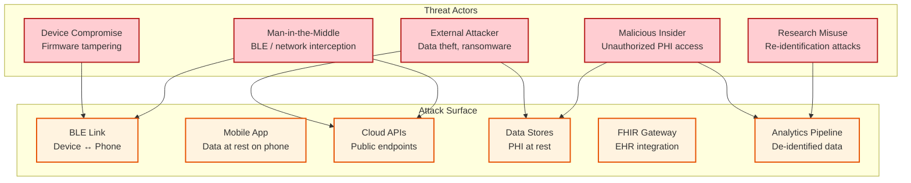
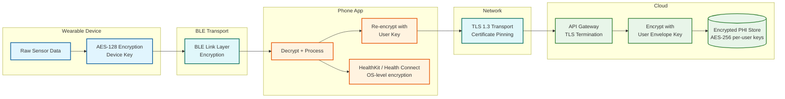

# Security & Compliance — Wearable Health Monitoring Platform

## 1. Threat Model

### 1.1 Attack Surface Map



### 1.2 Threat Matrix

| Threat | Attack Vector | Impact | Likelihood | Mitigation Priority |
|---|---|---|---|---|
| **PHI data breach** | API exploitation, SQL injection | Critical — regulatory fines, user harm | Medium | P0 |
| **BLE eavesdropping** | Passive BLE sniffing within range | High — exposure of health data in transit | Low-Medium | P1 |
| **Account takeover** | Credential stuffing, phishing | High — unauthorized PHI access | Medium | P0 |
| **Insider data access** | Privileged employee accessing PHI | High — privacy violation | Low | P1 |
| **Firmware tampering** | Malicious OTA update injection | Critical — device trust compromise | Low | P1 |
| **Re-identification** | Correlation of de-identified research data | Medium — privacy violation | Low | P2 |
| **Ransomware** | Infrastructure compromise | Critical — platform unavailability | Medium | P0 |
| **Supply chain** | Compromised SDK/library dependency | High — code execution, data exfiltration | Low-Medium | P1 |
| **Denial of service** | API/sync endpoint flooding | Medium — service degradation | Medium | P1 |

---

## 2. HIPAA Compliance Architecture

### 2.1 HIPAA Safeguards Implementation

**Administrative Safeguards:**

| Requirement | Implementation |
|---|---|
| **Security Officer** | Designated HIPAA Security Officer with authority over PHI policies |
| **Workforce training** | Annual HIPAA training for all employees; additional training for PHI-accessing roles |
| **Access management** | Role-based access with quarterly access reviews; least privilege enforcement |
| **Incident response** | Documented breach notification procedures; 60-day notification deadline to HHS |
| **BAA management** | Business Associate Agreements with all cloud providers and FHIR integration partners |
| **Risk assessment** | Annual risk assessment with documented mitigation plans |

**Technical Safeguards:**

| Requirement | Implementation |
|---|---|
| **Access control** | RBAC + ABAC; unique user IDs; automatic session timeout (15 min clinical, 30 min user) |
| **Audit controls** | Immutable audit log of all PHI access; log retention ≥ 6 years |
| **Integrity** | Cryptographic checksums on all PHI records; tamper-evident storage |
| **Transmission security** | TLS 1.3 for all network communication; BLE link-layer encryption |
| **Encryption at rest** | AES-256 with per-user encryption keys; keys managed by HSM |
| **Emergency access** | Break-glass procedure for emergency PHI access with mandatory post-access review |

**Physical Safeguards:**

| Requirement | Implementation |
|---|---|
| **Facility access** | Cloud provider SOC 2 Type II certified data centers |
| **Workstation security** | Employee workstations cannot store PHI locally; VDI for clinical data access |
| **Device controls** | Wearable device data encrypted at rest; secure boot with verified firmware |

### 2.2 PHI Data Flow with Encryption



### 2.3 Minimum Necessary Access Principle

```
PHI Access Roles and Scope:

USER (self):
  Read: All own health data
  Write: Consent preferences, profile
  Delete: Own data (right to erasure)
  Share: Controlled by consent grants

PHYSICIAN (linked):
  Read: Only consented data categories for linked patients
  Write: Clinical notes, care plans
  Cannot: Access data without active consent, bulk export
  Audit: Every read/write logged with purpose

CARE_TEAM (delegated):
  Read: Subset of patient data per care plan scope
  Write: None (read-only)
  Cannot: Access outside assigned patients
  Audit: Full access logging

PLATFORM_ENGINEER:
  Read: De-identified data only (no PII/PHI in logs)
  Write: System configuration (no PHI access)
  Cannot: Query user data directly; must use de-identified tooling
  Audit: All system access logged

DATA_SCIENTIST:
  Read: De-identified + aggregated research datasets only
  Write: Analysis results to research sandbox
  Cannot: Access identified PHI; link research data to individuals
  Audit: Dataset access and query logging

SYSTEM (automated):
  Read: PHI for processing (anomaly detection, trend analysis)
  Write: Derived metrics, alerts
  Scope: Per-user, per-operation (no bulk access)
  Audit: Service-to-service call logging with purpose codes
```

---

## 3. GDPR Compliance

### 3.1 Data Subject Rights Implementation

| Right | Implementation | Response Time |
|---|---|---|
| **Right to Access** | Self-service data export in JSON/CSV/FHIR Bundle; downloadable from app/web | < 30 days (target: instant for available data) |
| **Right to Rectification** | User-editable profile data; clinical data corrections via physician workflow | < 30 days |
| **Right to Erasure** | Cryptographic deletion: destroy per-user encryption key → all encrypted PHI becomes unrecoverable | < 30 days (target: < 72 hours) |
| **Right to Portability** | Export in machine-readable formats (FHIR Bundle, JSON); API for automated transfer | < 30 days |
| **Right to Restriction** | Pause all processing for user; data retained but not processed | Immediate |
| **Right to Object** | Opt-out of population analytics and research; consent granularity per data category | Immediate |

### 3.2 Consent Management Architecture

```
CONSENT DATA MODEL:

ConsentGrant {
  consent_id:       UUID (PK)
  user_id:          UUID (FK)
  data_category:    ENUM [vitals, sleep, activity, ecg, location, demographics]
  purpose:          ENUM [clinical_care, research, population_analytics, marketing, device_improvement]
  granted_to:       ENUM [physician:{id}, research_org:{id}, platform, third_party:{id}]
  scope:            ENUM [read, read_write, aggregate_only]
  legal_basis:      ENUM [explicit_consent, legitimate_interest, vital_interest]
  granted_at:       TIMESTAMP
  expires_at:       TIMESTAMP (nullable — no expiry if null)
  revoked_at:       TIMESTAMP (nullable — active if null)
  consent_version:  STRING (tracks which consent form version was accepted)
  ip_address:       STRING (proof of consent)
  consent_proof:    STRING (signed hash of consent interaction)
}

Consent Enforcement:
  Every data access request includes:
    - Requesting identity (user, physician, service)
    - Data category being accessed
    - Purpose of access

  Access granted only if:
    - Active ConsentGrant exists matching (user_id, data_category, purpose, granted_to)
    - ConsentGrant not expired and not revoked
    - Requesting identity matches granted_to

  Consent denial → 403 Forbidden with reason code
```

### 3.3 Cryptographic Erasure

```
RIGHT TO ERASURE IMPLEMENTATION:

Traditional deletion: Find and delete all records → slow, error-prone, may miss copies

Cryptographic erasure: Destroy the encryption key → all encrypted data becomes unrecoverable

Process:
1. User requests erasure via app or web portal
2. System verifies identity (re-authentication required)
3. Mark user as "pending_erasure" (stops all processing)
4. Delete per-user encryption key from KMS
   → All encrypted PHI in all storage tiers becomes unrecoverable
5. Delete unencrypted metadata (user profile, device records)
6. Purge from all caches and search indexes
7. Remove from backup rotation (next backup excludes deleted user)
8. Generate erasure certificate with cryptographic proof
9. Retain erasure audit record (proof of deletion, no PHI content)
10. Notify user of completed erasure

Time to complete: < 72 hours (including cache propagation and backup exclusion)

Edge cases:
  - Data shared with physician before erasure → physician's copy retained per physician's BAA
  - De-identified research data → not subject to erasure (cannot be re-identified)
  - Regulatory hold → erasure delayed until hold released (user notified)
```

---

## 4. Device Authentication and Security

### 4.1 Device Identity and Trust Chain

```
DEVICE TRUST CHAIN:

1. MANUFACTURING
   - Unique device key pair generated in secure element during manufacturing
   - Public key registered in device registry with manufacturer certificate chain
   - Device certificate signed by manufacturer's intermediate CA

2. ACTIVATION
   - User pairs device via BLE
   - Phone app presents device certificate to cloud activation API
   - Cloud verifies certificate chain: Device → Manufacturer → Root CA
   - Cloud issues device activation token (short-lived, renewable)

3. ONGOING AUTHENTICATION
   - Each sync session: device presents activation token + challenge-response
   - Token refreshed every 24 hours via phone-mediated renewal
   - If token expires (device offline > 24 hours): re-authentication on next sync

4. FIRMWARE VERIFICATION
   - OTA firmware images signed by manufacturer's code-signing key
   - Device verifies signature before applying update
   - Secure boot: device only boots signed firmware
   - Rollback protection: monotonic version counter prevents downgrade attacks
```

### 4.2 BLE Security

| Layer | Protection | Implementation |
|---|---|---|
| **Pairing** | Secure Simple Pairing with numeric comparison | User confirms 6-digit code on phone and device |
| **Link encryption** | AES-CCM encryption at BLE link layer | All BLE traffic encrypted after pairing |
| **Application encryption** | Additional AES-128 application-layer encryption | Protects against compromised BLE stack |
| **Replay protection** | Sequence numbers + timestamps on all messages | Prevents replay of captured BLE packets |
| **MITM protection** | Certificate-based mutual authentication | Device and phone verify each other's identity |

### 4.3 API Security

```
API SECURITY LAYERS:

1. TRANSPORT SECURITY
   - TLS 1.3 with certificate pinning in mobile app
   - Supported cipher suites: TLS_AES_256_GCM_SHA384, TLS_CHACHA20_POLY1305_SHA256
   - HSTS with max-age=31536000

2. AUTHENTICATION
   - User auth: OAuth 2.0 + PKCE (mobile app)
   - Device auth: Device activation token + client certificate
   - FHIR auth: SMART on FHIR with OAuth 2.0 scopes
   - Internal service auth: mTLS with service mesh

3. AUTHORIZATION
   - RBAC for role-based access (user, physician, admin)
   - ABAC for attribute-based rules (consent status, data category)
   - Scope-limited tokens (token grants access to specific user's data only)

4. RATE LIMITING
   - Per-user: 100 requests/minute for standard API
   - Per-device: 10 sync sessions/hour
   - Per-IP: 1000 requests/minute
   - Critical alerts: No rate limit (priority queue)

5. INPUT VALIDATION
   - Schema validation on all request bodies
   - Parameterized queries (prevent injection)
   - File upload scanning (ECG recordings, images)
   - Maximum payload size: 10 MB per sync upload

6. OUTPUT SECURITY
   - No PHI in error messages
   - No stack traces in production responses
   - CORS restricted to known app domains
   - Security headers: X-Content-Type-Options, X-Frame-Options, CSP
```

---

## 5. FDA SaMD Regulatory Compliance

### 5.1 SaMD Classification for Wearable Features

| Feature | SaMD Classification | Regulatory Pathway | Data Pipeline Impact |
|---|---|---|---|
| **Step counting** | Not SaMD (wellness) | None required | Standard pipeline |
| **Sleep tracking** | Not SaMD (wellness) | None required | Standard pipeline |
| **Heart rate display** | Not SaMD (general wellness) | None required | Standard pipeline |
| **ECG recording + AFib detection** | Class II SaMD | 510(k) or De Novo | Clinical pipeline with audit trail |
| **SpO2 monitoring with alerts** | Class II SaMD | 510(k) | Clinical pipeline with audit trail |
| **Irregular rhythm notification** | Class II SaMD | De Novo | Clinical pipeline with validation |
| **Fall detection + emergency call** | Class II SaMD | 510(k) | Critical alert pipeline |
| **Blood pressure estimation** | Class II SaMD | 510(k) or De Novo | Clinical pipeline with calibration |

### 5.2 SaMD Architectural Requirements

```
CLINICAL vs. WELLNESS PIPELINE SEPARATION:

┌─────────────────────────────────────────────────────────────┐
│                    SHARED INFRASTRUCTURE                      │
│  (API Gateway, Auth, Device Management, User Profiles)       │
└────────────────────┬────────────────────────────────────────┘
                     │
        ┌────────────┴────────────┐
        │                         │
  ┌─────▼──────┐          ┌──────▼──────┐
  │  WELLNESS   │          │  CLINICAL   │
  │  PIPELINE   │          │  PIPELINE   │
  │             │          │             │
  │ - Steps     │          │ - ECG/AFib  │
  │ - Sleep     │          │ - SpO2      │
  │ - Activity  │          │ - Fall det  │
  │ - HR trend  │          │ - HR alerts │
  │             │          │             │
  │ Standards:  │          │ Standards:  │
  │ - Fast iter │          │ - IEC 62304 │
  │ - A/B test  │          │ - ISO 14971 │
  │ - Rapid     │          │ - FDA QSR   │
  │   deploy    │          │ - Change    │
  │             │          │   control   │
  │ Deploy:     │          │ - Validated │
  │ Continuous  │          │   deploy    │
  │             │          │ Deploy:     │
  │ Testing:    │          │ Quarterly+  │
  │ Standard    │          │ validation  │
  │ CI/CD       │          │             │
  └────────────┘          │ Testing:    │
                          │ Clinical    │
                          │ validation  │
                          │ + regression│
                          └─────────────┘

Key differences:
- Clinical pipeline: change control board review, clinical validation, traceability matrix
- Wellness pipeline: standard CI/CD, rapid iteration, feature flags
- Shared: infrastructure, auth, storage (but clinical data has additional audit layer)
```

### 5.3 Post-Market Surveillance

| Requirement | Implementation |
|---|---|
| **Adverse event reporting** | Automated detection of potential adverse events; MDR (Medical Device Report) filing workflow |
| **Performance monitoring** | Continuous tracking of sensitivity/specificity for clinical algorithms |
| **User complaint tracking** | Structured complaint intake → investigation → CAPA (Corrective and Preventive Action) |
| **Software update tracking** | Version-specific performance metrics; regression detection on new releases |
| **Real-world evidence** | Aggregated clinical outcome data for post-market studies |
| **Model drift detection** | Monitor ML model accuracy over time; alert if performance degrades below validation thresholds |

---

## 6. Data Privacy Architecture

### 6.1 Privacy-by-Design Principles

| Principle | Implementation |
|---|---|
| **Data minimization** | Collect only sensors enabled by user; on-device processing reduces cloud data transfer |
| **Purpose limitation** | Each data access tagged with purpose code; access denied if purpose doesn't match consent |
| **Storage limitation** | Automated data lifecycle management; retention policies per data category |
| **Transparency** | Privacy dashboard showing who accessed data, when, and why |
| **User control** | Granular consent management; data export; account deletion |
| **Security by default** | Encryption at rest and in transit by default; most restrictive access settings on new accounts |

### 6.2 De-Identification for Research

```
DE-IDENTIFICATION PIPELINE:

Input: Identified PHI (user health records)
Output: De-identified dataset safe for research use

Steps:
1. REMOVE DIRECT IDENTIFIERS
   - Name, email, phone, address, device serial numbers
   - All 18 HIPAA identifiers removed

2. GENERALIZE QUASI-IDENTIFIERS
   - Age: Round to 5-year buckets (25-29, 30-34, ...)
   - Location: Generalize to state/region level
   - Dates: Shift all dates by random per-user offset (preserve intervals)

3. APPLY K-ANONYMITY (k=5)
   - Ensure each combination of quasi-identifiers appears ≥ 5 times
   - Suppress records that violate k-anonymity threshold

4. APPLY DIFFERENTIAL PRIVACY
   - Add calibrated Laplace noise to aggregate statistics
   - Privacy budget (epsilon) = 1.0 per query, cumulative tracking
   - Prevents reconstruction of individual records from aggregate queries

5. ASSIGN RESEARCH PSEUDONYM
   - One-way hash: research_id = HMAC(user_id, research_salt)
   - Salt rotated annually; no mapping table retained
   - Different research_id per study (unlinkable across studies)

6. VALIDATION
   - Expert determination: verify de-identification meets HIPAA Safe Harbor
   - Re-identification risk assessment (< 0.04% re-identification probability)
```

### 6.3 Audit Trail Architecture

```
IMMUTABLE AUDIT LOG:

Every PHI access generates an audit record:

AuditRecord {
  audit_id:         UUID
  timestamp:        TIMESTAMP (nanosecond precision)
  actor_id:         UUID (who accessed)
  actor_role:       ENUM [user, physician, system, admin]
  action:           ENUM [read, write, delete, export, share]
  resource_type:    STRING (e.g., "heart_rate", "ecg_recording", "alert")
  resource_id:      UUID (specific record accessed)
  user_id:          UUID (whose data was accessed)
  purpose:          STRING (why data was accessed — clinical_care, analytics, etc.)
  consent_id:       UUID (which consent grant authorized access)
  ip_address:       STRING
  result:           ENUM [success, denied, error]
  data_volume:      INT (bytes accessed)
  hash_chain:       STRING (cryptographic link to previous audit record)
}

Storage:
  - Append-only immutable log (no updates or deletes)
  - Cryptographic hash chain (each record includes hash of previous)
  - Tamper detection: break in hash chain → alert
  - Retention: 6 years minimum (HIPAA), 10 years for clinical data
  - Write-once storage medium: prevents retroactive modification

Query patterns:
  - "Who accessed patient X's data in the last 30 days?" (compliance)
  - "Show all data access by employee Y" (insider threat investigation)
  - "Count PHI accesses by purpose" (usage analytics)
```

---

## 7. Incident Response

### 7.1 PHI Breach Response Plan

```
BREACH RESPONSE TIMELINE (HIPAA-compliant):

HOUR 0-1: DETECTION AND CONTAINMENT
  - Automated: anomalous PHI access pattern detected
  - Or: employee report, external notification
  - Contain: revoke compromised credentials, isolate affected systems
  - Preserve: forensic snapshots of affected systems

HOUR 1-24: INVESTIGATION
  - Determine scope: which users affected, which PHI exposed
  - Determine cause: vulnerability exploited, insider action, etc.
  - Assess risk: likelihood of harm to affected individuals
  - Document: detailed incident timeline

DAY 1-7: RISK ASSESSMENT
  - Apply 4-factor risk assessment per HIPAA Breach Notification Rule:
    1. Nature and extent of PHI involved
    2. Unauthorized person who used/accessed PHI
    3. Whether PHI was actually acquired or viewed
    4. Extent to which risk has been mitigated

DAY 7-30: NOTIFICATION (if breach confirmed)
  - Individual notification to affected users (< 60 days from discovery)
  - HHS notification (> 500 individuals: within 60 days; < 500: annual log)
  - State AG notification per state breach notification laws
  - Media notification if > 500 individuals in a state

DAY 30-90: REMEDIATION
  - Root cause analysis → corrective action plan
  - Security control improvements implemented
  - Third-party security audit if appropriate
  - Post-incident review and lessons learned
```

---

*Next: [Observability →](./07-observability.md)*
