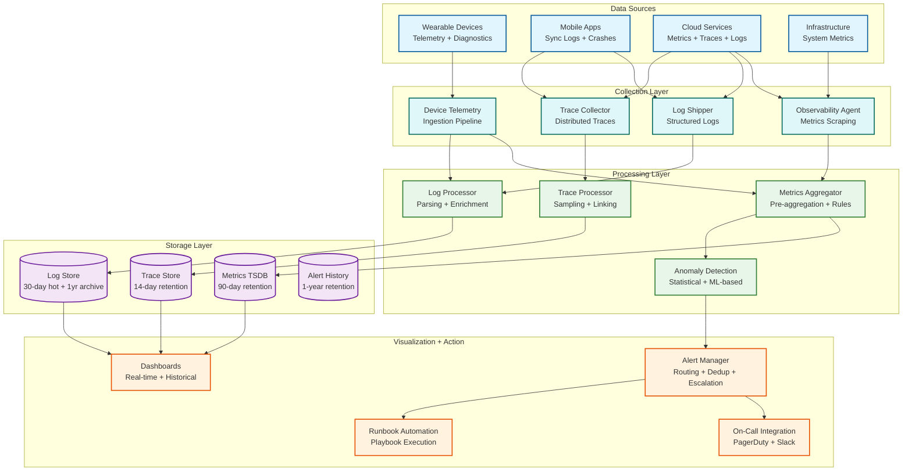

# Observability — Wearable Health Monitoring Platform

## 1. Observability Architecture



---

## 2. Key Metrics

### 2.1 Platform Health Metrics (Golden Signals)

| Metric | Description | Alert Threshold | Dashboard |
|---|---|---|---|
| **Sync success rate** | % of sync sessions completing successfully | < 99% → warning, < 95% → critical | Platform Health |
| **Sync ingestion latency (p50/p99)** | Time from phone upload to TSDB write | p99 > 5s → warning, > 15s → critical | Ingestion |
| **Critical alert end-to-end latency** | Device detection → user notification | p99 > 10s → warning, > 30s → critical | Alert Pipeline |
| **API error rate** | 5xx responses / total requests | > 0.1% → warning, > 1% → critical | API Health |
| **API latency (p50/p99)** | Response time for user-facing APIs | p99 > 1s → warning, > 3s → critical | API Health |
| **Event stream consumer lag** | Messages behind real-time in stream consumers | > 1000 → warning, > 10,000 → critical | Ingestion |

### 2.2 Data Pipeline Metrics

| Metric | Description | Alert Threshold |
|---|---|---|
| **Records ingested per second** | Throughput of sensor data ingestion | < 50% of baseline → warning |
| **Deduplication rate** | % of incoming records identified as duplicates | > 5% → investigate (sync protocol issue) |
| **Quality rejection rate** | % of records rejected for quality reasons | > 2% → investigate (sensor or adapter issue) |
| **TSDB write latency** | Time to write a batch to time-series database | p99 > 500ms → warning |
| **Continuous aggregation lag** | Delay between raw data write and aggregate availability | > 5 min → warning |
| **Storage utilization** | Per-tier storage usage vs. capacity | > 80% → warning, > 90% → critical |

### 2.3 Device Fleet Metrics

| Metric | Description | Alert Threshold |
|---|---|---|
| **Active devices** | Devices that synced in last 24 hours | < 80% of registered → investigate |
| **Sync frequency distribution** | Histogram of sync intervals per device | Bimodal shift → investigate |
| **BLE connection failure rate** | Failed BLE connections / total attempts | > 10% per device model → investigate |
| **On-device buffer utilization** | % of device buffer used (reported during sync) | Mean > 60% → sync interval too long |
| **Firmware version distribution** | % of fleet on each firmware version | > 20% on outdated → OTA campaign needed |
| **Battery drain rate** | Normalized mAh/hour consumption | Model-specific; deviation > 20% → firmware issue |
| **Sensor failure rate** | Devices reporting sensor errors | > 0.1% per model → hardware quality issue |

### 2.4 Alert Pipeline Metrics

| Metric | Description | Alert Threshold |
|---|---|---|
| **Critical alerts generated per hour** | Rate of critical health alerts | > 3σ from rolling average → investigate |
| **Alert confirmation rate** | % of on-device alerts confirmed by cloud model | < 80% → model drift in on-device classifier |
| **False positive rate (estimated)** | Alerts dismissed by users / total alerts | > 10% for critical → retune thresholds |
| **Alert acknowledgment time** | Time from notification to user acknowledgment | p50 > 5 min → notification delivery issue |
| **Emergency escalation rate** | % of critical alerts escalating to emergency contacts | Trend increase → investigate alert fatigue |
| **Notification delivery success** | % of notifications successfully delivered | < 99% → delivery infrastructure issue |
| **Push notification latency** | Time from alert creation to push delivery | p99 > 5s → notification provider issue |

### 2.5 Clinical Integration Metrics

| Metric | Description | Alert Threshold |
|---|---|---|
| **FHIR request success rate** | % of FHIR API calls returning 2xx | < 99% → warning |
| **FHIR response latency** | Time to respond to FHIR queries | p99 > 2s → warning |
| **Physician dashboard active users** | Concurrent physician sessions | Track trend for capacity planning |
| **ECG analysis queue depth** | Pending ECG recordings awaiting GPU analysis | > 10,000 → scale GPU capacity |
| **ECG analysis latency** | Time from upload to classification result | p99 > 120s → warning |
| **Clinical report generation time** | Time to generate patient report | p99 > 60s → warning |

---

## 3. Logging Strategy

### 3.1 Log Taxonomy

| Log Category | Examples | Retention | PHI Sensitivity |
|---|---|---|---|
| **Access logs** | API requests, PHI data access, authentication events | 6 years (HIPAA) | Contains user IDs, IP addresses |
| **Sync logs** | Sync session start/end, records transferred, errors | 90 days | Contains device IDs, user IDs |
| **Alert logs** | Alert generation, escalation, acknowledgment | 1 year | Contains alert details, user IDs |
| **Infrastructure logs** | Service start/stop, scaling events, health checks | 30 days | No PHI |
| **Error logs** | Exceptions, failures, timeouts | 90 days | Must NOT contain PHI (scrubbing enforced) |
| **Audit logs** | PHI access records, consent changes, admin actions | 6+ years (immutable) | Contains access metadata |

### 3.2 Structured Log Format

```
STANDARD LOG ENTRY:

{
  "timestamp": "2024-03-08T14:30:22.123Z",
  "level": "INFO",
  "service": "sync-ingestion",
  "instance_id": "sync-worker-us-east-042",
  "trace_id": "abc123def456",
  "span_id": "span789",
  "correlation_id": "sync-session-uuid",
  "event": "sync_upload_completed",
  "user_id_hash": "sha256:abc...",     // Hashed, not raw user_id
  "device_id_hash": "sha256:def...",   // Hashed, not raw device_id
  "attributes": {
    "records_count": 4200,
    "payload_bytes": 380000,
    "dedup_count": 12,
    "processing_ms": 245,
    "region": "us-east-1"
  }
}

PHI SCRUBBING RULES:
  - user_id → one-way hash (for correlation, not identification)
  - device_id → one-way hash
  - email, name, DOB → NEVER logged
  - health values (HR, SpO2) → NEVER logged in operational logs
  - IP addresses → retained in access logs only (HIPAA audit requirement)
  - Exception stack traces → scrubbed of any user data before logging
```

### 3.3 Log Aggregation and Search

```
Log pipeline:

Application → Structured JSON → Log Shipper → Log Processor → Log Store

Processing steps:
1. PARSING: Extract structured fields from JSON log entries
2. ENRICHMENT: Add service metadata, deployment version, region
3. PHI SCRUBBING: Automated regex scan for PHI patterns; redact if found
4. SAMPLING: Debug-level logs sampled at 10%; error logs kept at 100%
5. ROUTING: Access/audit logs → long-term immutable store
           Operational logs → 30-90 day searchable store
           Debug logs → 7-day retention with sampling

Query patterns:
  - "Show all errors for sync-ingestion in US-East in last 1 hour"
  - "Trace sync session {correlation_id} across all services"
  - "Count sync failures by error_code in last 24 hours"
  - "Show all PHI access for user_id_hash X" (audit query)
```

---

## 4. Distributed Tracing

### 4.1 Trace Propagation

```
END-TO-END TRACE: Critical Alert Flow

Phone App                Cloud API Gateway        Anomaly Engine          Notification Service
    │                          │                        │                        │
    │  POST /alerts/critical   │                        │                        │
    ├─────────────────────────►│                        │                        │
    │  trace_id: T1            │                        │                        │
    │  span: phone_upload      │  gRPC: EvaluateAlert   │                        │
    │                          ├───────────────────────►│                        │
    │                          │  span: api_routing     │                        │
    │                          │                        │  Run cloud model       │
    │                          │                        │  span: ml_inference    │
    │                          │                        │                        │
    │                          │                        │  gRPC: SendAlert       │
    │                          │                        ├───────────────────────►│
    │                          │                        │  span: alert_created   │
    │                          │                        │                        │  Push + SMS
    │                          │                        │                        │  span: delivery
    │                          │                        │                        │
    ◄──────────────────────────┤                        │                        │
       200 OK                  │                        │                        │
       span: e2e_complete      │                        │                        │

Trace metadata:
  trace_id: T1 (propagated across all services)
  spans: phone_upload → api_routing → ml_inference → alert_created → delivery
  total_duration_ms: 4,200
  bottleneck_span: ml_inference (2,100ms)
```

### 4.2 Trace Sampling Strategy

| Trace Type | Sampling Rate | Rationale |
|---|---|---|
| **Critical alert traces** | 100% | Every critical alert must be fully traceable |
| **Error traces** | 100% | All errors need full trace for debugging |
| **Sync session traces** | 10% | High volume; 10% provides sufficient statistical coverage |
| **FHIR API traces** | 50% | Clinical integration; higher visibility needed |
| **Health score computation** | 5% | Batch process; low priority for tracing |
| **Internal service-to-service** | 1% | Very high volume; sample for baseline |

### 4.3 Cross-Boundary Tracing

The platform spans three distinct execution environments (device → phone → cloud) with different tracing capabilities:

| Environment | Tracing Capability | Trace Propagation |
|---|---|---|
| **Wearable device** | No active tracing (too resource-constrained) | Event timestamps and sequence IDs serve as implicit trace |
| **Phone app** | Mobile SDK tracing (crash reporting + network traces) | trace_id generated at sync start; propagated to cloud via HTTP headers |
| **Cloud services** | Full distributed tracing with span propagation | Standard trace context propagation (W3C Trace Context) |

**Stitching device → phone → cloud:**
- Sync session ID links device buffer contents to phone sync event to cloud ingestion
- Device event timestamps + sequence IDs allow reconstruction of device-side timeline
- Phone app logs BLE connection events with sync session correlation

---

## 5. Alerting Framework

### 5.1 Alert Severity Levels

| Level | Criteria | Response Time | Notification Channel | Example |
|---|---|---|---|---|
| **P0 — Critical** | Data loss risk, critical alert pipeline failure, security breach | < 5 min response | PagerDuty page + phone call | Alert pipeline down, PHI breach detected |
| **P1 — High** | Service degradation, SLO breach in progress, elevated error rate | < 15 min response | PagerDuty page + Slack | Sync latency > 15s p99, API error rate > 1% |
| **P2 — Medium** | Performance degradation, approaching capacity limits | < 1 hour response | Slack alert channel | Storage > 80%, consumer lag > 5,000 |
| **P3 — Low** | Informational anomaly, trend requiring attention | Next business day | Slack channel + daily report | Sync volume 20% below forecast, new device model errors |

### 5.2 Alert Rules

```
CRITICAL ALERT RULES (P0):

Rule: alert_pipeline_latency_critical
  Condition: p99(critical_alert_e2e_latency) > 30s for 2 minutes
  Action: Page on-call, auto-scale anomaly engine
  Runbook: /runbooks/alert-pipeline-latency

Rule: sync_ingestion_stopped
  Condition: sync_records_ingested_per_second == 0 for 5 minutes
  Action: Page on-call, check stream processor health
  Runbook: /runbooks/ingestion-stopped

Rule: phi_breach_detected
  Condition: anomalous_phi_access_pattern detected by audit ML
  Action: Page security on-call + HIPAA officer, isolate affected system
  Runbook: /runbooks/phi-breach-response

Rule: data_durability_risk
  Condition: tsdb_replication_lag > 60s OR replica_count < 2
  Action: Page on-call, halt writes if needed to prevent data loss
  Runbook: /runbooks/data-durability

HIGH ALERT RULES (P1):

Rule: sync_latency_elevated
  Condition: p99(sync_ingestion_latency) > 15s for 5 minutes
  Action: Notify on-call, auto-scale ingestion workers
  Runbook: /runbooks/sync-latency

Rule: api_error_rate_high
  Condition: 5xx_rate > 1% for 3 minutes
  Action: Notify on-call, engage circuit breakers
  Runbook: /runbooks/api-errors

Rule: alert_false_positive_spike
  Condition: user_dismissed_alerts / total_alerts > 15% over 24h rolling
  Action: Notify ML team, consider model rollback
  Runbook: /runbooks/alert-quality
```

### 5.3 Alert Fatigue Prevention (Operational Alerts)

| Strategy | Implementation |
|---|---|
| **Deduplication** | Same alert condition → single notification for 30 min window |
| **Grouping** | Related alerts grouped (e.g., all ingestion issues in one notification) |
| **Escalation delay** | P2/P3 alerts wait 5 min before sending (may auto-resolve) |
| **Alert budgeting** | Target: < 5 P0/P1 pages per on-call shift; investigate if exceeded |
| **Seasonal baselines** | Alert thresholds adjust for known patterns (morning peaks, product launches) |
| **Correlation suppression** | If root cause alert fires, suppress downstream symptom alerts |

---

## 6. Dashboards

### 6.1 Dashboard Hierarchy

| Dashboard | Audience | Refresh Rate | Key Panels |
|---|---|---|---|
| **Executive Summary** | VP/C-level | 1 hour | DAU, sync volume, alert volume, SLA compliance |
| **Platform Health** | SRE/On-call | 10 sec | Golden signals, error budget, component status |
| **Ingestion Pipeline** | Data Platform team | 10 sec | Throughput, latency, dedup rate, queue depth |
| **Alert Pipeline** | Clinical Safety team | 10 sec | Alert rate, E2E latency, false positive rate, escalation rate |
| **Device Fleet** | Hardware/Firmware team | 5 min | Active devices, firmware distribution, sensor errors, battery |
| **Clinical Integration** | Integration team | 1 min | FHIR success rate, ECG queue, physician sessions |
| **Security Operations** | Security team | 1 min | Auth failures, anomalous access, API abuse |
| **Cost & Capacity** | Platform team | 1 hour | Storage growth, compute utilization, cost trend |

### 6.2 On-Call Dashboard Layout

```
┌─────────────────────────────────────────────────────────────────┐
│  WEARABLE HEALTH PLATFORM — ON-CALL DASHBOARD                  │
├─────────────────┬───────────────────┬───────────────────────────┤
│  SYSTEM STATUS  │  GOLDEN SIGNALS   │  ACTIVE INCIDENTS         │
│  ● API: GREEN   │  Latency p99: 2s  │  None                    │
│  ● Sync: GREEN  │  Error rate: 0.02%│                          │
│  ● Alerts: GREEN│  Throughput: 120K │                          │
│  ● FHIR: GREEN  │  Saturation: 45%  │                          │
├─────────────────┴───────────────────┴───────────────────────────┤
│  SYNC PIPELINE                                                   │
│  [Sync Rate ████████████████████░░░░ 85K/sec]  Target: 100K     │
│  [Queue Depth ██████░░░░░░░░░░░░░░░ 2.3K]     Limit: 10K       │
│  [Dedup Rate ██░░░░░░░░░░░░░░░░░░░ 1.2%]      Normal: <3%      │
├─────────────────────────────────────────────────────────────────┤
│  ALERT PIPELINE                                                  │
│  Critical alerts (1h): 12     │  E2E latency p99: 4.2s          │
│  Confirmation rate: 94%       │  Push delivery: 99.8%            │
│  Escalations (1h): 0          │  SMS fallback (1h): 3            │
├─────────────────────────────────────────────────────────────────┤
│  ERROR BUDGET BURN RATE                                          │
│  Alert pipeline (99.99%):  ██░░░░░░░░ 8% of monthly budget      │
│  Sync service (99.95%):    ████░░░░░░ 15% of monthly budget     │
│  FHIR gateway (99.9%):    ██░░░░░░░░ 5% of monthly budget       │
└─────────────────────────────────────────────────────────────────┘
```

---

## 7. Device-Side Observability

### 7.1 Device Diagnostics Telemetry

Wearable devices cannot run full observability agents, but they report diagnostic telemetry during each sync:

```
DEVICE DIAGNOSTIC PAYLOAD (included with each sync):

{
  "device_id_hash": "sha256:...",
  "firmware_version": "3.2.1",
  "uptime_hours": 168,
  "battery_percent": 67,
  "battery_drain_rate_mah_per_hour": 1.2,
  "sensor_status": {
    "ppg": "ok",
    "accelerometer": "ok",
    "spo2": "ok",
    "temperature": "ok",
    "ecg": "ok"
  },
  "buffer_utilization_percent": 23,
  "sync_stats": {
    "successful_syncs_24h": 96,
    "failed_syncs_24h": 2,
    "avg_sync_duration_ms": 8200,
    "total_bytes_transferred_24h": 3800000
  },
  "ml_inference_stats": {
    "arrhythmia_inferences_24h": 2880,
    "fall_checks_24h": 86400,
    "avg_inference_latency_ms": 12
  },
  "error_log": [
    {"timestamp_ms": 1709942400000, "code": "BLE_CONN_TIMEOUT", "count": 2},
    {"timestamp_ms": 1709945000000, "code": "PPG_SIGNAL_LOW", "count": 5}
  ]
}
```

### 7.2 Fleet-Wide Device Health Monitoring

```
FLEET HEALTH AGGREGATION (daily batch):

Per device model:
  - Mean battery drain rate → detect firmware regression
  - Sensor failure rate → detect hardware quality issues
  - BLE connection success rate → detect compatibility issues with phone OS versions
  - Buffer overflow events → detect insufficient sync frequency
  - ML inference accuracy (from cloud confirmation) → detect model degradation

Anomaly detection:
  - Compare per-model metrics against 30-day rolling baseline
  - Alert if any metric deviates > 2σ from model-specific baseline
  - Segment by firmware version to isolate firmware-specific issues

Example alert:
  "Battery drain rate for Model X on firmware 3.2.1 is 1.8 mAh/hr,
   40% higher than baseline (1.3 mAh/hr). Affects ~50K devices.
   Correlates with firmware release on 2024-03-01."
```

---

*Next: [Interview Guide →](./08-interview-guide.md)*
