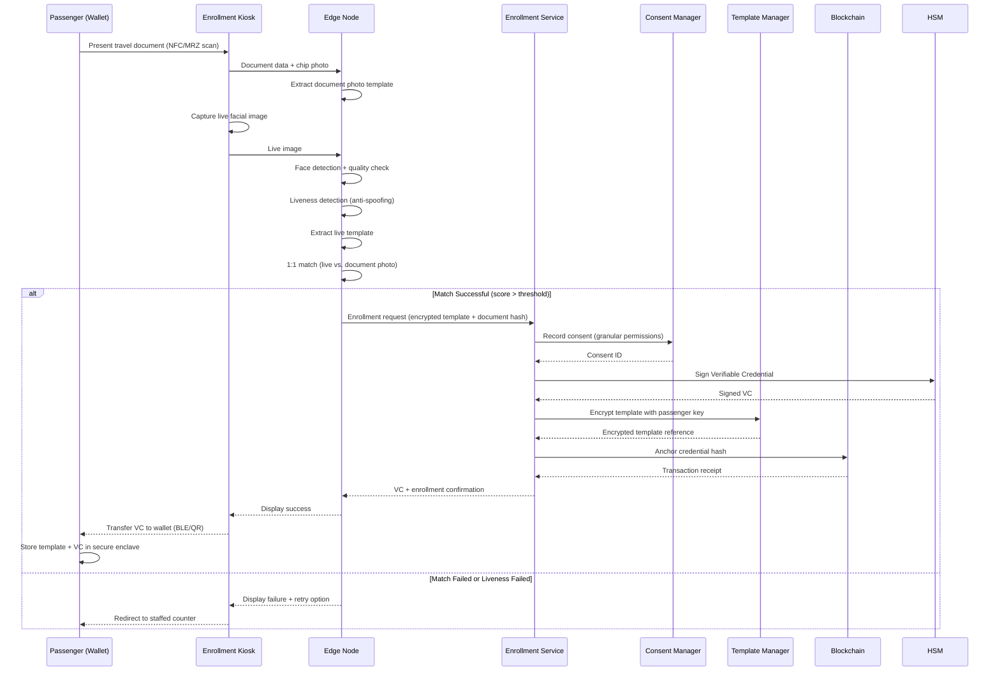
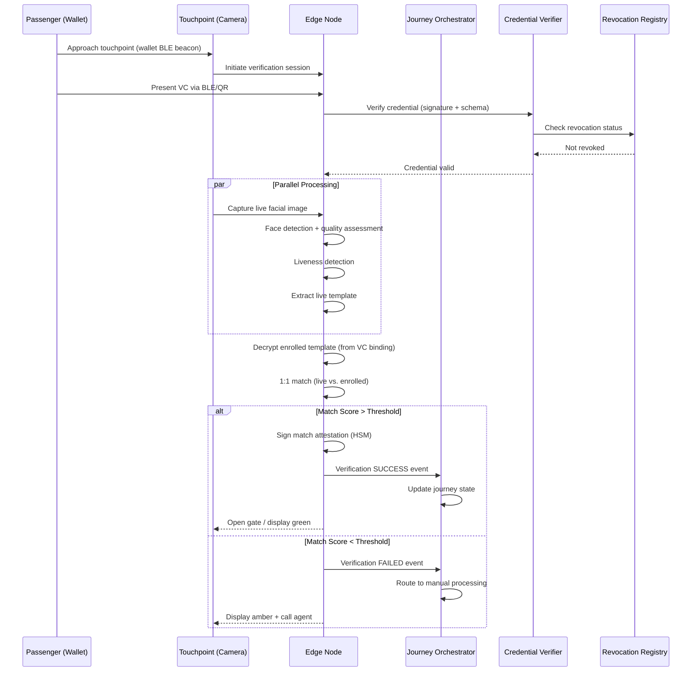
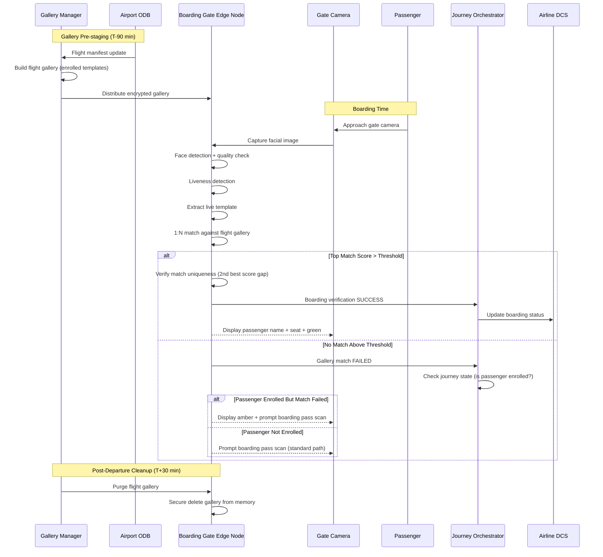

# High-Level Design — Biometric Travel Platform

## 1. System Architecture

```mermaid
flowchart TB
    subgraph Passengers["Passenger Layer"]
        WALLET[Passenger Wallet App<br/>Biometric Store · Credential Wallet]
        DOC[Travel Document<br/>e-Passport · National ID]
    end

    subgraph Touchpoints["Airport Touchpoint Layer"]
        ENROLL[Enrollment Kiosk<br/>Camera · Doc Scanner · NFC]
        CHECKIN[Check-in Gate<br/>Biometric Verification]
        BAGDROP[Bag Drop Station<br/>Face Match · BRS Link]
        SECURITY[Security Checkpoint<br/>Biometric + Watchlist]
        IMMIGRATION[Immigration e-Gate<br/>DTC Verification]
        BOARDING[Boarding Gate<br/>1:N Gallery Match]
    end

    subgraph EdgeLayer["Edge Computing Layer"]
        EDGENODE[Touchpoint Edge Node<br/>Face Detection · Quality Check]
        LOCALINFER[Local Inference Engine<br/>Template Extract · 1:1 Match]
        LIVENESS[Liveness Detector<br/>Anti-Spoofing · PAD]
        GALCACHE[Gallery Cache<br/>Flight Manifest Templates]
    end

    subgraph CoreServices["Core Services"]
        direction TB
        subgraph IdentityDomain["Identity Domain"]
            MATCHENG[Biometric Matching<br/>Engine]
            CREDVERIFY[Credential Verification<br/>Service]
            IDBROK[Identity Broker<br/>Cross-Airline Resolution]
        end
        subgraph JourneyDomain["Journey Domain"]
            ORCHESTR[Journey Orchestrator<br/>Touchpoint Sequencing]
            GALMAN[Gallery Manager<br/>Build · Distribute · Purge]
            QUEUEMGR[Queue Manager<br/>Flow Optimization]
        end
        subgraph EnrollDomain["Enrollment Domain"]
            ENROLLSVC[Enrollment Service<br/>Capture · Verify · Issue]
            CONSENT[Consent Manager<br/>Permissions · Revocation]
            TEMPLMGR[Template Manager<br/>Encrypt · Store · Delete]
        end
        subgraph IntegrationDomain["Integration Domain"]
            CUPPS[CUPPS Adapter<br/>Airline DCS Bridge]
            AODB[AODB Connector<br/>Flight · Gate Data]
            BORDER[Border Control<br/>Interface]
        end
    end

    subgraph TrustLayer["Trust & Credential Layer"]
        DIDRESOLVER[DID Resolver<br/>Decentralized ID Lookup]
        VCVERIFIER[VC Verifier<br/>Signature · Schema · Revocation]
        BLOCKCHAIN[(Permissioned Ledger<br/>Credential Registry)]
        HSM[HSM Cluster<br/>Signing Keys]
    end

    subgraph DataLayer["Data Layer"]
        BIODB[(Biometric Store<br/>Encrypted Templates)]
        JOURNEYDB[(Journey DB<br/>Touchpoint Events)]
        CONSENTDB[(Consent Store<br/>Immutable Audit Log)]
        CACHE[(Distributed Cache<br/>Session · Gallery Index)]
        ANALYTICS[(Analytics Store<br/>Flow · Throughput Data)]
    end

    subgraph Infra["Infrastructure"]
        STREAM[Event Streaming<br/>Platform]
        NOTIFY[Notification<br/>Service]
        SCHEDULER[Gallery Scheduler]
    end

    WALLET & DOC --> ENROLL
    WALLET --> CHECKIN & BAGDROP & SECURITY & IMMIGRATION & BOARDING

    ENROLL & CHECKIN & BAGDROP & SECURITY & IMMIGRATION & BOARDING --> EDGENODE
    EDGENODE --> LOCALINFER & LIVENESS
    LOCALINFER --> GALCACHE

    EDGENODE --> MATCHENG & CREDVERIFY
    MATCHENG --> BIODB & CACHE
    CREDVERIFY --> DIDRESOLVER --> VCVERIFIER --> BLOCKCHAIN
    IDBROK --> CUPPS

    ORCHESTR --> STREAM
    STREAM --> GALMAN & QUEUEMGR & NOTIFY
    GALMAN --> GALCACHE
    GALMAN --> SCHEDULER --> AODB

    ENROLLSVC --> TEMPLMGR --> BIODB
    ENROLLSVC --> CONSENT --> CONSENTDB
    ENROLLSVC --> HSM

    ORCHESTR --> JOURNEYDB
    QUEUEMGR --> ANALYTICS
    BORDER --> SECURITY & IMMIGRATION

    classDef passenger fill:#e1f5fe,stroke:#01579b,stroke-width:2px
    classDef touchpoint fill:#fff3e0,stroke:#e65100,stroke-width:2px
    classDef edge fill:#e0f7fa,stroke:#00695c,stroke-width:2px
    classDef service fill:#e8f5e9,stroke:#2e7d32,stroke-width:2px
    classDef trust fill:#fce4ec,stroke:#b71c1c,stroke-width:2px
    classDef data fill:#f3e5f5,stroke:#6a1b9a,stroke-width:2px
    classDef cache fill:#fffde7,stroke:#f57f17,stroke-width:2px
    classDef infra fill:#e0f7fa,stroke:#00695c,stroke-width:2px

    class WALLET,DOC passenger
    class ENROLL,CHECKIN,BAGDROP,SECURITY,IMMIGRATION,BOARDING touchpoint
    class EDGENODE,LOCALINFER,LIVENESS,GALCACHE edge
    class MATCHENG,CREDVERIFY,IDBROK,ORCHESTR,GALMAN,QUEUEMGR,ENROLLSVC,CONSENT,TEMPLMGR,CUPPS,AODB,BORDER service
    class DIDRESOLVER,VCVERIFIER,BLOCKCHAIN,HSM trust
    class BIODB,JOURNEYDB,CONSENTDB,ANALYTICS data
    class CACHE cache
    class STREAM,NOTIFY,SCHEDULER infra
```



---

## 2. Architectural Layers

### 2.1 Passenger Layer

The passenger layer represents the traveler's personal devices and documents—the source of biometric data and the trust anchor for decentralized identity.

**Passenger Wallet App** handles:
- Secure biometric template storage in device secure enclave (TEE/Secure Element)
- W3C Verifiable Credential storage and presentation
- Digital Travel Credential (ICAO DTC) management
- Consent management with per-touchpoint granularity
- QR code generation for touchpoint initiation
- Offline credential presentation via BLE or NFC

**Privacy Architecture:**
```
Template Storage Hierarchy:
  Primary: Device secure enclave (passenger-controlled)
  Temporary: Touchpoint edge node (duration of interaction only)
  Gallery: Edge node memory (flight-duration, auto-purged)
  Cloud: Never stored unencrypted; only encrypted with passenger key
  Backup: Encrypted to passenger recovery key, stored in wallet cloud backup
```

### 2.2 Airport Touchpoint Layer

Each touchpoint is a physical interaction point where the passenger's identity is verified biometrically. Touchpoints vary in verification requirements and latency tolerance.

**Touchpoint Characteristics:**

| Touchpoint | Match Type | Latency Budget | Initiator | Fallback |
|---|---|---|---|---|
| **Enrollment Kiosk** | 1:1 (face vs. document) | 90s total | Passenger (opt-in) | Staffed counter |
| **Check-in Gate** | 1:1 (face vs. enrolled template) | 3s | Passenger scan | Counter agent |
| **Bag Drop** | 1:1 (face vs. enrolled) + BRS link | 5s | Passenger scan | Manual tag verification |
| **Security Checkpoint** | 1:1 + watchlist screening | 5s | Camera capture | Manual document check + officer |
| **Immigration e-Gate** | 1:1 + DTC verification + entry authorization | 8s | Passenger approach | Immigration officer |
| **Boarding Gate** | 1:N (face vs. flight gallery) | 3s | Camera capture | Boarding pass scan |

### 2.3 Edge Computing Layer

Each touchpoint has a dedicated edge compute node that performs latency-sensitive biometric operations locally, reducing dependency on central cloud services.

**Edge Node Architecture:**
```
Per-Touchpoint Edge Node:
+-----------------------------------------------+
|  Camera System                                 |
|  +-- 4K RGB camera (face capture)             |
|  +-- NIR camera (liveness/depth, optional)    |
|  +-- Illumination control (IR + visible)      |
|                                                |
|  Edge Compute Unit                             |
|  +-- Face Detection (MTCNN/RetinaFace)        |
|  +-- Quality Assessment (ISO 29794-5)         |
|  +-- Template Extraction (deep learning)       |
|  +-- 1:1 Matcher (cosine similarity)          |
|  +-- Liveness Detector (PAD Level 2)          |
|  +-- Gallery Cache (in-memory, encrypted)      |
|  +-- Result Attestation (HSM-signed)          |
|                                                |
|  Inference Accelerator (NPU/TPU)               |
|  +-- 4-8 TOPS for real-time inference         |
|                                                |
|  Secure Element                                |
|  +-- Node identity certificate                |
|  +-- Result signing key                       |
|  +-- Gallery decryption key                   |
|                                                |
|  Network Interface                             |
|  +-- Airport LAN (primary)                    |
|  +-- Cellular failover (emergency)            |
|  +-- BLE (wallet communication)               |
+-----------------------------------------------+
```

**Edge Processing Pipeline:**
```
1. Face Detection        [10ms]  Locate face in camera frame
2. Quality Assessment    [5ms]   Check pose, illumination, occlusion
3. Liveness Detection    [30ms]  Passive anti-spoofing check
4. Template Extraction   [40ms]  Generate 512-dim feature vector
5. Template Matching     [5ms]   Cosine similarity against enrolled template
6. Result Attestation    [2ms]   Sign match result with node HSM
7. Event Emission        [1ms]   Publish to journey orchestrator
──────────────────────────────────
Total edge processing:   ~93ms   (well within 500ms budget)
```

### 2.4 Core Services Layer

Services are organized by bounded contexts following domain-driven design:

| Domain | Services | Responsibility |
|---|---|---|
| **Identity** | Biometric Matching Engine, Credential Verification, Identity Broker | Facial matching, credential validation, cross-airline identity resolution |
| **Journey** | Journey Orchestrator, Gallery Manager, Queue Manager | Touchpoint sequencing, gallery lifecycle, passenger flow optimization |
| **Enrollment** | Enrollment Service, Consent Manager, Template Manager | Passenger onboarding, consent lifecycle, template encryption and deletion |
| **Integration** | CUPPS Adapter, AODB Connector, Border Control Interface | Airline/airport system integration, flight data, immigration systems |

Each service:
- Owns its data store (database-per-service pattern)
- Communicates via events for cross-domain workflows
- Exposes gRPC for inter-service communication and REST for external APIs
- Maintains independent deployment and horizontal scaling
- Operates with zero access to unencrypted biometric templates (templates only decrypted at edge nodes)

### 2.5 Trust and Credential Layer

The trust layer implements the decentralized identity infrastructure that eliminates the need for a central authority.

**Credential Lifecycle:**
```
Issuance:
  1. Enrollment authority verifies passport via NFC chip + face match
  2. Authority creates W3C Verifiable Credential:
     - Subject: DID of passenger wallet
     - Claims: biometric template hash, document type, nationality (selective disclosure)
     - Proof: Ed25519 signature by issuer DID
  3. Credential anchored to permissioned blockchain (hash only, not PII)
  4. Credential stored in passenger wallet

Verification (at each touchpoint):
  1. Edge node receives credential presentation from wallet
  2. VC Verifier checks:
     a. Signature validity (issuer's public key from DID document)
     b. Credential not revoked (revocation registry lookup)
     c. Credential not expired
     d. Template hash matches live biometric template
  3. Zero-knowledge proof for selective disclosure (e.g., "over 18" without revealing birthdate)

Revocation:
  1. Issuer publishes revocation to blockchain-anchored revocation registry
  2. Edge nodes poll revocation registry every 30 seconds
  3. Revoked credentials rejected at all subsequent touchpoints
```

**Blockchain Design Decisions:**

| Decision | Choice | Rationale |
|---|---|---|
| **Ledger type** | Permissioned (consortium) | Only trusted authorities (airlines, airports, governments) participate as validators |
| **Consensus** | Byzantine fault-tolerant (PBFT variant) | Low latency (< 1s finality) for real-time credential issuance |
| **Data on-chain** | Credential hashes + revocation status only | PII never stored on-chain; GDPR right-to-erasure compliance |
| **Throughput** | ~1,000 TPS | Sufficient for credential issuance (not matching volume) |
| **Participants** | Airlines, airports, identity providers, government agencies | Multi-party trust without central authority |

---

## 3. Core Data Flows

### 3.1 Passenger Enrollment Flow



### 3.2 Touchpoint Verification Flow (1:1 Mode)



### 3.3 Boarding Gate Flow (1:N Gallery Match)



### 3.4 Consent Revocation Flow

```
1. Passenger opens wallet app -> taps "Revoke Biometric Consent"
2. Wallet sends revocation request to Consent Manager (signed by passenger DID)
3. Consent Manager:
   a. Records revocation event in immutable consent store
   b. Publishes CONSENT_REVOKED event to event stream
   c. Requests credential revocation on blockchain
4. Template Manager:
   a. Receives CONSENT_REVOKED event
   b. Deletes encrypted template from biometric store
   c. Confirms deletion with cryptographic proof (hash of deleted data + timestamp)
5. Gallery Manager:
   a. Receives CONSENT_REVOKED event
   b. Removes passenger from all active flight galleries
   c. Pushes gallery updates to affected edge nodes
6. Journey Orchestrator:
   a. Marks passenger journey as "manual-only"
   b. Notifies downstream touchpoints to use document-based processing
7. Total propagation time: < 5 minutes to all touchpoints
```

---

## 4. Key Architectural Decisions

### 4.1 On-Device Biometric Storage Over Centralized Database

| Decision | Store biometric templates on passenger device, not in centralized database |
|---|---|
| **Context** | GDPR Article 9 restricts biometric data processing; EDPB Opinion 11/2024 states only on-device or passenger-key-encrypted storage is compliant |
| **Decision** | Primary template storage in passenger wallet secure enclave; temporary copies at touchpoint edge nodes during verification only |
| **Rationale** | Eliminates centralized biometric database as an attack target; gives passengers physical control over their data; simplifies right-to-erasure (delete the credential from wallet) |
| **Trade-off** | No centralized gallery for 1:N matching; requires pre-staged flight galleries built from enrollment data |
| **Mitigation** | Gallery Manager builds temporary per-flight galleries from enrollment metadata; galleries are ephemeral and auto-purged |

### 4.2 Edge-First Biometric Processing

| Decision | Perform biometric matching at edge nodes, not in central cloud |
|---|---|
| **Context** | Touchpoint latency budget is < 500ms for 1:1, < 2s for 1:N; network round-trip to cloud adds 50-200ms |
| **Decision** | Each touchpoint edge node has dedicated inference accelerator (NPU/TPU) for local matching |
| **Rationale** | Eliminates network dependency from critical path; enables operation during cloud connectivity loss; reduces central cloud GPU costs |
| **Trade-off** | Higher hardware cost per touchpoint; model updates must be distributed to hundreds of edge nodes |
| **Mitigation** | OTA model updates during off-peak hours (2-5 AM); edge nodes fallback to cloud matching if local inference fails |

### 4.3 W3C Verifiable Credentials for Decentralized Trust

| Decision | Use W3C Verifiable Credentials with blockchain-anchored revocation instead of centralized identity database |
|---|---|
| **Context** | Multiple parties (airlines, airports, immigration) must verify passenger identity without trusting each other or a central authority |
| **Decision** | Issue W3C VCs signed by enrollment authority, anchored to permissioned blockchain, verified locally at each touchpoint |
| **Rationale** | No single point of failure or trust; offline verification possible with cached issuer keys; selective disclosure supports privacy |
| **Trade-off** | More complex than centralized database lookup; requires blockchain infrastructure; key management overhead |
| **Mitigation** | Use permissioned blockchain (not public) for performance; cache issuer keys at edge nodes; HSM-backed key management |

### 4.4 1:N Gallery Matching at Boarding Over Universal 1:N

| Decision | Build per-flight galleries for boarding gate 1:N matching instead of airport-wide gallery |
|---|---|
| **Context** | Boarding gates need to identify passengers without wallet interaction (walk-through camera); airport-wide gallery would be 100K+ faces |
| **Decision** | Gallery Manager builds a gallery of 250-5,000 enrolled templates per flight, distributed to boarding gate edge nodes |
| **Rationale** | Small gallery (5K) enables sub-2-second 1:N matching on edge hardware; reduces false positive risk proportional to gallery size; clear lifecycle (build at T-90, purge at T+30) |
| **Trade-off** | Requires pre-enrollment; passengers who enroll at the last minute may not be in gallery |
| **Mitigation** | Incremental gallery updates for late enrollments; fallback to boarding pass scan for passengers not in gallery |

### 4.5 Dual-Path Architecture: Biometric and Manual

| Decision | Maintain parallel biometric and manual processing paths as first-class architectural concerns |
|---|---|
| **Context** | Biometric path is opt-in; regulations require non-biometric alternative; 5-15% of passengers will use manual path |
| **Decision** | Every touchpoint supports both biometric and manual processing with identical downstream outcomes |
| **Rationale** | Regulatory compliance; graceful degradation when biometric system fails; accessibility for passengers who cannot enroll (medical conditions, document issues) |
| **Trade-off** | Doubled testing surface; touchpoint hardware must support both modes; operational complexity |
| **Mitigation** | Unified journey orchestrator abstracts verification method; manual path uses existing CUPPS infrastructure |

---

## 5. Inter-Service Communication

### 5.1 Communication Patterns

| Pattern | Usage | Example |
|---|---|---|
| **BLE/NFC** | Wallet-to-touchpoint credential presentation | VC transfer, enrollment data |
| **gRPC (sync)** | Edge-to-cloud verification, inter-service calls | Credential verification, journey state lookup |
| **Event streaming (async)** | Cross-service state propagation | Enrollment events, journey updates, gallery triggers |
| **REST** | External APIs, CUPPS integration, passenger-facing | Wallet API, airline DCS, consent dashboard |
| **WebSocket** | Real-time operational dashboards | Queue monitoring, touchpoint status, flow visualization |

### 5.2 Key Event Flows

```
Enrollment Events (medium volume):
  PassengerEnrolled        -> Gallery Manager, Journey Orchestrator, Analytics
  ConsentGranted           -> Consent Store, Template Manager
  ConsentRevoked           -> Template Manager, Gallery Manager, all touchpoints
  CredentialIssued         -> Blockchain Anchor, Wallet Notification

Verification Events (high volume):
  VerificationSucceeded    -> Journey Orchestrator, Analytics, DCS Update
  VerificationFailed       -> Journey Orchestrator, Exception Handler, Agent Alert
  LivenessCheckFailed      -> Security Alert, Anti-Fraud Service, Audit Log
  WatchlistHit             -> Border Control, Security Operations Center

Journey Events (high volume):
  TouchpointCleared        -> Next touchpoint preparation, Queue Manager
  PassengerBoardingReady   -> Airline DCS, Gate Display
  JourneyCompleted         -> Template Cleanup Scheduler, Analytics
  JourneyAbandoned         -> Template Cleanup, Consent Audit

Gallery Events (medium volume):
  GalleryBuildRequested    -> Gallery Manager (triggered by AODB flight schedule)
  GalleryDistributed       -> Gate Edge Nodes
  GalleryUpdatePushed      -> Gate Edge Nodes (incremental)
  GalleryPurged            -> Edge Nodes (post-departure cleanup)
```

---

## 6. Deployment Topology

### 6.1 Single Airport Deployment

```
Airport Network Zones:
+------------------------------------------------------------------+
|  LANDSIDE ZONE                                                    |
|  +------------------+  +-------------------+  +-----------------+ |
|  | Enrollment Kiosks|  | Check-in e-Gates  |  | Bag Drop        | |
|  | (20-50 units)    |  | (30-60 lanes)     |  | (20-40 units)   | |
|  +--------+---------+  +---------+---------+  +--------+--------+ |
|           |                      |                      |          |
+-----------+----------------------+----------------------+----------+
            |                      |                      |
    +-------+----------------------+----------------------+------+
    |              AIRPORT EDGE CLUSTER                          |
    |  +------------------+  +-------------------+               |
    |  | GPU Inference     |  | Gallery Manager   |               |
    |  | Cluster (8-16 GPU)|  | Service           |               |
    |  +------------------+  +-------------------+               |
    |  +------------------+  +-------------------+               |
    |  | Journey          |  | Event Streaming   |               |
    |  | Orchestrator     |  | Broker            |               |
    |  +------------------+  +-------------------+               |
    +----+---------------------------------------------------+---+
         |                                                   |
+--------+---------------------------------------------------+-----+
|  AIRSIDE ZONE                                                     |
|  +-------------------+  +-------------------+  +----------------+ |
|  | Security Gates    |  | Immigration       |  | Boarding Gates | |
|  | (40-80 lanes)     |  | e-Gates (20-40)   |  | (50-100 gates) | |
|  +-------------------+  +-------------------+  +----------------+ |
+------------------------------------------------------------------+
         |
    +----+---------------------+
    |  CLOUD SERVICES          |
    |  +-- Enrollment Backend  |
    |  +-- Consent Manager     |
    |  +-- Blockchain Nodes    |
    |  +-- Analytics Platform  |
    |  +-- Audit Log Store     |
    +---+----------------------+
        |
    +---+---------------------------+
    |  FEDERATED SERVICES           |
    |  +-- Multi-Airport Registry   |
    |  +-- Airline DCS Integration  |
    |  +-- Immigration Gateway      |
    |  +-- IATA One ID Hub          |
    +-+-----------------------------+
```

### 6.2 Multi-Airport Federation

```
Federation Architecture:

Airport A (Hub)          Airport B (Hub)          Airport C (Spoke)
+------------------+     +------------------+     +------------------+
| Local Edge       |     | Local Edge       |     | Local Edge       |
| Cluster          |     | Cluster          |     | Cluster          |
| - Matching       |     | - Matching       |     | - Matching       |
| - Orchestration  |     | - Orchestration  |     | - Orchestration  |
| - Gallery Mgmt   |     | - Gallery Mgmt   |     | - Gallery Mgmt   |
+--------+---------+     +--------+---------+     +--------+---------+
         |                        |                        |
         +------------------------+------------------------+
                                  |
                    +-------------+-------------+
                    | FEDERATION LAYER           |
                    | +-- Identity Federation    |
                    |     (cross-airport lookup) |
                    | +-- Credential Trust       |
                    |     (shared issuer keys)   |
                    | +-- Consent Propagation    |
                    |     (revocation sync)      |
                    | +-- Blockchain Network     |
                    |     (shared ledger)        |
                    +---------------------------+

Key Federation Properties:
- Each airport operates independently (no cross-airport dependency for local operations)
- Enrollment at Airport A is honored at Airport B via credential verification
- Consent revocation at any airport propagates to all within 5 minutes
- Template data never leaves the origin airport or passenger device
- Only credential metadata (hashes, revocation status) is federated
```

---

*Next: [Low-Level Design ->](./03-low-level-design.md)*
