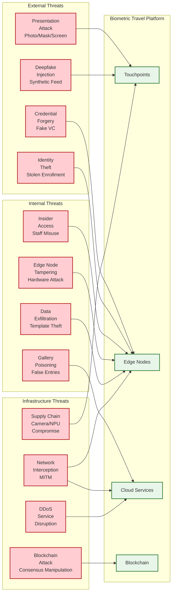

# Security & Compliance — Biometric Travel Platform

## 1. Threat Model

### 1.1 Attack Surface Analysis



### 1.2 Threat Categories and Mitigations

| Threat | Severity | Likelihood | Mitigation |
|---|---|---|---|
| **Presentation attack (photo/mask)** | Critical | High | ISO 30107-3 Level 2 PAD; multi-modal liveness (texture, depth, spectral) |
| **Deepfake injection** | Critical | Medium | Camera pipeline integrity (PRNU, hardware signing, timing analysis) |
| **Credential forgery** | Critical | Low | Ed25519 signatures; issuer trust registry; blockchain-anchored issuance |
| **Template exfiltration** | Critical | Medium | On-device storage; AES-256-GCM encryption; no centralized template DB |
| **Insider access** | High | Medium | Role-based access; no admin access to templates; audit logging |
| **Edge node tampering** | High | Low | Secure boot; hardware attestation; tamper-evident enclosures |
| **Gallery poisoning** | High | Low | Cryptographic gallery integrity; source verification; manifest cross-check |
| **MITM attack** | High | Medium | Mutual TLS; certificate pinning; encrypted credential presentation |
| **Blockchain consensus attack** | Medium | Very Low | 7 validators across 3 DCs; BFT consensus; permissioned network |
| **DDoS on enrollment** | Medium | Medium | Rate limiting; queue-based intake; CDN for static assets |
| **Identity theft (stolen enrollment)** | Critical | Low | Liveness detection; credential revocation; multi-factor at high-security touchpoints |
| **Camera/hardware supply chain** | High | Very Low | Hardware attestation; firmware signing; vendor security audits |

### 1.3 STRIDE Analysis

| Category | Threat | Control |
|---|---|---|
| **Spoofing** | Attacker presents fake biometric | Liveness detection + credential binding + camera integrity |
| **Tampering** | Modified template or credential | Cryptographic signatures on templates, credentials, and match results |
| **Repudiation** | Deny identity verification occurred | HSM-signed attestation on every match result; immutable audit log |
| **Information Disclosure** | Template leakage | On-device storage; ephemeral gallery; auto-deletion; encryption at rest and in transit |
| **Denial of Service** | Touchpoint/service overwhelmed | Rate limiting; edge autonomy; manual fallback; queue-based processing |
| **Elevation of Privilege** | Staff accesses templates | No human access to templates; automated lifecycle; separation of duties |

---

## 2. Biometric Data Protection

### 2.1 Template Protection Architecture

```
Template Lifecycle Security:

Enrollment:
  [Camera] --plaintext (in-memory only)--> [Edge NPU]
  [Edge NPU] --plaintext template (in-memory only)--> [Encryption Module]
  [Encryption Module] --AES-256-GCM encrypted--> [Wallet Secure Enclave]
  [Encryption Module] --template hash only--> [Credential Issuer]

  Template NEVER:
  - Written to edge node disk
  - Transmitted over network in plaintext
  - Stored in any centralized database
  - Accessible to any human operator

Verification:
  [Wallet] --encrypted template via BLE--> [Edge Node]
  [Edge Node Secure Enclave] --decrypt in TEE--> [Matching in TEE]
  [Matching Result] --signed by HSM--> [Journey Orchestrator]

  Template in plaintext ONLY exists:
  - Inside edge node TEE during matching (~5ms)
  - Immediately zeroed from memory after comparison

Gallery:
  [Gallery Manager] --encrypted entries--> [Edge Node]
  [Edge Node] --decrypt with gallery key--> [GPU Memory]
  [GPU Memory] --gallery templates--> [1:N Matching]
  [Post-flight] --secure memory wipe--> [Zeroed]

  Gallery templates exist on edge node for flight duration only.
  Gallery key rotated per distribution cycle.
```

### 2.2 Encryption Standards

| Layer | Algorithm | Key Management |
|---|---|---|
| **Template at rest (wallet)** | AES-256-GCM | Key in device secure enclave, derived from biometric + PIN |
| **Template in transit** | TLS 1.3 + AES-256-GCM (additional layer) | Ephemeral keys per session |
| **Gallery at rest (edge)** | AES-256-GCM | Gallery key encrypted with edge node transport key |
| **Credential signatures** | Ed25519 | Issuer key in HSM; 256-bit key |
| **Audit log integrity** | SHA-256 hash chain | Chained hashes; root hash periodically anchored to blockchain |
| **Edge node communication** | mTLS (TLS 1.3) | X.509 certificates bound to hardware secure element |
| **Blockchain transactions** | Ed25519 | Validator keys in HSM; rotation every 90 days |

### 2.3 Key Management

```
Key Hierarchy:

Master Key (HSM-protected, never exported):
  └── Credential Signing Key (per enrollment authority)
       ├── Active key (current issuance)
       └── Previous keys (for verification of old credentials)
  └── Gallery Encryption Key (per airport)
       ├── Transport keys (per edge node, rotated monthly)
       └── Session keys (per gallery distribution, ephemeral)
  └── Audit Signing Key (per data center)
       └── Log signing key (rotated daily)
  └── Blockchain Validator Key (per validator node)
       └── Consensus participation key (rotated quarterly)

Key Rotation Schedule:
  - Credential signing key: Yearly (old key remains valid for verification)
  - Transport keys: Monthly
  - Gallery encryption keys: Per distribution (ephemeral)
  - Audit signing key: Daily
  - Blockchain validator key: Quarterly
  - TLS certificates: 90 days (automated via ACME)
```

---

## 3. Anti-Spoofing and Presentation Attack Detection

### 3.1 Multi-Layer PAD Architecture

```
Layer 1: Passive Liveness (Every Touchpoint)
  - Texture analysis (CNN-based)
  - Depth estimation (monocular)
  - Reflection analysis
  - Moire pattern detection
  - Chromatic skin analysis
  Latency: 30ms | Detection rate: > 99.5%

Layer 2: Camera Integrity (Every Touchpoint)
  - Hardware frame signing
  - Sensor fingerprint (PRNU) verification
  - Frame timing consistency
  - Compression artifact detection
  Latency: 5ms | Injection detection: > 99%

Layer 3: Active Liveness (High-Security Touchpoints Only)
  - Random head pose challenge
  - Gaze tracking
  - Illumination response
  Latency: 3-8 seconds | Detection rate: > 99.9%

Layer 4: Multi-Modal Biometric (Immigration Only)
  - Facial recognition + fingerprint (if available)
  - Or facial recognition + iris scan
  - Multi-modal fusion score
  Latency: 5-10 seconds | Combined FAR: < 0.0001%

Deployment Matrix:
  Check-in Gate:   Layer 1 + Layer 2
  Bag Drop:        Layer 1 + Layer 2
  Security:        Layer 1 + Layer 2 + Layer 3
  Immigration:     Layer 1 + Layer 2 + Layer 3 + Layer 4 (optional)
  Boarding:        Layer 1 + Layer 2
```

### 3.2 Anti-Spoofing Scoring and Decision

```
ALGORITHM AntiSpoofingDecision(liveness_scores, touchpoint_type):
    // Minimum thresholds per attack type
    thresholds = {
        "texture":    0.70,    // Printed photo detection
        "depth":      0.65,    // Flat surface detection
        "reflection": 0.60,    // Screen detection
        "moire":      0.70,    // Display detection
        "skin_color": 0.55,    // Color space analysis
        "integrity":  0.90     // Camera pipeline integrity
    }

    // Stricter thresholds for high-security touchpoints
    IF touchpoint_type IN [SECURITY, IMMIGRATION]:
        FOR key IN thresholds:
            thresholds[key] += 0.10  // Raise all thresholds by 10%

    // Any single check below threshold triggers alert
    failed_checks = []
    FOR check, score IN liveness_scores:
        IF score < thresholds[check]:
            failed_checks.APPEND({check: check, score: score, threshold: thresholds[check]})

    IF failed_checks.length > 0:
        // Determine severity
        IF failed_checks.ANY(check => check.check == "integrity"):
            severity = CRITICAL  // Camera tampering suspected
            alert_security_operations = True
        ELSE IF failed_checks.length >= 3:
            severity = HIGH      // Multiple attack indicators
        ELSE:
            severity = MEDIUM    // Single indicator, may be environmental

        RETURN SpoofDecision(
            is_live = False,
            severity = severity,
            failed_checks = failed_checks,
            action = severity == CRITICAL ? "SECURITY_ALERT" : "MANUAL_REVIEW"
        )

    RETURN SpoofDecision(is_live = True)
```

---

## 4. Regulatory Compliance

### 4.1 GDPR Compliance (European Airports)

**Article 9 — Special Category Data:**

Biometric data for identification is special category data under GDPR. Processing requires:

| GDPR Requirement | Implementation |
|---|---|
| **Explicit consent (Art 9.2a)** | Per-touchpoint opt-in with clear explanation; consent recorded with timestamp and version |
| **Purpose limitation (Art 5.1b)** | Biometric data used ONLY for identity verification at specified touchpoints; no secondary use |
| **Data minimization (Art 5.1c)** | Only facial template stored (not full image); minimum data for matching |
| **Storage limitation (Art 5.1e)** | Auto-deletion within 24 hours of flight; immediate deletion on consent revocation |
| **Integrity and confidentiality (Art 5.1f)** | AES-256 encryption; on-device storage; no centralized biometric database |
| **Data Protection Impact Assessment (Art 35)** | Mandatory DPIA conducted and updated annually; published summary |
| **Data Protection by Design (Art 25)** | Architecture designed around privacy (on-device, ephemeral, encrypted) |
| **Right of access (Art 15)** | Passenger can view where their data is stored via privacy dashboard |
| **Right to erasure (Art 17)** | Consent revocation triggers immediate deletion with cryptographic proof |
| **Right to portability (Art 20)** | Verifiable Credential in W3C standard format, exportable from wallet |

**EDPB Opinion 11/2024 Compliance:**

```
EDPB Requirement: Biometric data must be stored either:
  (a) On the individual's device, OR
  (b) In a central database encrypted with a key solely in the individual's hands

Our Architecture: Both (a) and (b) satisfied:
  Primary storage: Passenger wallet secure enclave [satisfies (a)]
  Gallery storage: Edge node memory, encrypted with gallery key
    - Gallery key is NOT in passenger's hands
    - BUT: gallery templates are ephemeral (flight-duration only)
    - AND: templates in gallery are already enrolled on passenger device
    - EDPB guidance: ephemeral processing for limited duration is permissible
      when consent is specific and data is deleted promptly

Compliance Measure: Gallery templates auto-delete within 30 minutes of flight
departure. Deletion is audited and provable.
```

### 4.2 India's DPDP Act Compliance (Indian Airports)

| DPDP Act Provision | Implementation |
|---|---|
| **Notice and consent (Section 6)** | Clear notice in Hindi and English; consent before enrollment; granular permissions |
| **Purpose limitation (Section 4)** | Data processed only for airport identity verification |
| **Data fiduciary obligations (Section 8)** | Airport operator registered as data fiduciary; DPO appointed |
| **Children's data (Section 9)** | Parental consent for minors; additional safeguards for children's biometrics |
| **Data retention (Section 8.7)** | 24-hour auto-deletion; retention only for active flight period |
| **Right to correction and erasure (Section 12-13)** | Template re-enrollment for correction; consent revocation for erasure |
| **Cross-border transfer (Section 16)** | Biometric templates NEVER leave India; only credential hashes on blockchain |
| **Breach notification (Section 8.6)** | Automated breach detection; notification to DPBI within 72 hours |

### 4.3 Aadhaar Integration Security

For Indian domestic travelers, identity can be verified via Aadhaar e-KYC:

```
Aadhaar Integration Architecture:

Enrollment via Aadhaar:
  1. Passenger provides Aadhaar number at enrollment kiosk
  2. System initiates e-KYC request to UIDAI (via licensed ASA/AUA)
  3. Passenger authenticates via:
     a. Fingerprint (preferred for domestic airports)
     b. Iris scan (alternative)
     c. OTP to registered mobile (fallback)
  4. UIDAI returns: Yes/No authentication + limited KYC data
     (Name, photo, demographic — NOT Aadhaar number stored)
  5. Facial template extracted from Aadhaar photo + live capture match
  6. Verifiable Credential issued binding facial template to Aadhaar verification

Security Controls:
  - Aadhaar number NEVER stored in platform (used for authentication only)
  - e-KYC response encrypted end-to-end (UIDAI to kiosk)
  - Licensed ASA/AUA with mandatory security audit
  - Aadhaar authentication logs retained per UIDAI mandate
  - Virtual ID support: passenger can use VID instead of Aadhaar number
```

### 4.4 ICAO and IATA Compliance

| Standard | Requirement | Implementation |
|---|---|---|
| **ICAO 9303** | Travel document interoperability | NFC chip reading for e-passports; MRZ parsing |
| **ICAO DTC** | Digital Travel Credential format | Support DTC Type 1 (virtual) and Type 2 (app-based) |
| **IATA RP 1740c** | One ID implementation | Credential format aligned with IATA One ID specifications |
| **IATA RP 791** | Biometric data exchange | Inter-airline biometric transfer protocol (credential-based, not template-based) |
| **ISO/IEC 30107-3** | PAD testing certification | Independent lab certification for all liveness modules |
| **ISO/IEC 19795** | Biometric performance testing | Regular accuracy testing under operational conditions |
| **ISO/IEC 24745** | Biometric template protection | Template encryption and irreversibility requirements |

---

## 5. Access Control and Audit

### 5.1 Role-Based Access Control

```
Roles and Permissions:

PASSENGER:
  - Enroll biometric (self)
  - Present credentials at touchpoints
  - View own journey status
  - Grant/revoke consent
  - Request data deletion
  - View privacy dashboard

AIRLINE_AGENT:
  - View passenger journey status (their airline only)
  - Initiate manual verification
  - Update boarding status
  - View enrollment statistics (aggregate only)
  CANNOT: Access biometric templates, view other airlines' passengers

AIRPORT_OPERATOR:
  - Monitor touchpoint health
  - View aggregate throughput metrics
  - Manage touchpoint configuration
  - View queue status
  CANNOT: Access biometric templates, view individual passenger data

SECURITY_OFFICER:
  - Receive watchlist hit alerts
  - Initiate enhanced verification
  - Override touchpoint decisions (with audit trail)
  CANNOT: Access biometric templates directly

SYSTEM_ADMINISTRATOR:
  - Deploy model updates
  - Manage edge node configuration
  - View system health dashboards
  - Manage user roles
  CANNOT: Access biometric templates, access consent records, bypass audit

AUDITOR (read-only):
  - View consent audit trail
  - View deletion compliance reports
  - View accuracy metrics
  - View security incident logs
  CANNOT: Modify any data, access biometric templates

CRITICAL: No role has direct access to unencrypted biometric templates.
Templates are processed exclusively within edge node secure enclaves.
```

### 5.2 Audit Trail Design

```
Audit Events (Immutable, Tamper-Evident):

Every biometric interaction generates an audit record:
{
  event_id: UUID,
  timestamp: ISO-8601,
  event_type: "BIOMETRIC_VERIFICATION",
  touchpoint_id: string,
  edge_node_id: string,
  passenger_did: string (hashed for privacy),
  verification_method: "1:1" | "1:N" | "MANUAL",
  match_decision: "ACCEPT" | "REJECT" | "MANUAL_REVIEW",
  match_score: float (for biometric),
  liveness_result: "PASS" | "FAIL",
  credential_verified: boolean,
  processing_time_ms: integer,
  attestation_signature: string,
  previous_event_hash: string,    // Hash chain
  event_hash: string              // SHA-256 of this record
}

Audit Trail Properties:
  - Append-only: No updates or deletes
  - Hash-chained: Each record includes hash of previous (tamper-evident)
  - HSM-signed: Each record signed by audit signing key
  - Distributed: Replicated to 3 availability zones
  - Root anchored: Hourly root hash anchored to blockchain
  - Retention: 7 years minimum

Audit Trail Query Patterns:
  - "Show all verifications for passenger X on date Y"
  - "Show all failed verifications at touchpoint Z"
  - "Show all watchlist hits in last 24 hours"
  - "Show all consent revocations with deletion proofs"
  - "Verify hash chain integrity for date range"
```

### 5.3 Security Incident Response

```
Incident Classification:

P1 (Critical) — Respond within 15 minutes:
  - Watchlist positive match at any touchpoint
  - Camera pipeline integrity failure (deepfake injection suspected)
  - Mass presentation attack detection (organized spoofing attempt)
  - Biometric template data breach (if somehow possible despite architecture)

P2 (High) — Respond within 1 hour:
  - Edge node hardware tampering detected
  - Credential forgery attempt
  - Unusual false accept rate spike
  - Insider access anomaly detected

P3 (Medium) — Respond within 4 hours:
  - Single touchpoint failure
  - Gallery distribution failure for a flight
  - Consent management service degradation
  - Blockchain validator anomaly

Automated Response Actions:
  P1 watchlist hit:
    1. Lock boarding gate for matched passenger
    2. Alert security operations center
    3. Capture forensic snapshot (camera frame + match result)
    4. Notify airline security coordinator
    5. Hold flight boarding if critical

  P1 camera integrity failure:
    1. Disable affected touchpoint immediately
    2. Redirect passengers to adjacent touchpoints
    3. Alert airport IT and security
    4. Capture forensic logs from edge node
    5. Quarantine edge node for analysis
```

---

## 6. Watchlist Screening

### 6.1 Secure Watchlist Integration

Watchlist screening must be performed without exposing the watchlist to the biometric matching engine or vice versa:

```
Watchlist Screening Architecture:

Design Principle: The biometric matching engine and the watchlist
screening engine are SEPARATE systems with a minimal, audited interface.

Flow:
  1. Passenger enrolls (or reaches security touchpoint)
  2. Edge node extracts facial template
  3. Template sent to SECURE SCREENING ENCLAVE (not the regular matching engine)
  4. Inside the enclave:
     a. Template compared against watchlist gallery
     b. Watchlist gallery pre-staged by government authority
     c. Result: CLEAR or ALERT (no other information leaked)
  5. If ALERT: security protocol triggered
  6. If CLEAR: normal biometric journey continues

  The regular biometric matching engine NEVER sees the watchlist.
  The watchlist screening enclave NEVER accesses passenger enrollment data.
  Only the CLEAR/ALERT result crosses the boundary.

Privacy Protection:
  - Watchlist templates provided by government authority (encrypted)
  - Watchlist templates decrypted only inside secure enclave
  - No biometric template stored after screening
  - Audit log records that screening occurred (not the result, unless ALERT)
  - CLEAR results not retained; only ALERT results logged for security
```

---

*Next: [Observability ->](./07-observability.md)*
