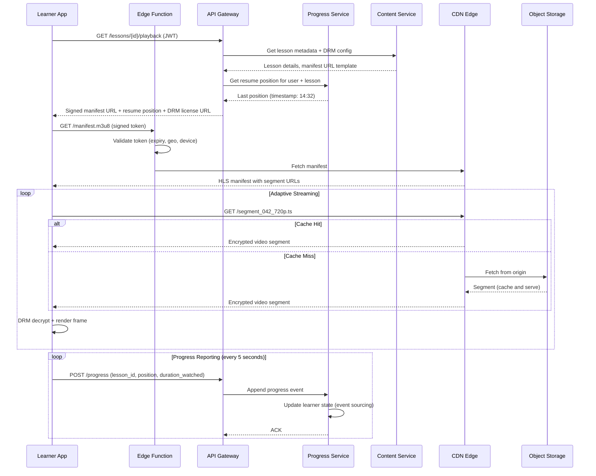
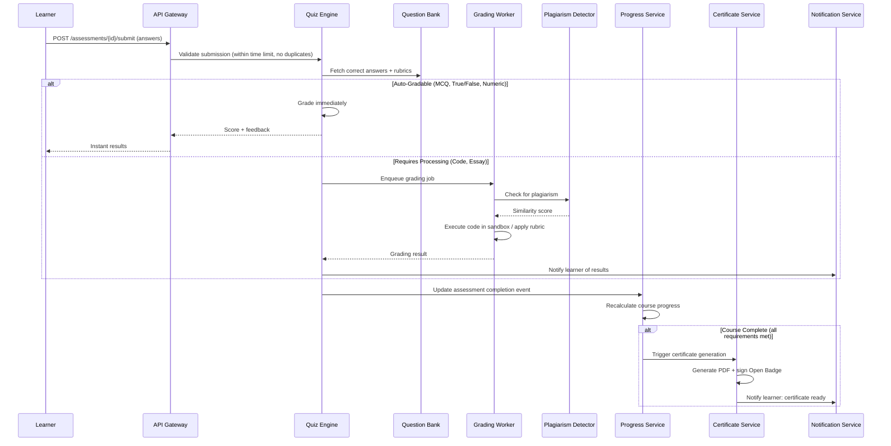

# High-Level Design — Online Learning Platform

## 1. System Architecture

```mermaid
flowchart TB
    subgraph Clients["Client Layer"]
        WEB[Web Application<br/>React SPA]
        MOB[Mobile Apps<br/>iOS · Android]
        TV[Smart TV App<br/>Lean-back Viewing]
        EMBED[LTI Embed<br/>Third-Party LMS]
    end

    subgraph Edge["CDN & Edge Layer"]
        CDN[Multi-CDN<br/>Video Delivery · Static Assets]
        EDGEFN[Edge Functions<br/>Auth · Geo-routing · A/B]
    end

    subgraph Gateway["API Gateway Layer"]
        APIGW[API Gateway<br/>Rate Limit · Auth · Routing]
        GQLGW[GraphQL Gateway<br/>Client-Driven Queries]
    end

    subgraph ContentPipeline["Content Pipeline"]
        UPLOAD[Upload Service<br/>Chunked Upload · Validation]
        TRANSCODE[Transcoding Pipeline<br/>Multi-Bitrate · HLS/DASH]
        DRM[DRM Packaging<br/>Widevine · FairPlay · PlayReady]
        SUBTITLE[Subtitle Processor<br/>SRT/VTT · Auto-Caption]
    end

    subgraph CoreServices["Core Services"]
        direction TB
        subgraph CourseDomain["Course Domain"]
            COURSE[Course Service<br/>Catalog · Versioning]
            CONTENT[Content Service<br/>Lesson Graph · Prerequisites]
            SEARCH[Search Service<br/>Full-Text · Faceted]
        end
        subgraph LearnerDomain["Learner Domain"]
            PROGRESS[Progress Service<br/>Event-Sourced State]
            ENROLL[Enrollment Service<br/>Subscriptions · Access]
            PROFILE[Profile Service<br/>Preferences · History]
        end
        subgraph AssessmentDomain["Assessment Domain"]
            QUIZ[Quiz Engine<br/>Auto-Grade · Timer]
            ASSIGN[Assignment Service<br/>Submission · Peer Review]
            PLAG[Plagiarism Detector<br/>Similarity Analysis]
        end
        subgraph CredentialDomain["Credential Domain"]
            CERT[Certificate Service<br/>Generation · Signing]
            BADGE[Badge Service<br/>Open Badges 3.0]
            VERIFY[Verification API<br/>Public Credential Check]
        end
    end

    subgraph Intelligence["AI/ML Layer"]
        RECOM[Recommendation<br/>Engine]
        ADAPTIVE[Adaptive Learning<br/>Path Optimizer]
        ENGAGE[Engagement<br/>Predictor]
    end

    subgraph Monetization["Monetization Layer"]
        PAY[Payment Service<br/>Subscriptions · Purchases]
        LICENSE[Enterprise Licensing<br/>B2B Seat Management]
        PROMO[Promotion Engine<br/>Coupons · Trials]
    end

    subgraph Data["Data Layer"]
        RELDB[(Relational DB<br/>Courses · Users · Enrollments)]
        DOCDB[(Document DB<br/>Content Blocks · Metadata)]
        TSDB[(Time-Series DB<br/>Progress Events · Analytics)]
        SEARCHDB[(Search Index<br/>Course Catalog)]
        CACHE[(Distributed Cache<br/>Sessions · Hot Data)]
        OBJSTORE[(Object Storage<br/>Video · Thumbnails · PDFs)]
        LAKE[(Data Lake<br/>Analytics · ML Training)]
    end

    subgraph Infra["Infrastructure"]
        STREAM[Event Streaming<br/>Platform]
        NOTIFY[Notification Service<br/>Email · Push · In-App]
        SCHED[Job Scheduler<br/>Cron · Batch Jobs]
        QUEUE[Task Queue<br/>Async Processing]
    end

    WEB & MOB & TV & EMBED --> CDN
    CDN --> EDGEFN --> APIGW
    APIGW --> GQLGW
    GQLGW --> COURSE & PROGRESS & ENROLL & QUIZ & CERT & PAY & SEARCH

    UPLOAD --> TRANSCODE --> DRM --> OBJSTORE
    TRANSCODE --> SUBTITLE
    DRM --> CDN

    COURSE --> RELDB & DOCDB
    CONTENT --> DOCDB & CACHE
    SEARCH --> SEARCHDB
    PROGRESS --> TSDB & CACHE & STREAM
    ENROLL --> RELDB
    PROFILE --> RELDB & CACHE

    QUIZ --> RELDB & QUEUE
    ASSIGN --> RELDB & OBJSTORE & PLAG
    CERT --> BADGE & OBJSTORE
    VERIFY --> CACHE & RELDB

    STREAM --> RECOM & ADAPTIVE & ENGAGE & LAKE
    RECOM --> CACHE
    PAY --> RELDB
    LICENSE --> RELDB

    SCHED --> TRANSCODE & RECOM & CERT
    NOTIFY --> QUEUE

    classDef client fill:#e1f5fe,stroke:#01579b,stroke-width:2px
    classDef cdn fill:#fff3e0,stroke:#e65100,stroke-width:2px
    classDef gateway fill:#fff3e0,stroke:#e65100,stroke-width:2px
    classDef pipeline fill:#e0f7fa,stroke:#00695c,stroke-width:2px
    classDef service fill:#e8f5e9,stroke:#2e7d32,stroke-width:2px
    classDef ai fill:#fce4ec,stroke:#b71c1c,stroke-width:2px
    classDef money fill:#fff3e0,stroke:#e65100,stroke-width:2px
    classDef data fill:#f3e5f5,stroke:#6a1b9a,stroke-width:2px
    classDef cache fill:#fffde7,stroke:#f57f17,stroke-width:2px
    classDef infra fill:#e0f7fa,stroke:#00695c,stroke-width:2px

    class WEB,MOB,TV,EMBED client
    class CDN,EDGEFN cdn
    class APIGW,GQLGW gateway
    class UPLOAD,TRANSCODE,DRM,SUBTITLE pipeline
    class COURSE,CONTENT,SEARCH,PROGRESS,ENROLL,PROFILE,QUIZ,ASSIGN,PLAG,CERT,BADGE,VERIFY service
    class RECOM,ADAPTIVE,ENGAGE ai
    class PAY,LICENSE,PROMO money
    class RELDB,DOCDB,TSDB,SEARCHDB,LAKE,OBJSTORE data
    class CACHE cache
    class STREAM,NOTIFY,SCHED,QUEUE infra
```



---

## 2. Architectural Layers

### 2.1 Client Layer

The platform supports multiple client types, each with distinct content consumption patterns:

**Web Application** handles:
- Full course browsing, enrollment, and video playback via adaptive streaming player
- Rich text editor for discussion forums and assignment submissions
- Real-time progress synchronization via WebSocket connections
- Instructor content authoring and analytics dashboards

**Mobile Applications (iOS/Android)** handle:
- Offline content download with encrypted storage and DRM enforcement
- Background progress synchronization when connectivity resumes
- Push notification delivery for deadlines, streaks, and recommendations
- Adaptive video quality based on network conditions and battery state

**Smart TV App** handles:
- Lean-back video viewing with simplified navigation (10-foot UI)
- Voice-controlled course search and playback controls
- Progress sync with mobile/web sessions for seamless device switching

**LTI Embed** handles:
- Standards-based integration with third-party learning management systems
- Grade passback for assessment results
- Single sign-on via LTI 1.3 / Advantage protocol

### 2.2 CDN & Edge Layer

The CDN layer handles the vast majority of bandwidth—delivering video segments, thumbnails, static assets, and cached API responses from edge locations closest to learners.

**Multi-CDN Strategy:**
- Primary CDN handles 70% of traffic; secondary CDN handles 30% for redundancy
- Real-time CDN performance monitoring with automatic traffic shifting on degradation
- Origin shield to protect object storage from thundering herd during cache misses
- Geo-restriction enforcement at the edge for content licensing requirements

**Edge Functions:**
- Token-based video URL signing (short-lived, geo-restricted, device-bound)
- A/B test assignment at the edge for zero-latency experimentation
- Bot detection and rate limiting before requests reach origin
- Regional content routing based on learner geography and CDN health

### 2.3 API Gateway Layer

**API Gateway** handles:
- JWT validation and token refresh for authenticated requests
- Rate limiting: per-user (100 req/sec), per-IP (500 req/sec), per-endpoint adaptive limits
- Request routing to backend microservices based on URL path and version headers
- Response caching for read-heavy endpoints (course catalog, search results)
- Circuit breaking to prevent cascade failures from downstream service outages

**GraphQL Gateway** handles:
- Client-driven query composition to reduce over-fetching on mobile
- Dataloader batching to prevent N+1 query patterns across services
- Schema stitching across course, progress, enrollment, and assessment domains
- Query complexity analysis to reject expensive queries before execution

### 2.4 Content Pipeline

The content pipeline transforms instructor-uploaded raw video into DRM-protected, multi-bitrate streaming packages distributed globally.

**Upload Service:**
- Resumable chunked uploads (5 MB chunks) for large video files
- Client-side hash verification for integrity (SHA-256 per chunk)
- Virus scanning and content type validation before processing
- Upload progress tracking with webhook notifications on completion

**Transcoding Pipeline:**
```
Input: Raw video (MP4, MOV, AVI, up to 4K resolution)

Step 1: Probe → Extract metadata (codec, resolution, duration, audio channels)
Step 2: Normalize → Convert to standard intermediate format (ProRes or high-bitrate H.264)
Step 3: Encode → Generate multiple renditions:
         ┌─ 1080p @ 5 Mbps (H.264 + AAC)
         ├─ 720p  @ 2.5 Mbps
         ├─ 480p  @ 1 Mbps
         ├─ 360p  @ 500 Kbps
         └─ Audio-only @ 128 Kbps (for bandwidth-constrained learners)
Step 4: Segment → Split into 6-second segments (HLS .ts + DASH .m4s)
Step 5: Package → Generate manifests (HLS .m3u8, DASH .mpd)
Step 6: Encrypt → Apply DRM encryption (Widevine + FairPlay + PlayReady)
Step 7: Extract → Generate thumbnails, preview sprites, waveform visualization
Step 8: Distribute → Push encrypted segments to CDN origin storage
```

**Subtitle Processor:**
- Auto-captioning via speech-to-text ML model for uploaded videos
- Support for instructor-uploaded SRT/VTT subtitle files
- Multi-language subtitle alignment and synchronization
- Subtitle search indexing (learners can search within video transcripts)

### 2.5 Core Services Layer

Services are organized by bounded contexts following domain-driven design:

| Domain | Services | Responsibility |
|---|---|---|
| **Course** | Course Service, Content Service, Search Service | Catalog management, content graph, discovery |
| **Learner** | Progress Service, Enrollment Service, Profile Service | Learning state, access control, preferences |
| **Assessment** | Quiz Engine, Assignment Service, Plagiarism Detector | Evaluation, grading, integrity enforcement |
| **Credential** | Certificate Service, Badge Service, Verification API | Credential issuance, signing, public verification |

Each service:
- Owns its data store (database-per-service pattern)
- Communicates via events for cross-domain workflows (enrollment triggers progress initialization)
- Exposes gRPC for inter-service communication and REST/GraphQL for external APIs
- Maintains independent deployment, scaling, and failure isolation

### 2.6 AI/ML Intelligence Layer

**Recommendation Engine:**
- Hybrid model: collaborative filtering (learners with similar history) + content-based (skill similarity, instructor style)
- Real-time feature updates from progress event stream (recently completed, abandoned, high-engagement courses)
- Cold-start handling: new learners get onboarding quiz → skill-based recommendations; new courses get content-based features until interaction data accumulates
- A/B testing framework for recommendation algorithm variants

**Adaptive Learning Path Optimizer:**
- Analyzes learner performance across assessments to identify knowledge gaps
- Dynamically adjusts lesson ordering and difficulty within a course
- Recommends prerequisite courses when assessment scores indicate missing foundational knowledge
- Models learner proficiency using Item Response Theory (IRT) for accurate skill estimation

**Engagement Predictor:**
- Predicts learner drop-off risk based on engagement patterns (decreasing session frequency, skipping videos, failing assessments)
- Triggers proactive interventions: encouragement notifications, deadline reminders, study buddy suggestions
- Feeds into notification prioritization to avoid alert fatigue

---

## 3. Core Data Flows

### 3.1 Video Playback Flow



### 3.2 Assessment Submission Flow



### 3.3 Content Publishing Flow

```
1. Instructor uploads raw video via chunked upload API
2. Upload Service validates format, scans for malware, stores to staging bucket
3. Content Moderation Service performs:
   a. Automated quality checks (resolution, audio levels, duration)
   b. Copyright detection (audio fingerprinting, visual similarity)
   c. Policy compliance (no prohibited content)
4. If moderation passes → Transcoding Pipeline activates:
   a. Encode to multiple bitrates (1080p, 720p, 480p, 360p, audio-only)
   b. Segment into 6-second chunks
   c. Generate HLS/DASH manifests
   d. Apply DRM encryption (Widevine + FairPlay + PlayReady)
   e. Extract thumbnails, preview sprites, transcript
5. Auto-captioning generates subtitle tracks
6. Instructor reviews and edits auto-captions
7. Instructor adds lesson to course content graph (prerequisites, ordering)
8. Instructor publishes → Content Service:
   a. Validates content graph integrity (no cycles, prerequisites satisfied)
   b. Updates course version
   c. Pushes encrypted segments to CDN origin
   d. Invalidates cached catalog entries
   e. Emits CourseUpdated event → Search Service re-indexes
9. Enrolled learners see updated content on next page load
```

---

## 4. Key Architectural Decisions

### 4.1 Event-Sourced Progress Tracking

| Decision | Event sourcing for learner progress, not CRUD updates |
|---|---|
| **Context** | Progress tracking requires sub-second persistence, cross-device resume, and complete learning history for analytics |
| **Decision** | Append-only progress events (VideoWatched, QuizCompleted, LessonResumed) with materialized views for current state |
| **Rationale** | Never loses data (append-only), natural audit trail, enables replay for analytics, supports eventual consistency across devices |
| **Trade-off** | Higher storage cost than CRUD; requires snapshot/compaction for fast state reconstruction |
| **Mitigation** | Periodic snapshots (every 100 events per learner-course pair) enable fast state load; cold events archived to data lake |

### 4.2 Multi-CDN Strategy for Video Delivery

| Decision | Use 2–3 CDN providers with intelligent traffic routing |
|---|---|
| **Context** | 15 Tbps peak bandwidth; single CDN provider cannot guarantee availability in all regions |
| **Decision** | Primary CDN handles 70% of traffic; secondary CDN handles 30%; real-time quality monitoring shifts traffic on degradation |
| **Rationale** | No single CDN has optimal PoP coverage everywhere; multi-CDN provides resilience against provider-level outages and commercial leverage for pricing |
| **Trade-off** | DRM license management complexity increases; cache efficiency lower with split traffic; operational overhead of monitoring multiple CDNs |
| **Mitigation** | Unified DRM license server; CDN-agnostic signed URLs; centralized CDN performance dashboard with automated failover rules |

### 4.3 GraphQL for Client-Facing API

| Decision | GraphQL gateway in front of REST microservices |
|---|---|
| **Context** | Multiple clients (web, mobile, TV) with vastly different data needs per screen |
| **Decision** | GraphQL gateway with schema stitching across course, progress, enrollment, and assessment domains |
| **Rationale** | Mobile course detail page needs title + progress + next lesson. Web needs title + full syllabus + reviews + instructor bio + related courses. GraphQL lets each client fetch exactly what it needs in one round trip |
| **Trade-off** | Query complexity attacks, caching harder than REST, additional gateway layer |
| **Mitigation** | Query depth/complexity limits, persisted queries for production clients, CDN-level caching via query hash |

### 4.4 Separate Read and Write Models (CQRS) for Course Catalog

| Decision | CQRS pattern: writes to relational DB, reads from search index + cache |
|---|---|
| **Context** | Course catalog is read-heavy (50,000 QPS search) with infrequent writes (hundreds of course updates/hour) |
| **Decision** | Instructors write to relational DB (source of truth). Change events propagate to search index and distributed cache. Learners read from optimized read models |
| **Rationale** | Search index provides full-text, faceted, relevance-scored queries impossible with SQL. Caching eliminates repeated DB reads. Write path stays simple and consistent |
| **Trade-off** | Eventual consistency between write and read models (seconds of delay) |
| **Mitigation** | After course publish, instructor dashboard reads from write model directly; learner-facing catalog tolerates 5-second staleness |

### 4.5 Sandbox Execution for Code Assessments

| Decision | Run learner-submitted code in ephemeral sandboxed containers |
|---|---|
| **Context** | Programming courses require executing untrusted learner code for grading |
| **Decision** | Each code submission runs in a fresh container with strict resource limits (CPU: 1 core, memory: 256 MB, time: 30 seconds, no network, read-only filesystem except /tmp) |
| **Rationale** | Complete isolation prevents learner code from affecting the platform; ephemeral containers leave no state between submissions |
| **Trade-off** | Container cold start adds 1–2 seconds latency; resource overhead for container orchestration |
| **Mitigation** | Pre-warmed container pools by language; container reuse with filesystem reset between submissions for same language |

---

## 5. Inter-Service Communication

### 5.1 Communication Patterns

| Pattern | Usage | Example |
|---|---|---|
| **GraphQL** | Client-to-gateway queries | Course detail page, learner dashboard, search results |
| **REST** | Client-to-service mutations, external APIs | Enrollment, payment, certificate download |
| **gRPC** | Low-latency inter-service calls | Progress service → certificate trigger, enrollment check |
| **Event streaming** | Async cross-domain workflows | ProgressUpdated → recommendation refresh, analytics |
| **WebSocket** | Real-time client push | Live session chat, progress sync, notification delivery |
| **Task queue** | Async heavy processing | Video transcoding, certificate PDF generation, plagiarism check |

### 5.2 Key Event Flows

```
Content Events (low volume, high impact):
  CoursePublished         → Search Index, CDN Warmup, Notification (enrolled learners)
  LessonAdded             → Content Graph Validation, Progress Recalculation
  CourseVersionUpdated    → Cache Invalidation, Enrollment Notification

Learner Events (high volume):
  VideoProgressRecorded   → Progress State, Analytics Pipeline, Engagement Predictor
  LessonCompleted         → Progress Recalculation, Gamification (XP, streak), Next Lesson Suggestion
  CourseCompleted         → Certificate Generation, Recommendation Refresh, Notification

Assessment Events (medium volume, high integrity):
  QuizSubmitted           → Auto-Grader, Progress Update, Analytics
  AssignmentSubmitted     → Plagiarism Check, Peer Review Assignment, Grading Queue
  PeerReviewCompleted     → Grade Aggregation, Notification to Submitter

Monetization Events (low volume, high consistency):
  PaymentCompleted        → Enrollment Grant, Receipt Generation, Revenue Analytics
  SubscriptionRenewed     → Access Extension, Invoice Generation
  RefundProcessed         → Enrollment Revocation, Certificate Revocation Check
```

---

## 6. Deployment Topology

### 6.1 Multi-Region Active-Active

```
Region A (US-East)                     Region B (EU-West)
┌────────────────────────────┐        ┌────────────────────────────┐
│ API Gateway Fleet          │◄──────►│ API Gateway Fleet          │
│ Core Services Pods         │        │ Core Services Pods         │
│ GraphQL Gateway            │        │ GraphQL Gateway            │
│ Relational DB (Leader)     │──sync─►│ Relational DB (Follower)   │
│ Progress TSDB (Primary)    │──sync─►│ Progress TSDB (Replica)    │
│ Search Index (Primary)     │──sync─►│ Search Index (Replica)     │
│ Transcoding Workers        │        │ Transcoding Workers        │
│ ML Model Serving           │        │ ML Model Serving           │
└────────────────────────────┘        └────────────────────────────┘

Region C (AP-Southeast)
┌────────────────────────────┐
│ API Gateway Fleet          │
│ Core Services Pods (read)  │
│ Relational DB (Follower)   │
│ Progress TSDB (Replica)    │
│ Transcoding Workers        │
└────────────────────────────┘

Global Services:
  - Multi-CDN: 200+ PoPs across 6 continents
  - DNS-based geo-routing for API traffic
  - Cross-region event replication for progress consistency
  - Object storage with cross-region replication for video content
  - Global rate limiting via distributed counter (edge-level)
```

### 6.2 CDN Architecture

```
Learner Device
    │
    ▼
CDN Edge PoP (nearest)
    │
    ├── Cache HIT (95%+) → Serve encrypted segment directly
    │
    └── Cache MISS →
            │
            ▼
        CDN Origin Shield (regional)
            │
            ├── Cache HIT → Serve + populate edge cache
            │
            └── Cache MISS →
                    │
                    ▼
                Object Storage (origin)
                    │
                    └── Serve + populate shield + edge cache

Cache Hierarchy:
  L1: Edge PoP (200+ locations, ~10 TB each)     → P95 < 50ms
  L2: Origin Shield (3 regions, ~100 TB each)     → P95 < 150ms
  L3: Object Storage (3 regions, cross-replicated) → P95 < 500ms
```

---

*Next: [Low-Level Design ->](./03-low-level-design.md)*
