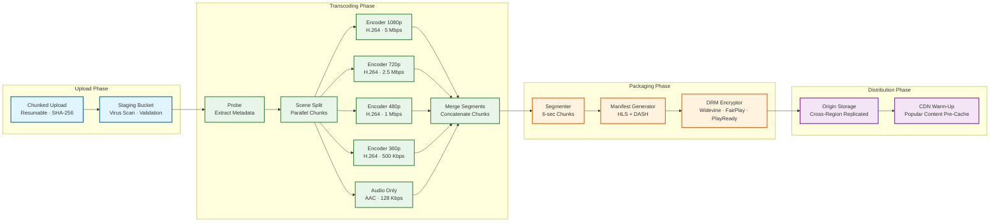
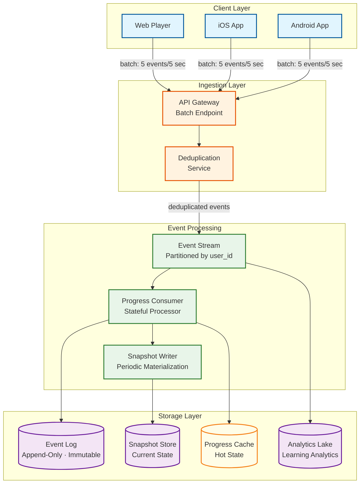

# Deep Dive & Bottlenecks — Online Learning Platform

## 1. Video Delivery Pipeline Deep Dive

### 1.1 Transcoding Architecture

The transcoding pipeline is the most resource-intensive background process, converting instructor-uploaded raw video into multiple DRM-protected adaptive bitrate renditions.



**Key Design Decisions:**

**Scene-Split Parallel Encoding:** Rather than encoding each rendition sequentially, the pipeline splits the source video at scene boundaries (keyframes) into 30-second chunks. Each chunk is encoded in parallel across all renditions simultaneously. For a 12-minute lecture, this produces ~24 chunks × 5 renditions = 120 parallel encoding tasks. A distributed task queue fans these out across a pool of GPU-accelerated encoding workers.

**Two-Pass Encoding vs. CRF:** The pipeline uses two-pass variable bitrate encoding rather than constant rate factor (CRF). Two-pass produces more consistent quality across scenes (talking head vs. screen recording vs. whiteboard) at the target bitrate, which is critical for educational content where visual clarity of diagrams and code is non-negotiable.

**CMAF (Common Media Application Format):** The pipeline produces CMAF-compliant segments that serve both HLS and DASH from the same encrypted segments. This eliminates the need to store separate HLS and DASH segment files, reducing storage by approximately 40% compared to dual-format packaging.

### 1.2 Adaptive Bitrate Streaming

```
Client-Side ABR Algorithm (simplified):

FUNCTION selectQualityLevel(available_renditions, network_state):
    measured_bandwidth ← network_state.smoothed_throughput
    buffer_level ← network_state.buffer_seconds

    // Conservative: target 80% of measured bandwidth
    target_bitrate ← measured_bandwidth × 0.8

    // Buffer-based adjustment
    IF buffer_level < 5 seconds:
        // Emergency: drop to lowest quality to refill buffer
        RETURN available_renditions.lowest
    ELSE IF buffer_level < 15 seconds:
        // Conservative: don't upgrade, consider downgrade
        target_bitrate ← target_bitrate × 0.7
    ELSE IF buffer_level > 30 seconds:
        // Comfortable: can try upgrading
        target_bitrate ← target_bitrate × 1.2

    // Select highest rendition that fits within target bitrate
    selected ← NULL
    FOR EACH rendition IN available_renditions (sorted by bitrate DESC):
        IF rendition.bitrate <= target_bitrate:
            selected ← rendition
            BREAK

    RETURN selected OR available_renditions.lowest
```

**Buffering Mitigation Strategies:**
- **Pre-loading next lesson:** While learner watches current video, pre-fetch first 30 seconds of next lesson at lowest quality
- **Quality hysteresis:** Require 3 consecutive "upgrade-eligible" measurements before actually upgrading (prevents quality oscillation)
- **Startup quality:** Always start at 480p for fast time-to-first-byte, then upgrade after buffer fills to 15+ seconds
- **Bandwidth estimation:** Use exponentially weighted moving average (EWMA) of last 10 segment download times, not instantaneous measurement

### 1.3 DRM Architecture

```
DRM License Acquisition Flow:

1. Client requests manifest from CDN (includes DRM system info)
2. Player extracts content key ID from manifest
3. Player's CDN module requests license from DRM License Server:
   a. Widevine → for Chrome, Android, Smart TVs
   b. FairPlay → for Safari, iOS
   c. PlayReady → for Edge, Windows apps
4. License Server validates:
   - User authentication token (JWT)
   - Enrollment status (active enrollment for this course)
   - Device count limit (max 3 concurrent devices)
   - Geographic restrictions (content licensing)
5. License Server issues time-limited content key:
   - License duration: 24 hours (online), 30 days (offline download)
   - Output protection: HDCP required for HD content
   - Persistence: allowed for offline downloads, prohibited for streaming
6. Player decrypts segments using content key
7. Client-side watermarking embeds invisible user ID in rendered frames
```

**DRM Bottlenecks:**
- **License server latency** adds 200–500ms to initial playback start. Mitigation: pre-fetch license during page load (before play button click), edge-cache license tokens by content key ID + user tier.
- **Multi-DRM complexity:** Three separate DRM systems must be maintained. Mitigation: use a DRM-as-a-service provider or a unified multi-DRM proxy that abstracts Widevine/FairPlay/PlayReady behind a single API.

---

## 2. Progress Tracking Deep Dive

### 2.1 Event-Sourced Progress Architecture

Progress tracking is the most consistency-critical component—losing a learner's progress is equivalent to losing a bank transaction.



**Event Sourcing Design:**

```
Progress State Reconstruction:

FUNCTION getProgressState(user_id, course_id):
    // 1. Try cache first (95% hit rate)
    cached ← progressCache.get(user_id, course_id)
    IF cached IS NOT NULL AND cached.age < 30 seconds:
        RETURN cached

    // 2. Load latest snapshot
    snapshot ← snapshotStore.getLatest(user_id, course_id)
    state ← snapshot.state  // or empty state if no snapshot

    // 3. Replay events since snapshot
    events ← eventLog.getEventsAfter(
        user_id, course_id,
        since=snapshot.event_sequence_number
    )

    FOR EACH event IN events:
        state ← applyEvent(state, event)

    // 4. Update cache
    progressCache.set(user_id, course_id, state, ttl=30s)

    // 5. Create snapshot if too many events since last snapshot
    IF events.count > 100:
        snapshotStore.save(user_id, course_id, state, events.last.sequence_number)

    RETURN state
```

### 2.2 Cross-Device Progress Synchronization

The synchronization protocol ensures a learner can pause on their phone, then resume on their laptop at exactly the same position.

```
Sync Protocol:

Client → Server (on progress event):
  {
    client_timestamp: "2026-03-01T14:30:05.123Z",
    device_id: "iphone_uuid",
    session_id: "session_uuid",
    sequence: 47,  // monotonically increasing per session
    events: [
      { type: "video_progress", lesson_id: "L1", position: 872, watched: 5 }
    ]
  }

Server Processing:
  1. Validate sequence number (reject if ≤ last seen for this session)
  2. Validate timestamp (reject if > server_time + 5 seconds drift tolerance)
  3. Conflict resolution for cross-device:
     - If two devices report different positions for same lesson within 60 seconds:
       → Accept the LATER timestamp (most recent activity wins)
     - If positions differ by > 60 seconds:
       → Both are likely valid (learner watching different parts)
       → Store both; display the most recent when resuming
  4. Persist events to event log
  5. Update progress cache
  6. Push state update to other connected devices via WebSocket

Client → Server (on session start):
  GET /progress/sync?course_id=C1&device_id=laptop_uuid
  Response: latest progress state (merged from all devices)
```

### 2.3 Offline Progress Handling

```
Mobile Offline Flow:

1. Learner downloads course content for offline viewing (encrypted, DRM-protected)
2. During offline playback, progress events accumulate in local SQLite database
3. On reconnection:
   a. Client sends batch of offline events with original timestamps
   b. Server receives events and validates:
      - Timestamp range (must be within downloaded lesson's DRM license window)
      - Event consistency (positions must be monotonically increasing within a session)
      - Deduplication (client retries may send same batch twice)
   c. Server applies events in timestamp order
   d. Server recalculates progress state
   e. Server returns merged state to client
4. Client replaces local state with server-confirmed state

Edge Case: Offline progress conflicts
  - Learner watches on phone offline, then watches same lesson on laptop online
  - Server has laptop progress; phone uploads older offline progress
  - Resolution: union of watched intervals (both count), take MAX position for resume
```

---

## 3. Assessment Engine Deep Dive

### 3.1 Anti-Cheating Architecture

```
Threat Model for Assessment Integrity:

Attack Vector                    | Mitigation
─────────────────────────────────┼────────────────────────────────────────
Share answers between accounts   | Question randomization (order + options)
                                 | Large question pools (3x questions per quiz)
                                 | Per-learner question selection from pool
─────────────────────────────────┼────────────────────────────────────────
Use multiple accounts            | Device fingerprinting
                                 | IP correlation analysis
                                 | Submission timing pattern analysis
─────────────────────────────────┼────────────────────────────────────────
Look up answers during quiz      | Time limits with per-question timing
                                 | Suspicious timing detection (instant correct
                                 | answers after long pauses = lookup pattern)
─────────────────────────────────┼────────────────────────────────────────
Copy-paste from external source  | Plagiarism detection for essays
                                 | Code similarity analysis (AST comparison)
                                 | Typing pattern analysis (paste vs. type)
─────────────────────────────────┼────────────────────────────────────────
Inspect network requests         | Answers never sent to client
                                 | Server-side grading only
                                 | Encrypted submission payload
─────────────────────────────────┼────────────────────────────────────────
Tab switching / screen sharing   | Optional proctoring integration
                                 | Tab focus tracking (with consent)
                                 | Webcam proctoring for high-stakes exams
```

### 3.2 Peer Review Orchestration

```
FUNCTION assignPeerReviews(submission, assessment_config):
    reviews_required ← assessment_config.peer_reviews_per_submission  // typically 3

    // Find eligible reviewers: completed the assignment, not the submitter
    eligible_reviewers ← getSubmitters(assessment_config.assessment_id)
        .filter(user_id != submission.user_id)
        .filter(submission.status = "submitted")

    // Score and rank potential reviewers
    scored_reviewers ← []
    FOR EACH reviewer IN eligible_reviewers:
        score ← 0
        // Prefer reviewers with fewer current assignments
        current_load ← getPendingReviewCount(reviewer.user_id)
        score += (10 - current_load) × 3    // load balancing weight

        // Prefer reviewers with higher past review quality
        review_quality ← getAverageHelpfulnessRating(reviewer.user_id)
        score += review_quality × 2           // quality weight

        // Prefer reviewers in different cohort/timezone for diversity
        IF reviewer.timezone != submission.user_timezone:
            score += 2                        // diversity bonus

        scored_reviewers.add({reviewer, score})

    // Select top reviewers
    selected ← scored_reviewers.sortByScoreDesc().take(reviews_required)

    // Create peer review assignments
    FOR EACH reviewer IN selected:
        createPeerReview(
            submission_id=submission.submission_id,
            reviewer_user_id=reviewer.user_id,
            due_date=NOW() + assessment_config.review_deadline_days,
            rubric=assessment_config.rubric
        )
        notifyReviewer(reviewer.user_id, "peer_review_assigned")

    RETURN selected

FUNCTION aggregatePeerReviewGrade(submission_id):
    reviews ← getPeerReviews(submission_id, status="submitted")

    IF reviews.count < 2:
        RETURN {status: "insufficient_reviews", grade: NULL}

    // Remove outlier reviews (beyond 1.5 IQR from median)
    scores ← reviews.map(r → r.overall_score)
    median ← MEDIAN(scores)
    q1 ← PERCENTILE(scores, 25)
    q3 ← PERCENTILE(scores, 75)
    iqr ← q3 - q1
    filtered_reviews ← reviews.filter(r →
        r.overall_score >= q1 - 1.5 × iqr AND
        r.overall_score <= q3 + 1.5 × iqr
    )

    // Weighted average by reviewer quality
    total_weight ← 0
    weighted_sum ← 0
    FOR EACH review IN filtered_reviews:
        weight ← getReviewerQualityWeight(review.reviewer_user_id)
        weighted_sum += review.overall_score × weight
        total_weight += weight

    final_grade ← weighted_sum / total_weight
    RETURN {status: "graded", grade: final_grade, reviews_used: filtered_reviews.count}
```

### 3.3 Code Execution Sandbox

```
Code Submission Execution Architecture:

1. Learner submits code via assessment API
2. Grading worker picks up from task queue
3. Worker creates ephemeral container:
   - Base image: language-specific (python, java, javascript, etc.)
   - Resource limits:
     CPU:     1 core (hard limit)
     Memory:  256 MB (OOM-killed if exceeded)
     Disk:    50 MB writable (/tmp only)
     Time:    30 seconds wall-clock (killed if exceeded)
     Network: disabled (no egress)
     PIDs:    max 50 (prevent fork bombs)
   - Filesystem: read-only except /tmp
   - User: non-root (unprivileged)

4. Inject test harness:
   - Learner code placed in /submission/solution.ext
   - Hidden test cases placed in /submission/tests/
   - Test runner script placed in /submission/run.sh

5. Execute within sandbox:
   - Capture stdout, stderr, exit code
   - Measure execution time per test case
   - Compare output against expected results

6. Collect results:
   - Test case pass/fail status
   - Execution time (for time complexity validation)
   - Memory usage peak (for space complexity validation)
   - Compilation errors (if applicable)
   - Runtime errors with sanitized stack traces

7. Destroy container (no state persists)
```

---

## 4. Bottleneck Analysis

### 4.1 Video Start Latency (Time-to-First-Byte)

**Problem:** Target is < 2 seconds from play-button click to first video frame. The critical path includes: JWT validation (50ms) → enrollment check (30ms) → progress lookup (20ms) → signed URL generation (10ms) → manifest fetch (100ms) → DRM license acquisition (300ms) → first segment download (500ms) → decode first frame (100ms) = ~1,110ms baseline.

**Bottleneck:** DRM license acquisition is the single largest contributor at 300ms.

**Mitigations:**
| Strategy | Impact | Complexity |
|---|---|---|
| Pre-fetch DRM license on page load (before play click) | Saves 300ms from critical path | Low |
| Cache DRM license client-side for 24 hours | Eliminates DRM latency on repeat plays | Low |
| Edge-compute license proxy (license at CDN edge) | Reduces DRM RTT from 300ms to 50ms | High |
| Pre-load first 3 segments of next lesson during current playback | Eliminates segment fetch for sequential viewing | Medium |
| Start playback at 360p, upgrade after buffer fills | Reduces first segment download from 500ms to 150ms | Low |

### 4.2 Progress Event Throughput

**Problem:** 500,000 progress events/sec at peak. Each event must be persisted durably and update the learner's materialized progress state.

**Bottleneck:** Direct database writes at 500K/sec would overwhelm any single database. Even with sharding, write amplification from index updates creates pressure.

**Mitigations:**
| Strategy | Impact | Complexity |
|---|---|---|
| Client-side batching (5 events per 5-second batch) | Reduces server-side event rate by 5x | Low |
| Event streaming platform as durable buffer | Decouples ingestion from processing; handles bursts | Medium |
| Write-behind cache: update cache immediately, flush to DB asynchronously | Sub-millisecond apparent latency; DB writes batched | Medium |
| Partition event stream by user_id | Parallel processing with per-user ordering guarantee | Low |
| Snapshot compaction: replace 100+ events with a single snapshot | Reduces read amplification for state reconstruction | Medium |

### 4.3 Search Under High Load

**Problem:** 50,000 search QPS with sub-200ms P95 latency on a 500K-course index with faceted filtering, relevance scoring, and personalization.

**Bottleneck:** Faceted aggregations (count courses per category, difficulty, rating range) are compute-intensive—each search must scan matching documents and aggregate across multiple dimensions.

**Mitigations:**
| Strategy | Impact | Complexity |
|---|---|---|
| Pre-computed facet counts for common filter combinations | Eliminates real-time aggregation for 80% of queries | Medium |
| Search result caching by normalized query hash (5-minute TTL) | 60%+ cache hit rate for popular queries | Low |
| Tiered search: cheap autocomplete → full search on Enter | Reduces full search QPS by 40% | Low |
| Search index sharded by category (separate indexes for tech, business, creative) | Smaller indexes per shard = faster queries | Medium |
| Personalization applied as re-ranking of cached results | Avoids duplicate search execution per user | Medium |

### 4.4 Assessment Grading at Scale

**Problem:** During peak periods (end-of-week deadlines, exam periods), assessment submissions spike to 500+/sec, with code execution submissions requiring 10–30 seconds each.

**Bottleneck:** Code execution sandbox container creation and execution time. At 500 code submissions/sec × 15 seconds average = 7,500 concurrent containers needed.

**Mitigations:**
| Strategy | Impact | Complexity |
|---|---|---|
| Pre-warmed container pools (100+ per language) | Eliminates 1–2s cold start | Medium |
| Auto-graded MCQ/true-false handled synchronously (no container) | 70% of submissions avoid container overhead | Low |
| Priority queuing: timed exams get priority over homework | Ensures exam experience is not degraded | Low |
| Container reuse with filesystem reset between submissions | Reduces container churn by 5x | Medium |
| Horizontal auto-scaling of grading worker fleet based on queue depth | Elastic capacity for deadline spikes | Medium |

### 4.5 CDN Cache Efficiency for Long-Tail Content

**Problem:** 500,000 courses, but 80% of views concentrate on 5% of courses (Pareto distribution). The remaining 95% of courses have low view counts, leading to frequent CDN cache misses and high origin load.

**Bottleneck:** Cache miss ratio for long-tail content can reach 30–50%, generating origin bandwidth that scales with catalog size rather than view count.

**Mitigations:**
| Strategy | Impact | Complexity |
|---|---|---|
| Origin shield (regional mid-tier cache between edge and origin) | Reduces origin hits by 80% for cache misses | Medium |
| Tiered storage: popular courses on SSD-backed origin, long-tail on standard | 60% origin storage cost reduction | Medium |
| On-demand transcoding for rarely-viewed content (store source only) | Dramatic storage reduction for long-tail | High |
| Predictive pre-warming: cache content likely to be accessed (new enrollments, course recommendations) | Reduces first-view cache miss by 30% | Medium |
| Lower-resolution-only for long-tail (720p max instead of 1080p) | 50% storage reduction per long-tail course | Low |

---

## 5. Race Conditions and Edge Cases

### 5.1 Concurrent Progress Updates from Multiple Devices

**Scenario:** Learner watches Lesson 3 on phone (position 5:00) and simultaneously opens Lesson 3 on laptop (position 0:00). Both devices send progress events.

**Race Condition:** If progress events are processed out of order, the materialized state might show position 0:00 (from the laptop) overwriting 5:00 (from the phone), losing progress.

**Solution:** Use event timestamps + device_id for conflict resolution. Events are keyed by (user_id, lesson_id). The progress consumer maintains a per-device position map and always reports the maximum position across all devices as the resume point:

```
Resume position = MAX(device_positions.values())
Per-device tracking:
  phone:  5:00 (updated at 14:30:05)
  laptop: 2:30 (updated at 14:35:00)
Resume position: 5:00 (phone is ahead)
```

### 5.2 Course Content Update During Active Learning

**Scenario:** Instructor adds a new lesson to Module 2 while 50,000 learners are mid-course. Their progress percentage should not suddenly drop (e.g., from 60% to 55%) without explanation.

**Solution:** Course versioning. Each enrollment records the course_version at enrollment time. Progress is calculated against the enrolled version's content graph. When content changes:
- New enrollments see the latest version
- Existing enrollments continue with their enrolled version
- Optional migration: notify existing learners of new content and offer to "upgrade" their enrollment to the new version with progress mapping

### 5.3 Double-Submission of Timed Assessment

**Scenario:** Learner clicks "Submit" on a timed exam, network is slow, they click again. Both requests arrive at the server.

**Solution:** Idempotent submission using (user_id, assessment_id, attempt_number) as a deduplication key. The first submission is processed; the second returns the same result. A distributed lock on this key prevents parallel processing:

```
Lock key: "submit:{user_id}:{assessment_id}:{attempt}"
Lock TTL: 60 seconds
If lock acquired: process submission
If lock exists: return existing submission result
```

### 5.4 Certificate Issued Before All Grades Finalized

**Scenario:** Peer-reviewed assignment grades are still pending when auto-graded quizzes show course completion. The system might issue a certificate prematurely, before the final grade is known.

**Solution:** Certificate generation requires all assessments in the course to have a finalized grade (status = "final"). The completion check explicitly validates:

```
all_assessments ← getAssessments(course_id)
FOR EACH assessment IN all_assessments:
    submission ← getBestSubmission(user_id, assessment.assessment_id)
    IF submission IS NULL OR submission.grading_status != "final":
        RETURN "not_eligible"  // Block certificate generation
```

### 5.5 Thundering Herd on Popular Course Launch

**Scenario:** A celebrity instructor launches a new course. 500,000 learners enroll within the first hour. All attempt to watch Lesson 1 simultaneously, causing a CDN cache miss thundering herd.

**Solution:**
1. **Pre-warm CDN:** Before course goes live, push all video segments to CDN edge locations in top 20 cities
2. **Request coalescing:** CDN origin shield collapses duplicate requests for the same segment into a single origin fetch
3. **Staggered enrollment:** Offer "early access" to spread the enrollment window
4. **Enrollment rate limiting:** Accept enrollments into a queue, process at a controlled rate, notify learners when access is ready

---

*Next: [Scalability & Reliability ->](./05-scalability-and-reliability.md)*
