# Scalability & Reliability — Online Learning Platform

## 1. Scaling Strategies

### 1.1 Horizontal Scaling Map

```mermaid
flowchart TB
    subgraph Stateless["Stateless Services (Scale Freely)"]
        API[API Gateway<br/>Auto-scale on RPS]
        GQL[GraphQL Gateway<br/>Auto-scale on RPS]
        COURSE[Course Service<br/>Scale on read QPS]
        SEARCH[Search Service<br/>Scale on query QPS]
        ENROLL[Enrollment Service<br/>Scale on RPS]
        CERT[Certificate Service<br/>Scale on queue depth]
    end

    subgraph Stateful["Stateful Services (Scale Carefully)"]
        PROGRESS[Progress Service<br/>Partition by user_id]
        QUIZ[Quiz Engine<br/>Partition by assessment_id]
        RECOM[Recommendation<br/>Scale model serving replicas]
    end

    subgraph Data["Data Tier (Scale by Sharding/Replication)"]
        RELDB[(Relational DB<br/>Shard by user_id<br/>Read replicas per region)]
        TSDB[(Time-Series DB<br/>Partition by user_id + time<br/>Auto-retention)]
        SEARCHIDX[(Search Index<br/>Shard by category<br/>Replicate per region)]
        CACHE[(Cache Cluster<br/>Consistent hashing<br/>Add nodes online)]
    end

    subgraph Infra["Infrastructure (Scale by Partitioning)"]
        STREAM[Event Stream<br/>Add partitions per topic]
        QUEUE[Task Queue<br/>Add consumer groups]
        OBJSTORE[(Object Storage<br/>Virtually unlimited)]
        CDN[CDN<br/>Add PoPs · Multi-CDN)]
    end

    classDef stateless fill:#e8f5e9,stroke:#2e7d32,stroke-width:2px
    classDef stateful fill:#fff3e0,stroke:#e65100,stroke-width:2px
    classDef data fill:#f3e5f5,stroke:#6a1b9a,stroke-width:2px
    classDef infra fill:#e0f7fa,stroke:#00695c,stroke-width:2px

    class API,GQL,COURSE,SEARCH,ENROLL,CERT stateless
    class PROGRESS,QUIZ,RECOM stateful
    class RELDB,TSDB,SEARCHIDX,CACHE data
    class STREAM,QUEUE,OBJSTORE,CDN infra
```

### 1.2 Service-Level Scaling Strategies

| Service | Scaling Dimension | Strategy | Trigger |
|---|---|---|---|
| **API Gateway** | Request throughput | Horizontal auto-scale behind load balancer | RPS > 80% of capacity per instance |
| **Progress Service** | Event throughput | Partition by user_id hash; add consumers | Consumer lag > 10 seconds |
| **Quiz Engine** | Submission rate | Auto-scale grading workers; separate pools per question type | Queue depth > 5,000 |
| **Search Service** | Query throughput | Read replicas per region; shard by category | P95 latency > 200ms |
| **Transcoding** | Upload volume | Auto-scale GPU workers; spot/preemptible instances | Queue depth > 1,000 |
| **Certificate Gen** | Completion events | Batch processing; auto-scale on queue depth | Queue depth > 500 |
| **CDN** | Bandwidth | Multi-CDN with automatic traffic balancing | Cache miss ratio > 10% |
| **Recommendation** | Model serving | Replicate model serving instances | P95 latency > 500ms |

### 1.3 Database Scaling Strategy

**Relational Database (Course, Enrollment, User):**

```
Scaling progression:
  Phase 1 (< 10M users): Single primary + 4 read replicas
  Phase 2 (10M–50M):     Vertical scaling + 8 read replicas per region
  Phase 3 (50M–150M):    Horizontal sharding by user_id (16 shards)
                          + cross-shard global indexes for course catalog
  Phase 4 (150M+):       Re-shard to 64 shards; separate course catalog
                          to its own unsharded cluster (read-heavy, moderate size)

Sharding key: user_id (hash-based)
  - Enrollment: user_id shard → same shard as user
  - Course catalog: separate unsharded cluster (500K courses fits single node)
  - Certificate: user_id shard → lookup by cert_id via global secondary index
```

**Time-Series Database (Progress Events):**

```
Scaling approach:
  Partition key: user_id (hash, 256 partitions)
  Sort key: timestamp

  Retention tiers:
    Hot (0–90 days):   Full resolution, SSD storage, 3 replicas
    Warm (90–365 days): 1-minute aggregates, HDD storage, 2 replicas
    Cold (1–3 years):  Hourly aggregates, object storage, 1 replica + backup

  Automatic downsampling:
    continuous_aggregate "progress_1min" from progress_events GROUP BY minute
    continuous_aggregate "progress_1hour" from progress_1min GROUP BY hour

  Capacity: 500K events/sec write → 256 partitions → ~2,000 events/sec per partition
  Each partition on a dedicated write-ahead log → handles 10K events/sec comfortably
```

**Search Index:**

```
Index topology:
  Primary index:  500K courses, ~5 GB
  Sharding:       3 shards by category group (STEM, Business, Creative)
  Replication:    2 replicas per shard per region (6 total per shard)
  Refresh rate:   Near real-time (1 second) for course metadata updates

  Index fields:
    - title (text, boosted 3x)
    - description (text, boosted 1x)
    - tags (keyword, exact match)
    - skills (keyword, exact match)
    - instructor_name (text, boosted 2x)
    - category (keyword, filterable)
    - difficulty (keyword, filterable)
    - language (keyword, filterable)
    - rating_avg (numeric, sortable/filterable)
    - enrollment_count (numeric, sortable)
    - published_at (date, sortable)
```

### 1.4 Caching Architecture

```mermaid
flowchart LR
    subgraph L1["L1: Client Cache"]
        BROWSER[Browser Cache<br/>Static Assets · 24h TTL]
        PLAYER[Player Cache<br/>Video Segments · Session]
        APP[App Cache<br/>Course Metadata · 5min]
    end

    subgraph L2["L2: CDN Edge Cache"]
        CDNCACHE[CDN Edge PoP<br/>Video · Thumbnails · API]
    end

    subgraph L3["L3: Application Cache"]
        APPCACHE[Distributed Cache<br/>Sessions · Progress · Catalog]
    end

    subgraph L4["L4: Database Cache"]
        DBCACHE[DB Query Cache<br/>Prepared Statements]
        READREP[Read Replicas<br/>Near-Real-Time Sync]
    end

    L1 --> L2 --> L3 --> L4

    classDef l1 fill:#e1f5fe,stroke:#01579b,stroke-width:2px
    classDef l2 fill:#fff3e0,stroke:#e65100,stroke-width:2px
    classDef l3 fill:#fffde7,stroke:#f57f17,stroke-width:2px
    classDef l4 fill:#f3e5f5,stroke:#6a1b9a,stroke-width:2px

    class BROWSER,PLAYER,APP l1
    class CDNCACHE l2
    class APPCACHE l3
    class DBCACHE,READREP l4
```



**Cache Hit Rate Targets:**

| Cache Layer | Target Hit Rate | Key Data |
|---|---|---|
| CDN (video segments) | > 95% | Video segments for top 5% courses; origin shield for long tail |
| CDN (API responses) | > 60% | Course catalog, search results (vary by query hash) |
| Application cache | > 90% | User sessions, enrollment status, progress snapshots |
| Progress cache | > 95% | Current lesson position, overall progress % |
| Search result cache | > 50% | Top 1,000 search queries (5-minute TTL) |
| Recommendation cache | > 80% | Per-user recommendations (6-hour TTL) |

---

## 2. Reliability & Fault Tolerance

### 2.1 Failure Modes and Mitigations

| Component | Failure Mode | Impact | Mitigation | Recovery Time |
|---|---|---|---|---|
| **Primary CDN** | Regional outage | Video playback fails in affected region | Multi-CDN: auto-failover to secondary CDN; DNS health checks | < 30 seconds |
| **Progress DB** | Primary node crash | Progress writes fail | Synchronous replica promotion; client retries with exponential backoff | < 15 seconds |
| **Event Stream** | Broker node failure | Progress events queued | Multi-broker replication (RF=3); automatic leader election | < 5 seconds |
| **Search Index** | Node failure | Search degraded | Replica takes over reads; rebuild index from DB | < 10 seconds |
| **API Gateway** | Instance crash | Requests fail | Health-check based load balancer; instance replacement | < 5 seconds |
| **Cache Cluster** | Node failure | Cache misses spike | Consistent hashing redistributes; DB handles increased load | < 10 seconds |
| **Transcoding** | Worker crash | Transcoding job stuck | Job timeout + retry; idempotent encoding (same output for same input) | < 2 minutes |
| **DRM License Server** | Outage | New video playback blocked | Cached licenses (24h); edge-compute license proxy; graceful degradation | < 30 seconds |
| **Payment Service** | Third-party outage | Purchases fail | Queue purchases for retry; show "processing" state to user | Depends on provider |

### 2.2 Circuit Breaker Configuration

```
Circuit Breaker Settings per Service:

Progress Service:
  failure_threshold:     5 failures in 10 seconds
  recovery_timeout:      30 seconds
  half_open_max_calls:   3
  fallback:              Return cached progress (may be 30s stale)

Search Service:
  failure_threshold:     10 failures in 10 seconds
  recovery_timeout:      15 seconds
  half_open_max_calls:   5
  fallback:              Return popular/trending courses (pre-computed list)

Recommendation Service:
  failure_threshold:     5 failures in 10 seconds
  recovery_timeout:      60 seconds
  half_open_max_calls:   3
  fallback:              Return cached recommendations or popular courses

Certificate Service:
  failure_threshold:     3 failures in 30 seconds
  recovery_timeout:      120 seconds
  half_open_max_calls:   2
  fallback:              Queue certificate generation for later; notify learner of delay

DRM License Server:
  failure_threshold:     3 failures in 5 seconds
  recovery_timeout:      15 seconds
  half_open_max_calls:   5
  fallback:              Serve from license cache; extend existing license TTL
```

### 2.3 Graceful Degradation Hierarchy

```
Level 0 (Normal Operation):
  All features fully operational

Level 1 (Minor Degradation):
  - Recommendations use cached results (may be 6 hours stale)
  - Analytics dashboard delayed by up to 30 minutes
  - Non-critical notifications deferred
  - Autocomplete disabled; full search still works

Level 2 (Moderate Degradation):
  - Video quality capped at 720p (reduce CDN bandwidth by 50%)
  - Discussion forums read-only
  - Certificate generation queued (not real-time)
  - New course uploads paused
  - Gamification features (streaks, leaderboards) disabled

Level 3 (Severe Degradation):
  - Video quality capped at 480p
  - Search returns cached results only
  - New enrollments queued
  - Live sessions suspended
  - Assessment submissions queued with confirmation

Level 4 (Emergency Mode):
  - Video playback from CDN cache only (no new content)
  - Progress read from cache only (writes to durable queue for replay)
  - Static course pages served from CDN (no dynamic content)
  - All writes queued for replay on recovery
  - Static maintenance banner with ETA
```

---

## 3. Disaster Recovery

### 3.1 Backup Strategy

| Data Category | Backup Method | Frequency | Retention | RPO |
|---|---|---|---|---|
| **User & enrollment data** | Continuous replication + daily snapshots | Continuous + daily | 30 daily + 12 monthly | 0 (synchronous replica) |
| **Progress events** | Event stream replay + daily snapshots | Continuous + daily | 90 days hot + 3 years archive | 0 (3-way replicated event log) |
| **Course metadata** | Daily full + hourly incremental | Hourly | 30 daily + 12 monthly | < 1 hour |
| **Video content** | Cross-region object storage replication | Continuous | Indefinite | 0 (synchronous multi-region) |
| **Certificates** | Daily backup + immutable object storage | Daily | Indefinite (legal requirement) | < 24 hours |
| **Search index** | Rebuild from source DB | On-demand | N/A (rebuildable) | N/A |
| **Cache** | No backup (rebuildable) | N/A | N/A | N/A |

### 3.2 Multi-Region Failover

```
Normal Operation:
  US-East: Primary (handles 60% of global traffic)
  EU-West: Active (handles 30% of global traffic, own primary for EU data)
  AP-Southeast: Active (handles 10% of global traffic)

Failover Scenario: US-East Region Complete Failure

Step 1 (0–30 seconds): Detection
  - Health checks fail for US-East API Gateway fleet
  - CDN health checks detect US-East origin unavailability
  - Automated alerts trigger

Step 2 (30–60 seconds): DNS Failover
  - DNS-based global load balancer routes US traffic to EU-West
  - CDN automatically serves from non-US-East origins
  - EU-West read replicas handle US read traffic

Step 3 (1–5 minutes): Write Path Failover
  - EU-West database replica promoted to primary for affected shards
  - Event stream partitions rebalanced to EU-West consumers
  - Progress service starts writing to EU-West event store

Step 4 (5–15 minutes): Full Operation
  - All services operational from EU-West + AP-Southeast
  - Increased latency for US users (100–200ms additional RTT)
  - Capacity may be constrained; activate degradation Level 1

Step 5 (Recovery): US-East Restoration
  - Rebuild US-East infrastructure
  - Restore data from EU-West via replication
  - Gradually shift traffic back to US-East
  - Demote EU-West back to replica role for US data
```

### 3.3 Data Recovery Testing

| Test | Frequency | Scope | Success Criteria |
|---|---|---|---|
| **Database restore from snapshot** | Monthly | Single shard restore to staging | Restore completes in < 2 hours; data integrity verified |
| **Regional failover drill** | Quarterly | Full DNS failover to secondary region | RTO < 5 minutes; zero data loss; all Tier 1 SLOs maintained |
| **Event replay test** | Monthly | Replay 24 hours of progress events from archive | All progress states match pre-failure snapshot |
| **CDN failover test** | Monthly | Shift 100% traffic to secondary CDN | Video playback continues; TTFB < 3 seconds during failover |
| **Certificate recovery** | Quarterly | Verify 1,000 random certificates from backup | All certificates verifiable; blockchain anchors valid |

---

## 4. Performance Optimization

### 4.1 Read Path Optimizations

| Optimization | Component | Technique | Impact |
|---|---|---|---|
| **Course catalog** | Search Service | Pre-computed facet counts + result caching | 60% reduction in search engine load |
| **Progress display** | Progress Service | Denormalized progress_pct in enrollment table + cache | Progress loads in < 5ms (vs. 200ms recalculation) |
| **Video manifest** | CDN | Manifest caching at edge (30-second TTL) | 95%+ cache hit for active courses |
| **User dashboard** | GraphQL Gateway | Persisted queries + Dataloader batching | Single DB round-trip for complex dashboard |
| **Recommendation** | ML Service | Pre-computed recommendations in cache (6-hour refresh) | Recommendations served in < 10ms |

### 4.2 Write Path Optimizations

| Optimization | Component | Technique | Impact |
|---|---|---|---|
| **Progress events** | Progress Service | Client-side batching (5 events/5 seconds) | 5x reduction in server-side event rate |
| **Enrollment** | Enrollment Service | Async enrollment confirmation (write to queue, confirm later) | Handles enrollment spikes without DB pressure |
| **Video upload** | Upload Service | Chunked parallel upload + server-side reassembly | 3x faster upload for large files |
| **Assessment** | Quiz Engine | Optimistic locking on submission (check attempt count, not lock) | No contention for concurrent quiz starts |
| **Certificate** | Certificate Service | Batch PDF generation (10 certificates per render batch) | 5x throughput improvement |

### 4.3 Cost Optimization

| Area | Strategy | Estimated Savings |
|---|---|---|
| **CDN bandwidth** | Multi-CDN competitive pricing; commit-based discounts | 20–30% |
| **Video storage** | CMAF single-segment format (vs. dual HLS + DASH) | 40% storage reduction |
| **Transcoding** | Spot/preemptible GPU instances for non-urgent encoding | 60–70% compute cost |
| **Progress storage** | Automatic downsampling (raw → 1min → 1hour → daily) | 90% storage reduction after 90 days |
| **Long-tail storage** | Transcode on-demand for rarely-viewed courses (< 10 views/month) | 50% origin storage reduction |
| **Database** | Reserved instances for baseline; on-demand for peaks | 30–40% compute cost |

---

## 5. Load Testing Strategy

### 5.1 Key Scenarios

| Scenario | Load Pattern | Target Metric |
|---|---|---|
| **Steady-state browsing** | 50K concurrent users browsing catalog | Page load P95 < 1.5s |
| **Video playback peak** | 5M concurrent streams, adaptive bitrate | TTFB P95 < 2s; rebuffer < 0.5% |
| **Progress event storm** | 500K events/sec sustained for 30 minutes | Zero event loss; consumer lag < 10s |
| **Exam deadline surge** | 100K quiz submissions in 15-minute window | Submission P99 < 1s; zero timeouts |
| **New course launch** | 500K enrollments + 200K simultaneous Lesson 1 views | Enrollment success rate > 99.9% |
| **CDN failover** | Primary CDN killed mid-stream | < 5s interruption; auto-recovery |
| **Database failover** | Kill primary DB node during peak writes | < 15s write unavailability; zero data loss |

### 5.2 Chaos Engineering Experiments

| Experiment | Hypothesis | Blast Radius |
|---|---|---|
| Kill 1 of 3 cache nodes | Consistent hashing redistributes; cache miss rate spikes temporarily but recovers | Progress cache: 33% miss spike for 30 seconds |
| Inject 500ms latency to DRM license server | Pre-fetched licenses serve 95% of plays; remaining 5% experience 2.5s start time | Minor: affects only first-play of a session |
| Drop 10% of progress events at stream layer | Client retries recover events; at-least-once delivery ensures no permanent loss | No visible impact to learner (deduplication handles retries) |
| Simulate CDN origin failure for 5 minutes | Origin shield and edge cache serve 95%+ requests; long-tail content may fail | 5% of video starts fail for unpopular content |
| Overload search cluster to 2x capacity | Circuit breaker trips; fallback to cached/trending results | Search shows slightly stale results for 30 seconds |

---

*Next: [Security & Compliance ->](./06-security-and-compliance.md)*
