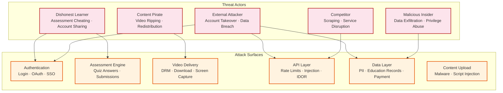

# Security & Compliance — Online Learning Platform

## 1. Threat Model

### 1.1 Threat Actors and Attack Surfaces



### 1.2 Threat Matrix

| Threat | Likelihood | Impact | Risk | Primary Mitigation |
|---|---|---|---|---|
| **Assessment cheating (answer sharing)** | High | Medium | High | Question randomization, large pools, timing analysis |
| **Content piracy (video redistribution)** | High | High | Critical | Multi-DRM, watermarking, HDCP enforcement |
| **Account sharing (credential sharing)** | High | Medium | High | Concurrent session limits, device fingerprinting |
| **Account takeover (credential stuffing)** | Medium | High | High | MFA, rate limiting, anomaly detection |
| **API abuse (scraping, DDoS)** | Medium | Medium | Medium | Rate limiting, bot detection, WAF |
| **SQL injection / XSS** | Low | Critical | Medium | Parameterized queries, CSP, input sanitization |
| **Insider data exfiltration** | Low | Critical | Medium | Audit logging, access controls, data encryption |
| **Certificate forgery** | Low | High | Medium | Cryptographic signing, blockchain anchoring, public verification |
| **Payment fraud** | Medium | High | High | 3DS, velocity checks, delegated to PCI-compliant processor |
| **IDOR (accessing other users' data)** | Medium | High | High | Authorization middleware, resource-level access checks |

---

## 2. Authentication & Authorization

### 2.1 Authentication Architecture

```
Authentication Flow:

1. Email/Password:
   - Passwords hashed with Argon2id (memory: 64MB, iterations: 3, parallelism: 4)
   - Account lockout after 5 failed attempts (30-minute lockout)
   - Rate limit: 10 login attempts per IP per minute
   - MFA via TOTP or hardware security key for instructor/admin accounts

2. Social Login (OAuth 2.0 / OIDC):
   - Supported providers: Google, Apple, Microsoft, GitHub
   - State parameter + PKCE to prevent CSRF and authorization code interception
   - Link to existing account by verified email match

3. Enterprise SSO (SAML 2.0 / OIDC):
   - Per-organization IdP configuration
   - Just-In-Time user provisioning from SAML assertions
   - SCIM 2.0 for automated user lifecycle management
   - Enforced SSO: enterprise users cannot bypass to email/password

4. Token Architecture:
   - Access token: JWT, 15-minute expiry, signed with RS256
   - Refresh token: opaque, 30-day expiry, stored server-side, rotated on use
   - Video token: short-lived (4 hours), scope-limited to specific course content
   - DRM license token: lesson-specific, device-bound, 24-hour expiry
```

### 2.2 Authorization Model

```
Role-Based Access Control (RBAC) + Resource-Level Permissions:

Roles:
  learner:          View enrolled courses, submit assessments, track progress
  instructor:       Create/edit own courses, view own course analytics, manage Q&A
  course_admin:     Manage any course in assigned categories
  enterprise_admin: Manage users/enrollments within their organization
  platform_admin:   Full platform access, user management, system configuration

Resource-Level Permissions:
  Course access:     enrollment_check(user_id, course_id) → boolean
  Lesson access:     enrollment_check + prerequisite_check(user_id, lesson_id) → boolean
  Assessment access: enrollment_check + time_window_check + attempt_limit_check → boolean
  Analytics access:  ownership_check(instructor_id, course_id) → boolean
  Certificate:       ownership_check(user_id, certificate_id) → boolean

Authorization Middleware (per-request):
  1. Extract JWT from Authorization header
  2. Validate JWT signature and expiry
  3. Extract user_id and roles from JWT claims
  4. For resource endpoints: check resource-level permission
  5. Cache positive authorization results for 5 minutes
  6. Log all authorization failures for audit
```

### 2.3 Session Security

| Control | Implementation |
|---|---|
| **Concurrent session limit** | Max 3 active sessions per account; oldest session revoked on new login |
| **Session binding** | Refresh token bound to device fingerprint; reject if fingerprint changes |
| **Idle timeout** | 2-hour idle timeout for web sessions; 30-day for mobile |
| **Forced logout** | On password change or MFA enrollment change, all sessions invalidated |
| **Suspicious login detection** | New device + new location → email verification required before access |
| **Session audit** | All active sessions visible to user; manual revocation supported |

---

## 3. Content Protection (DRM)

### 3.1 Multi-DRM Architecture

```
DRM Protection Hierarchy:

Level 1: Transport Encryption
  - All video segments served over HTTPS (TLS 1.3)
  - Manifest URLs signed with time-limited, geo-restricted tokens
  - Token includes: user_id, course_id, device_id, expiry, allowed_regions

Level 2: Content Encryption
  - AES-128-CTR encryption of video segments (CENC standard)
  - Unique content encryption key (CEK) per video asset
  - CEK encrypted with DRM-specific key wrapping:
    - Widevine: for Chrome, Android, Smart TVs
    - FairPlay: for Safari, iOS, macOS, tvOS
    - PlayReady: for Edge, Windows

Level 3: Output Protection
  - HDCP 2.2 required for HD (1080p) content playback
  - Hardware-level DRM (Widevine L1, FairPlay HW) required for 1080p
  - Software-only DRM (Widevine L3) limited to 720p max

Level 4: Forensic Watermarking
  - Invisible per-user watermark embedded during playback (client-side compositing)
  - Watermark encodes: user_id, timestamp, session_id
  - Surviving screen capture, re-encoding, and format conversion
  - Enables identification of piracy source from leaked content
```

### 3.2 Offline Download Protection

```
Offline DRM Flow:

1. Learner requests offline download for a course
2. Server validates: active enrollment, download quota (max 5 courses offline)
3. Server issues persistent DRM license:
   - Validity: 30 days from download
   - Playback window: 48 hours from first offline play
   - No output allowed (screen recording blocked on supported devices)
4. Client downloads encrypted segments to local storage
5. During offline playback:
   - DRM module validates local license (no network required)
   - License clock enforced via secure hardware clock (where available)
   - Playback blocked if license expired
6. On reconnection:
   - Client syncs offline progress events
   - Client checks license renewal (extend if enrollment still active)
   - Revoked enrollments → local content deletion triggered
```

---

## 4. Data Privacy & Regulatory Compliance

### 4.1 FERPA Compliance

```
FERPA Requirements for Online Learning Platform:

1. Education Records Protection:
   - Student grades, assessment submissions, and progress data classified as education records
   - Access restricted to: the student, authorized instructors, and institutional administrators
   - No disclosure to third parties without explicit consent

2. Directory Information:
   - Display name and enrollment status may be visible to classmates (in forums, leaderboards)
   - Students can opt out of directory information sharing
   - Opt-out preference stored in user profile; enforced at display layer

3. Data Access Controls:
   - Instructors see only aggregate analytics by default
   - Individual student records visible only for their own courses
   - Enterprise admins see only users within their organization
   - Platform admins have access but all access is audit-logged

4. Third-Party Vendor Compliance:
   - All third-party integrations (analytics, payment, notification providers) bound by
     data processing agreements that prohibit re-use of student data
   - Student PII never sent to third-party analytics (pseudonymized IDs used)
   - Payment processors receive only transaction data, not education records

5. Data Retention:
   - Education records retained for minimum period required by institution contracts
   - Student can request data export (JSON/CSV format, delivered within 30 days)
   - On account deletion: education records anonymized, not deleted (institutional requirement)
```

### 4.2 COPPA Compliance

```
COPPA Requirements (users under 13):

1. Age Gate:
   - Date of birth collected during registration
   - If age < 13: COPPA flow activated
   - If age 13–17: limited data collection (no behavioral advertising)

2. Parental Consent:
   - Verifiable parental consent required before account activation
   - Methods: parent email verification + follow-up call, credit card micro-charge, signed form
   - Consent record stored with timestamp and method

3. Data Minimization:
   - No collection of: precise geolocation, browsing history, behavioral data for advertising
   - Collect only: name, email (parent), date of birth, progress data (educational purpose)
   - No third-party tracking pixels or ad networks for minor accounts

4. Parental Controls:
   - Parent can review child's data at any time
   - Parent can request deletion (within 48 hours)
   - Parent can revoke consent (account deactivated)

5. Technical Controls:
   - Minor accounts flagged in database (is_minor = true)
   - All API endpoints check minor status; restrict data exposure
   - Minor accounts excluded from recommendation training data
   - Discussion forum posts by minors moderated before publication
```

### 4.3 GDPR Compliance

| Right | Implementation |
|---|---|
| **Right to Access** | Self-service data export: JSON/CSV including all personal data, progress, grades, certificates |
| **Right to Erasure** | Account deletion flow: anonymize education records, delete PII, revoke certificates, purge from backups (30-day propagation) |
| **Right to Rectification** | Self-service profile editing; support ticket for education record corrections |
| **Right to Portability** | Machine-readable data export (JSON); compatible with Open Badges for certificates |
| **Right to Object** | Opt-out of recommendation engine, marketing emails, and analytics tracking |
| **Data Minimization** | Collect only data necessary for educational purpose; annual review of data fields |
| **Consent Management** | Granular consent per purpose (essential, analytics, marketing); consent records with timestamps |
| **Data Residency** | EU user data stored in EU-West region; cross-border transfers covered by Standard Contractual Clauses |

### 4.4 Data Classification

| Classification | Examples | Encryption | Access | Retention |
|---|---|---|---|---|
| **Critical PII** | Email, payment info, SSN (if collected) | AES-256 at rest + TLS in transit | Platform admins only (audit-logged) | Minimum required; deleted on account closure |
| **Education Records** | Grades, submissions, progress | AES-256 at rest + TLS in transit | Student + authorized instructors/admins | Per institutional contract (typically 5–7 years) |
| **Content IP** | Video lectures, course materials | DRM encryption + access control | Enrolled students + content owner | While course is active; 90 days after archival |
| **Analytics Data** | Engagement metrics, click streams | Pseudonymized; TLS in transit | Analytics team (aggregated) | 2 years (rolling) |
| **Public Data** | Course catalog, instructor bios | No encryption required | Public | While published |

---

## 5. Assessment Integrity

### 5.1 Anti-Cheating Framework

```
Assessment Security Layers:

Layer 1: Question Integrity
  ├── Question pool: 3x–5x questions vs. quiz length (pool of 45 for 15-question quiz)
  ├── Randomized question order per learner
  ├── Randomized option order for MCQ (correct answer position varies)
  ├── Dynamic numeric parameters (each learner gets different numbers in math problems)
  └── Correct answers NEVER sent to client (server-side grading only)

Layer 2: Session Integrity
  ├── One active assessment session per user (reject concurrent attempts)
  ├── Server-side timer (client timer for display only; server enforces deadline)
  ├── Submission locked to session (cannot submit answers from different session)
  ├── Browser focus tracking (log tab switches; flag excessive switching)
  └── Copy/paste detection (log clipboard events during assessment)

Layer 3: Submission Analysis
  ├── Time-per-question analysis (instant correct answers after long pause = lookup pattern)
  ├── Answer similarity across submissions (detect answer sharing)
  ├── IP address correlation (multiple accounts submitting from same IP)
  ├── Plagiarism detection for essays (TF-IDF similarity + paraphrase detection)
  └── Code plagiarism detection (AST comparison, variable renaming detection)

Layer 4: Proctoring (Optional, for high-stakes exams)
  ├── Webcam-based identity verification
  ├── Screen recording during exam
  ├── AI-based anomaly detection (looking away, multiple people, phone usage)
  └── Human review for flagged sessions
```

### 5.2 Plagiarism Detection Pipeline

```
FUNCTION detectPlagiarism(submission, assessment_type):
    IF assessment_type = "essay":
        // Text plagiarism detection
        submission_text ← extractText(submission.answers)

        // 1. Compare against submission corpus (same assessment)
        corpus ← getAllSubmissions(submission.assessment_id)
        FOR EACH other IN corpus:
            IF other.user_id = submission.user_id: CONTINUE
            similarity ← computeCosineSimilarity(
                tfidfVector(submission_text),
                tfidfVector(other.text)
            )
            IF similarity > 0.85:
                flagMatch(submission, other, similarity, "corpus_match")

        // 2. Structural similarity (paraphrase detection)
        FOR EACH other IN corpus:
            structural_sim ← computeSemanticSimilarity(submission_text, other.text)
            IF structural_sim > 0.80:
                flagMatch(submission, other, structural_sim, "paraphrase_match")

    ELSE IF assessment_type = "code":
        // Code plagiarism detection
        submission_ast ← parseToAST(submission.code)

        // 1. AST structural comparison (variable renaming resistant)
        corpus ← getAllCodeSubmissions(submission.assessment_id)
        FOR EACH other IN corpus:
            other_ast ← parseToAST(other.code)
            structural_sim ← computeASTSimilarity(submission_ast, other_ast)
            IF structural_sim > 0.90:
                flagMatch(submission, other, structural_sim, "code_structure_match")

        // 2. Token sequence comparison (order-sensitive)
        submission_tokens ← tokenize(submission.code)
        FOR EACH other IN corpus:
            other_tokens ← tokenize(other.code)
            token_sim ← longestCommonSubsequenceRatio(submission_tokens, other_tokens)
            IF token_sim > 0.85:
                flagMatch(submission, other, token_sim, "token_sequence_match")

    RETURN getPlagiarismScore(submission)  // 0.0 = unique, 1.0 = exact copy
```

---

## 6. Infrastructure Security

### 6.1 Network Security

| Control | Implementation |
|---|---|
| **Edge protection** | Web Application Firewall (WAF) at CDN edge; DDoS mitigation (rate limiting + traffic scrubbing) |
| **API security** | JWT validation at gateway; CORS whitelist; CSP headers; HSTS |
| **Internal network** | Service mesh with mTLS for all inter-service communication |
| **Database access** | Private subnet only; no public IP; access via service accounts with least privilege |
| **Secrets management** | Centralized secrets vault; auto-rotation of database credentials (90-day cycle) |
| **Container security** | Base image scanning; no root containers; read-only filesystem; security contexts enforced |

### 6.2 Encryption Standards

| Data State | Encryption | Key Management |
|---|---|---|
| **At rest (databases)** | AES-256-GCM | Managed key service; automatic rotation every 365 days |
| **At rest (object storage)** | AES-256 server-side | Per-bucket encryption keys managed by cloud KMS |
| **At rest (video content)** | AES-128-CTR (CENC) | DRM key server; per-asset content encryption keys |
| **In transit (external)** | TLS 1.3 | Managed certificates; auto-renewal |
| **In transit (internal)** | mTLS (TLS 1.3) | Service mesh CA; short-lived certificates (24-hour) |
| **In transit (video)** | HTTPS + DRM | Signed URLs + DRM license tokens |

### 6.3 Audit Logging

```
Audit Events Captured:

Authentication Events:
  - Login success/failure (with IP, user agent, device fingerprint)
  - MFA enrollment/change
  - Password change/reset
  - Session creation/termination
  - SSO assertion processing

Authorization Events:
  - Access denied (resource, user, reason)
  - Role change (who changed, old role, new role)
  - Enterprise admin actions (user management, catalog changes)

Data Access Events:
  - Student record access by instructor/admin (who accessed whose data)
  - Bulk data export requests
  - API calls to sensitive endpoints (payment, PII, grade modification)

Content Events:
  - Course publish/unpublish
  - Video upload/deletion
  - Certificate issuance/revocation
  - Assessment modification

Administrative Events:
  - System configuration changes
  - Feature flag modifications
  - Infrastructure changes (scaling, deployment)

Storage: Immutable append-only log
Retention: 7 years (regulatory requirement)
Access: Security team only; read-only; tamper-evident
Alert: Real-time alerts on anomalous patterns (bulk data access, privilege escalation)
```

---

## 7. Credential Verification Security

### 7.1 Certificate Tamper Detection

```
Certificate Integrity Chain:

1. Certificate data → canonical JSON (sorted keys, no whitespace)
2. SHA-512 hash of canonical JSON → verification_hash
3. verification_hash signed with platform's Ed25519 private key → signature
4. Public key published at well-known URL: https://platform.example.com/.well-known/badges/public-key

Verification Process:
1. Retrieve certificate data from verification API
2. Reconstruct canonical JSON from certificate fields
3. Compute SHA-512 hash
4. Verify Ed25519 signature using platform's published public key
5. Check revocation status against revocation list
6. Optional: verify blockchain anchor (hash included in Merkle tree → on-chain root hash)
```

### 7.2 Blockchain Anchoring Architecture

```
Batch Anchoring Process:

1. Collect certificate hashes in a buffer (target: 1,000 per batch)
2. Build Merkle tree from buffered hashes
3. Compute Merkle root
4. Submit single transaction to blockchain with Merkle root
5. Store Merkle proof (path from leaf to root) per certificate
6. Update certificate record with:
   - blockchain_tx_hash
   - merkle_proof (array of sibling hashes)
   - merkle_root

Verification of Blockchain Anchor:
1. Retrieve certificate's merkle_proof from platform API
2. Recompute leaf hash from certificate data
3. Walk Merkle proof from leaf to root
4. Compare computed root with on-chain Merkle root (via blockchain explorer)
5. If match → certificate existed at time of blockchain transaction (tamper-proof timestamp)

Cost Efficiency:
  1,000 certificates per transaction
  ~3 transactions per hour at peak
  ~$0.002 per certificate (amortized gas cost)
```

---

*Next: [Observability ->](./07-observability.md)*
