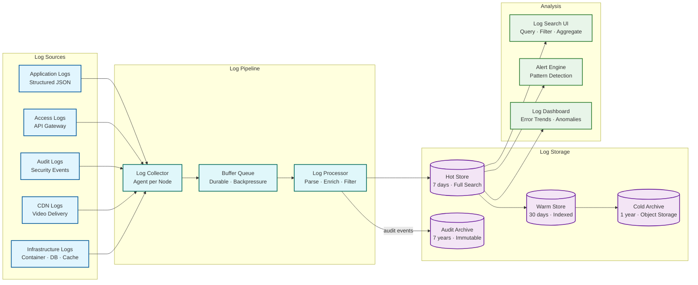

# Observability — Online Learning Platform

## 1. Metrics

### 1.1 Golden Signals by Service

| Service | Latency | Traffic | Errors | Saturation |
|---|---|---|---|---|
| **API Gateway** | Request latency P50/P95/P99 | Requests/sec by endpoint | 4xx/5xx rate | Connection pool utilization |
| **Video Playback** | Time-to-first-byte, rebuffer ratio | Concurrent streams, bytes/sec | Playback failures, DRM errors | CDN bandwidth utilization |
| **Progress Service** | Event processing latency | Events/sec ingested | Failed persists, dedup rejects | Event stream consumer lag |
| **Search Service** | Query latency P50/P95/P99 | Queries/sec, autocomplete/sec | Empty result rate, timeouts | Index shard CPU, memory |
| **Quiz Engine** | Submission-to-grade latency | Submissions/sec | Grading failures, timeouts | Grading worker queue depth |
| **Certificate Service** | Generation latency | Certificates/hour | Generation failures | Worker pool utilization |
| **Transcoding** | Transcode time per minute of video | Jobs/hour, queue depth | Encoding failures | GPU utilization, queue depth |
| **Recommendation** | Model inference latency | Recommendations served/sec | Fallback-to-popular rate | Model serving CPU/memory |

### 1.2 Business Metrics Dashboard

```
Real-Time Metrics (refreshed every 10 seconds):
  ├── Active learners (by region, device, course category)
  ├── Concurrent video streams (by quality level, CDN provider)
  ├── Enrollments per minute (paid vs. free vs. enterprise)
  ├── Assessment submissions per minute (by type: quiz, assignment, code)
  ├── Certificates issued per hour
  ├── Revenue per hour (subscriptions + purchases)
  └── Support tickets created per hour

Daily Metrics (aggregated):
  ├── DAU / MAU / DAU:MAU ratio (engagement health)
  ├── Course completion rate (by course, category, difficulty)
  ├── Average session duration (by device, user segment)
  ├── Learner retention (D1, D7, D30)
  ├── Assessment pass rate (by course, trending over time)
  ├── NPS score (from in-app surveys)
  ├── Instructor content upload rate
  └── Certificate verification requests (employer demand signal)

Learning Analytics (per course/instructor):
  ├── Video completion funnel (% who finish each lesson)
  ├── Drop-off points (where learners abandon, by lesson)
  ├── Engagement heatmap (most replayed / skipped segments)
  ├── Assessment difficulty analysis (question-level pass rates)
  ├── Time-to-completion distribution
  ├── Peer review quality scores
  └── Discussion forum engagement rate
```

### 1.3 Infrastructure Metrics

| Component | Key Metrics | Warning Threshold | Critical Threshold |
|---|---|---|---|
| **CDN** | Cache hit ratio, bandwidth, TTFB, error rate | Hit ratio < 93% | Hit ratio < 90% or error rate > 1% |
| **Event Stream** | Consumer lag, throughput, partition skew | Lag > 30 seconds | Lag > 2 minutes |
| **Relational DB** | Query latency, connections, replication lag | Repl lag > 500ms | Repl lag > 5s or connections > 80% |
| **Time-Series DB** | Write throughput, query latency, disk usage | Disk > 70% | Disk > 85% or write errors > 0 |
| **Cache Cluster** | Hit rate, memory usage, eviction rate | Hit rate < 85% | Memory > 90% or eviction spike |
| **Search Index** | Query latency, indexing lag, shard size | Latency P95 > 300ms | Latency P95 > 500ms |
| **Object Storage** | Request rate, error rate, storage growth | Error rate > 0.1% | Error rate > 1% |
| **Container Orchestrator** | Pod restarts, resource pressure, scheduling failures | > 5 restarts/hour | > 20 restarts/hour |

---

## 2. Logging

### 2.1 Log Architecture



### 2.2 Structured Log Format

```
Standard Log Entry (JSON):
{
  "timestamp": "2026-03-01T14:30:05.123Z",
  "level": "INFO",
  "service": "progress-service",
  "instance": "progress-service-7b4d-2",
  "trace_id": "abc123def456",
  "span_id": "span789",
  "user_id": "usr_anonymized_hash",   // Pseudonymized for privacy
  "request_id": "req_uuid",
  "event": "progress_event_processed",
  "duration_ms": 12,
  "metadata": {
    "course_id": "crs_uuid",
    "lesson_id": "les_uuid",
    "event_type": "video_progress",
    "partition": 42,
    "consumer_lag_ms": 150
  }
}

Log Levels and Usage:
  ERROR:  Unrecoverable failures requiring immediate attention
          (DB write failure, DRM license server unreachable, data corruption detected)
  WARN:   Degraded behavior that self-heals or has fallback
          (cache miss spike, consumer lag increasing, DRM fallback to cached license)
  INFO:   Normal business operations (1 per request/event)
          (enrollment created, assessment submitted, certificate issued)
  DEBUG:  Detailed diagnostic info (disabled in production by default)
          (algorithm decisions, cache hit/miss, query plans)
```

### 2.3 Log Retention and Compliance

| Log Category | Retention (Hot) | Retention (Warm) | Retention (Cold) | Compliance Requirement |
|---|---|---|---|---|
| **Application logs** | 7 days | 30 days | 1 year | Operational debugging |
| **Access logs** | 7 days | 90 days | 1 year | Security investigation |
| **Audit logs** | 30 days | 1 year | 7 years | FERPA, SOC 2 |
| **CDN logs** | 3 days | 30 days | 90 days | Video delivery analytics |
| **Payment logs** | 30 days | 1 year | 7 years | PCI DSS, financial audit |
| **Assessment logs** | 30 days | 1 year | 5 years | Academic integrity disputes |

### 2.4 PII Handling in Logs

```
PII Protection Strategy:

1. Never log:
   - Passwords, tokens, or credentials
   - Payment card numbers or CVVs
   - Full email addresses
   - Assessment answers or grades (outside audit logs)

2. Pseudonymize:
   - user_id → SHA-256(user_id + daily_salt) in application logs
   - IP addresses → truncated to /24 subnet in analytics logs
   - Device fingerprints → hashed

3. Controlled access:
   - Audit logs: security team only, access requires ticket justification
   - Production logs: on-call engineers, time-limited access (8-hour sessions)
   - CDN logs: infrastructure team, automated analysis only

4. Cross-referencing:
   - Pseudonymized logs can be de-anonymized only via security investigation workflow
   - Requires two approvals (security lead + privacy officer)
   - All de-anonymization requests logged and audited
```

---

## 3. Distributed Tracing

### 3.1 Trace Context Propagation

```
Trace Flow — Video Playback Request:

[Browser] ──── trace_id: abc123 ─────────────────────────────►
    │
    ├── span: page_load (300ms)
    │    ├── span: cdn_fetch_static (50ms)
    │    └── span: api_call_playback (250ms)
    │         │
    │         ├── span: api_gateway_auth (15ms)
    │         │    └── span: jwt_validate (5ms)
    │         │
    │         ├── span: content_service_get_lesson (30ms)
    │         │    ├── span: cache_lookup (2ms) [HIT]
    │         │    └── span: prerequisite_check (8ms)
    │         │
    │         ├── span: progress_service_get_resume (20ms)
    │         │    ├── span: cache_lookup (1ms) [HIT]
    │         │    └── (no DB call needed)
    │         │
    │         ├── span: generate_signed_url (5ms)
    │         │    └── span: token_signing (2ms)
    │         │
    │         └── span: response_serialization (3ms)
    │
    ├── span: drm_license_acquisition (280ms)  ◄── highest latency span
    │    ├── span: license_request (250ms)
    │    └── span: key_decryption (30ms)
    │
    └── span: first_segment_download (400ms)
         ├── span: cdn_fetch_segment (380ms)
         └── span: decrypt_and_decode (20ms)

Total time-to-first-frame: 980ms
Critical path: drm_license_acquisition + first_segment_download
```

### 3.2 Trace Sampling Strategy

| Traffic Type | Sample Rate | Rationale |
|---|---|---|
| **Error responses (4xx/5xx)** | 100% | All errors fully traced for debugging |
| **Slow requests (> 2x P95)** | 100% | All slow requests fully traced |
| **Assessment submissions** | 100% | Complete audit trail for grading |
| **Certificate generation** | 100% | Complete audit trail for credential issuance |
| **Video playback requests** | 1% | High volume; 1% gives sufficient statistical coverage |
| **Progress events** | 0.1% | Extremely high volume; sample provides trend visibility |
| **Search queries** | 5% | Moderate volume; need visibility into slow queries |
| **Health checks** | 0% | No value in tracing synthetic health probes |

### 3.3 Cross-Service Trace Correlation

```
Trace Header Propagation:

HTTP headers (inter-service):
  X-Trace-Id: abc123def456
  X-Span-Id: span789
  X-Parent-Span-Id: span456

Event stream messages:
  {
    "trace_context": {
      "trace_id": "abc123def456",
      "span_id": "span_producer",
      "baggage": { "user_segment": "premium", "region": "us-east" }
    },
    "payload": { ... }
  }

CDN logs correlation:
  Video segment requests include trace_id as query parameter in signed URL
  CDN logs parseable to correlate video delivery metrics with application traces
```

---

## 4. Alerting

### 4.1 Alert Hierarchy

```
Severity Levels:

P1 — Critical (Page on-call immediately):
  ├── Video playback failure rate > 1% for > 2 minutes
  ├── Progress service write failures > 0.1% for > 1 minute
  ├── Assessment submission failures > 0.5% for > 2 minutes
  ├── Database primary unreachable for > 30 seconds
  ├── Event stream consumer lag > 5 minutes
  └── CDN error rate > 2% for > 3 minutes

P2 — High (Alert on-call; 15-minute response):
  ├── Video TTFB P95 > 3 seconds for > 5 minutes
  ├── Search latency P95 > 500ms for > 5 minutes
  ├── DRM license server latency > 1 second for > 5 minutes
  ├── Cache hit rate drops below 80%
  ├── Database replication lag > 5 seconds for > 3 minutes
  └── Transcoding queue depth > 5,000 for > 15 minutes

P3 — Medium (Alert team channel; 1-hour response):
  ├── Certificate generation backlog > 1 hour
  ├── Recommendation model serving fallback rate > 10%
  ├── CDN cache hit ratio < 90% for > 30 minutes
  ├── Authentication failure rate > 5% from single IP range
  └── Error rate for any non-critical service > 1%

P4 — Low (Daily digest; next business day):
  ├── Storage growth rate exceeding projections by > 20%
  ├── Unused feature flag accumulation > 30 days
  ├── Certificate blockchain anchoring delay > 24 hours
  ├── Log volume spike > 3x baseline
  └── Minor API deprecation endpoint still receiving traffic
```

### 4.2 Alert Rules

```
Video Playback Health:
  ALERT: VideoPlaybackFailureHigh
  WHEN:  rate(playback_errors_total / playback_requests_total) > 0.01
  FOR:   2 minutes
  SEVERITY: P1
  RUNBOOK: Check CDN health → DRM license server → origin storage
  NOTIFICATION: PagerDuty → #oncall-video channel

Progress Service Health:
  ALERT: ProgressWriteFailures
  WHEN:  rate(progress_write_errors_total) > 100/sec
  FOR:   1 minute
  SEVERITY: P1
  RUNBOOK: Check event stream health → TSDB health → disk space
  NOTIFICATION: PagerDuty → #oncall-platform channel

Consumer Lag:
  ALERT: ProgressConsumerLagCritical
  WHEN:  max(consumer_group_lag_seconds{group="progress-consumers"}) > 300
  FOR:   3 minutes
  SEVERITY: P1
  RUNBOOK: Scale consumers → check for poison messages → verify partition balance
  NOTIFICATION: PagerDuty → #oncall-platform channel

Search Degradation:
  ALERT: SearchLatencyHigh
  WHEN:  histogram_quantile(0.95, search_query_duration_seconds) > 0.5
  FOR:   5 minutes
  SEVERITY: P2
  RUNBOOK: Check index health → shard rebalance → clear slow queries
  NOTIFICATION: Slack #oncall-search

Anomaly Detection:
  ALERT: EnrollmentAnomalyDetected
  WHEN:  enrollment_rate deviates > 3 standard deviations from 7-day rolling average
  FOR:   10 minutes
  SEVERITY: P3
  RUNBOOK: Check for bot activity → verify payment system → check promotional campaigns
  NOTIFICATION: Slack #platform-alerts
```

### 4.3 On-Call Runbooks

```
Runbook: Video Playback Failure Spike

Step 1: Identify scope
  - Check CDN dashboard: is failure regional or global?
  - Check error type: DRM failure vs. segment fetch failure vs. manifest failure
  - Check affected content: all courses vs. specific courses

Step 2: CDN investigation
  - CDN health dashboard: PoP availability, error rates by region
  - If CDN issue: switch traffic to secondary CDN (automated if health check configured)
  - If origin issue: check object storage availability

Step 3: DRM investigation
  - DRM license server latency and error rate
  - If DRM down: enable graceful degradation (extend cached licenses)
  - Check DRM key server certificate validity

Step 4: Verify recovery
  - Monitor playback error rate returning to baseline
  - Check user-reported issues in support queue
  - Create incident report

---

Runbook: Progress Service Write Failures

Step 1: Identify bottleneck
  - Event stream consumer lag? → Scale consumers
  - TSDB write errors? → Check disk space, compaction, replication
  - Network partition? → Check connectivity between services

Step 2: Enable write-behind buffer
  - Redirect progress writes to in-memory buffer + async persistence
  - Accept slightly delayed persistence (< 30 seconds) over write failures
  - Monitor buffer depth; alert if growing without drain

Step 3: Database investigation
  - Check active connections, slow queries, lock contention
  - If primary overloaded: shed non-critical read traffic to replicas
  - If primary failed: verify automatic failover to synchronous replica

Step 4: Data integrity verification
  - After recovery, verify zero event loss by comparing event stream offsets
  - Check for duplicate processing (idempotency keys should prevent)
  - Verify progress snapshots are consistent with event log
```

---

## 5. SLO Monitoring Dashboard

### 5.1 SLO Status Board

```
┌─────────────────────────────────────────────────────────────────┐
│                    SLO Dashboard — Online Learning Platform      │
├─────────────────────┬──────────┬───────────┬────────────────────┤
│ SLO                 │ Target   │ Current   │ Error Budget       │
├─────────────────────┼──────────┼───────────┼────────────────────┤
│ Video Playback      │ 99.95%   │ 99.97%    │ █████████░ 60% rem │
│ Progress Save       │ 99.99%   │ 99.995%   │ █████████░ 50% rem │
│ Video TTFB (P95)    │ < 2s     │ 1.4s      │ ██████████ 100% ok │
│ Progress Latency    │ < 500ms  │ 180ms     │ ██████████ 100% ok │
│ Assessment Submit   │ 99.95%   │ 99.98%    │ █████████░ 60% rem │
│ Search Availability │ 99.9%    │ 99.95%    │ █████████░ 50% rem │
│ Cert Generation     │ < 30s    │ 12s       │ ██████████ 100% ok │
│ Search Latency P95  │ < 200ms  │ 145ms     │ ██████████ 100% ok │
├─────────────────────┴──────────┴───────────┴────────────────────┤
│ Error Budget Burn Rate:  0.8x (healthy)                         │
│ Projected Budget at Month End: 45% remaining (comfortable)      │
└─────────────────────────────────────────────────────────────────┘
```

### 5.2 Error Budget Policies

| SLO | Error Budget | If Budget Exhausted |
|---|---|---|
| **Video Playback (99.95%)** | 21.6 min/month | Freeze non-critical deployments; dedicate on-call to video reliability |
| **Progress Save (99.99%)** | 4.3 min/month | Freeze all deployments; dedicated incident response team |
| **Assessment Submit (99.95%)** | 21.6 min/month | Disable optional assessment features (auto-save drafts, analytics) |
| **Search (99.9%)** | 43.2 min/month | Serve cached results; disable personalization; reduce facet computation |

### 5.3 Burn Rate Alerting

```
Multi-Window Burn Rate Alerts:

Fast burn (immediate impact):
  IF error_rate_1h > 14.4 × (1 - SLO_target):  // Burns monthly budget in 5 hours
    → Page immediately (P1)

Moderate burn (sustained impact):
  IF error_rate_6h > 6 × (1 - SLO_target):  // Burns monthly budget in 5 days
    → Alert on-call (P2)

Slow burn (gradual erosion):
  IF error_rate_3d > 3 × (1 - SLO_target):  // Burns monthly budget in 10 days
    → Alert team channel (P3)

Example for Video Playback (99.95% SLO):
  Fast burn:  error_rate_1h > 0.72%  → P1
  Moderate:   error_rate_6h > 0.30%  → P2
  Slow burn:  error_rate_3d > 0.15%  → P3
```

---

*Next: [Interview Guide ->](./08-interview-guide.md)*
