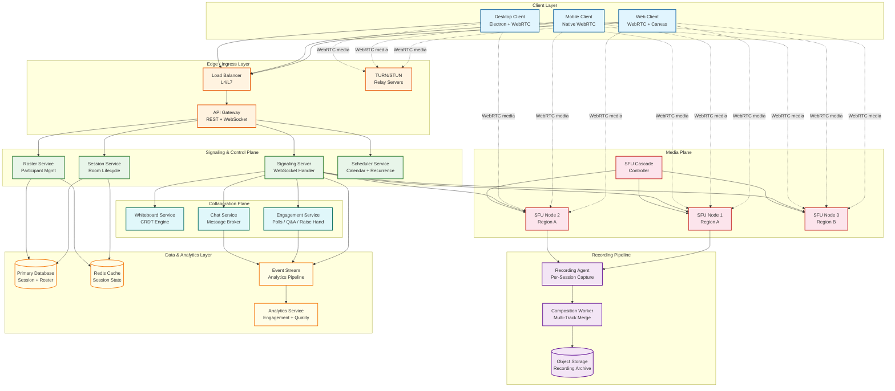
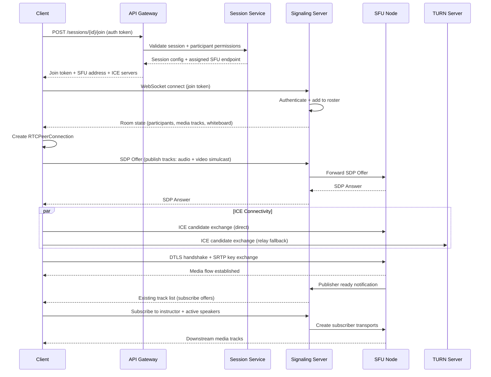
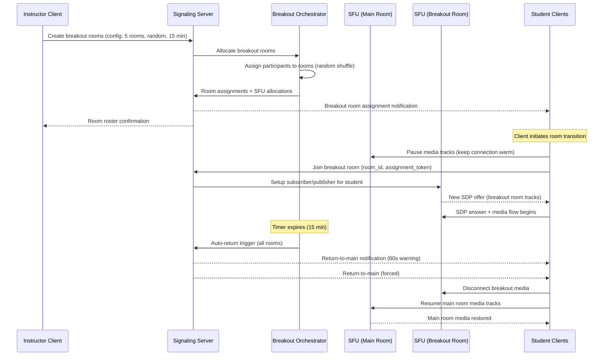
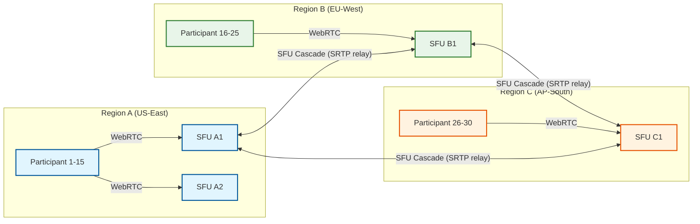
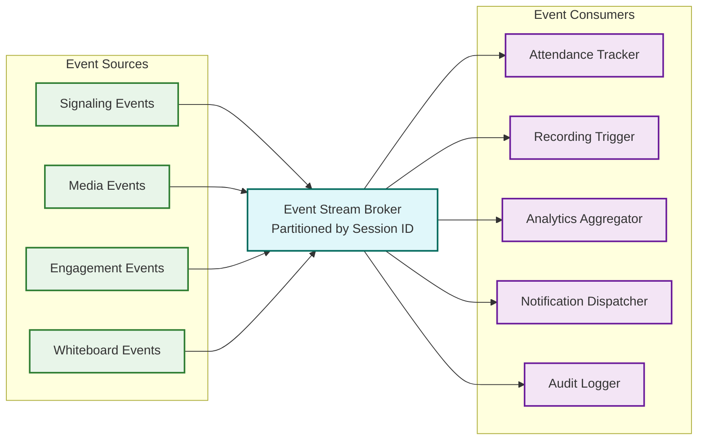

# High-Level Design — Live Classroom System

## System Architecture

The live classroom system follows a split-plane architecture: a **media plane** for real-time audio/video routing via WebRTC SFUs, and a **control plane** for signaling, session management, and collaboration features. This separation is fundamental—the media plane operates on UDP with microsecond timing constraints, while the control plane uses reliable TCP/WebSocket transport.

---

## Data Flow: Session Lifecycle

### Session Join Flow

### Breakout Room Transition Flow

---

## Key Architectural Decisions

### Decision 1: SFU over MCU for Media Routing

| Aspect | SFU (Selected) | MCU (Rejected) |
|---|---|---|
| **Server CPU** | Low—forwards packets without decoding | High—decodes, mixes, and re-encodes all streams |
| **Scalability** | Horizontal—add more SFU nodes | Vertical—limited by single node CPU capacity |
| **Client flexibility** | Each client selects quality layers independently | All clients receive same mixed output |
| **Latency** | Minimal—packet forwarding adds <5ms | Significant—transcoding adds 50-200ms |
| **Recording** | Multi-track recording (separate streams) available | Only mixed recording available |
| **Cost** | Bandwidth-heavy but compute-light | Compute-heavy but bandwidth-efficient |

**Decision:** SFU with simulcast. The education use case requires role-based quality selection (instructor at 720p, students at 360p in gallery view) and multi-track recording for post-session review. SFU's horizontal scalability handles the burst-pattern load profile. MCU is only used as an optional edge case for participants on extremely constrained bandwidth who cannot decode multiple streams.

### Decision 2: CRDT over OT for Whiteboard Collaboration

| Aspect | CRDT (Selected) | OT (Rejected) |
|---|---|---|
| **Server requirement** | Serverless merge—peers can sync directly | Requires central transformation server |
| **Conflict resolution** | Automatic—mathematical convergence guarantee | Manual—complex transformation functions |
| **Offline support** | Natural—merge when reconnected | Complex—must buffer and transform on reconnect |
| **Scalability** | Peer-to-peer friendly, server is optional relay | Central server is bottleneck |
| **Complexity** | Custom CRDT types needed for geometric ops | Well-established for text; complex for graphics |

**Decision:** CRDT with a central relay for performance. While CRDTs can operate peer-to-peer, routing through a central relay provides consistent ordering and enables persistence. The relay is not a transformation server—it simply relays and persists CRDT operations. If the relay fails, clients can sync directly (temporary degradation, not outage).

### Decision 3: WebSocket for Signaling, DataChannel for Whiteboard

| Aspect | WebSocket (Signaling) | WebRTC DataChannel (Whiteboard) |
|---|---|---|
| **Transport** | TCP—reliable, ordered delivery | SCTP over DTLS—configurable reliability |
| **Latency** | Higher (TCP head-of-line blocking) | Lower (can use unreliable mode) |
| **NAT traversal** | Requires separate proxy/LB | Piggybacks on existing WebRTC connection |
| **Connection overhead** | Separate connection per service | Shares ICE/DTLS with media connection |

**Decision:** Hybrid approach. Signaling (session control, roster, permissions) uses WebSocket for reliable delivery—these events are infrequent and must not be lost. Whiteboard CRDT operations use WebRTC DataChannels (ordered, reliable mode) to piggyback on the existing media connection, reducing connection overhead and NAT traversal complexity. Chat uses WebSocket for server-side persistence and moderation.

### Decision 4: Cascaded SFU for Multi-Region Support

**Approach:** For sessions with participants in multiple regions, SFU nodes in each region form a cascade mesh. Each participant connects to their nearest regional SFU. SFUs forward only the active speaker's highest-quality stream and thumbnail-quality streams for others across the inter-region link. This minimizes cross-region bandwidth while keeping intra-region latency optimal.

**Cascade selection heuristic:**
- Single region: All participants on one SFU cluster (or split across 2 SFUs if >50 participants)
- Two regions: Direct cascade between 2 regional SFUs
- Three+ regions: Star topology with the instructor's region as hub (minimizes instructor-to-student latency)

### Decision 5: Event-Driven Architecture for Non-Media Features

All non-media events (signaling actions, engagement interactions, whiteboard operations, attendance heartbeats) are published to a partitioned event stream broker (partitioned by session ID for ordering). Downstream consumers independently process these events for attendance tracking, recording triggers, analytics aggregation, notifications, and audit logging. This decoupling ensures that slow analytics processing never affects real-time media delivery.

---

## Architecture Pattern Checklist

| Pattern | Decision | Justification |
|---|---|---|
| **Sync vs Async** | Both: Sync for media/signaling, Async for analytics/recording | Media is inherently synchronous; analytics tolerates delay |
| **Event-driven vs Request-response** | Both: Event-driven for engagement/analytics, Request-response for session CRUD | Events decouple non-critical consumers from real-time path |
| **Push vs Pull** | Push: SFU pushes media, server pushes signaling events | Real-time system requires server-initiated delivery |
| **Stateless vs Stateful** | Both: SFU is stateful (holds sessions), API services are stateless | SFU statefulness is unavoidable; control plane is stateless for scaling |
| **Read-heavy vs Write-heavy** | Write-heavy: Continuous media, signaling events, whiteboard ops during sessions | Reads are only post-session (recordings, analytics) |
| **Real-time vs Batch** | Both: Real-time for media/signaling, Batch for recording composition | Composition is compute-intensive and not time-critical |
| **Edge vs Origin** | Edge for media (SFU near participants), Origin for control | Media latency requires geographic proximity; control tolerates centralization |

---

## Component Interaction Summary

| Source → Target | Protocol | Data | Frequency |
|---|---|---|---|
| Client → SFU | WebRTC (SRTP/SRTCP over DTLS) | Audio/video media streams | Continuous (30fps video, 50pps audio) |
| Client → Signaling | WebSocket (WSS) | SDP offers, ICE candidates, control events | Bursty (high at join, low during session) |
| Client → Whiteboard | WebRTC DataChannel (SCTP) | CRDT operations (vector objects, strokes) | Moderate (10-50 ops/sec during active drawing) |
| Client → Chat | WebSocket (WSS) | Text messages, file references | Low (1-5 msgs/min typical) |
| SFU → SFU (cascade) | SRTP relay over DTLS | Forwarded media streams | Continuous (active speaker + thumbnails) |
| Signaling → SFU | gRPC | Track publish/subscribe commands | On participant join/leave |
| SFU → Recording | RTP dump / media fork | Raw media tracks per participant | Continuous when recording enabled |
| Services → Event Stream | Async message | Session events, engagement events | High (1000s/sec per session) |
| Event Stream → Analytics | Async consume | Aggregated metrics | Continuous batch windows |
| Composition Worker → Object Storage | HTTP PUT | Composed MP4 recordings | Post-session batch |

---

*Previous: [Requirements & Estimations](./01-requirements-and-estimations.md) | Next: [Low-Level Design ->](./03-low-level-design.md)*
