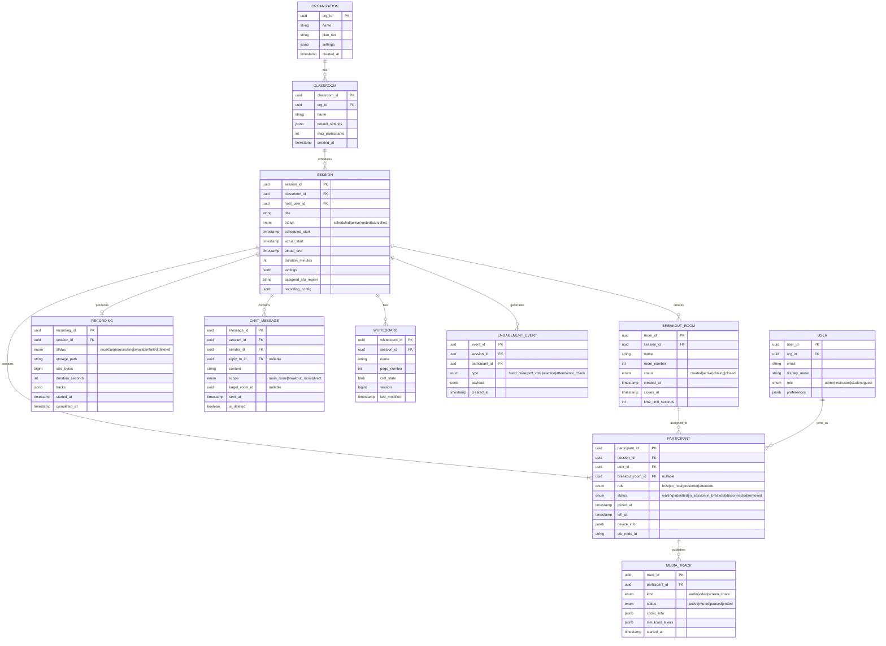
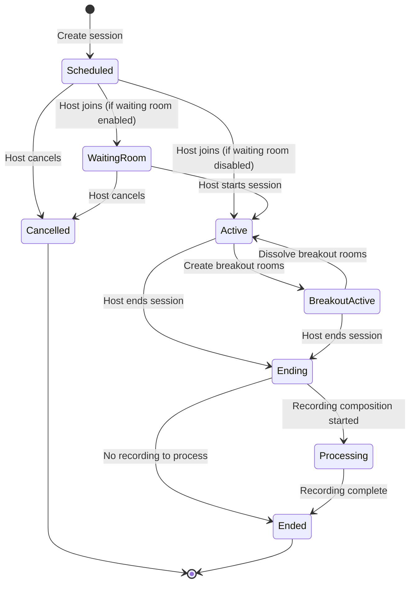
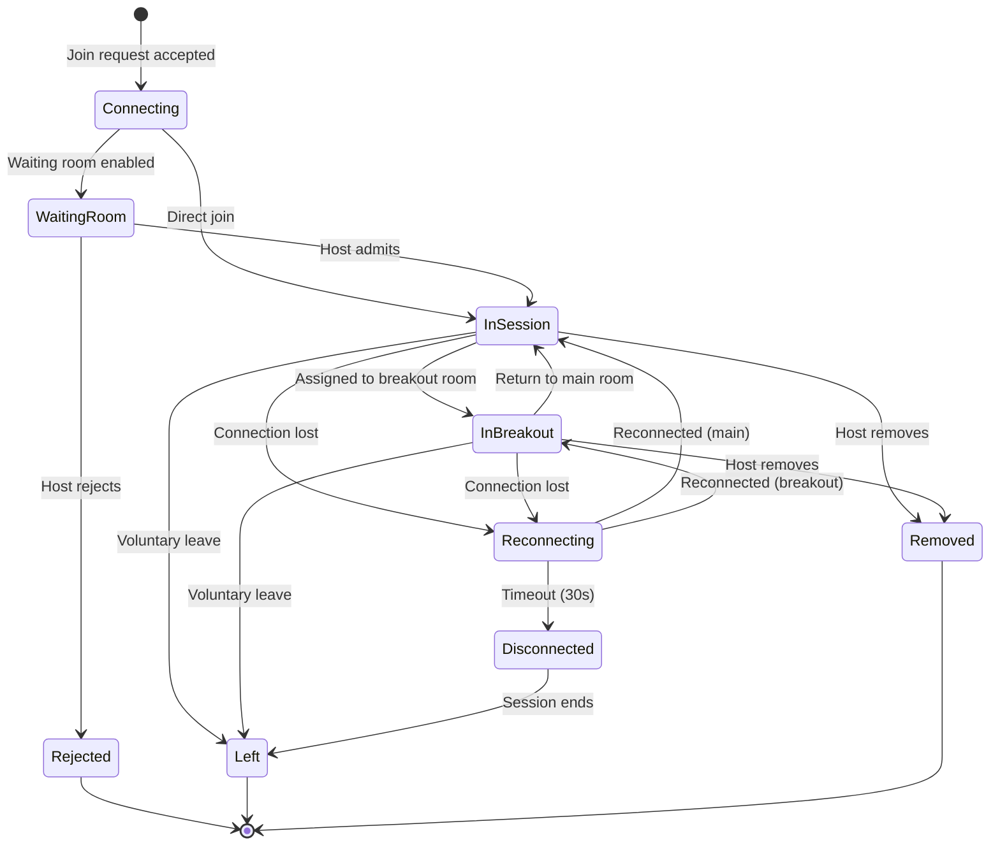

# Low-Level Design — Live Classroom System

## Data Model

### Entity-Relationship Overview



### Indexing Strategy

| Table | Index | Type | Purpose |
|---|---|---|---|
| `session` | `(classroom_id, scheduled_start)` | B-tree | Schedule lookup for a classroom |
| `session` | `(status, assigned_sfu_region)` | B-tree | Active session routing per region |
| `session` | `(host_user_id, status)` | B-tree | Instructor's active sessions |
| `participant` | `(session_id, status)` | B-tree | Active participant roster |
| `participant` | `(user_id, session_id)` | Unique | Prevent duplicate joins |
| `participant` | `(sfu_node_id)` | B-tree | SFU node → participant mapping for failover |
| `chat_message` | `(session_id, sent_at)` | B-tree | Chronological message retrieval |
| `chat_message` | `(session_id, scope, target_room_id)` | B-tree | Room-scoped message filtering |
| `recording` | `(session_id)` | B-tree | Session → recording lookup |
| `engagement_event` | `(session_id, type, created_at)` | B-tree | Event type filtering per session |
| `whiteboard` | `(session_id, page_number)` | Unique | Whiteboard page lookup |

### Partitioning / Sharding Strategy

| Data | Shard Key | Strategy | Rationale |
|---|---|---|---|
| **Session metadata** | `org_id` | Range-based | Sessions cluster by organization; range queries for reporting |
| **Participant state** | `session_id` | Hash | All participants for a session co-located for roster queries |
| **Chat messages** | `session_id` | Hash | Messages scoped to session; no cross-session queries |
| **Whiteboard state** | `session_id` | Hash | Whiteboard belongs to one session |
| **Engagement events** | `session_id` | Hash, time-partitioned | Hot data for active sessions; archive older sessions |
| **Recordings** | `recording_id` | Hash | Independent objects; no cross-recording queries |

### Data Retention Policy

| Data Type | Hot (SSD) | Warm (HDD) | Cold (Archive) | Delete |
|---|---|---|---|---|
| Session metadata | 90 days | 1 year | 5 years | 7 years |
| Active participant state | Session duration + 24h | — | — | Archived to event log |
| Chat messages | 90 days | 1 year | 3 years | Per org policy |
| Whiteboard state | 90 days | 1 year | 3 years | Per org policy |
| Recordings | 30 days | 90 days | Per contract (1-7 years) | Per org policy |
| Engagement events | 30 days | 1 year | 3 years | 5 years |
| Analytics aggregates | Indefinite | — | — | Never (pre-aggregated) |

---

## API Design

### Session Management APIs (REST)

```
# Create a scheduled session
POST /api/v1/sessions
Request:
{
  "classroom_id": "uuid",
  "title": "Advanced Algorithms - Lecture 12",
  "scheduled_start": "2026-03-10T09:00:00Z",
  "duration_minutes": 90,
  "settings": {
    "max_participants": 200,
    "waiting_room_enabled": true,
    "recording_auto_start": true,
    "breakout_rooms_enabled": true,
    "whiteboard_enabled": true,
    "chat_mode": "everyone",           // everyone | host_only | disabled
    "participant_video_default": "off", // on | off
    "participant_audio_default": "muted" // unmuted | muted
  },
  "recurrence": {
    "pattern": "weekly",
    "days": ["monday", "wednesday"],
    "end_date": "2026-06-15"
  }
}
Response: 201 Created
{
  "session_id": "uuid",
  "join_url": "https://classroom.example.com/s/{short_code}",
  "host_key": "alphanumeric_6_digit"
}

# Join a session
POST /api/v1/sessions/{session_id}/join
Headers: Authorization: Bearer {jwt_token}
Request:
{
  "display_name": "Alice Student",
  "device_info": {
    "platform": "web",
    "browser": "chrome_122",
    "supports_simulcast": true,
    "supports_svc": false
  }
}
Response: 200 OK
{
  "participant_id": "uuid",
  "join_token": "jwt_session_scoped",
  "sfu_endpoint": "wss://sfu-us-east.example.com:443",
  "ice_servers": [
    { "urls": "stun:stun.example.com:3478" },
    { "urls": "turn:turn-us.example.com:443", "username": "...", "credential": "..." }
  ],
  "room_state": {
    "participants": [...],
    "active_speaker": "participant_uuid",
    "whiteboard_pages": 3,
    "recording_active": true
  }
}

# Get session roster
GET /api/v1/sessions/{session_id}/participants?status=in_session
Response: 200 OK
{
  "participants": [
    {
      "participant_id": "uuid",
      "user_id": "uuid",
      "display_name": "Prof. Smith",
      "role": "host",
      "status": "in_session",
      "media": { "audio": "unmuted", "video": "active", "screen_share": false },
      "joined_at": "2026-03-10T09:00:05Z"
    }
  ],
  "total": 45,
  "cursor": "opaque_cursor"
}
```

### Signaling Protocol (WebSocket)

```
# Client → Server: Publish media tracks
{
  "type": "publish",
  "request_id": "uuid",
  "tracks": [
    {
      "kind": "audio",
      "codec": "opus",
      "dtx": true
    },
    {
      "kind": "video",
      "codec": "vp8",
      "simulcast": {
        "layers": [
          { "rid": "high", "width": 1280, "height": 720, "max_bitrate": 2000000 },
          { "rid": "mid",  "width": 640,  "height": 360, "max_bitrate": 500000 },
          { "rid": "low",  "width": 320,  "height": 180, "max_bitrate": 150000 }
        ]
      }
    }
  ],
  "sdp_offer": "v=0\r\n..."
}

# Server → Client: SDP Answer
{
  "type": "answer",
  "request_id": "uuid",
  "sdp_answer": "v=0\r\n..."
}

# Server → Client: New track available (another participant published)
{
  "type": "track_published",
  "participant_id": "uuid",
  "display_name": "Prof. Smith",
  "tracks": [
    { "track_id": "uuid", "kind": "video", "source": "camera", "simulcast": true },
    { "track_id": "uuid", "kind": "audio", "source": "microphone" }
  ]
}

# Client → Server: Subscribe to tracks
{
  "type": "subscribe",
  "request_id": "uuid",
  "subscriptions": [
    { "track_id": "uuid", "quality": "high" },    // instructor: high quality
    { "track_id": "uuid", "quality": "low" },      // gallery: low quality
    { "track_id": "uuid", "quality": "medium" }     // active speaker: medium
  ]
}

# Server → Client: Active speaker changed
{
  "type": "active_speaker",
  "participant_id": "uuid",
  "audio_level": 0.85
}

# Client → Server: Mute control
{
  "type": "mute",
  "track_kind": "audio",
  "muted": true
}

# Server → Client (broadcast): Participant muted by host
{
  "type": "participant_muted",
  "participant_id": "uuid",
  "track_kind": "audio",
  "muted_by": "host"
}
```

### Breakout Room APIs

```
# Create breakout rooms
POST /api/v1/sessions/{session_id}/breakout-rooms
Request:
{
  "count": 5,
  "assignment_strategy": "random",   // random | manual | by_topic
  "time_limit_seconds": 900,         // 15 minutes
  "auto_return": true,
  "broadcast_message_enabled": true,
  "settings": {
    "recording_enabled": false,
    "whiteboard_per_room": true,
    "chat_per_room": true
  }
}
Response: 201 Created
{
  "rooms": [
    { "room_id": "uuid", "name": "Room 1", "participants": ["uuid1", "uuid2", ...] },
    { "room_id": "uuid", "name": "Room 2", "participants": ["uuid3", "uuid4", ...] }
  ],
  "closes_at": "2026-03-10T09:30:00Z"
}

# Move participant between rooms
POST /api/v1/sessions/{session_id}/breakout-rooms/{room_id}/move
Request:
{
  "participant_ids": ["uuid1", "uuid2"],
  "source": "main_room"    // or another room_id
}
Response: 200 OK

# Instructor broadcast to all breakout rooms
POST /api/v1/sessions/{session_id}/breakout-rooms/broadcast
Request:
{
  "type": "audio",          // audio | message | recall
  "content": "5 minutes remaining!"   // for message type
}
Response: 200 OK

# Dissolve all breakout rooms (return everyone to main)
DELETE /api/v1/sessions/{session_id}/breakout-rooms
Response: 200 OK
```

### Engagement APIs

```
# Create a poll
POST /api/v1/sessions/{session_id}/polls
Request:
{
  "question": "Which sorting algorithm has the best average-case complexity?",
  "options": ["Merge Sort", "Quick Sort", "Heap Sort", "Bubble Sort"],
  "allow_multiple": false,
  "anonymous": false,
  "duration_seconds": 60
}
Response: 201 Created { "poll_id": "uuid" }

# Vote on a poll
POST /api/v1/sessions/{session_id}/polls/{poll_id}/vote
Request: { "option_index": 1 }
Response: 200 OK

# Raise hand
POST /api/v1/sessions/{session_id}/hand-raise
Response: 200 OK { "position": 3 }   // 3rd in queue

# Q&A: Ask a question
POST /api/v1/sessions/{session_id}/questions
Request: { "text": "Can you explain the time complexity of the partition step?" }
Response: 201 Created { "question_id": "uuid" }

# Q&A: Upvote a question
POST /api/v1/sessions/{session_id}/questions/{question_id}/upvote
Response: 200 OK { "upvotes": 12 }
```

### Whiteboard APIs (WebRTC DataChannel Protocol)

```
# CRDT Operation: Add stroke
{
  "op": "insert",
  "object_id": "uuid",
  "clock": { "site_id": "participant_uuid", "counter": 42 },
  "data": {
    "type": "stroke",
    "points": [[100, 200], [105, 210], [110, 215]],
    "color": "#FF0000",
    "width": 3,
    "page": 1
  }
}

# CRDT Operation: Move object
{
  "op": "update",
  "object_id": "uuid",
  "clock": { "site_id": "participant_uuid", "counter": 43 },
  "field": "position",
  "value": { "x": 250, "y": 300 }
}

# CRDT Operation: Delete object
{
  "op": "delete",
  "object_id": "uuid",
  "clock": { "site_id": "participant_uuid", "counter": 44 }
}

# CRDT Operation: Undo (per-user)
{
  "op": "undo",
  "site_id": "participant_uuid",
  "undo_clock": { "site_id": "participant_uuid", "counter": 43 }
}

# Presence: Cursor position (unreliable DataChannel)
{
  "op": "presence",
  "site_id": "participant_uuid",
  "cursor": { "x": 450, "y": 120 },
  "tool": "pen",
  "color": "#0000FF"
}
```

### Rate Limiting Per Endpoint

| Endpoint | Rate Limit | Window | Rationale |
|---|---|---|---|
| `POST /sessions` | 10/min per user | 1 min | Prevent session spam |
| `POST /sessions/{id}/join` | 5/min per user | 1 min | Prevent reconnection storms |
| Signaling `publish` | 3/min per participant | 1 min | Track renegotiation limit |
| Signaling `subscribe` | 30/min per participant | 1 min | Gallery view changes |
| Chat messages | 30/min per participant | 1 min | Anti-spam |
| Whiteboard CRDT ops | 100/sec per participant | 1 sec | Drawing rate limit (natural cap) |
| Hand raise | 1/min per participant | 1 min | Prevent queue gaming |
| Poll creation | 5/session per host | Session | Reasonable poll limit |

### API Versioning Strategy

- URL-based versioning: `/api/v1/`, `/api/v2/`
- WebSocket signaling versioned via `protocol` field in initial handshake
- CRDT operations versioned via `schema_version` field—old clients can still merge with new clients as long as CRDT invariants are preserved
- Backward compatibility maintained for 2 major versions (6-month deprecation cycle)

### Idempotency Handling

| Operation | Idempotency Key | Strategy |
|---|---|---|
| Session creation | `Idempotency-Key` header (client-generated UUID) | Server deduplication with 24h TTL |
| Join session | `(user_id, session_id)` unique constraint | Return existing participant if already joined |
| Chat message | `message_id` (client-generated UUID) | Dedup in message store |
| Poll vote | `(participant_id, poll_id)` unique constraint | Upsert—last vote wins |
| CRDT operations | `(site_id, counter)` Lamport clock | CRDTs are inherently idempotent—replaying an operation is safe |
| Hand raise | `(participant_id, session_id)` | Toggle semantics—raise/lower is idempotent |

---

## Core Algorithms

### Algorithm 1: SFU Subscriber Layer Selection

The SFU must decide which simulcast layer (high/medium/low) to forward to each subscriber based on available bandwidth, viewport size, and speaker activity.

```
FUNCTION SelectSubscriberLayers(subscriber, subscriptions):
    available_bandwidth = subscriber.estimated_bandwidth
    allocated_bandwidth = 0
    layer_assignments = []

    // Priority ordering: active speaker > pinned > gallery
    sorted_subs = SortByPriority(subscriptions):
        IF sub.is_active_speaker THEN priority = 1
        ELSE IF sub.is_pinned THEN priority = 2
        ELSE IF sub.is_instructor THEN priority = 3
        ELSE priority = 4

    FOR EACH sub IN sorted_subs:
        IF sub.priority == 1:  // Active speaker gets highest available
            desired_layer = "high"
        ELSE IF sub.priority == 2:  // Pinned gets medium
            desired_layer = "medium"
        ELSE IF sub.priority == 3:  // Instructor always at least medium
            desired_layer = "medium"
        ELSE:  // Gallery participants
            IF subscriber.gallery_count <= 4 THEN desired_layer = "medium"
            ELSE IF subscriber.gallery_count <= 9 THEN desired_layer = "low"
            ELSE desired_layer = "thumbnail"  // Audio only + static thumbnail

        layer_bitrate = GetLayerBitrate(sub.publisher, desired_layer)

        IF allocated_bandwidth + layer_bitrate <= available_bandwidth * 0.85:
            // 85% cap to leave headroom
            layer_assignments.append({sub, desired_layer})
            allocated_bandwidth += layer_bitrate
        ELSE:
            // Downgrade to lower layer
            lower_layer = DowngradeLayer(desired_layer)
            IF lower_layer != null:
                layer_assignments.append({sub, lower_layer})
                allocated_bandwidth += GetLayerBitrate(sub.publisher, lower_layer)
            ELSE:
                // Audio only—video paused
                layer_assignments.append({sub, "audio_only"})

    RETURN layer_assignments

// Time complexity: O(N log N) for sorting, O(N) for allocation — N = subscription count
// Space complexity: O(N) for layer assignments
```

### Algorithm 2: Breakout Room Assignment

```
FUNCTION AssignBreakoutRooms(participants, num_rooms, strategy, constraints):
    rooms = CreateEmptyRooms(num_rooms)

    IF strategy == "random":
        // Fisher-Yates shuffle for unbiased randomization
        shuffled = FisherYatesShuffle(participants)
        FOR i = 0 TO shuffled.length - 1:
            room_index = i MOD num_rooms
            rooms[room_index].add(shuffled[i])

    ELSE IF strategy == "balanced":
        // Balance by participant attributes (skill level, role, etc.)
        // Greedy bin-packing with diversity constraint
        sorted_by_attribute = SortByAttribute(participants, constraints.balance_attribute)
        FOR EACH participant IN sorted_by_attribute:
            // Assign to room with lowest current score for this attribute
            target_room = FindRoomWithLowestAttributeScore(rooms, participant, constraints)
            target_room.add(participant)

    ELSE IF strategy == "manual":
        // Use pre-configured assignments from instructor
        FOR EACH assignment IN constraints.manual_assignments:
            rooms[assignment.room_index].add(assignment.participant)
        // Assign unassigned participants randomly to remaining rooms
        unassigned = participants.filter(p => !IsAssigned(p))
        AssignBreakoutRooms(unassigned, num_rooms, "random", null)

    // Validate: no empty rooms (redistribute if needed)
    FOR EACH room IN rooms:
        IF room.size == 0:
            // Steal from largest room
            largest_room = rooms.maxBy(r => r.size)
            room.add(largest_room.removeLast())

    RETURN rooms

// Time: O(N log N) for sorting, O(N * R) for balanced assignment — N participants, R rooms
// Space: O(N) for room assignments
```

### Algorithm 3: Whiteboard CRDT Merge (RGA-based for ordered objects)

```
FUNCTION CRDTMerge(local_state, remote_operation):
    // Each object has a unique ID: (site_id, counter) — Lamport timestamp
    // Objects are ordered by z-index, each with a causal dependency

    SWITCH remote_operation.op:
        CASE "insert":
            object = remote_operation.data
            object.id = remote_operation.clock
            object.tombstoned = false

            // Find insertion position using RGA ordering rules:
            // 1. After the object's declared predecessor
            // 2. Among concurrent inserts at same position: higher site_id wins (leftmost)
            predecessor = FindObjectById(local_state, object.predecessor_id)
            insert_pos = predecessor.index + 1

            // Skip over concurrent inserts with higher priority
            WHILE insert_pos < local_state.length:
                existing = local_state[insert_pos]
                IF existing.predecessor_id != object.predecessor_id:
                    BREAK  // Past the concurrent insertion zone
                IF CompareClocks(existing.id, object.id) > 0:
                    BREAK  // Found our position (existing has lower priority)
                insert_pos += 1

            local_state.InsertAt(insert_pos, object)

        CASE "update":
            object = FindObjectById(local_state, remote_operation.object_id)
            IF object == null OR object.tombstoned:
                RETURN  // Object doesn't exist or was deleted — no-op

            // Last-Writer-Wins register for each field
            field = remote_operation.field
            IF CompareClocks(remote_operation.clock, object.field_clocks[field]) > 0:
                object.data[field] = remote_operation.value
                object.field_clocks[field] = remote_operation.clock

        CASE "delete":
            object = FindObjectById(local_state, remote_operation.object_id)
            IF object != null:
                object.tombstoned = true  // Tombstone, don't remove
                object.tombstone_clock = remote_operation.clock

        CASE "undo":
            // Per-user undo: find the user's last non-undone operation
            target_op = FindOperationByClock(operation_log, remote_operation.undo_clock)
            IF target_op != null AND target_op.site_id == remote_operation.site_id:
                InvertAndApply(local_state, target_op)

    RETURN local_state

FUNCTION CompareClocks(clock_a, clock_b):
    // Lamport clock comparison: higher counter wins; tie-break by site_id
    IF clock_a.counter != clock_b.counter:
        RETURN clock_a.counter - clock_b.counter
    RETURN Compare(clock_a.site_id, clock_b.site_id)

// Time: O(N) for insert position search in worst case; O(1) for update/delete with hash lookup
// Space: O(N) for maintaining tombstoned objects (periodic garbage collection needed)
```

### Algorithm 4: Bandwidth Estimation (GCC — Google Congestion Control)

```
FUNCTION EstimateBandwidth(rtcp_reports, probe_results):
    // Delay-based estimation (primary signal)
    inter_arrival_deltas = ComputeInterArrivalDeltas(rtcp_reports)
    delay_gradient = KalmanFilter(inter_arrival_deltas)

    IF delay_gradient > OVERUSE_THRESHOLD:
        // Network congestion detected — reduce bitrate
        estimated_rate = current_rate * DECREASE_FACTOR  // typically 0.85
        state = "OVERUSE"
    ELSE IF delay_gradient < UNDERUSE_THRESHOLD:
        // Network has spare capacity — increase cautiously
        estimated_rate = current_rate * INCREASE_FACTOR  // typically 1.05
        state = "UNDERUSE"
    ELSE:
        estimated_rate = current_rate  // Hold steady
        state = "NORMAL"

    // Loss-based estimation (secondary signal)
    loss_fraction = rtcp_reports.latest.fraction_lost
    IF loss_fraction > 0.10:  // >10% loss
        loss_estimate = current_rate * (1.0 - loss_fraction)
    ELSE IF loss_fraction > 0.02:  // 2-10% loss
        loss_estimate = current_rate * 0.95
    ELSE:
        loss_estimate = current_rate * 1.05

    // Take the minimum of delay-based and loss-based estimates
    final_estimate = MIN(estimated_rate, loss_estimate)

    // Clamp to reasonable bounds
    final_estimate = CLAMP(final_estimate, MIN_BITRATE, MAX_BITRATE)

    RETURN final_estimate

// Applied per subscriber transport every 100ms
// Used to drive simulcast layer selection (Algorithm 1)
```

---

## State Machines

### Session State Machine



### Participant State Machine



---

*Previous: [High-Level Design](./02-high-level-design.md) | Next: [Deep Dive & Bottlenecks ->](./04-deep-dive-and-bottlenecks.md)*
