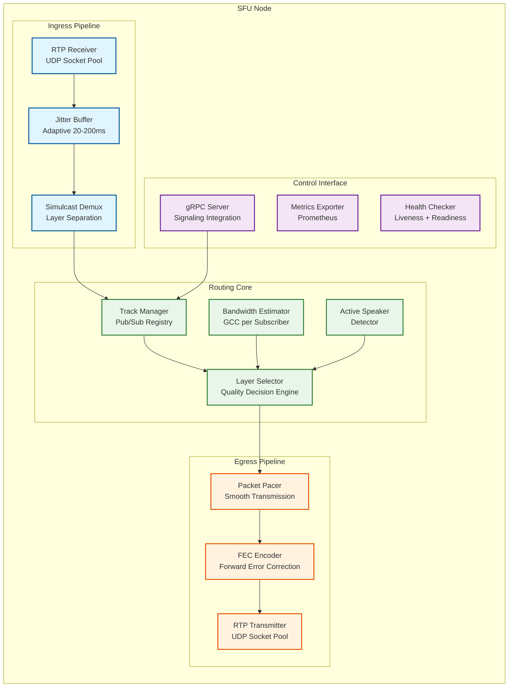
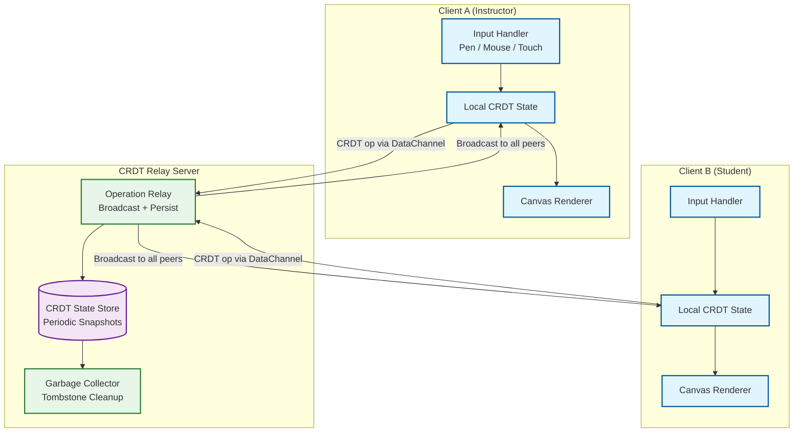
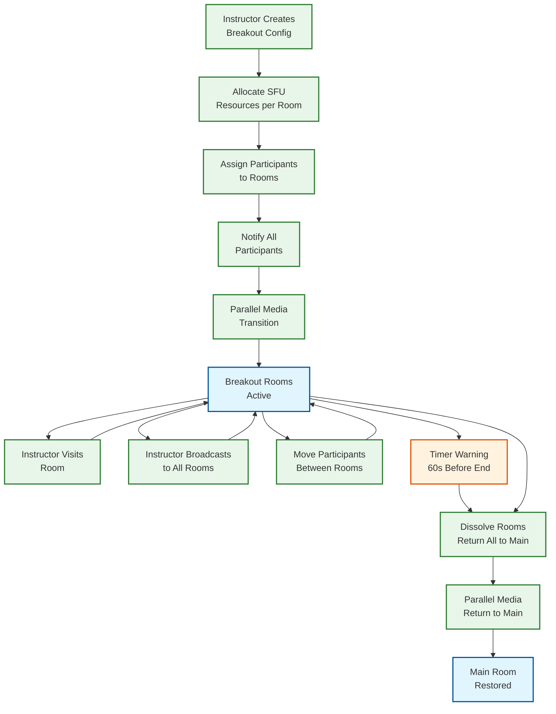

# Deep Dive & Bottlenecks — Live Classroom System

## Critical Component 1: SFU Media Routing Engine

### Why This Is Critical

The SFU (Selective Forwarding Unit) is the heart of the live classroom. It receives media streams from every publishing participant and selectively forwards them to every subscribing participant. At 100,000 concurrent sessions with 30 participants each, the SFU fleet handles 600,000 upstream video feeds and millions of downstream subscriptions. A single SFU node failure mid-session causes immediate, visible disruption to every participant routed through it. Unlike API servers where a retry solves most failures, a media interruption of even 2 seconds is perceptible and disruptive to a live lecture.

### How It Works Internally

#### SFU Node Architecture



#### Packet Flow (Publisher to Subscriber)

1. **RTP Reception:** Publisher sends RTP packets over DTLS-SRTP. The SFU's UDP socket pool receives packets and decrypts SRTP headers (not payload—the SFU never decodes media).

2. **Jitter Buffer:** Packets arrive with variable inter-packet delay due to network jitter. The adaptive jitter buffer reorders packets and absorbs timing variations. Buffer depth auto-tunes: 20ms in low-jitter conditions, up to 200ms in high-jitter scenarios.

3. **Simulcast Demuxing:** The publisher sends 3 simultaneous encodings (high/mid/low via simulcast) or a single scalable encoding (SVC with temporal/spatial layers). The SFU separates these into independent forwarding queues by RID (RTP Stream ID) or layer markers.

4. **Track Manager:** Maintains a registry of all published tracks and subscriber interests. When a subscriber says "I want participant X's video at medium quality," the track manager creates a forwarding rule from the mid-layer queue to the subscriber's egress path.

5. **Layer Selection:** The bandwidth estimator (GCC algorithm) continuously estimates each subscriber's available bandwidth via RTCP feedback. The layer selector matches the subscriber's bandwidth budget against available simulcast layers, upgrading or downgrading quality in real-time.

6. **Active Speaker Detection:** Audio levels from all participants are analyzed using a sliding-window RMS calculation. The participant with the highest audio energy above a voice activity detection (VAD) threshold for >500ms is declared the active speaker. Active speaker changes trigger layer upgrades for the speaker and potential downgrades for others to stay within bandwidth budgets.

7. **Packet Pacer:** RTP packets are transmitted at a smooth, controlled rate rather than in bursts. Bursty transmission causes network congestion and jitter; pacing spreads packets evenly across time intervals.

8. **FEC Encoding:** Forward Error Correction (FlexFEC or UlpFEC) adds redundancy packets that allow the receiver to reconstruct lost packets without retransmission. For a 2% packet loss scenario, FEC with 10% redundancy eliminates visible video artifacts without retransmission delay.

### Failure Modes & Handling

| Failure Mode | Impact | Detection | Mitigation |
|---|---|---|---|
| **SFU node crash** | All sessions on that node lose media immediately | Health check failure (2s timeout) | Participants auto-reconnect to backup SFU; signaling server triggers re-subscription |
| **SFU CPU saturation** | Increased jitter, packet drops, media degradation | CPU >85% for >10s | Shed load: new sessions routed elsewhere; existing sessions migrate if possible |
| **Network partition (SFU ↔ subscriber)** | Individual subscriber loses media | RTCP RR timeout (5s) | Subscriber ICE restart; TURN fallback if direct path failed |
| **Cascade link failure** | Cross-region participants lose remote media | Inter-SFU heartbeat failure (3s) | Reroute cascade through alternative region; degrade to audio-only if no path |
| **Memory leak** | Gradual degradation, eventual OOM | Memory utilization trending + threshold | Graceful drain: stop accepting new sessions, migrate existing, restart node |

### SFU Failover Protocol

```
FUNCTION HandleSFUFailover(failed_node, participants):
    // 1. Identify affected sessions
    affected_sessions = GetSessionsByNode(failed_node)

    FOR EACH session IN affected_sessions:
        // 2. Select replacement SFU
        candidate_sfus = GetHealthySFUsInRegion(session.region)
        new_sfu = SelectByLowestLoad(candidate_sfus)

        // 3. Notify signaling server
        SignalingServer.NotifyMigration(session.id, failed_node, new_sfu)

        // 4. For each participant, trigger ICE restart
        FOR EACH participant IN session.participants:
            // Send new SFU endpoint via signaling channel
            SignalingServer.SendToParticipant(participant.id, {
                type: "migration",
                new_sfu_endpoint: new_sfu.endpoint,
                reconnect_token: GenerateReconnectToken(participant, session)
            })

        // 5. Transfer session state to new SFU
        session_state = {
            published_tracks: GetPublishedTracks(session),
            subscription_map: GetSubscriptionMap(session),
            active_speaker: session.active_speaker,
            recording_state: session.recording_active
        }
        new_sfu.LoadSessionState(session_state)

    // Target: <3s total media interruption
    RETURN affected_sessions.count
```

---

## Critical Component 2: CRDT-Based Collaborative Whiteboard

### Why This Is Critical

The whiteboard is the primary visual collaboration tool, replacing the physical classroom's chalkboard. Unlike chat (where slight delays are tolerable) or polls (where eventual consistency suffices), the whiteboard demands real-time visual consistency across all participants. When the instructor draws a diagram, every student must see it appear within 100ms. When two students simultaneously annotate the same region, their edits must merge without conflicts and without either student's work being lost.

### How It Works Internally

#### CRDT Architecture



#### CRDT Type Design for Whiteboard Objects

| Object Type | CRDT Type | Conflict Resolution |
|---|---|---|
| **Object list (z-order)** | RGA (Replicated Growable Array) | Deterministic ordering by Lamport clock; concurrent inserts ordered by site_id |
| **Object position (x, y)** | LWW Register (Last-Writer-Wins) | Most recent clock wins; concurrent moves converge to one position |
| **Object properties (color, size)** | LWW Register per field | Each property independently resolved by latest clock |
| **Stroke points** | Append-only sequence | Points are immutable once committed; no conflict possible |
| **Text content** | RGA for character sequence | Character-level CRDT for collaborative text editing |
| **Deletion** | Tombstone flag | Tombstoned objects hidden but retained for CRDT consistency; GC after all sites acknowledge |
| **Group membership** | OR-Set (Observed-Remove Set) | Objects can be added/removed from groups without conflict |

#### Whiteboard Operation Processing Pipeline

```
FUNCTION ProcessWhiteboardOp(local_state, incoming_op, operation_log):
    // 1. Causal ordering check
    IF NOT CausallyReady(incoming_op, local_state.vector_clock):
        // Buffer out-of-order operations
        operation_buffer.enqueue(incoming_op)
        RETURN

    // 2. Apply CRDT merge (guaranteed convergent)
    local_state = CRDTMerge(local_state, incoming_op)

    // 3. Update vector clock
    local_state.vector_clock.merge(incoming_op.clock)

    // 4. Append to operation log (for undo and persistence)
    operation_log.append(incoming_op)

    // 5. Render delta (only changed objects)
    changed_objects = GetAffectedObjects(incoming_op)
    RenderDelta(changed_objects)

    // 6. Process buffered operations that are now causally ready
    WHILE operation_buffer.hasReadyOps(local_state.vector_clock):
        buffered_op = operation_buffer.dequeueReady()
        ProcessWhiteboardOp(local_state, buffered_op, operation_log)

    // 7. Periodic snapshot (every 100 operations or 5 seconds)
    IF operation_log.length MOD 100 == 0:
        PersistSnapshot(local_state)
```

### Failure Modes & Handling

| Failure Mode | Impact | Detection | Mitigation |
|---|---|---|---|
| **CRDT relay server failure** | New ops not broadcast to peers | WebSocket/DataChannel disconnect | Clients buffer locally; ops replayed when relay recovers or failover completes |
| **Client network partition** | Participant draws locally, others don't see it | Heartbeat timeout (3s) | Client continues locally; CRDT guarantees merge on reconnection |
| **State divergence (bug)** | Participants see different whiteboard content | Periodic checksum comparison across clients | Server-authoritative snapshot forced; clients re-sync from server state |
| **Unbounded CRDT state growth** | Memory pressure on clients and server | State size monitoring | Tombstone garbage collection when all sites have acknowledged past the tombstone |
| **Undo cascade conflict** | Undo of operation that other operations depend on | None (design-time) | Per-user undo only affects that user's operations; never undoes others' work |

---

## Critical Component 3: Breakout Room Orchestrator

### Why This Is Critical

Breakout rooms require real-time rearrangement of the session's media topology. When an instructor creates 5 breakout rooms for a class of 50, the system must: split 50 participants into 5 groups, allocate SFU resources for each room, reroute media streams for all participants (disconnect from main SFU, connect to breakout SFU), preserve the main room's state for return, and do all of this within 3 seconds end-to-end. The orchestration must be atomic—either all participants successfully transition, or the breakout rooms are rolled back. A partial transition (some students in breakout, some stuck in main room) creates a confusing and broken experience.

### How It Works Internally

#### Breakout Room Lifecycle



#### Orchestration Algorithm

```
FUNCTION CreateBreakoutRooms(session, config):
    // Phase 1: Validate preconditions
    IF session.status != "active":
        THROW "Session must be active"
    IF session.has_active_breakout_rooms:
        THROW "Close existing breakout rooms first"

    // Phase 2: Allocate SFU resources (parallel)
    sfu_allocations = PARALLEL FOR i = 1 TO config.num_rooms:
        sfu_node = SelectSFUForBreakout(session.region, session.sfu_node)
        room = CreateRoom(session.id, i, config.time_limit)
        AllocateSFUCapacity(sfu_node, room, config.max_per_room)
        RETURN {room, sfu_node}

    // Phase 3: Assign participants
    eligible = session.participants.filter(p => p.role != "host" AND p.status == "in_session")
    assignments = AssignBreakoutRooms(eligible, config.num_rooms, config.strategy, config.constraints)

    // Phase 4: Prepare transition (batch all signaling messages)
    transition_batch = []
    FOR EACH room, participants IN assignments:
        sfu_allocation = sfu_allocations[room.index]
        FOR EACH participant IN participants:
            transition_batch.append({
                participant_id: participant.id,
                target_room: room.id,
                target_sfu: sfu_allocation.sfu_node.endpoint,
                transition_token: GenerateTransitionToken(participant, room)
            })

    // Phase 5: Execute transition (parallel notification + 3s deadline)
    success_count = 0
    WITH timeout(3000ms):
        results = PARALLEL FOR EACH transition IN transition_batch:
            SendTransitionSignal(transition.participant_id, transition)
            WaitForTransitionAck(transition.participant_id, timeout=2500ms)
            RETURN ack_received

        success_count = results.count(true)

    // Phase 6: Handle stragglers
    IF success_count < transition_batch.length * 0.9:
        // >10% failed: keep retrying for slow clients
        RetryStragglersAsync(transition_batch.filter(t => !t.acked))

    // Phase 7: Start timer
    IF config.time_limit > 0:
        ScheduleAutoReturn(session.id, config.time_limit, config.warning_seconds)

    RETURN {rooms: sfu_allocations, assignments, success_rate: success_count / transition_batch.length}
```

### Instructor Room Visit Pattern

The instructor must be able to "visit" breakout rooms without leaving the main room's context entirely. This is architecturally complex because the instructor needs to:
- Hear/see participants in the visited breakout room
- Be heard/seen by breakout room participants
- Maintain the ability to instantly return to main room or visit another room
- Not affect the main room's recording or state

**Implementation:** The instructor's SFU connection maintains subscriptions to the main room's published tracks (paused) while establishing new subscriptions to the visited room's tracks. The instructor's published tracks are forwarded to both the visited room and the main room simultaneously. This "dual subscription" pattern avoids a full media reconnection for each room visit.

### Failure Modes & Handling

| Failure Mode | Impact | Detection | Mitigation |
|---|---|---|---|
| **SFU allocation failure for a breakout room** | Room cannot be created | SFU health check failure during allocation | Reduce room count; merge affected participants into other rooms |
| **Participant fails to transition** | Student stuck between rooms | Transition ACK timeout (2.5s) | Auto-assign to main room fallback; retry async |
| **Timer desync across rooms** | Rooms end at different times | Server-authoritative timer with client sync | All timers driven by server; clients display server-provided countdown |
| **Instructor visit during dissolution** | Instructor stuck in breakout as it closes | State machine check before visit | Block visit requests during dissolution phase; force return |
| **Network failure during return-to-main** | Participants stuck in closed breakout room | Connection monitoring | Breakout SFU keeps running until all participants reconnect to main; 30s grace period |

---

## Concurrency & Race Conditions

### Race Condition 1: Simultaneous Mute-All and Unmute Self

**Scenario:** The instructor sends "mute all participants" at the exact moment a student unmutes themselves.

**Problem:** If the mute-all command is processed first but the unmute arrives at the SFU before the roster update propagates, the student appears unmuted despite the mute-all.

**Solution:** Session-level operation sequencing via a monotonically increasing sequence number. Every control operation (mute, unmute, mute-all) carries a session sequence number. The SFU applies operations in sequence order. If a participant's unmute has sequence `N` and the mute-all has sequence `N+1`, the mute-all takes precedence regardless of arrival order.

### Race Condition 2: Session End During Breakout Room Transition

**Scenario:** The instructor ends the session while breakout rooms are being created and participants are mid-transition.

**Problem:** Some participants are connected to breakout SFUs, some are in main room, and the end-session command must reach all of them.

**Solution:** Session state machine with transition locks. The breakout room creation acquires a session-level transition lock. End-session must wait for the transition to complete (or timeout after 5s) before executing. The end-session command is then broadcast to all SFU instances (main + breakout) atomically.

### Race Condition 3: Concurrent Whiteboard Object Moves

**Scenario:** Two users drag the same sticky note to different locations simultaneously.

**Problem:** Without coordination, the sticky note would jump between positions as each update arrives.

**Solution:** LWW Register with Lamport clock. Each move operation carries a (site_id, counter) clock. The higher clock value wins. Both clients converge to the same final position within one network round-trip. The "losing" user sees their move briefly applied locally, then overridden by the remote operation—a minor visual glitch that resolves in <200ms.

### Race Condition 4: Recording Start After Session Already Has Participants

**Scenario:** Instructor enables recording 10 minutes into a session. Existing media streams must be captured without interruption.

**Problem:** The recording agent must subscribe to all existing tracks without causing a media renegotiation that might briefly interrupt participants.

**Solution:** The SFU creates a "media fork"—a passive copy of all forwarded RTP packets is duplicated to the recording agent's receive port. This fork is invisible to participants (no SDP renegotiation, no additional bandwidth from publishers). The recording agent receives the forked streams and starts writing immediately.

### Race Condition 5: Participant Reconnection During Active Speaker Change

**Scenario:** A participant reconnects after a brief network interruption. During the reconnection window, the active speaker changed.

**Problem:** The reconnecting client might subscribe to the wrong participant at high quality, missing the active speaker switch.

**Solution:** On reconnection, the signaling server sends a full room state snapshot (not just a delta) including the current active speaker. The client re-evaluates all subscriptions based on this snapshot, ensuring it subscribes to the correct active speaker at high quality.

---

## Bottleneck Analysis

### Bottleneck 1: Hour-Boundary Session Start Thundering Herd

**The Problem:** University schedules concentrate session starts at the top of the hour. 40% of daily sessions may start within a single 60-second window. Each session start requires SFU allocation, DTLS handshake, ICE connectivity check, and initial media key exchange—computationally intensive operations that don't parallelize well.

**Impact:** SFU allocation queues back up, ICE checks timeout, and participants experience 10-15 second join times instead of the 3-second target.

**Mitigation Strategy:**

| Strategy | Implementation | Impact |
|---|---|---|
| **Pre-warming** | Analyze schedule data 10 minutes before the hour; pre-allocate SFU capacity for scheduled sessions | Eliminates allocation delay; sessions start on pre-warmed nodes |
| **Staggered ICE** | Spread ICE connectivity checks across a 5-second window per session using jittered delay | Prevents STUN/TURN server overload; smooths connection establishment |
| **Early SDP exchange** | Allow clients to begin SDP offer/answer 30 seconds before scheduled start | DTLS handshake completes before session officially starts |
| **Connection pooling** | Pre-establish DTLS connections from clients to their regional SFU during the "waiting room" phase | First frame delivered immediately when session activates |

### Bottleneck 2: SFU Memory Pressure Under High Subscription Count

**The Problem:** In a 500-participant lecture, each subscriber receives up to 9 video streams (gallery view). The SFU maintains per-subscriber state: jitter buffers, RTCP feedback, bandwidth estimates, layer selection state. At 500 subscribers x 9 subscriptions x ~50 KB state per subscription = 225 MB of per-session routing state, not counting the actual media buffer memory.

**Impact:** SFU nodes hit memory limits, triggering garbage collection pauses that cause jitter spikes.

**Mitigation Strategy:**

| Strategy | Implementation | Impact |
|---|---|---|
| **Tiered subscription model** | Limit gallery view to 9 streams; remaining participants audio-only with static avatar | 18x reduction in subscription count for large sessions |
| **Shared jitter buffers** | Multiple subscribers receiving the same stream from the same publisher share a single jitter buffer instance | 50-70% memory reduction for popular streams (e.g., instructor) |
| **Lazy subscription** | Only create subscriber state when the participant's viewport actually displays the video tile | Eliminates phantom subscriptions for off-screen participants |
| **SFU sharding** | Split a 500-participant session across 5 SFU nodes (100 each) with cascade for the instructor's stream | Each node handles manageable state; cascade adds minimal latency |

### Bottleneck 3: CRDT State Growth for Long Whiteboard Sessions

**The Problem:** CRDT tombstones accumulate indefinitely. In a 3-hour whiteboard-intensive session, an instructor might create and delete 500+ objects, producing 500 tombstones that can never be removed (until all clients acknowledge). The CRDT state grows monotonically, increasing merge time and memory usage.

**Impact:** Client-side rendering slows as the CRDT state exceeds 10 MB. Mobile clients particularly affected.

**Mitigation Strategy:**

| Strategy | Implementation | Impact |
|---|---|---|
| **Periodic compaction** | Server creates a compacted snapshot every 15 minutes, replacing tombstoned objects with a clean state | Bounds growth to 15 minutes of operations |
| **Page-based whiteboards** | Split whiteboard into pages; only active page's CRDT state is loaded in memory | Each page independently compactable |
| **Lazy loading** | Client loads CRDT state for visible viewport only; background-loads off-screen pages | Reduces initial load and memory footprint |
| **Tombstone GC protocol** | Server tracks acknowledgments from all connected clients; GCs tombstones when all have confirmed | Removes tombstones safely without violating CRDT invariants |

---

*Previous: [Low-Level Design](./03-low-level-design.md) | Next: [Scalability & Reliability ->](./05-scalability-and-reliability.md)*
