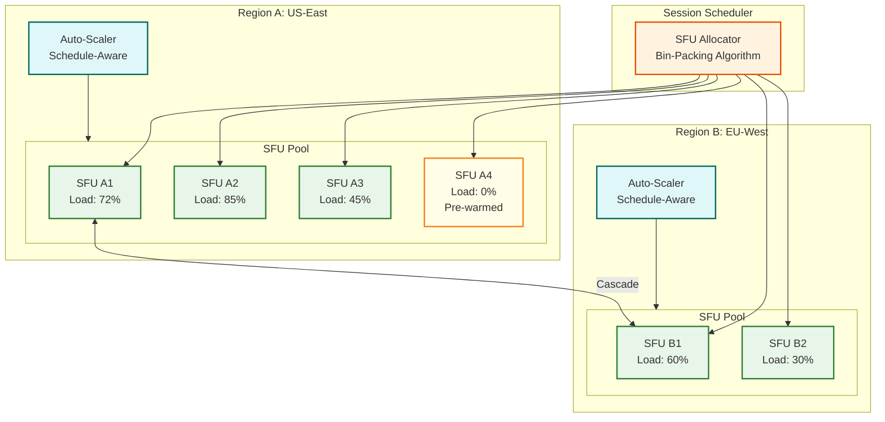
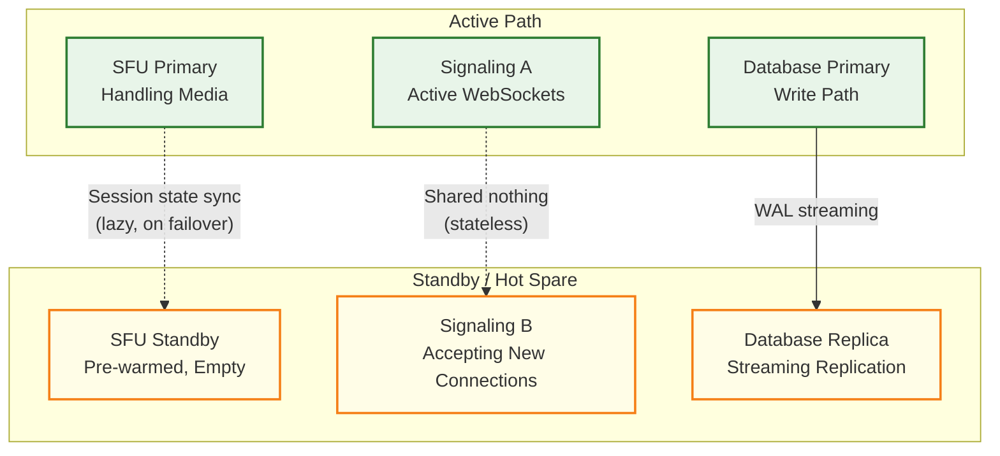
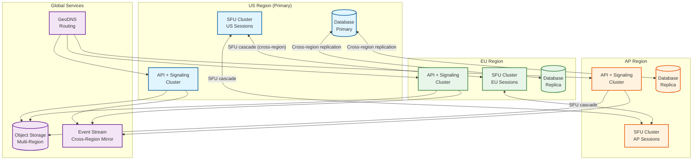

# Scalability & Reliability — Live Classroom System

## Scalability Strategy

### Horizontal vs Vertical Scaling Decisions

| Component | Strategy | Justification |
|---|---|---|
| **SFU media nodes** | Horizontal | Each SFU handles N sessions independently; add nodes to handle more sessions. No shared state between SFUs (except cascade links). |
| **Signaling servers** | Horizontal | Stateless WebSocket handlers behind L4 load balancer. Session affinity via consistent hashing on session_id. |
| **Whiteboard CRDT relay** | Horizontal | Each session's whiteboard state is independent; shard by session_id. |
| **TURN relay servers** | Horizontal | Each relay handles independent connections; geo-distributed fleet. |
| **Recording workers** | Horizontal | Each worker composes one recording independently; embarrassingly parallel. |
| **Session database** | Vertical first, then horizontal sharding | Session metadata is small; vertical scaling works to 10K QPS. Beyond that, shard by org_id. |
| **Event stream broker** | Horizontal | Partition by session_id; each partition independently ordered and consumable. |

### SFU Scaling Architecture



#### SFU Auto-Scaling Strategy

```
FUNCTION AutoScaleSFUPool(region, current_time):
    // Input signals
    scheduled_sessions = GetScheduledSessions(region, window=next_15_minutes)
    current_load = GetCurrentPoolLoad(region)
    historical_pattern = GetHistoricalPattern(region, day_of_week, hour)

    // Calculate required capacity
    scheduled_capacity = scheduled_sessions.count * AVG_SFU_UNITS_PER_SESSION
    current_used = current_load.total_sessions * AVG_SFU_UNITS_PER_SESSION
    headroom = MAX(scheduled_capacity, historical_pattern.p95) * HEADROOM_FACTOR  // 1.3x

    target_capacity = current_used + headroom

    // Current pool capacity
    current_capacity = GetPoolCapacity(region)

    IF target_capacity > current_capacity * 0.85:
        // Scale up: provision new SFU nodes
        nodes_needed = CEIL((target_capacity - current_capacity) / CAPACITY_PER_NODE)
        ProvisionSFUNodes(region, nodes_needed)
        // Pre-warm: start DTLS context, load TLS certificates, open UDP ports
        PreWarmNodes(region, nodes_needed)

    ELSE IF target_capacity < current_capacity * 0.4 AND IsOffPeakWindow(current_time):
        // Scale down: only during off-peak to avoid hysteresis
        excess_nodes = GetIdleNodes(region, idle_threshold=10_minutes)
        FOR EACH node IN excess_nodes:
            IF node.active_sessions == 0:
                DrainAndTerminate(node)

    // Pre-warming for hour boundaries
    IF MinutesUntilNextHour(current_time) <= 10:
        additional_capacity = scheduled_sessions.filter(s => s.starts_within(10_minutes)).count
        PreProvisionForBurst(region, additional_capacity)
```

### Session Scaling Tiers

| Session Size | SFU Strategy | Notes |
|---|---|---|
| **1–20 participants** | Single SFU node | Collocated with other small sessions on the same node |
| **21–50 participants** | Dedicated SFU node | Full node for one session; simulcast + active speaker optimization |
| **51–200 participants** | 2–4 SFU nodes with internal cascade | Participants sharded across nodes; cascade for instructor stream |
| **201–500 participants** | SFU cluster with tiered subscription | Instructor + TAs on primary SFU; students on secondary SFUs; cascade for media |
| **500–2000 participants** | SFU tree with selective forwarding | Tree topology: root (instructor) → intermediate → leaf (student groups). Only active speaker forwarded down. |
| **2000+ (webinar mode)** | SFU + CDN hybrid | Instructor media pushed to CDN for one-way streaming; interaction via signaling only |

### Caching Strategy

| Cache Layer | Data | TTL | Strategy |
|---|---|---|---|
| **L1: Client-side** | Session config, roster snapshot, whiteboard page cache | Session duration | Populated on join; invalidated on signaling events |
| **L2: SFU-local** | SRTP keys, subscriber state, layer selection cache | Connection duration | Per-connection state; evicted on disconnect |
| **L3: Redis cluster** | Session metadata, participant roster, active speaker state | 5 min (refreshed) | Write-through from session service; read-heavy from signaling |
| **L4: CDN** | Composed recordings, session thumbnails, profile avatars | 24 hours | Post-session content; long TTL for playback |

### Database Scaling

| Stage | Strategy | Capacity |
|---|---|---|
| **Stage 1 (0–10K concurrent sessions)** | Single primary + 2 read replicas | Handles CRUD for session/roster/engagement |
| **Stage 2 (10K–100K sessions)** | Shard by org_id (32 shards) | Each shard handles ~3K sessions; roster queries co-located |
| **Stage 3 (100K+ sessions)** | Shard by session_id for hot data, org_id for analytics | Session-scoped queries dominate during live sessions |
| **Time-series data (analytics)** | Dedicated time-series database | Append-only engagement events, quality metrics |
| **Chat messages** | Append-only log store, partitioned by session_id | High write throughput; no updates needed |

---

## Reliability & Fault Tolerance

### Single Points of Failure Analysis

| Component | SPOF Risk | Mitigation |
|---|---|---|
| **SFU node** | High: node failure kills active sessions | Multi-node sessions + automatic failover to standby SFU |
| **Signaling server** | Medium: loss prevents new joins and control actions | Stateless + redundant; client reconnects to any healthy instance |
| **Session database** | Medium: loss prevents session creation | Primary-replica with automatic failover; 5s failover time |
| **TURN server** | Low: affects only NAT-constrained participants | Geo-distributed fleet; clients get multiple TURN server addresses |
| **Event stream broker** | Low: affects analytics, not real-time media | Multi-broker cluster with partition replication factor 3 |
| **Recording pipeline** | Low: loss delays recording availability | Retry from SFU-stored raw chunks; idempotent composition |

### Redundancy Strategy



### Failover Mechanisms

#### SFU Failover (Most Critical)

| Phase | Action | Timeline |
|---|---|---|
| **Detection** | Health checker detects SFU unresponsive (failed RTCP + gRPC health) | 0–2 seconds |
| **Notification** | Signaling server informed; marks affected sessions for migration | 2–3 seconds |
| **Reassignment** | Session allocator selects new SFU from pre-warmed pool | 3–3.5 seconds |
| **Client reconnect** | Clients receive `migration` signaling event; initiate ICE restart to new SFU | 3.5–5 seconds |
| **Media restoration** | New DTLS handshake + SRTP key exchange; first media frame delivered | 5–7 seconds |
| **Total media gap** | — | **3–7 seconds** |

**Optimization:** For critical sessions (large lectures, examinations), maintain a "shadow SFU" that receives a real-time copy of all published streams. On primary failure, subscribers instantly switch to the shadow, reducing media gap to <2 seconds.

#### Signaling Server Failover

Signaling servers are stateless—all session state lives in the distributed cache (Redis) and database. When a signaling server fails:
1. Client WebSocket connection drops
2. Client automatically reconnects to any healthy signaling server (load balancer routes)
3. New server loads session state from Redis
4. Client receives a full room state snapshot
5. **Total reconnection time: 1–3 seconds**

### Circuit Breaker Patterns

| Circuit | Trigger | Open Action | Half-Open Test |
|---|---|---|---|
| **SFU allocation** | 3 allocation failures in 10s | Stop scheduling new sessions on this region; failover to backup region | Attempt single allocation every 30s |
| **TURN relay** | 5 relay failures in 30s | Remove TURN server from ICE candidates; rely on direct connections | Test single connection every 60s |
| **Recording pipeline** | 3 composition failures in 5 min | Queue recordings for retry; alert ops | Attempt single composition every 2 min |
| **Database writes** | 5 write failures in 10s | Switch to async buffered writes; serve reads from replica | Attempt single write every 15s |
| **Transcription service** | 3 timeouts in 1 min | Disable live captions; display "temporarily unavailable" | Test single transcription every 30s |

### Retry Strategy

| Operation | Retry Policy | Backoff | Max Retries | Notes |
|---|---|---|---|---|
| SFU connection (ICE) | Exponential | 1s, 2s, 4s | 3 | Then fall back to TURN relay |
| WebSocket reconnect | Exponential + jitter | 500ms, 1s, 2s, 4s | 10 | Jitter prevents reconnection storm |
| CRDT operation relay | Linear | 100ms, 200ms, 300ms | 5 | CRDTs are idempotent; safe to retry |
| Recording chunk upload | Exponential | 2s, 4s, 8s, 16s | 5 | Chunks are idempotent; retry safe |
| Database write | Exponential | 100ms, 200ms, 400ms | 3 | Then failover to queue for async write |

### Graceful Degradation Hierarchy

```
FUNCTION DegradeGracefully(system_load, component_health):
    // Level 0: Normal operation
    IF all_components_healthy AND system_load < 80%:
        RETURN FullFeatureSet()

    // Level 1: Reduce quality, maintain features
    IF system_load > 80% OR sfu_health < 95%:
        DISABLE virtual_backgrounds    // Saves 15% client CPU
        REDUCE max_simulcast_layers TO 2  // Saves 30% SFU bandwidth
        REDUCE gallery_view_max TO 6      // Saves 33% subscriptions

    // Level 2: Disable non-essential features
    IF system_load > 90% OR sfu_health < 80%:
        DISABLE live_transcription     // Saves transcription server load
        DISABLE reactions_animations   // Saves signaling bandwidth
        REDUCE whiteboard_sync_rate TO 200ms  // From 50ms

    // Level 3: Audio-priority mode
    IF system_load > 95% OR sfu_health < 60%:
        DISABLE video_for_non_speakers // Only active speaker has video
        DISABLE whiteboard_real_time   // Snapshot-based updates only
        REDUCE chat_rate_limit TO 5/min

    // Level 4: Emergency mode
    IF sfu_health < 40%:
        SWITCH_TO audio_only_mode      // All video disabled
        DISABLE breakout_rooms         // Simplify topology
        DISABLE recording              // Free SFU resources
        BROADCAST "Experiencing issues; audio-only mode activated"
```

### Bulkhead Pattern

| Bulkhead | Isolation | Rationale |
|---|---|---|
| **SFU pool per session tier** | Small sessions (1–20) and large sessions (200+) use separate SFU pools | A large session's resource consumption cannot starve small sessions |
| **Signaling thread pool** | Separate thread pools for join/leave (bursty) and media control (steady) | Join storms at hour boundaries don't block mute/unmute operations |
| **Recording pipeline** | Separate composition workers for standard vs. high-priority recordings | Exam recordings processed with guaranteed SLA; standard recordings queued |
| **Database connection pool** | Separate pools for session CRUD (write) and roster queries (read) | Heavy read load from roster refreshes doesn't block session writes |
| **TURN relay fleet** | Separate relay pools per geographic region | Regional network issues don't cascade to other regions |

---

## Disaster Recovery

### RTO / RPO Targets

| Component | RTO | RPO | Strategy |
|---|---|---|---|
| **Live session media** | 7s (failover) | 0 (real-time) | SFU failover to pre-warmed standby; no media buffered/stored |
| **Session metadata** | 30s | 0s | Primary-replica with synchronous replication; automatic failover |
| **Whiteboard state** | 60s | 5s | CRDT state snapshots every 5s; restore from latest snapshot |
| **Chat history** | 5 min | 30s | Replicated append-only log; restore from replica |
| **Recordings** | 4 hours | 0 | Raw chunks in multi-region object storage; recompose if needed |
| **Analytics data** | 1 hour | 5 min | Stream replay from event log; recompute aggregates |

### Multi-Region Architecture



### Backup Strategy

| Data | Backup Frequency | Backup Type | Retention | Storage |
|---|---|---|---|---|
| Session database | Continuous (WAL shipping) + daily full | Streaming + snapshot | 30 days | Cross-region object storage |
| Recording raw chunks | Immediate (multi-region write) | Real-time replication | Per contract (90 days – 7 years) | Erasure-coded object storage |
| CRDT whiteboard state | Every 5s snapshot + end-of-session full | Incremental + full | 90 days | Object storage |
| Analytics aggregates | Hourly | Incremental | 2 years | Time-series backup |
| Configuration/secrets | On change | Full | 90 days | Encrypted config store |

### Regional Failover Protocol

```
FUNCTION HandleRegionFailover(failed_region):
    // 1. DNS failover: redirect traffic to nearest healthy region
    UpdateGeoDNS(failed_region, redirect_to=nearest_healthy_region)

    // 2. Active sessions cannot be migrated (media is real-time)
    // Notify affected session participants
    FOR EACH session IN GetActiveSessions(failed_region):
        NotifyParticipants(session, "Session interrupted due to regional outage. Please rejoin.")

    // 3. New sessions route to backup region
    RedirectNewSessions(failed_region, backup_region)

    // 4. Promote read replica to primary if needed
    IF failed_region == primary_database_region:
        PromoteReplica(nearest_region_replica)
        UpdateDatabaseEndpoints()

    // 5. Scale up backup region to handle additional load
    ScaleUpSFUPool(backup_region, additional_capacity=failed_region.capacity)

    // Total failover for new sessions: 30-60 seconds
    // Existing sessions in failed region: lost (participants must rejoin)
```

---

## Capacity Planning Thresholds

| Metric | Scale Trigger | Action |
|---|---|---|
| SFU pool utilization | >70% for 5 min | Provision additional SFU nodes (10% of current fleet) |
| SFU node CPU | >80% for 2 min | Stop routing new sessions to this node |
| Signaling WebSocket count | >5,000 per instance | Add signaling server instances |
| TURN relay bandwidth | >70% capacity | Add TURN relay instances in region |
| Database write QPS | >80% of capacity | Enable write buffering; plan shard split |
| Event stream lag | >10,000 events behind | Add consumer instances for lagging partitions |
| Recording queue depth | >500 pending compositions | Add recording workers |

---

*Previous: [Deep Dive & Bottlenecks](./04-deep-dive-and-bottlenecks.md) | Next: [Security & Compliance ->](./06-security-and-compliance.md)*
