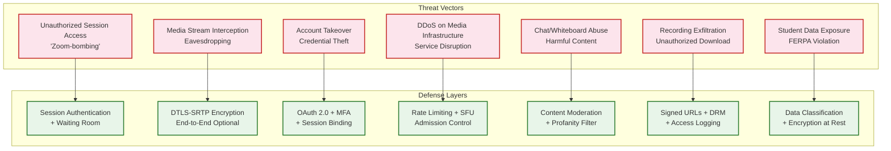
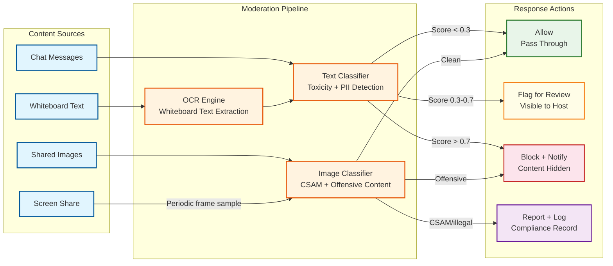

# Security & Compliance — Live Classroom System

## Threat Model Overview

Live classroom systems face a unique threat landscape: they handle real-time audio/video streams of potentially minor students, process educational records protected by law, and expose interactive surfaces (chat, whiteboard) that can be abused. The system must defend against external attackers (unauthorized access, DDoS), malicious insiders (credential theft), and disruptive participants ("Zoom-bombing"), while maintaining the low-latency performance that real-time communication demands.



---

## Authentication & Authorization

### Authentication (AuthN)

| Flow | Mechanism | Details |
|---|---|---|
| **User login** | OAuth 2.0 / OIDC via institutional IdP | SSO integration with university/school identity providers (SAML 2.0 or OIDC) |
| **Session join (authenticated)** | JWT with session-scoped claims | Short-lived token (15 min) containing `user_id`, `session_id`, `role`, `permissions` |
| **Session join (guest)** | Link + passcode + waiting room | Guest receives limited-scope JWT after passcode verification and host admission |
| **API access** | Bearer token (JWT) | Validated at API gateway; refreshed via refresh token rotation |
| **WebSocket upgrade** | Token in query parameter (initial) + HMAC in first frame | WebSocket upgrade includes auth token; first message contains HMAC for binding |
| **SFU media access** | DTLS fingerprint binding | SFU verifies DTLS certificate fingerprint matches the one in the signed SDP offer |
| **TURN credentials** | Time-limited shared secret (TURN REST API) | Credentials valid for 6 hours; derived from session-specific HMAC |

### MFA Requirements

| User Type | MFA Requirement | Methods |
|---|---|---|
| **Administrators** | Always required | TOTP, hardware key (WebAuthn) |
| **Instructors** | Required for session host actions | TOTP, push notification |
| **Students (K-12)** | Optional (parental consent required) | Device-bound token, institutional SSO |
| **Guests** | Not applicable | Waiting room + passcode serves as second factor |

### Authorization (AuthZ) — Role-Based Access Control

| Permission | Admin | Instructor | Co-Host | TA | Student | Guest |
|---|---|---|---|---|---|---|
| Create/schedule sessions | Yes | Yes | No | No | No | No |
| Start/end session | Yes | Yes | Yes | No | No | No |
| Admit from waiting room | Yes | Yes | Yes | Yes | No | No |
| Mute/unmute others | Yes | Yes | Yes | Yes | No | No |
| Remove participant | Yes | Yes | Yes | No | No | No |
| Create breakout rooms | Yes | Yes | Yes | No | No | No |
| Share screen | Yes | Yes | Yes | Yes | Configurable | No |
| Use whiteboard | Yes | Yes | Yes | Yes | Configurable | Configurable |
| Send chat messages | Yes | Yes | Yes | Yes | Configurable | Configurable |
| Create polls | Yes | Yes | Yes | Yes | No | No |
| Start/stop recording | Yes | Yes | Yes | No | No | No |
| Access recordings | Yes | Yes | Yes | Configurable | Configurable | No |
| View analytics | Yes | Yes | No | Configurable | No | No |
| Manage organization settings | Yes | No | No | No | No | No |

### Token Management

```
SESSION JOIN TOKEN STRUCTURE:
{
  "iss": "classroom.example.com",
  "sub": "user_uuid",
  "aud": "session_uuid",
  "iat": 1741564800,
  "exp": 1741565700,       // 15-minute validity
  "role": "student",
  "permissions": ["audio", "video", "chat", "whiteboard_view"],
  "sfu_region": "us-east",
  "device_id": "device_fingerprint_hash",
  "session_config": {
    "recording_consent": true,
    "breakout_eligible": true
  }
}

TOKEN ROTATION:
- Access token: 15-minute lifetime; refreshed via WebSocket keep-alive
- Refresh token: 24-hour lifetime; single-use with rotation
- TURN credentials: 6-hour lifetime; pre-rotated 30 minutes before expiry
- SFU DTLS session: Session-scoped; renegotiated on SFU migration
```

---

## Data Security

### Encryption at Rest

| Data Type | Encryption | Key Management | Notes |
|---|---|---|---|
| Session database | AES-256 (volume-level) | Key management service with automatic rotation (90 days) | All PII encrypted at storage layer |
| Session recordings | AES-256-GCM (object-level) | Per-organization encryption keys; customer-managed key option | Recordings individually encrypted |
| Chat transcripts | AES-256 (volume-level) | Shared with database key hierarchy | Part of session data |
| Whiteboard snapshots | AES-256-GCM (object-level) | Per-session encryption key | State may contain sensitive drawings |
| Attendance records | AES-256 (volume-level) | Educational records key class | FERPA-protected data |
| Analytics data | AES-256 (volume-level) | Analytics-tier key | Aggregated; lower sensitivity |
| Backup data | AES-256-GCM (object-level) | Separate backup key hierarchy | Cross-region backups independently encrypted |

### Encryption in Transit

| Path | Protocol | Cipher Suite | Notes |
|---|---|---|---|
| Client ↔ API Gateway | TLS 1.3 | AES-256-GCM, ChaCha20-Poly1305 | HSTS enforced; certificate pinning for mobile |
| Client ↔ WebSocket | WSS (TLS 1.3) | Same as HTTPS | Upgraded from HTTPS connection |
| Client ↔ SFU (media) | DTLS 1.2 + SRTP | AES-128-CM-HMAC-SHA1 (SRTP default) | Key exchange via DTLS handshake |
| SFU ↔ SFU (cascade) | DTLS-SRTP | Same as client ↔ SFU | Inter-SFU traffic always encrypted |
| Client ↔ TURN relay | TURNS (TLS-wrapped) | AES-256-GCM | TURN traffic encrypted even through relay |
| Service ↔ Service | mTLS | AES-256-GCM | Zero-trust internal communication |
| Service ↔ Database | TLS 1.3 | AES-256-GCM | Connection-level encryption |

### End-to-End Encryption (E2EE) Option

For sensitive sessions (examinations, private consultations), optional E2EE mode where media is encrypted at the sender and decrypted only at the receiver. The SFU cannot access media content—it forwards opaque encrypted packets.

**E2EE Architecture:**
```
SENDER:
  1. Encode video/audio frame
  2. Encrypt frame with session symmetric key (AES-256-GCM)
  3. Encapsulate in RTP packet (RTP header remains unencrypted for SFU routing)
  4. SRTP encrypt the entire packet (SFU can decrypt SRTP but not inner frame encryption)
  5. Send to SFU

SFU (in E2EE mode):
  1. Decrypt SRTP layer (can read RTP headers for routing)
  2. Forward encrypted payload as-is (cannot read frame content)
  3. Re-encrypt with SRTP for destination transport

RECEIVER:
  1. Decrypt SRTP layer
  2. Decrypt inner frame encryption with session symmetric key
  3. Decode and render frame

KEY EXCHANGE:
  - Insertable Streams API (web) for frame-level encryption
  - Session key distributed via MLS (Messaging Layer Security) protocol
  - Key ratcheting every 60 seconds for forward secrecy
```

**E2EE Trade-offs:**
- Recording disabled (server cannot access media content)
- Server-side transcription disabled
- SFU server-side processing (noise suppression, virtual backgrounds) disabled
- Active speaker detection uses only RTP header audio levels (less accurate)

### PII Handling

| PII Type | Classification | Access Control | Retention |
|---|---|---|---|
| Student name, email | Restricted | Session participants + admins | Account lifetime |
| Student video/audio | Highly Restricted | Session participants only (real-time); recording access per policy | Session duration (live); recording retention per contract |
| Student attendance records | Restricted (FERPA-protected) | Instructor + admin | Per FERPA guidelines (typically until no longer needed) |
| Chat messages | Restricted | Session participants + admins | 90 days default; configurable |
| IP addresses, device info | Internal | Ops team only | 30 days (logging) |
| Assessment responses | Restricted (FERPA-protected) | Instructor + admin | Per institutional policy |

---

## Threat Analysis & Mitigation

### Threat 1: Unauthorized Session Access ("Zoom-Bombing")

**Attack Vector:** Attacker obtains or guesses the session join link and enters a class to display offensive content or disrupt the session.

**Mitigation Layers:**

| Layer | Control | Details |
|---|---|---|
| **Prevention** | Waiting room (default ON for education) | All external joins held until host admits |
| **Prevention** | Authenticated join | Require institutional SSO for non-guest participants |
| **Prevention** | Session passcode | 6-digit rotating passcode (changes every 24h) |
| **Prevention** | Link expiration | Join links expire 30 minutes after session ends |
| **Detection** | Anomaly detection | Flag participants joining from unexpected geolocations or multiple sessions simultaneously |
| **Response** | One-click remove + block | Host can instantly remove and prevent rejoin (IP + account block for session) |
| **Response** | Lock session | After all expected participants join, host locks the session (no new joins) |

### Threat 2: Media Stream Interception

**Attack Vector:** Man-in-the-middle attack intercepts WebRTC media streams between client and SFU.

**Mitigation:**
- DTLS-SRTP mandatory for all media streams—interception yields encrypted packets
- DTLS fingerprint verification: client and server verify each other's DTLS certificate fingerprints via the signaling channel (which is TLS-protected)
- Optional E2EE for high-sensitivity sessions (double encryption)
- SFU-to-SFU cascade links use DTLS-SRTP (not unencrypted RTP)

### Threat 3: DDoS on Media Infrastructure

**Attack Vector:** Volumetric or application-layer DDoS targeting SFU UDP ports or signaling WebSocket endpoints.

**Mitigation:**

| Attack Type | Defense | Details |
|---|---|---|
| **UDP flood on SFU ports** | DTLS handshake as admission control | SFU drops all non-DTLS packets; only authenticated sessions receive media |
| **WebSocket flood** | Rate limiting at API gateway | Max 5 connections/IP/minute; authenticated-only WebSocket upgrade |
| **Amplification via TURN** | TURN authentication required | Only credentialed clients can allocate TURN relays; credentials tied to session |
| **Session creation flood** | CAPTCHA + rate limiting | Max 10 session creations/user/hour; enterprise accounts exempt |
| **SFU resource exhaustion** | Admission control | SFU rejects new sessions when at 85% capacity; backpressure to allocator |

### Threat 4: Chat and Whiteboard Content Abuse

**Attack Vector:** Participant posts harmful, offensive, or illegal content via chat messages or whiteboard drawings.

**Mitigation:**
- Real-time content moderation: ML-based profanity/toxicity detection on chat messages (flag + auto-hide above threshold)
- Whiteboard text moderation: OCR + text analysis for whiteboard text objects
- Image upload scanning: Hash-based blocklist (PhotoDNA equivalent) for uploaded images in chat
- Instructor controls: Disable chat, disable whiteboard for specific participants, clear whiteboard
- Audit trail: All chat messages and whiteboard operations logged with participant identity for post-incident investigation

### Threat 5: Recording Exfiltration

**Attack Vector:** Unauthorized user gains access to session recordings containing protected student data.

**Mitigation:**
- Signed URLs with 4-hour expiration for recording access
- Download tracking: every recording access logged with user identity, IP, and timestamp
- Optional DRM for recordings: Widevine/FairPlay for browser-based playback (prevents casual screen recording)
- Watermarking: invisible watermark embedded in recording containing viewer's user_id (enables leak tracing)
- Role-based access: only instructor, admin, and explicitly authorized participants can access recordings

---

## Compliance Framework

### FERPA (Family Educational Rights and Privacy Act)

| Requirement | Implementation |
|---|---|
| **Protect education records** | Attendance data, engagement metrics, chat transcripts classified as education records; encrypted at rest |
| **Legitimate educational interest** | Access to session recordings restricted to instructors and designated school officials |
| **Directory information exception** | Student name and enrollment status may be visible to session participants (directory info); all other data restricted |
| **Parental access rights** | Parents of students under 18 can request attendance and recording access via institutional admin |
| **Annual notification** | Platform displays FERPA notice during first login each academic year |
| **Third-party disclosure** | No student data shared with third parties without written consent; subprocessor agreements for all vendors |
| **Breach notification** | 72-hour notification to institution if student data is compromised |

### COPPA (Children's Online Privacy Protection Act) — 2025 Amendments

| Requirement | Implementation |
|---|---|
| **Verifiable parental consent (VPC)** | For users under 13: school acts as agent for parental consent per FTC guidance; platform collects no PII beyond what's educationally necessary |
| **Data minimization** | Collect only: name, school email, session participation. No behavioral profiling, no targeted advertising |
| **Expanded "personal information" (2025)** | Persistent identifiers, photos, videos, audio recordings, and geolocation all treated as personal information |
| **Opt-in consent** | Default to privacy-protective settings; instructor must explicitly enable recording and attendance features |
| **Data retention limits** | Student data retained only as long as educationally necessary; annual purge of inactive accounts |
| **Security program (new 2025)** | Documented security program proportional to data sensitivity; annual risk assessment |
| **Penalty awareness** | COPPA violations carry up to $51,744 per affected child; compliance audit trail maintained |

### GDPR (General Data Protection Regulation)

| Requirement | Implementation |
|---|---|
| **Lawful basis** | Legitimate interest (educational institution's mission) or consent for optional features |
| **Data subject rights** | Right to access, erasure, portability for all personal data including recordings and transcripts |
| **Data Protection Impact Assessment (DPIA)** | Completed for video recording, attendance tracking, and engagement analytics features |
| **Data Processing Agreements** | DPA with every subprocessor; standard contractual clauses for cross-border transfers |
| **Data residency** | EU participant data processed and stored in EU region; configurable per organization |
| **Breach notification** | 72-hour notification to supervisory authority; "without undue delay" to data subjects |

### Accessibility (WCAG 2.1 AA)

| Requirement | Implementation |
|---|---|
| **Keyboard navigation** | All controls accessible via keyboard; focus indicators visible |
| **Screen reader support** | ARIA labels for all interactive elements; live region announcements for active speaker changes, chat messages |
| **Captions** | Live automated captions (speech-to-text); manual caption option for pre-recorded content |
| **High contrast mode** | Dark/light/high-contrast themes; minimum 4.5:1 contrast ratio for text |
| **Reduced motion** | Option to disable animations, participant video transitions, and reaction effects |
| **Audio descriptions** | Screen share and whiteboard content described via alt-text and AI-generated descriptions |

---

## Content Moderation Pipeline



---

## Security Audit & Compliance Monitoring

| Control | Frequency | Scope | Output |
|---|---|---|---|
| **Penetration testing** | Quarterly | SFU, signaling, API, client apps | Findings report with severity ratings |
| **FERPA compliance audit** | Annual | Data access logs, retention policies, consent records | Compliance certification |
| **COPPA compliance review** | Annual | Under-13 data handling, consent flows, data minimization | Compliance report |
| **SOC 2 Type II audit** | Annual | Security, availability, confidentiality | SOC 2 report |
| **DPIA review** | Annual or on significant change | Recording, analytics, AI features | Updated DPIA document |
| **Access review** | Quarterly | Admin access, recording access, API key inventory | Access audit report |
| **Incident response drill** | Semi-annual | Data breach, service outage, content moderation escalation | Drill report with improvement actions |

---

*Previous: [Scalability & Reliability](./05-scalability-and-reliability.md) | Next: [Observability ->](./07-observability.md)*
