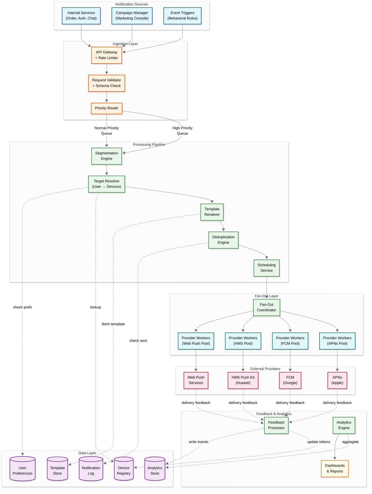
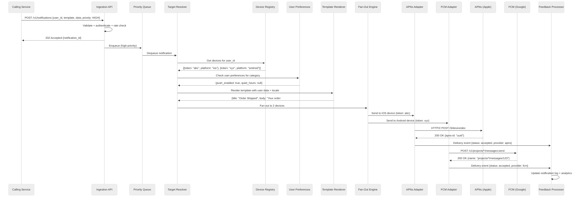
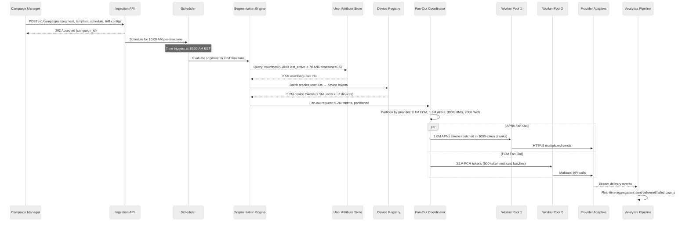
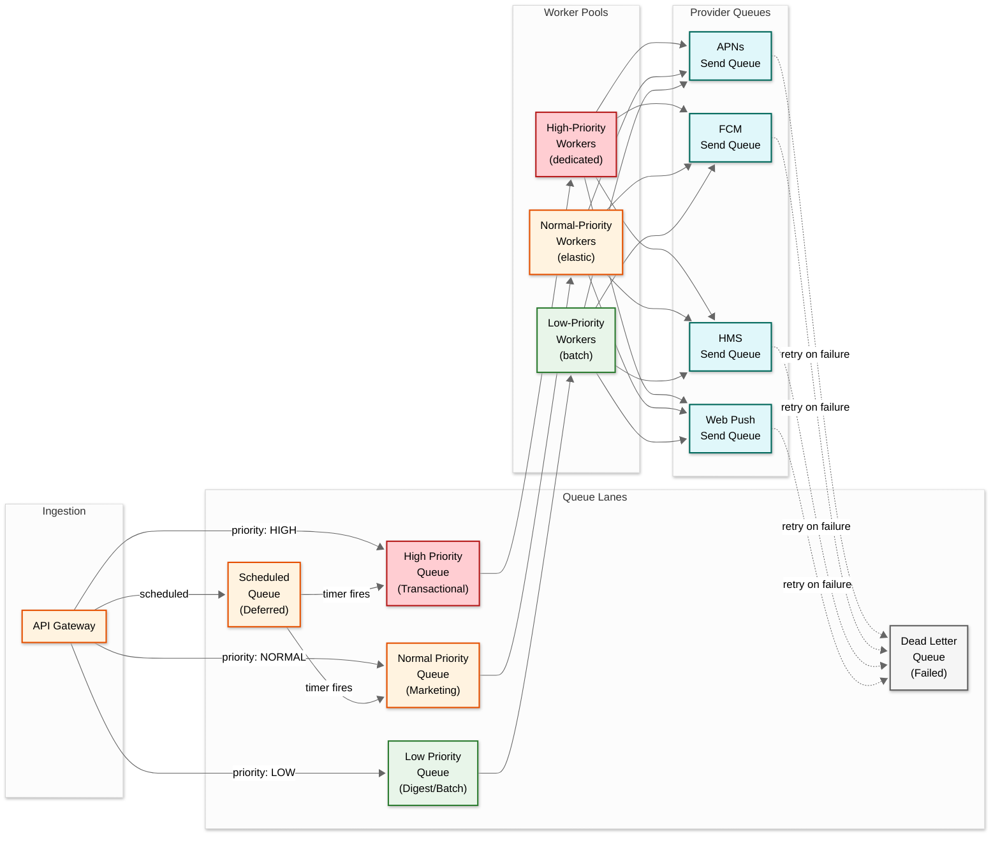

# High-Level Design — Push Notification System

## 1. System Architecture

### 1.1 Architecture Overview

The Push Notification System follows an event-driven microservices architecture with a multi-stage pipeline: **Ingestion → Resolution → Rendering → Scheduling → Fan-Out → Delivery → Feedback**. Each stage is decoupled via message queues, enabling independent scaling and fault isolation. The system uses CQRS for the device registry (high-read token lookups separated from write-heavy token updates) and an adapter pattern for provider integration (abstracting APNs, FCM, HMS, and Web Push behind a unified delivery interface).

---

## 2. Data Flow

### 2.1 Transactional Notification Flow (Single User)

A transactional notification (e.g., OTP code, order confirmation) targets a specific user and requires low-latency delivery.

### 2.2 Campaign Notification Flow (Mass Fan-Out)

A marketing campaign targets a segment (e.g., "users in US who haven't opened app in 7 days") and requires controlled fan-out.

---

## 3. Key Architectural Decisions

### 3.1 Decision Log

| Decision | Choice | Alternatives Considered | Rationale |
|---|---|---|---|
| **Service architecture** | Microservices with pipeline stages | Monolith, serverless functions | Each pipeline stage has fundamentally different scaling characteristics (segmentation is CPU-bound, fan-out is I/O-bound, feedback is event-driven); independent scaling is essential |
| **Inter-service communication** | Async message queues between pipeline stages | Synchronous REST/gRPC calls | Queue-based decoupling absorbs traffic spikes, enables backpressure, and prevents cascading failures when providers throttle |
| **Priority handling** | Separate queue lanes (high/normal/low) | Single queue with priority field | Separate queues ensure transactional notifications (OTP, security alerts) are never delayed behind a 100M-device marketing campaign |
| **Provider integration** | Adapter pattern with per-provider worker pools | Unified abstraction with single pool | Per-provider pools allow independent scaling (more APNs workers during iOS peak, more FCM workers during Android peak) and isolated failure domains |
| **Device registry** | Wide-column NoSQL with caching layer | Relational DB, pure in-memory | 2B tokens requires horizontal sharding; wide-column store supports user_id partitioning with device-level columns; cache handles hot-path reads |
| **Fan-out strategy** | Pre-materialized device lists + partitioned parallel workers | Lazy resolution during send, topic-based provider broadcast | Pre-materialization allows per-device personalization and preference checking; provider topic broadcast cannot customize per user |
| **Delivery tracking** | Event-sourced notification status log | Mutable status field on notification record | Append-only event log captures the full lifecycle (queued → sent → delivered → opened) without update contention; enables reliable analytics |
| **Scheduling** | Distributed timer wheel with timezone partitioning | Cron-based scheduler, delay queues | Timer wheel handles millions of scheduled sends efficiently; timezone partitioning distributes load across the rolling global peak |
| **Template rendering** | Server-side rendering at send time | Client-side rendering, pre-rendered at ingest | Server-side ensures consistent rendering; send-time rendering allows dynamic data (e.g., current price in a sale notification) |
| **Analytics** | Stream processing for real-time + batch for aggregation | Pure batch (hourly rollups), pure stream | Real-time stream enables live campaign monitoring; batch handles expensive aggregations (funnel analysis, cohort comparison) |

### 3.2 Architecture Pattern Checklist

| Pattern | Decision | Justification |
|---|---|---|
| **Sync vs Async** | Async (queue-based pipeline) | Callers must not block on delivery; 202 Accepted response with async processing |
| **Event-driven vs Request-response** | Event-driven between pipeline stages | Each notification generates a cascade of events (resolved, rendered, sent, delivered) that flow through the pipeline |
| **Push vs Pull** | Push to providers, pull from queues | Workers pull from partitioned queues for backpressure; final delivery pushes to provider APIs |
| **Stateless vs Stateful** | Stateless services, stateful connections | Services are horizontally scalable; APNs HTTP/2 connections are stateful (persistent) but managed in connection pools |
| **Read-heavy vs Write-heavy** | Write-heavy (10:1 write:read) | System is dominated by notification sends (writes); reads are analytics queries and preference lookups |
| **Real-time vs Batch** | Real-time for delivery, batch for analytics | Transactional notifications require real-time processing; analytics aggregation can be batch |
| **Edge vs Origin** | Origin processing, edge delivery (via providers) | Providers own the edge delivery (CDN-like); all logic runs at origin |

---

## 4. Component Interaction Model

### 4.1 Queue Topology

The system uses a multi-lane queue topology to isolate traffic classes and enable per-stage backpressure:

### 4.2 Provider Connection Management

Each provider adapter maintains a pool of persistent connections optimized for the provider's protocol:

| Provider | Protocol | Connection Strategy | Batch Size | Auth Refresh |
|---|---|---|---|---|
| **APNs** | HTTP/2 multiplexed | 500–2,000 persistent connections; multiplex 500+ concurrent streams per connection | 1 (individual device per request, multiplexed) | JWT token rotated every 50 minutes (expires at 60 min) |
| **FCM** | HTTPS (HTTP v1 API) | Connection pool with keep-alive; 10K+ connections | 500 tokens per multicast request | OAuth 2.0 token cached, refreshed 5 min before expiry |
| **HMS** | HTTPS (Push Kit v2) | Connection pool similar to FCM | 1,000 tokens per batch | OAuth 2.0 with client credentials, 1-hour token TTL |
| **Web Push** | HTTPS to each browser's push service | Per-origin connection pooling; many distinct endpoints | 1 (each subscription has unique endpoint + encryption key) | VAPID JWT signed per request (or cached per endpoint origin) |

---

## 5. Cross-Cutting Concerns

### 5.1 Idempotency

Every notification carries an idempotency key (caller-provided or system-generated UUID). The deduplication engine checks this key against a sliding-window cache before processing. This prevents duplicate sends when callers retry after timeout (common during high-load periods when the API responds slowly).

### 5.2 Backpressure

When providers throttle (APNs returns 429, FCM returns QUOTA_EXCEEDED), the corresponding provider queue's consumers slow down using exponential backoff. The upstream fan-out coordinator detects queue depth growth and reduces its output rate, propagating backpressure up the pipeline. Critical: backpressure in one provider lane must not affect other providers—APNs throttling must not delay FCM delivery.

### 5.3 Graceful Degradation

| Failure Scenario | Degradation Strategy |
|---|---|
| APNs outage | Queue APNs messages; deliver FCM/HMS/Web normally; alert on growing APNs queue |
| Segmentation engine slow | Bypass segment evaluation for pre-cached segments; reject new segment campaigns with 503 |
| Device registry read timeout | Serve from cache (stale-while-revalidate); log cache-served percentage |
| Template service down | Fall back to raw text body from notification request (skip template rendering) |
| Analytics pipeline lag | Continue sending notifications; analytics are eventually consistent by design |

---

*Previous: [Requirements & Estimations](./01-requirements-and-estimations.md) | Next: [Low-Level Design ->](./03-low-level-design.md)*
