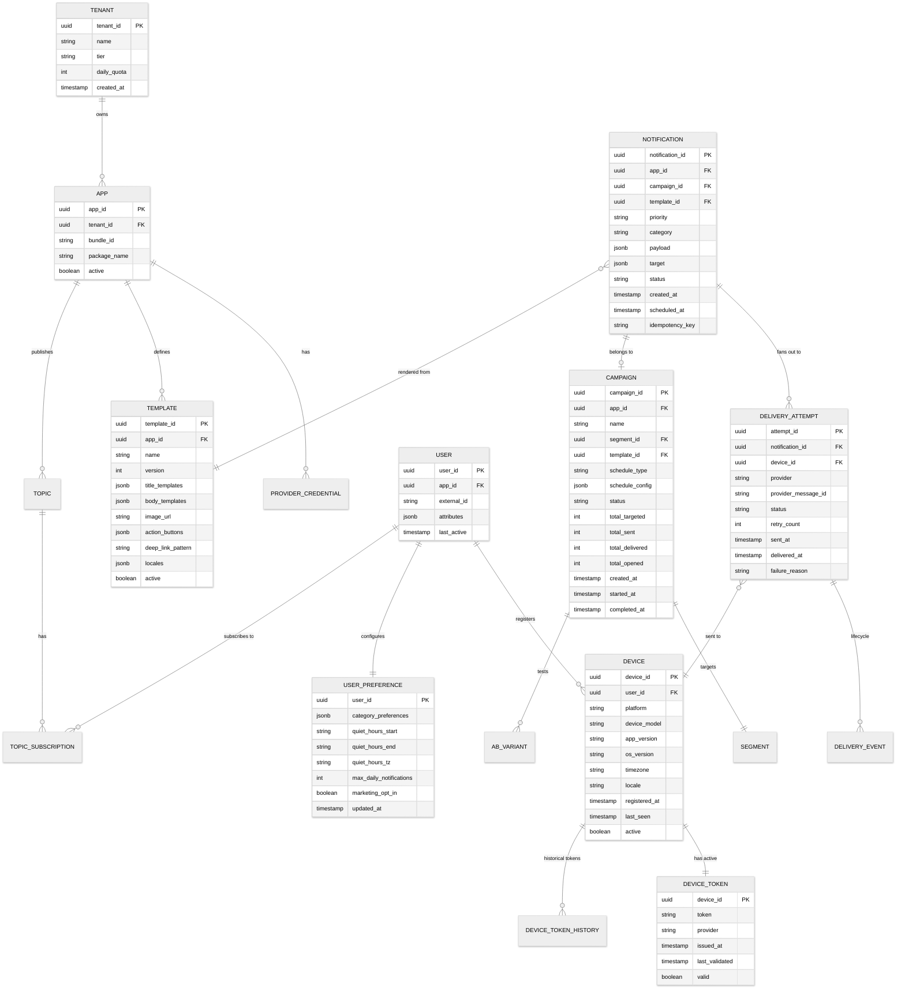

# Low-Level Design — Push Notification System

## 1. Data Model

### 1.1 Entity Relationship Diagram



### 1.2 Schema Details

#### Device Token Registry (Wide-Column Store)

The device registry is the most latency-critical data store. Partitioned by `user_id` for efficient per-user lookups during fan-out.

**Partition Key:** `user_id`
**Sort Key:** `device_id`

| Column | Type | Description |
|---|---|---|
| `user_id` | UUID | Partition key—all devices for a user co-located |
| `device_id` | UUID | Unique device identifier |
| `platform` | String | `ios`, `android`, `huawei`, `web` |
| `token` | String | Provider-specific push token (encrypted at rest) |
| `provider` | String | `apns`, `fcm`, `hms`, `webpush` |
| `app_id` | UUID | Multi-tenant app identifier |
| `token_issued_at` | Timestamp | When the token was last registered/refreshed |
| `token_validated_at` | Timestamp | Last successful send or explicit validation |
| `last_seen` | Timestamp | Last app open or background activity |
| `timezone` | String | IANA timezone (e.g., "America/New_York") |
| `locale` | String | User locale for content selection |
| `app_version` | String | Installed app version |
| `os_version` | String | Device OS version |
| `active` | Boolean | False if token invalidated by provider feedback |

**Secondary Index:** `token` → `device_id` (for provider feedback resolution—provider returns token with error, need to find the device)

**TTL:** Tokens not seen in 180 days auto-expire (FCM marks tokens stale at 270 days; we clean up earlier)

#### Notification Log (Append-Only Event Store)

**Partition Key:** `notification_id`
**Sort Key:** `event_timestamp`

| Column | Type | Description |
|---|---|---|
| `notification_id` | UUID | Unique notification identifier |
| `event_type` | String | `created`, `resolved`, `rendered`, `queued`, `sent`, `delivered`, `opened`, `dismissed`, `failed` |
| `event_timestamp` | Timestamp | Microsecond precision |
| `device_id` | UUID | Null for pre-fan-out events |
| `provider` | String | Null for pre-fan-out events |
| `provider_message_id` | String | Provider's internal tracking ID |
| `metadata` | JSON | Event-specific data (failure reason, retry count, etc.) |

**Time-based partitioning:** Partition by day for efficient TTL-based cleanup (30-day retention for detailed events, 1-year aggregates).

### 1.3 Indexing Strategy

| Store | Index | Purpose |
|---|---|---|
| Device Registry | Primary: `user_id / device_id` | Per-user device lookup during fan-out |
| Device Registry | GSI: `token → device_id` | Reverse lookup for provider feedback (token → device) |
| Device Registry | GSI: `app_id + platform + last_seen` | Segment queries ("all iOS devices active in last 7 days") |
| Notification Log | Primary: `notification_id / timestamp` | Notification lifecycle tracking |
| Notification Log | GSI: `campaign_id + created_at` | Campaign analytics queries |
| User Preferences | Primary: `user_id` | Preference lookup during notification processing |
| Template Store | Primary: `template_id / version` | Template retrieval with version support |

### 1.4 Sharding Strategy

| Store | Shard Key | Strategy | Rationale |
|---|---|---|---|
| **Device Registry** | `user_id` (hash) | Consistent hashing across 256 virtual shards | Even distribution; user's devices always co-located |
| **Notification Log** | `notification_id` (hash) + time partition | Hash partitioning + daily time partitions | Even write distribution; time partitioning for efficient cleanup |
| **User Preferences** | `user_id` (hash) | Same shard map as device registry | Co-location with device data reduces cross-shard lookups |
| **Analytics** | `app_id` + time bucket | Tenant isolation + time-series partitioning | Per-tenant queries don't scan other tenants' data |

---

## 2. API Design

### 2.1 Notification API (REST)

#### Send Notification

```
POST /v1/notifications
Authorization: Bearer {api_key}
Idempotency-Key: {uuid}
Content-Type: application/json

Request:
{
  "target": {
    "type": "user_ids" | "segment" | "topic" | "device_tokens",
    "user_ids": ["user-123", "user-456"],        // for type=user_ids
    "segment_id": "seg-abc",                      // for type=segment
    "topic": "sports_scores",                     // for type=topic
    "tokens": [{"token": "abc", "provider": "apns"}]  // for type=device_tokens
  },
  "content": {
    "template_id": "tmpl-xyz",                    // use template
    "template_data": {"order_id": "1234", "eta": "2pm"},
    // OR inline content:
    "title": "Order Shipped",
    "body": "Your order #1234 is on the way",
    "image_url": "https://cdn.example.com/shipped.png",
    "deep_link": "app://orders/1234",
    "actions": [
      {"id": "track", "title": "Track Package", "deep_link": "app://tracking/1234"},
      {"id": "dismiss", "title": "Dismiss"}
    ]
  },
  "options": {
    "priority": "high" | "normal" | "low",
    "category": "order_updates",
    "collapse_key": "order-1234-status",
    "ttl_seconds": 86400,
    "silent": false,
    "data_payload": {"sync_key": "orders", "version": 42},
    "schedule": {
      "send_at": "2026-03-15T10:00:00Z",         // specific time
      "timezone_aware": true,                      // send at 10 AM local time per user
      "respect_quiet_hours": true
    },
    "ab_test": {
      "variants": [
        {"weight": 50, "content": {"title": "Flash Sale!"}},
        {"weight": 50, "content": {"title": "Limited Time Offer!"}}
      ]
    }
  }
}

Response (202 Accepted):
{
  "notification_id": "notif-789",
  "status": "accepted",
  "estimated_recipients": 2,
  "tracking_url": "/v1/notifications/notif-789/status"
}
```

#### Get Notification Status

```
GET /v1/notifications/{notification_id}/status

Response:
{
  "notification_id": "notif-789",
  "status": "completed",
  "created_at": "2026-03-15T10:00:00Z",
  "completed_at": "2026-03-15T10:00:02Z",
  "stats": {
    "targeted": 2,
    "sent": 2,
    "delivered": 2,
    "opened": 1,
    "failed": 0,
    "suppressed": 0
  },
  "per_provider": {
    "apns": {"sent": 1, "delivered": 1, "failed": 0},
    "fcm": {"sent": 1, "delivered": 1, "failed": 0}
  }
}
```

### 2.2 Device Token API

#### Register Device Token

```
POST /v1/devices
Authorization: Bearer {user_token}

Request:
{
  "user_id": "user-123",
  "platform": "ios",
  "token": "apns-device-token-abc123...",
  "app_version": "4.2.1",
  "os_version": "18.3",
  "device_model": "iPhone 16",
  "timezone": "America/New_York",
  "locale": "en-US"
}

Response (201 Created):
{
  "device_id": "dev-456",
  "registered_at": "2026-03-15T10:00:00Z"
}
```

#### Unregister Device

```
DELETE /v1/devices/{device_id}
Authorization: Bearer {user_token}

Response: 204 No Content
```

### 2.3 User Preferences API

#### Update Preferences

```
PUT /v1/users/{user_id}/preferences
Authorization: Bearer {user_token}

Request:
{
  "categories": {
    "order_updates": {"push": true, "email": true},
    "marketing": {"push": false, "email": true},
    "security_alerts": {"push": true, "email": true}
  },
  "quiet_hours": {
    "enabled": true,
    "start": "22:00",
    "end": "08:00",
    "timezone": "America/New_York"
  },
  "max_daily_push": 20
}

Response: 200 OK
```

### 2.4 Campaign API

#### Create Campaign

```
POST /v1/campaigns
Authorization: Bearer {api_key}

Request:
{
  "name": "Spring Sale 2026",
  "segment_id": "seg-spring-target",
  "template_id": "tmpl-spring-sale",
  "template_data": {"discount": "30%", "code": "SPRING30"},
  "schedule": {
    "type": "timezone_wave",
    "local_time": "10:00",
    "start_date": "2026-03-20",
    "end_date": "2026-03-20"
  },
  "pacing": {
    "max_per_second": 100000,
    "ramp_up_minutes": 10
  },
  "ab_test": {
    "enabled": true,
    "variants": [
      {"name": "urgent", "weight": 50, "template_data": {"headline": "Hurry! 30% Off"}},
      {"name": "casual", "weight": 50, "template_data": {"headline": "Spring Savings Inside"}}
    ],
    "winner_metric": "open_rate",
    "auto_select_after_hours": 4
  }
}

Response (201 Created):
{
  "campaign_id": "camp-101",
  "estimated_audience": 12500000,
  "scheduled_waves": 24,
  "status": "scheduled"
}
```

### 2.5 API Rate Limits

| Endpoint | Free Tier | Growth Tier | Enterprise |
|---|---|---|---|
| `POST /v1/notifications` | 100/min | 10K/min | 500K/min |
| `POST /v1/campaigns` | 10/day | 100/day | Unlimited |
| `GET /v1/notifications/*/status` | 1K/min | 50K/min | 500K/min |
| `POST /v1/devices` | 1K/min | 50K/min | 500K/min |
| `GET /v1/analytics/*` | 100/min | 5K/min | 50K/min |

### 2.6 Webhook Callback Contract

```
POST {customer_webhook_url}
Content-Type: application/json
X-Signature: sha256={hmac_signature}

{
  "event_type": "notification.delivered",
  "notification_id": "notif-789",
  "device_id": "dev-456",
  "provider": "apns",
  "provider_message_id": "apns-uuid-123",
  "timestamp": "2026-03-15T10:00:01Z",
  "metadata": {
    "latency_ms": 350
  }
}
```

---

## 3. Core Algorithms

### 3.1 Fan-Out Coordinator

The fan-out coordinator takes a notification targeting N users and expands it into individual device-level delivery tasks, partitioned by provider for efficient batching.

```
FUNCTION fan_out(notification):
    // Step 1: Resolve target to user list
    IF notification.target.type == "user_ids":
        user_ids = notification.target.user_ids
    ELSE IF notification.target.type == "segment":
        user_ids = segmentation_engine.evaluate(notification.target.segment_id)
    ELSE IF notification.target.type == "topic":
        user_ids = topic_store.get_subscribers(notification.target.topic)

    // Step 2: Partition users into chunks for parallel processing
    chunks = partition(user_ids, chunk_size=5000)

    FOR EACH chunk IN chunks (PARALLEL):
        // Step 3: Batch resolve devices
        devices = device_registry.batch_get(chunk)

        // Step 4: Filter by preferences and state
        eligible_devices = []
        FOR EACH device IN devices:
            prefs = preference_cache.get(device.user_id)

            IF NOT device.active:
                SKIP  // token invalidated
            IF NOT prefs.is_category_enabled(notification.category):
                record_suppression(notification.id, device.id, "user_opted_out")
                SKIP
            IF prefs.in_quiet_hours(device.timezone, NOW):
                IF notification.priority != "high":
                    schedule_for_after_quiet_hours(notification, device)
                    SKIP
            IF frequency_limiter.exceeds_cap(device.user_id):
                record_suppression(notification.id, device.id, "frequency_cap")
                SKIP

            eligible_devices.APPEND(device)

        // Step 5: Group by provider and enqueue
        provider_batches = group_by(eligible_devices, key=device.provider)
        FOR EACH provider, batch IN provider_batches:
            provider_queue[provider].enqueue_batch(
                notification_id=notification.id,
                payload=notification.rendered_payload,
                devices=batch
            )

    // Step 6: Record fan-out completion
    notification_log.append(notification.id, "fan_out_complete", {
        total_targeted: LEN(user_ids),
        total_eligible: total_eligible_count,
        total_suppressed: total_suppressed_count,
        per_provider: provider_counts
    })
```

**Complexity:** O(N) where N = number of targeted devices, parallelized across worker count.

### 3.2 Provider Rate Limiter (Token Bucket with Per-Provider Limits)

Each provider adapter uses a distributed token bucket to respect provider rate limits while maximizing throughput.

```
CLASS ProviderRateLimiter:
    FUNCTION init(provider, config):
        // APNs: ~100K requests/sec per connection × connection count
        // FCM: project-level quota (varies, typically 600K/min for data messages)
        // HMS: similar to FCM
        this.bucket_capacity = config.max_burst
        this.refill_rate = config.sustained_rate_per_sec
        this.tokens = this.bucket_capacity
        this.last_refill = NOW()
        this.backoff_until = null

    FUNCTION acquire(count=1):
        // Check if in backoff from provider throttle response
        IF this.backoff_until AND NOW() < this.backoff_until:
            RETURN {allowed: false, retry_after: this.backoff_until - NOW()}

        // Refill tokens based on elapsed time
        elapsed = NOW() - this.last_refill
        new_tokens = elapsed.seconds * this.refill_rate
        this.tokens = MIN(this.bucket_capacity, this.tokens + new_tokens)
        this.last_refill = NOW()

        // Try to consume
        IF this.tokens >= count:
            this.tokens -= count
            RETURN {allowed: true}
        ELSE:
            wait_time = (count - this.tokens) / this.refill_rate
            RETURN {allowed: false, retry_after: wait_time}

    FUNCTION on_provider_throttle(retry_after_header):
        // Provider explicitly told us to slow down
        this.backoff_until = NOW() + retry_after_header
        // Reduce refill rate by 50% for adaptive throttling
        this.refill_rate = this.refill_rate * 0.5
        // Schedule rate recovery after backoff period
        schedule_after(retry_after_header * 2, this.recover_rate)

    FUNCTION recover_rate():
        // Gradually restore to configured rate
        this.refill_rate = MIN(this.refill_rate * 1.25, config.sustained_rate_per_sec)
        IF this.refill_rate < config.sustained_rate_per_sec:
            schedule_after(60 seconds, this.recover_rate)
```

### 3.3 Token Lifecycle Manager

Handles the complex lifecycle of device tokens: registration, validation, staleness detection, and cleanup.

```
FUNCTION process_token_registration(user_id, platform, new_token, device_info):
    existing_device = device_registry.find_by_token(new_token)

    IF existing_device AND existing_device.user_id == user_id:
        // Same user, same token — just update metadata
        device_registry.update_metadata(existing_device.id, device_info)
        RETURN existing_device.id

    IF existing_device AND existing_device.user_id != user_id:
        // Token transferred to different user (device sold/wiped, new login)
        // Deactivate old association, create new one
        device_registry.deactivate(existing_device.id, reason="token_transferred")
        analytics.record("token_transfer", {from: existing_device.user_id, to: user_id})

    // Check if user already has a device with same platform + device_model
    existing_same_model = device_registry.find_by_user_platform_model(
        user_id, platform, device_info.model
    )
    IF existing_same_model:
        // Token rotated on same device (app reinstall, OS update)
        device_registry.update_token(existing_same_model.id, new_token)
        RETURN existing_same_model.id

    // New device registration
    device_id = generate_uuid()
    device_registry.insert({
        device_id: device_id,
        user_id: user_id,
        platform: platform,
        token: new_token,
        provider: platform_to_provider(platform),
        token_issued_at: NOW(),
        last_seen: NOW(),
        active: true,
        ...device_info
    })
    RETURN device_id


FUNCTION process_provider_feedback(provider, token, error_code):
    device = device_registry.find_by_token(token)
    IF NOT device:
        RETURN  // token already cleaned up

    SWITCH error_code:
        CASE "INVALID_TOKEN", "UNREGISTERED", "NOT_REGISTERED":
            // App uninstalled or token permanently invalid
            device_registry.deactivate(device.id, reason="provider_invalidated")
            analytics.record("token_invalidated", {
                device_id: device.id,
                provider: provider,
                reason: error_code,
                token_age_days: days_since(device.token_issued_at)
            })

        CASE "DEVICE_NOT_REGISTERED":
            // HMS-specific: device not registered with HMS
            device_registry.deactivate(device.id, reason="hms_not_registered")

        CASE "MESSAGE_RATE_EXCEEDED":
            // Too many messages to this device — back off, don't deactivate
            rate_limiter.apply_per_device_backoff(device.id, duration=300)

        CASE "PAYLOAD_TOO_LARGE":
            // Our fault — log for debugging, don't affect token
            log.error("Payload too large", {device_id: device.id, provider: provider})


FUNCTION run_token_cleanup_sweep():
    // Periodic job: find and deactivate stale tokens
    stale_threshold = NOW() - 90 DAYS  // tokens not seen in 90 days
    warning_threshold = NOW() - 60 DAYS

    stale_tokens = device_registry.scan(
        filter: active == true AND last_seen < stale_threshold
    )

    FOR EACH device IN stale_tokens:
        device_registry.deactivate(device.id, reason="stale_90_days")

    warning_tokens = device_registry.scan(
        filter: active == true AND last_seen < warning_threshold AND last_seen >= stale_threshold
    )

    metrics.gauge("tokens.stale_warning", LEN(warning_tokens))
    metrics.gauge("tokens.deactivated_sweep", LEN(stale_tokens))
```

### 3.4 Timezone-Aware Scheduling

```
FUNCTION schedule_timezone_wave(campaign):
    // Campaign wants to deliver at 10:00 AM local time for each user
    target_local_time = campaign.schedule.local_time  // "10:00"

    // Get all unique timezones in target audience
    timezones = segmentation_engine.get_audience_timezones(campaign.segment_id)
    // e.g., ["Pacific/Auckland", "Asia/Tokyo", ..., "Pacific/Honolulu"]

    FOR EACH tz IN timezones (sorted by UTC offset, earliest first):
        // Calculate UTC time for target local time in this timezone
        utc_send_time = convert_to_utc(target_local_time, tz, campaign.schedule.date)

        // Create a scheduled task for this timezone wave
        scheduler.enqueue_at(utc_send_time, {
            campaign_id: campaign.id,
            timezone: tz,
            action: "execute_wave"
        })

    // The scheduler fires each wave at the right UTC time
    // Each wave only processes users in that timezone
    // Result: all users receive at 10:00 AM their local time

FUNCTION execute_wave(campaign_id, timezone):
    campaign = campaign_store.get(campaign_id)

    // Narrow segment to users in this timezone
    users = segmentation_engine.evaluate(
        campaign.segment_id,
        additional_filter: {timezone: timezone}
    )

    // Apply quiet hours check (should be outside quiet hours by design,
    // but some users may have custom quiet hours)
    eligible = filter_quiet_hours(users, NOW())

    // Fan out
    fan_out({
        notification_id: generate_uuid(),
        campaign_id: campaign_id,
        target: {type: "user_ids", user_ids: eligible},
        content: campaign.rendered_content,
        options: campaign.options
    })
```

### 3.5 A/B Test Variant Assignment

```
FUNCTION assign_ab_variant(notification, user_id, variants):
    // Deterministic assignment: same user always gets same variant
    // Uses consistent hashing so variant assignment is stable even if
    // variant weights change slightly
    hash_value = murmurhash3(notification.ab_test_id + user_id) MOD 10000

    cumulative_weight = 0
    FOR EACH variant IN variants:
        cumulative_weight += variant.weight * 100  // weight is percentage
        IF hash_value < cumulative_weight:
            RETURN variant

    // Fallback (should not reach here if weights sum to 100)
    RETURN variants[LAST]
```

---

## 4. Provider Payload Mapping

### 4.1 Unified-to-Provider Payload Translation

The system stores notifications in a unified format and translates to provider-specific payloads at send time:

| Unified Field | APNs Mapping | FCM Mapping | HMS Mapping | Web Push Mapping |
|---|---|---|---|---|
| `title` | `aps.alert.title` | `notification.title` | `notification.title` | Encrypted payload `title` |
| `body` | `aps.alert.body` | `notification.body` | `notification.body` | Encrypted payload `body` |
| `image_url` | `aps.mutable-content` + extension | `notification.image` | `notification.image` | Encrypted payload `image` |
| `deep_link` | `aps.url-args` or custom data | `data.deep_link` | `click_action.intent` | Encrypted payload `data.url` |
| `actions` | `aps.category` (predefined) | `notification.click_action` | `click_action` | Encrypted payload `actions[]` |
| `collapse_key` | `apns-collapse-id` header | `collapse_key` | `collapse_key` | `Topic` header |
| `ttl` | `apns-expiration` header | `android.ttl` | `ttl` | `TTL` header |
| `priority` | `apns-priority` (5 or 10) | `android.priority` (normal/high) | `urgency` (normal/high) | `Urgency` header |
| `silent` | `aps.content-available: 1` | `data` only (no `notification`) | `data` only | No display, data only |
| `badge_count` | `aps.badge` | `notification.notification_count` | `notification.badge` | N/A |
| `sound` | `aps.sound` | `notification.sound` | `notification.default_sound` | N/A (browser default) |
| `data_payload` | Custom keys in payload root | `data` object | `data` field | Encrypted in payload |

---

*Previous: [High-Level Design](./02-high-level-design.md) | Next: [Deep Dive & Bottlenecks ->](./04-deep-dive-and-bottlenecks.md)*
