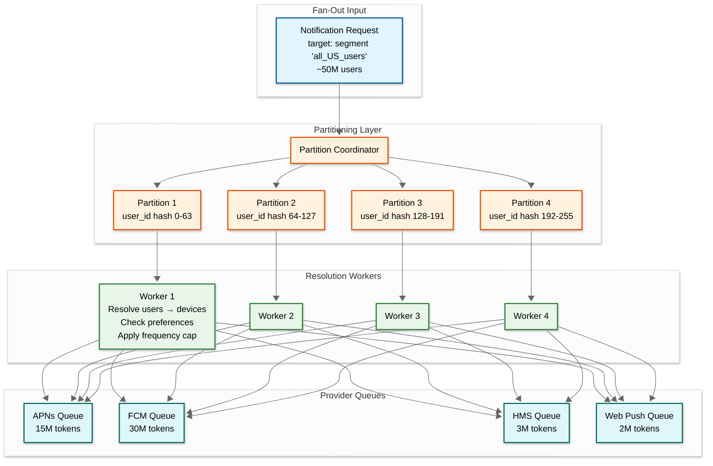
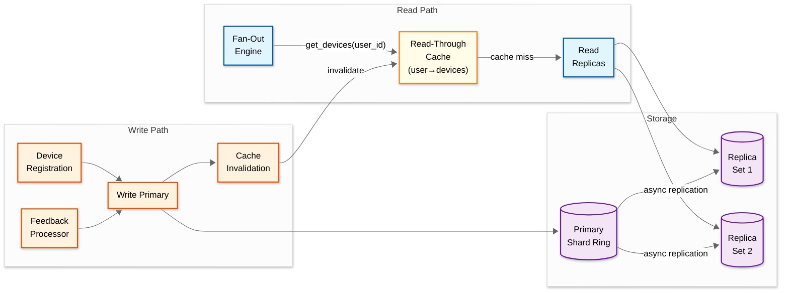

# Deep Dive & Bottlenecks — Push Notification System

## 1. Critical Component Deep Dives

### 1.1 Provider Adapter Layer (APNs Focus)

#### Why This Is Critical

The provider adapter layer is the final hop before notifications leave your system. It directly interacts with external services (APNs, FCM, HMS, Web Push) that have strict protocols, rate limits, and failure modes. A poorly implemented adapter layer can get your provider credentials revoked (APNs treats excessive connection churn as a DoS attack), waste quota on stale tokens, or create invisible delivery failures that silently degrade notification reach.

#### How It Works Internally

**APNs HTTP/2 Adapter:**

APNs requires persistent HTTP/2 connections with multiplexed streams. Each connection supports hundreds of concurrent requests. The adapter maintains a pool of long-lived connections:

```
CLASS APNsAdapter:
    FUNCTION init(config):
        this.connections = ConnectionPool(
            size: config.connection_count,          // 500-2000 connections
            max_streams_per_conn: 500,              // HTTP/2 concurrent streams
            target_host: "api.push.apple.com:443",  // production endpoint
            tls_certificate: config.apns_cert,       // or JWT auth
            idle_timeout: 60 minutes,
            health_check_interval: 30 seconds
        )
        this.rate_limiter = ProviderRateLimiter("apns", config.rate_limit)
        this.jwt_manager = APNsJWTManager(config.key_id, config.team_id, config.private_key)

    FUNCTION send(device_token, payload, options):
        // Acquire rate limit token
        rate_result = this.rate_limiter.acquire()
        IF NOT rate_result.allowed:
            RETURN {status: "rate_limited", retry_after: rate_result.retry_after}

        // Build APNs request
        headers = {
            ":method": "POST",
            ":path": "/3/device/" + device_token,
            "authorization": "bearer " + this.jwt_manager.get_token(),
            "apns-topic": options.bundle_id,
            "apns-push-type": options.silent ? "background" : "alert",
            "apns-priority": options.priority == "high" ? "10" : "5",
            "apns-expiration": options.ttl_timestamp,
            "apns-collapse-id": options.collapse_key
        }

        // Send via connection pool
        conn = this.connections.acquire()
        TRY:
            response = conn.send_request(headers, payload)

            IF response.status == 200:
                RETURN {
                    status: "accepted",
                    provider_id: response.headers["apns-id"]
                }
            ELSE IF response.status == 410:
                // Device token is no longer valid (uninstalled)
                EMIT feedback_event("UNREGISTERED", device_token)
                RETURN {status: "invalid_token"}
            ELSE IF response.status == 429:
                // Rate limited by APNs
                this.rate_limiter.on_provider_throttle(
                    response.headers["retry-after"]
                )
                RETURN {status: "throttled", retry_after: response.headers["retry-after"]}
            ELSE:
                RETURN {status: "failed", reason: response.body.reason}
        CATCH ConnectionError:
            conn.mark_unhealthy()
            this.connections.release_and_replace(conn)
            RETURN {status: "connection_error", retryable: true}
        FINALLY:
            this.connections.release(conn)
```

**FCM Multicast Adapter:**

FCM's HTTP v1 API supports sending to 500 tokens in a single multicast request, dramatically reducing HTTP overhead for mass sends:

```
CLASS FCMAdapter:
    FUNCTION send_batch(tokens, payload, options):
        // FCM v1 uses OAuth 2.0 for auth
        access_token = this.oauth_manager.get_access_token()

        // Build multicast request (max 500 tokens)
        batches = partition(tokens, 500)
        results = []

        FOR EACH batch IN batches (PARALLEL, max_concurrency=100):
            request_body = {
                "message": {
                    "notification": {
                        "title": payload.title,
                        "body": payload.body,
                        "image": payload.image_url
                    },
                    "data": payload.data_payload,
                    "android": {
                        "priority": options.priority,
                        "ttl": str(options.ttl) + "s",
                        "collapse_key": options.collapse_key,
                        "notification": {
                            "click_action": payload.deep_link
                        }
                    },
                    "tokens": batch
                }
            }

            response = http_post(
                "https://fcm.googleapis.com/v1/projects/{project}/messages:send",
                headers: {"Authorization": "Bearer " + access_token},
                body: request_body
            )

            // Process per-token results
            FOR i, token_result IN response.responses:
                IF token_result.error:
                    IF token_result.error.code == "UNREGISTERED":
                        EMIT feedback_event("UNREGISTERED", batch[i])
                    ELSE IF token_result.error.code == "QUOTA_EXCEEDED":
                        this.rate_limiter.on_provider_throttle(60)
                results.APPEND(token_result)

        RETURN results
```

#### Failure Modes

| Failure | Detection | Impact | Recovery |
|---|---|---|---|
| **APNs connection reset** | TCP RST or HTTP/2 GOAWAY | In-flight requests on that connection fail | Connection pool replaces connection; failed requests re-queued |
| **APNs certificate expiry** | 403 response with "ExpiredProviderToken" | All sends fail | Alert on-call; JWT auto-rotation prevents this for token-based auth |
| **FCM quota exceeded** | 429 response or QUOTA_EXCEEDED error | Sends rejected until quota resets | Exponential backoff; queue buffering; alert if sustained |
| **Provider outage** | Sustained 5xx responses or connection timeouts | All sends to that provider fail | Queue messages; alert; wait for recovery; do not flood provider during recovery |
| **DNS resolution failure** | Connection establishment timeout | Cannot reach provider | Cache DNS results; use multiple DNS resolvers; fall back to cached IPs |
| **TLS handshake failure** | SSL error on connection | New connections fail; existing ones still work | Retry with backoff; check certificate validity; alert for manual intervention |

---

### 1.2 Fan-Out Engine

#### Why This Is Critical

The fan-out engine transforms a single notification request targeting "all users in segment X" into millions of individual device-level delivery tasks. This is the primary scalability bottleneck: a single campaign can generate 500 million provider API calls. The fan-out must be fast (complete within minutes), reliable (no silent drops), and controllable (support pacing to avoid overwhelming providers).

#### How It Works Internally



The fan-out process follows these stages:

1. **Partition Assignment:** The coordinator partitions the target audience by user_id hash across available worker pools. Each partition processes independently, enabling horizontal scaling.

2. **Device Resolution:** Workers read device tokens for their partition from the device registry cache. This is the most I/O-intensive step—each user lookup returns 1-4 devices.

3. **Preference Filtering:** For each device, check user preferences (category opt-in, quiet hours), frequency caps, and notification deduplication. ~10-20% of devices are typically filtered out.

4. **Provider Routing:** Group eligible devices by provider and enqueue into provider-specific queues with the rendered payload.

5. **Progress Tracking:** Workers periodically checkpoint progress (partition X processed 500K of 12.5M users) to enable resume-on-failure.

#### Failure Modes

| Failure | Impact | Recovery |
|---|---|---|
| **Worker crash mid-partition** | Partial fan-out—some users get notification, others don't | Checkpoint-based resume: new worker picks up from last checkpoint; dedup prevents double-send |
| **Device registry timeout** | Workers stall waiting for token lookups | Circuit breaker: fall back to cached results (may include some stale tokens); alert |
| **Queue overflow** | Provider queue fills up faster than consumers can drain | Backpressure: fan-out coordinator slows down token enqueue rate; campaign pacing kicks in |
| **Memory pressure** | Worker holding too many tokens in memory during partition processing | Streaming resolution: process tokens in pages of 5,000; never hold full partition in memory |

---

### 1.3 Device Token Registry

#### Why This Is Critical

The device token registry is on the hot path of every notification delivery. At 2M notifications/sec peak, the registry handles 2M+ read QPS (token lookups) plus continuous writes from registrations, feedback processing, and metadata updates. A 10ms P99 read latency target means every millisecond of regression directly impacts delivery latency. Additionally, token data quality directly determines delivery success rates—a registry full of stale tokens wastes provider quota and triggers throttling.

#### How It Works Internally



**CQRS Pattern:** The registry uses Command Query Responsibility Segregation:
- **Read path:** Fan-out engine reads from a distributed cache backed by read replicas. Cache key is `user_id`, value is the list of active devices. Cache TTL is 5 minutes with write-through invalidation on token changes.
- **Write path:** Registration and feedback writes go to the primary shard ring. After write, the corresponding cache entry is invalidated to ensure next read picks up the change.

**Cache Hit Rate Target:** >99% — with 500M daily active users, most users' device lists are cached from recent sends. Cache miss (cold start after restart or new user) falls through to replica.

#### Failure Modes

| Failure | Detection | Impact | Recovery |
|---|---|---|---|
| **Cache failure** | Miss rate spikes above 50% | Read latency increases 10x as all reads hit replicas | Replicas absorb load (sized for cache-miss scenarios); cache rebuilds automatically |
| **Primary shard failure** | Write errors | Token registrations and feedback updates queue up | Failover to shard replica promoted to primary; queued writes replay |
| **Replication lag** | Replica lag metric > 5 seconds | Recently registered tokens not found during fan-out | Acceptable: new tokens are not critical for in-flight campaigns; next send cycle will find them |
| **Stale cache entry** | Delivery to deactivated token | Wasted send + provider error | Provider feedback loop catches this; cache invalidated on feedback processing; TTL provides fallback cleanup |

---

## 2. Concurrency & Race Conditions

### 2.1 Token Registration Race

**Scenario:** User installs app on new phone while old phone's token hasn't been deactivated. Two registration requests arrive nearly simultaneously.

```
Timeline:
T1: New phone registers token "new-abc"
T2: Old phone sends heartbeat, refreshing token "old-xyz"
T3: Both writes interleave in device registry

Risk: User ends up with duplicate device entries, receiving double notifications
```

**Solution:** Use optimistic concurrency with user_id-scoped locking:

```
FUNCTION register_device_with_lock(user_id, device_info):
    lock = distributed_lock.acquire("device_reg:" + user_id, ttl=5s)
    TRY:
        existing_devices = device_registry.get_devices(user_id)

        // Check for same device (by model + platform) with different token
        match = find_same_device(existing_devices, device_info)
        IF match:
            // Token rotation on same device — update, don't create
            device_registry.update_token(match.id, device_info.token)
        ELSE:
            // New device — create new entry
            device_registry.insert(device_info)

            // Enforce max devices per user (prevent unbounded growth)
            IF LEN(existing_devices) + 1 > MAX_DEVICES_PER_USER:
                // Deactivate oldest device
                oldest = sort_by_last_seen(existing_devices).first()
                device_registry.deactivate(oldest.id, reason="max_devices_exceeded")
    FINALLY:
        lock.release()
```

### 2.2 Duplicate Notification Send Race

**Scenario:** A notification is in the fan-out queue. The fan-out worker crashes and restarts, re-processing the same partition. Some devices receive the notification twice.

**Solution:** Idempotent delivery with send-tracking:

```
FUNCTION send_with_dedup(notification_id, device_id, provider_adapter):
    dedup_key = notification_id + ":" + device_id
    already_sent = dedup_cache.set_if_absent(dedup_key, ttl=24h)

    IF already_sent:
        metrics.increment("notification.dedup_prevented")
        RETURN {status: "deduplicated"}

    result = provider_adapter.send(...)

    IF result.status == "failed" AND result.retryable:
        // Remove dedup key so retry can proceed
        dedup_cache.delete(dedup_key)

    RETURN result
```

### 2.3 Preference Update During Fan-Out Race

**Scenario:** User opts out of marketing notifications while a marketing campaign is mid-fan-out. The user's partition hasn't been processed yet.

**Risk:** User receives a notification they opted out of—a potential compliance violation.

**Solution:** Preference check happens at the latest possible moment (during fan-out resolution, not at campaign scheduling). Since the fan-out processes users in partitioned chunks, the preference is checked when the user's partition is processed. If the opt-out was recorded before the partition processes, the user is filtered out. A small window (seconds) exists where the preference update hasn't propagated—this is acceptable for marketing (not for regulatory consent withdrawal, which has stricter requirements handled separately).

### 2.4 Campaign Cancel During Fan-Out Race

**Scenario:** Campaign manager cancels a campaign that's already mid-fan-out. Some devices have already received the notification.

**Solution:** Fan-out workers check campaign status at partition boundaries:

```
FUNCTION process_partition(campaign_id, partition):
    FOR EACH chunk IN partition.chunks:
        // Check campaign status before each chunk
        campaign = campaign_store.get(campaign_id)
        IF campaign.status == "cancelled":
            log.info("Campaign cancelled mid-fanout", {
                campaign_id: campaign_id,
                partition: partition.id,
                progress: chunk.offset
            })
            RETURN "cancelled"

        process_chunk(chunk)  // resolve + filter + enqueue
```

---

## 3. Bottleneck Analysis

### 3.1 Bottleneck: Device Registry Read Throughput

**Problem:** At 2M notifications/sec, each requiring 1+ device registry lookups, the registry faces 2M+ read QPS. Even with caching (99% hit rate), 1% miss rate = 20K reads/sec hitting the storage backend.

**Impact:** If registry reads slow down by even 5ms, it adds 5ms × 2M = latency amplification across the entire pipeline.

**Mitigation:**

| Strategy | Effect |
|---|---|
| **Multi-tier caching** | L1: in-process cache (10K entries, 30s TTL) → L2: distributed cache cluster (500M entries, 5min TTL) → L3: read replicas |
| **Cache warming** | Pre-warm cache during campaign fan-out initiation by pre-fetching device lists for the target segment |
| **Read replicas** | Scale read replicas independently of write primary; 5-10 replicas per shard |
| **Batch reads** | Fan-out workers read devices in batches of 1,000 user_ids per request, reducing round trips |
| **Locality-aware routing** | Route fan-out workers to cache shards co-located in the same availability zone |

### 3.2 Bottleneck: Provider Connection Saturation

**Problem:** APNs supports ~100K requests/sec per HTTP/2 connection (theoretical with 500 concurrent streams × 200ms average response time). At 800K APNs sends/sec peak, you need ~8-16 connections minimum. But connection establishment is expensive (TLS handshake + HTTP/2 setup = 500ms), and APNs treats excessive new connections as suspicious.

**Impact:** If connections drop below the needed count during peak, sends queue up, latency increases, and the backlog grows faster than it drains.

**Mitigation:**

| Strategy | Effect |
|---|---|
| **Over-provision connections** | Maintain 2x the steady-state connection count (1,000+) to absorb burst without new connections |
| **Connection pre-warming** | Establish connections during off-peak hours; keep alive with periodic empty frames |
| **Connection affinity** | Pin device token ranges to specific connections to improve HTTP/2 stream reuse |
| **Multiple provider endpoints** | APNs has regional endpoints; distribute connections across endpoints for geographic locality |
| **Graceful connection rotation** | Rotate connections every 12 hours (before provider-side idle timeout) by draining in-flight requests then replacing |

### 3.3 Bottleneck: Campaign Segment Evaluation

**Problem:** A segment definition like "users in US AND last_active within 7 days AND app_version >= 4.0" requires scanning or querying a user attribute store with 500M users. Full table scans are O(N) and impractical at 2M+ QPS.

**Impact:** Segment evaluation for a large campaign can take minutes if not pre-computed, delaying campaign start and creating a traffic spike when the backlog drains.

**Mitigation:**

| Strategy | Effect |
|---|---|
| **Pre-computed segment materialization** | Periodically (every 15 min) materialize high-frequency segments into user_id lists stored in object storage |
| **Incremental segment updates** | Track user attribute changes via CDC (change data capture); incrementally add/remove from materialized segments |
| **Bitmap indexes** | Store boolean attributes (country=US, active_last_7d) as compressed bitmaps; AND/OR operations are O(n/64) with SIMD acceleration |
| **Approximate count first** | Before full evaluation, estimate segment size with HyperLogLog; if too large (>100M), require campaign manager confirmation |
| **Streaming evaluation** | For real-time segments, evaluate membership at fan-out time per user rather than pre-computing the full list |

### 3.4 Bottleneck: Feedback Processing Lag

**Problem:** APNs and FCM return delivery feedback (invalid tokens, throttle signals) inline in the HTTP response. At 2M sends/sec, the feedback processor must handle 2M events/sec. If feedback processing lags, stale tokens aren't cleaned up promptly, leading to wasted sends that compound the lag.

**Impact:** A negative feedback loop: stale tokens → wasted sends → more feedback → more lag → more stale tokens.

**Mitigation:**

| Strategy | Effect |
|---|---|
| **Separate feedback pipeline** | Feedback events flow through their own queue, not the send pipeline; independently scalable |
| **Batch device registry updates** | Instead of individual deactivation per invalid token, batch updates (1,000 deactivations per write) |
| **Priority feedback processing** | Process UNREGISTERED/INVALID_TOKEN at highest priority (removes wasted sends); lower priority for delivery confirmations |
| **Feedback rate metrics** | Alert when invalid token rate exceeds 5% of sends—indicates a credential issue or mass uninstall event |

---

*Previous: [Low-Level Design](./03-low-level-design.md) | Next: [Scalability & Reliability ->](./05-scalability-and-reliability.md)*
