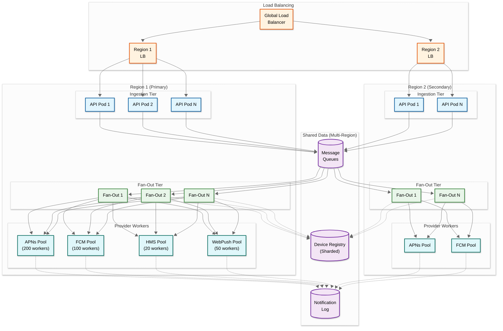
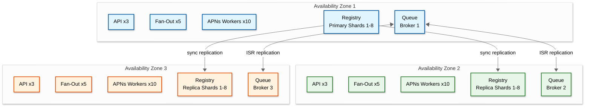

# Scalability & Reliability — Push Notification System

## 1. Scalability

### 1.1 Scaling Dimensions

| Component | Scaling Axis | Strategy | Trigger |
|---|---|---|---|
| **Ingestion API** | Horizontal | Stateless API servers behind load balancer; auto-scale on request rate | CPU > 60% or request queue depth > 1,000 |
| **Fan-Out Workers** | Horizontal | Add worker instances; each processes independent partitions | Queue depth > 100K messages or fan-out latency > target |
| **Provider Adapter Pools** | Per-provider horizontal | Independently scale APNs, FCM, HMS, Web Push worker pools | Per-provider queue depth or provider throttle rate |
| **Device Registry Cache** | Horizontal + vertical | Add cache nodes (horizontal); increase memory per node for hot datasets (vertical) | Cache miss rate > 2% or P99 latency > 10ms |
| **Device Registry Store** | Horizontal | Add shards to consistent hash ring; split hot shards | Shard CPU > 70% or storage > 80% capacity |
| **Notification Log** | Horizontal + time-based | Hash partition by notification_id; time-partition by day for efficient cleanup | Write throughput > 80% of shard capacity |
| **Analytics Pipeline** | Horizontal | Increase stream processor partitions; scale independently of send pipeline | Processing lag > 5 minutes |
| **Segmentation Engine** | Vertical + pre-computation | Larger instances for bitmap operations; pre-compute popular segments | Segment evaluation time > 30 seconds |

### 1.2 Horizontal Scaling Architecture



### 1.3 Auto-Scaling Policies

| Component | Scale-Out Trigger | Scale-In Trigger | Min Instances | Max Instances | Cool-Down |
|---|---|---|---|---|---|
| **Ingestion API** | CPU > 60% for 2 min | CPU < 30% for 10 min | 10 | 200 | 3 min |
| **Fan-Out Workers** | Queue depth > 50K for 1 min | Queue depth < 5K for 5 min | 20 | 500 | 2 min |
| **APNs Workers** | APNs queue > 100K for 1 min | Queue < 10K for 5 min | 50 | 500 | 2 min |
| **FCM Workers** | FCM queue > 100K for 1 min | Queue < 10K for 5 min | 30 | 300 | 2 min |
| **HMS Workers** | HMS queue > 50K for 2 min | Queue < 5K for 5 min | 5 | 50 | 3 min |
| **Web Push Workers** | Web queue > 50K for 2 min | Queue < 5K for 5 min | 10 | 100 | 3 min |

### 1.4 Database Scaling Strategy

#### Device Registry Scaling

| Scale Level | Strategy | Capacity |
|---|---|---|
| **< 100M tokens** | Single primary + 3 read replicas with distributed cache | Sufficient for most applications |
| **100M–1B tokens** | 16-shard consistent hash ring, each shard with primary + 2 replicas | ~60M tokens per shard, ~125K reads/sec per shard |
| **1B–5B tokens** | 64-shard ring with cross-region replication; dedicated cache cluster per region | ~80M tokens per shard |
| **> 5B tokens** | 256-shard ring with tiered storage (hot/warm/cold); cold tokens moved to object storage | Active tokens in fast storage; dormant tokens in cost-efficient storage |

#### Notification Log Scaling

The notification log is append-only and grows at ~150 TB per 30-day retention window. Scaling strategy:

1. **Time-based partitioning:** Each day gets its own partition set, enabling efficient TTL-based deletion (drop entire daily partition)
2. **Hash partitioning within day:** Partition by `notification_id` hash for even write distribution within each day's partition
3. **Tiered storage:** Recent 7 days on high-performance storage; 8-30 days on standard storage; aggregates beyond 30 days on columnar analytics store

### 1.5 Caching Layers

| Layer | What It Caches | Size | TTL | Eviction |
|---|---|---|---|---|
| **L1 (In-Process)** | Hot user → device mappings for current fan-out batch | 100MB per worker | 30 seconds | LRU |
| **L2 (Distributed Cache)** | All recently accessed user → device mappings | 500 GB cluster | 5 minutes | LRU with write-through invalidation |
| **L3 (Read Replicas)** | Full device registry data (authoritative) | Full dataset | N/A (always fresh via replication) | N/A |
| **Template Cache** | Rendered template fragments by locale | 10 GB | 1 hour | TTL-based, invalidated on template update |
| **Preference Cache** | User preference records | 200 GB | 10 minutes | Write-through invalidation on preference change |
| **Rate Limit State** | Per-user and per-provider rate limit counters | 50 GB | Sliding window (1h, 24h) | Automatic expiry |

### 1.6 Hot Spot Mitigation

| Hot Spot Scenario | Detection | Mitigation |
|---|---|---|
| **Celebrity user (millions of followers triggering notifications)** | Single user_id generating >10K fan-out requests/min | Pre-shard celebrity user's operations across multiple queues; dedicated fan-out partition |
| **Viral campaign (sudden 10x traffic spike)** | Queue depth growth rate > 50K/min | Auto-scale fan-out workers; activate campaign pacing to spread load over configurable window |
| **Provider connection hot spot** | Single connection handling disproportionate traffic | Rebalance token-to-connection mapping; distribute tokens across all connections evenly |
| **Cache hot key (popular user)** | Single cache key accessed > 1K/sec | Replicate hot keys across cache nodes; use local in-process cache (L1) for top-N hot keys |

---

## 2. Reliability & Fault Tolerance

### 2.1 Single Points of Failure (SPOF) Analysis

| Component | SPOF Risk | Redundancy Strategy |
|---|---|---|
| **Ingestion API** | Multiple instances behind LB; no SPOF | 10+ instances across 3 AZs; health-checked |
| **Message Queues** | Queue cluster failure = pipeline halt | Multi-AZ replicated queue cluster; 3-way replication; ISR (in-sync replicas) >= 2 |
| **Device Registry Primary** | Single shard primary failure = write unavailability for that shard | Automatic failover: replica promoted to primary within 30 seconds; watchdog monitors health |
| **Provider Credentials** | Single credential set per provider per app | Credentials stored in HA secret vault; cached in memory with refresh; alert on credential expiry 30 days before |
| **Scheduling Service** | Timer wheel failure = missed scheduled sends | Active-passive with shared state in replicated store; passive promotes within 10 seconds |
| **DNS** | DNS failure = cannot resolve provider endpoints | Multiple DNS resolvers; cache DNS results with extended TTL; fallback to hardcoded IPs for critical providers |

### 2.2 Redundancy Architecture



### 2.3 Failover Mechanisms

| Failure Scenario | Detection Time | Failover Action | Recovery Time |
|---|---|---|---|
| **API instance crash** | 5s (health check) | LB removes instance; traffic shifts to healthy instances | 5 seconds |
| **Fan-out worker crash** | 10s (heartbeat timeout) | Partition reassigned to another worker; resume from checkpoint | 10-30 seconds |
| **Queue broker failure** | 5s (ISR detection) | ISR replicas serve traffic; partition leader election | 5-10 seconds |
| **Device registry shard failure** | 10s (health probe) | Replica promoted to primary; write traffic redirected | 15-30 seconds |
| **Provider adapter pool failure** | Immediate (send errors) | Requests re-routed to backup pool or queued for retry | Immediate (within retry window) |
| **Entire AZ failure** | 30s (cross-AZ monitors) | DNS/LB removes AZ; traffic shifts to remaining AZs | 30-60 seconds |
| **Provider outage (APNs down)** | 30s (sustained 5xx rate) | Queue APNs messages; continue delivering via other providers; alert | Provider-dependent (15-60 min typical) |

### 2.4 Circuit Breaker Patterns

```
CLASS ProviderCircuitBreaker:
    states: CLOSED, OPEN, HALF_OPEN

    FUNCTION init(provider):
        this.state = CLOSED
        this.failure_count = 0
        this.failure_threshold = 50        // 50 failures in window
        this.failure_window = 60 seconds
        this.open_duration = 30 seconds
        this.half_open_max_requests = 10
        this.success_threshold = 8         // 8/10 must succeed to close

    FUNCTION execute(send_request):
        SWITCH this.state:
            CASE CLOSED:
                result = send_request()
                IF result.failed:
                    this.failure_count++
                    IF this.failure_count > this.failure_threshold:
                        this.state = OPEN
                        this.open_since = NOW()
                        alert("Circuit opened for " + this.provider)
                RETURN result

            CASE OPEN:
                IF NOW() - this.open_since > this.open_duration:
                    this.state = HALF_OPEN
                    this.half_open_successes = 0
                    this.half_open_attempts = 0
                ELSE:
                    RETURN {status: "circuit_open", queued: true}
                    // Message queued for retry when circuit closes

            CASE HALF_OPEN:
                this.half_open_attempts++
                result = send_request()
                IF result.succeeded:
                    this.half_open_successes++
                IF this.half_open_attempts >= this.half_open_max_requests:
                    IF this.half_open_successes >= this.success_threshold:
                        this.state = CLOSED
                        this.failure_count = 0
                        alert("Circuit closed for " + this.provider)
                    ELSE:
                        this.state = OPEN
                        this.open_since = NOW()
                RETURN result
```

### 2.5 Retry Strategy

| Error Type | Retry Policy | Max Retries | Backoff | DLQ After |
|---|---|---|---|---|
| **Provider 5xx (server error)** | Exponential backoff with jitter | 5 | 1s, 2s, 4s, 8s, 16s + jitter | 5 failures |
| **Provider 429 (rate limit)** | Respect `Retry-After` header | 10 | Provider-specified delay | 10 failures |
| **Connection timeout** | Immediate retry on different connection | 3 | 500ms, 1s, 2s | 3 failures |
| **Invalid token (410/UNREGISTERED)** | No retry; process feedback | 0 | N/A | Immediate deactivation |
| **Payload error (400)** | No retry; log error for debugging | 0 | N/A | Log to error analytics |
| **Queue consumer failure** | Re-enqueue with visibility timeout | 3 | 30s visibility timeout | Move to DLQ |

### 2.6 Graceful Degradation

| Degradation Scenario | Trigger | Behavior |
|---|---|---|
| **Provider overload** | Provider throttle rate > 20% of sends | Activate campaign pacing; defer marketing notifications; prioritize transactional |
| **Pipeline backlog** | Queue depth > 10M messages | Shed low-priority notifications (marketing batch); compress fan-out (skip preference personalization, use default template) |
| **Device registry degraded** | Read latency > 50ms P99 | Serve from stale cache (extend TTL to 30 min); accept slightly higher stale-token rate |
| **Segmentation unavailable** | Service returns errors | For campaigns: delay until recovery. For user-targeted: bypass segmentation (already has user_ids) |
| **Analytics pipeline lag** | Processing > 30 min behind | Continue sending; analytics eventually catch up. Dashboard shows "data delayed" banner |

### 2.7 Bulkhead Isolation

| Bulkhead | Isolated Resource | Purpose |
|---|---|---|
| **Transactional vs Marketing queues** | Separate queue partitions and consumer groups | Marketing campaign spike cannot starve transactional OTP notifications |
| **Per-provider worker pools** | Separate thread pools and connection pools per provider | APNs outage cannot consume FCM worker resources |
| **Per-tenant rate limits** | Separate token buckets per tenant | One tenant's burst cannot exhaust shared provider quota |
| **Campaign fan-out vs real-time** | Separate fan-out worker clusters | Large campaign fan-out cannot delay real-time notification processing |

---

## 3. Disaster Recovery

### 3.1 Recovery Objectives

| Component | RPO | RTO | Strategy |
|---|---|---|---|
| **Device token registry** | 0 (synchronous replication) | < 30 seconds | Multi-AZ synchronous replication; automatic failover |
| **In-flight notifications** | 0 (persisted in durable queue) | < 1 minute | Queue survives broker failure; consumers resume from committed offset |
| **Notification log** | < 1 minute | < 5 minutes | Async cross-region replication; recent data reconstructible from queue replay |
| **User preferences** | < 5 minutes | < 2 minutes | Cross-region async replication; cached locally |
| **Analytics data** | < 30 minutes | < 1 hour | Reconstructible from notification log replay |
| **Provider credentials** | 0 (replicated secret vault) | < 1 minute | Multi-region secret vault with automatic failover |

### 3.2 Multi-Region Strategy

**Active-Active (Hot-Hot) for Ingestion:**
- Both regions accept notification requests
- Requests are routed to the nearest region via global load balancer
- Each region writes to its local queue partition

**Active-Passive (Hot-Warm) for Delivery:**
- Primary region handles all provider connections (provider rate limits are global, not per-region)
- Secondary region maintains warm connection pools to providers
- On primary failure, secondary activates provider connections and drains both regions' queues

**Rationale for asymmetric approach:** Provider rate limits are account-level, not region-level. If both regions send simultaneously, they share the same quota. The primary region model simplifies rate limit management while the active-active ingestion ensures zero-downtime for callers.

### 3.3 Backup Strategy

| Data | Backup Frequency | Retention | Storage |
|---|---|---|---|
| **Device registry snapshot** | Every 6 hours | 30 days | Cross-region object storage |
| **User preferences** | Every 6 hours | 30 days | Cross-region object storage |
| **Provider credentials** | On change + daily | 90 days | Encrypted vault with versioning |
| **Template store** | On change + daily | 90 days | Version-controlled repository |
| **Notification log** | Continuous (CDC stream) | 30 days hot, 1 year cold | Time-partitioned columnar store |
| **Analytics aggregates** | Daily | 2 years | Columnar analytics store |

---

*Previous: [Deep Dive & Bottlenecks](./04-deep-dive-and-bottlenecks.md) | Next: [Security & Compliance ->](./06-security-and-compliance.md)*
