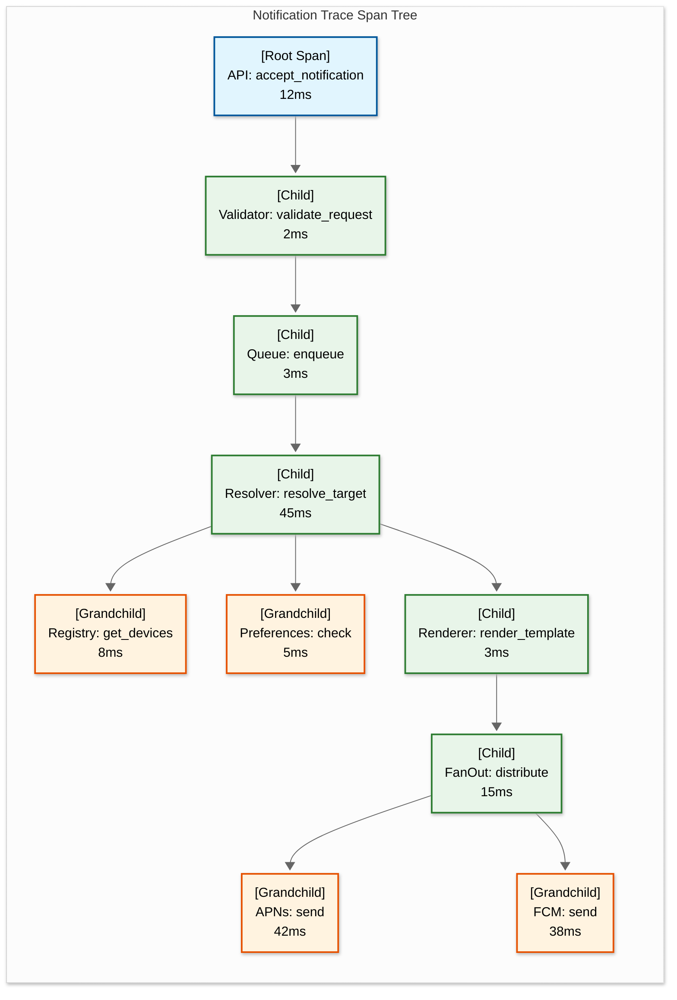

# Observability — Push Notification System

## 1. Metrics

### 1.1 Key Performance Indicators (KPIs)

| Metric | Type | Description | Target |
|---|---|---|---|
| **Ingestion rate** | Counter | Notifications accepted per second | Track against capacity plan |
| **Delivery rate** | Counter | Notifications successfully handed to providers per second | > 97% of eligible sends |
| **End-to-end latency (transactional)** | Histogram | Time from API receipt to provider acceptance | P95 < 500ms |
| **End-to-end latency (campaign)** | Histogram | Time from scheduled send time to last device sent | < 10 min for 100M devices |
| **Open rate** | Gauge | Percentage of delivered notifications that users opened | Track trends (typically 5-8%) |
| **Click-through rate (CTR)** | Gauge | Percentage of opened notifications where user took action | Track trends (typically 1-3%) |
| **Delivery failure rate** | Gauge | Percentage of send attempts that failed | < 3% for fresh tokens |
| **Token invalidity rate** | Gauge | Percentage of sends resulting in invalid-token feedback | < 5% (alarm at > 10%) |
| **Suppression rate** | Gauge | Percentage of notifications suppressed (prefs, frequency cap, quiet hours) | Track—not inherently bad, indicates healthy preference system |

### 1.2 USE Metrics (Utilization, Saturation, Errors) Per Component

| Component | Utilization | Saturation | Errors |
|---|---|---|---|
| **Ingestion API** | Request rate / max capacity | Queue depth behind API; request latency P99 | 4xx rate (client errors), 5xx rate (server errors) |
| **Fan-Out Workers** | Active workers / total workers | Pending partitions in queue; memory usage per worker | Partition processing failures; device registry timeout rate |
| **APNs Adapter** | Active streams / max streams across pool | Pending sends in APNs queue; connection wait time | 4xx/5xx from APNs; connection reset count; JWT refresh failures |
| **FCM Adapter** | Active requests / connection pool capacity | Pending sends in FCM queue; OAuth token refresh latency | FCM error codes (QUOTA_EXCEEDED, UNAVAILABLE); batch failure rate |
| **HMS Adapter** | Active requests / connection pool capacity | Pending sends in HMS queue | HMS error rate; auth token refresh failures |
| **Web Push Adapter** | Active requests / worker capacity | Pending encryptions; connection pool usage | Encryption failures; endpoint not found (subscription expired) |
| **Device Registry Cache** | Memory used / allocated | Eviction rate; miss rate | Read timeouts; connection pool exhaustion |
| **Device Registry Store** | CPU, disk I/O, connections | Replication lag; write queue depth | Read/write error rate; replication failures |
| **Message Queues** | Broker CPU and disk | Consumer lag (messages behind); partition imbalance | Under-replicated partitions; consumer group rebalances |
| **Analytics Pipeline** | Processing throughput / ingest rate | Processing lag (seconds behind real-time) | Deserialization errors; write failures to analytics store |

### 1.3 RED Metrics (Rate, Errors, Duration) Per Service

| Service | Rate | Errors | Duration |
|---|---|---|---|
| **Ingestion API** | Requests/sec by endpoint, tenant, priority | Error rate by status code; rate limit rejections | P50, P95, P99 response time |
| **Target Resolver** | Users resolved/sec; devices resolved/sec | Resolution failures (registry errors, preference errors) | P50, P95 time to resolve target |
| **Template Renderer** | Templates rendered/sec by template_id | Rendering errors (missing variables, invalid locale) | P50, P95 render time |
| **Fan-Out Engine** | Devices fanned out/sec; partitions completed/min | Failed partitions; dropped messages | P50, P95 per-partition processing time |
| **Provider Adapters** | Sends/sec per provider | Error rate per provider per error type | P50, P95 provider response time |
| **Feedback Processor** | Feedback events/sec per provider per type | Processing errors; registry update failures | Processing lag (event age) |

### 1.4 Business Metrics Dashboard

| Panel | Metric | Visualization | Alert Threshold |
|---|---|---|---|
| **Delivery Funnel** | Created → Resolved → Sent → Delivered → Opened → Clicked | Funnel chart (updated every minute) | Drop > 20% at any stage vs baseline |
| **Provider Health** | Delivery success rate per provider over time | Line chart (1-min granularity) | Any provider < 90% success rate for 5 min |
| **Campaign Performance** | Per-campaign: audience, sent, delivered, opened, CTR, A/B comparison | Table with sparklines | N/A (informational) |
| **Token Health** | Active vs stale vs invalidated tokens over time | Stacked area chart | Invalidation rate > 2x daily baseline |
| **User Engagement** | Open rate and CTR by notification category | Bar chart, weekly trend | Open rate drop > 30% week-over-week |
| **Platform Mix** | Notification volume by provider (APNs, FCM, HMS, Web) | Pie chart / stacked bar | Unexpected shift > 10% (may indicate provider issue) |

---

## 2. Logging

### 2.1 Log Strategy

| Log Level | Purpose | Examples | Volume |
|---|---|---|---|
| **ERROR** | Actionable failures requiring investigation | Provider connection failure, credential expiry, queue write failure, unrecoverable send error | < 0.1% of events |
| **WARN** | Degraded behavior that self-recovers | Provider throttle (429), cache miss rate above threshold, retry attempt, approaching quota limit | < 1% of events |
| **INFO** | Key lifecycle events for audit trail | Notification created, sent, delivered, campaign started/completed, token registered/deactivated | Every notification (sampled at 10% for high-volume) |
| **DEBUG** | Detailed processing for troubleshooting | Template rendering details, preference evaluation, fan-out partition assignment, provider request/response | Disabled in production; enabled per-service on demand |

### 2.2 Structured Log Format

```
{
  "timestamp": "2026-03-15T10:00:00.123Z",
  "level": "INFO",
  "service": "provider-adapter-apns",
  "instance": "apns-worker-042",
  "trace_id": "abc123def456",
  "span_id": "span-789",
  "notification_id": "notif-12345",
  "campaign_id": "camp-678",
  "tenant_id": "tenant-acme",
  "app_id": "app-ios-main",
  "event": "notification.sent",
  "provider": "apns",
  "device_id": "dev-999",
  "device_token": "a1b2c3d4****",      // masked
  "status": "accepted",
  "provider_message_id": "apns-uuid-456",
  "latency_ms": 42,
  "retry_count": 0,
  "payload_size_bytes": 2048,
  "priority": "high",
  "category": "order_updates"
}
```

### 2.3 Log Routing

| Log Category | Destination | Retention | Purpose |
|---|---|---|---|
| **Audit logs** (notification decisions) | Immutable audit log store | 2 years | Compliance; "why was this sent/not sent" investigations |
| **Error logs** | Centralized log aggregation | 90 days | Debugging and incident investigation |
| **Provider interaction logs** | Provider-specific log streams | 30 days | Provider-level debugging and quota tracking |
| **Performance logs** | Metrics-integrated log store | 14 days | Correlation between log events and metrics anomalies |
| **Access logs** (API) | Security log store | 1 year | Security audit; API abuse detection |

### 2.4 Log Sampling Strategy

At 10B notifications/day, logging every event generates unsustainable volume. Sampling strategy:

| Event Type | Sampling Rate | Rationale |
|---|---|---|
| **Errors (all)** | 100% | Every error is logged; errors are rare and critical |
| **Transactional sends** | 100% | Low volume relative to marketing; each is important |
| **Marketing campaign sends** | 10% | High volume; 10% sample provides statistically valid metrics |
| **Delivery confirmations** | 1% | Extremely high volume; used only for aggregate metrics |
| **Provider API requests** | 5% per provider | Balance between debuggability and volume |
| **Cache hits** | 0.1% | Extremely high volume; only needed for cache performance analysis |

---

## 3. Distributed Tracing

### 3.1 Trace Propagation



### 3.2 Key Spans

| Span | Service | Key Attributes | Purpose |
|---|---|---|---|
| `api.accept_notification` | Ingestion API | `tenant_id`, `priority`, `target_type`, `payload_size` | Root span; measures ingestion latency |
| `resolver.resolve_target` | Target Resolver | `user_count`, `device_count`, `cache_hit_rate` | Measures resolution complexity and cache efficiency |
| `registry.get_devices` | Device Registry | `user_id`, `device_count`, `cache_hit` | Per-user device lookup; identify slow lookups |
| `renderer.render_template` | Template Service | `template_id`, `locale`, `variable_count` | Template rendering performance |
| `fanout.distribute` | Fan-Out Engine | `partition_count`, `total_devices`, `per_provider_counts` | Fan-out coordination overhead |
| `provider.send` | Provider Adapter | `provider`, `response_code`, `latency_ms`, `retry_count` | Provider-level latency and reliability |
| `feedback.process` | Feedback Processor | `provider`, `feedback_type`, `batch_size` | Feedback processing lag |

### 3.3 Trace Sampling

| Scenario | Sampling Rate | Rationale |
|---|---|---|
| **Transactional notifications** | 10% | Higher value per notification; want good trace coverage |
| **Campaign notifications** | 0.1% | Extremely high volume; statistical sample sufficient |
| **Error traces** | 100% | Every error path is traced in full |
| **Slow traces (> 2x P95)** | 100% | Tail-latency investigation requires full traces |
| **Specific notification_id** | 100% (on-demand) | Debug mode for investigating specific notification delivery |

### 3.4 Cross-Service Correlation

The `notification_id` serves as the primary correlation key across all services. For campaign fan-out, the `campaign_id` correlates the campaign with all child notifications. For debugging delivery to a specific user, `user_id` + `device_id` + time range enables full timeline reconstruction:

```
QUERY: Show full lifecycle for notification "notif-12345"

Result:
T+0ms    api.accept_notification     -> 202 Accepted (12ms)
T+15ms   queue.enqueue               -> high-priority lane
T+18ms   resolver.resolve_target     -> 3 devices found (45ms)
T+65ms   renderer.render_template    -> "Order Shipped" (3ms)
T+70ms   fanout.distribute           -> APNs:1, FCM:2 (15ms)
T+85ms   provider.send [apns]        -> 200 OK, apns-id=uuid1 (42ms)
T+87ms   provider.send [fcm:dev1]    -> 200 OK (38ms)
T+89ms   provider.send [fcm:dev2]    -> 200 OK (41ms)
T+500ms  feedback.delivery [apns]    -> delivered
T+800ms  feedback.delivery [fcm]     -> delivered (2 devices)
T+3200ms engagement.opened [apns]    -> user opened notification
```

---

## 4. Alerting

### 4.1 Critical Alerts (Page-Worthy)

| Alert | Condition | Severity | Action |
|---|---|---|---|
| **Ingestion API down** | > 50% of instances returning 5xx for 2 minutes | P1 | Page on-call; check LB health, instance status, queue connectivity |
| **Provider credential failure** | Any provider returning auth errors (403/401) for 1 minute | P1 | Page on-call; check credential vault; rotate credential if compromised |
| **Notification loss detected** | Accepted notifications not appearing in send log after 5 minutes (> 0.01% loss rate) | P1 | Page on-call; check queue health; verify consumer group status |
| **Device registry write failure** | Write error rate > 1% for 2 minutes | P1 | Page on-call; check primary shard health; verify disk space and replication |
| **Provider outage** | Any provider returning > 50% errors for 5 minutes | P1 | Page on-call; confirm provider status page; activate queue buffering |
| **Campaign delivery stall** | Active campaign with 0 sends for 5 minutes | P1 | Page on-call; check fan-out workers; verify queue consumers are running |

### 4.2 Warning Alerts (Non-Page)

| Alert | Condition | Severity | Action |
|---|---|---|---|
| **Elevated provider throttling** | Any provider throttle rate > 10% for 10 minutes | P2 | Investigate quota usage; check for runaway campaign; adjust pacing |
| **Token invalidity spike** | Invalid token rate > 2x baseline for 15 minutes | P2 | Check for mass app uninstall; verify token cleanup is running |
| **Queue depth growing** | Any queue depth increasing for 15+ consecutive minutes | P2 | Check consumer health; investigate bottleneck; consider scaling consumers |
| **Cache hit rate drop** | Device registry cache hit rate < 95% for 10 minutes | P2 | Check cache cluster health; investigate eviction patterns; consider cache warming |
| **Delivery latency degradation** | Transactional P95 latency > 1 second for 5 minutes | P2 | Check each pipeline stage for bottleneck; profile slow component |
| **Analytics pipeline lag** | Processing lag > 30 minutes | P3 | Check stream processor health; may need to scale partitions |
| **Tenant quota approaching** | Any enterprise tenant at > 80% daily quota | P3 | Notify tenant; consider quota increase if legitimate growth |

### 4.3 Runbook Quick Reference

| Scenario | Diagnostic Steps | Resolution |
|---|---|---|
| **APNs sends failing** | 1. Check APNs adapter error codes<br/>2. Verify JWT/cert validity<br/>3. Check Apple Developer status page<br/>4. Review connection pool health | If credential issue: rotate credential. If Apple outage: queue messages, wait. If connection issue: restart adapter pods. |
| **FCM quota exceeded** | 1. Check FCM console for quota status<br/>2. Identify which tenant/campaign is consuming<br/>3. Review pacing configuration | Throttle the heavy campaign. If quota is legitimately too low: request increase via FCM console. Implement stricter per-tenant pacing. |
| **Notification delivery delayed** | 1. Check queue depths at each pipeline stage<br/>2. Identify which stage has growing backlog<br/>3. Check consumer health for that stage | Scale consumers for bottleneck stage. If provider throttling: enable aggressive pacing. If registry slow: check cache and replicas. |
| **Mass token invalidation** | 1. Check if a specific app version triggered it<br/>2. Review provider feedback error codes<br/>3. Check if APNs cert or FCM key was rotated | If cert rotation: the invalidated tokens were tied to old cert—expected. If mass uninstall: app issue—escalate to app team. Run token cleanup job. |

---

## 5. SLO Monitoring

### 5.1 SLO Dashboard

| SLO | Target | Measurement Window | Burn Rate Alert |
|---|---|---|---|
| **Ingestion availability** | 99.95% | 30-day rolling | Alert if 5% of monthly error budget consumed in 1 hour |
| **Transactional latency P95** | < 500ms | 30-day rolling | Alert if P95 > 500ms for > 15 minutes |
| **Delivery success rate** | > 97% | 7-day rolling (per provider) | Alert if < 95% for any provider for 30 minutes |
| **Notification loss rate** | < 0.001% | 30-day rolling | Alert on any confirmed loss (each loss consumes significant budget) |
| **Analytics freshness** | < 5 minutes | Continuous | Alert if lag > 15 minutes |

### 5.2 Error Budget Policy

| Budget Remaining | Action |
|---|---|
| **> 50%** | Normal operations; deploy at will |
| **25-50%** | Reduce deployment frequency; require extra review for notification pipeline changes |
| **10-25%** | Freeze non-critical deployments; focus engineering on reliability improvements |
| **< 10%** | Emergency mode; only deploy critical fixes; conduct reliability review |

---

*Previous: [Security & Compliance](./06-security-and-compliance.md) | Next: [Interview Guide ->](./08-interview-guide.md)*
