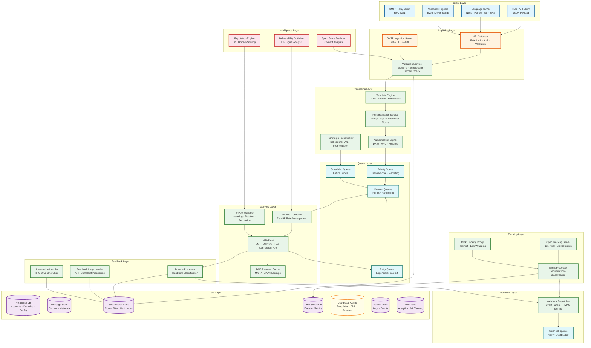
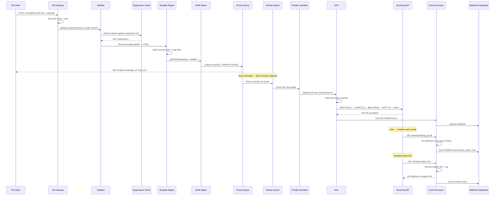
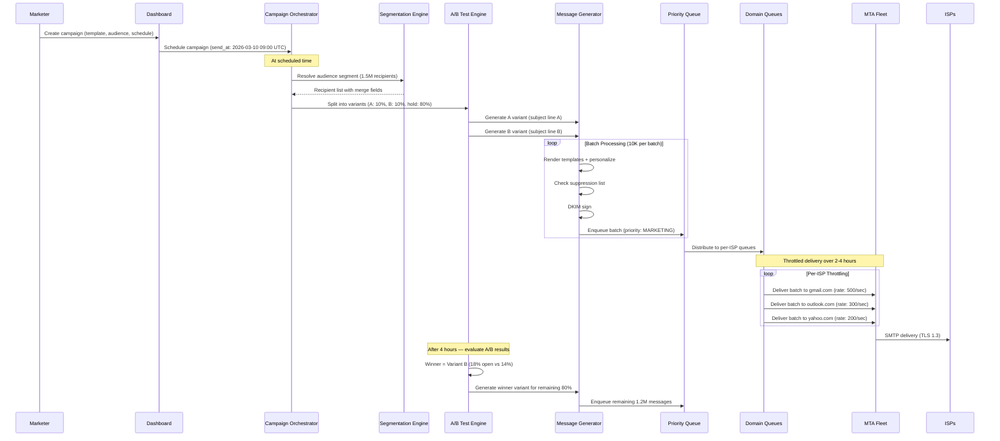
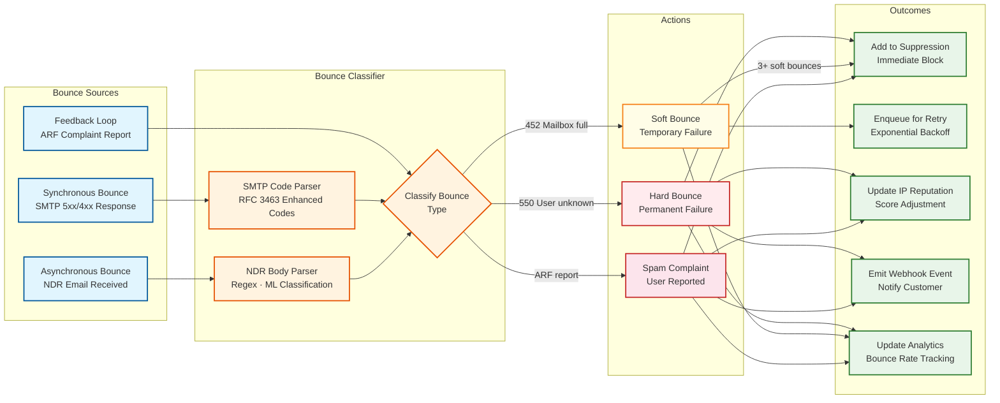
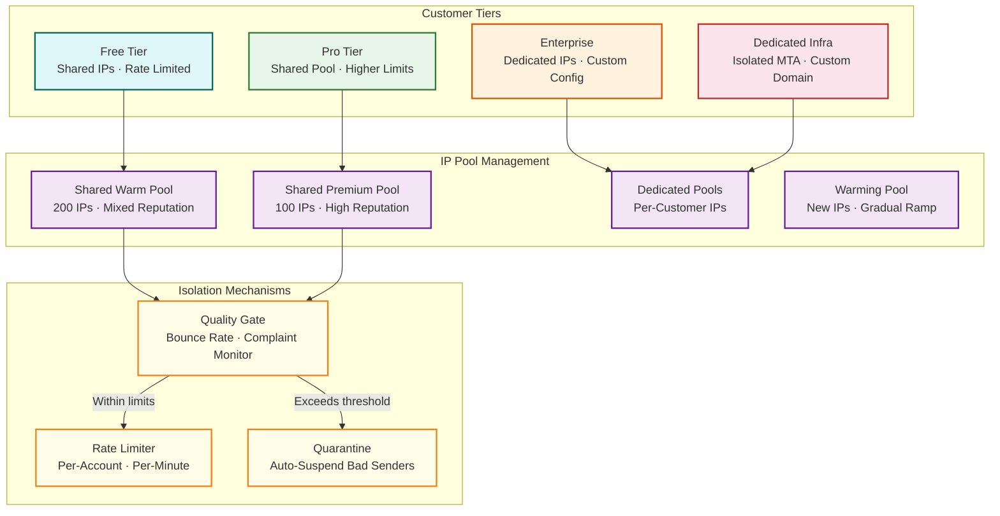

# High-Level Design — Email Delivery System

## 1. System Architecture



---

## 2. Data Flow: Transactional Email (Critical Path)



---

## 3. Data Flow: Marketing Campaign



---

## 4. Data Flow: Bounce Processing



---

## 5. Key Architectural Decisions

### 5.1 Architecture Pattern Checklist

| Decision | Choice | Justification |
|---|---|---|
| **Sync vs Async** | Async for delivery; sync for API acceptance | API returns 202 immediately; delivery happens asynchronously through queue pipeline |
| **Event-driven vs Request-response** | Event-driven for pipeline | Message lifecycle events (queued, sent, delivered, opened) flow through event stream |
| **Push vs Pull** | Push for delivery + webhooks; Pull for analytics | MTA pushes to ISPs; webhooks push to customers; analytics dashboards pull on demand |
| **Stateless vs Stateful** | Stateless services + stateful MTA connections | SMTP connections are inherently stateful; all other services are stateless and horizontally scalable |
| **Read-heavy vs Write-heavy** | Write-heavy for delivery; Read-heavy for analytics | Ingestion and delivery are write-dominated; dashboards and reports are read-dominated |
| **Real-time vs Batch** | Real-time for transactional; Batch for campaigns | Transactional emails require sub-second queuing; campaigns batch for ISP-friendly throttling |
| **Edge vs Origin** | Edge for tracking; Origin for delivery | Open/click tracking servers deployed at edge PoPs; MTA fleet at origin data centers |

### 5.2 Monolith vs Microservices

**Choice: Microservices with domain boundaries**

| Domain | Services | Justification |
|---|---|---|
| **Ingestion** | API Gateway, SMTP Server, Validator | Different protocols (HTTP vs SMTP) with independent scaling needs |
| **Processing** | Template Engine, DKIM Signer, Personalization | CPU-intensive rendering scales independently from I/O-bound delivery |
| **Delivery** | MTA Fleet, Throttle Controller, IP Manager | Core delivery path with unique scaling (per-ISP connection pools) |
| **Feedback** | Bounce Processor, FBL Handler, Unsubscribe | Inbound processing with different traffic patterns than outbound |
| **Tracking** | Pixel Server, Click Proxy, Event Processor | Extremely high QPS (billions of requests/month) with CDN-like deployment |
| **Intelligence** | Reputation Engine, Deliverability Optimizer | ML workloads with GPU requirements and batch processing |

### 5.3 Database Strategy (Polyglot Persistence)

| Data Type | Store Type | Technology | Justification |
|---|---|---|---|
| **Account/domain config** | Relational DB | PostgreSQL | Structured data with referential integrity, low write volume |
| **Message metadata** | Wide-column store | Cassandra / ScyllaDB | Time-series message logs with high write throughput, TTL-based expiry |
| **Message content** | Object storage | Blob store | Large HTML bodies with 30-day retention, no query requirements |
| **Suppression lists** | Key-value store + Bloom filter | Redis + RocksDB | Sub-millisecond lookup for every outgoing message; bloom filter for fast negative |
| **Engagement events** | Time-series DB | ClickHouse / TimescaleDB | High-cardinality event data with time-windowed aggregations |
| **Template storage** | Document store | MongoDB | Semi-structured templates with versioning and rich querying |
| **DNS cache** | In-memory store | Local LRU cache + Redis | MX/A record caching with TTL-based invalidation |
| **Analytics** | Columnar store | ClickHouse | Fast OLAP queries across billions of events |
| **Search/logs** | Search engine | OpenSearch | Full-text search across email logs and events |

### 5.4 Queue Architecture

The multi-stage queue is the system's defining architectural element:

```
API → [Priority Queue] → [Domain Queue] → [Connection Queue] → MTA → ISP
         ↓                    ↓                  ↓
    Transactional         gmail.com          IP-1 → gmail
    Marketing             outlook.com        IP-2 → gmail
    Scheduled             yahoo.com          IP-3 → outlook
                          custom-domain      IP-4 → yahoo
```

**Stage 1: Priority Queue** — Separates transactional (immediate) from marketing (throttled) traffic. Transactional messages bypass scheduling and throttling delays.

**Stage 2: Domain Queue** — Partitions messages by recipient domain. Each ISP has different rate limits, connection policies, and throttling behavior. Per-domain queues enable independent rate control.

**Stage 3: Connection Queue** — Maps messages to specific sending IPs and SMTP connections. Ensures even distribution across the IP pool and respects per-IP rate limits at each ISP.

### 5.5 Caching Strategy

| Cache Layer | Data | TTL | Hit Rate Target |
|---|---|---|---|
| **L1 (Local)** | DNS MX records, compiled templates, DKIM keys | 5-60 min | > 99% |
| **L2 (Distributed)** | Suppression bloom filter, domain config, IP reputation | 1-15 min | > 95% |
| **L3 (CDN Edge)** | Tracking pixel responses (304 Not Modified), click redirect pages | 0 (no cache) | N/A (tracking must be unique) |

### 5.6 Message Queue Technology

**Choice: Distributed log (Kafka-style) for event streaming + specialized MTA queues for SMTP delivery**

| Queue Type | Technology | Justification |
|---|---|---|
| **Event stream** | Kafka / Pulsar | Durable, ordered, replayable event log for message lifecycle events |
| **MTA delivery queue** | Custom on-disk queue | SMTP delivery requires per-domain partitioning, connection affinity, and retry scheduling that generic message brokers don't optimize for |
| **Webhook delivery** | Redis-backed queue | High throughput, low latency, with dead-letter support |
| **Scheduled sends** | Sorted set (Redis) or delay queue | Efficient time-based dequeue for future-scheduled messages |

---

## 6. Multi-Tenant Architecture



---

## 7. Deployment Architecture

| Component | Deployment Model | Scaling Unit |
|---|---|---|
| **API Gateway** | Horizontally scaled behind load balancer | Per-request; auto-scale on QPS |
| **SMTP Ingestion** | Dedicated fleet with connection affinity | Per-connection; scale on concurrent connections |
| **Template Engine** | Stateless worker pool | Per-CPU; scale on render queue depth |
| **MTA Fleet** | Regional fleets with IP affinity | Per-IP; each MTA instance manages a set of sending IPs |
| **Bounce Processor** | Consumer group on event stream | Per-partition; scale on bounce event volume |
| **Tracking Servers** | Edge-deployed, globally distributed | Per-region; scale on pixel/click request volume |
| **Webhook Dispatcher** | Worker pool with queue consumers | Per-webhook; scale on event backlog |
| **Analytics Pipeline** | Stream processors + batch aggregators | Per-partition for stream; per-query for batch |

---

*Previous: [Requirements & Estimations](./01-requirements-and-estimations.md) | Next: [Low-Level Design ->](./03-low-level-design.md)*
