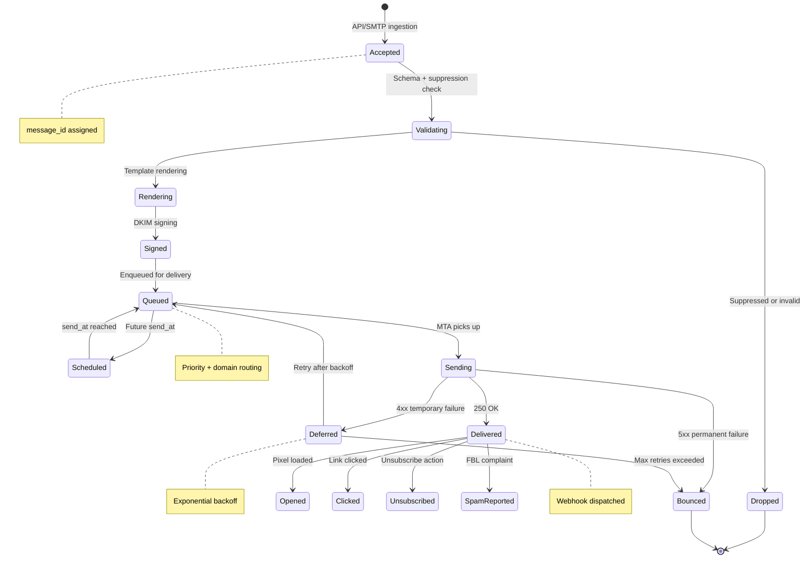

# Low-Level Design — Email Delivery System

## 1. Data Model

### 1.1 Entity Relationship Diagram

```mermaid
erDiagram
    ACCOUNT ||--o{ DOMAIN : owns
    ACCOUNT ||--o{ API_KEY : has
    ACCOUNT ||--o{ WEBHOOK_CONFIG : configures
    ACCOUNT ||--o{ IP_POOL_ASSIGNMENT : uses
    DOMAIN ||--o{ DKIM_KEY : authenticates
    DOMAIN ||--o{ TEMPLATE : contains
    TEMPLATE ||--o{ TEMPLATE_VERSION : versioned
    ACCOUNT ||--o{ MESSAGE : sends
    MESSAGE ||--o{ MESSAGE_EVENT : generates
    MESSAGE ||--|{ RECIPIENT : targets
    RECIPIENT ||--o{ ENGAGEMENT_EVENT : tracked
    ACCOUNT ||--o{ SUPPRESSION_ENTRY : maintains
    ACCOUNT ||--o{ CAMPAIGN : creates
    CAMPAIGN ||--o{ CAMPAIGN_VARIANT : tests
    CAMPAIGN ||--o{ MESSAGE : generates
    IP_POOL ||--o{ IP_ADDRESS : contains
    IP_POOL ||--o{ IP_POOL_ASSIGNMENT : assigned_to
    IP_ADDRESS ||--o{ IP_REPUTATION_LOG : tracked

    ACCOUNT {
        uuid account_id PK
        string name
        string email
        enum tier "free|pro|enterprise|dedicated"
        int monthly_limit
        int rate_limit_per_sec
        timestamp created_at
        enum status "active|suspended|closed"
    }

    DOMAIN {
        uuid domain_id PK
        uuid account_id FK
        string domain_name
        boolean spf_verified
        boolean dkim_verified
        boolean dmarc_verified
        boolean bimi_enabled
        timestamp verified_at
        enum status "pending|verified|failed"
    }

    DKIM_KEY {
        uuid key_id PK
        uuid domain_id FK
        string selector
        text public_key
        text private_key_ref "KMS reference"
        enum algorithm "rsa-2048|ed25519"
        timestamp created_at
        timestamp rotated_at
        boolean active
    }

    API_KEY {
        uuid key_id PK
        uuid account_id FK
        string key_hash "SHA-256 hash"
        string key_prefix "first 8 chars for identification"
        json scopes "send|read|admin"
        timestamp created_at
        timestamp last_used_at
        boolean active
    }

    TEMPLATE {
        uuid template_id PK
        uuid account_id FK
        uuid domain_id FK
        string name
        string subject_template
        int active_version
        timestamp created_at
        timestamp updated_at
    }

    TEMPLATE_VERSION {
        uuid version_id PK
        uuid template_id FK
        int version_number
        text mjml_source
        text compiled_html
        text plain_text
        json merge_fields
        timestamp created_at
    }

    MESSAGE {
        uuid message_id PK
        uuid account_id FK
        uuid domain_id FK
        uuid campaign_id FK "nullable"
        uuid template_version_id FK "nullable"
        string from_address
        string subject
        enum message_type "transactional|marketing"
        enum priority "critical|high|normal|low"
        enum status "accepted|queued|sending|delivered|bounced|deferred|dropped"
        timestamp accepted_at
        timestamp sent_at
        timestamp delivered_at
        int size_bytes
        string sending_ip
        json custom_headers
        json metadata "customer-defined key-value"
    }

    RECIPIENT {
        uuid recipient_id PK
        uuid message_id FK
        string email_address
        string email_hash "SHA-256 for suppression lookup"
        enum type "to|cc|bcc"
        json merge_data "personalization fields"
    }

    MESSAGE_EVENT {
        uuid event_id PK
        uuid message_id FK
        enum event_type "queued|sent|delivered|deferred|bounced|dropped|opened|clicked|unsubscribed|spam_report"
        timestamp event_at
        string smtp_response "raw SMTP response"
        string bounce_type "hard|soft|block"
        int bounce_code
        string user_agent
        string ip_address
        string click_url "for click events"
        boolean is_human "bot detection result"
    }

    ENGAGEMENT_EVENT {
        uuid event_id PK
        uuid message_id FK
        uuid recipient_id FK
        enum type "open|click|unsubscribe"
        timestamp event_at
        string ip_address
        string user_agent
        string click_url
        boolean is_human
        string device_type "desktop|mobile|tablet"
        string email_client "detected client"
    }

    SUPPRESSION_ENTRY {
        uuid entry_id PK
        uuid account_id FK "nullable for global"
        string email_hash "SHA-256"
        enum reason "hard_bounce|spam_complaint|unsubscribe|manual|invalid"
        timestamp suppressed_at
        uuid source_message_id FK "message that caused suppression"
        boolean is_global "platform-wide vs account-specific"
    }

    CAMPAIGN {
        uuid campaign_id PK
        uuid account_id FK
        string name
        uuid template_id FK
        json audience_segment
        timestamp scheduled_at
        timestamp started_at
        timestamp completed_at
        int total_recipients
        int sent_count
        int delivered_count
        int opened_count
        int clicked_count
        int bounced_count
        enum status "draft|scheduled|sending|paused|completed|cancelled"
    }

    CAMPAIGN_VARIANT {
        uuid variant_id PK
        uuid campaign_id FK
        string variant_name "A|B|C"
        string subject_line
        uuid template_version_id FK
        float traffic_percentage
        int sent_count
        int opened_count
        boolean is_winner
    }

    IP_POOL {
        uuid pool_id PK
        string pool_name
        enum pool_type "shared|dedicated|warming"
        int max_daily_volume
        float current_reputation
    }

    IP_ADDRESS {
        uuid ip_id PK
        uuid pool_id FK
        string ip_address
        string reverse_dns "PTR record"
        enum warming_stage "cold|warming|warm|hot"
        int daily_limit
        int current_daily_sent
        float reputation_score
        timestamp added_at
    }

    IP_POOL_ASSIGNMENT {
        uuid assignment_id PK
        uuid account_id FK
        uuid pool_id FK
        enum assignment_type "default|dedicated|overflow"
    }

    IP_REPUTATION_LOG {
        uuid log_id PK
        uuid ip_id FK
        date log_date
        int sent_count
        int delivered_count
        int bounced_count
        int complaint_count
        float delivery_rate
        float complaint_rate
        float reputation_score
    }

    WEBHOOK_CONFIG {
        uuid config_id PK
        uuid account_id FK
        string url
        string signing_secret
        json event_types "which events to send"
        boolean active
        int failure_count
        timestamp last_success_at
    }
```



### 1.2 Indexing Strategy

| Table | Index | Type | Purpose |
|---|---|---|---|
| `message` | `(account_id, accepted_at DESC)` | B-Tree | Dashboard queries: recent messages per account |
| `message` | `(status, message_type, accepted_at)` | B-Tree | Queue drain: find pending messages by type |
| `message` | `(campaign_id, status)` | B-Tree | Campaign progress tracking |
| `message_event` | `(message_id, event_at)` | B-Tree | Message lifecycle timeline |
| `message_event` | `(event_type, event_at)` | B-Tree | Event-type analytics (all bounces in time range) |
| `suppression_entry` | `(email_hash)` | Hash | Sub-millisecond suppression lookup |
| `suppression_entry` | `(account_id, email_hash)` | Composite | Account-specific suppression check |
| `engagement_event` | `(message_id, type)` | B-Tree | Per-message engagement lookup |
| `engagement_event` | `(recipient_id, event_at)` | B-Tree | Recipient engagement history |
| `ip_address` | `(pool_id, warming_stage)` | B-Tree | Pool management: find available warm IPs |
| `domain` | `(account_id, domain_name)` | Unique | Domain lookup by account |
| `dkim_key` | `(domain_id, active)` | B-Tree | Active key lookup for signing |

### 1.3 Partitioning Strategy

| Data | Partition Key | Strategy | Rationale |
|---|---|---|---|
| **Messages** | `account_id` + time bucket | Range partitioning by month | Isolate customer data; enable efficient time-range queries and TTL purge |
| **Message events** | `message_id` hash | Hash partitioning | Even distribution; co-locate events with parent message |
| **Engagement events** | Time bucket (hourly) | Time-range partitioning | Efficient analytics queries; automated partition drop for retention |
| **Suppression list** | `email_hash` prefix | Hash partitioning | Even distribution across nodes; fast point lookups |
| **IP reputation logs** | `ip_id` + date | Range partitioning by day | Per-IP time-series queries; automated cleanup |

### 1.4 Data Retention

| Data Type | Retention | Archive Strategy |
|---|---|---|
| Message content (body) | 30 days | Delete after retention window |
| Message metadata | 90 days hot, 1 year warm | Move to cold columnar store after 90 days |
| Engagement events | 1 year hot, 3 years warm | Aggregate and archive to data lake |
| Suppression entries | Indefinite | Never delete (compliance requirement) |
| Webhook delivery logs | 90 days | Archive to object storage |
| IP reputation logs | 1 year | Aggregate to monthly summaries |
| Campaign data | 2 years | Archive after campaign completion + 2 years |

---

## 2. API Design

### 2.1 Send Email API

```
POST /v1/mail/send
Authorization: Bearer {api_key}
Content-Type: application/json
Idempotency-Key: {uuid}

Request:
{
  "from": {
    "email": "notifications@example.com",
    "name": "Example App"
  },
  "to": [
    {
      "email": "user@gmail.com",
      "name": "Jane Doe",
      "merge_data": {
        "first_name": "Jane",
        "order_id": "ORD-12345"
      }
    }
  ],
  "subject": "Your order {{order_id}} has shipped",
  "template_id": "tmpl_shipping_notification",
  "template_version": 3,
  "message_type": "transactional",
  "custom_headers": {
    "X-Entity-Ref-ID": "order-12345"
  },
  "tracking": {
    "opens": true,
    "clicks": true
  },
  "metadata": {
    "order_id": "ORD-12345",
    "environment": "production"
  },
  "send_at": null
}

Response (202 Accepted):
{
  "message_id": "msg_abc123def456",
  "status": "accepted",
  "accepted_at": "2026-03-09T14:30:00Z",
  "recipients_accepted": 1,
  "recipients_rejected": 0,
  "warnings": []
}

Error Response (400 Bad Request):
{
  "error": {
    "code": "VALIDATION_ERROR",
    "message": "Recipient user@invalid is suppressed (hard_bounce)",
    "details": [
      {
        "field": "to[0].email",
        "reason": "suppressed",
        "suppression_type": "hard_bounce"
      }
    ]
  }
}
```

### 2.2 Template Management API

```
POST /v1/templates
PUT  /v1/templates/{template_id}/versions
GET  /v1/templates/{template_id}
GET  /v1/templates/{template_id}/preview

Preview Request:
POST /v1/templates/{template_id}/preview
{
  "merge_data": {
    "first_name": "Jane",
    "order_id": "ORD-12345"
  },
  "render_format": "html"
}

Response:
{
  "html": "<html>...rendered HTML...</html>",
  "plain_text": "...plain text fallback...",
  "subject": "Your order ORD-12345 has shipped",
  "estimated_size_bytes": 42560,
  "spam_score": 1.2,
  "warnings": ["Image-to-text ratio is high"]
}
```

### 2.3 Suppression Management API

```
GET    /v1/suppressions?email={email}&reason={reason}
POST   /v1/suppressions          (manual suppression)
DELETE /v1/suppressions/{email}   (remove suppression)

GET /v1/suppressions?reason=hard_bounce&page=1&limit=100

Response:
{
  "data": [
    {
      "email": "b***@example.com",
      "email_hash": "sha256:abc123...",
      "reason": "hard_bounce",
      "suppressed_at": "2026-03-08T10:00:00Z",
      "source_message_id": "msg_xyz789"
    }
  ],
  "pagination": {
    "page": 1,
    "limit": 100,
    "total": 15234,
    "has_more": true
  }
}
```

### 2.4 Campaign API

```
POST   /v1/campaigns                    (create campaign)
PUT    /v1/campaigns/{id}/schedule       (schedule send)
POST   /v1/campaigns/{id}/send           (immediate send)
PUT    /v1/campaigns/{id}/pause          (pause sending)
GET    /v1/campaigns/{id}/stats          (real-time stats)

Campaign Stats Response:
{
  "campaign_id": "camp_abc123",
  "status": "sending",
  "progress": {
    "total_recipients": 1500000,
    "sent": 750000,
    "delivered": 720000,
    "opened": 180000,
    "clicked": 21600,
    "bounced": 15000,
    "spam_reports": 375,
    "unsubscribed": 1200
  },
  "rates": {
    "delivery_rate": 0.96,
    "open_rate": 0.25,
    "click_rate": 0.03,
    "bounce_rate": 0.02,
    "complaint_rate": 0.0005
  },
  "variants": [
    {
      "name": "A",
      "subject": "Spring Sale - 20% Off",
      "open_rate": 0.22,
      "click_rate": 0.028,
      "is_winner": false
    },
    {
      "name": "B",
      "subject": "Your Exclusive 20% Discount Inside",
      "open_rate": 0.28,
      "click_rate": 0.035,
      "is_winner": true
    }
  ],
  "estimated_completion": "2026-03-09T18:30:00Z"
}
```

### 2.5 Webhook Event API

```
POST {customer_webhook_url}
X-Webhook-Signature: sha256=hmac_signature
X-Webhook-ID: evt_abc123
X-Webhook-Timestamp: 1741528200
Content-Type: application/json

{
  "events": [
    {
      "event_id": "evt_001",
      "event_type": "delivered",
      "message_id": "msg_abc123",
      "timestamp": "2026-03-09T14:30:05Z",
      "recipient": "user@gmail.com",
      "metadata": {
        "order_id": "ORD-12345"
      },
      "delivery_details": {
        "smtp_response": "250 2.0.0 OK",
        "sending_ip": "198.51.100.42",
        "tls_version": "TLSv1.3"
      }
    },
    {
      "event_id": "evt_002",
      "event_type": "opened",
      "message_id": "msg_abc123",
      "timestamp": "2026-03-09T14:35:22Z",
      "recipient": "user@gmail.com",
      "engagement_details": {
        "user_agent": "Mozilla/5.0 ...",
        "ip_address": "203.0.113.50",
        "is_human": true,
        "device_type": "mobile",
        "email_client": "Gmail Android"
      }
    }
  ]
}
```

### 2.6 API Design Principles

| Principle | Implementation |
|---|---|
| **Idempotency** | `Idempotency-Key` header with 24-hour deduplication window; prevents duplicate sends on retry |
| **Rate Limiting** | Token bucket per API key with tier-based limits; returns `429` with `Retry-After` header |
| **Versioning** | URL path versioning (`/v1/`, `/v2/`); backward compatible within major version |
| **Pagination** | Cursor-based pagination for large result sets; offset-based for small datasets |
| **Filtering** | Query parameters for common filters; JSON body for complex segment queries |
| **Partial Responses** | `fields` query parameter for response field selection |

---

## 3. Core Algorithms

### 3.1 DKIM Signing Algorithm

```
FUNCTION sign_message_dkim(message, domain, selector):
    // Retrieve private key from key management service
    private_key = KMS.get_key(domain, selector)

    // Canonicalize headers (relaxed canonicalization)
    canonicalized_headers = ""
    signed_header_fields = ["from", "to", "subject", "date", "message-id", "mime-version", "content-type"]

    FOR EACH field IN signed_header_fields:
        header_value = message.get_header(field)
        IF header_value IS NOT NULL:
            // Relaxed: lowercase field name, unfold, compress whitespace
            canonical = lowercase(field) + ":" + compress_whitespace(unfold(header_value))
            canonicalized_headers += canonical + "\r\n"

    // Canonicalize body (relaxed)
    canonical_body = compress_whitespace(message.body)
    canonical_body = remove_trailing_empty_lines(canonical_body)

    // Compute body hash
    body_hash = BASE64(SHA256(canonical_body))

    // Build DKIM-Signature header (without b= value)
    dkim_header = "dkim-signature:v=1; a=rsa-sha256; c=relaxed/relaxed; "
    dkim_header += "d=" + domain + "; s=" + selector + "; "
    dkim_header += "h=" + JOIN(signed_header_fields, ":") + "; "
    dkim_header += "bh=" + body_hash + "; "
    dkim_header += "b="

    // Sign: headers + DKIM header (without b= value)
    data_to_sign = canonicalized_headers + dkim_header
    signature = BASE64(RSA_SIGN(private_key, SHA256(data_to_sign)))

    // Insert complete DKIM-Signature header
    full_header = "DKIM-Signature: v=1; a=rsa-sha256; c=relaxed/relaxed; "
    full_header += "d=" + domain + "; s=" + selector + "; "
    full_header += "h=" + JOIN(signed_header_fields, ":") + "; "
    full_header += "bh=" + body_hash + "; "
    full_header += "b=" + signature

    message.prepend_header(full_header)
    RETURN message
```

**Complexity:** O(n) where n = message size (body hashing dominates)

### 3.2 Per-ISP Adaptive Throttling Algorithm

```
FUNCTION calculate_sending_rate(isp_domain, ip_address):
    // Get current ISP metrics for this IP
    metrics = get_isp_metrics(isp_domain, ip_address)
    base_rate = get_base_rate(isp_domain)  // ISP-specific default

    // Factors that influence rate
    delivery_rate = metrics.delivered / metrics.attempted  // Last 1 hour
    bounce_rate = metrics.bounced / metrics.attempted
    deferral_rate = metrics.deferred / metrics.attempted
    complaint_rate = metrics.complaints / metrics.delivered

    // Adaptive rate calculation
    rate_multiplier = 1.0

    // Reduce rate if seeing deferrals (ISP is pushing back)
    IF deferral_rate > 0.10:
        rate_multiplier *= 0.5  // Cut rate in half
    ELSE IF deferral_rate > 0.05:
        rate_multiplier *= 0.75

    // Reduce rate if bounce rate is high (list quality issue)
    IF bounce_rate > 0.05:
        rate_multiplier *= 0.3  // Aggressive reduction
    ELSE IF bounce_rate > 0.02:
        rate_multiplier *= 0.7

    // Hard stop if complaint rate exceeds threshold
    IF complaint_rate > 0.003:  // 0.3% — ISP will block soon
        rate_multiplier = 0.0  // Pause sending to this ISP
        ALERT("High complaint rate", isp_domain, ip_address)
    ELSE IF complaint_rate > 0.001:
        rate_multiplier *= 0.5

    // Boost rate if metrics are excellent
    IF delivery_rate > 0.99 AND bounce_rate < 0.005 AND deferral_rate < 0.01:
        rate_multiplier *= 1.2  // Cautious increase

    // Apply warmth factor for new IPs
    warmth_factor = get_ip_warmth(ip_address)  // 0.0 (cold) to 1.0 (fully warm)

    effective_rate = base_rate * rate_multiplier * warmth_factor

    // Enforce min/max bounds
    effective_rate = CLAMP(effective_rate, MIN_RATE, MAX_RATE)

    RETURN effective_rate

FUNCTION get_ip_warmth(ip_address):
    ip = get_ip_record(ip_address)
    days_since_start = (NOW - ip.warming_start_date).days

    // Warming schedule: exponential ramp over 30 days
    // Day 1: 50/day, Day 7: 1K/day, Day 14: 10K/day, Day 21: 50K/day, Day 30: full
    IF days_since_start >= 30:
        RETURN 1.0

    warmth = MIN(1.0, (2 ^ (days_since_start / 5)) / 64)
    RETURN warmth
```

**Complexity:** O(1) per rate calculation; metrics maintained via sliding window counters

### 3.3 Bounce Classification Algorithm

```
FUNCTION classify_bounce(smtp_code, enhanced_code, response_text):
    // RFC 3463 enhanced status codes
    classification = {
        type: NULL,
        category: NULL,
        action: NULL,
        confidence: 0.0
    }

    // Primary classification by SMTP code class
    IF smtp_code >= 500 AND smtp_code < 600:
        classification.type = "hard"
    ELSE IF smtp_code >= 400 AND smtp_code < 500:
        classification.type = "soft"

    // Enhanced code classification (X.Y.Z format)
    IF enhanced_code IS NOT NULL:
        class_code = enhanced_code.split(".")[0]  // X
        subject_code = enhanced_code.split(".")[1]  // Y
        detail_code = enhanced_code.split(".")[2]  // Z

        SWITCH (subject_code, detail_code):
            CASE (1, 1): // Bad destination mailbox address
                classification.category = "invalid_address"
                classification.action = "suppress"
                classification.confidence = 0.95
            CASE (1, 2): // Bad destination system address
                classification.category = "invalid_domain"
                classification.action = "suppress"
                classification.confidence = 0.95
            CASE (2, 1): // Mailbox disabled
                classification.category = "disabled_mailbox"
                classification.action = "suppress"
                classification.confidence = 0.90
            CASE (2, 2): // Mailbox full
                classification.category = "mailbox_full"
                classification.action = "retry"
                classification.confidence = 0.85
            CASE (4, 2): // Connection dropped
                classification.category = "connection_error"
                classification.action = "retry"
                classification.confidence = 0.80
            CASE (7, 1): // Delivery not authorized
                classification.category = "policy_block"
                classification.action = "investigate"
                classification.confidence = 0.75
            CASE (7, 26): // DNS authentication failure
                classification.category = "auth_failure"
                classification.action = "investigate"
                classification.confidence = 0.90

    // Fallback: text-based classification if enhanced code insufficient
    IF classification.confidence < 0.70:
        response_lower = lowercase(response_text)

        IF contains(response_lower, "user unknown") OR
           contains(response_lower, "no such user") OR
           contains(response_lower, "mailbox not found"):
            classification.category = "invalid_address"
            classification.action = "suppress"
            classification.confidence = 0.85

        ELSE IF contains(response_lower, "over quota") OR
                contains(response_lower, "mailbox full"):
            classification.category = "mailbox_full"
            classification.action = "retry"
            classification.confidence = 0.80

        ELSE IF contains(response_lower, "blocked") OR
                contains(response_lower, "blacklisted") OR
                contains(response_lower, "rejected"):
            classification.category = "reputation_block"
            classification.action = "investigate"
            classification.confidence = 0.75

        ELSE IF contains(response_lower, "rate limit") OR
                contains(response_lower, "too many"):
            classification.category = "throttled"
            classification.action = "defer"
            classification.confidence = 0.85

    RETURN classification

FUNCTION handle_bounce_action(classification, message, recipient):
    SWITCH classification.action:
        CASE "suppress":
            suppression_store.add(recipient.email_hash, classification.category)
            emit_event("bounced", message, {type: "hard", reason: classification.category})

        CASE "retry":
            retry_count = message.retry_count + 1
            IF retry_count > MAX_RETRIES:  // Typically 3 for soft bounces
                suppression_store.add(recipient.email_hash, "repeated_soft_bounce")
                emit_event("bounced", message, {type: "hard", reason: "max_retries"})
            ELSE:
                delay = MIN(BASE_DELAY * (2 ^ retry_count), MAX_DELAY)  // Exponential backoff
                retry_queue.enqueue(message, delay)
                emit_event("deferred", message, {retry: retry_count, next_attempt: NOW + delay})

        CASE "defer":
            // ISP-level throttling — reduce sending rate, don't count as bounce
            throttle_controller.reduce_rate(message.recipient_domain, 0.5)
            retry_queue.enqueue(message, THROTTLE_DELAY)

        CASE "investigate":
            emit_alert("bounce_investigation", message, classification)
            emit_event("bounced", message, {type: classification.type, reason: classification.category})
```

### 3.4 Suppression Lookup with Bloom Filter

```
FUNCTION check_suppression(email, account_id):
    email_hash = SHA256(lowercase(trim(email)))

    // Layer 1: Bloom filter (in-memory, microsecond lookup)
    // False positive rate: 0.1%, zero false negatives
    IF NOT bloom_filter.might_contain(email_hash):
        RETURN {suppressed: false}  // Definite negative

    // Layer 2: Distributed cache (millisecond lookup)
    cache_key = "supp:" + email_hash
    cached = cache.get(cache_key)
    IF cached IS NOT NULL:
        RETURN cached

    // Layer 3: Persistent store (sub-10ms lookup)
    // Check global suppression first, then account-specific
    global_entry = suppression_db.get(email_hash, account_id=NULL)
    IF global_entry IS NOT NULL:
        result = {suppressed: true, reason: global_entry.reason, scope: "global"}
        cache.set(cache_key, result, TTL=300)
        RETURN result

    account_entry = suppression_db.get(email_hash, account_id)
    IF account_entry IS NOT NULL:
        result = {suppressed: true, reason: account_entry.reason, scope: "account"}
        cache.set(cache_key, result, TTL=300)
        RETURN result

    // Bloom filter false positive — not actually suppressed
    result = {suppressed: false}
    cache.set(cache_key, result, TTL=60)  // Shorter TTL for negatives
    RETURN result
```

**Complexity:** O(1) average case (bloom filter); O(1) amortized with cache

### 3.5 IP Warming Schedule Algorithm

```
FUNCTION calculate_daily_limit(ip_address):
    ip = get_ip_record(ip_address)
    days_active = (NOW - ip.warming_start_date).days

    // Warming schedule (exponential ramp)
    warming_schedule = [
        {day: 1,  limit: 50},
        {day: 2,  limit: 100},
        {day: 3,  limit: 200},
        {day: 4,  limit: 400},
        {day: 5,  limit: 800},
        {day: 6,  limit: 1500},
        {day: 7,  limit: 3000},
        {day: 10, limit: 5000},
        {day: 14, limit: 10000},
        {day: 18, limit: 25000},
        {day: 21, limit: 50000},
        {day: 25, limit: 100000},
        {day: 30, limit: 250000},
        {day: 35, limit: 500000},
        {day: 42, limit: -1}  // Unlimited (fully warm)
    ]

    // Find applicable limit
    daily_limit = 50  // Default minimum
    FOR EACH stage IN warming_schedule:
        IF days_active >= stage.day:
            daily_limit = stage.limit

    // Adjust based on delivery metrics
    IF ip.last_day_bounce_rate > 0.05:
        daily_limit = daily_limit * 0.5  // Slow down if bouncing
        ALERT("High bounce rate during warming", ip_address)

    IF ip.last_day_complaint_rate > 0.001:
        daily_limit = daily_limit * 0.25  // Significant slowdown
        ALERT("Complaints during warming", ip_address)

    RETURN daily_limit

FUNCTION assign_ip_for_message(message, account):
    pool = get_ip_pool(account)

    // Sort IPs by available capacity (daily_limit - current_sent)
    available_ips = []
    FOR EACH ip IN pool.ips:
        remaining = ip.daily_limit - ip.current_daily_sent
        IF remaining > 0:
            available_ips.append({ip: ip, remaining: remaining})

    // Weighted random selection (favor IPs with more headroom)
    total_remaining = SUM(ip.remaining FOR ip IN available_ips)
    IF total_remaining == 0:
        RETURN NULL  // All IPs exhausted — defer message

    rand = RANDOM(0, total_remaining)
    cumulative = 0
    FOR EACH candidate IN available_ips:
        cumulative += candidate.remaining
        IF rand <= cumulative:
            RETURN candidate.ip
```

### 3.6 Human vs Bot Open Detection

```
FUNCTION classify_open_event(request):
    score = 0.0  // 0 = definitely bot, 1 = definitely human

    user_agent = request.headers["User-Agent"]
    ip_address = request.remote_ip
    request_time = request.timestamp
    message_sent_time = get_message_sent_time(request.message_id)

    // Factor 1: Known bot user agents
    known_bots = ["GoogleImageProxy", "YahooMailProxy", "Barracuda",
                  "ZScaler", "Mimecast", "Proofpoint", "FireEye"]
    FOR EACH bot IN known_bots:
        IF contains(user_agent, bot):
            RETURN {is_human: false, reason: "known_bot", confidence: 0.99}

    // Factor 2: Apple Mail Privacy Protection
    IF contains(user_agent, "Mozilla/5.0") AND ip_matches_apple_range(ip_address):
        RETURN {is_human: false, reason: "apple_mpp", confidence: 0.95}

    // Factor 3: Time between send and open
    time_delta = request_time - message_sent_time
    IF time_delta < 2 SECONDS:
        score -= 0.5  // Too fast for human
    ELSE IF time_delta > 30 SECONDS AND time_delta < 72 HOURS:
        score += 0.3  // Reasonable human timing

    // Factor 4: IP geolocation vs recipient domain
    ip_geo = geolocate(ip_address)
    IF ip_geo.is_datacenter OR ip_geo.is_vpn:
        score -= 0.4  // Likely proxy/scanner
    ELSE:
        score += 0.2

    // Factor 5: Request characteristics
    IF request.headers["Accept-Language"] IS NOT NULL:
        score += 0.1  // Bots rarely send Accept-Language
    IF request.headers["Referer"] IS NOT NULL:
        score += 0.1

    // Factor 6: Historical pattern for this recipient
    recent_opens = get_recent_opens(request.recipient, limit=10)
    IF all_same_user_agent(recent_opens) AND all_same_timing_pattern(recent_opens):
        score -= 0.3  // Automated pattern

    is_human = score > 0.0
    confidence = ABS(score) / 1.0  // Normalize to 0-1

    RETURN {is_human: is_human, confidence: confidence, score: score}
```

---

## 4. Message State Machine



---

*Previous: [High-Level Design](./02-high-level-design.md) | Next: [Deep Dive & Bottlenecks ->](./04-deep-dive-and-bottlenecks.md)*
