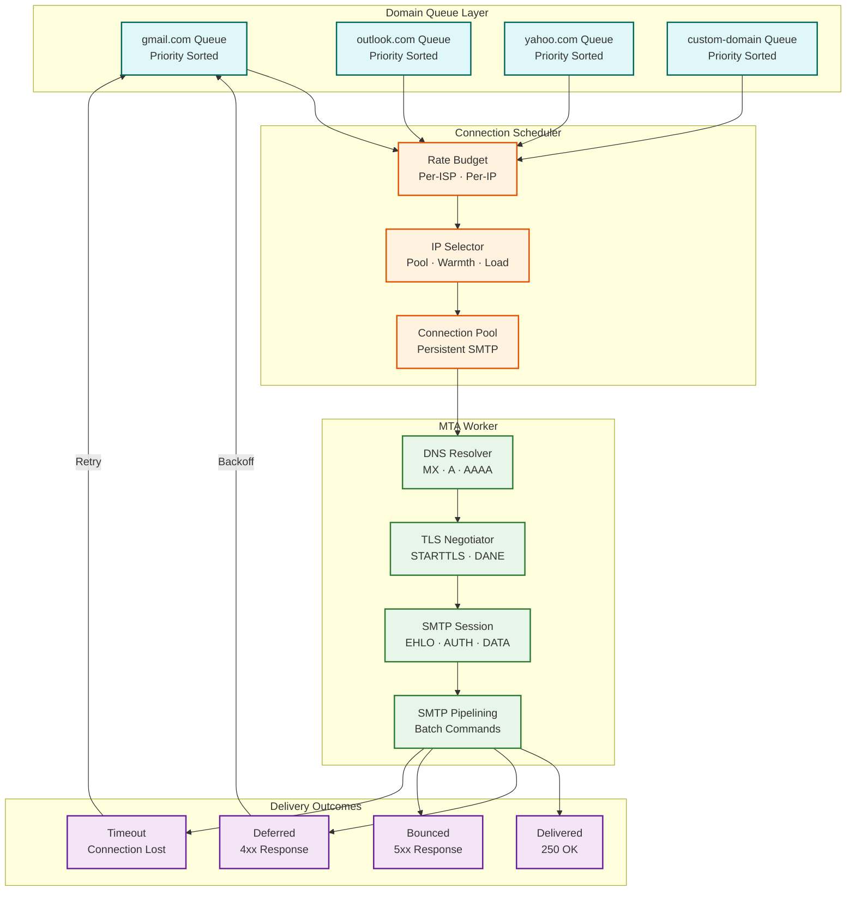
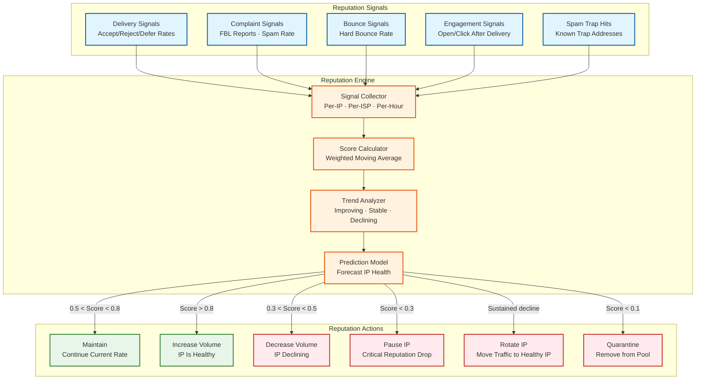
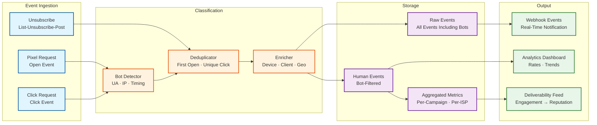
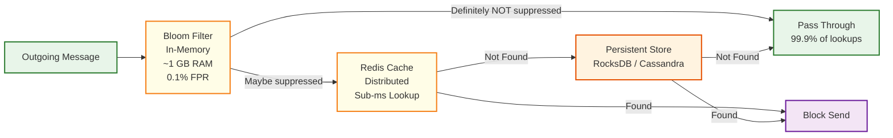

# Deep Dive & Bottlenecks — Email Delivery System

## 1. Critical Component Deep Dive

### 1.1 The MTA Pipeline: From Queue to ISP Mailbox

#### Why This Is Critical
The Mail Transfer Agent is the core delivery engine—it manages hundreds of thousands of concurrent SMTP connections, negotiates TLS with receiving servers, handles per-ISP rate limiting in real-time, and makes split-second decisions about retry vs. bounce. A poorly designed MTA pipeline either overwhelms ISPs (causing blocks) or underutilizes capacity (causing delivery delays). The MTA's behavior directly determines the platform's delivery rate, inbox placement, and sender reputation.

#### How It Works Internally



**SMTP Session Lifecycle:**

```
1. DNS Resolution
   - Query MX records for recipient domain
   - Sort by priority (lowest = preferred)
   - Fallback to A/AAAA if no MX records
   - Cache results per TTL (typically 300s-3600s)

2. Connection Establishment
   - TCP connect to highest-priority MX on port 25
   - If connection pooling, reuse existing connection
   - Timeout: 30 seconds for connect, 300 seconds for data

3. TLS Negotiation
   - Send EHLO, check for STARTTLS capability
   - If STARTTLS supported: upgrade to TLS 1.2/1.3
   - If DANE (TLSA record exists): enforce certificate validation
   - If MTA-STS policy exists: enforce TLS and certificate match
   - If neither: opportunistic TLS (try but don't fail)

4. Message Delivery
   - MAIL FROM: <sender@domain.com> (envelope sender)
   - RCPT TO: <recipient@isp.com> (envelope recipient)
   - DATA: headers + body (DKIM-signed)
   - Parse response: 250 = delivered, 4xx = defer, 5xx = bounce

5. Connection Reuse (SMTP Pipelining)
   - If ISP supports pipelining (PIPELINING in EHLO response):
     batch multiple RCPT TO + DATA commands in single TCP stream
   - Reduces connection overhead for same-domain batches
   - Typical batch: 10-50 messages per connection
```

#### Failure Modes

| Failure | Cause | Impact | Mitigation |
|---|---|---|---|
| **DNS resolution failure** | MX record misconfigured or DNS timeout | Cannot deliver to domain | Retry with exponential backoff; try alternative MX hosts; cache last-known-good |
| **Connection refused** | ISP blocking IP | All messages to ISP queue up | Rotate to different IP in pool; reduce sending rate; check IP reputation |
| **TLS handshake failure** | Certificate mismatch or protocol incompatibility | Cannot establish encrypted channel | Fall back to plaintext if MTA-STS/DANE not required; log and alert |
| **Rate limited (421)** | Exceeding ISP connection/message limits | Temporary delays | Adaptive throttling reduces rate; exponential backoff per ISP |
| **Timeout during DATA** | Large message or slow ISP server | Message stuck in sending state | 300-second timeout; retry with connection to different MX host |
| **Connection pool exhaustion** | Traffic spike exceeds pool capacity | New connections cannot be established | Dynamic pool sizing; queue backpressure; priority-based connection allocation |

---

### 1.2 IP Reputation Management Engine

#### Why This Is Critical
Sender reputation determines inbox placement. A perfectly authenticated, well-formatted email from a low-reputation IP goes to spam. A plain-text email from a high-reputation IP reaches the inbox. IP reputation is the single most important factor in email deliverability, yet it is managed by ISPs with opaque algorithms that the sender cannot directly inspect. The reputation engine must infer reputation state from delivery signals and proactively manage hundreds of IPs to maintain optimal deliverability.

#### How It Works Internally



**Reputation Score Calculation:**

```
FUNCTION calculate_reputation_score(ip_address, time_window):
    metrics = aggregate_metrics(ip_address, time_window)

    // Weighted score components (sum = 1.0)
    weights = {
        delivery_rate: 0.25,      // % of messages accepted by ISPs
        bounce_rate: 0.20,        // Inverse: lower is better
        complaint_rate: 0.25,     // FBL complaints — heavily weighted
        engagement_rate: 0.15,    // Opens/clicks after delivery
        spam_trap_rate: 0.15      // Hits on known spam traps — devastating
    }

    scores = {
        delivery_rate: normalize(metrics.delivery_rate, min=0.90, max=0.99),
        bounce_rate: 1.0 - normalize(metrics.bounce_rate, min=0.0, max=0.05),
        complaint_rate: 1.0 - normalize(metrics.complaint_rate, min=0.0, max=0.003),
        engagement_rate: normalize(metrics.engagement_rate, min=0.05, max=0.30),
        spam_trap_rate: 1.0 - normalize(metrics.spam_trap_rate, min=0.0, max=0.001)
    }

    // Hard penalties (override weighted score)
    IF metrics.spam_trap_rate > 0.001:
        RETURN 0.0  // Any spam trap hits are devastating

    IF metrics.complaint_rate > 0.003:
        RETURN MAX(0.1, weighted_sum * 0.3)  // Heavy penalty

    weighted_sum = 0.0
    FOR EACH component, weight IN weights:
        weighted_sum += scores[component] * weight

    // Exponential moving average with historical scores
    historical_score = get_historical_score(ip_address)
    alpha = 0.3  // Weight of new observation
    smoothed_score = alpha * weighted_sum + (1 - alpha) * historical_score

    RETURN CLAMP(smoothed_score, 0.0, 1.0)
```

**Spam Trap Detection:**

Spam traps are email addresses maintained by ISPs and anti-spam organizations that should never receive legitimate email. Types include:
- **Pristine traps**: Never been valid — only collected by scrapers
- **Recycled traps**: Abandoned addresses repurposed as traps after 12+ months of inactivity
- **Typo traps**: Common misspellings of popular domains (e.g., gmial.com)

Hitting any spam trap signals to the ISP that the sender is using purchased/scraped lists or has poor list hygiene. The reputation engine maintains a known-trap database (from commercial trap network feeds) and cross-references against outgoing recipient lists. Even a single trap hit can cause a 30-day IP reputation penalty.

#### Failure Modes

| Failure | Cause | Impact | Mitigation |
|---|---|---|---|
| **Sudden reputation drop** | Customer sends to purchased list (trap hits) | All traffic from IP goes to spam | Auto-quarantine IP; move clean customers to healthy pool; investigate source |
| **Warming stall** | ISP not accepting increased volume | New IP stuck at low daily limit | Extend warming period; diversify traffic to build reputation gradually |
| **Cross-customer contamination** | Bad actor on shared IP | Legitimate senders' deliverability drops | Traffic quality gates; automatic bad-sender isolation; dedicated IP tiers |
| **ISP algorithm change** | Major ISP changes filtering logic | Sudden inbox placement drops across all IPs | Monitor postmaster tools; A/B test sending patterns; diversify ISP-specific strategies |

---

### 1.3 Engagement Tracking Pipeline

#### Why This Is Critical
Engagement tracking (opens, clicks) provides the primary feedback signal for customers to optimize their email programs and is a key input to ISP reputation algorithms. ISPs use engagement signals (does the recipient open and interact with emails from this sender?) as a major factor in inbox placement decisions. However, Apple's Mail Privacy Protection (MPP), Gmail's image proxying, and enterprise security scanners have fundamentally changed the tracking landscape. The system must distinguish genuine human engagement from automated bot/proxy activity—a classification problem that directly affects the accuracy of analytics and the intelligence of the deliverability engine.

#### How It Works Internally

**Open Tracking Flow:**

```
1. At send time:
   - Insert 1x1 transparent GIF pixel into email HTML
   - Pixel URL: https://track.platform.com/o/{encoded_message_id}.gif
   - Each message gets a unique pixel URL

2. When recipient opens email:
   - Email client renders HTML → loads pixel image
   - HTTP request hits tracking server
   - Server extracts message_id from URL
   - Records: timestamp, IP, user-agent, message_id

3. Bot Detection:
   - Apple MPP: Pre-fetches ALL images via Apple proxy IPs
     → Generates opens for emails never actually viewed
   - Gmail Image Proxy: Caches images server-side
     → First load is from Google proxy, not user
   - Enterprise scanners (Barracuda, Proofpoint):
     → Load all images within seconds of delivery
   - Resolution: Human vs. Bot classification algorithm
     → Only count "human opens" in analytics (since March 2025)

4. Response:
   - Return actual 1x1 GIF image (43 bytes)
   - No caching headers (each load must be tracked)
   - HTTP 200 with transparent pixel
```

**Click Tracking Flow:**

```
1. At send time:
   - Replace all links in HTML body with tracking URLs
   - Original: https://example.com/sale
   - Tracked: https://click.platform.com/c/{encoded_data}
   - encoded_data = encrypt(message_id, recipient_id, original_url, link_position)

2. When recipient clicks link:
   - Request hits click tracking proxy
   - Decode encrypted data → extract original URL
   - Record: timestamp, IP, user-agent, original_url, link_position
   - Bot detection (security scanners pre-click all links)
   - Return 302 redirect to original URL

3. Bot Detection for Clicks:
   - Security scanners (Mimecast, ZScaler, FireEye):
     → Click ALL links within seconds of delivery
     → Identifiable by: datacenter IPs, no JavaScript execution,
        uniform timing across all links
   - Detection: "Human clicked" metric (since April 2025)
     excludes automated security scanners, bot user agents,
     known proxy services, and repetitive click patterns
```



#### Failure Modes

| Failure | Cause | Impact | Mitigation |
|---|---|---|---|
| **Tracking pixel blocked** | Email client doesn't load images by default | Under-reporting of open rates | Accept that open rates are inherently approximate; use click rates as more reliable signal |
| **Apple MPP inflated opens** | Apple pre-fetches all images | Open rates appear inflated (30-50% higher) | Bot detection filters Apple proxy IPs; report "human opens" separately |
| **Click redirect latency** | Click tracking server overloaded | User experiences delay clicking links | Edge-deploy click servers; pre-resolve redirects; CDN caching of redirect rules |
| **Bot click flooding** | Security scanners click all links | Click rates appear inflated | Bot detection using timing, IP reputation, and behavioral analysis |
| **Tracking URL expiration** | Encoded URLs expire or data corrupted | Broken links in old emails | Long TTLs (90+ days); URL contains encrypted data, not just references to a store |

---

## 2. Concurrency & Race Conditions

### 2.1 Suppression List Race Condition

**Scenario:** A hard bounce is received for `user@example.com` at T=0. At T=0.1s, a new message for the same address is being validated. If the suppression update hasn't propagated, the message sends and bounces again—further damaging IP reputation.

**Solution:**

```
FUNCTION send_with_suppression_guard(message, recipient):
    // Optimistic check (fast path - bloom filter + cache)
    IF is_suppressed(recipient.email):
        DROP message with reason "suppressed"
        RETURN

    // Acquire short-lived distributed lock on email hash
    lock_key = "send_lock:" + SHA256(recipient.email)
    IF NOT acquire_lock(lock_key, TTL=5s):
        // Another send is in progress; re-check suppression
        WAIT 100ms
        IF is_suppressed(recipient.email):
            DROP message
            RETURN

    TRY:
        // Double-check suppression (strong consistency read)
        IF suppression_db.exists_strong(recipient.email_hash):
            DROP message
            RETURN
        enqueue_for_delivery(message)
    FINALLY:
        release_lock(lock_key)
```

### 2.2 IP Daily Limit Counter Race

**Scenario:** Multiple MTA workers simultaneously increment an IP's daily send counter. Without atomic operations, the counter can undercount, causing an IP to exceed its warming limit and damaging its reputation.

**Solution:**

```
FUNCTION reserve_ip_capacity(ip_address, batch_size):
    // Atomic increment with limit check
    current = ATOMIC_INCREMENT(
        key = "ip_daily:" + ip_address + ":" + TODAY,
        increment = batch_size
    )

    daily_limit = get_daily_limit(ip_address)

    IF current > daily_limit:
        // Exceeded limit — decrement back and reject
        ATOMIC_DECREMENT(key, batch_size)
        RETURN {allowed: false, remaining: 0}

    RETURN {allowed: true, remaining: daily_limit - current}
```

### 2.3 DKIM Key Rotation Race

**Scenario:** A DKIM key rotation is in progress. Old key is being deactivated while messages signed with the old key are still in transit. ISPs that validate DKIM against DNS will fail validation if the old key's DNS record is removed before all in-flight messages are delivered.

**Solution:**

```
FUNCTION rotate_dkim_key(domain, old_selector, new_selector):
    // Phase 1: Publish new key in DNS (both keys active)
    dns.add_record(new_selector + "._domainkey." + domain, new_public_key)
    WAIT_FOR_DNS_PROPAGATION(48 hours)

    // Phase 2: Start signing with new key
    signing_config.set_active_key(domain, new_selector)

    // Phase 3: Wait for all in-flight messages to deliver or expire
    WAIT(max_message_ttl)  // Typically 72 hours

    // Phase 4: Remove old key from DNS
    dns.remove_record(old_selector + "._domainkey." + domain)

    // Total rotation time: ~5 days (overlapping keys)
```

### 2.4 Webhook Delivery Ordering

**Scenario:** A message generates events in sequence: delivered → opened → clicked. Due to async processing, the webhook for "clicked" might arrive at the customer's endpoint before "delivered," causing confusion.

**Solution:**

```
FUNCTION dispatch_webhook_events(account_id, events):
    // Events carry sequence numbers per message
    FOR EACH event IN events:
        event.sequence = get_next_sequence(event.message_id)
        event.timestamp = NOW

    // Webhook contract: events may arrive out of order
    // Customer must use event.timestamp for ordering, not arrival time
    // Include sequence number for deterministic ordering

    // Batch events by account (reduce HTTP calls)
    batches = group_by(events, key=account_id, max_batch_size=100, max_wait=5s)

    FOR EACH batch IN batches:
        payload = {
            events: sort_by(batch.events, key="timestamp"),
            batch_id: generate_uuid()
        }
        signature = HMAC_SHA256(account.webhook_secret, serialize(payload))
        enqueue_webhook_delivery(account.webhook_url, payload, signature)
```

---

## 3. Bottleneck Analysis

### 3.1 Bottleneck: DNS Resolution for MX Records

**Problem:** Every outgoing email requires DNS MX lookup for the recipient's domain. At 115K emails/sec peak, that's 115K DNS queries/sec. Public DNS resolvers throttle at this volume, and latency (10-50ms per query) adds directly to delivery time.

**Impact:** Each DNS query adds 10-50ms latency. At 115K queries/sec, even a 20ms average adds 2.3 million seconds of cumulative latency per second (across all messages).

**Mitigation:**

| Strategy | Implementation | Impact |
|---|---|---|
| **Local DNS cache** | In-memory LRU cache per MTA worker, respecting TTL | 95%+ cache hit rate; eliminates most queries |
| **Dedicated resolvers** | Run dedicated DNS resolver cluster (not public) | Eliminates throttling; < 1ms local resolution |
| **Pre-resolution** | Resolve MX during queue processing, before MTA pickup | Hides DNS latency from delivery critical path |
| **Negative caching** | Cache NXDOMAIN responses (invalid domains) | Prevents repeated lookups for invalid domains |
| **Batch resolution** | Group messages by domain; resolve once per batch | 10-50x reduction in unique queries |

### 3.2 Bottleneck: Suppression List Lookup at Scale

**Problem:** Every outgoing message must check against a suppression list of 2-5 billion entries. A naive database lookup at 115K queries/sec with 5ms latency would require 575 concurrent database connections and consume significant database resources.

**Impact:** Suppression lookup is on the critical path for every message. Any latency increase directly delays all email delivery.

**Mitigation:**



| Layer | Latency | Hit Rate | Storage |
|---|---|---|---|
| Bloom filter (in-process) | ~1 μs | 99.9% negative (definitely not suppressed) | ~1.2 GB per 1B entries at 0.1% FPR |
| Distributed cache | ~0.5 ms | 95%+ of positives (recently added suppressions) | Partitioned across cache cluster |
| Persistent store | ~5 ms | Remainder (bloom filter false positives + cache misses) | Hash-partitioned across storage nodes |

### 3.3 Bottleneck: SMTP Connection Overhead

**Problem:** Each SMTP delivery requires TCP handshake + TLS negotiation + EHLO/MAIL FROM/RCPT TO/DATA — a minimum of 4-6 round trips before the first byte of email content is transmitted. At 10ms per round trip, each new connection costs 40-60ms of overhead.

**Impact:** At 115K emails/sec, creating new connections for each message would require 115K × 50ms = 5.75 million connection-seconds per second — impossible without connection pooling.

**Mitigation:**

| Strategy | Implementation | Savings |
|---|---|---|
| **Connection pooling** | Maintain persistent SMTP connections per destination domain per sending IP | Eliminates handshake overhead for 90%+ of messages |
| **SMTP pipelining** | Send multiple RCPT TO + DATA commands without waiting for individual responses | 3-5x throughput per connection |
| **Connection affinity** | Route messages for same domain to same MTA worker | Maximizes pool utilization; reduces total connections |
| **Warm connection standby** | Keep idle connections alive with NOOP commands | Instant readiness for traffic spikes |
| **Graceful connection scaling** | Open new connections gradually during volume ramp | Avoids ISP connection-rate alarms |

### 3.4 Bottleneck: Webhook Delivery at Billions of Events

**Problem:** 5 billion webhook events per day means ~58,000 webhook POST requests per second. Customer webhook endpoints vary wildly in reliability — some respond in 50ms, others in 5 seconds, some time out entirely. Failed webhooks must be retried, creating amplification.

**Impact:** A single slow customer endpoint can consume hundreds of connections. Without isolation, one customer's slow endpoint affects webhook delivery for all customers.

**Mitigation:**

| Strategy | Implementation | Impact |
|---|---|---|
| **Per-customer queues** | Isolate webhook delivery per account; slow customer doesn't block others | Prevents head-of-line blocking |
| **Circuit breaker** | After 5 consecutive failures, pause webhooks for that endpoint; resume after 1 minute | Prevents retry storms |
| **Batching** | Group events by customer; send up to 100 events per POST | 10-100x reduction in HTTP calls |
| **Timeout enforcement** | 10-second timeout per webhook POST; abort and retry later | Prevents connection hoarding |
| **Exponential backoff** | Retry at 30s, 1m, 5m, 30m, 1h, 4h, 24h | Reduces load from persistently failing endpoints |
| **Dead letter queue** | After 72 hours of failures, events go to DLQ; customer notified | Prevents unbounded retry growth |

---

## 4. Failure Scenario Matrix

| Scenario | Detection | Impact | Recovery |
|---|---|---|---|
| **MTA cluster failure** | Health check failures; queue depth growing | Messages queue but don't deliver | Auto-failover to standby cluster; queue drains on recovery |
| **Suppression DB unavailable** | Lookup timeouts exceed threshold | Cannot verify suppressions; must fail-closed | Fail-closed (block sends until restored); bloom filter provides partial coverage |
| **ISP blocks all our IPs** | Delivery rate drops to 0% for ISP | All messages to that ISP bounce or defer | Rotate IPs; contact ISP postmaster; reduce volume; investigate root cause |
| **DKIM signing service down** | Signing failures; messages queued unsigned | Unsigned messages will fail DMARC at ISPs requiring it | Queue messages until signing recovers; local key cache provides partial fallback |
| **Webhook endpoint outage** | Customer endpoint returning 5xx | Events queue up; customer stops receiving notifications | Exponential backoff; circuit breaker; dead letter queue after 72 hours |
| **Tracking server overload** | Pixel/click request latency spikes | Opens/clicks not recorded; redirect delays | Edge scaling; CDN absorption; degrade gracefully (return pixel without logging) |
| **Queue corruption** | Message checksum mismatch | Messages in corrupt segment lost | WAL-based recovery; replay from ingestion log; alert for manual review |
| **DNS cache poisoning** | MX records point to wrong servers | Emails delivered to attacker's server | DNSSEC validation; MX record consistency checking; pin known-good MX for major ISPs |

---

*Previous: [Low-Level Design](./03-low-level-design.md) | Next: [Scalability & Reliability ->](./05-scalability-and-reliability.md)*
