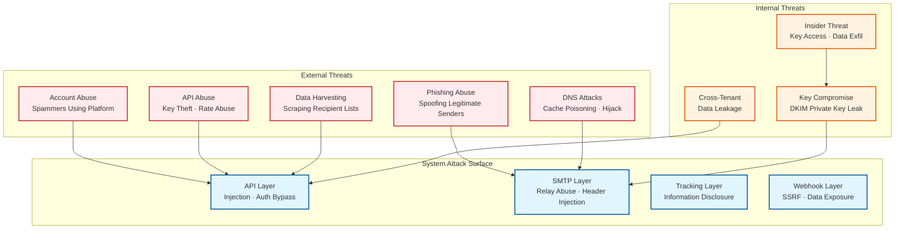
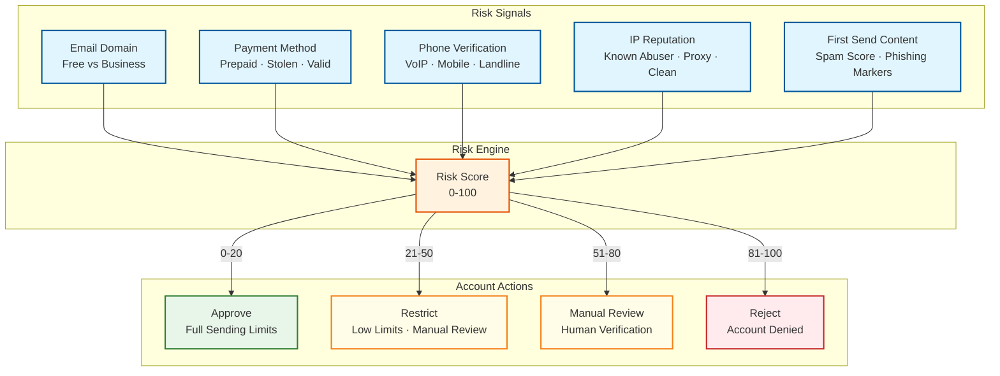

# Security & Compliance — Email Delivery System

## 1. Threat Model

### 1.1 System Threat Landscape



### 1.2 Top Attack Vectors

| # | Attack Vector | Severity | Likelihood | Description |
|---|---|---|---|---|
| 1 | **Platform abuse for spam/phishing** | Critical | High | Attackers create accounts to send spam or phishing emails using the platform's reputable IPs |
| 2 | **API key compromise** | High | Medium | Stolen API keys used to send unauthorized email, exfiltrate recipient data, or modify DNS config |
| 3 | **DKIM key compromise** | Critical | Low | Stolen DKIM private keys allow attackers to sign emails as the customer's domain |
| 4 | **SMTP header injection** | High | Medium | Malicious input in email fields (subject, headers) allows injection of additional SMTP commands |
| 5 | **Webhook SSRF** | Medium | Medium | Attacker configures webhook URL pointing to internal services, using platform as SSRF proxy |
| 6 | **Tracking URL information disclosure** | Medium | High | Predictable tracking URLs allow enumeration of message IDs, recipient emails, or engagement data |
| 7 | **Cross-tenant data access** | Critical | Low | Bug in multi-tenant isolation allows one customer to access another's templates, recipients, or analytics |
| 8 | **DNS cache poisoning** | High | Low | Attacker corrupts MX record cache, redirecting emails to attacker-controlled servers |

### 1.3 Mitigation Matrix

| Attack Vector | Prevention | Detection | Response |
|---|---|---|---|
| **Platform abuse** | Content scanning, sending limits for new accounts, phone verification, payment method validation | Bounce rate monitoring, spam trap detection, complaint rate tracking | Auto-suspend account, quarantine IP, block customer domain |
| **API key compromise** | Key hashing (store SHA-256 only), IP allowlists, scope restrictions, short-lived tokens | Unusual sending patterns, new source IPs, volume spikes | Revoke key immediately, notify customer, audit sent messages |
| **DKIM key compromise** | Keys in HSM/KMS, no key export, automated rotation every 90 days | DNS record monitoring, unexpected signing failures | Immediate key rotation, DNS record update, notify affected customers |
| **SMTP header injection** | Input sanitization, header field validation, CRLF injection filtering | WAF rules, request anomaly detection | Block request, log attempt, rate-limit source |
| **Webhook SSRF** | URL validation (block private IPs, localhost, link-local), DNS rebind protection | Monitor webhook targets for internal IP resolution | Block URL, notify customer, add to blocklist |
| **Tracking URL disclosure** | Encrypted/HMAC-signed tracking IDs (not sequential), short expiry | Access pattern anomalies, bulk tracking URL requests | Rate limit tracking endpoint, invalidate compromised tokens |
| **Cross-tenant access** | Tenant ID in every query, row-level security, API middleware tenant validation | Cross-tenant access audit logs, anomaly detection | Patch immediately, audit access logs, notify affected tenants |
| **DNS cache poisoning** | DNSSEC validation, MX record pinning for major ISPs, short cache TTL for unknown domains | MX record change monitoring, delivery anomalies | Flush DNS cache, re-validate MX records, pause delivery to affected domains |

---

## 2. Authentication & Authorization

### 2.1 API Authentication

| Method | Use Case | Security Properties |
|---|---|---|
| **API Key (Bearer token)** | Server-to-server API calls | 40-char random token; SHA-256 hashed in storage; key prefix for identification; scoped to specific permissions |
| **OAuth 2.0 (Client Credentials)** | Enterprise integrations | Client ID + secret; short-lived access tokens (1 hour); refresh token rotation |
| **SMTP AUTH (PLAIN over TLS)** | SMTP relay authentication | Username + API key; requires TLS (STARTTLS or port 465 SSL); per-connection auth |
| **Webhook signature (HMAC)** | Webhook verification (outbound) | Customer verifies inbound webhooks using shared secret + HMAC-SHA256 signature |

### 2.2 API Key Security

```
API Key Lifecycle:

1. Generation:
   - 40 bytes of cryptographic randomness (Base62 encoded)
   - Prefixed with "SG." for identification (e.g., "SG.abc123...")
   - Full key shown ONCE to user, then never again

2. Storage:
   - Key hash = SHA-256(full_key) stored in database
   - Key prefix = first 8 chars stored for identification
   - Original key is NEVER stored

3. Authentication:
   - Client sends: Authorization: Bearer SG.abc123...
   - Server computes: SHA-256(received_key)
   - Server matches: hash against stored hash

4. Scoping:
   - Scopes: mail.send, mail.read, templates.read, templates.write,
             suppressions.read, suppressions.write, stats.read, admin
   - Minimum privilege: API keys should have only required scopes

5. Rotation:
   - Old key and new key both valid during rotation window (24 hours)
   - After rotation window, old key is invalidated
   - Emergency revocation: immediate invalidation
```

### 2.3 Authorization Model (RBAC)

| Role | Permissions | Scope |
|---|---|---|
| **Owner** | Full account control, billing, user management | Account-wide |
| **Admin** | Domain management, API key creation, template management | Account-wide |
| **Developer** | Send email, manage templates, view analytics | Scoped to assigned domains |
| **Analyst** | View analytics and reports only | Read-only access |
| **Billing** | View and manage billing, invoices | Billing only |

### 2.4 Domain Authentication (Customer's Sending Domain)

| Protocol | Purpose | Verification |
|---|---|---|
| **SPF** | Authorize platform IPs to send on behalf of customer domain | Customer adds TXT record: `v=spf1 include:sendvia.platform.com ~all` |
| **DKIM** | Cryptographically sign emails with customer's domain identity | Customer adds CNAME: `s1._domainkey.example.com → s1.domainkey.platform.com` |
| **DMARC** | Policy for handling authentication failures | Customer publishes: `v=DMARC1; p=quarantine; rua=mailto:dmarc@platform.com` |
| **Return-Path** | Bounce address alignment for SPF | Platform sets Return-Path to `bounces+{token}@bounce.platform.com` (subdomain of include) |
| **BIMI** | Brand logo display in supporting clients | Customer publishes BIMI record + VMC certificate after DMARC p=reject |

---

## 3. Data Security

### 3.1 Encryption

| Data State | Method | Details |
|---|---|---|
| **In transit (API)** | TLS 1.2/1.3 | All API endpoints require HTTPS; HSTS enforced; TLS 1.0/1.1 disabled |
| **In transit (SMTP outbound)** | Opportunistic TLS / MTA-STS | STARTTLS attempted for all deliveries; MTA-STS enforced when policy published |
| **In transit (SMTP inbound)** | STARTTLS required | Platform SMTP servers require TLS for all inbound relay connections |
| **At rest (databases)** | AES-256 encryption | Transparent data encryption for all persistent stores |
| **At rest (object storage)** | AES-256-GCM | Server-side encryption for message content and attachments |
| **DKIM private keys** | HSM/KMS | Hardware security module; keys never leave the HSM; signing operations performed in HSM |
| **API keys** | SHA-256 hashing | One-way hash; original key never stored; not reversible |
| **Email addresses in suppression** | SHA-256 hashing | Suppression entries store hashed email addresses; original email not recoverable |

### 3.2 PII Data Handling

| PII Element | Storage Policy | Access Control | Retention |
|---|---|---|---|
| **Recipient email addresses** | Stored in message metadata; hashed in suppression | Account-scoped access; no cross-tenant queries | 90 days in hot store; 1 year archived |
| **Email body content** | Stored for 30-day retrieval window | Account-scoped; API key with mail.read scope required | 30 days, then permanently deleted |
| **Engagement data (opens/clicks)** | Stored with hashed recipient identifier | Account-scoped; stats.read scope required | 1 year hot; 3 years archived |
| **IP addresses (tracking)** | Logged for bot detection | Internal analytics only; not exposed in customer API | 90 days |
| **Merge field data** | Transient; used during rendering, not stored | Not persisted after template rendering | Deleted immediately after send |

### 3.3 Webhook Security

```
FUNCTION verify_webhook_signature(request, signing_secret):
    // Extract signature components
    timestamp = request.headers["X-Webhook-Timestamp"]
    provided_signature = request.headers["X-Webhook-Signature"]

    // Replay protection: reject if timestamp > 5 minutes old
    IF ABS(NOW - timestamp) > 300:
        RETURN {valid: false, reason: "timestamp_expired"}

    // Compute expected signature
    payload = timestamp + "." + request.body
    expected_signature = "sha256=" + HMAC_SHA256(signing_secret, payload)

    // Constant-time comparison (prevent timing attacks)
    IF NOT constant_time_equals(provided_signature, expected_signature):
        RETURN {valid: false, reason: "signature_mismatch"}

    RETURN {valid: true}
```

---

## 4. Anti-Abuse System

### 4.1 New Account Risk Assessment



### 4.2 Content Scanning

| Check | Method | Action on Failure |
|---|---|---|
| **Phishing URL detection** | URL reputation check against known phishing databases | Block message; alert compliance team |
| **Malware attachment scan** | Multi-engine antivirus scan for all attachments | Block message; quarantine attachment |
| **Spam score estimation** | Content analysis (Bayesian classifier, heuristic rules) | Warn if score > 5.0; block if > 8.0 |
| **Brand impersonation** | Display name vs. from-address domain mismatch detection | Flag for review; require domain verification |
| **Prohibited content** | Keyword and pattern matching for illegal content categories | Block message; escalate to legal |

### 4.3 Sending Behavior Monitoring

| Metric | Threshold | Action |
|---|---|---|
| **Bounce rate** | > 5% over 1 hour | Warning notification to customer |
| **Bounce rate** | > 10% over 1 hour | Auto-pause sending; require list cleanup |
| **Spam complaint rate** | > 0.1% over 1 day | Warning notification |
| **Spam complaint rate** | > 0.3% over 1 day | Auto-suspend account; require review |
| **Spam trap hits** | Any hit | Immediate investigation; restrict to verified lists |
| **Volume spike** | > 10x normal volume in 1 hour | Rate limit to 2x normal; require confirmation for higher |
| **New recipient ratio** | > 80% new addresses in campaign | Flag for review; may indicate purchased list |

---

## 5. Compliance Framework

### 5.1 Regulatory Requirements

| Regulation | Jurisdiction | Key Requirements | Platform Implementation |
|---|---|---|---|
| **CAN-SPAM (2003)** | United States | Physical address, unsubscribe mechanism, no deceptive headers | Mandatory footer with address; one-click unsubscribe; header validation |
| **GDPR (2018)** | European Union | Consent, right to erasure, data portability, breach notification | Consent tracking, data deletion API, export API, 72-hour breach notification |
| **CCPA/CPRA (2023)** | California, USA | Right to know, right to delete, opt-out of sale, non-discrimination | Data access API, deletion API, opt-out mechanism |
| **CASL (2014)** | Canada | Express consent required, unsubscribe within 10 days | Consent management, 10-day unsubscribe processing SLA |
| **ePrivacy Directive** | European Union | Consent for tracking (cookies and pixels) | Tracking opt-out, privacy-friendly analytics mode |
| **ISP Bulk Sender Rules** | Gmail/Yahoo/Microsoft | SPF+DKIM+DMARC, < 0.3% spam rate, one-click unsubscribe | Automated authentication, complaint monitoring, RFC 8058 List-Unsubscribe |

### 5.2 CAN-SPAM Compliance Implementation

| Requirement | Implementation |
|---|---|
| **Accurate header information** | From address must match verified domain; spoofing detection blocks mismatched headers |
| **Non-deceptive subject lines** | Content scanning flags misleading subjects; customer responsibility with guidelines |
| **Identification as advertisement** | API supports `message_type: marketing` flag; customer responsible for labeling |
| **Physical postal address** | Required field in account setup; auto-appended to marketing emails if not in template |
| **Opt-out mechanism** | Automated List-Unsubscribe header (RFC 8058); unsubscribe link in footer |
| **Honor opt-outs within 10 days** | Instant suppression on unsubscribe; real-time suppression list enforcement |
| **Monitor third-party sends** | Account-level compliance monitoring; sub-user management for agencies |

### 5.3 GDPR Compliance Implementation

| Right | Implementation | SLA |
|---|---|---|
| **Right to access (Art. 15)** | Data export API: all messages, events, and profile data for a data subject | 30 days |
| **Right to erasure (Art. 17)** | Deletion API: removes all PII for a data subject; replaces email with hash | 30 days |
| **Right to portability (Art. 20)** | Machine-readable export (JSON/CSV) of all customer data | 30 days |
| **Breach notification (Art. 33/34)** | Automated breach detection; notification pipeline to DPA and affected customers | 72 hours to DPA |
| **Data minimization (Art. 5)** | Automatic data retention enforcement; purge email content after 30 days | Continuous |
| **Consent management** | Track consent status per recipient; enforce consent check before send | Real-time |
| **DPA (Data Processing Agreement)** | Standard DPA available; custom DPA for enterprise customers | On request |

### 5.4 One-Click Unsubscribe (RFC 8058)

```
Email Headers (required for all marketing emails since 2024):

List-Unsubscribe: <mailto:unsub@bounce.platform.com?subject=unsub_token_123>,
                  <https://unsub.platform.com/u/unsub_token_123>
List-Unsubscribe-Post: List-Unsubscribe=One-Click

Flow:
1. Gmail/Yahoo display "Unsubscribe" button in UI
2. User clicks "Unsubscribe"
3. ISP sends POST to List-Unsubscribe URL with body: List-Unsubscribe=One-Click
4. Platform processes:
   a. Decode unsub_token → extract account_id, recipient_email, list_id
   b. Add to account-level suppression list
   c. Emit UNSUBSCRIBED webhook event
   d. Return 200 OK
5. All future sends to this recipient from this account are blocked
```

### 5.5 Data Residency

| Region | Data Types Stored | Regulatory Driver |
|---|---|---|
| **EU (Frankfurt)** | EU recipient data, EU customer accounts, engagement events for EU recipients | GDPR data residency requirements |
| **US (Virginia)** | US/global recipient data, US customer accounts | Default processing region |
| **APAC (Singapore)** | APAC recipient delivery logs | PDPA and regional latency requirements |

### 5.6 Audit Trail

| Event | Logged Fields | Retention |
|---|---|---|
| **API key created/revoked** | Key ID, account ID, scopes, created_by, timestamp | 7 years |
| **Domain verified/removed** | Domain, verification method, account ID, timestamp | 7 years |
| **Message sent** | Message ID, from, to (hashed), subject (hash), account, timestamp, IP | 1 year |
| **Suppression added/removed** | Email hash, reason, source, account, timestamp, actor | 7 years |
| **Consent status changed** | Recipient hash, old status, new status, source, timestamp | 7 years |
| **Account suspended/reactivated** | Account ID, reason, actor, timestamp | 7 years |
| **Data deletion request** | Request ID, data subject, scope, requester, completion timestamp | 7 years |

---

## 6. Network Security

### 6.1 SMTP Security

| Protection | Implementation |
|---|---|
| **STARTTLS** | Opportunistic encryption for all outbound connections; required for inbound relay |
| **MTA-STS** | Honor receiving domain's MTA-STS policy; enforce TLS + certificate validation when policy present |
| **DANE** | Validate TLSA records via DNSSEC; enforce certificate constraints when DANE records exist |
| **TLS Reporting** | Send TLS-RPT reports to receiving domains per RFC 8460; process inbound TLS-RPT for own domains |
| **Rate limiting** | Per-IP, per-account rate limits on inbound SMTP relay; connection-level rate limits |
| **SMTP AUTH required** | No open relay; all inbound SMTP requires authentication |

### 6.2 Infrastructure Security

| Layer | Controls |
|---|---|
| **Network** | VPC isolation, security groups (allow only ports 25/465/587/443), private subnets for backend services |
| **Compute** | Immutable infrastructure, container scanning, no SSH access (use bastion for emergency) |
| **Storage** | Encryption at rest (AES-256), access logging, no public access |
| **Secrets** | KMS for DKIM keys, secrets manager for API credentials, no plaintext secrets in code or config |
| **Monitoring** | Security event logging, anomaly detection, automated incident response |
| **Access** | MFA for all human access, least-privilege IAM, JIT access for production |

---

*Previous: [Scalability & Reliability](./05-scalability-and-reliability.md) | Next: [Observability ->](./07-observability.md)*
