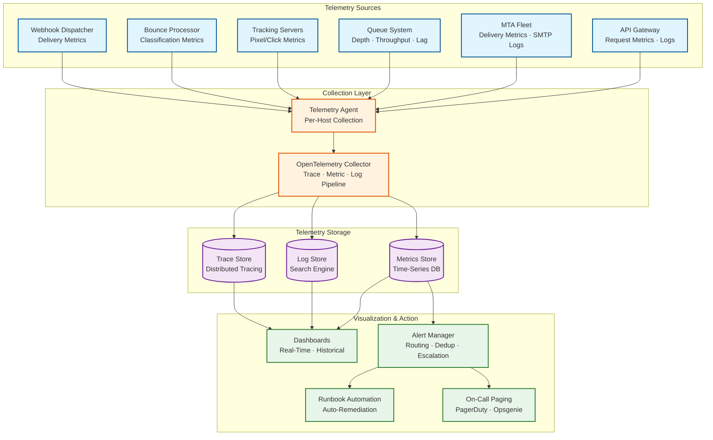

# Observability — Email Delivery System

## 1. Observability Architecture



---

## 2. Key Metrics (RED + USE)

### 2.1 RED Metrics (Request-Oriented)

| Service | Rate (R) | Error (E) | Duration (D) |
|---|---|---|---|
| **API Gateway** | Requests/sec by endpoint, method, status code | 4xx/5xx rate, validation errors, auth failures | P50/P95/P99 response latency |
| **SMTP Ingestion** | Messages/sec, connections/sec | Auth failures, invalid messages, TLS errors | Connection duration, message acceptance time |
| **Template Engine** | Renders/sec by template | Render failures, missing variables | P50/P95/P99 render time |
| **MTA Delivery** | Messages delivered/sec by ISP, by IP | Bounce rate, deferral rate, timeout rate | Time-to-deliver (acceptance → SMTP 250) |
| **Tracking Server** | Pixel requests/sec, click requests/sec | 404 errors, decoding failures | Redirect latency (P50/P95) |
| **Bounce Processor** | Bounces classified/sec | Unclassifiable bounces | Classification latency |
| **Webhook Dispatcher** | Webhooks delivered/sec by customer | Delivery failures, timeouts | P50/P95/P99 webhook delivery time |

### 2.2 USE Metrics (Resource-Oriented)

| Resource | Utilization (U) | Saturation (S) | Errors (E) |
|---|---|---|---|
| **CPU** | % utilization per service (especially template engine) | Run queue length, context switches | OOM kills, CPU throttling events |
| **Memory** | Heap usage, bloom filter size, cache utilization | GC pause frequency and duration | OOM kills, allocation failures |
| **Network** | Bandwidth (in/out) per MTA, per tracking server | TCP connection count, socket buffer usage | Connection resets, TLS errors |
| **Disk I/O** | Queue write throughput, log write throughput | I/O wait %, queue disk usage | Write failures, disk full alerts |
| **SMTP Connections** | Active connections per ISP per IP | Connection pool exhaustion, pending connections | Connection refused, timeouts |

### 2.3 Business Metrics

| Metric | Description | Granularity | Alert Threshold |
|---|---|---|---|
| **Delivery rate** | Messages delivered / messages sent | Per ISP, per IP, per account, per hour | < 95% (warn), < 90% (critical) |
| **Inbox placement rate** | Messages in inbox / messages delivered | Per ISP (via seed monitoring) | < 90% (warn), < 80% (critical) |
| **Bounce rate** | Bounces / messages sent | Per account, per campaign | > 2% (warn), > 5% (critical) |
| **Spam complaint rate** | FBL complaints / messages delivered | Per account, per IP | > 0.1% (warn), > 0.3% (critical) |
| **Open rate (human)** | Human opens / messages delivered | Per account, per campaign | Informational (no alert) |
| **Click rate (human)** | Human clicks / messages delivered | Per account, per campaign | Informational (no alert) |
| **Unsubscribe rate** | Unsubscribes / messages delivered | Per account, per campaign | > 1% (warn) |
| **Time-to-deliver (transactional)** | P95 time from API accept to SMTP delivery | Per ISP, per region | > 5s (warn), > 15s (critical) |
| **Time-to-deliver (marketing)** | Time from campaign start to last delivery | Per campaign | > 4 hours (warn) |
| **IP reputation score** | Composite reputation score per IP | Per IP, daily | < 0.5 (warn), < 0.3 (critical) |

---

## 3. Logging Strategy

### 3.1 Log Levels

| Level | Usage | Examples |
|---|---|---|
| **ERROR** | Failures requiring investigation | DKIM signing failure, suppression DB unavailable, message corruption |
| **WARN** | Degraded performance or approaching limits | IP daily limit at 90%, ISP deferral rate rising, webhook failures |
| **INFO** | Normal operations (high-value events) | Message accepted, delivered, bounced; campaign started/completed |
| **DEBUG** | Detailed troubleshooting (disabled in production) | SMTP session transcript, template rendering details, DNS lookups |

### 3.2 Structured Log Format

```
{
  "timestamp": "2026-03-09T14:30:05.123Z",
  "level": "INFO",
  "service": "mta-worker",
  "instance": "mta-east-042",
  "trace_id": "abc123def456789",
  "span_id": "span_001",
  "event": "message.delivered",
  "message_id": "msg_abc123def456",
  "account_id": "acct_xyz789",
  "domain": "example.com",
  "recipient_domain": "gmail.com",
  "sending_ip": "198.51.100.42",
  "smtp_response": "250 2.0.0 OK",
  "tls_version": "TLSv1.3",
  "tls_cipher": "TLS_AES_256_GCM_SHA384",
  "connection_reused": true,
  "queue_time_ms": 1250,
  "delivery_time_ms": 340,
  "message_size_bytes": 42560,
  "dkim_result": "pass",
  "ip_pool": "shared-warm-1"
}
```

### 3.3 What to Log

| Category | Log Events | Retention |
|---|---|---|
| **Message lifecycle** | accepted, queued, rendering, signed, sending, delivered, bounced, deferred, dropped | 90 days |
| **SMTP sessions** | Connection open/close, TLS negotiation, SMTP commands and responses | 30 days |
| **Authentication** | API auth success/failure, SMTP auth, DKIM signing results | 1 year |
| **Bounce processing** | Bounce classification, suppression additions, FBL complaints | 1 year |
| **Tracking events** | Open/click with bot classification result | 90 days |
| **Webhook delivery** | Dispatch attempts, responses, retries, failures | 90 days |
| **System events** | IP warming stage changes, reputation score updates, circuit breaker state changes | 1 year |
| **Security events** | Rate limit hits, suspicious activity, content scan results, account suspensions | 7 years |

### 3.4 Log Volume Management

| Strategy | Implementation |
|---|---|
| **Sampling** | Sample DEBUG logs at 1%; INFO logs at 100% for message lifecycle, 10% for tracking events |
| **Aggregation** | Pre-aggregate SMTP session logs per connection (not per command) |
| **Compression** | gzip compression for log shipping; columnar storage for archived logs |
| **Hot/warm/cold** | 7 days searchable (hot), 90 days indexed (warm), 1+ year archived (cold) |
| **Cardinality control** | Limit custom metadata fields to 10 per customer; cap value length at 256 chars |

---

## 4. Distributed Tracing

### 4.1 Trace Propagation

```
Message Trace (end-to-end):

Trace ID: Generated at API ingestion, propagated through entire pipeline

Span Hierarchy:
├── api.ingest (50ms)
│   ├── auth.validate (5ms)
│   ├── suppression.check (2ms)
│   └── queue.enqueue (10ms)
├── pipeline.process (120ms)
│   ├── template.render (45ms)
│   ├── personalize (15ms)
│   ├── tracking.inject (5ms)
│   └── dkim.sign (20ms)
├── queue.route (5ms)
│   └── domain.classify (1ms)
├── mta.deliver (340ms)
│   ├── dns.resolve (10ms) [cached]
│   ├── tcp.connect (30ms)
│   ├── tls.negotiate (50ms)
│   ├── smtp.session (200ms)
│   │   ├── smtp.ehlo (20ms)
│   │   ├── smtp.mail_from (20ms)
│   │   ├── smtp.rcpt_to (20ms)
│   │   └── smtp.data (140ms)
│   └── response.parse (5ms)
└── event.emit (10ms)
    ├── event.store (5ms)
    └── webhook.dispatch (async)
```

### 4.2 Key Spans to Instrument

| Span | Service | Critical Attributes |
|---|---|---|
| `api.ingest` | API Gateway | account_id, message_type, recipient_count, idempotency_key |
| `suppression.check` | Validator | email_hash, check_result, lookup_source (bloom/cache/db) |
| `template.render` | Template Engine | template_id, version, render_time_ms, merge_field_count |
| `dkim.sign` | Auth Signer | domain, selector, algorithm, key_source (cache/kms) |
| `mta.deliver` | MTA Worker | sending_ip, recipient_domain, mx_host, tls_version, smtp_response |
| `bounce.classify` | Bounce Processor | smtp_code, enhanced_code, classification, action |
| `webhook.deliver` | Webhook Dispatcher | customer_url, response_status, attempt_number, latency_ms |

### 4.3 Trace Sampling Strategy

| Traffic Type | Sample Rate | Rationale |
|---|---|---|
| **Transactional emails** | 100% | Low volume, high importance; every trace matters for SLA compliance |
| **Marketing campaign emails** | 1% | High volume; statistical sampling sufficient for pattern detection |
| **Bounced messages** | 100% | Every bounce needs investigation potential; low volume relative to successful deliveries |
| **Errors** | 100% | All errors traced for debugging; relatively rare events |
| **Tracking events** | 0.1% | Extremely high volume; traces mainly useful for click redirect latency debugging |

---

## 5. Alerting Strategy

### 5.1 Critical Alerts (Page-Worthy)

| Alert | Condition | Response Time | Runbook |
|---|---|---|---|
| **API availability < 99.9%** | Error rate > 0.1% for 5 consecutive minutes | Immediate page | Check API servers, load balancer, downstream dependencies |
| **Transactional delivery time > 30s P95** | Sustained for 10 minutes | Immediate page | Check queue depth, MTA health, ISP connectivity |
| **Suppression store unavailable** | All replicas unreachable for 1 minute | Immediate page | Fail-closed activated; check storage nodes, network |
| **Spam complaint rate > 0.3%** | Any IP exceeds threshold over 1 hour | Immediate page | Auto-pause affected IP; identify source account; investigate content |
| **DKIM signing failures > 1%** | Signing error rate sustained for 5 minutes | Immediate page | Check KMS connectivity, key validity, signer health |
| **Queue growth rate exceeds drain rate** | Queue depth increasing for 30 minutes | 15-minute response | Scale MTA fleet, check ISP blocks, verify DNS resolution |
| **IP blocked by major ISP** | Delivery rate = 0% to Gmail/Microsoft/Yahoo for 15 minutes | Immediate page | Rotate IP, contact ISP postmaster, reduce volume |

### 5.2 Warning Alerts (Non-Paging)

| Alert | Condition | Response | Escalation |
|---|---|---|---|
| **Bounce rate rising** | > 3% for any IP over 1 hour | Investigate list quality, check ISP feedback | Page if > 5% |
| **IP daily limit at 90%** | IP approaching warming limit | Monitor; no action unless limit reached | Auto-handled |
| **Webhook delivery backlog** | Backlog > 30 minutes for any customer | Check customer endpoint; circuit breaker should activate | Page if > 2 hours |
| **Template render time increasing** | P95 > 100ms (2x normal) | Check template complexity, cache hit rates | Page if > 500ms |
| **DNS cache miss rate > 10%** | Unusual number of cache misses | Check resolver health, cache size | Page if resolution failures |
| **Tracking server latency > 50ms P95** | Click redirect getting slow | Check edge server load, scale if needed | Page if > 200ms |
| **Campaign delivery slower than expected** | < 50% delivered after 2 hours | Check ISP throttling, queue routing | Page if < 25% after 4 hours |

### 5.3 Alert Routing

| Severity | Channel | Recipients | Hours |
|---|---|---|---|
| **Critical (P1)** | PagerDuty + Slack #incidents | On-call engineer + engineering manager | 24/7 |
| **High (P2)** | Slack #email-ops + ticket | Email ops team | Business hours; page after 2 hours outside |
| **Medium (P3)** | Slack #email-ops | Email ops team | Business hours only |
| **Low (P4)** | Ticket only | Assigned during sprint planning | Next sprint |

---

## 6. Dashboard Design

### 6.1 Operations Dashboard (Real-Time)

| Panel | Visualization | Data Source |
|---|---|---|
| **Messages/second** | Time series (line chart) | Send rate by type (transactional/marketing) |
| **Delivery pipeline** | Funnel chart | Accepted → Queued → Sending → Delivered/Bounced |
| **Queue depth by ISP** | Stacked bar chart | Current queue depth: gmail, outlook, yahoo, other |
| **Delivery rate by ISP** | Gauge per ISP | % delivered vs. attempted (last 1 hour) |
| **Bounce rate heatmap** | Heatmap (IP × ISP) | Bounce rate per sending IP per receiving ISP |
| **Active SMTP connections** | Gauge with threshold | Current connections vs. max per ISP |
| **Transactional delivery time** | Histogram | P50/P95/P99 delivery latency distribution |
| **Error rate** | Time series with threshold line | API errors, SMTP errors, signing errors |

### 6.2 Deliverability Dashboard (Hourly/Daily)

| Panel | Visualization | Data Source |
|---|---|---|
| **Inbox placement rate** | Line chart with ISP breakdown | Seed-based inbox monitoring results |
| **IP reputation scores** | Table with trend indicators | Composite reputation per IP (last 30 days) |
| **Complaint rate trend** | Line chart with 0.3% threshold | FBL complaints / delivered, per ISP |
| **Spam trap hits** | Counter with alert indicator | Daily trap hit count by IP |
| **Authentication pass rates** | Stacked bar (SPF/DKIM/DMARC) | Authentication results from ISP feedback |
| **Warming progress** | Progress bars per IP | Current daily volume vs. warming target |
| **ISP deferral patterns** | Heatmap (hour × ISP) | Deferral rates by time of day per ISP |

### 6.3 Customer-Facing Dashboard

| Panel | Visualization | Description |
|---|---|---|
| **Email activity** | Time series | Sent, delivered, opened, clicked, bounced over time |
| **Delivery funnel** | Funnel chart | Sent → Delivered → Opened → Clicked |
| **Bounce breakdown** | Pie chart | Hard bounce vs. soft bounce vs. block |
| **Top bounced domains** | Table | Most-bounced recipient domains with bounce reasons |
| **Engagement by device** | Donut chart | Desktop vs. mobile vs. tablet opens/clicks |
| **Suppression list growth** | Line chart | Cumulative suppression entries over time |
| **Campaign comparison** | Table | Side-by-side metrics for recent campaigns |

---

## 7. Operational Runbooks

### 7.1 ISP Blocking an IP

```
Trigger: Delivery rate = 0% to ISP for > 15 minutes

Steps:
1. VERIFY: Confirm block via SMTP response codes (e.g., 550 "blocked")
2. ASSESS: Check IP reputation metrics for the past 24 hours
   - Bounce rate? Complaint rate? Spam trap hits?
3. ISOLATE: Remove blocked IP from active pool
4. REDIRECT: Redistribute traffic to healthy IPs in pool
5. INVESTIGATE: Identify accounts with high bounce/complaint rates on this IP
6. REMEDIATE:
   - If customer issue: suspend offending account, notify compliance
   - If platform issue: review content scanning, adjust rate limits
7. RECOVER:
   - Submit delisting request to ISP postmaster
   - After delisting: re-add IP with warming schedule (start at 50% previous volume)
8. POSTMORTEM: Document root cause, timeline, impact, preventive measures
```

### 7.2 Queue Depth Growing Unbounded

```
Trigger: Queue depth increasing for > 30 minutes with no signs of draining

Steps:
1. VERIFY: Check ingestion rate vs. delivery rate
   - Is ingestion rate abnormally high? (campaign burst?)
   - Is delivery rate abnormally low? (ISP issues?)
2. TRIAGE by cause:
   a. High ingestion: Apply back-pressure; pause marketing campaigns
   b. Low delivery: Check MTA health, ISP connectivity, DNS resolution
   c. ISP-specific: Check per-ISP queue depth; isolate affected ISP
3. SCALE: Add MTA workers if delivery rate is healthy but volume exceeds capacity
4. THROTTLE: If ISP pushback, reduce per-ISP rates and wait
5. PRIORITIZE: Ensure transactional messages bypass marketing queue
6. COMMUNICATE: If SLA breach likely, proactive customer notification
7. RESOLVE: Monitor queue drain; remove scaling when depth normalizes
```

### 7.3 High Spam Complaint Rate

```
Trigger: Complaint rate > 0.3% for any IP over 1 hour

Steps:
1. IDENTIFY: Which accounts/campaigns are generating complaints?
2. PAUSE: Auto-suspend sending for offending account(s)
3. ISOLATE: Remove affected IP from active pool if reputation at risk
4. ANALYZE:
   - Is the content spammy? (review recent sends)
   - Is the list purchased? (high new-recipient ratio?)
   - Is the unsubscribe mechanism working?
5. REMEDIATE:
   - Require customer list cleanup and re-consent
   - Review content for spam triggers
   - Verify unsubscribe flow functionality
6. RESTORE: Gradually resume sending with monitoring
7. ESCALATE: If customer refuses to comply, escalate to account review
```

---

*Previous: [Security & Compliance](./06-security-and-compliance.md) | Next: [Interview Guide ->](./08-interview-guide.md)*
