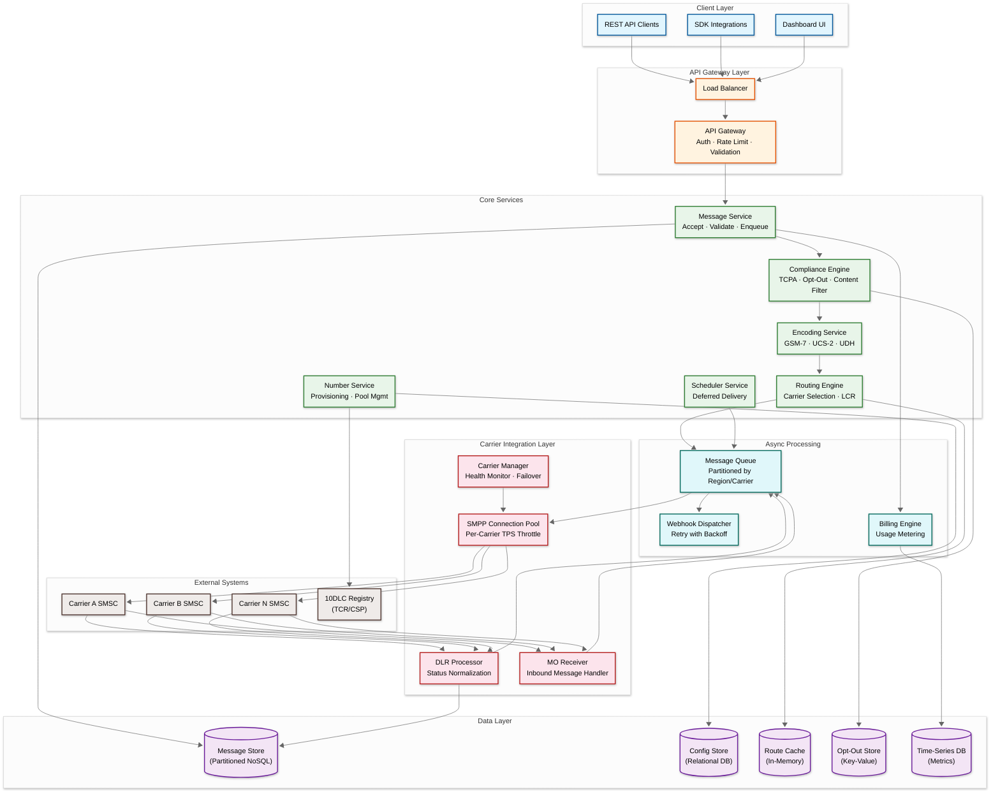
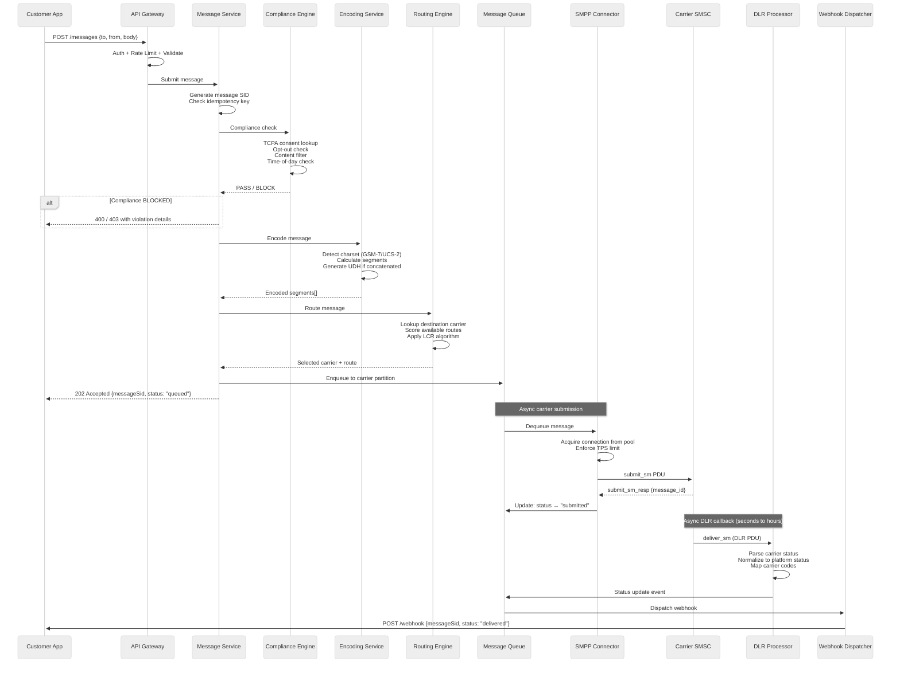
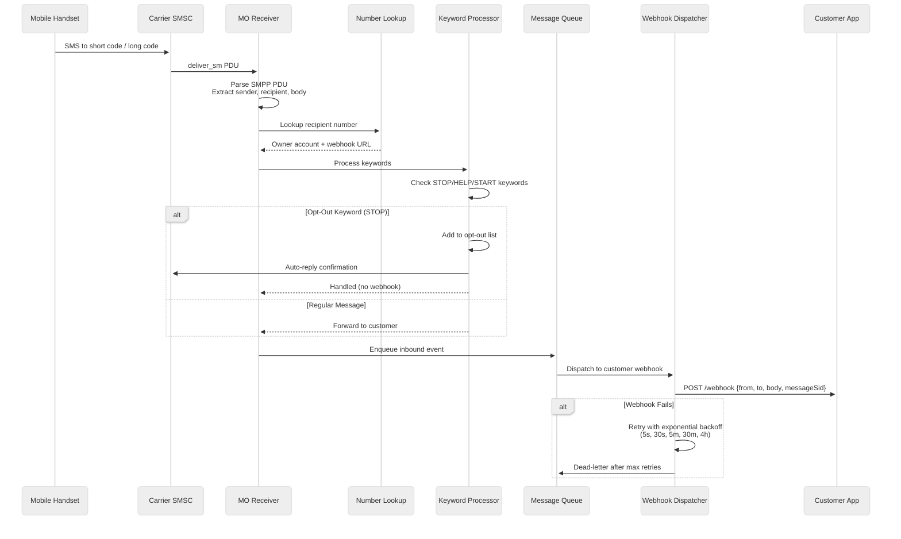
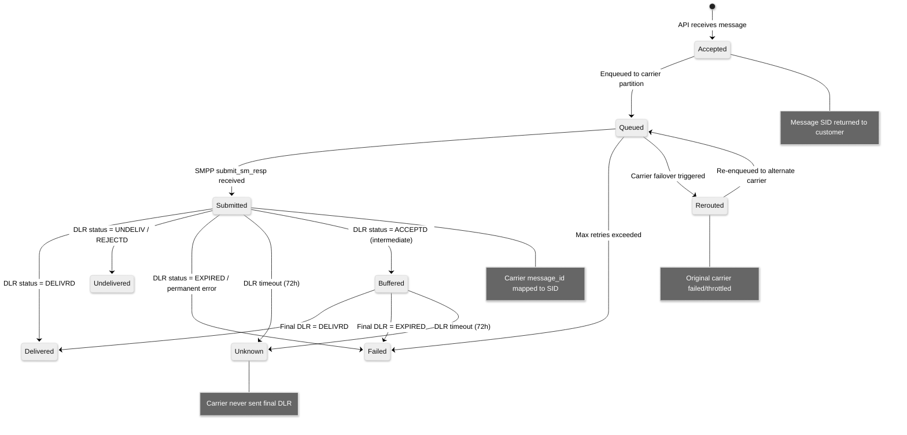
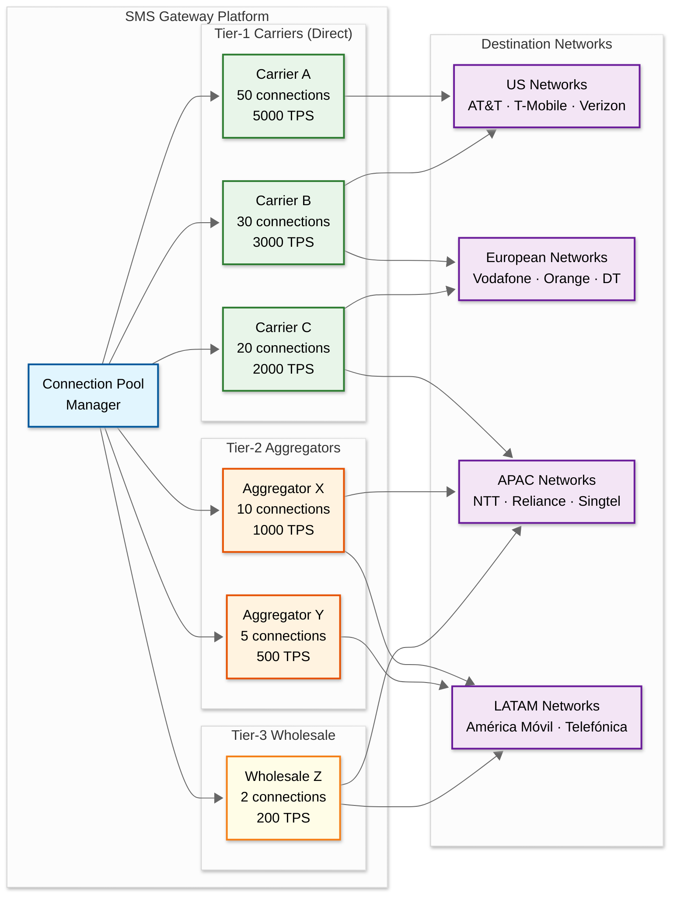
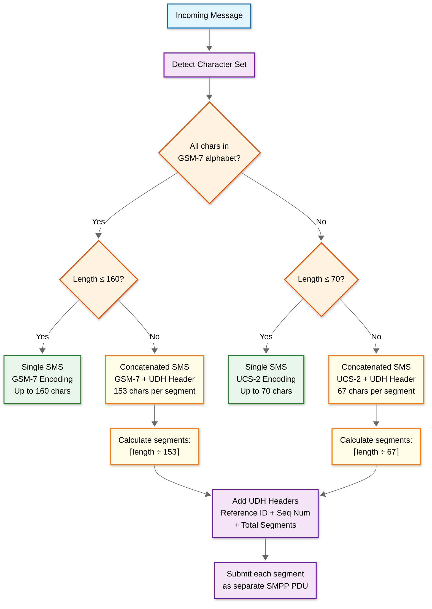
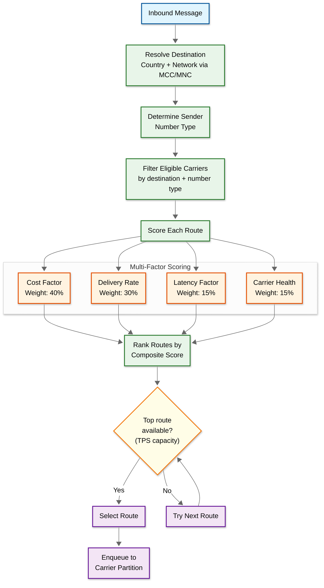

# High-Level Design — SMS Gateway

## System Architecture

---

## Key Architectural Decisions

### 1. Asynchronous Message Pipeline (Not Synchronous)

**Decision:** Messages are accepted into a durable queue before carrier submission, returning `202 Accepted` immediately.

**Why:** Carrier SMPP connections have unpredictable latency (10ms to 30s depending on carrier load). Synchronously waiting for carrier response would tie up API threads, create head-of-line blocking, and make API latency dependent on the slowest carrier. The async pattern decouples acceptance from delivery, allowing each layer to scale independently.

**Trade-off:** Customers receive a message SID immediately but must poll or use webhooks for delivery status. This is the industry standard for messaging APIs.

### 2. Carrier-Partitioned Queues (Not Destination-Partitioned)

**Decision:** Message queues are partitioned primarily by carrier, not by destination country or number.

**Why:** The critical constraint is per-carrier TPS limits. If queues were partitioned by country, a single carrier serving multiple countries could be overwhelmed by aggregate traffic from multiple queue partitions. Carrier-partitioned queues allow each consumer to enforce carrier-specific rate limits precisely. Secondary routing within each carrier partition handles geographic distribution.

**Trade-off:** Messages to the same destination may go through different queue partitions if multiple carriers serve that destination, making strict per-destination ordering harder (but ordering is rarely a requirement for SMS).

### 3. Connection Pooling with Per-Carrier TPS Enforcement

**Decision:** Each carrier connection is managed through a dedicated pool with token-bucket rate limiting at the pool level.

**Why:** Carriers enforce TPS limits strictly—exceeding them results in throttle errors (SMPP `0x00000058`), temporary bans, or connection termination. The connection pool acts as a precise throttle valve, ensuring submissions never exceed carrier-allowed rates while maximizing utilization up to the limit.

### 4. Event-Sourced Message State Machine

**Decision:** Message state transitions are modeled as an append-only event log, not mutable status fields.

**Why:** A message transitions through multiple states (accepted → queued → submitted → delivered/failed), and each transition carries different metadata (carrier response codes, DLR timestamps, retry counts). Event sourcing provides a complete audit trail, supports rebuilding current state from history, and prevents race conditions where simultaneous DLR and timeout events could corrupt a mutable status field.

### 5. Multi-Protocol Carrier Interface

**Decision:** Support SMPP v3.4/v5.0 as primary, with HTTP/HTTPS adapters for carriers offering REST APIs and SS7/SIGTRAN for legacy telco integration.

**Why:** While SMPP is the dominant protocol, modern carriers (especially cloud-native MVNOs) increasingly offer HTTP APIs. Legacy carriers in emerging markets may require SS7 integration. A protocol-agnostic carrier adapter layer isolates the core routing engine from carrier-specific protocol details.

### 6. Polyglot Persistence

**Decision:** Use different data stores for different access patterns.

| Store | Use Case | Why |
|---|---|---|
| Partitioned NoSQL | Message records, DLR history | Write-heavy, time-series partitioning, automatic TTL |
| Relational DB | Account config, number inventory, carrier config | Transactional consistency for billing and provisioning |
| In-memory cache | Route decisions, carrier scores, phone number metadata | Sub-millisecond reads for routing hot path |
| Key-value store | Opt-out lists, idempotency keys | High-throughput point lookups with TTL |
| Time-series DB | Delivery metrics, carrier health scores | Efficient aggregation for dashboards and alerting |

---

## Data Flow: Outbound Message (MT Path)

---

## Data Flow: Inbound Message (MO Path)

---

## Data Flow: DLR State Machine

---

## Architecture Pattern Checklist

| Pattern | Decision | Justification |
|---|---|---|
| **Sync vs Async** | Async (API accepts, queue delivers) | Carrier latency is unpredictable; decoupling prevents API degradation |
| **Event-driven vs Request-response** | Event-driven for message pipeline; request-response for API and number management | Message lifecycle is inherently event-driven (submit → DLR → webhook) |
| **Push vs Pull** | Push (webhooks) for status updates; pull (API) as fallback | Webhooks minimize latency; API polling provides reliability backup |
| **Stateless vs Stateful** | Stateless API/routing tiers; stateful SMPP connector tier | SMPP requires persistent TCP connections; all other tiers are stateless |
| **Write-heavy vs Read-heavy** | Write-heavy (message ingestion dominates) | 1B messages/day written; reads are primarily status checks and analytics |
| **Real-time vs Batch** | Real-time for message delivery; batch for analytics/billing reconciliation | Messages need immediate delivery; reporting can lag by minutes |
| **Edge vs Origin** | Origin-centric (no edge processing) | SMS messages are routed through centralized carrier connections, not CDN edges |

---

## Carrier Integration Topology

### Carrier Tier Strategy

| Tier | Description | When to Use | Cost | Delivery Rate |
|---|---|---|---|---|
| **Tier-1 Direct** | Direct SMPP connection to carrier SMSC | Highest-volume routes, premium delivery needed | Lowest | 97-99% |
| **Tier-2 Aggregator** | Via SMS aggregator with multi-carrier reach | Medium-volume routes, multi-country coverage | Medium | 93-96% |
| **Tier-3 Wholesale** | Bulk wholesale routes via SS7 or grey routes | Low-volume/emerging markets, cost-sensitive | Highest | 85-92% |

---

## Message Encoding Decision Flow

---

## Routing Decision Architecture

---

## Cross-Cutting Concerns

### Idempotency

Every message submission accepts an optional `idempotency_key`. The system stores a hash of `(account_id, idempotency_key)` in a key-value store with 24-hour TTL. Duplicate submissions within the window return the original `202 Accepted` response with the same message SID, preventing double-sends on API retries.

### Rate Limiting (Customer-Side)

Customer rate limits are enforced at the API gateway level using a sliding window algorithm:
- Per-account TPS limit (configurable per pricing tier)
- Per-number TPS limit (carrier-mandated)
- Per-destination daily/monthly limits (anti-spam)

### Backpressure Propagation

When carrier queues build up (carrier degradation), backpressure propagates upstream:
1. SMPP connector detects rising latency / error rates
2. Carrier health score decreases
3. Routing engine shifts traffic to alternate carriers
4. If all routes to a destination are degraded, the routing engine signals the API tier
5. API returns `429 Too Many Requests` or queues with extended delivery SLA

### Multi-Region Deployment

| Region | Role | Traffic |
|---|---|---|
| US East | Primary for Americas | 40% of global traffic |
| EU West | Primary for EMEA | 30% of global traffic |
| APAC (Singapore) | Primary for Asia-Pacific | 20% of global traffic |
| US West | Failover for US East | Standby, 10% overflow |

Messages are routed to the region closest to their destination carriers, minimizing SMPP connection latency. Customer API requests are handled by the nearest region with cross-region replication for account data.

---

*Next: [Low-Level Design ->](./03-low-level-design.md)*
