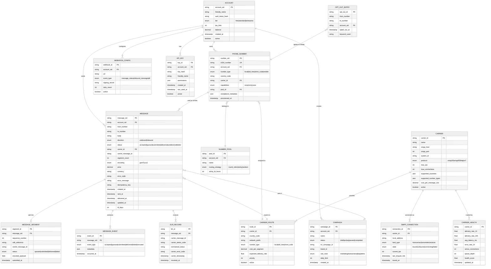

# Low-Level Design — SMS Gateway

## Data Models

### Entity Relationship Diagram



### Partitioning Strategy

| Table | Partition Key | Partition Scheme | Rationale |
|---|---|---|---|
| `MESSAGE` | `account_sid` + `created_at` | Hash(account_sid) + time-range | Even distribution across accounts; time-range enables efficient TTL purging |
| `MESSAGE_SEGMENT` | `message_sid` | Co-located with parent MESSAGE | Segments always queried with their parent message |
| `MESSAGE_EVENT` | `message_sid` | Co-located with parent MESSAGE | Event history queried per message |
| `DLR_RECORD` | `carrier_message_id` | Hash(carrier_id + carrier_message_id) | DLRs arrive keyed by carrier's own message ID; must map to our message SID |
| `OPT_OUT_ENTRY` | `from_number` + `to_number` | Hash(composite key) | Point lookups by sender-recipient pair |
| `CARRIER_HEALTH` | `carrier_id` | No partitioning (small dataset) | ~400 carriers, fits in single node |

### Indexing Strategy

| Table | Index | Type | Purpose |
|---|---|---|---|
| `MESSAGE` | `(account_sid, created_at DESC)` | Composite B-tree | Customer message history queries |
| `MESSAGE` | `(to_number, created_at DESC)` | Composite B-tree | Lookup messages to a specific recipient |
| `MESSAGE` | `(idempotency_key, account_sid)` | Unique hash | Idempotency deduplication |
| `MESSAGE` | `(status, carrier_id, created_at)` | Composite | Carrier-specific queue monitoring |
| `DLR_RECORD` | `(carrier_message_id)` | Hash | Fast DLR-to-message mapping |
| `PHONE_NUMBER` | `(e164_number)` | Unique hash | Number lookup by E.164 |
| `OPT_OUT_ENTRY` | `(from_number, to_number)` | Composite hash | Consent check on every outbound message |

---

## API Design

### REST API Endpoints

#### Send Message

```
POST /v1/messages
Authorization: Bearer {api_key}
Idempotency-Key: {client_generated_uuid}
Content-Type: application/json

Request:
{
    "to": "+14155551234",
    "from": "+14155559876",        // or messaging_service_sid for pool
    "body": "Your verification code is 123456",
    "status_callback": "https://example.com/webhook",
    "validity_period": 3600,        // seconds, optional
    "send_at": "2026-03-10T10:00:00Z",  // scheduled, optional
    "smart_encoding": true          // auto GSM-7/UCS-2, optional
}

Response (202 Accepted):
{
    "sid": "SM1234567890abcdef",
    "account_sid": "AC0987654321",
    "to": "+14155551234",
    "from": "+14155559876",
    "body": "Your verification code is 123456",
    "status": "queued",
    "direction": "outbound-api",
    "num_segments": 1,
    "encoding": "gsm7",
    "price": null,
    "error_code": null,
    "date_created": "2026-03-09T14:30:00Z",
    "date_sent": null,
    "uri": "/v1/messages/SM1234567890abcdef"
}
```

#### Get Message Status

```
GET /v1/messages/{message_sid}
Authorization: Bearer {api_key}

Response (200 OK):
{
    "sid": "SM1234567890abcdef",
    "status": "delivered",
    "error_code": null,
    "error_message": null,
    "num_segments": 1,
    "price": "0.0075",
    "currency": "USD",
    "carrier": {
        "name": "T-Mobile",
        "country": "US",
        "network_code": "310260"
    },
    "date_created": "2026-03-09T14:30:00Z",
    "date_sent": "2026-03-09T14:30:00.150Z",
    "date_delivered": "2026-03-09T14:30:01.234Z"
}
```

#### List Messages

```
GET /v1/messages?to=+14155551234&date_sent_after=2026-03-01&page_size=50
Authorization: Bearer {api_key}

Response (200 OK):
{
    "messages": [...],
    "meta": {
        "page": 0,
        "page_size": 50,
        "total": 234,
        "next_page_uri": "/v1/messages?page=1&page_size=50&page_token=xyz"
    }
}
```

#### Provision Phone Number

```
POST /v1/phone-numbers
Authorization: Bearer {api_key}

Request:
{
    "country_code": "US",
    "type": "local",
    "area_code": "415",
    "capabilities": ["sms", "mms"],
    "sms_url": "https://example.com/inbound-webhook"
}

Response (201 Created):
{
    "sid": "PN1234567890abcdef",
    "phone_number": "+14155550199",
    "type": "local",
    "country_code": "US",
    "capabilities": {"sms": true, "mms": true, "voice": false},
    "compliance": {
        "ten_dlc_status": "pending_registration",
        "brand_id": null,
        "campaign_id": null
    }
}
```

#### Register 10DLC Brand

```
POST /v1/compliance/brands
Authorization: Bearer {api_key}

Request:
{
    "company_name": "Acme Corp",
    "ein": "12-3456789",
    "vertical": "technology",
    "website": "https://acme.com",
    "contact_email": "compliance@acme.com",
    "country": "US"
}

Response (201 Created):
{
    "brand_sid": "BN1234567890abcdef",
    "tcr_brand_id": "BXXXXXX",
    "status": "pending_review",
    "vetting_score": null,
    "estimated_review_days": 5
}
```

### Webhook Payload (Status Callback)

```
POST {customer_webhook_url}
Content-Type: application/json
X-Signature: sha256={hmac_signature}
X-Timestamp: 1709995800

{
    "event_type": "message.status_updated",
    "message_sid": "SM1234567890abcdef",
    "account_sid": "AC0987654321",
    "to": "+14155551234",
    "from": "+14155559876",
    "status": "delivered",
    "error_code": null,
    "error_message": null,
    "timestamp": "2026-03-09T14:30:01.234Z",
    "carrier_info": {
        "mcc": "310",
        "mnc": "260"
    }
}
```

### API Versioning Strategy

- URL-based versioning: `/v1/messages`, `/v2/messages`
- Breaking changes require new version; additive changes allowed in current version
- Minimum 12-month deprecation window for old versions
- `Sunset` header on deprecated versions with retirement date

---

## Core Algorithms

### 1. Least-Cost Routing (LCR) Algorithm

```
FUNCTION route_message(message, eligible_routes, carrier_health_cache):
    // Step 1: Filter eligible routes
    filtered_routes = []
    FOR each route IN eligible_routes:
        IF route.country_code == message.destination_country
           AND route.number_type == message.sender_number_type
           AND route.active == TRUE
           AND carrier_health_cache[route.carrier_id].health_score > HEALTH_THRESHOLD:
            filtered_routes.APPEND(route)

    IF filtered_routes IS EMPTY:
        RAISE NoRouteAvailableError(message.destination_country)

    // Step 2: Score each route (multi-factor)
    scored_routes = []
    FOR each route IN filtered_routes:
        health = carrier_health_cache[route.carrier_id]

        // Normalize each factor to 0-1 scale
        cost_score = 1.0 - normalize(route.cost_per_segment, min_cost, max_cost)
        delivery_score = health.delivery_rate_24h
        latency_score = 1.0 - normalize(health.avg_latency_ms, 0, MAX_ACCEPTABLE_LATENCY)
        health_score = health.health_score

        // Weighted composite score
        composite = (COST_WEIGHT * cost_score) +          // 0.40
                    (DELIVERY_WEIGHT * delivery_score) +   // 0.30
                    (LATENCY_WEIGHT * latency_score) +     // 0.15
                    (HEALTH_WEIGHT * health_score)          // 0.15

        // Apply account-specific overrides
        IF message.account.preferred_carriers CONTAINS route.carrier_id:
            composite = composite * 1.1  // 10% boost

        scored_routes.APPEND({route, composite})

    // Step 3: Sort by score descending
    scored_routes.SORT_BY(composite, DESC)

    // Step 4: Select highest-scoring route with available TPS capacity
    FOR each {route, score} IN scored_routes:
        IF carrier_tps_limiter[route.carrier_id].try_acquire():
            RETURN route

    // Step 5: All routes at capacity - queue with delay or reject
    IF message.priority == "high":
        RETURN scored_routes[0].route  // Queue even if over TPS (will be throttled)
    ELSE:
        RAISE CarrierCapacityExhaustedError()
```

**Complexity:** O(R log R) where R = number of eligible routes (typically 2-10 per destination)

### 2. SMPP Connection Pool Management

```
CLASS SmppConnectionPool:
    PROPERTIES:
        carrier_id: string
        min_connections: int
        max_connections: int
        connections: PriorityQueue<SmppConnection>  // sorted by current load
        tps_limiter: TokenBucket
        health_monitor: HealthChecker

    FUNCTION acquire_connection():
        // Try to get a healthy connection with lowest current load
        WHILE connections.NOT_EMPTY:
            conn = connections.PEEK()  // lowest load connection
            IF conn.state == BOUND AND conn.current_tps < conn.max_tps:
                connections.UPDATE_PRIORITY(conn, conn.current_tps + 1)
                RETURN conn
            ELIF conn.state == FAILED:
                connections.REMOVE(conn)
                SPAWN reconnect_async(conn)
            ELSE:
                // Connection at capacity, try next
                CONTINUE

        // All connections busy - can we create more?
        IF connections.SIZE < max_connections:
            new_conn = create_connection()
            connections.ADD(new_conn)
            RETURN new_conn

        // At max connections, all busy
        RAISE ConnectionPoolExhausted(carrier_id)

    FUNCTION release_connection(conn):
        connections.UPDATE_PRIORITY(conn, conn.current_tps - 1)

    FUNCTION submit_message(conn, message):
        // Enforce carrier TPS limit at pool level
        IF NOT tps_limiter.try_acquire():
            RAISE ThrottleError(carrier_id)

        pdu = build_submit_sm_pdu(message)
        response = conn.send(pdu, timeout=SMPP_TIMEOUT)

        IF response.command_status == 0x00000000:  // ESME_ROK
            RETURN response.message_id
        ELIF response.command_status == 0x00000058:  // ESME_RTHROTTLED
            tps_limiter.reduce_rate(0.9)  // Back off 10%
            RAISE ThrottleError(carrier_id)
        ELIF response.command_status == 0x00000045:  // ESME_RSUBMITFAIL
            health_monitor.record_failure(carrier_id)
            RAISE SubmissionError(response.command_status)
        ELSE:
            RAISE SmppError(response.command_status)

    FUNCTION health_check():
        // Periodic enquire_link on all connections
        FOR each conn IN connections:
            IF now() - conn.last_enquire_link > ENQUIRE_LINK_INTERVAL:
                TRY:
                    conn.send_enquire_link(timeout=5s)
                    conn.last_enquire_link = now()
                CATCH TimeoutError:
                    conn.state = FAILED
                    SPAWN reconnect_async(conn)

    FUNCTION reconnect_async(conn):
        FOR attempt IN 1..MAX_RECONNECT_ATTEMPTS:
            WAIT exponential_backoff(attempt, base=1s, max=60s)
            TRY:
                conn.bind_transceiver(system_id, password)
                conn.state = BOUND
                conn.last_enquire_link = now()
                health_monitor.record_recovery(carrier_id)
                RETURN
            CATCH ConnectionError:
                CONTINUE
        // Max attempts exhausted
        health_monitor.record_carrier_down(carrier_id)
        ALERT("Carrier {carrier_id} connection permanently failed")
```

### 3. GSM-7 Encoding and Concatenation

```
FUNCTION encode_and_segment(message_body, encoding_hint):
    // Step 1: Detect encoding
    IF encoding_hint == "auto" OR encoding_hint IS NULL:
        encoding = detect_encoding(message_body)
    ELSE:
        encoding = encoding_hint

    // Step 2: Determine segment boundaries
    IF encoding == GSM7:
        single_limit = 160
        concat_limit = 153  // 7 bytes reserved for UDH
        encoded_body = gsm7_encode(message_body)
    ELSE:  // UCS2
        single_limit = 70
        concat_limit = 67   // 6 bytes reserved for UDH (3 octets)
        encoded_body = ucs2_encode(message_body)

    // Step 3: Single message - no concatenation needed
    IF LENGTH(message_body) <= single_limit:
        RETURN [{
            payload: encoded_body,
            udh: NULL,
            encoding: encoding,
            sequence: 1,
            total: 1
        }]

    // Step 4: Split into concatenated segments
    segments = []
    total_segments = CEIL(LENGTH(message_body) / concat_limit)

    IF total_segments > 255:
        RAISE MessageTooLongError("Max 255 segments")

    reference_id = generate_random_byte()  // 8-bit reference for UDH

    FOR i IN 0..total_segments-1:
        start = i * concat_limit
        end = MIN(start + concat_limit, LENGTH(message_body))
        segment_text = message_body[start:end]

        udh = build_udh_header(
            information_element_id = 0x00,  // Concatenated SM, 8-bit ref
            reference_number = reference_id,
            total_parts = total_segments,
            part_number = i + 1
        )

        IF encoding == GSM7:
            payload = gsm7_encode(segment_text)
        ELSE:
            payload = ucs2_encode(segment_text)

        segments.APPEND({
            payload: payload,
            udh: udh,
            encoding: encoding,
            sequence: i + 1,
            total: total_segments
        })

    RETURN segments

FUNCTION detect_encoding(text):
    // GSM-7 basic character set (128 chars) + extension table
    GSM7_BASIC = "@ £$¥èéùìòÇ\nØø\rÅåΔ_ΦΓΛΩΠΨΣΘΞ ÆæßÉ..."
    GSM7_EXTENSION = "^{}\\[~]|€"

    FOR each char IN text:
        IF char NOT IN GSM7_BASIC AND char NOT IN GSM7_EXTENSION:
            RETURN UCS2

    RETURN GSM7
```

### 4. DLR Correlation and Status Normalization

```
FUNCTION process_dlr(carrier_id, dlr_pdu):
    // Step 1: Extract carrier message ID from DLR
    carrier_msg_id = extract_message_id(dlr_pdu)
    carrier_status = extract_status(dlr_pdu)
    carrier_error = extract_error_code(dlr_pdu)

    // Step 2: Correlate to our message SID
    message_sid = lookup_message_by_carrier_id(carrier_id, carrier_msg_id)
    IF message_sid IS NULL:
        // Orphaned DLR - carrier sent DLR for unknown message
        log_warning("Orphaned DLR", carrier_id, carrier_msg_id)
        metrics.increment("dlr.orphaned", carrier=carrier_id)
        RETURN

    // Step 3: Normalize carrier-specific status to platform status
    normalized_status = normalize_carrier_status(carrier_id, carrier_status)

    // Step 4: Validate state transition
    current_status = get_current_status(message_sid)
    IF NOT is_valid_transition(current_status, normalized_status):
        log_warning("Invalid DLR transition",
                    message_sid, current_status, normalized_status)
        metrics.increment("dlr.invalid_transition", carrier=carrier_id)
        RETURN

    // Step 5: Persist DLR and update message status
    TRANSACTION:
        store_dlr_record(message_sid, carrier_msg_id,
                         carrier_status, normalized_status, carrier_error)
        update_message_status(message_sid, normalized_status)
        append_message_event(message_sid, normalized_status, {
            carrier_status: carrier_status,
            carrier_error: carrier_error,
            carrier_timestamp: dlr_pdu.timestamp
        })

    // Step 6: Dispatch webhook
    enqueue_webhook(message_sid, normalized_status)

    // Step 7: Update carrier health metrics
    IF normalized_status == "delivered":
        carrier_health.record_delivery(carrier_id)
    ELIF normalized_status IN ["failed", "undelivered"]:
        carrier_health.record_failure(carrier_id, carrier_error)


FUNCTION normalize_carrier_status(carrier_id, raw_status):
    // Each carrier has different status codes
    // Maintain a per-carrier mapping table
    mapping = CARRIER_STATUS_MAPS[carrier_id]

    IF raw_status IN mapping:
        RETURN mapping[raw_status]

    // Common SMPP DLR status codes (fallback)
    MATCH raw_status:
        "DELIVRD"  -> RETURN "delivered"
        "ACCEPTD"  -> RETURN "submitted"   // intermediate, not final
        "UNDELIV"  -> RETURN "undelivered"
        "REJECTD"  -> RETURN "failed"
        "EXPIRED"  -> RETURN "failed"
        "DELETED"  -> RETURN "failed"
        "UNKNOWN"  -> RETURN "unknown"
        DEFAULT    -> RETURN "unknown"


FUNCTION is_valid_transition(current, new_status):
    // Define allowed state transitions
    VALID_TRANSITIONS = {
        "accepted":    ["queued", "failed"],
        "queued":      ["submitted", "failed", "rerouted"],
        "rerouted":    ["queued"],
        "submitted":   ["delivered", "undelivered", "failed", "unknown"],
        "delivered":   [],        // terminal state
        "undelivered": [],        // terminal state
        "failed":      [],        // terminal state
        "unknown":     ["delivered", "failed"]  // late DLR can resolve unknown
    }
    RETURN new_status IN VALID_TRANSITIONS[current]
```

### 5. Number Pool Sticky Assignment

```
FUNCTION select_sender_from_pool(pool, recipient_number):
    // Check for existing sticky assignment
    sticky_key = HASH(pool.pool_id, recipient_number)
    cached_sender = cache.GET(sticky_key)

    IF cached_sender IS NOT NULL:
        // Verify the number is still in the pool and active
        IF cached_sender IN pool.numbers AND cached_sender.active:
            RETURN cached_sender
        ELSE:
            cache.DELETE(sticky_key)

    // No sticky assignment - select based on pool strategy
    MATCH pool.routing_strategy:
        "sticky":
            // Consistent hash to pick a number, then stick to it
            index = consistent_hash(recipient_number, pool.numbers.SIZE)
            selected = pool.numbers[index]

        "round_robin":
            // Atomic counter per pool
            counter = atomic_increment(pool.pool_id + ":rr_counter")
            index = counter MOD pool.numbers.SIZE
            selected = pool.numbers[index]

        "random":
            index = random(0, pool.numbers.SIZE - 1)
            selected = pool.numbers[index]

    // Store sticky assignment
    cache.SET(sticky_key, selected, TTL=pool.sticky_ttl_hours * 3600)

    RETURN selected
```

---

## Data Retention Policy

| Data Category | Hot Storage | Warm Storage | Cold Archive | Total Retention |
|---|---|---|---|---|
| Message records | 30 days (NVMe) | 90 days (SSD) | 7 years (object storage) | 7 years (regulatory) |
| Message body content | 30 days | Purged | Purged | 30 days (privacy) |
| DLR records | 30 days | 90 days | 1 year | 1 year |
| Event log | 30 days | 1 year | 7 years | 7 years (audit trail) |
| Opt-out lists | Indefinite (active) | N/A | N/A | Indefinite (compliance) |
| Carrier health metrics | 7 days (1-min granularity) | 90 days (1-hr rollups) | 1 year (daily rollups) | 1 year |
| Billing records | 90 days | 2 years | 7 years | 7 years (financial) |

---

## SMPP Protocol Detail

### PDU Structure for submit_sm

```
SMPP submit_sm PDU:
┌──────────────────────────────────────┐
│ Header (16 bytes)                    │
│   command_length:    4 bytes         │
│   command_id:        0x00000004      │
│   command_status:    0x00000000      │
│   sequence_number:   4 bytes         │
├──────────────────────────────────────┤
│ Mandatory Parameters                 │
│   service_type:      "" (default)    │
│   source_addr_ton:   0x01 (intl)    │
│   source_addr_npi:   0x01 (E.164)   │
│   source_addr:       "+14155559876"  │
│   dest_addr_ton:     0x01 (intl)    │
│   dest_addr_npi:     0x01 (E.164)   │
│   destination_addr:  "+14155551234"  │
│   esm_class:         0x40 (UDH)     │
│   protocol_id:       0x00           │
│   priority_flag:     0x00           │
│   schedule_delivery:  "" or time    │
│   validity_period:   "000001000000"  │
│   registered_delivery: 0x01 (DLR)   │
│   data_coding:       0x00 (GSM7)    │
│   sm_length:         varies         │
│   short_message:     encoded body    │
├──────────────────────────────────────┤
│ Optional TLVs                        │
│   message_payload:   for long msgs   │
│   sar_msg_ref_num:   concat ref      │
│   sar_total_segments: total parts    │
│   sar_segment_seqnum: part number    │
└──────────────────────────────────────┘
```

### SMPP Connection Lifecycle

```
FUNCTION smpp_bind_transceiver(host, port, system_id, password):
    // 1. Establish TCP connection (with TLS if supported)
    socket = tcp_connect(host, port, timeout=10s)
    IF carrier.supports_tls:
        socket = tls_wrap(socket)

    // 2. Send bind_transceiver PDU
    bind_pdu = {
        command_id: 0x00000009,      // bind_transceiver
        system_id: system_id,
        password: password,
        system_type: "SMPP",
        interface_version: 0x34,     // SMPP v3.4
        addr_ton: 0x00,
        addr_npi: 0x00,
        address_range: ""
    }
    send_pdu(socket, bind_pdu)

    // 3. Wait for bind_transceiver_resp
    response = receive_pdu(socket, timeout=30s)
    IF response.command_status != 0x00000000:
        RAISE BindError(response.command_status)

    // 4. Start enquire_link heartbeat
    SPAWN heartbeat_loop(socket, interval=30s)

    // 5. Start DLR receiver
    SPAWN dlr_receiver_loop(socket)

    RETURN SmppConnection(socket, system_id)


FUNCTION heartbeat_loop(socket, interval):
    WHILE connection.active:
        WAIT interval
        TRY:
            send_enquire_link(socket)
            receive_enquire_link_resp(socket, timeout=10s)
        CATCH TimeoutError:
            connection.state = FAILED
            TRIGGER reconnect
```

---

*Next: [Deep Dive & Bottlenecks ->](./04-deep-dive-and-bottlenecks.md)*
