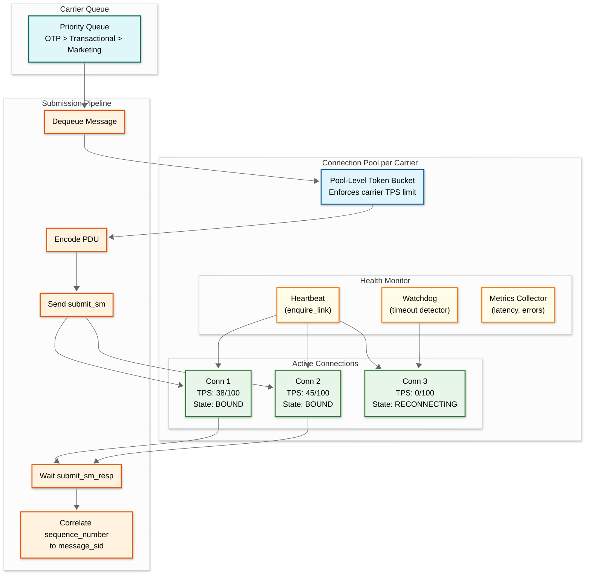
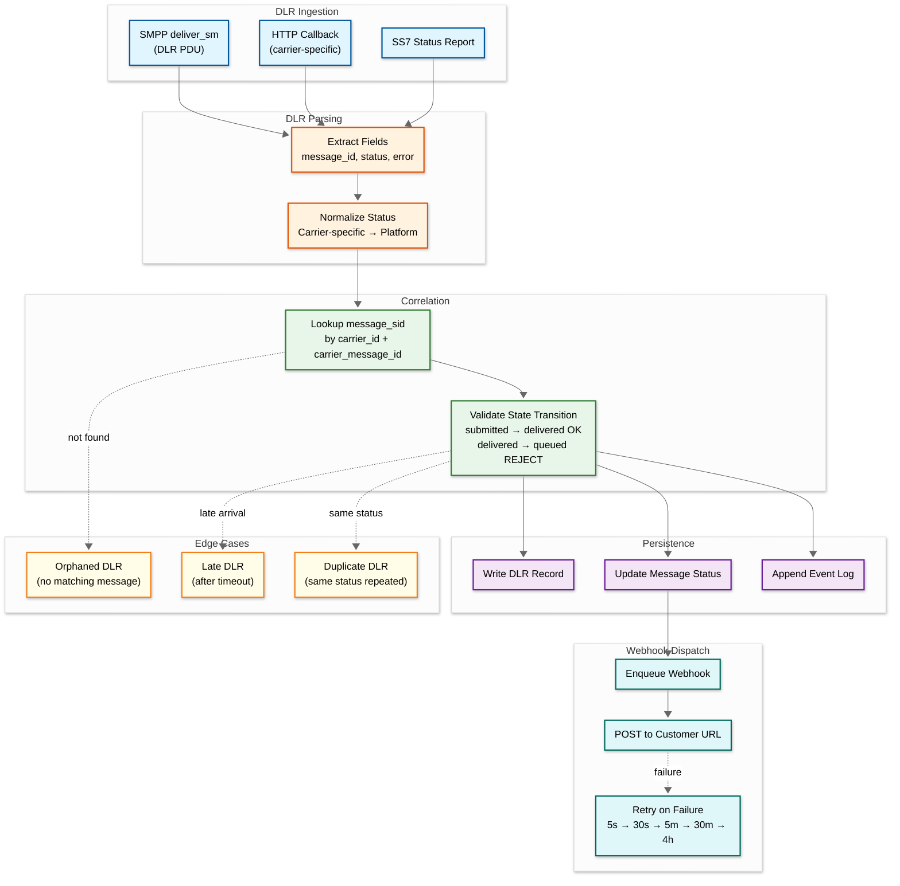
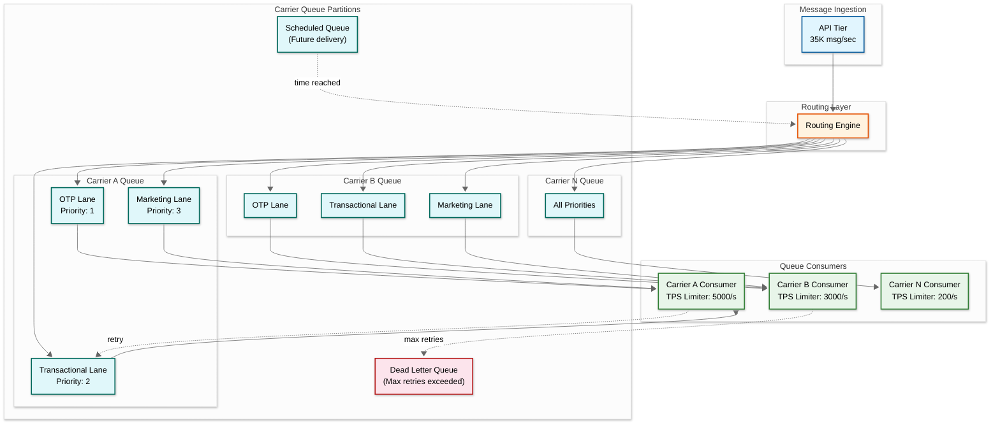

# Deep Dive & Bottlenecks — SMS Gateway

## Critical Component 1: SMPP Connection Manager

### Why This Is Critical

The SMPP connection manager is the single most critical component in the entire SMS gateway. It maintains persistent TCP connections to hundreds of carrier SMSCs, each with unique TPS limits, authentication credentials, protocol quirks, and health characteristics. Every outbound message must flow through one of these connections, and every DLR arrives through them. A failure in connection management doesn't just degrade performance—it stops message delivery entirely for affected carriers.

### How It Works Internally



**Connection-to-sequence-number correlation** is the core challenge. SMPP is an asynchronous protocol: the client sends `submit_sm` with a `sequence_number` and the server responds with `submit_sm_resp` containing the same `sequence_number` plus a `message_id`. Multiple `submit_sm` PDUs can be in flight on the same connection simultaneously (window size). The connection manager must maintain an in-flight map of `{sequence_number → message_sid}` per connection, with timeout-based cleanup for unresponsive carriers.

**Window management** controls how many unacknowledged PDUs are in flight per connection. A typical window size is 10-50. If a carrier slows down, the window fills and the connection cannot accept new submissions until responses arrive—this is the natural backpressure mechanism. The pool distributes load across connections to maximize aggregate throughput.

### Failure Modes

| Failure | Detection | Impact | Mitigation |
|---|---|---|---|
| **Connection drop (TCP RST)** | Immediate socket error | Messages in-flight have unknown status | Reconnect; in-flight messages get timeout status after 30s |
| **Silent connection death** | enquire_link timeout (>10s) | Messages submitted but never acknowledged | enquire_link every 30s; 2 missed = connection marked dead |
| **Carrier throttling (0x58)** | SMPP response code | Reduced throughput for that carrier | Exponential backoff on TPS; route overflow to alternate carrier |
| **Carrier bind rejection** | bind_resp error code | Cannot establish connection | Alert; check credentials; escalate to carrier ops |
| **TLS certificate expiry** | Handshake failure | New connections fail | Monitor cert expiry; auto-renewal where possible |
| **Carrier SMSC overload** | Rising latency (>5s per PDU) | Queue buildup, eventual timeout | Reduce TPS proactively; shift traffic to alternates |
| **Protocol version mismatch** | Unexpected PDU format | Garbled messages or DLRs | Per-carrier protocol version config; PDU validation |

### Recovery Strategy

```
FUNCTION handle_connection_failure(carrier_id, conn, failure_type):
    // 1. Mark connection as failed
    conn.state = FAILED
    pool = get_pool(carrier_id)

    // 2. Reassign in-flight messages
    in_flight = conn.get_in_flight_messages()
    FOR each msg IN in_flight:
        IF msg.elapsed_time > SMPP_TIMEOUT:
            mark_message_status(msg.sid, "unknown")
            enqueue_for_retry(msg, delay=30s)
        ELSE:
            // Message might still be processed by carrier
            schedule_dlr_timeout_check(msg.sid, timeout=300s)

    // 3. Attempt reconnection with exponential backoff
    SPAWN reconnect_with_backoff(carrier_id, conn, {
        initial_delay: 1s,
        max_delay: 120s,
        max_attempts: 50,
        jitter: TRUE
    })

    // 4. If pool has no healthy connections, trigger carrier failover
    IF pool.healthy_connections_count == 0:
        carrier_health.mark_down(carrier_id)
        routing_engine.trigger_failover(carrier_id)
        ALERT_CRITICAL("Carrier {carrier_id} all connections down")
```

---

## Critical Component 2: DLR Correlation Engine

### Why This Is Critical

Delivery reports (DLRs) are the only visibility customers have into whether their messages were actually delivered. The DLR correlation engine must map carrier-specific message IDs back to platform message SIDs, normalize hundreds of carrier-specific status codes into a consistent platform status set, handle DLRs that arrive out of order, late (hours or days after submission), or never at all, and trigger customer webhook callbacks. Failures in DLR processing don't lose messages but make the platform appear unreliable—customers see messages stuck in "submitted" indefinitely.

### How It Works Internally



### The Carrier Message ID Problem

The most insidious challenge in DLR correlation is that **carrier message IDs are not globally unique**. Carrier A might assign message_id "12345" to one message, and Carrier B assigns "12345" to a completely different message. The correlation key must be `(carrier_id, carrier_message_id)`, not just `carrier_message_id`.

Worse, some carriers recycle message IDs. A carrier processing 100K messages/sec with a 32-bit message ID space will wrap around in ~12 hours. The correlation lookup must be time-bounded—only match DLRs against messages submitted to that carrier within the last N hours.

Some carriers return message IDs in `submit_sm_resp` in decimal format but send DLRs with the same ID in hexadecimal format. The normalization layer must know, per carrier, whether to expect format mismatches and apply the correct transformation.

### DLR Timeout Strategy

```
FUNCTION manage_dlr_timeouts():
    // Run periodically (every 5 minutes)
    threshold = now() - DLR_TIMEOUT_WINDOW  // typically 72 hours

    // Find messages stuck in "submitted" beyond timeout
    stuck_messages = query(
        "SELECT message_sid FROM messages
         WHERE status = 'submitted'
         AND sent_at < {threshold}
         AND dlr_timeout_checked = FALSE"
    )

    FOR each msg IN stuck_messages:
        // Check if we have any DLR at all
        dlr_count = count_dlrs(msg.message_sid)

        IF dlr_count == 0:
            // No DLR ever received - mark as unknown
            update_status(msg.message_sid, "unknown")
            record_metric("dlr.timeout.no_dlr", carrier=msg.carrier_id)
        ELSE:
            // Have intermediate DLR but no final status
            last_dlr = get_latest_dlr(msg.message_sid)
            IF last_dlr.normalized_status IN ["submitted", "buffered"]:
                update_status(msg.message_sid, "unknown")
                record_metric("dlr.timeout.no_final", carrier=msg.carrier_id)

        msg.dlr_timeout_checked = TRUE
        enqueue_webhook(msg.message_sid, "unknown")
```

---

## Critical Component 3: Message Queue with Carrier-Aware Backpressure

### Why This Is Critical

The message queue sits between the rate at which customers submit messages (bursty, unpredictable) and the rate at which carriers accept them (fixed TPS limits). This buffer must absorb traffic spikes without losing messages, enforce per-carrier ordering where needed (concatenated segments must arrive in order), manage priority lanes (OTP messages bypass marketing queues), and propagate backpressure when carrier queues grow too deep—signaling the API tier to slow down or reroute.

### Queue Architecture



### Priority Queue Strategy

| Priority | Message Type | Max Queue Depth | Max Wait Time | Retry Policy |
|---|---|---|---|---|
| 1 (Highest) | OTP / 2FA codes | 1,000 | 10 seconds | 2 retries, 1s delay |
| 2 | Transactional (order confirmations, alerts) | 10,000 | 60 seconds | 3 retries, 5s delay |
| 3 | Marketing / promotional | 100,000 | 300 seconds | 5 retries, 30s delay |

**Why per-carrier, per-priority queues:** A single carrier queue with priority ordering would starve marketing messages during OTP spikes. Separate priority lanes with weighted fair queuing ensure that 70% of carrier TPS goes to the highest-priority non-empty lane, 25% to the next, and 5% to the lowest. OTP messages effectively preempt marketing but never completely starve it.

### Backpressure Propagation

```
FUNCTION evaluate_backpressure(carrier_id):
    queue = get_carrier_queue(carrier_id)
    health = get_carrier_health(carrier_id)

    // Level 1: Queue growth warning
    IF queue.depth > WARN_THRESHOLD:  // 50% of max
        metrics.record("queue.warning", carrier=carrier_id)
        // No action yet - queue is absorbing normally

    // Level 2: Queue approaching capacity
    IF queue.depth > CRITICAL_THRESHOLD:  // 80% of max
        // Reduce routing score for this carrier
        routing_engine.penalize_carrier(carrier_id, penalty=0.5)
        // Shift new messages to alternate carriers
        metrics.record("queue.critical", carrier=carrier_id)

    // Level 3: Queue full
    IF queue.depth >= MAX_DEPTH:
        // Stop routing to this carrier entirely
        routing_engine.disable_carrier(carrier_id,
            reason="queue_full", auto_reenable=TRUE)
        // Overflow messages re-routed via alternate carriers
        metrics.record("queue.overflow", carrier=carrier_id)
        ALERT_WARNING("Carrier {carrier_id} queue full - routing disabled")

    // Level 4: All carriers for destination at capacity
    IF all_carriers_for_destination_at_capacity(destination):
        // Propagate backpressure to API tier
        api_gateway.set_rate_limit(destination, reduced_tps)
        // Return 429 to customers with Retry-After header
        metrics.record("destination.backpressure", dest=destination)
```

---

## Concurrency & Race Conditions

### Race Condition 1: Simultaneous DLR and Timeout

**Scenario:** A DLR timeout timer fires at the exact moment a late DLR arrives. Both processes try to update the message status simultaneously—the timeout wants to set "unknown" while the DLR wants to set "delivered."

**Solution:** Optimistic concurrency control with version numbers. Each message status update includes a `version` field. The update query is:
```
UPDATE messages
SET status = {new_status}, version = version + 1
WHERE message_sid = {sid} AND version = {expected_version}
```
If the update affects 0 rows, the version has changed (another process won). The loser re-reads the current state and only retries if its state transition is still valid (e.g., "delivered" should always win over "unknown").

### Race Condition 2: Duplicate API Submissions

**Scenario:** A network timeout causes the customer to retry a message submission. The first request was processed but the response was lost. Two messages enter the pipeline for the same idempotency key.

**Solution:** Idempotency key check uses an atomic `SET-IF-NOT-EXISTS` operation in the cache layer. The first submission sets `(account_id:idempotency_key) → message_sid` with 24-hour TTL. The second submission finds the key exists and returns the original message_sid without creating a new message.

### Race Condition 3: Concurrent Opt-Out and Message Submission

**Scenario:** A recipient sends "STOP" at the same moment the customer sends a marketing message to that recipient. The opt-out is processing but hasn't been recorded when the compliance check runs.

**Solution:** Write-through pattern for opt-outs. The MO processor writes to both the cache and the database atomically before acknowledging the deliver_sm. The compliance engine checks the cache first (sub-millisecond), falling back to the database. Even a small propagation delay (< 10ms) could allow a race. Acceptable trade-off: the opt-out is effective "as soon as practicable" rather than "instantaneously," which is legally sufficient under TCPA (10 business day compliance window).

### Race Condition 4: SMPP Window Overflow

**Scenario:** Multiple threads attempt to submit messages on the same SMPP connection simultaneously, pushing the in-flight window beyond the carrier's limit.

**Solution:** A semaphore per connection sized to the window limit. Each submission thread must acquire a permit from the semaphore before sending a PDU. The permit is released when the `submit_sm_resp` is received (or on timeout). This naturally throttles per-connection concurrency to the window size.

---

## Bottleneck Analysis

### Bottleneck 1: Carrier TPS Limits

**Problem:** The fundamental throughput constraint is carrier-imposed TPS limits. A carrier allowing 1,000 TPS cannot be exceeded regardless of how much infrastructure the platform adds. During traffic spikes (flash sales, emergency alerts), the carrier becomes the bottleneck.

**Impact:** Messages queue behind the carrier's TPS limit, increasing latency. OTP messages (time-sensitive) may expire waiting in queue behind marketing messages.

**Mitigation:**
1. **Priority queuing**: OTP messages jump ahead of marketing in per-carrier queues
2. **Multiple carriers per destination**: Spread load across 3-5 carriers for major markets
3. **Pre-negotiated burst capacity**: Enterprise SLAs with carriers for temporary TPS increases
4. **Proactive throttling**: During known traffic events, pre-warm carrier partnerships and request temporary TPS increases
5. **Queue depth monitoring**: Alert when carrier queues exceed 5x normal depth

### Bottleneck 2: DLR Correlation Lookup

**Problem:** At 51K DLRs/sec, each requiring a `(carrier_id, carrier_message_id) → message_sid` lookup, the correlation store is under extreme read pressure. Cache misses hit the database, which can saturate at high throughput.

**Impact:** Slow DLR processing means delayed webhook callbacks to customers. Under extreme load, DLR processing falls behind real-time, creating a growing backlog.

**Mitigation:**
1. **Write-through cache**: Every `submit_sm_resp` that returns a `carrier_message_id` immediately populates the cache with `(carrier_id, carrier_message_id) → message_sid`. DLRs almost always hit cache (99%+ hit rate for DLRs arriving within minutes).
2. **TTL-based eviction**: Cache entries expire after 72 hours (DLR timeout window), preventing unbounded growth.
3. **Batch DLR processing**: During backlog situations, DLRs are processed in micro-batches of 100, reducing per-DLR overhead.
4. **Dedicated DLR database shard**: DLR correlation data on a separate shard from message records, isolating workloads.

### Bottleneck 3: Webhook Dispatch Fan-Out

**Problem:** At 28K webhooks/sec, each requiring an outbound HTTP request to a customer endpoint, the webhook dispatcher becomes a major source of outbound connections. Customer endpoints may be slow (>5s response) or down entirely, consuming dispatcher threads.

**Impact:** Slow customer endpoints cause thread pool exhaustion, delaying webhook delivery for all customers. Retry storms during customer outages amplify the problem.

**Mitigation:**
1. **Async I/O**: Non-blocking HTTP client with connection pooling per customer endpoint. No thread-per-request.
2. **Per-customer rate limiting**: Maximum 100 concurrent webhook requests per customer. Excess queued with backpressure signal.
3. **Circuit breaker per endpoint**: After 5 consecutive failures, circuit opens for 60 seconds. Webhooks queued during open state.
4. **Exponential backoff**: Retry schedule: 5s → 30s → 5m → 30m → 4h → DLQ. Maximum 5 retry attempts.
5. **Webhook status dashboard**: Customers can see their endpoint health and clear DLQ manually.

### Bottleneck 4: Hot Number Syndrome

**Problem:** A single phone number (e.g., a popular short code for bank OTPs) may receive millions of messages per hour. All messages to/from this number concentrate on a single database shard if the partition key includes the number.

**Impact:** Uneven shard load. The hot shard's write throughput limits the system's effective capacity for that number.

**Mitigation:**
1. **Partition by message_sid (random)**: Primary partition is by `hash(message_sid)`, distributing writes evenly regardless of number popularity.
2. **Secondary index**: Number-based lookups use a secondary index that's read-optimized (eventual consistency acceptable for queries).
3. **Number-specific caching**: Hot numbers' recent message lists cached in memory with short TTL.
4. **Write batching**: For bulk campaigns to the same number, batch database writes every 100ms.

---

## Failure Scenario Walkthroughs

### Scenario: Carrier Goes Down During Peak Hours

```
Timeline:
T+0s:    Carrier A stops responding to submit_sm PDUs
T+5s:    In-flight window fills on all connections (no submit_sm_resp returning)
T+10s:   enquire_link fails on connections 1-3
T+15s:   Connection pool marks all Carrier A connections as FAILED
T+15s:   Carrier health score drops below threshold (0.2 → 0.0)
T+16s:   Routing engine automatically disables Carrier A
T+16s:   New messages to Carrier A's destinations rerouted to Carrier B/C
T+17s:   In-flight messages from Carrier A enter timeout state
T+45s:   Timed-out messages marked "unknown", scheduled for retry on Carrier B
T+60s:   Reconnection attempts begin with exponential backoff
T+120s:  Customer webhook callbacks for "unknown" status dispatched
T+300s:  If Carrier A still down, alert escalated to on-call
T+600s:  Retry attempts for timed-out messages re-submitted via Carrier B
T+3600s: Carrier A reconnects; health score gradually recovers
T+7200s: Traffic gradually shifts back to Carrier A as health score rises
```

### Scenario: Flash Sale Causes 10x Traffic Spike

```
Timeline:
T+0s:    Customer sends 10M messages via batch API for flash sale
T+1s:    API tier absorbs burst (stateless, auto-scales)
T+2s:    Routing engine distributes across 5 carriers
T+5s:    Carrier queues begin growing (ingest > carrier TPS)
T+10s:   Marketing priority lanes at 50% depth → warning alert
T+30s:   Marketing lanes at 80% depth → routing engine penalizes affected carriers
T+60s:   OTP messages from other customers still flowing at priority 1
T+120s:  Marketing queue stabilizes as carrier TPS catches up
T+300s:  Queue depth begins declining
T+900s:  Queues return to normal levels
T+1800s: All flash sale messages submitted to carriers
```

**Key outcome:** OTP and transactional messages from all customers remain unaffected. Marketing messages are delayed but not lost. No 429 errors returned to OTP senders.

---

*Next: [Scalability & Reliability ->](./05-scalability-and-reliability.md)*
